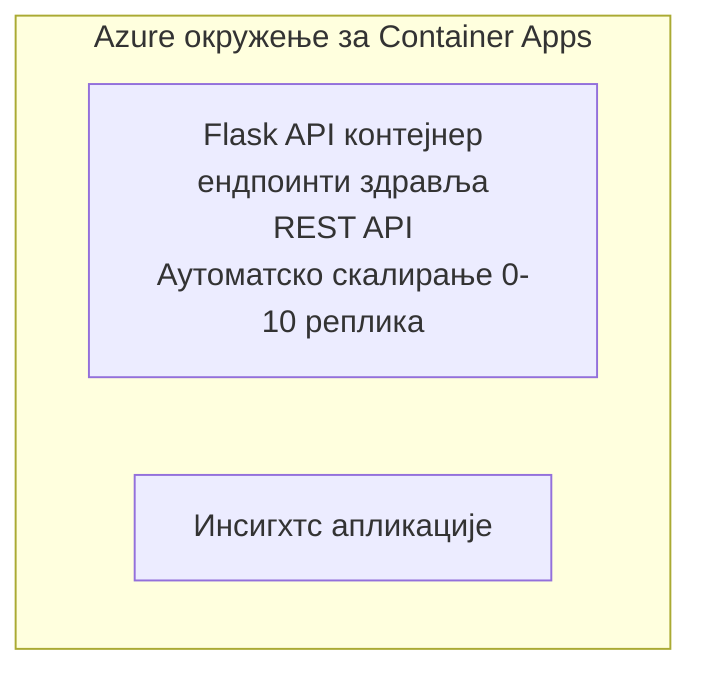

# Једноставан Flask API - пример Container App-а

**Путања учења:** Почетник ⭐ | **Време:** 25-35 минута | **Трошкови:** $0-15/месечно

Комплетан, радни Python Flask REST API деплојован на Azure Container Apps коришћењем Azure Developer CLI (azd). Овај пример демонстрира деплој контејнера, аутоматско скалирање и основе мониторинга.

## 🎯 Шта ћете научити

- Деплојујте контейнеризовану Python апликацију на Azure
- Конфигуришите аутоматско скалирање са скалирањем до нуле
- Имплементирајте health probe-ове и readiness провере
- Надгледајте логове и метрике апликације
- Користите Azure Developer CLI за брз деплој

## 📦 Шта је укључено

✅ **Flask Application** - Комплетан REST API са CRUD операцијама (`src/app.py`)  
✅ **Dockerfile** - Конфигурација контејнера спремна за продукцију  
✅ **Bicep Infrastructure** - Container Apps окружење и деплој API-ја  
✅ **AZD Configuration** - Подешавање за деплој једном командом  
✅ **Health Probes** - Конфигурисане liveness и readiness провере  
✅ **Auto-scaling** - 0-10 реплика на основу HTTP оптерећења  

## Архитектура



## Преуслови

### Потребно
- **Azure Developer CLI (azd)** - [Водич за инсталацију](https://learn.microsoft.com/azure/developer/azure-developer-cli/install-azd)
- **Azure subscription** - [Бесплатан налог](https://azure.microsoft.com/free/)
- **Docker Desktop** - [Инсталирај Docker](https://www.docker.com/products/docker-desktop/) (за локално тестирање)

### Проверите претпоставке

```bash
# Проверите верзију azd (потребна је 1.5.0 или новија)
azd version

# Проверите пријаву у Azure
azd auth login

# Проверите Docker (опционо, за локално тестирање)
docker --version
```

## ⏱️ Време деплоја

| Phase | Duration | What Happens |
|-------|----------|--------------||
| Environment setup | 30 seconds | Create azd environment |
| Build container | 2-3 minutes | Docker build Flask app |
| Provision infrastructure | 3-5 minutes | Create Container Apps, registry, monitoring |
| Deploy application | 2-3 minutes | Push image and deploy to Container Apps |
| **Total** | **8-12 minutes** | Complete deployment ready |

## Брзи почетак

```bash
# Идите до примера
cd examples/container-app/simple-flask-api

# Иницијализујте окружење (изаберите јединствено име)
azd env new myflaskapi

# Разместите све (инфраструктура + апликација)
azd up
# Биће вам затражено да:
# 1. Изаберите Azure претплату
# 2. Изаберите локацију (нпр. eastus2)
# 3. Сачекајте 8-12 минута за распоређивање

# Добијте URL вашег API-ја
azd env get-values

# Тестирајте API
curl $(azd env get-value API_ENDPOINT)/health
```

**Очекивани излаз:**
```json
{
  "status": "healthy",
  "timestamp": "2025-11-19T10:30:00Z",
  "service": "simple-flask-api",
  "version": "1.0.0"
}
```

## ✅ Потврдите деплој

### Корак 1: Проверите статус деплоја

```bash
# Погледајте распоређене услуге
azd show

# Очекивани излаз показује:
# - Услуга: api
# - Крајња тачка: https://ca-api-[env].xxx.azurecontainerapps.io
# - Статус: Покренут
```

### Корак 2: Тестирајте API крајње тачке

```bash
# Добијање API крајње тачке
API_URL=$(azd env get-value API_ENDPOINT)

# Провера здравља
curl $API_URL/health

# Провера коренске крајње тачке
curl $API_URL/

# Креирање ставке
curl -X POST $API_URL/api/items \
  -H "Content-Type: application/json" \
  -d '{"name": "Test Item", "description": "My first item"}'

# Добијање свих ставки
curl $API_URL/api/items
```

**Критеријуми успеха:**
- ✅ Здравствена крајња тачка враћа HTTP 200
- ✅ Коренска крајња тачка приказује информације о API-ју
- ✅ POST креира ставку и враћа HTTP 201
- ✅ GET враћа креиране ставке

### Корак 3: Прегледајте логове

```bash
# Стримујте логове уживо помоћу azd monitor
azd monitor --logs

# Или користите Azure CLI:
az containerapp logs show --name api --resource-group $RG_NAME --follow

# Требало би да видите:
# - Gunicorn поруке о покретању
# - HTTP логови захтева
# - Логови информација о апликацији
```

## Структура пројекта

```
simple-flask-api/
├── azure.yaml              # AZD configuration
├── infra/
│   ├── main.bicep         # Main infrastructure
│   ├── main.parameters.json
│   └── app/
│       ├── container-env.bicep
│       └── api.bicep
└── src/
    ├── app.py             # Flask application
    ├── requirements.txt
    └── Dockerfile
```

## API крајње тачке

| Endpoint | Method | Description |
|----------|--------|-------------|
| `/health` | GET | Провера здравља |
| `/api/items` | GET | Прикажи све ставке |
| `/api/items` | POST | Креирај нову ставку |
| `/api/items/{id}` | GET | Добиј одређену ставку |
| `/api/items/{id}` | PUT | Ажурирај ставку |
| `/api/items/{id}` | DELETE | Обриши ставку |

## Конфигурација

### Променљиве окружења

```bash
# Подеси прилагођену конфигурацију
azd env set PORT 8000
azd env set LOG_LEVEL info
azd env set MAX_REPLICAS 20
```

### Конфигурација скалирања

API се аутоматски скалира на основу HTTP саобраћаја:
- **Минимум реплика**: 0 (скалира се на нулу када је неактивно)
- **Максимум реплика**: 10
- **Конкурентних захтева по реплици**: 50

## Развој

### Покрени локално

```bash
# Инсталирајте зависности
cd src
pip install -r requirements.txt

# Покрените апликацију
python app.py

# Тестирајте локално
curl http://localhost:8000/health
```

### Изградња и тестирање контејнера

```bash
# Изгради Докер слику
docker build -t flask-api:local ./src

# Покрени контејнер локално
docker run -p 8000:8000 flask-api:local

# Тестирај контејнер
curl http://localhost:8000/health
```

## Деплој

### Потпуни деплој

```bash
# Разместити инфраструктуру и апликацију
azd up
```

### Деплој само кода

```bash
# Деплојирајте само код апликације (инфраструктура остаје непромењена)
azd deploy api
```

### Ажурирај конфигурацију

```bash
# Ажурирајте променљиве окружења
azd env set API_KEY "new-api-key"

# Поново распоредите са новом конфигурацијом
azd deploy api
```

## Мониторинг

### Прегледајте логове

```bash
# Стримујте уживо логове помоћу azd monitor
azd monitor --logs

# Или користите Azure CLI за Container Apps:
az containerapp logs show --name api --resource-group $RG_NAME --follow

# Прикажите последњих 100 редова
az containerapp logs show --name api --resource-group $RG_NAME --tail 100
```

### Праћење метрика

```bash
# Отворите Azure Monitor контролну таблу
azd monitor --overview

# Прикажите одређене метрике
az monitor metrics list \
  --resource $(azd show --output json | jq -r '.services.api.resourceId') \
  --metric "Requests,ResponseTime"
```

## Тестирање

### Провера здравља

```bash
curl $(azd show --output json | jq -r '.services.api.endpoint')/health
```

Очекивани одговор:
```json
{
  "status": "healthy",
  "timestamp": "2025-11-19T10:30:00Z"
}
```

### Креирање ставке

```bash
curl -X POST $(azd show --output json | jq -r '.services.api.endpoint')/api/items \
  -H "Content-Type: application/json" \
  -d '{"name": "Test Item", "description": "A test item"}'
```

### Добиј све ставке

```bash
curl $(azd show --output json | jq -r '.services.api.endpoint')/api/items
```

## Оптимизација трошкова

Овај деплој користи скалирање до нуле, па плаћате само када API обрађује захтеве:

- **Трошак у неактивности**: ~ $0/месечно (скалирано на нулу)
- **Активни трошак**: ~ $0.000024/секунду по реплици
- **Очекивани месечни трошак** (лака употреба): $5-15

### Даље смањење трошкова

```bash
# Смањити максималан број реплика за развојно окружење
azd env set MAX_REPLICAS 3

# Користити краће време неактивности
azd env set SCALE_TO_ZERO_TIMEOUT 300  # 5 минута
```

## Решавање проблема

### Контејнер се неће покренути

```bash
# Проверите логове контејнера користећи Azure CLI
az containerapp logs show --name api --resource-group $RG_NAME --tail 100

# Проверите да ли се Docker слика гради локално
docker build -t test ./src
```

### API није доступан

```bash
# Проверите да ли је ingress спољашњи
az containerapp show --name api --resource-group rg-simple-flask-api \
  --query properties.configuration.ingress.external
```

### Високо време одговора

```bash
# Провери коришћење ЦПУ/меморије
az monitor metrics list \
  --resource $(azd show --output json | jq -r '.services.api.resourceId') \
  --metric "CPUPercentage,MemoryPercentage"

# Повећај ресурсе ако је потребно
az containerapp update --name api --resource-group rg-simple-flask-api \
  --cpu 1.0 --memory 2Gi
```

## Чишћење

```bash
# Обришите све ресурсе
azd down --force --purge
```

## Следећи кораци

### Проширите овај пример

1. **Додајте базу података** - Интегришите Azure Cosmos DB или SQL базу података
   ```bash
   # Додајте Cosmos DB модул у infra/main.bicep
   # Ажурирајте app.py са везом за базу података
   ```

2. **Додајте аутентификацију** - Имплементирајте Microsoft Entra ID или API кључеве
   ```python
   # Додај међуслој за аутентификацију у app.py
   from functools import wraps
   ```

3. **Подесите CI/CD** - Радни ток GitHub Actions
   ```yaml
   # Create .github/workflows/deploy.yml
   name: Deploy to Azure
   on: [push]
   ```

4. **Додајте Managed Identity** - Обезбедите приступ Azure услугама
   ```bicep
   # Update infra/app/api.bicep
   identity: { type: 'SystemAssigned' }
   ```

### Повезани примери

- **[Апликација са базом података](../../../../../examples/database-app)** - Потпун пример са SQL базом података
- **[Микросервиси](../../../../../examples/container-app/microservices)** - Архитектура са више сервиса
- **[Водич за Container Apps](../README.md)** - Сви обрасци за контејнере

### Ресурси за учење

- 📚 [Курс AZD за почетнике](../../../README.md) - Главна страница курса
- 📚 [Обрасци за Container Apps](../README.md) - Више образаца деплоја
- 📚 [Галерија AZD шаблона](https://azure.github.io/awesome-azd/) - Шаблони заједнице

## Додатни ресурси

### Документација
- **[Документација за Flask](https://flask.palletsprojects.com/)** - Водич за Flask фрејмворк
- **[Azure Container Apps](https://learn.microsoft.com/azure/container-apps/)** - Званична Azure документација
- **[Azure Developer CLI](https://learn.microsoft.com/azure/developer/azure-developer-cli/)** - Референца за azd команде

### Туторијали
- **[Container Apps Quickstart](https://learn.microsoft.com/azure/container-apps/quickstart-portal)** - Деплојујте вашу прву апликацију
- **[Python on Azure](https://learn.microsoft.com/azure/developer/python/)** - Водич за развој у Python-у
- **[Bicep Language](https://learn.microsoft.com/azure/azure-resource-manager/bicep/)** - Инфраструктура као код

### Алати
- **[Azure Portal](https://portal.azure.com)** - Управљајте ресурсима визуелно
- **[VS Code Azure Extension](https://marketplace.visualstudio.com/items?itemName=ms-azuretools.vscode-azurecontainerapps)** - Интеграција у IDE

---

**🎉 Честитамо!** Деплојовали сте Flask API спреман за продукцију на Azure Container Apps са аутоматским скалирањем и мониторингом.

**Имaтe питања?** [Отворите issue](https://github.com/microsoft/AZD-for-beginners/issues) или погледајте [ЧПП](../../../resources/faq.md)

---

<!-- CO-OP TRANSLATOR DISCLAIMER START -->
**Изјава о одрицању одговорности**:
Овај документ је преведен коришћењем услуге за аутоматски превод [Co-op Translator](https://github.com/Azure/co-op-translator). Иако тежимо тачности, имајте у виду да аутоматски преводи могу садржати грешке или нетачности. Оригинални документ на његовом изворном језику треба сматрати ауторитативним извором. За критичне информације препоручује се професионални људски превод. Нисмо одговорни за било каква неспоразума или погрешна тумачења која произилазе из коришћења овог превода.
<!-- CO-OP TRANSLATOR DISCLAIMER END -->