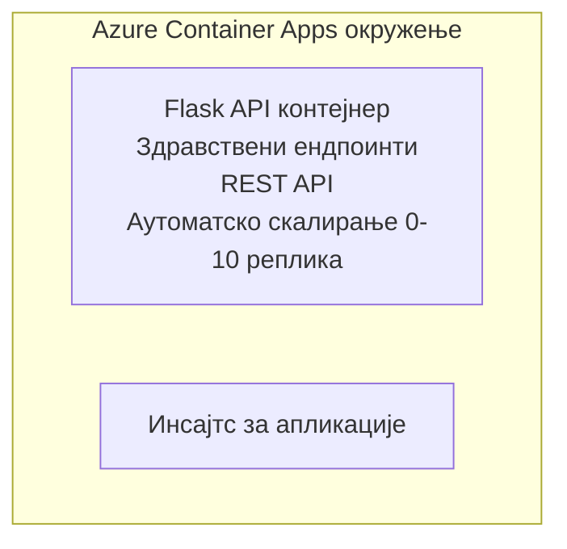

# Simple Flask API - Container App Example

**Learning Path:** Почетник ⭐ | **Time:** 25-35 minutes | **Cost:** $0-15/month

Потпуни, радни Python Flask REST API размењен на Azure Container Apps користећи Azure Developer CLI (azd). Овај пример демонстрира разврставање контејнера, аутоматско скалирање и основе мониторинга.

## 🎯 What You'll Learn

- Размештање контейнеризоване Python апликације на Azure
- Конфигурисање аутоматског скалирања са скалирањем на нулу
- Имплементација health probes и readiness провера
- Праћење логова и метрика апликације
- Коришћење Azure Developer CLI за брзо размењивање

## 📦 What's Included

✅ **Flask Application** - Потпун REST API са CRUD операцијама (`src/app.py`)  
✅ **Dockerfile** - Подешавање контејнера спремно за продукцију  
✅ **Bicep Infrastructure** - Container Apps окружење и размењивање APIја  
✅ **AZD Configuration** - Подешавање за једнокомандно размењивање  
✅ **Health Probes** - Конфигурисане liveness и readiness провере  
✅ **Auto-scaling** - 0-10 реплика на основу HTTP оптерећења  

## Architecture


## Prerequisites

### Required
- **Azure Developer CLI (azd)** - [Упутство за инсталацију](https://learn.microsoft.com/azure/developer/azure-developer-cli/install-azd)
- **Azure subscription** - [Free account](https://azure.microsoft.com/free/)
- **Docker Desktop** - [Install Docker](https://www.docker.com/products/docker-desktop/) (for local testing)

### Verify Prerequisites

```bash
# Провери верзију azd (потребна 1.5.0 или новија)
azd version

# Провери пријаву у Azure
azd auth login

# Провери Docker (опционо, за локално тестирање)
docker --version
```

## ⏱️ Deployment Timeline

| Phase | Duration | What Happens |
|-------|----------|--------------||
| Environment setup | 30 seconds | Create azd environment |
| Build container | 2-3 minutes | Docker build Flask app |
| Provision infrastructure | 3-5 minutes | Create Container Apps, registry, monitoring |
| Deploy application | 2-3 minutes | Push image and deploy to Container Apps |
| **Total** | **8-12 minutes** | Complete deployment ready |

## Quick Start

```bash
# Пређите на пример
cd examples/container-app/simple-flask-api

# Иницијализујте окружење (изаберите јединствено име)
azd env new myflaskapi

# Разместите све (инфраструктуру + апликацију)
azd up
# Бићете упитани да:
# 1. Изаберите Azure претплату
# 2. Изаберите локацију (нпр. eastus2)
# 3. Сачекајте 8-12 минута за распоређивање

# Добијте ваш API ендпоинт
azd env get-values

# Тестирајте API
curl $(azd env get-value API_ENDPOINT)/health
```

**Expected Output:**
```json
{
  "status": "healthy",
  "timestamp": "2025-11-19T10:30:00Z",
  "service": "simple-flask-api",
  "version": "1.0.0"
}
```

## ✅ Verify Deployment

### Step 1: Check Deployment Status

```bash
# Преглед распоређених сервиса
azd show

# Очекивани излаз приказује:
# - Сервис: api
# - Ендпоинт: https://ca-api-[env].xxx.azurecontainerapps.io
# - Статус: Покренуто
```

### Step 2: Test API Endpoints

```bash
# Добиј API крајњу тачку
API_URL=$(azd env get-value API_ENDPOINT)

# Провера здравља
curl $API_URL/health

# Провера коренске крајње тачке
curl $API_URL/

# Креирај ставку
curl -X POST $API_URL/api/items \
  -H "Content-Type: application/json" \
  -d '{"name": "Test Item", "description": "My first item"}'

# Добиј све ставке
curl $API_URL/api/items
```

**Success Criteria:**
- ✅ Health endpoint returns HTTP 200
- ✅ Root endpoint shows API information
- ✅ POST creates item and returns HTTP 201
- ✅ GET returns created items

### Step 3: View Logs

```bash
# Стримујте уживо логове користећи azd monitor
azd monitor --logs

# Или користите Azure CLI:
az containerapp logs show --name api --resource-group $RG_NAME --follow

# Требало би да видите:
# - поруке о покретању Gunicorn-а
# - логови HTTP захтева
# - логови информација апликације
```

## Project Structure

```
simple-flask-api/
├── azure.yaml              # AZD configuration
├── infra/
│   ├── main.bicep         # Main infrastructure
│   ├── main.parameters.json
│   └── app/
│       ├── container-env.bicep
│       └── api.bicep
└── src/
    ├── app.py             # Flask application
    ├── requirements.txt
    └── Dockerfile
```

## API Endpoints

| Endpoint | Method | Description |
|----------|--------|-------------|
| `/health` | GET | Health check |
| `/api/items` | GET | List all items |
| `/api/items` | POST | Create new item |
| `/api/items/{id}` | GET | Get specific item |
| `/api/items/{id}` | PUT | Update item |
| `/api/items/{id}` | DELETE | Delete item |

## Configuration

### Environment Variables

```bash
# Постави прилагођену конфигурацију
azd env set PORT 8000
azd env set LOG_LEVEL info
azd env set MAX_REPLICAS 20
```

### Scaling Configuration

The API automatically scales based on HTTP traffic:
- **Min Replicas**: 0 (scales to zero when idle)
- **Max Replicas**: 10
- **Concurrent Requests per Replica**: 50

## Development

### Run Locally

```bash
# Инсталирајте зависности
cd src
pip install -r requirements.txt

# Покрените апликацију
python app.py

# Тестирајте локално
curl http://localhost:8000/health
```

### Build and Test Container

```bash
# Изградити Докер слику
docker build -t flask-api:local ./src

# Покренути контејнер локално
docker run -p 8000:8000 flask-api:local

# Тестирати контејнер
curl http://localhost:8000/health
```

## Deployment

### Full Deployment

```bash
# Разместити инфраструктуру и апликацију
azd up
```

### Code-Only Deployment

```bash
# Размештати само код апликације (инфраструктура непромењена)
azd deploy api
```

### Update Configuration

```bash
# Ажурирајте променљиве окружења
azd env set API_KEY "new-api-key"

# Поново распоредите са новом конфигурацијом
azd deploy api
```

## Monitoring

### View Logs

```bash
# Стримујте уживо логове користећи azd monitor
azd monitor --logs

# Или користите Azure CLI за Container Apps:
az containerapp logs show --name api --resource-group $RG_NAME --follow

# Прикажите последњих 100 редова
az containerapp logs show --name api --resource-group $RG_NAME --tail 100
```

### Monitor Metrics

```bash
# Отворите Azure Monitor контролну таблу
azd monitor --overview

# Прикажите одређене метрике
az monitor metrics list \
  --resource $(azd show --output json | jq -r '.services.api.resourceId') \
  --metric "Requests,ResponseTime"
```

## Testing

### Health Check

```bash
curl $(azd show --output json | jq -r '.services.api.endpoint')/health
```

Expected response:
```json
{
  "status": "healthy",
  "timestamp": "2025-11-19T10:30:00Z"
}
```

### Create Item

```bash
curl -X POST $(azd show --output json | jq -r '.services.api.endpoint')/api/items \
  -H "Content-Type: application/json" \
  -d '{"name": "Test Item", "description": "A test item"}'
```

### Get All Items

```bash
curl $(azd show --output json | jq -r '.services.api.endpoint')/api/items
```

## Cost Optimization

This deployment uses scale-to-zero, so you only pay when the API is processing requests:

- **Idle cost**: ~$0/month (scaled to zero)
- **Active cost**: ~$0.000024/second per replica
- **Expected monthly cost** (light usage): $5-15

### Reduce Costs Further

```bash
# Смањити максималан број реплика за развојно окружење
azd env set MAX_REPLICAS 3

# Користити краће време неактивности
azd env set SCALE_TO_ZERO_TIMEOUT 300  # 5 минута
```

## Troubleshooting

### Container Won't Start

```bash
# Проверите логове контејнера помоћу Azure CLI
az containerapp logs show --name api --resource-group $RG_NAME --tail 100

# Проверите да ли се Docker слике граде локално
docker build -t test ./src
```

### API Not Accessible

```bash
# Проверите да ли је ингрес спољашњи
az containerapp show --name api --resource-group rg-simple-flask-api \
  --query properties.configuration.ingress.external
```

### High Response Times

```bash
# Проверите коришћење ЦПУ/меморије
az monitor metrics list \
  --resource $(azd show --output json | jq -r '.services.api.resourceId') \
  --metric "CPUPercentage,MemoryPercentage"

# Повећајте ресурсе ако је потребно
az containerapp update --name api --resource-group rg-simple-flask-api \
  --cpu 1.0 --memory 2Gi
```

## Clean Up

```bash
# Избриши све ресурсе
azd down --force --purge
```

## Next Steps

### Expand This Example

1. **Add Database** - Integrate Azure Cosmos DB or SQL Database
   ```bash
   # Додај модул Cosmos DB у infra/main.bicep
   # Ажурирај app.py да укључи везу са базом података
   ```

2. **Add Authentication** - Implement Azure AD or API keys
   ```python
   # Додајте мидлвер за аутентификацију у app.py
   from functools import wraps
   ```

3. **Set Up CI/CD** - GitHub Actions workflow
   ```yaml
   # Create .github/workflows/deploy.yml
   name: Deploy to Azure
   on: [push]
   ```

4. **Add Managed Identity** - Secure access to Azure services
   ```bicep
   # Update infra/app/api.bicep
   identity: { type: 'SystemAssigned' }
   ```

### Related Examples

- **[Database App](../../../../../examples/database-app)** - Complete example with SQL Database
- **[Microservices](../../../../../examples/container-app/microservices)** - Multi-service architecture
- **[Container Apps Master Guide](../README.md)** - All container patterns

### Learning Resources

- 📚 [AZD For Beginners Course](../../../README.md) - Main course home
- 📚 [Container Apps Patterns](../README.md) - More deployment patterns
- 📚 [AZD Templates Gallery](https://azure.github.io/awesome-azd/) - Community templates

## Additional Resources

### Documentation
- **[Flask Documentation](https://flask.palletsprojects.com/)** - Flask framework guide
- **[Azure Container Apps](https://learn.microsoft.com/azure/container-apps/)** - Official Azure docs
- **[Azure Developer CLI](https://learn.microsoft.com/azure/developer/azure-developer-cli/)** - azd command reference

### Tutorials
- **[Container Apps Quickstart](https://learn.microsoft.com/azure/container-apps/quickstart-portal)** - Deploy your first app
- **[Python on Azure](https://learn.microsoft.com/azure/developer/python/)** - Python development guide
- **[Bicep Language](https://learn.microsoft.com/azure/azure-resource-manager/bicep/)** - Infrastructure as code

### Tools
- **[Azure Portal](https://portal.azure.com)** - Manage resources visually
- **[VS Code Azure Extension](https://marketplace.visualstudio.com/items?itemName=ms-azuretools.vscode-azurecontainerapps)** - IDE integration

---

**🎉 Congratulations!** You've deployed a production-ready Flask API to Azure Container Apps with auto-scaling and monitoring.

**Questions?** [Open an issue](https://github.com/microsoft/AZD-for-beginners/issues) or check the [FAQ](../../../resources/faq.md)

---

<!-- CO-OP TRANSLATOR DISCLAIMER START -->
**Ограничење одговорности**:
Овај документ је преведен уз помоћ сервиса за превођење заснованог на вештачкој интелигенцији [Co-op Translator](https://github.com/Azure/co-op-translator). Иако се трудимо да будемо тачни, имајте у виду да аутоматизовани преводи могу садржати грешке или нетачности. Изворни документ на његовом оригиналном језику треба сматрати меродавним извором. За критичне информације препоручујемо професионални људски превод. Не сносимо одговорност за било каква непоразумевања или погрешна тумачења која произилазе из употребе овог превода.
<!-- CO-OP TRANSLATOR DISCLAIMER END -->