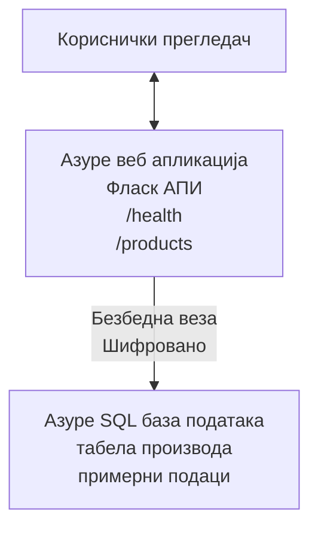

# Деплојовање Microsoft SQL базе података и веб апликације помоћу AZD

⏱️ **Процењено време**: 20-30 минута | 💰 **Процењени трошак**: ~$15-25/месечно | ⭐ **Сложеност**: Средњи

Овај **пуни, радни пример** показује како да користите [Azure Developer CLI (azd)](https://learn.microsoft.com/azure/developer/azure-developer-cli/) за деплојовање Python Flask веб апликације са Microsoft SQL базом података на Azure. Сав код је укључен и тестирани—нису потребне спољне зависности.

## Шта ћете научити

Попуњавањем овог примера, научићете:
- Деплој вишеслојне апликације (веб апликација + база) користећи инфраструктуру као код
- Конфигурисати безбедне везе са базом без хардкодовања тајни
- Надгледати здравље апликације помоћу Application Insights
- Управљати Azure ресурсима ефикасно помоћу AZD CLI
- Пратити најбоље Azure праксе за безбедност, оптимизацију трошкова и опсервабилност

## Преглед сценарија
- **Веб апликација**: Python Flask REST API са повезаношћу на базу
- **База података**: Azure SQL Database са примером података
- **Инфраструктура**: Provision-овано користећи Bicep (модуларни, поновно употребљиви шаблони)
- **Деплој**: Потпуно аутоматизовано помоћу `azd` команди
- **Надгледање**: Application Insights за логове и телеметрију

## Предуслови

### Потребни алати

Пре почетка, проверите да имате ове алате инсталиране:

1. **[Azure CLI](https://learn.microsoft.com/cli/azure/install-azure-cli)** (верзија 2.50.0 или новија)
   ```sh
   az --version
   # Очекује се излаз: azure-cli 2.50.0 или новија
   ```

2. **[Azure Developer CLI (azd)](https://learn.microsoft.com/azure/developer/azure-developer-cli/install-azd)** (верзија 1.0.0 или новија)
   ```sh
   azd version
   # Очекује се излаз: azd верзија 1.0.0 или новија
   ```

3. **[Python 3.8+](https://www.python.org/downloads/)** (за локални развој)
   ```sh
   python --version
   # Очекује се излаз: Python 3.8 или новији
   ```

4. **[Docker](https://www.docker.com/get-started)** (опционо, за локални контейнеризовани развој)
   ```sh
   docker --version
   # Очекивани излаз: Docker верзија 20.10 или новија
   ```

### Azure захтеви

- Активна **Azure претплата** ([направите бесплатан налог](https://azure.microsoft.com/free/))
- Овлашћења за креирање ресурса у вашој претплати
- **Owner** или **Contributor** улога на претплати или групи ресурса

### Предзнање

Ово је пример **средњег нивоа**. Потребно је да будете упознати са:
- Основним радом у командној линији
- Фундаменталним облачним концептима (ресурси, групе ресурса)
- Основним разумевањем веб апликација и база података

**Нови сте у AZD?** Почните са [Getting Started guide](../../docs/chapter-01-foundation/azd-basics.md).

## Архитектура

Овај пример деплојује двослојну архитектуру са веб апликацијом и SQL базом:


**Деплој ресурса:**
- **Resource Group**: Контејнер за све ресурсе
- **App Service Plan**: Хостинг на Linux-у (B1 ниво за економичност)
- **Web App**: Python 3.11 runtime са Flask апликацијом
- **SQL Server**: Управљани сервер базе са минимум TLS 1.2
- **SQL Database**: Basic ниво (2GB, погодан за развој/тестирање)
- **Application Insights**: Надгледање и логовање
- **Log Analytics Workspace**: Централизовано складиште логова

**Аналогија**: Замислите ово као ресторан (веб апликација) са хладњаком (база података). Купци наручују са менија (API ендпоинти), а кухиња (Flask апликација) преузима састојке (подаци) из хладњака. Менаџер ресторана (Application Insights) прати све што се дешава.

## Структура фолдера

Сви фајлови су укључени у овај пример—нису потребне спољне зависности:

```
examples/database-app/
│
├── README.md                    # This file
├── azure.yaml                   # AZD configuration file
├── .env.sample                  # Sample environment variables
├── .gitignore                   # Git ignore patterns
│
├── infra/                       # Infrastructure as Code (Bicep)
│   ├── main.bicep              # Main orchestration template
│   ├── abbreviations.json      # Azure naming conventions
│   └── resources/              # Modular resource templates
│       ├── sql-server.bicep    # SQL Server configuration
│       ├── sql-database.bicep  # Database configuration
│       ├── app-service-plan.bicep  # Hosting plan
│       ├── app-insights.bicep  # Monitoring setup
│       └── web-app.bicep       # Web application
│
└── src/
    └── web/                    # Application source code
        ├── app.py              # Flask REST API
        ├── requirements.txt    # Python dependencies
        └── Dockerfile          # Container definition
```

**Шта сваки фајл ради:**
- **azure.yaml**: Каже AZD шта да деплојује и где
- **infra/main.bicep**: Оркестрира све Azure ресурсе
- **infra/resources/*.bicep**: Појединачне дефиниције ресурса (модуларно за поновну употребу)
- **src/web/app.py**: Flask апликација са логиком базе података
- **requirements.txt**: Зависности Python пакета
- **Dockerfile**: Упутства за контејнеризацију за деплој

## Брзи почетак (корак по корак)

### Корак 1: Клонирајте и пређите у репозиторијум

```sh
git clone https://github.com/microsoft/AZD-for-beginners.git
cd AZD-for-beginners/examples/database-app
```

**✓ Провера успешности**: Уверите се да видите `azure.yaml` и фасциклу `infra/`:
```sh
ls
# Очекује се: README.md, azure.yaml, infra/, src/
```

### Корак 2: Аутентификујте се на Azure

```sh
azd auth login
```

Ово ће отворити ваш прегледач за Azure аутентификацију. Пријавите се са вашим Azure акредитивима.

**✓ Провера успешности**: Требало би да видите:
```
Logged in to Azure.
```

### Корак 3: Иницијализујте окружење

```sh
azd init
```

**Шта се дешава**: AZD креира локалну конфигурацију за ваш деплој.

**Упити које ћете видети**:
- **Име окружења**: Унесите кратко име (нпр. `dev`, `myapp`)
- **Azure претплата**: Одаберите вашу претплату из листе
- **Azure локација**: Изаберите регион (нпр. `eastus`, `westeurope`)

**✓ Провера успешности**: Требало би да видите:
```
SUCCESS: New project initialized!
```

### Корак 4: Provision-овање Azure ресурса

```sh
azd provision
```

**Шта се дешава**: AZD деплојује целу инфраструктуру (траје 5-8 минута):
1. Креира групу ресурса
2. Креира SQL Server и базу података
3. Креира App Service Plan
4. Креира Web App
5. Креира Application Insights
6. Конфигурише мрежу и безбедност

**Бићете упитани за**:
- **SQL admin username**: Унесите корисничко име (нпр. `sqladmin`)
- **SQL admin password**: Унесите јаку лозинку (сачувајте је!)

**✓ Провера успешности**: Требало би да видите:
```
SUCCESS: Your application was provisioned in Azure in X minutes Y seconds.
You can view the resources created under the resource group rg-<env-name> in Azure Portal:
https://portal.azure.com/#@/resource/subscriptions/.../resourceGroups/rg-<env-name>
```

**⏱️ Време**: 5-8 минута

### Корак 5: Деплој апликације

```sh
azd deploy
```

**Шта се дешава**: AZD гради и деплојује вашу Flask апликацију:
1. Пакује Python апликацију
2. Гради Docker контејнер
3. Пушује на Azure Web App
4. Иницијализује базу података са пример података
5. Покреће апликацију

**✓ Провера успешности**: Требало би да видите:
```
SUCCESS: Your application was deployed to Azure in X minutes Y seconds.
You can view the resources created under the resource group rg-<env-name> in Azure Portal:
https://portal.azure.com/#@/resource/subscriptions/.../resourceGroups/rg-<env-name>
```

**⏱️ Време**: 3-5 минута

### Корак 6: Отворите апликацију у прегледачу

```sh
azd browse
```

Ово отвара вашу деплојовану веб апликацију у прегледачу на адреси `https://app-<unique-id>.azurewebsites.net`

**✓ Провера успешности**: Требало би да видите JSON излаз:
```json
{
  "message": "Welcome to the Database App API",
  "endpoints": {
    "/": "This help message",
    "/health": "Health check endpoint",
    "/products": "List all products",
    "/products/<id>": "Get product by ID"
  }
}
```

### Корак 7: Тестирајте API ендпоинте

**Health Check** (провера везе са базом):
```sh
curl https://app-<your-id>.azurewebsites.net/health
```

**Очекивани одговор**:
```json
{
  "status": "healthy",
  "database": "connected"
}
```

**List Products** (пример података):
```sh
curl https://app-<your-id>.azurewebsites.net/products
```

**Очекивани одговор**:
```json
[
  {
    "id": 1,
    "name": "Laptop",
    "description": "High-performance laptop",
    "price": 1299.99,
    "created_at": "2025-11-19T10:30:00"
  },
  ...
]
```

**Get Single Product**:
```sh
curl https://app-<your-id>.azurewebsites.net/products/1
```

**✓ Провера успешности**: Сви ендпоинти враћају JSON податке без грешака.

---

**🎉 Честитамо!** Успешно сте деплојовали веб апликацију са базом података на Azure користећи AZD.

## Дубинска конфигурација

### Променљиве окружења

Тајне се безбедно управљају преко конфигурације Azure App Service—**никад не хардкодовати у изворном коду**.

**Аутоматски конфигурисано од стране AZD**:
- `SQL_CONNECTION_STRING`: Конекција ка бази са шифрованим креденцијалима
- `APPLICATIONINSIGHTS_CONNECTION_STRING`: Телекомуникациони ентитет за праћење
- `SCM_DO_BUILD_DURING_DEPLOYMENT`: Омогућава аутоматску инсталацију зависности током деплоја

**Где се тајне чувају**:
1. Током `azd provision`, уносите SQL креденцијале путем безбедних упита
2. AZD их чува у вашем локалном `.azure/<env-name>/.env` фајлу (исключено из Gita)
3. AZD их инјектује у конфигурацију Azure App Service (шифровано у миру)
4. Апликација их чита преко `os.getenv()` у времену извођења

### Локални развој

За локално тестирање, креирајте `.env` фајл из примерка:

```sh
cp .env.sample .env
# Уредите .env и унесите податке за везу са локалном базом података
```

**Локални развојни ток рада**:
```sh
# Инсталирајте зависности
cd src/web
pip install -r requirements.txt

# Поставите променљиве окружења
export SQL_CONNECTION_STRING="your-local-connection-string"

# Покрените апликацију
python app.py
```

**Тестирајте локално**:
```sh
curl http://localhost:8000/health
# Очекује се: {"статус": "здрав", "база_подака": "повезана"}
```

### Инфраструктура као код

Сви Azure ресурси су дефинисани у **Bicep шаблонима** (`infra/` фасцикла):

- **Модуларни дизајн**: Сваки тип ресурса има свој фајл за поновну употребу
- **Параметризовано**: Прилагодите SKU-ове, регионе, конвенције именовања
- **Најбоље праксе**: Прати Azure стандарде именовања и безбедносне подразумеване поставке
- **Контрола верзија**: Промене инфраструктуре се прате у Gitu

**Пример прилагођавања**:
Да бисте променили ниво базе података, уредите `infra/resources/sql-database.bicep`:
```bicep
sku: {
  name: 'Standard'  // Changed from 'Basic'
  tier: 'Standard'
  capacity: 10
}
```

## Најбоље праксе за безбедност

Овај пример прати Azure најбоље праксе за безбедност:

### 1. **Нема тајни у изворном коду**
- ✅ Креденцијали се чувају у конфигурацији Azure App Service (шифровано)
- ✅ `.env` фајлови искључени из Gita помоћу `.gitignore`
- ✅ Тајне се предају преко безбедних параметара током provision-а

### 2. **Шифроване везе**
- ✅ TLS 1.2 минимум за SQL Server
- ✅ Само HTTPS омогућено за Web App
- ✅ Везе са базом користе шифроване канале

### 3. **Мрежна безбедност**
- ✅ SQL Server firewall конфигурисан да дозволи само Azure сервисе
- ✅ Јавни приступ мрежи ограничен (може се даље ограничи приватним крајњим тачкама)
- ✅ FTPS онемогућен на Web App

### 4. **Аутентикација и ауторизација**
- ⚠️ **Тренутно**: SQL аутентикација (корисничко име/лозинка)
- ✅ **Препорука за продукцију**: Користите Azure Managed Identity за аутентификацију без лозинке

**За надоградњу на Managed Identity** (за продукцију):
1. Омогућите managed identity на Web App-у
2. Додајте дозволе идентитету на SQL-у
3. Ажурирајте connection string да користи managed identity
4. Уклоните аутентикацију засновану на лозинци

### 5. **Ревизија и усаглашеност**
- ✅ Application Insights логује све захтеве и грешке
- ✅ SQL Database ревизија омогућена (може се конфигурисати за усаглашеност)
- ✅ Сви ресурси означени ради управљања

**Контрола безбедности пре продукције**:
- [ ] Омогућите Azure Defender за SQL
- [ ] Конфигуришите Private Endpoints за SQL Database
- [ ] Омогућите Web Application Firewall (WAF)
- [ ] Имплементирајте Azure Key Vault за ротацију тајни
- [ ] Конфигуришите Azure AD аутентикацију
- [ ] Омогућите дијагностичко логовање за све ресурсе

## Оптимизација трошкова

**Процењени месечни трошкови** (статус: новембар 2025):

| Resource | SKU/Ниво | Процењени трошак |
|----------|----------|-------------------|
| App Service Plan | B1 (Basic) | ~$13/month |
| SQL Database | Basic (2GB) | ~$5/month |
| Application Insights | Pay-as-you-go | ~$2/month (low traffic) |
| **Total** | | **~$20/month** |

**💡 Савети за уштеду**:

1. **Користите бесплатни ниво за учење**:
   - App Service: F1 ниво (бесплатно, ограничено сати)
   - SQL Database: Користите Azure SQL Database serverless
   - Application Insights: 5GB/месечно бесплатно уношење

2. **Паузирате ресурсе када се не користе**:
   ```sh
   # Заустави веб апликацију (база података се и даље наплаћује)
   az webapp stop --name <app-name> --resource-group <rg-name>
   
   # Поново покрени када је потребно
   az webapp start --name <app-name> --resource-group <rg-name>
   ```

3. **Избришите све након тестирања**:
   ```sh
   azd down
   ```
   Ово уклања СВЕ ресурсе и зауставља наплате.

4. **Развојни против продукцијског SKU-а**:
   - **Развој**: Basic ниво (коришћен у овом примеру)
   - **Продукција**: Standard/Premium ниво са редунданцијом

**Праћење трошкова**:
- Погледајте трошкове у [Azure Cost Management](https://portal.azure.com/#view/Microsoft_Azure_CostManagement)
- Подесите аларме трошкова да избегнете изненађења
- Означите све ресурсе са `azd-env-name` ради праћења

**Алтернатива бесплатног нивоа**:
За потребе учења, можете изменити `infra/resources/app-service-plan.bicep`:
```bicep
sku: {
  name: 'F1'  // Free tier
  tier: 'Free'
}
```
**Напомена**: Бесплатни ниво има ограничења (60 мин/дан CPU, нема увек-он)

## Надгледање и опсервабилност

### Интеграција Application Insights

Овај пример укључује **Application Insights** за свеобухватно надгледање:

**Шта се прати**:
- ✅ HTTP захтеви (латенција, статуси, ендпоинти)
- ✅ Грешке и изузеци апликације
- ✅ Прилагођено логовање из Flask апликације
- ✅ Здравље везе са базом података
- ✅ Метрике перформанси (CPU, меморија)

**Приступите Application Insights**:
1. Отворите [Azure Portal](https://portal.azure.com)
2. Идите у вашу групу ресурса (`rg-<env-name>`)
3. Кликните на Application Insights ресурс (`appi-<unique-id>`)

**Корисни упити** (Application Insights → Logs):

**Прикажи све захтеве**:
```kusto
requests
| where timestamp > ago(1h)
| order by timestamp desc
| project timestamp, name, url, resultCode, duration
```

**Пронађи грешке**:
```kusto
exceptions
| where timestamp > ago(24h)
| order by timestamp desc
| project timestamp, type, outerMessage, operation_Name
```

**Провери health ендпоинт**:
```kusto
requests
| where name contains "health"
| summarize count() by resultCode, bin(timestamp, 1h)
```

### Ревизија SQL базе података

**SQL Database ревизија је омогућена** да би пратила:
- Обрасце приступа бази података
- Неуспешне покушаје пријављивања
- Промене шеме
- Приступ подацима (за усаглашеност)

**Приступ ревизионом логовању**:
1. Azure Portal → SQL Database → Auditing
2. Погледајте логове у Log Analytics workspace

### Надгледање у реалном времену

**Погледајте Live Metrics**:
1. Application Insights → Live Metrics
2. Види захтеве, неуспехе и перформансе у реалном времену

**Подесите аларме**:
Креирајте аларме за критичне догађаје:
- HTTP 500 грешке > 5 у 5 минута
- Неуспеси везе са базом података
- Високо време одговора (>2 секунде)

**Пример креирања аларма**:
```sh
az monitor metrics alert create \
  --name "High-Response-Time" \
  --resource-group <rg-name> \
  --scopes <app-insights-resource-id> \
  --condition "avg requests/duration > 2000" \
  --description "Alert when response time exceeds 2 seconds"
```

## Решавање проблема
### Uobičajeni problemi i rešenja

#### 1. `azd provision` fails with "Location not available"

**Simptom**:
```
Error: The subscription is not registered for the resource type 'components' in the location 'centralus'.
```

**Rešenje**:
Choose a different Azure region or register the resource provider:
```sh
az provider register --namespace Microsoft.Insights
```

#### 2. SQL Connection Fails During Deployment

**Simptom**:
```
pyodbc.OperationalError: ('08001', '[08001] [Microsoft][ODBC Driver 18 for SQL Server]TCP Provider...')
```

**Rešenje**:
- Verify SQL Server firewall allows Azure services (configured automatically)
- Check the SQL admin password was entered correctly during `azd provision`
- Ensure SQL Server is fully provisioned (can take 2-3 minutes)

**Проверите везу**:
```sh
# На Azure порталу идите на SQL базу података → Уређивач упита
# Покушајте да се повежете помоћу својих података за пријаву
```

#### 3. Web App Shows "Application Error"

**Simptom**:
Browser shows generic error page.

**Решење**:
Проверите логове апликације:
```sh
# Погледајте недавне записе
az webapp log tail --name <app-name> --resource-group <rg-name>
```

**Уобичајени узроци**:
- Недостајуће променљиве окружења (проверите App Service → Configuration)
- Инсталација Python пакета није успела (проверите deployment logs)
- Грешка при иницијализацији базе података (проверите SQL connectivity)

#### 4. `azd deploy` Fails with "Build Error"

**Simptom**:
```
Error: Failed to build project
```

**Решење**:
- Ensure `requirements.txt` has no syntax errors
- Check that Python 3.11 is specified in `infra/resources/web-app.bicep`
- Verify Dockerfile has correct base image

**Отстрањавање грешака локално**:
```sh
cd src/web
docker build -t test-app .
docker run -p 8000:8000 test-app
```

#### 5. "Unauthorized" When Running AZD Commands

**Simptom**:
```
ERROR: (Unauthorized) The client '<id>' with object id '<id>' does not have authorization
```

**Решење**:
Re-authenticate with Azure:
```sh
# Потребно за радне токове AZD-а
azd auth login

# Опционо ако такође директно користите Azure CLI команде
az login
```

Verify you have the correct permissions (Contributor role) on the subscription.

#### 6. High Database Costs

**Simptom**:
Unexpected Azure bill.

**Решење**:
- Check if you forgot to run `azd down` after testing
- Verify SQL Database is using Basic tier (not Premium)
- Review costs in Azure Cost Management
- Set up cost alerts

### Dobijanje pomoći

**Прикажи све AZD променљиве окружења**:
```sh
azd env get-values
```

**Проверите статус деплоя**:
```sh
az webapp show --name <app-name> --resource-group <rg-name> --query state
```

**Приступите логовима апликације**:
```sh
az webapp log download --name <app-name> --resource-group <rg-name> --log-file app-logs.zip
```

**Треба вам још помоћи?**
- [Водич за решавање проблема AZD](../../docs/chapter-07-troubleshooting/common-issues.md)
- [Решавање проблема Azure App Service](https://learn.microsoft.com/azure/app-service/troubleshoot-diagnostic-logs)
- [Решавање проблема Azure SQL](https://learn.microsoft.com/azure/azure-sql/database/troubleshoot-common-errors-issues)

## Практичне вежбе

### Вежба 1: Потврдите своје распоређивање (Почетник)

**Циљ**: Потврдите да су сви ресурси распоређени и да апликација ради.

**Кораци**:
1. List all resources in your resource group:
   ```sh
   az resource list --resource-group rg-<env-name> --output table
   ```
   **Очекује се**: 6-7 ресурса (Web App, SQL Server, SQL Database, App Service Plan, Application Insights, Log Analytics)

2. Test all API endpoints:
   ```sh
   curl https://app-<your-id>.azurewebsites.net/
   curl https://app-<your-id>.azurewebsites.net/health
   curl https://app-<your-id>.azurewebsites.net/products
   curl https://app-<your-id>.azurewebsites.net/products/1
   ```
   **Очекује се**: Сви враћају важећи JSON без грешака

3. Check Application Insights:
   - Navigate to Application Insights in Azure Portal
   - Go to "Live Metrics"
   - Refresh your browser on the web app
   **Очекује се**: Видите захтеве који се појављују у реалном времену

**Критеријуми успеха**: Сви 6-7 ресурса постоје, сви ендпоинти враћају податке, Live Metrics показује активност.

---

### Вежба 2: Додајте нови API ендпоинт (Средњи ниво)

**Циљ**: Проширите Flask апликацију новим ендпоинтом.

**Почетни код**: Current endpoints in `src/web/app.py`

**Кораци**:
1. Edit `src/web/app.py` and add a new endpoint after the `get_product()` function:
   ```python
   @app.route('/products/search/<keyword>')
   def search_products(keyword):
       """Search products by name or description."""
       try:
           conn = get_db_connection()
           cursor = conn.cursor()
           cursor.execute(
               "SELECT id, name, description, price, created_at FROM products WHERE name LIKE ? OR description LIKE ?",
               (f'%{keyword}%', f'%{keyword}%')
           )
           
           products = []
           for row in cursor.fetchall():
               products.append({
                   'id': row[0],
                   'name': row[1],
                   'description': row[2],
                   'price': float(row[3]) if row[3] else None,
                   'created_at': row[4].isoformat() if row[4] else None
               })
           
           cursor.close()
           conn.close()
           
           logger.info(f"Search for '{keyword}' returned {len(products)} results")
           return jsonify(products), 200
           
       except Exception as e:
           logger.error(f"Error searching products: {str(e)}")
           return jsonify({'error': str(e)}), 500
   ```

2. Deploy the updated application:
   ```sh
   azd deploy
   ```

3. Test the new endpoint:
   ```sh
   curl https://app-<your-id>.azurewebsites.net/products/search/laptop
   ```
   **Очекује се**: Враћа производе који одговарају "laptop"

**Критеријуми успеха**: Нови ендпоинт ради, враћа филтриране резултате, појављује се у логовима Application Insights.

---

### Вежба 3: Додајте мониторинг и упозорења (Напредни)

**Циљ**: Подесите проактивни мониторинг са упозорењима.

**Кораци**:
1. Create an alert for HTTP 500 errors:
   ```sh
   # Добијте ИД ресурса Application Insights
   AI_ID=$(az monitor app-insights component show \
     --app appi-<your-id> \
     --resource-group rg-<env-name> \
     --query id -o tsv)
   
   # Креирај упозорење
   az monitor metrics alert create \
     --name "High-Error-Rate" \
     --resource-group rg-<env-name> \
     --scopes $AI_ID \
     --condition "count requests/failed > 5" \
     --window-size 5m \
     --evaluation-frequency 1m \
     --description "Alert when >5 failed requests in 5 minutes"
   ```

2. Trigger the alert by causing errors:
   ```sh
   # Захтев за непостојећи производ
   for i in {1..10}; do curl https://app-<your-id>.azurewebsites.net/products/999; done
   ```

3. Check if the alert fired:
   - Azure Portal → Alerts → Alert Rules
   - Check your email (if configured)

**Критеријуми успеха**: Упутство за правила упозорења је креирано, активира се на грешке, примају се обавештења.

---

### Вежба 4: Промене шеме базе података (Напредни)

**Циљ**: Додајте нову табелу и прилагодите апликацију да је користи.

**Кораци**:
1. Connect to SQL Database via Azure Portal Query Editor

2. Create a new `categories` table:
   ```sql
   CREATE TABLE categories (
       id INT PRIMARY KEY IDENTITY(1,1),
       name NVARCHAR(50) NOT NULL,
       description NVARCHAR(200)
   );
   
   INSERT INTO categories (name, description) VALUES
   ('Electronics', 'Electronic devices and accessories'),
   ('Office Supplies', 'Office equipment and supplies');
   
   -- Add category to products table
   ALTER TABLE products ADD category_id INT;
   UPDATE products SET category_id = 1; -- Set all to Electronics
   ```

3. Update `src/web/app.py` to include category information in responses

4. Deploy and test

**Критеријуми успеха**: Нова табела постоји, производи показују информацију о категорији, апликација и даље ради.

---

### Вежба 5: Имплементирајте кеширање (Експерт)

**Циљ**: Додајте Azure Redis Cache за побољшање перформанси.

**Кораци**:
1. Add Redis Cache to `infra/main.bicep`
2. Update `src/web/app.py` to cache product queries
3. Measure performance improvement with Application Insights
4. Compare response times before/after caching

**Критеријуми успеха**: Redis је распоређен, кеширање ради, време одговора се побољшало за >50%.

**Савет**: Start with [Azure Cache for Redis documentation](https://learn.microsoft.com/azure/azure-cache-for-redis/).

---

## Чишћење

Да бисте избегли даљу наплату, избришите све ресурсе када завршите:

```sh
azd down
```

**Упит за потврду**:
```
? Total resources to delete: 7, are you sure you want to continue? (y/N)
```

Type `y` to confirm.

**✓ Провера успеха**: 
- Сви ресурси су избрисани из Azure портала
- Нема текућих трошкова
- Локална `.azure/<env-name>` фолдер може се избрисати

**Алтернатива** (задржите инфраструктуру, обришите податке):
```sh
# Обриши само ресурсну групу (задржи AZD конфигурацију)
az group delete --name rg-<env-name> --yes
```
## Сазнајте више

### Повезана документација
- [Документација за Azure Developer CLI](https://learn.microsoft.com/azure/developer/azure-developer-cli/)
- [Документација за Azure SQL Database](https://learn.microsoft.com/azure/azure-sql/database/)
- [Документација за Azure App Service](https://learn.microsoft.com/azure/app-service/)
- [Документација за Application Insights](https://learn.microsoft.com/azure/azure-monitor/app/app-insights-overview)
- [Bicep Language Reference](https://learn.microsoft.com/azure/azure-resource-manager/bicep/)

### Следећи кораци у овом курсу
- **[Пример Container Apps](../../../../examples/container-app)**: Deploy microservices with Azure Container Apps
- **[Водич за интеграцију AI](../../../../docs/ai-foundry)**: Add AI capabilities to your app
- **[Најбоље праксе за деплој](../../docs/chapter-04-infrastructure/deployment-guide.md)**: Production deployment patterns

### Напредне теме
- **Managed Identity**: Remove passwords and use Azure AD authentication
- **Private Endpoints**: Secure database connections within a virtual network
- **CI/CD Integration**: Automate deployments with GitHub Actions or Azure DevOps
- **Multi-Environment**: Set up dev, staging, and production environments
- **Database Migrations**: Use Alembic or Entity Framework for schema versioning

### Поређење са другим приступима

**AZD vs. ARM Templates**:
- ✅ AZD: Higher-level abstraction, simpler commands
- ⚠️ ARM: More verbose, granular control

**AZD vs. Terraform**:
- ✅ AZD: Azure-native, integrated with Azure services
- ⚠️ Terraform: Multi-cloud support, larger ecosystem

**AZD vs. Azure Portal**:
- ✅ AZD: Repeatable, version-controlled, automatable
- ⚠️ Portal: Manual clicks, difficult to reproduce

**Замислите AZD као**: Docker Compose for Azure—simplified configuration for complex deployments.

---

## Често постављана питања

**П: Могу ли користити други програмски језик?**  
О: Да! Replace `src/web/` with Node.js, C#, Go, or any language. Update `azure.yaml` and Bicep accordingly.

**П: Како да додам још база података?**  
О: Add another SQL Database module in `infra/main.bicep` or use PostgreSQL/MySQL from Azure Database services.

**П: Могу ли ово користити за продукцију?**  
О: Ово је полазна тачка. За продукцију додајте: managed identity, private endpoints, redundancy, backup strategy, WAF, и побољшано праћење.

**П: Шта ако желим да користим контејнере уместо деплоја кода?**  
О: Check out the [Пример Container Apps](../../../../examples/container-app) which uses Docker containers throughout.

**П: Како да се повежем на базу података са локалне машине?**  
О: Add your IP to the SQL Server firewall:
```sh
az sql server firewall-rule create \
  --resource-group rg-<env-name> \
  --server sql-<unique-id> \
  --name AllowMyIP \
  --start-ip-address <your-ip> \
  --end-ip-address <your-ip>
```

**П: Могу ли да користим постојећу базу података уместо креирања нове?**  
О: Да, modify `infra/main.bicep` to reference an existing SQL Server and update the connection string parameters.

---

> **Напомена:** This example demonstrates best practices for deploying a web app with a database using AZD. It includes working code, comprehensive documentation, and practical exercises to reinforce learning. For production deployments, review security, scaling, compliance, and cost requirements specific to your organization.

**📚 Навигација курса:**
- ← Претходно: [Пример Container Apps](../../../../examples/container-app)
- → Следеће: [Водич за интеграцију AI](../../../../docs/ai-foundry)
- 🏠 [Početna страница курса](../../README.md)

---

<!-- CO-OP TRANSLATOR DISCLAIMER START -->
**Ограничење одговорности**:
Овај документ је преведен помоћу AI сервиса за превођење [Co-op Translator](https://github.com/Azure/co-op-translator). Иако тежимо тачности, имајте у виду да аутоматски преводи могу садржати грешке или нетачности. Изворни документ на његовом оригиналном језику треба сматрати обавезујућим извором. За критичне информације препоручује се професионални људски превод. Не сносимо одговорност за било какве неспоразуме или погрешне тумачења која произилазе из коришћења овог превода.
<!-- CO-OP TRANSLATOR DISCLAIMER END -->