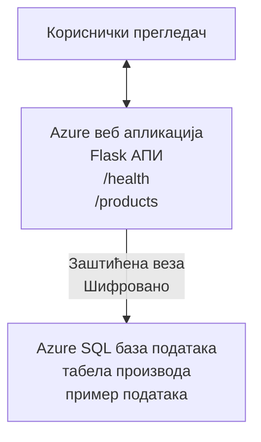

# Деплојовање Microsoft SQL базе података и веб апликације помоћу AZD

⏱️ **Процењено време**: 20-30 минута | 💰 **Процењени трошак**: ~$15-25/месец | ⭐ **Сложеност**: Средњи

Овај **потпун, функционалан пример** демонстрира како да користите [Azure Developer CLI (azd)](https://learn.microsoft.com/azure/developer/azure-developer-cli/) за деплој Python Flask веб апликације са Microsoft SQL базом података на Azure. Сав код је укључен и тестиран—нема потребе за спољним зависностима.

## Шта ћете научити

Поред завршетка овог примера, научићете:
- Разгортати апликацију са више нивоа (веб апликација + база података) користећи инфраструктуру као код
- Конфигурисати безбедне везе са базом података без уношења тајни у код
- Надгледати здравље апликације помоћу Application Insights
- Ефикасно управљати Azure ресурсима помоћу AZD CLI
- Пратити најбоље праксе Azure-а за безбедност, оптимизацију трошкова и опсервабилност

## Преглед сценарија
- **Веб апликација**: Python Flask REST API са повезивањем на базу података
- **База података**: Azure SQL Database са примером података
- **Инфраструктура**: Провизионирана помоћу Bicep (модуларни, поновно употребљиви шаблони)
- **Деплој**: Потпуно аутоматизовано помоћу `azd` команди
- **Надгледање**: Application Insights за логове и телеметрију

## Предуслови

### Потребни алати

Пре почетка, проверите да ли су вам ови алати инсталирани:

1. **[Azure CLI](https://learn.microsoft.com/cli/azure/install-azure-cli)** (верзија 2.50.0 или новија)
   ```sh
   az --version
   # Очекује се излаз: azure-cli 2.50.0 или новији
   ```

2. **[Azure Developer CLI (azd)](https://learn.microsoft.com/azure/developer/azure-developer-cli/install-azd)** (верзија 1.0.0 или новија)
   ```sh
   azd version
   # Очекивани излаз: azd верзија 1.0.0 или новија
   ```

3. **[Python 3.8+](https://www.python.org/downloads/)** (за локални развој)
   ```sh
   python --version
   # Очекивани излаз: Python 3.8 или новији
   ```

4. **[Docker](https://www.docker.com/get-started)** (опционо, за локални развој у контејнеру)
   ```sh
   docker --version
   # Очекивани излаз: Docker верзија 20.10 или новија
   ```

### Захтеви за Azure

- Активна **Azure претплата** ([направите бесплатан налог](https://azure.microsoft.com/free/))
- Дозволе за креирање ресурса у вашој претплати
- **Owner** или **Contributor** улога на претплати или групи ресурса

### Потребно знање

Ово је пример **средњег нивоа**. Треба да будете упознати са:
- Основне операције у командној линији
- Основни облачни концепти (ресурси, групе ресурса)
- Основно разумевање веб апликација и база података

**Нови у AZD?** Почните са [водичем за почетак](../../docs/chapter-01-foundation/azd-basics.md) прво.

## Архитектура

Овај пример распоређује архитектуру са два нивоа која обухвата веб апликацију и SQL базу података:


**Размештање ресурса:**
- **Група ресурса**: Контејнер за све ресурсе
- **App Service план**: Хостинг заснован на Linux-у (B1 ниво ради ефикасности трошкова)
- **Веб апликација**: Python 3.11 извршно окружење са Flask апликацијом
- **SQL сервер**: Менаџисан сервер базе података са минимум TLS 1.2
- **SQL база података**: Basic ниво (2GB, погодан за развој/тестирање)
- **Application Insights**: Надзор и логовање
- **Log Analytics радни простор**: Централизовано складиште логова

**Аналогија**: Замислите ово као ресторан (веб апликација) са ходним замрзивачем (база података). Купци наручују са менија (API крајње тачке), а кухиња (Flask апликација) преузима састојке (подаци) из замрзивача. Менаџер ресторана (Application Insights) прати све што се дешава.

## Структура фолдера

Сви фајлови су укључени у овај пример—нема потребе за спољним зависностима:

```
examples/database-app/
│
├── README.md                    # This file
├── azure.yaml                   # AZD configuration file
├── .env.sample                  # Sample environment variables
├── .gitignore                   # Git ignore patterns
│
├── infra/                       # Infrastructure as Code (Bicep)
│   ├── main.bicep              # Main orchestration template
│   ├── abbreviations.json      # Azure naming conventions
│   └── resources/              # Modular resource templates
│       ├── sql-server.bicep    # SQL Server configuration
│       ├── sql-database.bicep  # Database configuration
│       ├── app-service-plan.bicep  # Hosting plan
│       ├── app-insights.bicep  # Monitoring setup
│       └── web-app.bicep       # Web application
│
└── src/
    └── web/                    # Application source code
        ├── app.py              # Flask REST API
        ├── requirements.txt    # Python dependencies
        └── Dockerfile          # Container definition
```

**Шта сваки фајл ради:**
- **azure.yaml**: Kaже AZD-у шта да распореди и где
- **infra/main.bicep**: Оркестрира све Azure ресурсе
- **infra/resources/*.bicep**: Појединачне дефиниције ресурса (модуларне за поновну употребу)
- **src/web/app.py**: Flask апликација са логиком базе података
- **requirements.txt**: Зависности Python пакета
- **Dockerfile**: Упутства за контејнеризацију за деплој

## Брзи почетак (корак по корак)

### Корак 1: Клонирајте и идите у директоријум

```sh
git clone https://github.com/microsoft/AZD-for-beginners.git
cd AZD-for-beginners/examples/database-app
```

**✓ Провера успеха**: Проверите да ли видите `azure.yaml` и фасциклу `infra/`:
```sh
ls
# Очекује се: README.md, azure.yaml, infra/, src/
```

### Корак 2: Аутентикујте се на Azure

```sh
azd auth login
```

Ово отвара ваш прегледач за Azure аутентификацију. Пријавите се помоћу својих Azure креденцијала.

**✓ Провера успеха**: Требало би да видите:
```
Logged in to Azure.
```

### Корак 3: Иницијализујте окружење

```sh
azd init
```

**Шта се дешава**: AZD креира локалну конфигурацију за ваше разгортaње.

**Упити које ћете видети**:
- **Име окружења**: Унесите кратко име (нпр., `dev`, `myapp`)
- **Azure претплата**: Изаберите своју претплату са листе
- **Azure локација**: Изаберите регион (нпр., `eastus`, `westeurope`)

**✓ Провера успеха**: Требало би да видите:
```
SUCCESS: New project initialized!
```

### Корак 4: Провизионирајте Azure ресурсе

```sh
azd provision
```

**Шта се дешава**: AZD распоређује целу инфраструктуру (траје 5-8 минута):
1. Креира групу ресурса
2. Креира SQL сервер и базу података
3. Креира App Service план
4. Креира веб апликацију
5. Креира Application Insights
6. Конфигурише мрежу и безбедност

**Бићете упитани за**:
- **Корисничко име SQL администратора**: Унесите корисничко име (нпр., `sqladmin`)
- **Лозинка SQL администратора**: Унесите јаку лозинку (сачувајте је!)

**✓ Провера успеха**: Требало би да видите:
```
SUCCESS: Your application was provisioned in Azure in X minutes Y seconds.
You can view the resources created under the resource group rg-<env-name> in Azure Portal:
https://portal.azure.com/#@/resource/subscriptions/.../resourceGroups/rg-<env-name>
```

**⏱️ Време**: 5-8 минута

### Корак 5: Деплој апликације

```sh
azd deploy
```

**Шта се дешава**: AZD гради и деплојује вашу Flask апликацију:
1. Пакује Python апликацију
2. Гради Docker контејнер
3. Отпрема на Azure Web App
4. Иницијализује базу података примером података
5. Покреће апликацију

**✓ Провера успеха**: Требало би да видите:
```
SUCCESS: Your application was deployed to Azure in X minutes Y seconds.
You can view the resources created under the resource group rg-<env-name> in Azure Portal:
https://portal.azure.com/#@/resource/subscriptions/.../resourceGroups/rg-<env-name>
```

**⏱️ Време**: 3-5 минута

### Корак 6: Прегледајте апликацију

```sh
azd browse
```

Ово отвара вашу деплојовану веб апликацију у прегледачу на `https://app-<unique-id>.azurewebsites.net`

**✓ Провера успеха**: Требало би да видите JSON излаз:
```json
{
  "message": "Welcome to the Database App API",
  "endpoints": {
    "/": "This help message",
    "/health": "Health check endpoint",
    "/products": "List all products",
    "/products/<id>": "Get product by ID"
  }
}
```

### Корак 7: Тестирајте API крајње тачке

**Провера здравља** (потврдите везу са базом података):
```sh
curl https://app-<your-id>.azurewebsites.net/health
```

**Очекивани одговор**:
```json
{
  "status": "healthy",
  "database": "connected"
}
```

**Листа производа** (пример података):
```sh
curl https://app-<your-id>.azurewebsites.net/products
```

**Очекивани одговор**:
```json
[
  {
    "id": 1,
    "name": "Laptop",
    "description": "High-performance laptop",
    "price": 1299.99,
    "created_at": "2025-11-19T10:30:00"
  },
  ...
]
```

**Добијање једног производа**:
```sh
curl https://app-<your-id>.azurewebsites.net/products/1
```

**✓ Провера успеха**: Све крајње тачке враћају JSON податке без грешака.

---

**🎉 Честитамо!** Успешно сте деплојовали веб апликацију са базом података на Azure користећи AZD.

## Детаљна конфигурација

### Променљиве окружења

Тајне се безбедно управљају преко конфигурације Azure App Service—**никада не убацујте тајне директно у изворни код**.

**Аутоматски конфигурисано од стране AZD**:
- `SQL_CONNECTION_STRING`: Веза са базом података са шифрованим акредитивима
- `APPLICATIONINSIGHTS_CONNECTION_STRING`: Ендпоинт за телеметрију мониторинга
- `SCM_DO_BUILD_DURING_DEPLOYMENT`: Омогућава аутоматску инсталацију зависности

**Где се чувају тајне**:
1. Током `azd provision`, уносите SQL акредитиве преко безбедних упита
2. AZD чува ово у вашем локалном фајлу `.azure/<env-name>/.env` (игнорисаном од стране Git-а)
3. AZD убризгава ово у конфигурацију Azure App Service (шифровано у мировању)
4. Апликација их чита преко `os.getenv()` у време извршавања

### Локални развој

За локално тестирање, креирајте фајл `.env` из примера:

```sh
cp .env.sample .env
# Уредите .env да садржи везу ка вашој локалној бази података
```

**Радни ток за локални развој**:
```sh
# Инсталирајте зависности
cd src/web
pip install -r requirements.txt

# Подесите променљиве окружења
export SQL_CONNECTION_STRING="your-local-connection-string"

# Покрените апликацију
python app.py
```

**Тестирајте локално**:
```sh
curl http://localhost:8000/health
# Очекује се: {"статус": "оперативан", "база података": "повезана"}
```

### Инфраструктура као код

Сви Azure ресурси су дефинисани у **Bicep шаблонима** (`infra/` фолдер):

- **Модуларни дизајн**: Сваки тип ресурса има свој фајл за поновну употребу
- **Параметризовано**: Прилагодите SKU-ове, регионе, конвенције именовања
- **Најбоље праксе**: Прати Azure стандарде именовања и безбедносне подразумеване поставке
- **Контрола верзија**: Промене инфраструктуре се прате у Git-у

**Пример прилагођавања**:
Да бисте променили ниво базе података, уредите `infra/resources/sql-database.bicep`:
```bicep
sku: {
  name: 'Standard'  // Changed from 'Basic'
  tier: 'Standard'
  capacity: 10
}
```

## Најбоље праксе безбедности

Овај пример следи Azure најбоље праксе за безбедност:

### 1. **Нема тајни у изворном коду**
- ✅ Акредитиви складиштени у конфигурацији Azure App Service (шифровано)
- ✅ Фајлови `.env` искључени из Git-а преко `.gitignore`
- ✅ Тајне прослеђене преко безбедних параметара током провизионисања

### 2. **Шифроване везе**
- ✅ Минимум TLS 1.2 за SQL сервер
- ✅ Само HTTPS приморано за веб апликацију
- ✅ Везе са базом података користе шифроване канале

### 3. **Мрежна безбедност**
- ✅ Фајрвол SQL сервера конфигурисан да дозвољава само Azure сервисе
- ✅ Јаван приступ мрежи ограничен (може се даље закључати помоћу Private Endpoints)
- ✅ FTPS онемогућен на веб апликацији

### 4. **Аутентификација и ауторизација**
- ⚠️ **Тренутно**: SQL аутентификација (корисничко име/лозинка)
- ✅ **Препорука за продукцију**: Користите Azure Managed Identity за аутентификацију без лозинке

**За надоградњу на Managed Identity** (за продукцију):
1. Омогућите managed identity на веб апликацији
2. Доделите идентитету SQL дозволе
3. Ажурирајте стринг за повезивање да користи managed identity
4. Уклоните аутентификацију засновану на лозинки

### 5. **Аудит и усаглашеност**
- ✅ Application Insights логује све захтеве и грешке
- ✅ Аудит SQL базе података омогућен (може се конфигурисати ради усаглашености)
- ✅ Сви ресурси означени за управљање

**Контролна листа безбедности пре продукције**:
- [ ] Омогућити Azure Defender за SQL
- [ ] Конфигурисати Private Endpoints за SQL базу података
- [ ] Омогућити Web Application Firewall (WAF)
- [ ] Имплементирати Azure Key Vault за ротацију тајни
- [ ] Конфигурисати Azure AD аутентификацију
- [ ] Омогућити дијагностичко логовање за све ресурсе

## Оптимизација трошкова

**Процењени месечни трошкови** (за новембар 2025.):

| Ресурс | SKU/Ниво | Процењени трошак |
|----------|----------|----------------|
| App Service Plan | B1 (Basic) | ~$13/месец |
| SQL Database | Basic (2GB) | ~$5/месец |
| Application Insights | Pay-as-you-go | ~$2/месец (мали саобраћај) |
| **Укупно** | | **~$20/месец** |

**💡 Савети за уштеду трошкова**:

1. **Користите бесплатни ниво за учење**:
   - App Service: F1 ниво (бесплатно, ограничено сати)
   - SQL Database: Користите Azure SQL Database serverless
   - Application Insights: 5GB/месец бесплатног уноса

2. **Зауставите ресурсе када се не користе**:
   ```sh
   # Заустави веб апликацију (трошкови за базу података се и даље наплаћују)
   az webapp stop --name <app-name> --resource-group <rg-name>
   
   # Поново покрени када је потребно
   az webapp start --name <app-name> --resource-group <rg-name>
   ```

3. **Обришите све након тестирања**:
   ```sh
   azd down
   ```
   Ово уклања СВЕ ресурсе и зауставља наплату.

4. **SKUs за развој и продукцију**:
   - **Развој**: Basic ниво (коришћено у овом примеру)
   - **Продукција**: Standard/Premium ниво са редунданцијом

**Надгледање трошкова**:
- Погледајте трошкове у [Azure Cost Management](https://portal.azure.com/#view/Microsoft_Azure_CostManagement)
- Поставите аларме трошкова да бисте избегли неочекиване трошкове
- Означите све ресурсе са `azd-env-name` за праћење

**Алтернатива бесплатног нивоа**:
У сврхе учења, можете изменити `infra/resources/app-service-plan.bicep`:
```bicep
sku: {
  name: 'F1'  // Free tier
  tier: 'Free'
}
```
**Напомена**: Бесплатни ниво има ограничења (60 мин/дан CPU, без опције увек активан).

## Мониторинг и опсервабилност

### Интеграција са Application Insights

Овај пример укључује **Application Insights** за комплетан мониторинг:

**Шта се надгледа**:
- ✅ HTTP захтеви (латенција, статусни кодови, крајње тачке)
- ✅ Грешке и изузеци апликације
- ✅ Прилагођено логовање из Flask апликације
- ✅ Стање везе са базом података
- ✅ Перформанс метрике (CPU, меморија)

**Приступ Application Insights**:
1. Отворите [Azure портал](https://portal.azure.com)
2. Идите до своје групе ресурса (`rg-<env-name>`)
3. Кликните на Application Insights ресурс (`appi-<unique-id>`)

**Корисни упити** (Application Insights → Logs):

**Прикажи све захтеве**:
```kusto
requests
| where timestamp > ago(1h)
| order by timestamp desc
| project timestamp, name, url, resultCode, duration
```

**Пронађи грешке**:
```kusto
exceptions
| where timestamp > ago(24h)
| order by timestamp desc
| project timestamp, type, outerMessage, operation_Name
```

**Провери крајњу тачку за здравље**:
```kusto
requests
| where name contains "health"
| summarize count() by resultCode, bin(timestamp, 1h)
```

### Аудит SQL базе података

**Аудит SQL базе података је омогућен** ради праћења:
- Обрасци приступа бази података
- Неуспешни покушаји пријаве
- Промене шеме
- Приступ подацима (ради усаглашености)

**Приступи аудит логовима**:
1. Azure портал → SQL база података → Аудит
2. Погледајте логове у Log Analytics радном простору

### Надгледање у реалном времену

**Погледајте мере у реалном времену**:
1. Application Insights → Live Metrics
2. Погледајте захтеве, неуспехе и перформансе у реалном времену

**Поставите аларме**:
Креирајте аларме за критичне догађаје:
- HTTP 500 грешке > 5 у 5 минута
- Неуспеси везе са базом података
- Високо време одговора (>2 секунде)

**Пример креирања аларма**:
```sh
az monitor metrics alert create \
  --name "High-Response-Time" \
  --resource-group <rg-name> \
  --scopes <app-insights-resource-id> \
  --condition "avg requests/duration > 2000" \
  --description "Alert when response time exceeds 2 seconds"
```

## Решавање проблема
### Уобичајени проблеми и решења

#### 1. `azd provision` fails with "Location not available"

**Симптом**:
```
Error: The subscription is not registered for the resource type 'components' in the location 'centralus'.
```

**Решење**:
Изаберите другу Azure регију или региструјте провајдера ресурса:
```sh
az provider register --namespace Microsoft.Insights
```

#### 2. SQL Connection Fails During Deployment

**Симптом**:
```
pyodbc.OperationalError: ('08001', '[08001] [Microsoft][ODBC Driver 18 for SQL Server]TCP Provider...')
```

**Решење**:
- Проверите да firewall SQL Server-а дозвољава Azure сервисе (подешава се аутоматски)
- Проверите да ли је SQL admin лозинка унетa исправно током `azd provision`
- Уверите се да је SQL Server у потпуности провижионован (може потрајати 2-3 минута)

**Проверите везу**:
```sh
# Из Azure портала идите на SQL базу података → Уређивач упита
# Покушајте да се повежете помоћу својих акредитива
```

#### 3. Web App Shows "Application Error"

**Симптом**:
Прегледач приказује општу страницу са грешком.

**Решење**:
Проверите логове апликације:
```sh
# Прегледајте недавне записе
az webapp log tail --name <app-name> --resource-group <rg-name>
```

**Уобичајени узроци**:
- Недостајуће променљиве окружења (проверите App Service → Configuration)
- Инсталација Python пакета није успела (проверите логове распоређивања)
- Грешка при иницијализацији базе података (проверите SQL повезивост)

#### 4. `azd deploy` Fails with "Build Error"

**Симптом**:
```
Error: Failed to build project
```

**Решење**:
- Уверите се да `requirements.txt` нема синтаксичке грешке
- Проверите да ли је Python 3.11 наведен у `infra/resources/web-app.bicep`
- Проверите да Dockerfile има исправну базну слику

**Отклони грешку локално**:
```sh
cd src/web
docker build -t test-app .
docker run -p 8000:8000 test-app
```

#### 5. "Unauthorized" When Running AZD Commands

**Симптом**:
```
ERROR: (Unauthorized) The client '<id>' with object id '<id>' does not have authorization
```

**Решење**:
Поново се аутентификујте на Azure:
```sh
azd auth login
az login
```

Проверите да имате одговарајуће дозволе (улога Contributor) на претплати.

#### 6. High Database Costs

**Симптом**:
Неочекивани Azure рачун.

**Решење**:
- Проверите да ли сте заборавили да покренете `azd down` након тестирања
- Проверите да SQL Database користи Basic ниво (не Premium)
- Прегледајте трошкове у Azure Cost Management
- Подесите аларме за трошкове

### Како добити помоћ

**Прикажи све AZD променљиве окружења**:
```sh
azd env get-values
```

**Проверите статус распоређивања**:
```sh
az webapp show --name <app-name> --resource-group <rg-name> --query state
```

**Приступите логовима апликације**:
```sh
az webapp log download --name <app-name> --resource-group <rg-name> --log-file app-logs.zip
```

**Потребна додатна помоћ?**
- [AZD: Водич за решавање проблема](../../docs/chapter-07-troubleshooting/common-issues.md)
- [Azure App Service: Решавање проблема](https://learn.microsoft.com/azure/app-service/troubleshoot-diagnostic-logs)
- [Решавање проблема Azure SQL](https://learn.microsoft.com/azure/azure-sql/database/troubleshoot-common-errors-issues)

## Практичне вежбе

### Вежба 1: Проверите ваше распоређивање (почетни ниво)

**Циљ**: Потврдити да су сви ресурси распоређени и да апликација ради.

**Кораци**:
1. Набројте све ресурсе у вашој ресурсној групи:
   ```sh
   az resource list --resource-group rg-<env-name> --output table
   ```
   **Очекује се**: 6-7 ресурса (Web App, SQL Server, SQL Database, App Service Plan, Application Insights, Log Analytics)

2. Тестирајте све API крајње тачке:
   ```sh
   curl https://app-<your-id>.azurewebsites.net/
   curl https://app-<your-id>.azurewebsites.net/health
   curl https://app-<your-id>.azurewebsites.net/products
   curl https://app-<your-id>.azurewebsites.net/products/1
   ```
   **Очекује се**: Сви враћају важећи JSON без грешака

3. Проверите Application Insights:
   - Идите на Application Insights у Azure порталу
   - Идите на "Live Metrics"
   - Освежите прегледач на веб апликацији
   **Очекује се**: Виде се захтеви у реалном времену

**Критеријуми успеха**: Сви 6-7 ресурса постоје, све крајње тачке враћају податке, Live Metrics показује активност.

---

### Вежба 2: Додајте нови API крајњи метод (средњи ниво)

**Циљ**: Проширите Flask апликацију новим крајњим методом.

**Почетни код**: Тренутни ендпоинти у `src/web/app.py`

**Кораци**:
1. Уредите `src/web/app.py` и додајте нови крајњи метод после функције `get_product()`:
   ```python
   @app.route('/products/search/<keyword>')
   def search_products(keyword):
       """Search products by name or description."""
       try:
           conn = get_db_connection()
           cursor = conn.cursor()
           cursor.execute(
               "SELECT id, name, description, price, created_at FROM products WHERE name LIKE ? OR description LIKE ?",
               (f'%{keyword}%', f'%{keyword}%')
           )
           
           products = []
           for row in cursor.fetchall():
               products.append({
                   'id': row[0],
                   'name': row[1],
                   'description': row[2],
                   'price': float(row[3]) if row[3] else None,
                   'created_at': row[4].isoformat() if row[4] else None
               })
           
           cursor.close()
           conn.close()
           
           logger.info(f"Search for '{keyword}' returned {len(products)} results")
           return jsonify(products), 200
           
       except Exception as e:
           logger.error(f"Error searching products: {str(e)}")
           return jsonify({'error': str(e)}), 500
   ```

2. Распоредите ажурирану апликацију:
   ```sh
   azd deploy
   ```

3. Тестирајте нови крајњи метод:
   ```sh
   curl https://app-<your-id>.azurewebsites.net/products/search/laptop
   ```
   **Очекује се**: Враћа производе који се подударају са "laptop"

**Критеријуми успеха**: Нови крајњи метод ради, враћа филтриране резултате, појављује се у логовима Application Insights.

---

### Вежба 3: Додавање надзора и аларма (напредно)

**Циљ**: Подесите проактивни надзор са алармима.

**Кораци**:
1. Креирајте аларм за HTTP 500 грешке:
   ```sh
   # Добијте ID ресурса Application Insights
   AI_ID=$(az monitor app-insights component show \
     --app appi-<your-id> \
     --resource-group rg-<env-name> \
     --query id -o tsv)
   
   # Креирајте упозорење
   az monitor metrics alert create \
     --name "High-Error-Rate" \
     --resource-group rg-<env-name> \
     --scopes $AI_ID \
     --condition "count requests/failed > 5" \
     --window-size 5m \
     --evaluation-frequency 1m \
     --description "Alert when >5 failed requests in 5 minutes"
   ```

2. Покрените аларм изазивајући грешке:
   ```sh
   # Захтев за непостојећи производ
   for i in {1..10}; do curl https://app-<your-id>.azurewebsites.net/products/999; done
   ```

3. Проверите да ли се аларм активирао:
   - Azure портал → Alerts → Alert Rules
   - Проверите ваш е-пошту (ако је конфигурисана)

**Критеријуми успеха**: Правило аларма је креирано, активира се на грешке, обавештења су примљена.

---

### Вежба 4: Промене шеме базе података (напредно)

**Циљ**: Додајте нову табелу и измените апликацију да је користи.

**Кораци**:
1. Повежите се на SQL базу података преко Query Editor-а у Azure порталу

2. Креирајте нову табелу `categories`:
   ```sql
   CREATE TABLE categories (
       id INT PRIMARY KEY IDENTITY(1,1),
       name NVARCHAR(50) NOT NULL,
       description NVARCHAR(200)
   );
   
   INSERT INTO categories (name, description) VALUES
   ('Electronics', 'Electronic devices and accessories'),
   ('Office Supplies', 'Office equipment and supplies');
   
   -- Add category to products table
   ALTER TABLE products ADD category_id INT;
   UPDATE products SET category_id = 1; -- Set all to Electronics
   ```

3. Ажурирајте `src/web/app.py` да укључи информације о категоријама у одговорима

4. Распоредите и тествајте

**Критеријуми успеха**: Нова табела постоји, производи приказују информације о категоријама, апликација и даље ради.

---

### Вежба 5: Имплементирајте кеширање (експерт)

**Циљ**: Додајте Azure Redis Cache како бисте побољшали перформансе.

**Кораци**:
1. Додајте Redis Cache у `infra/main.bicep`
2. Ажурирајте `src/web/app.py` да кешира упите о производима
3. Измерите побољшање перформанси помоћу Application Insights
4. Упоредите време одговора пре/после кеширања

**Критеријуми успеха**: Redis је распоређен, кеширање ради, време одговора се побољшало за >50%.

**Савет**: Почните са [Документацијом за Azure Cache for Redis](https://learn.microsoft.com/azure/azure-cache-for-redis/).

---

## Чишћење

Да бисте избегли трајне трошкове, избришите све ресурсе када завршите:

```sh
azd down
```

**Потврдни упит**:
```
? Total resources to delete: 7, are you sure you want to continue? (y/N)
```

Укуцајте `y` да потврдите.

**✓ Провера успеха**: 
- Сви ресурси су избрисани из Azure портала
- Нема трајних трошкова
- Локални фолдер `.azure/<env-name>` може бити избрисан

**Alternative** (keep infrastructure, delete data):
```sh
# Обриши само групу ресурса (сачувај AZD конфигурацију)
az group delete --name rg-<env-name> --yes
```
## Сазнајте више

### Повезана документација
- [Документација за Azure Developer CLI](https://learn.microsoft.com/azure/developer/azure-developer-cli/)
- [Документација за Azure SQL Database](https://learn.microsoft.com/azure/azure-sql/database/)
- [Документација за Azure App Service](https://learn.microsoft.com/azure/app-service/)
- [Документација за Application Insights](https://learn.microsoft.com/azure/azure-monitor/app/app-insights-overview)
- [Референца за Bicep језик](https://learn.microsoft.com/azure/azure-resource-manager/bicep/)

### Следећи кораци у овом курсу
- **[Пример Container Apps](../../../../examples/container-app)**: Распоредите микросервисе са Azure Container Apps
- **[Водич за интеграцију AI](../../../../docs/ai-foundry)**: Додајте AI могућности у вашу апликацију
- **[Најбоље праксе за распоређивање](../../docs/chapter-04-infrastructure/deployment-guide.md)**: Обрасци за продукцијско распоређивање

### Напредне теме
- **Managed Identity**: Уклоните лозинке и користите Azure AD аутентификацију
- **Private Endpoints**: Осигурајте везе ка бази података унутар виртуелне мреже
- **CI/CD Integration**: Аутоматизујте распоређивања помоћу GitHub Actions или Azure DevOps
- **Multi-Environment**: Подесите развојно, стагинг и продукцијско окружење
- **Database Migrations**: Користите Alembic или Entity Framework за верзионисање шеме

### Упоређивање са другим приступима

**AZD vs. ARM Templates**:
- ✅ AZD: Виши ниво апстракције, једноставније команде
- ⚠️ ARM: Опширније, детаљнија контрола

**AZD vs. Terraform**:
- ✅ AZD: Нативан за Azure, интегрисан са Azure услугама
- ⚠️ Terraform: Подршка за више облака, већи екосистем

**AZD vs. Azure портал**:
- ✅ AZD: Поновљиво, контролисано верзионисањем, аутоматизовано
- ⚠️ Портал: Ручни кликови, тешко за репродукцију

**Размислите о AZD као о**: Docker Compose за Azure—поједностављена конфигурација за комплексна распоређивања.

---

## Често постављана питања

**П: Могу ли да користим други програмски језик?**  
О: Да! Замените `src/web/` са Node.js, C#, Go, или било којим другим језиком. Ажурирајте `azure.yaml` и Bicep у складу с тим.

**П: Како да додам више база података?**  
О: Додајте још један SQL Database модул у `infra/main.bicep` или користите PostgreSQL/MySQL из Azure Database сервиса.

**П: Могу ли ово користити у продукцији?**  
О: Ово је полазна тачка. За продукцију додајте: managed identity, private endpoints, redundancy, backup стратегију, WAF и побољшано надгледање.

**П: Шта ако желим да користим контејнере уместо распоређивања кода?**  
О: Погледајте [Пример Container Apps](../../../../examples/container-app) који користи Docker контејнере широм пројекта.

**П: Како да се повежем на базу података са локалне машине?**  
О: Додајте ваш IP у firewall SQL Server-а:
```sh
az sql server firewall-rule create \
  --resource-group rg-<env-name> \
  --server sql-<unique-id> \
  --name AllowMyIP \
  --start-ip-address <your-ip> \
  --end-ip-address <your-ip>
```

**П: Могу ли користити постојећу базу уместо креирања нове?**  
О: Да, измените `infra/main.bicep` да реферише постојећи SQL Server и ажурирајте параметре connection string-а.

> **Напомена:** Овај пример демонстрира најбоље праксе за распоређивање веб апликације са базом података користећи AZD. Укључује радни код, свеобухватну документацију и практичне вежбе за појачање учења. За продукцијска распоређивања, прегледајте безбедносне, скалабилне, захтеве усклађености и трошкова специфичне за вашу организацију.

**📚 Навигација курса:**
- ← Претходно: [Пример Container Apps](../../../../examples/container-app)
- → Следеће: [Водич за интеграцију AI](../../../../docs/ai-foundry)
- 🏠 [Почетак курса](../../README.md)

---

<!-- CO-OP TRANSLATOR DISCLAIMER START -->
**Ограничење одговорности**:
Овај документ је преведен помоћу услуге за превођење на бази вештачке интелигенције [Co-op Translator](https://github.com/Azure/co-op-translator). Иако се трудимо да будемо прецизни, имајте на уму да аутоматски преводи могу садржати грешке или нетачности. Оригинални документ на његовом матерњем језику треба сматрати ауторитативним извором. За критичне информације препоручује се професионални људски превод. Не сносимо одговорност за било каква неспоразумевања или погрешна тумачења која произилазе из коришћења овог превода.
<!-- CO-OP TRANSLATOR DISCLAIMER END -->