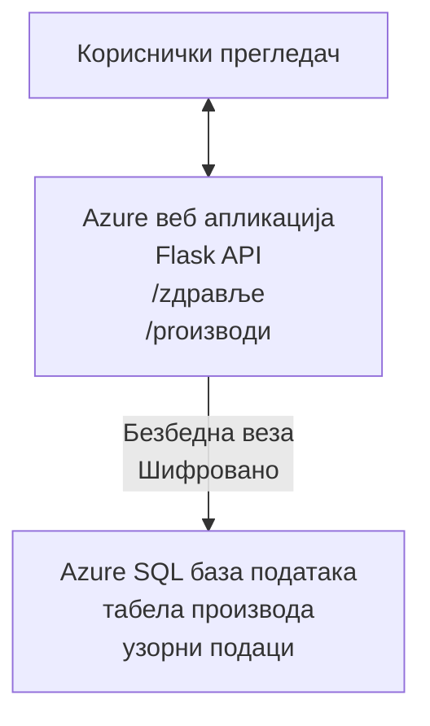

# Распоређивање Microsoft SQL базе података и веб апликације помоћу AZD

⏱️ **Процењено време**: 20-30 минута | 💰 **Процењени трошак**: ~ $15-25/месец | ⭐ **Сложеност**: Средњи ниво

Овај **комплетан, радни пример** показује како да користите [Azure Developer CLI (azd)](https://learn.microsoft.com/azure/developer/azure-developer-cli/) да бисте распоредили Python Flask веб апликацију са Microsoft SQL базом података на Azure. Сав код је укључен и тестиран — нема спољних зависности.

## Шта ћете научити

Комплетирањем овог примера ћете:
- Распоредити више-нивоу апликацију (веб апликација + база података) користећи инфраструктуру као код
- Конфигурисати безбедне повезе са базом података без утипавања тајни у код
- Надгледати здравље апликације помоћу Application Insights
- Ефикасно управљати Azure ресурсима помоћу AZD CLI
- Пратити најбоље праксе Azure-а за безбедност, оптимизацију трошкова и посматрачност

## Преглед сценарија
- **Веб апликација**: Python Flask REST API са повезаношћу на базу података
- **База података**: Azure SQL Database са примером података
- **Инфраструктура**: Обезбеђена помоћу Bicep-а (модуларни, за поновну употребу)
- **Деплојмент**: Потпуно аутоматизован помоћу `azd` команди
- **Надгледање**: Application Insights за логове и телеметрију

## Преуслови

### Потребни алати

Пре почетка, проверите да имате инсталиране ове алате:

1. **[Azure CLI](https://learn.microsoft.com/cli/azure/install-azure-cli)** (верзија 2.50.0 или новија)
   ```sh
   az --version
   # Очекивани излаз: azure-cli 2.50.0 или новији
   ```

2. **[Azure Developer CLI (azd)](https://learn.microsoft.com/azure/developer/azure-developer-cli/install-azd)** (верзија 1.0.0 или новија)
   ```sh
   azd version
   # Очекивани излаз: azd верзија 1.0.0 или новија
   ```

3. **[Python 3.8+](https://www.python.org/downloads/)** (за локални развој)
   ```sh
   python --version
   # Очекивани излаз: Python 3.8 или новији
   ```

4. **[Docker](https://www.docker.com/get-started)** (опционо, за локални развој у контејнеру)
   ```sh
   docker --version
   # Очекивани излаз: Docker верзија 20.10 или новија
   ```

### Захтеви за Azure

- Активна **Azure претплата** ([направите бесплатан налог](https://azure.microsoft.com/free/))
- Дозволе за креирање ресурса у вашој претплати
- **Owner** или **Contributor** улога на претплати или групи ресурса

### Потребно знање

Ово је пример **средњег нивоа**. Требало би да сте упознати са:
- Основним командно-линијским операцијама
- Основним облачним концептима (ресурси, групе ресурса)
- Основним разумевањем веб апликација и база података

**Нови сте у AZD?** Почните са [Getting Started guide](../../docs/chapter-01-foundation/azd-basics.md) прво.

## Архитектура

Овај пример разврстава дво-нивоу архитектуру са веб апликацијом и SQL базом података:



**Дистрибуција ресурса:**
- **Resource Group**: Контејнер за све ресурсе
- **App Service Plan**: Хостинг на Linux-у (B1 ниво ради оптимизације трошкова)
- **Web App**: Python 3.11 runtime са Flask апликацијом
- **SQL Server**: Управљани сервер базе података са минимум TLS 1.2
- **SQL Database**: Basic ниво (2GB, погодан за развој/тестирање)
- **Application Insights**: Надгледање и логовање
- **Log Analytics Workspace**: Централизовано складиште логова

**Аналогија**: Замислите ово као ресторан (веб апликација) са комором за замрзавање (база података). Купци поручују из менија (API крајне тачке), а кухиња (Flask апликација) преузима састојке (податке) из коморе. Менаџер ресторана (Application Insights) прати све што се дешава.

## Структура фолдера

Сви фајлови су укључени у овом примеру — нема спољних зависности:

```
examples/database-app/
│
├── README.md                    # This file
├── azure.yaml                   # AZD configuration file
├── .env.sample                  # Sample environment variables
├── .gitignore                   # Git ignore patterns
│
├── infra/                       # Infrastructure as Code (Bicep)
│   ├── main.bicep              # Main orchestration template
│   ├── abbreviations.json      # Azure naming conventions
│   └── resources/              # Modular resource templates
│       ├── sql-server.bicep    # SQL Server configuration
│       ├── sql-database.bicep  # Database configuration
│       ├── app-service-plan.bicep  # Hosting plan
│       ├── app-insights.bicep  # Monitoring setup
│       └── web-app.bicep       # Web application
│
└── src/
    └── web/                    # Application source code
        ├── app.py              # Flask REST API
        ├── requirements.txt    # Python dependencies
        └── Dockerfile          # Container definition
```

**Шта сваки фајл ради:**
- **azure.yaml**: Каже AZD-у шта се распоређује и где
- **infra/main.bicep**: Оркестрира све Azure ресурсе
- **infra/resources/*.bicep**: Појединачне дефиниције ресурса (модуларно за поновну употребу)
- **src/web/app.py**: Flask апликација са логиком базе података
- **requirements.txt**: Зависности Python пакета
- **Dockerfile**: Инструкције за контејнеризацију за деплој

## Брзи почетак (корак по корак)

### Корак 1: Клонирање и навигација

```sh
git clone https://github.com/microsoft/AZD-for-beginners.git
cd AZD-for-beginners/examples/database-app
```

**✓ Провера успеха**: Потврдите да видите `azure.yaml` и фасциклу `infra/`:
```sh
ls
# Очекивано: README.md, azure.yaml, infra/, src/
```

### Корак 2: Пријавите се на Azure

```sh
azd auth login
```

Ово ће отворити ваш прегледач за Azure аутентификацију. Пријавите се са вашим Azure акредитивима.

**✓ Провера успеха**: Требало би да видите:
```
Logged in to Azure.
```

### Корак 3: Иницијализација окружења

```sh
azd init
```

**Шта се дешава**: AZD креира локалну конфигурацију за ваш деплој.

**Промптови које ћете видети**:
- **Environment name**: Унесите кратко име (нпр. `dev`, `myapp`)
- **Azure subscription**: Изаберите вашу претплату са листе
- **Azure location**: Изаберите регион (нпр. `eastus`, `westeurope`)

**✓ Провера успеха**: Требало би да видите:
```
SUCCESS: New project initialized!
```

### Корак 4: Провизионирање Azure ресурса

```sh
azd provision
```

**Шта се дешава**: AZD распоређује сву инфраструктуру (узима 5-8 минута):
1. Креира групу ресурса
2. Креира SQL Server и базу података
3. Креира App Service Plan
4. Креира Web App
5. Креира Application Insights
6. Конфигурише мрежу и безбедност

**Питаће вас за**:
- **SQL admin username**: Унесите корисничко име (нпр. `sqladmin`)
- **SQL admin password**: Унесите јаку лозинку (сачувајте је!)

**✓ Провера успеха**: Требало би да видите:
```
SUCCESS: Your application was provisioned in Azure in X minutes Y seconds.
You can view the resources created under the resource group rg-<env-name> in Azure Portal:
https://portal.azure.com/#@/resource/subscriptions/.../resourceGroups/rg-<env-name>
```

**⏱️ Време**: 5-8 минута

### Корак 5: Деплој апликације

```sh
azd deploy
```

**Шта се дешава**: AZD прави и распоређује вашу Flask апликацију:
1. Пакује Python апликацију
2. Гради Docker контејнер
3. Пушује на Azure Web App
4. Иницијализује базу података са пример података
5. Покреће апликацију

**✓ Провера успеха**: Требало би да видите:
```
SUCCESS: Your application was deployed to Azure in X minutes Y seconds.
You can view the resources created under the resource group rg-<env-name> in Azure Portal:
https://portal.azure.com/#@/resource/subscriptions/.../resourceGroups/rg-<env-name>
```

**⏱️ Време**: 3-5 минута

### Корак 6: Преглед апликације

```sh
azd browse
```

Ово отвара вашу распоређену веб апликацију у прегледачу на `https://app-<unique-id>.azurewebsites.net`

**✓ Провера успеха**: Требало би да видите JSON излаз:
```json
{
  "message": "Welcome to the Database App API",
  "endpoints": {
    "/": "This help message",
    "/health": "Health check endpoint",
    "/products": "List all products",
    "/products/<id>": "Get product by ID"
  }
}
```

### Корак 7: Тестирање API крајних тачака

**Провера здравља** (проверите везу са базом података):
```sh
curl https://app-<your-id>.azurewebsites.net/health
```

**Очекивани одговор**:
```json
{
  "status": "healthy",
  "database": "connected"
}
```

**Листа производа** (пример података):
```sh
curl https://app-<your-id>.azurewebsites.net/products
```

**Очекивани одговор**:
```json
[
  {
    "id": 1,
    "name": "Laptop",
    "description": "High-performance laptop",
    "price": 1299.99,
    "created_at": "2025-11-19T10:30:00"
  },
  ...
]
```

**Добијање појединачног производа**:
```sh
curl https://app-<your-id>.azurewebsites.net/products/1
```

**✓ Провера успеха**: Све крајње тачке враћају JSON податке без грешака.

---

**🎉 Честитамо!** Успешно сте распоредили веб апликацију са базом података на Azure користећи AZD.

## Детаљан увид у конфигурацију

### Променљиве окружења

Тајне се безбедно управљају преко конфигурације Azure App Service—**никад не утипајте у изворни код**.

**Аутоматски конфигурисано од стране AZD**:
- `SQL_CONNECTION_STRING`: Конекција на базу података са шифрованим акредитивима
- `APPLICATIONINSIGHTS_CONNECTION_STRING`: Точкични крај за телеметрију надгледања
- `SCM_DO_BUILD_DURING_DEPLOYMENT`: Омогућава аутоматску инсталацију зависности током деплоирања

**Где се чувају тајне**:
1. Током `azd provision` уносите SQL акредитиве преко безбедних упита
2. AZD их чува у вашој локалној `.azure/<env-name>/.env` фасцикли (игнорисано у гиту)
3. AZD их убризгава у конфигурацију Azure App Service-а (шифровано у миру)
4. Апликација их чита преко `os.getenv()` у време извршавања

### Локални развој

За локално тестирање, креирајте `.env` фајл из примера:

```sh
cp .env.sample .env
# Уредите .env да садржи податке за повезивање са вашом локалном базом података
```

**Радни ток за локални развој**:
```sh
# Инсталирајте зависности
cd src/web
pip install -r requirements.txt

# Подесите променљиве окружења
export SQL_CONNECTION_STRING="your-local-connection-string"

# Покрените апликацију
python app.py
```

**Тестирајте локално**:
```sh
curl http://localhost:8000/health
# Очекује се: {"статус": "здрав", "база података": "повезана"}
```

### Инфраструктура као код

Сви Azure ресурси су дефинисани у **Bicep шаблонима** (фасцикла `infra/`):

- **Модуларни дизајн**: Свaki тип ресурса има свој фајл ради поновне употребе
- **Параметризовано**: Прилагодите SKU-ове, регионе, конвенције именовања
- **Најбоље праксе**: Следи Azure стандарде именовања и подразумевана безбедна подешавања
- **Контрола верзија**: Промене у инфраструктури праћене у Gitu

**Пример прилагођавања**:
За промену нивоа базе података, уредите `infra/resources/sql-database.bicep`:
```bicep
sku: {
  name: 'Standard'  // Changed from 'Basic'
  tier: 'Standard'
  capacity: 10
}
```

## Најбоље безбедносне праксе

Овај пример прати најбоље безбедносне праксе Azure-а:

### 1. **Нема тајни у изворном коду**
- ✅ Акредитиви се чувају у конфигурацији Azure App Service-а (шифровано)
- ✅ `.env` фајлови су искључени из Gita преко `.gitignore`
- ✅ Тајне се прослеђују преко безбедних параметара током провизионисања

### 2. **Шифроване везе**
- ✅ TLS 1.2 минимум за SQL Server
- ✅ Само HTTPS дозвољен за Web App
- ✅ Везе са базом података користе шифроване канале

### 3. **Мрежна безбедност**
- ✅ SQL Server firewall конфигурисан да дозвољава само Azure сервисе
- ✅ Јавни мрежни приступ ограничен (може се додатно закључати помоћу Private Endpoints)
- ✅ FTPS онемогућен на Web App

### 4. **Аутентификација и ауторизација**
- ⚠️ **Тренутно**: SQL аутентификација (корисничко име/лозинка)
- ✅ **Препорука за продукцију**: Користите Azure Managed Identity за аутентификацију без лозинке

**Да бисте прешли на Managed Identity** (за продукцију):
1. Омогућите управљани идентитет на Web App-у
2. Дајте идентитету дозволе на SQL-у
3. Ажурирајте конекциони стринг да користи Managed Identity
4. Уклоните аутентификацију засновану на лозинки

### 5. **Ревизија и усаглашеност**
- ✅ Application Insights логује све захтеве и грешке
- ✅ SQL Database аудити су омогућени (могу се конфигурисати за усаглашеност)
- ✅ Сви ресурси су означени за управљање (таговани)

**Контрола безбедности пре продукције**:
- [ ] Омогућите Azure Defender за SQL
- [ ] Конфигуришите Private Endpoints за SQL базу података
- [ ] Омогућите Web Application Firewall (WAF)
- [ ] Имплементирајте Azure Key Vault за ротацију тајни
- [ ] Конфигуришите Microsoft Entra ID аутентификацију
- [ ] Омогућите дијагностичко логовање за све ресурсе

## Оптимизација трошкова

**Процењени месечни трошкови** (на дан новембар 2025):

| Ресурс | SKU/Ниво | Процењени трошак |
|--------|----------|------------------|
| App Service Plan | B1 (Basic) | ~$13/месец |
| SQL Database | Basic (2GB) | ~$5/месец |
| Application Insights | Pay-as-you-go | ~$2/месец (низак саобраћај) |
| **Укупно** | | **~$20/месец** |

**💡 Савети за уштеду трошкова**:

1. **Користите бесплатни ниво за учење**:
   - App Service: F1 ниво (бесплатан, ограничено сати)
   - SQL Database: Коришћење Azure SQL Database serverless
   - Application Insights: 5GB/месечно бесплатно уношење

2. **Прекините ресурсе када се не користе**:
   ```sh
   # Зауставите веб-апликацију (трошкови базе података и даље се наплаћују)
   az webapp stop --name <app-name> --resource-group <rg-name>
   
   # Поново покрените по потреби
   az webapp start --name <app-name> --resource-group <rg-name>
   ```

3. **Обришите све након тестирања**:
   ```sh
   azd down
   ```
   Ово уклања СВЕ ресурсе и зауставља трошкове.

4. **Развојни у односу на продукцијске SKU-ове**:
   - **Развој**: Basic ниво (коришћено у овом примеру)
   - **Продукција**: Standard/Premium ниво са редунданцијом

**Праћење трошкова**:
- Погледајте трошкове у [Azure Cost Management](https://portal.azure.com/#view/Microsoft_Azure_CostManagement)
- Подесите аларме за трошкове да бисте избегли изненађења
- Означите све ресурсе са `azd-env-name` за праћење

**Алтернатива бесплатном нивоу**:
За сврхе учења, можете изменити `infra/resources/app-service-plan.bicep`:
```bicep
sku: {
  name: 'F1'  // Free tier
  tier: 'Free'
}
```
**Напомена**: Бесплатни ниво има ограничења (60 мин/дан CPU, нема увек-укључено).

## Мониторинг и посматрачност

### Интеграција са Application Insights

Овај пример укључује **Application Insights** за свеобухватно надгледање:

**Шта се прати**:
- ✅ HTTP захтеви (латенција, статусни кодови, крајње тачке)
- ✅ Грешке и изузеци апликације
- ✅ Прилагођено логовање из Flask апликације
- ✅ Здравље везе са базом података
- ✅ Метрике перформанси (CPU, меморија)

**Приступ Application Insights**:
1. Отворите [Azure Portal](https://portal.azure.com)
2. Идите у вашу групу ресурса (`rg-<env-name>`)
3. Кликните на Application Insights ресурс (`appi-<unique-id>`)

**Корисни упити** (Application Insights → Logs):

**Погледај све захтеве**:
```kusto
requests
| where timestamp > ago(1h)
| order by timestamp desc
| project timestamp, name, url, resultCode, duration
```

**Пронађи грешке**:
```kusto
exceptions
| where timestamp > ago(24h)
| order by timestamp desc
| project timestamp, type, outerMessage, operation_Name
```

**Провери health крајну тачку**:
```kusto
requests
| where name contains "health"
| summarize count() by resultCode, bin(timestamp, 1h)
```

### Аудитовање SQL базе података

**Аудитовање SQL базе података је омогућено** да би се пратили:
- Обрасци приступа бази података
- Неуспели покушаји пријаве
- Промене шеме
- Приступ подацима (за усаглашеност)

**Приступ дневницима ревизије**:
1. Azure Portal → SQL Database → Auditing
2. Прегледајте логове у Log Analytics радном простору

### Надгледање у реалном времену

**Погледајте метрике уживо**:
1. Application Insights → Live Metrics
2. Погледајте захтеве, неуспехе и перформансе у реалном времену

**Подесите упозорења**:
Креирајте аларме за критичне догађаје:
- HTTP 500 грешке > 5 у 5 минута
- Неуспеси везе са базом података
- Висока времена одзива (>2 секунде)

**Пример креирања аларма**:
```sh
az monitor metrics alert create \
  --name "High-Response-Time" \
  --resource-group <rg-name> \
  --scopes <app-insights-resource-id> \
  --condition "avg requests/duration > 2000" \
  --description "Alert when response time exceeds 2 seconds"
```

## Решавање проблема
### Чести проблеми и решења

#### 1. `azd provision` fails with "Location not available"

**Symptom**:
```
Error: The subscription is not registered for the resource type 'components' in the location 'centralus'.
```

**Solution**:
Изаберите другу Azure регију или региструјте ресурс провајдера:
```sh
az provider register --namespace Microsoft.Insights
```

#### 2. SQL Connection Fails During Deployment

**Symptom**:
```
pyodbc.OperationalError: ('08001', '[08001] [Microsoft][ODBC Driver 18 for SQL Server]TCP Provider...')
```

**Solution**:
- Проверите да ли SQL Server firewall дозвољава Azure сервисе (конфигурисано аутоматски)
- Проверите да ли је SQL администраторска лозинка правилно унесена током `azd provision`
- Уверите се да је SQL Server у потпуности провизионисан (може трајати 2-3 минуте)

**Verify Connection**:
```sh
# На Azure порталу идите на SQL базу података → Уређивач упита
# Покушајте да се повежете користећи своје податке за пријаву
```

#### 3. Web App Shows "Application Error"

**Symptom**:
Прегледач приказује генераичку страницу грешке.

**Solution**:
Проверите логове апликације:
```sh
# Прикажи најновије логове
az webapp log tail --name <app-name> --resource-group <rg-name>
```

**Common causes**:
- Недостајуће environment променљиве (проверите App Service → Configuration)
- Инсталација Python пакета није успела (проверите deployment логове)
- Грешка при иницијализацији базе података (проверите SQL повезивост)

#### 4. `azd deploy` Fails with "Build Error"

**Symptom**:
```
Error: Failed to build project
```

**Solution**:
- Уверите се да `requirements.txt` нема синтаксичких грешака
- Проверите да ли је Python 3.11 назначен у `infra/resources/web-app.bicep`
- Верификујте да Dockerfile има исправну базну слику

**Debug locally**:
```sh
cd src/web
docker build -t test-app .
docker run -p 8000:8000 test-app
```

#### 5. "Unauthorized" When Running AZD Commands

**Symptom**:
```
ERROR: (Unauthorized) The client '<id>' with object id '<id>' does not have authorization
```

**Solution**:
Поново аутентификујте се на Azure:
```sh
# Потребно за AZD радне токове
azd auth login

# Опционо ако такође директно користите Azure CLI команде
az login
```

Проверите да ли имате одговарајуће дозволе (улога Contributor) на претплати.

#### 6. High Database Costs

**Symptom**:
Неочекивани рачун од Azure.

**Solution**:
- Проверите да ли сте заборавили да покренете `azd down` након тестирања
- Уверите се да SQL Database користи Basic tier (не Premium)
- Прегледајте трошкове у Azure Cost Management
- Подесите обавештења о трошковима

### Како добити помоћ

**View All AZD Environment Variables**:
```sh
azd env get-values
```

**Check Deployment Status**:
```sh
az webapp show --name <app-name> --resource-group <rg-name> --query state
```

**Access Application Logs**:
```sh
az webapp log download --name <app-name> --resource-group <rg-name> --log-file app-logs.zip
```

**Need More Help?**
- [Водич за решавање проблема AZD](../../docs/chapter-07-troubleshooting/common-issues.md)
- [Azure App Service Troubleshooting](https://learn.microsoft.com/azure/app-service/troubleshoot-diagnostic-logs)
- [Azure SQL Troubleshooting](https://learn.microsoft.com/azure/azure-sql/database/troubleshoot-common-errors-issues)

## Практичне вежбе

### Вежба 1: Потврдите своју деплојацију (Почетник)

**Циљ**: Потврдити да су сви ресурси распоређени и да апликација ради.

**Кораци**:
1. Наведите све ресурсе у вашој групи ресурса:
   ```sh
   az resource list --resource-group rg-<env-name> --output table
   ```
   **Очекује се**: 6-7 ресурса (Web App, SQL Server, SQL Database, App Service Plan, Application Insights, Log Analytics)

2. Тестирајте све API крајње тачке:
   ```sh
   curl https://app-<your-id>.azurewebsites.net/
   curl https://app-<your-id>.azurewebsites.net/health
   curl https://app-<your-id>.azurewebsites.net/products
   curl https://app-<your-id>.azurewebsites.net/products/1
   ```
   **Очекује се**: Сви враћају важећи JSON без грешака

3. Проверите Application Insights:
   - Идите на Application Insights у Azure порталу
   - Идите на "Live Metrics"
   - Освежите прегледач на веб апликацији
   **Очекује се**: Виде се захтеви у реалном времену

**Критеријуми успеха**: Сва 6-7 ресурса постоје, све крајње тачке враћају податке, Live Metrics показује активност.

---

### Вежба 2: Додајте нову API крајњу тачку (Средњи)

**Циљ**: Проширите Flask апликацију новом крајњом тачком.

**Почетни код**: Тренутне крајње тачке у `src/web/app.py`

**Кораци**:
1. Уредите `src/web/app.py` и додајте нову крајњу тачку после функције `get_product()`:
   ```python
   @app.route('/products/search/<keyword>')
   def search_products(keyword):
       """Search products by name or description."""
       try:
           conn = get_db_connection()
           cursor = conn.cursor()
           cursor.execute(
               "SELECT id, name, description, price, created_at FROM products WHERE name LIKE ? OR description LIKE ?",
               (f'%{keyword}%', f'%{keyword}%')
           )
           
           products = []
           for row in cursor.fetchall():
               products.append({
                   'id': row[0],
                   'name': row[1],
                   'description': row[2],
                   'price': float(row[3]) if row[3] else None,
                   'created_at': row[4].isoformat() if row[4] else None
               })
           
           cursor.close()
           conn.close()
           
           logger.info(f"Search for '{keyword}' returned {len(products)} results")
           return jsonify(products), 200
           
       except Exception as e:
           logger.error(f"Error searching products: {str(e)}")
           return jsonify({'error': str(e)}), 500
   ```

2. Разместите ажурирану апликацију:
   ```sh
   azd deploy
   ```

3. Тестирајте нову крајњу тачку:
   ```sh
   curl https://app-<your-id>.azurewebsites.net/products/search/laptop
   ```
   **Очекује се**: Враћа производе који одговарају "laptop"

**Критеријуми успеха**: Нова крајња тачка ради, враћа филтриране резултате, појављује се у Application Insights логовима.

---

### Вежба 3: Додајте надзор и упозорења (Напредни)

**Циљ**: Поставите проактивни надзор са упозорењима.

**Кораци**:
1. Креирајте упозорење за HTTP 500 грешке:
   ```sh
   # Добијте ИД ресурса Application Insights
   AI_ID=$(az monitor app-insights component show \
     --app appi-<your-id> \
     --resource-group rg-<env-name> \
     --query id -o tsv)
   
   # Креирајте упозорење
   az monitor metrics alert create \
     --name "High-Error-Rate" \
     --resource-group rg-<env-name> \
     --scopes $AI_ID \
     --condition "count requests/failed > 5" \
     --window-size 5m \
     --evaluation-frequency 1m \
     --description "Alert when >5 failed requests in 5 minutes"
   ```

2. Покрените упозорење изазивањем грешака:
   ```sh
   # Захтев за непостојећи производ
   for i in {1..10}; do curl https://app-<your-id>.azurewebsites.net/products/999; done
   ```

3. Проверите да ли је упозорење активирано:
   - Azure Portal → Alerts → Alert Rules
   - Проверите ваш имејл (ако је конфигурисано)

**Критеријуми успеха**: Правило упозорења је креирано, активира се на грешкама, обавештења су примљена.

---

### Вежба 4: Промене шеме базе података (Напредни)

**Циљ**: Додајте нову табелу и измените апликацију да је користи.

**Кораци**:
1. Повежите се са SQL базом преко Azure Portal Query Editor-а

2. Креирајте нову `categories` табелу:
   ```sql
   CREATE TABLE categories (
       id INT PRIMARY KEY IDENTITY(1,1),
       name NVARCHAR(50) NOT NULL,
       description NVARCHAR(200)
   );
   
   INSERT INTO categories (name, description) VALUES
   ('Electronics', 'Electronic devices and accessories'),
   ('Office Supplies', 'Office equipment and supplies');
   
   -- Add category to products table
   ALTER TABLE products ADD category_id INT;
   UPDATE products SET category_id = 1; -- Set all to Electronics
   ```

3. Ажурирајте `src/web/app.py` да укључи информације о категоријама у одговорима

4. Разместите и тестирате

**Критеријуми успеха**: Нова табела постоји, производи показују информације о категорији, апликација и даље ради.

---

### Вежба 5: Имплементирајте кеширање (Експерт)

**Циљ**: Додајте Azure Redis Cache да побољшате перформансе.

**Кораци**:
1. Додајте Redis Cache у `infra/main.bicep`
2. Ажурирајте `src/web/app.py` да кешира упите за производе
3. Измерите побољшање перформанси помоћу Application Insights
4. Упоредите време одговора пре/после кеширања

**Критеријуми успеха**: Redis је развијен, кеширање ради, време одговора се побољшало за >50%.

**Савет**: Почните са [Azure Cache for Redis documentation](https://learn.microsoft.com/azure/azure-cache-for-redis/).

---

## Чишћење

Да бисте избегли сталне трошкове, избришите све ресурсе када завршите:

```sh
azd down
```

**Упит за потврду**:
```
? Total resources to delete: 7, are you sure you want to continue? (y/N)
```

Унесите `y` да потврдите.

**✓ Провера успеха**: 
- Сви ресурси су избрисани из Azure портала
- Нема текућих трошкова
- Локална фасцикла `.azure/<env-name>` може бити избрисана

**Алтернатива** (сачувај инфраструктуру, обриши податке):
```sh
# Избриши само групу ресурса (задржи AZD конфигурацију)
az group delete --name rg-<env-name> --yes
```
## Сазнајте више

### Повезана документација
- [Azure Developer CLI Documentation](https://learn.microsoft.com/azure/developer/azure-developer-cli/)
- [Azure SQL Database Documentation](https://learn.microsoft.com/azure/azure-sql/database/)
- [Azure App Service Documentation](https://learn.microsoft.com/azure/app-service/)
- [Application Insights Documentation](https://learn.microsoft.com/azure/azure-monitor/app/app-insights-overview)
- [Bicep Language Reference](https://learn.microsoft.com/azure/azure-resource-manager/bicep/)

### Следећи кораци у овом курсу
- **[Container Apps Example](../../../../examples/container-app)**: Разместите микросервисе помоћу Azure Container Apps
- **[AI Integration Guide](../../../../docs/ai-foundry)**: Додајте AI функционалности у вашу апликацију
- **[Deployment Best Practices](../../docs/chapter-04-infrastructure/deployment-guide.md)**: Обрасци за продукцијско распоредијење

### Напредне теме
- **Managed Identity**: Уклоните лозинке и користите Microsoft Entra ID аутентификацију
- **Private Endpoints**: Осигурајте везе са базом унутар виртуелне мреже
- **CI/CD Integration**: Аутоматизујте деплоје помоћу GitHub Actions или Azure DevOps
- **Multi-Environment**: Поставите dev, staging и production окружења
- **Database Migrations**: Користите Alembic или Entity Framework за верзионисање шеме

### Поређење са другим приступима

**AZD vs. ARM Templates**:
- ✅ AZD: Виши ниво апстракције, једноставнији команде
- ⚠️ ARM: Више вербалан, детаљнија контрола

**AZD vs. Terraform**:
- ✅ AZD: Azure-нативан, интегрисан са Azure сервисима
- ⚠️ Terraform: Подршка више облака, већи екосистем

**AZD vs. Azure Portal**:
- ✅ AZD: Поновљиво, верзионисано, аутоматизовано
- ⚠️ Portal: Ручни клик, тешко за репродукцију

**Замислите AZD као**: Docker Compose за Azure — поједностављена конфигурација за сложене распореди.

---

## Често постављана питања

**Q: Can I use a different programming language?**  
A: Да! Замените `src/web/` са Node.js, C#, Go, или било којим језиком. Ажурирајте `azure.yaml` и Bicep у складу са тим.

**Q: How do I add more databases?**  
A: Додајте још један SQL Database модул у `infra/main.bicep` или користите PostgreSQL/MySQL из Azure Database сервиса.

**Q: Can I use this for production?**  
A: Ово је полазна тачка. За продукцију, додајте: managed identity, private endpoints, redundancy, стратегију резервних копија, WAF, и побољшано надгледање.

**Q: What if I want to use containers instead of code deployment?**  
A: Погледајте [Container Apps Example](../../../../examples/container-app) које користи Docker контејнере.

**Q: How do I connect to the database from my local machine?**  
A: Додајте ваш IP у firewall SQL Server-а:
```sh
az sql server firewall-rule create \
  --resource-group rg-<env-name> \
  --server sql-<unique-id> \
  --name AllowMyIP \
  --start-ip-address <your-ip> \
  --end-ip-address <your-ip>
```

**Q: Can I use an existing database instead of creating a new one?**  
A: Да, измените `infra/main.bicep` да референцира постојећи SQL Server и ажурирајте параметре connection string-а.

---

> **Напомена:** Овај пример демонстрира најбоље праксе за распоређивање веб апликације са базом података користећи AZD. Укључује радни код, опсежну документацију и практичне вежбе за учвршћивање знања. За продукцијска распоредијења, прегледајте безбедност, скалирање, усклађеност и захтеве трошкова специфичне за вашу организацију.

**📚 Навигација курсом:**
- ← Претходно: [Container Apps Example](../../../../examples/container-app)
- → Следеће: [AI Integration Guide](../../../../docs/ai-foundry)
- 🏠 [Почетна страница курса](../../README.md)

---

<!-- CO-OP TRANSLATOR DISCLAIMER START -->
**Изјава о одрицању одговорности**:
Овај документ је преведен коришћењем услуге за аутоматски превод [Co-op Translator](https://github.com/Azure/co-op-translator). Иако тежимо тачности, имајте у виду да аутоматски преводи могу садржати грешке или нетачности. Оригинални документ на његовом изворном језику треба сматрати ауторитативним извором. За критичне информације препоручује се професионални људски превод. Нисмо одговорни за било каква неспоразума или погрешна тумачења која произилазе из коришћења овог превода.
<!-- CO-OP TRANSLATOR DISCLAIMER END -->