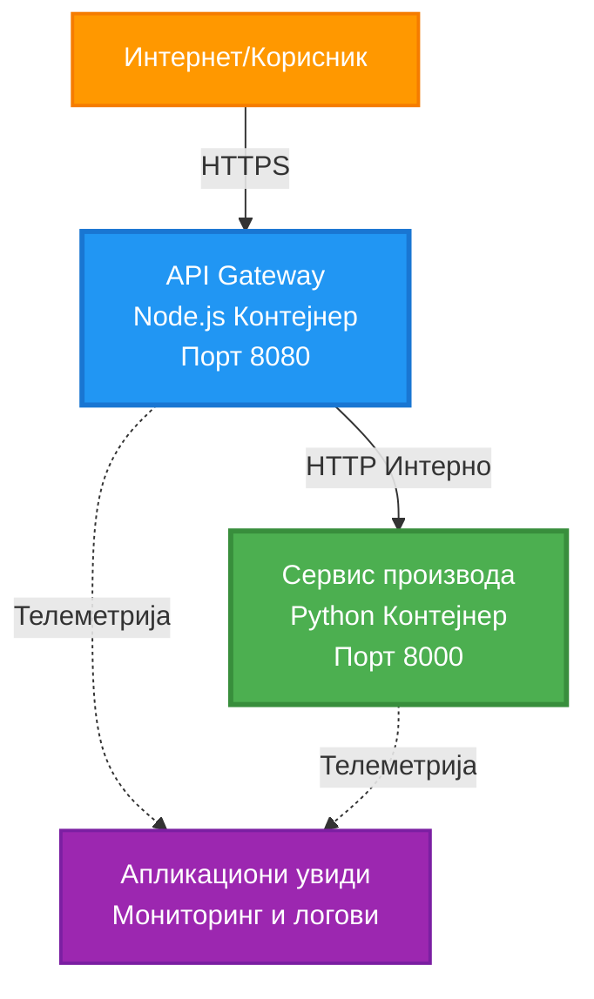
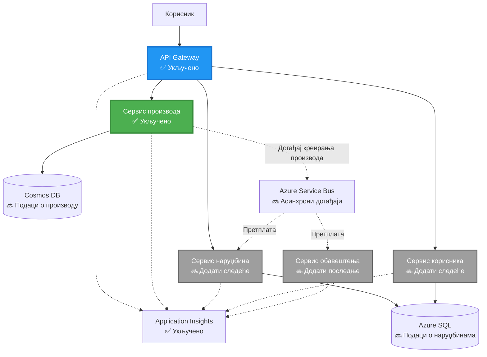
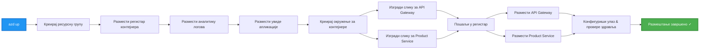
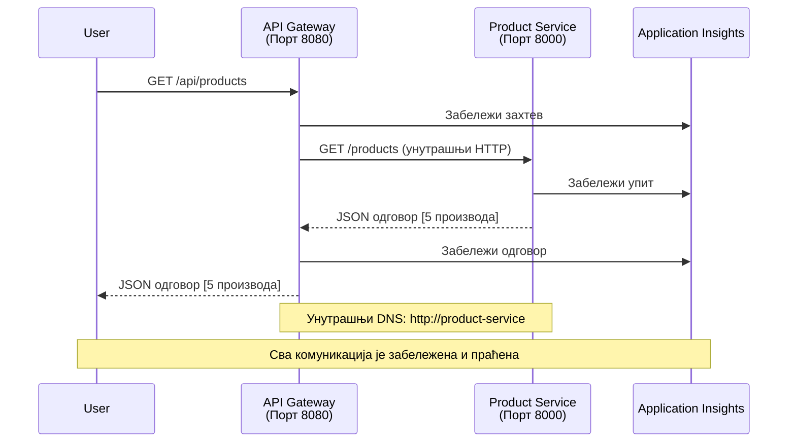

# Микросервисна архитектура - Пример апликације у контејнеру

⏱️ **Процењено време**: 25-35 минута | 💰 **Процењени трошак**: ~$50-100/месечно | ⭐ **Комплексност**: Напредно

**📚 Пут учења:**
- ← Претходно: [Једноставан Flask API](../../../../examples/container-app/simple-flask-api) - Основе једног контејнера
- 🎯 **Овде сте**: Микросервисна архитектура (основа са 2 услуге)
- → Следеће: [Интеграција вештачке интелигенције](../../../../docs/ai-foundry) - Додајте интелигенцију вашим услугама
- 🏠 [Почетна страна курса](../../README.md)

---

**Поједностављена, али функционална** микросервисна архитектура, распоређена на Azure Container Apps користећи AZD CLI. Овај пример демонстрира комуникацију између услуга, оркестрацију контејнера и праћење са практичним подешавањем од 2 услуге.

> **📚 Приступ учењу**: Овај пример почиње са минималном архитектуром од 2 услуге (API Gateway + Backend Service) коју заправо можете распоредити и научити. Након савладавања ове основе, пружамо смернице за проширење на пун микросервисни екосистем.

## Шта ћете научити

Завршетком овог примера, научићете:
- Како распоредити више контејнера на Azure Container Apps
- Како имплементирати комуникацију између услуга са интерним мрежама
- Како конфигурисати скалирање засновано на окружењу и провере здравља
- Како пратити дистрибуиране апликације помоћу Application Insights
- Како разумети обрасце распоређивања микросервиса и најбоље праксе
- Како постепено проширити архитектуру од једноставне до сложене

## Архитектура

### Фаза 1: Шта градимо (укључено у овај пример)


**Детаљи компоненти:**

| Компонента | Сврха | Приступ | Ресурси |
|------------|-------|---------|---------|
| **API Gateway** | Усмерава спољашње захтеве ка позадинским услугама | Јавно (HTTPS) | 1 vCPU, 2GB RAM, 2-20 реплика |
| **Product Service** | Управља каталогом производа са подацима у меморији | Само интерно | 0.5 vCPU, 1GB RAM, 1-10 реплика |
| **Application Insights** | Централизовано логовање и дистрибуирано праћење | Azure Portal | 1-2 GB/месечно уноса података |

**Зашто почети једноставно?**
- ✅ Брзо распоређивање и разумевање (25-35 минута)
- ✅ Учење основних образаца микросервиса без сложености
- ✅ Радни код који можете модификовати и експериментисати
- ✅ Мањи трошкови за учење (~$50-100/месечно у односу на $300-1400/месечно)
- ✅ Стицање самопоуздања пре додавања база података и редова порука

**Аналогија**: Замислите ово као учење вожње. Почињете на празном паркингу (2 услуге), савладате основе, а затим напредујете до градског саобраћаја (5+ услуга са базама података).

### Фаза 2: Будуће проширење (референтна архитектура)

Када савладате архитектуру са 2 услуге, можете је проширити на:


Погледајте одељак "Водич за проширење" на крају за корак-по-корак упутства.

## Укључене функције

✅ **Откривање услуга**: Аутоматско DNS откривање између контејнера  
✅ **Расподела оптерећења**: Уграђена расподела оптерећења између реплика  
✅ **Аутоматско скалирање**: Независно скалирање по услузи на основу HTTP захтева  
✅ **Праћење здравља**: Провере живости и спремности за обе услуге  
✅ **Дистрибуирано логовање**: Централизовано логовање са Application Insights  
✅ **Интерно умрежавање**: Сигурна комуникација између услуга  
✅ **Оркестрација контејнера**: Аутоматско распоређивање и скалирање  
✅ **Ажурирања без прекида рада**: Постепена ажурирања са управљањем ревизијама  

## Предуслови

### Потребни алати

Пре почетка, проверите да ли имате инсталиране следеће алате:

1. **[Azure Developer CLI (azd)](https://learn.microsoft.com/azure/developer/azure-developer-cli/install-azd)** (верзија 1.0.0 или новија)
   ```bash
   azd version
   # Очекивани излаз: azd верзија 1.0.0 или новија
   ```

2. **[Azure CLI](https://learn.microsoft.com/cli/azure/install-azure-cli)** (верзија 2.50.0 или новија)
   ```bash
   az --version
   # Очекивани излаз: azure-cli 2.50.0 или новији
   ```

3. **[Docker](https://www.docker.com/get-started)** (за локални развој/тестирање - опционо)
   ```bash
   docker --version
   # Очекивани резултат: Docker верзија 20.10 или новија
   ```

### Проверите своје окружење

Покрените ове команде да бисте потврдили да сте спремни:

```bash
# Проверите Azure Developer CLI
azd version
# ✅ Очекује се: azd верзија 1.0.0 или новија

# Проверите Azure CLI
az --version
# ✅ Очекује се: azure-cli 2.50.0 или новија

# Проверите Docker (опционално)
docker --version
# ✅ Очекује се: Docker верзија 20.10 или новија
```

**Критеријуми успеха**: Све команде враћају бројеве верзија који одговарају или премашују минималне.

### Захтеви за Azure

- Активна **Azure претплата** ([креирајте бесплатан налог](https://azure.microsoft.com/free/))
- Дозволе за креирање ресурса у вашој претплати
- **Contributor** улога на претплати или групи ресурса

### Предзнање

Ово је пример за **напредни ниво**. Требало би да имате:
- Завршен пример [Једноставан Flask API](../../../../examples/container-app/simple-flask-api) 
- Основно разумевање микросервисне архитектуре
- Познавање REST API-ја и HTTP-а
- Разумевање концепата контејнера

**Нови сте у Container Apps?** Почните са примером [Једноставан Flask API](../../../../examples/container-app/simple-flask-api) да бисте научили основе.

## Брзи почетак (корак-по-корак)

### Корак 1: Клонирајте и идите у директоријум

```bash
git clone https://github.com/microsoft/AZD-for-beginners.git
cd AZD-for-beginners/examples/microservices
```

**✓ Провера успеха**: Проверите да видите `azure.yaml`:
```bash
ls
# Очекује се: README.md, azure.yaml, infra/, src/
```

### Корак 2: Аутентификујте се са Azure

```bash
azd auth login
```

Ово отвара ваш прегледач за Azure аутентификацију. Пријавите се са вашим Azure акредитивима.

**✓ Провера успеха**: Требало би да видите:
```
Logged in to Azure.
```

### Корак 3: Иницијализујте окружење

```bash
azd init
```

**Питања која ћете видети**:
- **Име окружења**: Унесите кратко име (нпр. `microservices-dev`)
- **Azure претплата**: Изаберите вашу претплату
- **Azure локација**: Изаберите регион (нпр. `eastus`, `westeurope`)

**✓ Провера успеха**: Требало би да видите:
```
SUCCESS: New project initialized!
```

### Корак 4: Распоредите инфраструктуру и услуге

```bash
azd up
```

**Шта се дешава** (траје 8-12 минута):


**✓ Провера успеха**: Требало би да видите:
```
SUCCESS: Your application was deployed to Azure in X minutes Y seconds.
Endpoint: https://api-gateway-<unique-id>.azurecontainerapps.io
```

**⏱️ Време**: 8-12 минута

### Корак 5: Тестирајте распоређивање

```bash
# Преузмите крајњу тачку пролаза
GATEWAY_URL=$(azd env get-values | grep API_GATEWAY_URL | cut -d '=' -f2 | tr -d '"')

# Тестирајте здравље API пролаза
curl $GATEWAY_URL/health
```

**✅ Очекивани излаз:**
```json
{
  "status": "healthy",
  "service": "api-gateway",
  "timestamp": "2025-11-19T10:30:00Z"
}
```

**Тестирајте услугу производа преко gateway-а**:
```bash
# Листа производа
curl $GATEWAY_URL/api/products
```

**✅ Очекивани излаз:**
```json
[
  {"id":1,"name":"Laptop","price":999.99,"stock":50},
  {"id":2,"name":"Mouse","price":29.99,"stock":200},
  {"id":3,"name":"Keyboard","price":79.99,"stock":150}
]
```

**✓ Провера успеха**: Оба крајња тачке враћају JSON податке без грешака.

---

**🎉 Честитамо!** Успешно сте распоредили микросервисну архитектуру на Azure!

## Структура пројекта

Сви имплементациони фајлови су укључени—ово је комплетан, функционалан пример:

```
microservices/
│
├── README.md                         # This file
├── azure.yaml                        # AZD configuration
├── .gitignore                        # Git ignore patterns
│
├── infra/                           # Infrastructure as Code (Bicep)
│   ├── main.bicep                   # Main orchestration
│   ├── abbreviations.json           # Naming conventions
│   ├── core/                        # Shared infrastructure
│   │   ├── container-apps-environment.bicep  # Container environment + registry
│   │   └── monitor.bicep            # Application Insights + Log Analytics
│   └── app/                         # Service definitions
│       ├── api-gateway.bicep        # API Gateway container app
│       └── product-service.bicep    # Product Service container app
│
└── src/                             # Application source code
    ├── api-gateway/                 # Node.js API Gateway
    │   ├── app.js                   # Express server with routing
    │   ├── package.json             # Node dependencies
    │   └── Dockerfile               # Container definition
    └── product-service/             # Python Product Service
        ├── main.py                  # Flask API with product data
        ├── requirements.txt         # Python dependencies
        └── Dockerfile               # Container definition
```

**Шта свака компонента ради:**

**Инфраструктура (infra/):**
- `main.bicep`: Оркестрира све Azure ресурсе и њихове зависности
- `core/container-apps-environment.bicep`: Креира окружење за Container Apps и Azure Container Registry
- `core/monitor.bicep`: Поставља Application Insights за дистрибуирано логовање
- `app/*.bicep`: Појединачне дефиниције контејнерских апликација са скалирањем и проверама здравља

**API Gateway (src/api-gateway/):**
- Јавно доступна услуга која усмерава захтеве ка позадинским услугама
- Имплементира логовање, обраду грешака и прослеђивање захтева
- Демонстрира HTTP комуникацију између услуга

**Product Service (src/product-service/):**
- Интерна услуга са каталогом производа (у меморији ради једноставности)
- REST API са проверама здравља
- Пример обрасца позадинске микросервисне услуге

## Преглед услуга

### API Gateway (Node.js/Express)

**Порт**: 8080  
**Приступ**: Јавно (спољашњи улаз)  
**Сврха**: Усмерава долазне захтеве ка одговарајућим позадинским услугама  

**Крајње тачке**:
- `GET /` - Информације о услузи
- `GET /health` - Крајња тачка за проверу здравља
- `GET /api/products` - Прослеђује ка услузи производа (листа свих)
- `GET /api/products/:id` - Прослеђује ка услузи производа (добијање по ID-у)

**Кључне карактеристике**:
- Усмеравање захтева са axios-ом
- Централизовано логовање
- Обрада грешака и управљање временским ограничењима
- Откривање услуга преко променљивих окружења
- Интеграција са Application Insights

**Истакнути код** (`src/api-gateway/app.js`):
```javascript
// Унутрашња комуникација услуга
app.get('/api/products', async (req, res) => {
  const response = await axios.get(`${PRODUCT_SERVICE_URL}/products`, {
    timeout: 5000
  });
  res.json(response.data);
});
```

### Product Service (Python/Flask)

**Порт**: 8000  
**Приступ**: Само интерно (без спољашњег улаза)  
**Сврха**: Управља каталогом производа са подацима у меморији  

**Крајње тачке**:
- `GET /` - Информације о услузи
- `GET /health` - Крајња тачка за проверу здравља
- `GET /products` - Листа свих производа
- `GET /products/<id>` - Добијање производа по ID-у

**Кључне карактеристике**:
- RESTful API са Flask-ом
- Продавница производа у меморији (једноставно, без потребе за базом података)
- Праћење здравља са пробама
- Структурисано логовање
- Интеграција са Application Insights

**Модел података**:
```python
{
  "id": 1,
  "name": "Laptop",
  "description": "High-performance laptop",
  "price": 999.99,
  "stock": 50
}
```

**Зашто само интерно?**
Услуга производа није јавно изложена. Сви захтеви морају проћи кроз API Gateway, који пружа:
- Сигурност: Контролисана приступна тачка
- Флексибилност: Могућност промене позадине без утицаја на клијенте
- Праћење: Централизовано логовање захтева

## Разумевање комуникације између услуга

### Како услуге комуницирају


У овом примеру, API Gateway комуницира са услугом производа користећи **интерне HTTP позиве**:

```javascript
// АПИ Гејтвеј (src/api-gateway/app.js)
const PRODUCT_SERVICE_URL = process.env.PRODUCT_SERVICE_URL;

// Направи интерни HTTP захтев
const response = await axios.get(`${PRODUCT_SERVICE_URL}/products`);
```

**Кључне тачке**:

1. **Откривање засновано на DNS-у**: Container Apps аутоматски обезбеђује DNS за интерне услуге
   - FQDN услуге производа: `product-service.internal.<environment>.azurecontainerapps.io`
   - Поједностављено као: `http://product-service` (Container Apps то разрешава)

2. **Нема јавне изложености**: Услуга производа има `external: false` у Bicep-у
   - Доступна је само унутар окружења Container Apps
   - Не може се приступити са интернета

3. **Променљиве окружења**: URL-ови услуга се убацују током распоређивања
   - Bicep прослеђује интерни FQDN ка gateway-у
   - Нема хардкодираних URL-ова у коду апликације

**Аналогија**: Замислите ово као канцеларијске просторије. API Gateway је пријемни пулт (јавни), а услуга производа је канцеларијска просторија (само интерно). Посетиоци морају проћи кроз пријемни пулт да би дошли до било које канцеларије.

## Опције распоређивања

### Потпуно распоређивање (препоручено)

```bash
# Разместите инфраструктуру и оба сервиса
azd up
```

Ово распоређује:
1. Окружење за Container Apps
2. Application Insights
3. Container Registry
4. Контејнер API Gateway-а
5. Контејнер услуге производа

**Време**: 8-12 минута

### Распоређивање појединачне услуге

```bash
# Разместите само једну услугу (након почетног azd up)
azd deploy api-gateway

# Или разместите услугу производа
azd deploy product-service
```

**Случај употребе**: Када сте ажурирали код у једној услузи и желите да распоредите само ту услугу.

### Ажурирање конфигурације

```bash
# Промените параметре скалирања
azd env set GATEWAY_MAX_REPLICAS 30

# Поново примените са новом конфигурацијом
azd up
```

## Конфигурација

### Конфигурација скалирања

Обе услуге су конфигурисане са HTTP-заснованим аутоматским скалирањем у њиховим Bicep фајловима:

**API Gateway**:
- Минималне реплике: 2 (увек најмање 2 ради доступности)
- Максималне реплике: 20
- Окидач за скалирање: 50 истовремених захтева по реплици

**Product Service**:
- Минималне реплике: 1 (може се скалирати на нулу ако је потребно)
- Максималне реплике: 10
- Окидач за скалирање: 100 истовремених захтева по реплици

**Прилагодите скалирање** (у `infra/app/*.bicep`):
```bicep
scale: {
  minReplicas: 1
  maxReplicas: 10
  rules: [
    {
      name: 'http-scale-rule'
      http: {
        metadata: {
          concurrentRequests: '100'  // Adjust this
        }
      }
    }
  ]
}
```

### Додела ресурса

**API Gateway**:
- CPU: 1.0 vCPU
- Меморија: 2 GiB
- Разлог: Обрађује сав спољашњи саобраћај

**Product Service**:
- CPU: 0.5 vCPU
- Меморија: 1 GiB
- Разлог: Лагане операције у меморији

### Провере здравља

Обе услуге укључују провере живости и спремности:

```bicep
probes: [
  {
    type: 'Liveness'
    httpGet: {
      path: '/health'
      port: 8080
    }
    initialDelaySeconds: 10
    periodSeconds: 30
  }
  {
    type: 'Readiness'
    httpGet: {
      path: '/health'
      port: 8080
    }
    initialDelaySeconds: 5
    periodSeconds: 10
  }
]
```

**Шта ово значи**:
- **Живост**: Ако провера здравља не успе, Container Apps поново покреће контејнер
- **Спремност**: Ако није спреман, Container Apps престаје да усмерава саобраћај ка тој реплици

## Праћење и посматрање

### Прегледајте логове услуга

```bash
# Стримујте логове из API Gateway-а
azd logs api-gateway --follow

# Погледајте недавне логове услуге производа
azd logs product-service --tail 100

# Погледајте све логове из обе услуге
azd logs --follow
```

**Очекивани излаз**:
```
[api-gateway] API Gateway listening on port 8080
[api-gateway] Product Service URL: http://product-service
[api-gateway] GET /api/products 200 - 45ms
[product-service] Retrieved 5 products
```

### Упити у Application Insights

Приступите Application Insights у Azure Portal-у, затим покрените ове упите:

**Пронађите споре захтеве
3. Поново поставите оба сервиса:

```bash
azd deploy product-service
azd deploy api-gateway
```

4. Тестирајте нови крајњи тачку:

```bash
GATEWAY_URL=$(azd env get-values | grep API_GATEWAY_URL | cut -d '=' -f2 | tr -d '"')

# Направите нови производ
curl -X POST $GATEWAY_URL/api/products \
  -H "Content-Type: application/json" \
  -d '{"name":"USB Cable","price":9.99,"stock":500}'
```

**✅ Очекивани излаз:**
```json
{"id":6,"name":"USB Cable","description":"","price":9.99,"stock":500}
```

5. Проверите да ли се појављује на листи:

```bash
curl $GATEWAY_URL/api/products
# Сада би требало да приказује 6 производа укључујући нови USB кабл
```

**Критеријуми успеха**:
- ✅ POST захтев враћа HTTP 201
- ✅ Нови производ се појављује у GET /api/products листи
- ✅ Производ има аутоматски инкрементиран ID

**Време**: 10-15 минута

---

### Вежба 2: Измените правила за аутоматско скалирање ⭐⭐ (Средње)

**Циљ**: Промените Product Service да се скалира агресивније

**Почетна тачка**: `infra/app/product-service.bicep`

**Кораци**:

1. Отворите `infra/app/product-service.bicep` и пронађите `scale` блок (око линије 95)

2. Промените са:
```bicep
scale: {
  minReplicas: 1
  maxReplicas: 10
  rules: [
    {
      name: 'http-scale-rule'
      http: {
        metadata: {
          concurrentRequests: '100'  // OLD
        }
      }
    }
  ]
}
```

На:
```bicep
scale: {
  minReplicas: 2  // Always have 2 running
  maxReplicas: 20  // Allow more scaling
  rules: [
    {
      name: 'http-scale-rule'
      http: {
        metadata: {
          concurrentRequests: '20'  // Scale at lower threshold
        }
      }
    }
  ]
}
```

3. Поново поставите инфраструктуру:

```bash
azd up
```

4. Проверите нову конфигурацију скалирања:

```bash
az containerapp show \
  --name $(azd env get-values | grep PRODUCT_SERVICE | head -1 | cut -d '/' -f5) \
  --resource-group $(azd env get-values | grep AZURE_RESOURCE_GROUP | cut -d '=' -f2 | tr -d '"') \
  --query "properties.template.scale" -o json
```

**✅ Очекивани излаз:**
```json
{
  "minReplicas": 2,
  "maxReplicas": 20,
  "rules": [...]
}
```

5. Тестирајте аутоматско скалирање са оптерећењем:

```bash
# Генериши истовремене захтеве
for i in {1..500}; do curl $GATEWAY_URL/api/products & done

# Посматрај како се дешава скалирање
azd logs product-service --follow
# Потражи: Догађаје скалирања апликација у контејнерима
```

**Критеријуми успеха**:
- ✅ Product Service увек ради са најмање 2 реплике
- ✅ Под оптерећењем, скалира се на више од 2 реплике
- ✅ Azure Portal приказује нова правила скалирања

**Време**: 15-20 минута

---

### Вежба 3: Додајте прилагођени упит за праћење ⭐⭐ (Средње)

**Циљ**: Направите прилагођени упит у Application Insights за праћење перформанси API-ја за производе

**Кораци**:

1. Идите на Application Insights у Azure Portal:
   - Идите на Azure Portal
   - Пронађите вашу ресурсну групу (rg-microservices-*)
   - Кликните на ресурс Application Insights

2. Кликните на "Logs" у левом менију

3. Направите овај упит:

```kusto
requests
| where timestamp > ago(1h)
| where name contains "products"
| summarize 
    RequestCount = count(),
    AvgDuration = avg(duration),
    P95Duration = percentile(duration, 95),
    SuccessRate = 100.0 * countif(success == true) / count()
  by bin(timestamp, 5m)
| render timechart
```

4. Кликните "Run" да бисте покренули упит

5. Сачувајте упит:
   - Кликните "Save"
   - Назив: "Product API Performance"
   - Категорија: "Performance"

6. Генеришите тестни саобраћај:

```bash
for i in {1..100}; do curl $GATEWAY_URL/api/products; sleep 1; done
```

7. Освежите упит да бисте видели податке

**✅ Очекивани излаз:**
- Графикон који приказује број захтева током времена
- Просечно трајање < 500ms
- Стопа успеха = 100%
- Временски интервали од 5 минута

**Критеријуми успеха**:
- ✅ Упит приказује 100+ захтева
- ✅ Стопа успеха је 100%
- ✅ Просечно трајање < 500ms
- ✅ Графикон приказује временске интервале од 5 минута

**Резултат учења**: Разумевање како да пратите перформансе сервиса помоћу прилагођених упита

**Време**: 10-15 минута

---

### Вежба 4: Имплементирајте логику поновног покушаја ⭐⭐⭐ (Напредно)

**Циљ**: Додајте логику поновног покушаја у API Gateway када Product Service привремено није доступан

**Почетна тачка**: `src/api-gateway/app.js`

**Кораци**:

1. Инсталирајте библиотеку за поновни покушај:

```bash
cd src/api-gateway
npm install axios-retry --save
cd ../..
```

2. Ажурирајте `src/api-gateway/app.js` (додајте након увоза axios-а):

```javascript
const axiosRetry = require('axios-retry');

// Конфигуриши логику поновног покушаја
axiosRetry(axios, {
  retries: 3,
  retryDelay: (retryCount) => {
    return retryCount * 1000; // 1с, 2с, 3с
  },
  retryCondition: (error) => {
    // Поново покушај на грешкама мреже или 5xx одговорима
    return axiosRetry.isNetworkOrIdempotentRequestError(error) ||
           (error.response && error.response.status >= 500);
  }
});

console.log('Retry logic configured: 3 retries with exponential backoff');
```

3. Поново поставите API Gateway:

```bash
azd deploy api-gateway
```

4. Тестирајте понашање поновног покушаја симулирањем отказа сервиса:

```bash
# Скалирујте услугу производа на 0 (симулирајте квар)
az containerapp update \
  --name $(azd env get-values | grep PRODUCT_SERVICE | head -1 | cut -d '/' -f5) \
  --resource-group $(azd env get-values | grep AZURE_RESOURCE_GROUP | cut -d '=' -f2 | tr -d '"') \
  --min-replicas 0 \
  --max-replicas 0

# Покушајте да приступите производима (покушаће поново 3 пута)
time curl -v $GATEWAY_URL/api/products
# Посматрајте: Одговор траје ~6 секунди (1с + 2с + 3с покушаја)

# Вратите услугу производа
az containerapp update \
  --name $(azd env get-values | grep PRODUCT_SERVICE | head -1 | cut -d '/' -f5) \
  --resource-group $(azd env get-values | grep AZURE_RESOURCE_GROUP | cut -d '=' -f2 | tr -d '"') \
  --min-replicas 1 \
  --max-replicas 10
```

5. Погледајте логове поновних покушаја:

```bash
azd logs api-gateway --tail 50
# Потражите: Поруке о покушају поновног покушаја
```

**✅ Очекивано понашање:**
- Захтеви се покушавају поново 3 пута пре него што не успеју
- Сваки поновни покушај чека дуже (1с, 2с, 3с)
- Успешни захтеви након поновног покретања сервиса
- Логови приказују покушаје поновног покушаја

**Критеријуми успеха**:
- ✅ Захтеви се покушавају поново 3 пута пре него што не успеју
- ✅ Сваки поновни покушај чека дуже (експоненцијално повећање)
- ✅ Успешни захтеви након поновног покретања сервиса
- ✅ Логови приказују покушаје поновног покушаја

**Резултат учења**: Разумевање образаца отпорности у микросервисима (прекидачи, поновни покушаји, временска ограничења)

**Време**: 20-25 минута

---

## Провера знања

Након завршетка овог примера, проверите своје разумевање:

### 1. Комуникација између сервиса ✓

Тестирајте своје знање:
- [ ] Можете ли објаснити како API Gateway открива Product Service? (DNS-базирано откривање сервиса)
- [ ] Шта се дешава ако Product Service не ради? (Gateway враћа 503 грешку)
- [ ] Како бисте додали трећи сервис? (Направите нови Bicep фајл, додајте у main.bicep, направите src фолдер)

**Практична провера**:
```bash
# Симулирајте отказивање услуге
az containerapp update --name <product-service-name> --min-replicas 0 --max-replicas 0
curl $GATEWAY_URL/api/products
# ✅ Очекује се: 503 Услуга недоступна

# Вратите услугу
az containerapp update --name <product-service-name> --min-replicas 1 --max-replicas 10
```

### 2. Праћење и видљивост ✓

Тестирајте своје знање:
- [ ] Где видите дистрибуиране логове? (Application Insights у Azure Portal-у)
- [ ] Како пратите споре захтеве? (Kusto упит: `requests | where duration > 1000`)
- [ ] Можете ли идентификовати који сервис је изазвао грешку? (Проверите `cloud_RoleName` поље у логовима)

**Практична провера**:
```bash
# Генериши симулацију спорог захтева
curl "$GATEWAY_URL/api/products?delay=2000"

# Упитај Application Insights за споре захтеве
# Иди на Azure Portal → Application Insights → Logs
# Покрени: requests | where duration > 1000 | project timestamp, name, duration, cloud_RoleName
```

### 3. Скалирање и перформансе ✓

Тестирајте своје знање:
- [ ] Шта покреће аутоматско скалирање? (Правила за истовремене HTTP захтеве: 50 за gateway, 100 за product)
- [ ] Колико реплика тренутно ради? (Проверите са `az containerapp revision list`)
- [ ] Како бисте скалирали Product Service на 5 реплика? (Ажурирајте minReplicas у Bicep-у)

**Практична провера**:
```bash
# Генериши оптерећење за тестирање аутоматског скалирања
for i in {1..1000}; do curl $GATEWAY_URL/api/products & done

# Прати повећање реплика
azd logs api-gateway --follow
# ✅ Очекујемо: Видети догађаје скалирања у логовима
```

**Критеријуми успеха**: Можете одговорити на сва питања и проверити са практичним командама.

---

## Анализа трошкова

### Процењени месечни трошкови (за овај пример са 2 сервиса)

| Ресурс | Конфигурација | Процењени трошак |
|--------|--------------|------------------|
| API Gateway | 2-20 реплика, 1 vCPU, 2GB RAM | $30-150 |
| Product Service | 1-10 реплика, 0.5 vCPU, 1GB RAM | $15-75 |
| Container Registry | Основни ниво | $5 |
| Application Insights | 1-2 GB/месечно | $5-10 |
| Log Analytics | 1 GB/месечно | $3 |
| **Укупно** | | **$58-243/месечно** |

### Разбијање трошкова по употреби

**Лаган саобраћај** (тестирање/учење): ~$60/месечно
- API Gateway: 2 реплике × 24/7 = $30
- Product Service: 1 реплика × 24/7 = $15
- Праћење + Регистар = $13

**Умерен саобраћај** (мала продукција): ~$120/месечно
- API Gateway: 5 просечних реплика = $75
- Product Service: 3 просечне реплике = $45
- Праћење + Регистар = $13

**Висок саобраћај** (периоди велике активности): ~$240/месечно
- API Gateway: 15 просечних реплика = $225
- Product Service: 8 просечних реплика = $120
- Праћење + Регистар = $13

### Савети за оптимизацију трошкова

1. **Скалирајте на нулу за развој**:
   ```bicep
   scale: {
     minReplicas: 0  // Save $30-40/month when not in use
     maxReplicas: 10
   }
   ```

2. **Користите Consumption Plan за Cosmos DB** (када га додате):
   - Плаћате само оно што користите
   - Нема минималне накнаде

3. **Подесите Application Insights Sampling**:
   ```javascript
   appInsights.defaultClient.config.samplingPercentage = 50; // Узорак 50% захтева
   ```

4. **Очистите када није потребно**:
   ```bash
   azd down --force --purge
   ```

### Опције бесплатног нивоа

За учење/тестирање, размотрите:
- ✅ Користите Azure бесплатне кредите ($200 за првих 30 дана са новим налозима)
- ✅ Држите се минималног броја реплика (штеди ~50% трошкова)
- ✅ Обришите након тестирања (нема сталних трошкова)
- ✅ Скалирајте на нулу између сесија учења

**Пример**: Покретање овог примера 2 сата/дан × 30 дана = ~$5/месечно уместо $60/месечно

---

## Брза референца за решавање проблема

### Проблем: `azd up` не успева са "Subscription not found"

**Решење**:
```bash
# Поново се пријавите са експлицитном претплатом
az account set --subscription <your-subscription-id>
azd env set AZURE_SUBSCRIPTION_ID <your-subscription-id>
azd up
```

### Проблем: API Gateway враћа 503 "Product service unavailable"

**Дијагноза**:
```bash
# Проверите записе услуге производа
azd logs product-service --tail 50

# Проверите здравље услуге производа
az containerapp show \
  --name $(azd env get-values | grep PRODUCT_SERVICE | head -1 | cut -d '/' -f5) \
  --resource-group $(azd env get-values | grep AZURE_RESOURCE_GROUP | cut -d '=' -f2 | tr -d '"') \
  --query "properties.runningStatus"
```

**Уобичајени узроци**:
1. Product service није покренут (проверите логове за Python грешке)
2. Health check не успева (проверите да ли `/health` крајња тачка ради)
3. Грађење слике контејнера није успело (проверите регистар за слику)

### Проблем: Аутоматско скалирање не ради

**Дијагноза**:
```bash
# Проверите тренутни број реплика
az containerapp revision list \
  --name $(azd env get-values | grep API_GATEWAY | head -1 | cut -d '/' -f5) \
  --resource-group $(azd env get-values | grep AZURE_RESOURCE_GROUP | cut -d '=' -f2 | tr -d '"') \
  --query "[].properties.replicas"

# Генеришите оптерећење за тестирање
for i in {1..1000}; do curl $GATEWAY_URL/api/products & done

# Пратите догађаје скалирања
azd logs api-gateway --follow | grep -i scale
```

**Уобичајени узроци**:
1. Оптерећење није довољно високо да покрене правило скалирања (потребно >50 истовремених захтева)
2. Максималан број реплика је већ достигнут (проверите Bicep конфигурацију)
3. Правило скалирања је погрешно конфигурисано у Bicep-у (проверите вредност concurrentRequests)

### Проблем: Application Insights не приказује логове

**Дијагноза**:
```bash
# Проверите да ли је постављен низ за повезивање
azd env get-values | grep APPLICATIONINSIGHTS

# Проверите да ли услуге шаљу телеметрију
az monitor app-insights component show \
  --app $(azd env get-values | grep APPLICATIONINSIGHTS_NAME | cut -d '=' -f2 | tr -d '"') \
  --resource-group $(azd env get-values | grep AZURE_RESOURCE_GROUP | cut -d '=' -f2 | tr -d '"') \
  --query "properties.InstrumentationKey"
```

**Уобичајени узроци**:
1. Веза није прослеђена контејнеру (проверите променљиве окружења)
2. Application Insights SDK није конфигурисан (проверите увозе у коду)
3. Firewall блокира телеметрију (ретко, проверите мрежна правила)

### Проблем: Docker build не успева локално

**Дијагноза**:
```bash
# Тестирај изградњу API Gateway-а
cd src/api-gateway
docker build -t test-gateway .

# Тестирај изградњу услуге производа
cd ../product-service
docker build -t test-product .
```

**Уобичајени узроци**:
1. Недостају зависности у package.json/requirements.txt
2. Синтаксне грешке у Dockerfile-у
3. Проблеми са мрежом приликом преузимања зависности

**И даље имате проблем?** Погледајте [Водич за уобичајене проблеме](../../docs/troubleshooting/common-issues.md) или [Azure Container Apps Troubleshooting](https://learn.microsoft.com/azure/container-apps/troubleshooting)

---

## Чишћење

Да бисте избегли сталне трошкове, обришите све ресурсе:

```bash
azd down --force --purge
```

**Потврда**:
```
? Total resources to delete: 6, are you sure you want to continue? (y/N)
```

Унесите `y` за потврду.

**Шта се брише**:
- Окружење за Container Apps
- Оба Container Apps (gateway & product service)
- Container Registry
- Application Insights
- Log Analytics Workspace
- Ресурсна група

**✓ Потврдите чишћење**:
```bash
az group list --query "[?starts_with(name,'rg-microservices')]" --output table
```

Требало би да врати празно.

---

## Водич за проширење: Од 2 до 5+ сервиса

Када савладате ову архитектуру са 2 сервиса, ево како да је проширите:

### Фаза 1: Додајте базу података (Следећи корак)

**Додајте Cosmos DB за Product Service**:

1. Направите `infra/core/cosmos.bicep`:
   ```bicep
   resource cosmosAccount 'Microsoft.DocumentDB/databaseAccounts@2023-04-15' = {
     name: name
     location: location
     kind: 'GlobalDocumentDB'
     properties: {
       databaseAccountOfferType: 'Standard'
       consistencyPolicy: { defaultConsistencyLevel: 'Session' }
       locations: [{ locationName: location, failoverPriority: 0 }]
     }
   }
   ```

2. Ажурирајте Product Service да користи Azure Cosmos DB Python SDK уместо података у меморији

3. Процењени додатни трошак: ~$25/месечно (serverless)

### Фаза 2: Додајте трећи сервис (Управљање наруџбинама)

**Направите Order Service**:

1. Нови фолдер: `src/order-service/` (Python/Node.js/C#)
2. Нови Bicep: `infra/app/order-service.bicep`
3. Ажурирајте API Gateway да усмерава `/api/orders`
4. Додајте Azure SQL Database за чување наруџбина

**Архитектура постаје**:
```
API Gateway → Product Service (Cosmos DB)
           → Order Service (Azure SQL)
```

### Фаза 3: Додајте асинхрону комуникацију (Service Bus)

**Имплементирајте архитектуру засновану на догађајима**:

1. Додајте Azure Service Bus: `infra/core/servicebus.bicep`
2. Product Service објављује "ProductCreated" догађаје
3. Order Service се претплаћује на догађаје производа
4. Додајте Notification Service за обраду догађаја

**Шаблон**: Захтев/Одговор (HTTP) + Догађајно управљање (Service Bus)

### Фаза 4: Додајте аутентификацију корисника

**Имплементирајте User Service**:

1. Направите `src/user-service/` (Go/Node.js)
2. Додајте Azure AD B2C или прилагођену JWT аутентификацију
3. API Gateway проверава токене пре усмеравања
4. Сервиси проверавају дозволе корисника

### Фаза 5: Спремност за продукцију

**Додајте ове компоненте**:
- ✅ Azure Front Door (глобално балансирање оптерећења)
- ✅ Azure Key Vault (управљање тајнама)
- ✅ Azure Monitor Workbooks (прилагођене контролне табле)
- ✅ CI/CD Pipeline (GitHub Actions)
- ✅ Blue-Green Deployments
- ✅ Managed Identity за све сервисе

**Пуни трошак продукцијске архитектуре**: ~$300-1,400/месечно

---

## Сазнајте више

### Повезана документација
- [Azure Container Apps Документација](https://learn.microsoft.com/azure/container-apps/)
- [Водич за микросервисну архитектуру](https://learn.microsoft.com/azure/architecture/guide/architecture-styles/microservices)
- [Application Insights за дистрибуирано праћење](https://learn.microsoft.com/azure/azure-monitor/app/distributed-tracing)
- [Azure Developer CLI Документација](https://learn.microsoft.com/azure/developer/azure-developer-cli/)

### Следећи кораци у овом курсу
- ← Претходно: [Једноставан Flask API](../../../../examples/container-app/simple-flask-api) - Почетни пример са једним контејнером
- → Следеће: [Водич за интеграцију AI](../../../../docs/ai-foundry) - Додајте AI могућности
- 🏠 [Почетна страна курса](../../README.md)

### Поређење: Када користити шта

| Карактеристика | Један контејнер | Микросервиси (Ово) | Kubernetes (AKS) |
|----------------|-----------------|--------------------|------------------|
| **Случај употребе** | Једноставне апликације | Комплекс
| **Најбоље за** | MVP-ове, прототипе | Апликације за продукцију | Мулти-клауд, напредно умрежавање |

**Препорука**: Почните са Container Apps (овим примером), пређите на AKS само ако су вам потребне специфичне Kubernetes функције.

---

## Често постављана питања

**П: Зашто само 2 услуге уместо 5+?**  
О: Едукативна прогресија. Савладајте основе (комуникација услуга, мониторинг, скалирање) уз једноставан пример пре додавања сложености. Шаблони које овде научите примењују се на архитектуре са 100 услуга.

**П: Могу ли сам да додам више услуга?**  
О: Апсолутно! Пратите водич за проширење изнад. Свака нова услуга прати исти шаблон: креирајте src фолдер, креирајте Bicep фајл, ажурирајте azure.yaml, и деплојтујте.

**П: Да ли је ово спремно за продукцију?**  
О: Ово је солидна основа. За продукцију додајте: управљани идентитет, Key Vault, перзистентне базе података, CI/CD pipeline, мониторинг аларме и стратегију за бекап.

**П: Зашто не користити Dapr или други service mesh?**  
О: Задржите једноставност ради учења. Када разумете умрежавање унутар Container Apps, можете додати Dapr за напредне сценарије (управљање стањем, pub/sub, bindings).

**П: Како да дебагујем локално?**  
О: Покрените услуге локално уз Docker:  
```bash
cd src/api-gateway
docker build -t local-gateway .
docker run -p 8080:8080 -e PRODUCT_SERVICE_URL=http://localhost:8000 local-gateway
```
  
**П: Могу ли користити различите програмске језике?**  
О: Да! Овај пример приказује Node.js (gateway) + Python (product service). Можете мешати било које језике који раде у контејнерима: C#, Go, Java, Ruby, PHP, итд.

**П: Шта ако немам Azure кредите?**  
О: Користите Azure бесплатни ниво (првих 30 дана са новим налозима добијате $200 кредита) или деплојтујте за кратке тест периоде и одмах обришите. Овај пример кошта око ~$2/дан.

**П: Како се ово разликује од Azure Kubernetes Service (AKS)?**  
О: Container Apps је једноставнији (није потребно знање о Kubernetes-у), али мање флексибилан. AKS вам даје потпуну контролу над Kubernetes-ом, али захтева више експертизе. Почните са Container Apps, пређите на AKS ако је потребно.

**П: Могу ли ово користити са постојећим Azure услугама?**  
О: Да! Можете се повезати са постојећим базама података, storage налозима, Service Bus-ом, итд. Ажурирајте Bicep фајлове да референцирају постојеће ресурсе уместо да креирате нове.

---

> **🎓 Резиме пута учења**: Научили сте како да деплојтујете архитектуру са више услуга уз аутоматско скалирање, интерно умрежавање, централизовани мониторинг и шаблоне спремне за продукцију. Ова основа вас припрема за сложене дистрибуиране системе и архитектуре микроуслуга за предузећа.

**📚 Навигација курса:**
- ← Претходно: [Једноставни Flask API](../../../../examples/container-app/simple-flask-api)
- → Следеће: [Пример интеграције базе података](../../../../database-app)
- 🏠 [Почетна страна курса](../../README.md)
- 📖 [Најбоље праксе за Container Apps](../../docs/deployment/deployment-guide.md)

---

**✨ Честитамо!** Завршили сте пример микроуслуга. Сада разумете како да изградите, деплојтујете и мониторишете дистрибуиране апликације на Azure Container Apps. Спремни сте да додате AI могућности? Погледајте [Водич за интеграцију AI](../../../../docs/ai-foundry)!

---

<!-- CO-OP TRANSLATOR DISCLAIMER START -->
**Одрицање од одговорности**:  
Овај документ је преведен помоћу услуге за превођење вештачке интелигенције [Co-op Translator](https://github.com/Azure/co-op-translator). Иако настојимо да обезбедимо тачност, молимо вас да имате у виду да аутоматски преводи могу садржати грешке или нетачности. Оригинални документ на његовом изворном језику треба сматрати ауторитативним извором. За критичне информације препоручује се професионални превод од стране људи. Не преузимамо одговорност за било каква погрешна тумачења или неспоразуме који могу произаћи из коришћења овог превода.
<!-- CO-OP TRANSLATOR DISCLAIMER END -->