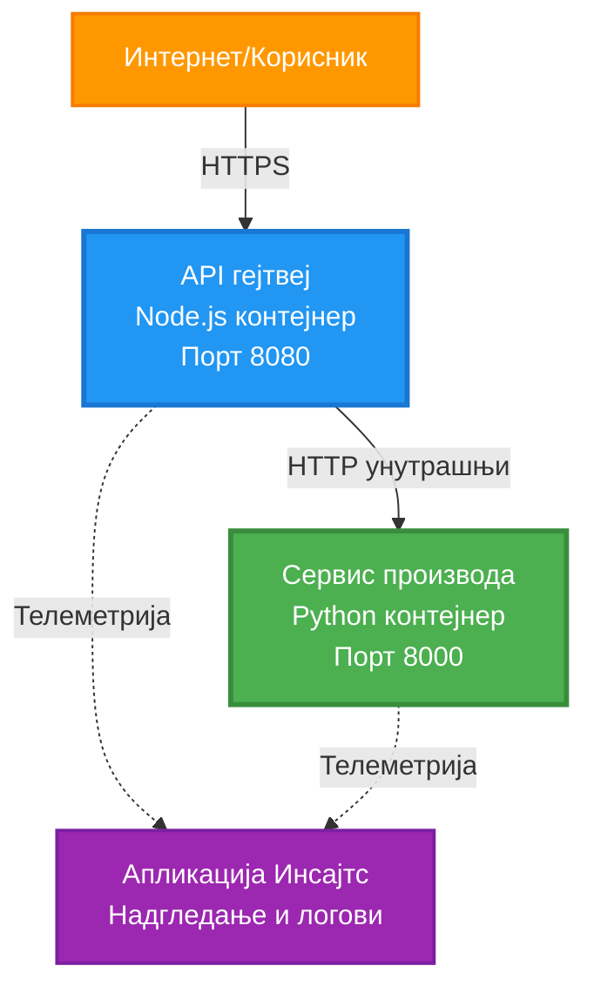
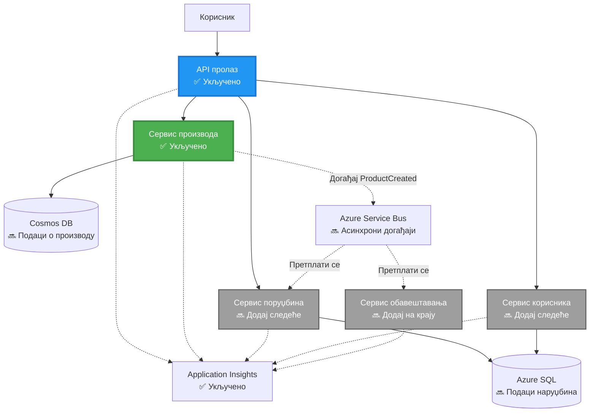
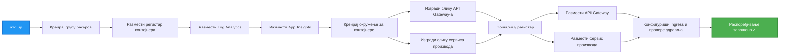
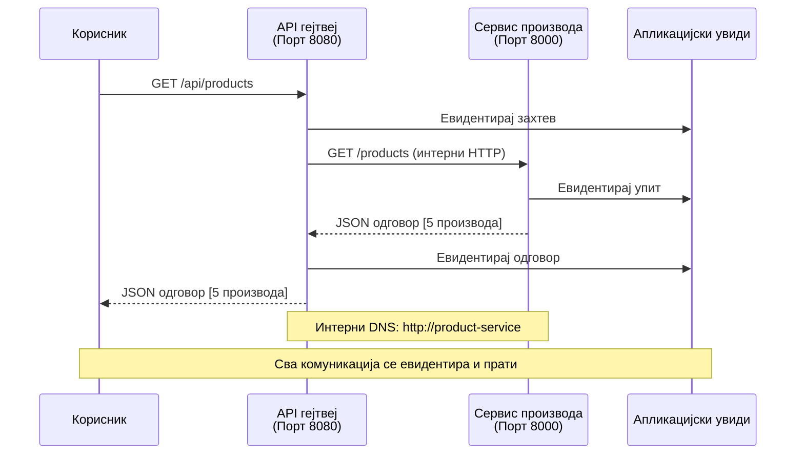

# Микросервисна архитектура - Примерак Container App

⏱️ **Процењено време**: 25-35 минута | 💰 **Процењени трошак**: ~$50-100/месец | ⭐ **Сложеност**: Напредни

**📚 Пут учења:**
- ← Претходно: [Једноставан Flask API](../../../../examples/container-app/simple-flask-api) - Основе једног контејнера
- 🎯 **Ви сте овде**: Микросервисна архитектура (основа од 2 сервиса)
- → Следеће: [AI Integration](../../../../docs/ai-foundry) - Додавање интелигенције вашим сервисима
- 🏠 [Почетак курса](../../README.md)

---

Једноставна, али функционална микросервисна архитектура разврстана у Azure Container Apps користећи AZD CLI. Овај пример демонстрира комуникацију између сервиса, оркестрацију контејнера и мониторинг са практичним подешавањем од 2 сервиса.

> **📚 Приступ учењу**: Овај пример почиње минималном архитектуром од 2 сервиса (API пролаз + Бекенд сервис) коју можете заправо деплојовати и учити из ње. Након што савладате ову основу, пружамо смернице за проширење у пуни микросервисни екосистем.

## Шта ћете научити

Завршетком овог примера, ви ћете:
- Деплојовати више контејнера у Azure Container Apps
- Имплементирати комуникацију сервис‑до‑сервисa са интерном мрежом
- Конфигурисати скалирање на основу окружења и health checks
- Надгледати дистрибуиране апликације са Application Insights
- Разумети обрасце деплоја микросервиса и најбоље праксе
- Научити постепено проширење од једноставних до сложених архитектура

## Архитектура

### Фаза 1: Шта градимо (укључено у овај пример)


```mermaid
graph TB
    Internet[Интернет/Корисник]
    Gateway[API гејтвеј<br/>Node.js контејнер<br/>Порт 8080]
    Product[Сервис производа<br/>Python контејнер<br/>Порт 8000]
    AppInsights[Апликација Инсајтс<br/>Надгледање и логови]
    
    Internet -->|HTTPS| Gateway
    Gateway -->|HTTP унутрашњи| Product
    Gateway -.->|Телеметрија| AppInsights
    Product -.->|Телеметрија| AppInsights
    
    style Gateway fill:#2196F3,stroke:#1976D2,stroke-width:3px,color:#fff
    style Product fill:#4CAF50,stroke:#388E3C,stroke-width:3px,color:#fff
    style Internet fill:#FF9800,stroke:#F57C00,stroke-width:2px,color:#fff
    style AppInsights fill:#9C27B0,stroke:#7B1FA2,stroke-width:2px,color:#fff
```
**Детаљи компонената:**

| Компонента | Сврха | Приступ | Ресурси |
|-----------|---------|--------|-----------|
| **API Gateway** | Прослеђује спољне захтеве backend сервисима | Јавно (HTTPS) | 1 vCPU, 2GB RAM, 2-20 реплика |
| **Product Service** | Управља каталогом производа са подацима у меморији | Само интерно | 0.5 vCPU, 1GB RAM, 1-10 реплика |
| **Application Insights** | Централизовано логовање и расподељено трасирање | Azure Portal | 1-2 GB/месечно унос података |

**Зашто почети једноставно?**
- ✅ Брзо деплојовање и разумевање (25-35 минута)
- ✅ Учење основних микросервисних образаца без комплексности
- ✅ Радни код који можете модификовати и експериментисати
- ✅ Нижи трошак за учење (~$50-100/месец уместо $300-1400/месец)
- ✅ Изграђујте поверење пре додавања база података и редова порука

**Аналогија**: Замислите ово као учење вожње. Почнете на празном паркиралишту (2 сервиса), савладате основе, па пређете на градску вожњу (5+ сервиса са базама података).

### Фаза 2: Будуће проширивање (Референсна архитектура)

Када савладате архитектуру од 2 сервиса, можете проширити на:


```mermaid
graph TB
    User[Корисник]
    Gateway[API пролаз<br/>✅ Укључено]
    Product[Сервис производа<br/>✅ Укључено]
    Order[Сервис поруџбина<br/>🔜 Додај следеће]
    UserSvc[Сервис корисника<br/>🔜 Додај следеће]
    Notify[Сервис обавештавања<br/>🔜 Додај на крају]
    
    CosmosDB[(Cosmos DB<br/>🔜 Подаци о производу)]
    AzureSQL[(Azure SQL<br/>🔜 Подаци наруџбина)]
    ServiceBus[Azure Service Bus<br/>🔜 Асинхрони догађаји]
    AppInsights[Application Insights<br/>✅ Укључено]
    
    User --> Gateway
    Gateway --> Product
    Gateway --> Order
    Gateway --> UserSvc
    
    Product --> CosmosDB
    Order --> AzureSQL
    UserSvc --> AzureSQL
    
    Product -.->|Догађај ProductCreated| ServiceBus
    ServiceBus -.->|Претплати се| Notify
    ServiceBus -.->|Претплати се| Order
    
    Gateway -.-> AppInsights
    Product -.-> AppInsights
    Order -.-> AppInsights
    UserSvc -.-> AppInsights
    Notify -.-> AppInsights
    
    style Product fill:#4CAF50,stroke:#388E3C,stroke-width:3px,color:#fff
    style Gateway fill:#2196F3,stroke:#1976D2,stroke-width:3px,color:#fff
    style Order fill:#9E9E9E,stroke:#616161,stroke-width:2px,color:#fff
    style UserSvc fill:#9E9E9E,stroke:#616161,stroke-width:2px,color:#fff
    style Notify fill:#9E9E9E,stroke:#616161,stroke-width:2px,color:#fff
```
Погледајте одељак "Expansion Guide" на крају за корак-по-корак упутства.

## Укључене функције

✅ **Откривање сервиса**: Аутоматско DNS засновано откривање између контејнера  
✅ **Балансирање оптерећења**: Уграђено балансирање оптерећења међу репликама  
✅ **Аутоматско скалирање**: Независно скалирање по сервису на основу HTTP захтева  
✅ **Надгледање здравља**: Liveness и readiness probes за оба сервиса  
✅ **Дистрибуирано логовање**: Централизовано логовање са Application Insights  
✅ **Инterna мрежа**: Безбедна комуникација сервис‑до‑сервисa  
✅ **Оркестрација контејнера**: Аутоматски деплој и скалирање  
✅ **Ажурирања без прекида**: Rolling updates са управљањем ревизијама  

## Предуслови

### Потребни алати

Пре почетка, проверите да имате инсталиране следеће алате:

1. **[Azure Developer CLI (azd)](https://learn.microsoft.com/azure/developer/azure-developer-cli/install-azd)** (верзија 1.0.0 или новија)
   ```bash
   azd version
   # Очекивани излаз: azd верзија 1.0.0 или новија
   ```

2. **[Azure CLI](https://learn.microsoft.com/cli/azure/install-azure-cli)** (верзија 2.50.0 или новија)
   ```bash
   az --version
   # Очекивани излаз: azure-cli 2.50.0 или новији
   ```

3. **[Docker](https://www.docker.com/get-started)** (за локални развој/тестирање - опционално)
   ```bash
   docker --version
   # Очекивани излаз: Docker верзија 20.10 или новија
   ```

### Потврдите ваше подешавање

Покрените ове команде да потврдите да сте спремни:

```bash
# Проверите Azure Developer CLI
azd version
# ✅ Очекује се: azd верзија 1.0.0 или новија

# Проверите Azure CLI
az --version
# ✅ Очекује се: azure-cli верзија 2.50.0 или новија

# Проверите Docker (опционо)
docker --version
# ✅ Очекује се: Docker верзија 20.10 или новија
```

**Критеријуми успеха**: Све команде враћају бројеве верзија који одговарају или премашују минималне захтеве.

### Захтеви за Azure

- Активна **Azure претплата** ([направите бесплатан налог](https://azure.microsoft.com/free/))
- Привилегије за креирање ресурса у вашој претплати
- **Contributor** улога на претплати или ресурсној групи

### Потребно предзнање

Ово је **напредни ниво** примера. Треба да имате:
- Завршен [Пример Једноставног Flask API-ја](../../../../examples/container-app/simple-flask-api) 
- Основно разумевање микросервисне архитектуре
- Познавање REST API‑ја и HTTP‑а
- Разумевање концепата контејнера

**Ново у Container Apps?** Почните са [Примером Једноставног Flask API-ја](../../../../examples/container-app/simple-flask-api) прво да бисте научили основе.

## Брзи почетак (Корак-по-корак)

### Корак 1: Клонирајте и пређите у репозиторијум

```bash
git clone https://github.com/microsoft/AZD-for-beginners.git
cd AZD-for-beginners/examples/microservices
```

**✓ Провера успеха**: Уверите се да видите `azure.yaml`:
```bash
ls
# Очекује се: README.md, azure.yaml, infra/, src/
```

### Корак 2: Аутентификовати се на Azure

```bash
azd auth login
```

Ово отвара ваш прегледач за Azure аутентификацију. Пријавите се са вашим Azure акредитивима.

**✓ Провера успеха**: Требало би да видите:
```
Logged in to Azure.
```

### Корак 3: Иницијализујте окружење

```bash
azd init
```

**Подесни прикази које ћете видети**:
- **Назив окружења**: Унесите кратак назив (нпр. `microservices-dev`)
- **Azure претплата**: Изаберите вашу претплату
- **Azure локација**: Одаберите регион (нпр. `eastus`, `westeurope`)

**✓ Провера успеха**: Требало би да видите:
```
SUCCESS: New project initialized!
```

### Корак 4: Деплојујте инфраструктуру и сервисе

```bash
azd up
```

**Шта се дешава** (траје 8-12 минута):


```mermaid
graph LR
    A[azd up] --> B[Креирај групу ресурса]
    B --> C[Размести регистар контејнера]
    C --> D[Размести Log Analytics]
    D --> E[Размести App Insights]
    E --> F[Креирај окружење за контејнере]
    F --> G[Изгради слику API Gateway-а]
    F --> H[Изгради слику сервиса производа]
    G --> I[Пошаљи у регистар]
    H --> I
    I --> J[Размести API Gateway]
    I --> K[Размести сервис производа]
    J --> L[Конфигуриши Ingress и провере здравља]
    K --> L
    L --> M[Распоређивање завршено ✓]
    
    style A fill:#2196F3,stroke:#1976D2,stroke-width:3px,color:#fff
    style M fill:#4CAF50,stroke:#388E3C,stroke-width:3px,color:#fff
```
**✓ Провера успеха**: Требало би да видите:
```
SUCCESS: Your application was deployed to Azure in X minutes Y seconds.
Endpoint: https://api-gateway-<unique-id>.azurecontainerapps.io
```

**⏱️ Време**: 8-12 минута

### Корак 5: Тестирајте деплој

```bash
# Добијте крајњу тачку гејтвеја
GATEWAY_URL=$(azd env get-values | grep API_GATEWAY_URL | cut -d '=' -f2 | tr -d '"')

# Проверите здравље АПИ гејтвеја
curl $GATEWAY_URL/health
```

**✅ Очекујани излаз:**
```json
{
  "status": "healthy",
  "service": "api-gateway",
  "timestamp": "2025-11-19T10:30:00Z"
}
```

**Тестирајте производни сервис кроз пролаз**:
```bash
# Листа производа
curl $GATEWAY_URL/api/products
```

**✅ Очекујани излаз:**
```json
[
  {"id":1,"name":"Laptop","price":999.99,"stock":50},
  {"id":2,"name":"Mouse","price":29.99,"stock":200},
  {"id":3,"name":"Keyboard","price":79.99,"stock":150}
]
```

**✓ Провера успеха**: Обе крајње тачке враћају JSON податке без грешака.

---

**🎉 Честитамо!** Деплојовали сте микросервисну архитектуру у Azure!

## Структура пројекта

Сви имплементациони фајлови су укључени—ово је потпун, радни пример:

```
microservices/
│
├── README.md                         # This file
├── azure.yaml                        # AZD configuration
├── .gitignore                        # Git ignore patterns
│
├── infra/                           # Infrastructure as Code (Bicep)
│   ├── main.bicep                   # Main orchestration
│   ├── abbreviations.json           # Naming conventions
│   ├── core/                        # Shared infrastructure
│   │   ├── container-apps-environment.bicep  # Container environment + registry
│   │   └── monitor.bicep            # Application Insights + Log Analytics
│   └── app/                         # Service definitions
│       ├── api-gateway.bicep        # API Gateway container app
│       └── product-service.bicep    # Product Service container app
│
└── src/                             # Application source code
    ├── api-gateway/                 # Node.js API Gateway
    │   ├── app.js                   # Express server with routing
    │   ├── package.json             # Node dependencies
    │   └── Dockerfile               # Container definition
    └── product-service/             # Python Product Service
        ├── main.py                  # Flask API with product data
        ├── requirements.txt         # Python dependencies
        └── Dockerfile               # Container definition
```

**Шта свака компонента ради:**

**Инфраструктура (infra/)**:
- `main.bicep`: Оркестрira све Azure ресурсе и њихове зависности
- `core/container-apps-environment.bicep`: Креира Container Apps окружење и Azure Container Registry
- `core/monitor.bicep`: Подешава Application Insights за дистрибуирано логовање
- `app/*.bicep`: Појединачне дефиниције container app‑ова са скалирањем и health checks

**API Gateway (src/api-gateway/)**:
- Јавно доступан сервис који прослеђује захтеве ка бекенд сервисима
- Имплементира логовање, руковање грешкама и прослеђивање захтева
- Демонстрира HTTP комуникацију сервис‑до‑сервисa

**Product Service (src/product-service/)**:
- Интерни сервис са каталогом производа (у меморији ради једноставности)
- REST API са health check крајњим тачкама
- Пример обрасца бекенд микросервиса

## Преглед сервиса

### API Gateway (Node.js/Express)

**Порт**: 8080  
**Приступ**: Јавно (спољни ingress)  
**Сврха**: Прослеђује долазне захтеве одговарајућим бекенд сервисима  

**Крајње тачке**:
- `GET /` - Информације о сервису
- `GET /health` - Health check крајња тачка
- `GET /api/products` - Проследи ка Product Service (листа свих)
- `GET /api/products/:id` - Проследи ка Product Service (узми по ID)

**Кључне карактеристике**:
- Рутовање захтева са axios
- Централизовано логовање
- Руководање грешкама и timeout управљање
- Откривање сервиса преко environment променљивих
- Интеграција са Application Insights

**Иzdвојени код** (`src/api-gateway/app.js`):
```javascript
// Унутрашња комуникација сервиса
app.get('/api/products', async (req, res) => {
  const response = await axios.get(`${PRODUCT_SERVICE_URL}/products`, {
    timeout: 5000
  });
  res.json(response.data);
});
```

### Product Service (Python/Flask)

**Порт**: 8000  
**Приступ**: Само интерно (без спољног ingress‑а)  
**Сврха**: Управља каталогом производа са подацима у меморији  

**Крајње тачке**:
- `GET /` - Информације о сервису
- `GET /health` - Health check крајња тачка
- `GET /products` - Листа свих производа
- `GET /products/<id>` - Добијање производа по ID

**Кључне карактеристике**:
- RESTful API са Flask
- Продавница производа у меморији (једноставно, без базе података)
- Надгледање здравља са probes
- Структурирано логовање
- Интеграција са Application Insights

**Модел података**:
```python
{
  "id": 1,
  "name": "Laptop",
  "description": "High-performance laptop",
  "price": 999.99,
  "stock": 50
}
```

**Зашто само интерно?**
Product Service није изложен јавно. Сви захтеви морају пролазити кроз API Gateway, који пружа:
- Безбедност: Контролисана тачка приступа
- Флексибилност: Можемо мењати бекенд без утицаја на клијенте
- Надгледање: Централизовано логовање захтева

## Разумевање комуникације сервиса

### Како сервиси међусобно комуницирају


```mermaid
sequenceDiagram
    participant User as Корисник
    participant Gateway as API гејтвеј<br/>(Порт 8080)
    participant Product as Сервис производа<br/>(Порт 8000)
    participant AI as Апликацијски увиди
    
    User->>Gateway: GET /api/products
    Gateway->>AI: Евидентирај захтев
    Gateway->>Product: GET /products (интерни HTTP)
    Product->>AI: Евидентирај упит
    Product-->>Gateway: JSON одговор [5 производа]
    Gateway->>AI: Евидентирај одговор
    Gateway-->>User: JSON одговор [5 производа]
    
    Note over Gateway,Product: Интерни DNS: http://product-service
    Note over User,AI: Сва комуникација се евидентира и прати
```
У овом примеру, API Gateway комуницира са Product Service‑ом користећи **интерне HTTP позиве**:

```javascript
// API пролаз (src/api-gateway/app.js)
const PRODUCT_SERVICE_URL = process.env.PRODUCT_SERVICE_URL;

// Направити интерни HTTP захтев
const response = await axios.get(`${PRODUCT_SERVICE_URL}/products`);
```

**Кључне тачке**:

1. **DNS‑засновано откривање**: Container Apps аутоматски обезбеђује DNS за интерне сервисе
   - Product Service FQDN: `product-service.internal.<environment>.azurecontainerapps.io`
   - Поједностављено као: `http://product-service` (Container Apps то резолује)

2. **Нема јавне експозиције**: Product Service има `external: false` у Bicep‑у
   - Доступан само унутар Container Apps окружења
   - Непроступан са интернета

3. **Променљиве окружења**: URL‑ови сервиса се убацују приликом деплоја
   - Bicep прослеђује интерни FQDN ка gateway‑у
   - Нема hardcoded URL‑ова у апликационом коду

**Аналогија**: Замислите ово као канцеларијске просторије. API Gateway је рецепција (јавно), а Product Service је канцеларија (само интерно). Посетиоци морају проћи кроз рецепцију да би дошли до канцеларије.

## Опције деплоја

### Пуни деплој (Препоручено)

```bash
# Разместити инфраструктуру и обе услуге
azd up
```

Ово деплојује:
1. Container Apps окружење
2. Application Insights
3. Container Registry
4. API Gateway контејнер
5. Product Service контејнер

**Време**: 8-12 минута

### Деплој појединачног сервиса

```bash
# Разместите само једну услугу (након почетног azd up)
azd deploy api-gateway

# Или разместите услугу 'product'
azd deploy product-service
```

**Случај употребе**: Када сте ажурирали код у једном сервису и желите да деплојујете само тај сервис.

### Ажурирај конфигурацију

```bash
# Промените параметре скалирања
azd env set GATEWAY_MAX_REPLICAS 30

# Поново распоредите са новом конфигурацијом
azd up
```

## Конфигурација

### Подешавање скалирања

Оба сервиса су конфигурисана са HTTP‑заснованим аутоскалирањем у њиховим Bicep фајловима:

**API Gateway**:
- Минималан број реплика: 2 (увек најмање 2 ради доступности)
- Максималан број реплика: 20
- Тригер за скалирање: 50 конкурентних захтева по реплици

**Product Service**:
- Минималан број реплика: 1 (може скалирати до нуле ако је потребно)
- Максималан број реплика: 10
- Тригер за скалирање: 100 конкурентних захтева по реплици

**Прилагодите скалирање** (у `infra/app/*.bicep`):
```bicep
scale: {
  minReplicas: 1
  maxReplicas: 10
  rules: [
    {
      name: 'http-scale-rule'
      http: {
        metadata: {
          concurrentRequests: '100'  // Adjust this
        }
      }
    }
  ]
}
```

### Расподела ресурса

**API Gateway**:
- CPU: 1.0 vCPU
- Меморија: 2 GiB
- Разлог: Обрађује сав спољни саобраћај

**Product Service**:
- CPU: 0.5 vCPU
- Меморија: 1 GiB
- Разлог: Лагане операције у меморији

### Провере здравља

Оба сервиса укључују liveness и readiness probes:

```bicep
probes: [
  {
    type: 'Liveness'
    httpGet: {
      path: '/health'
      port: 8080
    }
    initialDelaySeconds: 10
    periodSeconds: 30
  }
  {
    type: 'Readiness'
    httpGet: {
      path: '/health'
      port: 8080
    }
    initialDelaySeconds: 5
    periodSeconds: 10
  }
]
```

**Шта ово значи**:
- **Liveness**: Ако health check не успе, Container Apps рестартује контејнер
- **Readiness**: Ако није спреман, Container Apps престаје да усмерава саобраћај ка тој реплици

## Надгледање и посматрање

### Прегледајте логове сервиса

```bash
# Прегледајте логове помоћу azd monitor
azd monitor --logs

# Или користите Azure CLI за одређене Container Apps:
# Стримујте логове са API Gateway
az containerapp logs show --name api-gateway --resource-group $RG_NAME --follow

# Прегледајте недавне логове услуге производа
az containerapp logs show --name product-service --resource-group $RG_NAME --tail 100
```

**Очекујани излаз**:
```
[api-gateway] API Gateway listening on port 8080
[api-gateway] Product Service URL: http://product-service
[api-gateway] GET /api/products 200 - 45ms
[product-service] Retrieved 5 products
```

### Query‑и за Application Insights

Приступите Application Insights у Azure порталу, па покрените ове упите:

**Пронађи споре захтеве**:
```kusto
requests
| where timestamp > ago(1h)
| where duration > 1000  // Requests taking >1 second
| summarize count() by name, cloud_RoleName
| order by count_ desc
```

**Пратите позиве сервис‑до‑сервисa**:
```kusto
dependencies
| where timestamp > ago(1h)
| where type == "Http"
| project timestamp, name, target, duration, success
| order by timestamp desc
```

**Стопа грешака по сервису**:
```kusto
exceptions
| where timestamp > ago(24h)
| summarize errorCount = count() by cloud_RoleName, type
| order by errorCount desc
```

**Запремина захтева током времена**:
```kusto
requests
| where timestamp > ago(1h)
| summarize requestCount = count() by bin(timestamp, 5m), cloud_RoleName
| render timechart
```

### Приступ контролној табли за мониторинг

```bash
# Добијте детаље о Application Insights
azd env get-values | grep APPLICATIONINSIGHTS

# Отворите мониторинг у Azure порталу
az monitor app-insights component show \
  --app $(azd env get-values | grep APPLICATIONINSIGHTS_CONNECTION_STRING | cut -d '=' -f2) \
  --resource-group $(azd env get-values | grep AZURE_RESOURCE_GROUP | cut -d '=' -f2) \
  --query "appId" -o tsv
```

### Live Metrics

1. Идите у Application Insights у Azure порталу
2. Кликните "Live Metrics"
3. Погледајте реално-временске захтеве, неуспехе и перформансе
4. Тестирајте тако што ћете покренути: `curl $(azd env get-values | grep API_GATEWAY_URL | cut -d '=' -f2 | tr -d '"')/api/products`

## Практичне вежбе

### Вежба 1: Додајте нову POST крајњу тачку за производ ⭐ (Лако)

**Циљ**: Додајте POST крајњу тачку за креирање нових производа

**Полазиште**: `src/product-service/main.py`

**Кораци**:

1. Додајте ову крајњу тачку након функције `get_product` у `main.py`:

```python
@app.route('/products', methods=['POST'])
def create_product():
    """Create a new product"""
    data = request.get_json()
    
    # Проверити обавезна поља
    if not data or 'name' not in data or 'price' not in data:
        return jsonify({'error': 'Missing required fields: name, price'}), 400
    
    new_id = max(p['id'] for p in products) + 1
    new_product = {
        'id': new_id,
        'name': data['name'],
        'description': data.get('description', ''),
        'price': float(data['price']),
        'stock': int(data.get('stock', 0))
    }
    products.append(new_product)
    logger.info(f"Created product {new_id}")
    return jsonify(new_product), 201
```

2. Додајте POST руту у API Gateway (`src/api-gateway/app.js`):

```javascript
// Додајте ово након руте GET /api/products
app.post('/api/products', async (req, res) => {
  try {
    console.log(`Forwarding POST request to ${PRODUCT_SERVICE_URL}/products`);
    const response = await axios.post(`${PRODUCT_SERVICE_URL}/products`, req.body, {
      timeout: 5000
    });
    res.status(201).json(response.data);
  } catch (error) {
    console.error('Error calling product service:', error.message);
    res.status(503).json({
      error: 'Product service unavailable',
      message: error.message
    });
  }
});
```

3. Поново деплојујте оба сервиса:

```bash
azd deploy product-service
azd deploy api-gateway
```

4. Тестирајте нови ентпоинт:

```bash
GATEWAY_URL=$(azd env get-values | grep API_GATEWAY_URL | cut -d '=' -f2 | tr -d '"')

# Креирајте нови производ
curl -X POST $GATEWAY_URL/api/products \
  -H "Content-Type: application/json" \
  -d '{"name":"USB Cable","price":9.99,"stock":500}'
```

**✅ Очекивани резултат:**
```json
{"id":6,"name":"USB Cable","description":"","price":9.99,"stock":500}
```

5. Проверите да ли се појављује у листи:

```bash
curl $GATEWAY_URL/api/products
# Сада би требало да прикаже 6 производа укључујући нови USB кабел
```

**Критеријуми успеха**:
- ✅ POST захтев враћа HTTP 201
- ✅ Нови производ се појављује у листи GET /api/products
- ✅ Производ има аутоматски инкрементирани ID

**Време**: 10-15 минута

---

### Вежба 2: Измените правила аутоскалирања ⭐⭐ (Средње)

**Циљ**: Промените Product Service да се скалира агресивније

**Почетна тачка**: `infra/app/product-service.bicep`

**Кораци**:

1. Отворите `infra/app/product-service.bicep` и пронађите блок `scale` (око реда 95)

2. Промените са:
```bicep
scale: {
  minReplicas: 1
  maxReplicas: 10
  rules: [
    {
      name: 'http-scale-rule'
      http: {
        metadata: {
          concurrentRequests: '100'  // OLD
        }
      }
    }
  ]
}
```

На:
```bicep
scale: {
  minReplicas: 2  // Always have 2 running
  maxReplicas: 20  // Allow more scaling
  rules: [
    {
      name: 'http-scale-rule'
      http: {
        metadata: {
          concurrentRequests: '20'  // Scale at lower threshold
        }
      }
    }
  ]
}
```

3. Поново деплојујте инфраструктуру:

```bash
azd up
```

4. Потврдите нову конфигурацију скалирања:

```bash
az containerapp show \
  --name $(azd env get-values | grep PRODUCT_SERVICE | head -1 | cut -d '/' -f5) \
  --resource-group $(azd env get-values | grep AZURE_RESOURCE_GROUP | cut -d '=' -f2 | tr -d '"') \
  --query "properties.template.scale" -o json
```

**✅ Очекивани резултат:**
```json
{
  "minReplicas": 2,
  "maxReplicas": 20,
  "rules": [...]
}
```

5. Тестирајте аутоскалирање под оптерећењем:

```bash
# Генеришите истовремене захтеве
for i in {1..500}; do curl $GATEWAY_URL/api/products & done

# Пратите скалирање помоћу Azure CLI
az containerapp logs show --name product-service --resource-group $RG_NAME --follow
# Потражите: догађаје скалирања за Container Apps
```

**Критеријуми успеха**:
- ✅ Product Service увек има најмање 2 реплике
- ✅ Под оптерећењем, скалира се на више од 2 реплике
- ✅ Azure портал приказује нова правила скалирања

**Време**: 15-20 минута

---

### Вежба 3: Додајте прилагођени мониторинг упит ⭐⭐ (Средње)

**Циљ**: Направите прилагођени Application Insights упит за праћење перформанси Product API-ја

**Кораци**:

1. Идите у Application Insights у Azure порталу:
   - Идите на Azure портал
   - Пронађите ваш ресурс групу (rg-microservices-*)
   - Кликните на Application Insights ресурс

2. Кликните на "Logs" у левом менију

3. Направите овај упит:

```kusto
requests
| where timestamp > ago(1h)
| where name contains "products"
| summarize 
    RequestCount = count(),
    AvgDuration = avg(duration),
    P95Duration = percentile(duration, 95),
    SuccessRate = 100.0 * countif(success == true) / count()
  by bin(timestamp, 5m)
| render timechart
```

4. Кликните на "Run" да покренете упит

5. Сачувајте упит:
   - Кликните на "Save"
   - Име: "Product API Performance"
   - Категорија: "Performance"

6. Генеришите тестни саобраћај:

```bash
for i in {1..100}; do curl $GATEWAY_URL/api/products; sleep 1; done
```

7. Освежите упит да видите податке

**✅ Очекивани резултат:**
- Графикон који приказује број захтева током времена
- Просечно трајање < 500ms
- Стопа успеха = 100%
- Временски интервали од 5 минута

**Критеријуми успеха**:
- ✅ Упит показује 100+ захтева
- ✅ Стопа успеха је 100%
- ✅ Просечно трајање < 500ms
- ✅ Графикон приказује временске интервале од 5 минута

**Резултат учења**: Разумети како да пратите перформансе сервиса помоћу прилагођених упита

**Време**: 10-15 минута

---

### Вежба 4: Имплементирајте логику поновних покушаја ⭐⭐⭐ (Напредно)

**Циљ**: Додајте логику поновних покушаја у API Gateway када је Product Service привремено недоступан

**Почетна тачка**: `src/api-gateway/app.js`

**Кораци**:

1. Инсталирајте библиотеку за поновне покушаје:

```bash
cd src/api-gateway
npm install axios-retry --save
cd ../..
```

2. Ажурирајте `src/api-gateway/app.js` (додати после axios увоза):

```javascript
const axiosRetry = require('axios-retry');

// Конфигуришите логику поновних покушаја
axiosRetry(axios, {
  retries: 3,
  retryDelay: (retryCount) => {
    return retryCount * 1000; // 1с, 2с, 3с
  },
  retryCondition: (error) => {
    // Поновни покушаји у случају мрежних грешака или 5xx одговора
    return axiosRetry.isNetworkOrIdempotentRequestError(error) ||
           (error.response && error.response.status >= 500);
  }
});

console.log('Retry logic configured: 3 retries with exponential backoff');
```

3. Поново деплојујте API Gateway:

```bash
azd deploy api-gateway
```

4. Тестирајте понашање поновних покушаја симулирањем пада сервиса:

```bash
# Поставити сервис производа на 0 (симулирати отказ)
az containerapp update \
  --name $(azd env get-values | grep PRODUCT_SERVICE | head -1 | cut -d '/' -f5) \
  --resource-group $(azd env get-values | grep AZURE_RESOURCE_GROUP | cut -d '=' -f2 | tr -d '"') \
  --min-replicas 0 \
  --max-replicas 0

# Покушајте да приступите производима (поновиће 3 пута)
time curl -v $GATEWAY_URL/api/products
# Приметите: Одговор траје ~6 секунди (1с + 2с + 3с поновних покушаја)

# Вратити сервис производа
az containerapp update \
  --name $(azd env get-values | grep PRODUCT_SERVICE | head -1 | cut -d '/' -f5) \
  --resource-group $(azd env get-values | grep AZURE_RESOURCE_GROUP | cut -d '=' -f2 | tr -d '"') \
  --min-replicas 1 \
  --max-replicas 10
```

5. Погледајте логове поновних покушаја:

```bash
az containerapp logs show --name api-gateway --resource-group $RG_NAME --tail 50
# Потражите: поруке о поновним покушајима
```

**✅ Очекујемо понашање:**
- Захтеви се покушавају 3 пута пре него што пропадну
- Сваки поновни покушај чека дуже (1s, 2s, 3s)
- Успешни захтеви након поновног покретања сервиса
- Логови показују покушаје поновног слања

**Критеријуми успеха**:
- ✅ Захтеви се покушавају 3 пута пре него што пропадну
- ✅ Сваки поновни покушај чека дуже (експоненцијално повећање интервала)
- ✅ Успешни захтеви након поновног покретања сервиса
- ✅ Логови показују покушаје поновног слања

**Резултат учења**: Разумети шеме отпорности у микросервисима (circuit breakers, retries, timeouts)

**Време**: 20-25 минута

---

## Провера знања

Након завршетка овог примера, проверите своје разумевање:

### 1. Комуникација између сервиса ✓

Тестирајте своје знање:
- [ ] Можете ли објаснити како API Gateway открива Product Service? (откривање сервиса засновано на DNS-у)
- [ ] Шта се дешава ако је Product Service недоступан? (Gateway враћа 503 грешку)
- [ ] Како бисте додали трећи сервис? (Креирајте нови Bicep фајл, додајте га у main.bicep, креирајте src фолдер)

**Практична верификација:**
```bash
# Симулирај неуспех сервиса
az containerapp update --name <product-service-name> --min-replicas 0 --max-replicas 0
curl $GATEWAY_URL/api/products
# ✅ Очекује се: 503 Услуга није доступна

# Врати услугу
az containerapp update --name <product-service-name> --min-replicas 1 --max-replicas 10
```

### 2. Мониторинг и видљивост ✓

Тестирајте своје знање:
- [ ] Где видите расподељене логове? (Application Insights у Azure порталу)
- [ ] Како пратите споре захтеве? (Kusto упит: `requests | where duration > 1000`)
- [ ] Можете ли идентификовати који сервис је изазвао грешку? (Проверите поље `cloud_RoleName` у логовима)

**Практична верификација:**
```bash
# Генеришите симулацију спорог захтева
curl "$GATEWAY_URL/api/products?delay=2000"

# Извршите упит у Application Insights за споре захтеве
# Идите на Azure портал → Application Insights → Дневници
# Покрените: requests | where duration > 1000 | project timestamp, name, duration, cloud_RoleName
```

### 3. Скалирање и перформансе ✓

Тестирајте своје знање:
- [ ] Шта покреће аутоскалирање? (правила за истовремене HTTP захтеве: 50 за gateway, 100 за product)
- [ ] Колико реплика се тренутно покреће? (Проверите са `az containerapp revision list`)
- [ ] Како бисте скалирали Product Service на 5 реплика? (Ажурирајте minReplicas у Bicep)

**Практична верификација:**
```bash
# Генеришите оптерећење за тестирање аутоскалирања
for i in {1..1000}; do curl $GATEWAY_URL/api/products & done

# Пратите повећање броја реплика помоћу Azure CLI
az containerapp logs show --name api-gateway --resource-group $RG_NAME --follow
# ✅ Очекује се: Видети догађаје скалирања у логовима
```

**Критеријуми успеха**: Можете одговорити на сва питања и проверити помоћу практичних команди.

---

## Анализа трошкова

### Процењени месечни трошкови (за овај пример са 2 сервиса)

| Ресурс | Конфигурација | Процењени трошак |
|--------|---------------|-------------------|
| API Gateway | 2-20 реплика, 1 vCPU, 2GB RAM | $30-150 |
| Product Service | 1-10 реплика, 0.5 vCPU, 1GB RAM | $15-75 |
| Container Registry | Basic tier | $5 |
| Application Insights | 1-2 GB/месечно | $5-10 |
| Log Analytics | 1 GB/месечно | $3 |
| **Укупно** | | **$58-243/месечно** |

### Расподела трошкова по коришћењу

**Мали саобраћај** (тест/учење): ~$60/месечно
- API Gateway: 2 реплике × 24/7 = $30
- Product Service: 1 реплика × 24/7 = $15
- Monitoring + Registry = $13

**Умерен саобраћај** (мала продукција): ~$120/месечно
- API Gateway: просечно 5 реплика = $75
- Product Service: просечно 3 реплике = $45
- Monitoring + Registry = $13

**Висок саобраћај** (прометни периоди): ~$240/месечно
- API Gateway: просечно 15 реплика = $225
- Product Service: просечно 8 реплика = $120
- Monitoring + Registry = $13

### Савети за оптимизацију трошкова

1. **Скалирање до нуле за развој**:
   ```bicep
   scale: {
     minReplicas: 0  // Save $30-40/month when not in use
     maxReplicas: 10
   }
   ```

2. **Користите Consumption план за Cosmos DB** (када га додате):
   - Платите само за оно што користите
   - Нема минималне накнаде

3. **Подесите узорковање у Application Insights**:
   ```javascript
   appInsights.defaultClient.config.samplingPercentage = 50; // Узми 50% захтева
   ```

4. **Обришите када није потребно**:
   ```bash
   azd down --force --purge
   ```

### Опције бесплатног нивоа

За учење/тестирање, размислите о:
- ✅ Користите Azure бесплатне кредите ($200 за првих 30 дана за нове налоге)
- ✅ Држите минималан број реплика (штеди ~50% трошкова)
- ✅ Обришите након тестирања (без сталних трошкова)
- ✅ Скалирајте на нулу између сесија учења

**Пример**: Покретање овог примера 2 сата/дан × 30 дана = ~$5/месечно уместо $60/месечно

---

## Брза референца за решавање проблема

### Проблем: `azd up` не успева са "Subscription not found"

**Решење**:
```bash
# Пријавите се поново са експлицитном претплатом
az account set --subscription <your-subscription-id>
azd env set AZURE_SUBSCRIPTION_ID <your-subscription-id>
azd up
```

### Проблем: API Gateway враћа 503 "Product service unavailable"

**Дијагноза**:
```bash
# Проверите логове сервиса производа помоћу Azure CLI
az containerapp logs show --name product-service --resource-group $RG_NAME --tail 50

# Проверите здравље сервиса производа
az containerapp show \
  --name $(azd env get-values | grep PRODUCT_SERVICE | head -1 | cut -d '/' -f5) \
  --resource-group $(azd env get-values | grep AZURE_RESOURCE_GROUP | cut -d '=' -f2 | tr -d '"') \
  --query "properties.runningStatus"
```

**Чести узроци**:
1. Product service се није покренуо (проверите логове за Python грешке)
2. Health check не пролази (проверите да ли `/health` endpoint ради)
3. Изградња контејнер слике није успела (проверите регистар за слику)

### Проблем: Аутоскалирање не ради

**Дијагноза**:
```bash
# Провери тренутан број реплика
az containerapp revision list \
  --name $(azd env get-values | grep API_GATEWAY | head -1 | cut -d '/' -f5) \
  --resource-group $(azd env get-values | grep AZURE_RESOURCE_GROUP | cut -d '=' -f2 | tr -d '"') \
  --query "[].properties.replicas"

# Генериши оптерећење за тестирање
for i in {1..1000}; do curl $GATEWAY_URL/api/products & done

# Прати догађаје скалирања помоћу Azure CLI
az containerapp logs show --name api-gateway --resource-group $RG_NAME --follow | grep -i scale
```

**Чести узроци**:
1. Оптерећење није довољно високо да покрене правило скалирања (потребно >50 истовремених захтева)
2. Достигнут је већ максималан број реплика (проверите Bicep конфигурацију)
3. Правило скалирања је погрешно конфигурисано у Bicep-у (проверите вредност concurrentRequests)

### Проблем: Application Insights не приказује логове

**Дијагноза**:
```bash
# Проверити да су параметри за повезивање подешени
azd env get-values | grep APPLICATIONINSIGHTS

# Проверити да ли сервиси шаљу телеметрију
az monitor app-insights component show \
  --app $(azd env get-values | grep APPLICATIONINSIGHTS_NAME | cut -d '=' -f2 | tr -d '"') \
  --resource-group $(azd env get-values | grep AZURE_RESOURCE_GROUP | cut -d '=' -f2 | tr -d '"') \
  --query "properties.InstrumentationKey"
```

**Чести узроци**:
1. Connection string није прослеђен контејнеру (проверите променљиве околине)
2. Application Insights SDK није конфигурисан (проверите увозе у коду)
3. Firewall блокира телеметрију (ретко, проверите мрежна правила)

### Проблем: Docker build не успева локално

**Дијагноза**:
```bash
# Тест изградње АПИ гејтвеја
cd src/api-gateway
docker build -t test-gateway .

# Тест изградње сервиса производа
cd ../product-service
docker build -t test-product .
```

**Чести узроци**:
1. Недостају зависности у package.json/requirements.txt
2. Синтаксне грешке у Dockerfile-у
3. Мрежни проблеми приликом преузимања зависности

**И даље заглављени?** Погледајте [Водич за уобичајене проблеме](../../docs/chapter-07-troubleshooting/common-issues.md) или [Решавање проблема Azure Container Apps](https://learn.microsoft.com/azure/container-apps/troubleshooting)

---

## Чишћење

Да бисте избегли сталне трошкове, обришите све ресурсе:

```bash
azd down --force --purge
```

**Потврдни упит**:
```
? Total resources to delete: 6, are you sure you want to continue? (y/N)
```

Унесите `y` за потврду.

**Шта ће бити обрисано**:
- Container Apps окружење
- Оба Container App-а (gateway и product service)
- Container Registry
- Application Insights
- Log Analytics Workspace
- Resource Group

**✓ Потврдите чишћење**:
```bash
az group list --query "[?starts_with(name,'rg-microservices')]" --output table
```

Требало би да врати празно.

---

## Водич за ширење: од 2 до 5+ сервиса

Када савладате ову архитектуру са 2 сервиса, ево како да проширите:

### Фаза 1: Додајте перзистенцију базе података (следећи корак)

**Додајте Cosmos DB за Product Service**:

1. Креирајте `infra/core/cosmos.bicep`:
   ```bicep
   resource cosmosAccount 'Microsoft.DocumentDB/databaseAccounts@2023-04-15' = {
     name: name
     location: location
     kind: 'GlobalDocumentDB'
     properties: {
       databaseAccountOfferType: 'Standard'
       consistencyPolicy: { defaultConsistencyLevel: 'Session' }
       locations: [{ locationName: location, failoverPriority: 0 }]
     }
   }
   ```

2. Ажурирајте product service да користи Azure Cosmos DB Python SDK уместо меморијског (in-memory) складишта

3. Процењени додатни трошак: ~ $25/месечно (serverless)

### Фаза 2: Додајте трећи сервис (управљање наруџбинама)

**Креирајте Order Service**:

1. Нова фасцикла: `src/order-service/` (Python/Node.js/C#)
2. Нови Bicep: `infra/app/order-service.bicep`
3. Ажурирајте API Gateway да рутира `/api/orders`
4. Додајте Azure SQL Database за перзистенцију наруџбина

**Архитектура постаје**:
```
API Gateway → Product Service (Cosmos DB)
           → Order Service (Azure SQL)
```

### Фаза 3: Додајте асинхрону комуникацију (Service Bus)

**Имплементирајте архитектуру вођену догађајима**:

1. Додајте Azure Service Bus: `infra/core/servicebus.bicep`
2. Product Service публикује догађаје "ProductCreated"
3. Order Service се претплаћује на догађаје о производима
4. Додајте Notification Service за обраду догађаја

**Образац**: Request/Response (HTTP) + Event-Driven (Service Bus)

### Фаза 4: Додајте корисничку аутентификацију

**Имплементирајте User Service**:

1. Креирајте `src/user-service/` (Go/Node.js)
2. Додајте Azure AD B2C или прилагођену JWT аутентификацију
3. API Gateway верификује токене пре рутирања
4. Сервиси проверавају дозволе корисника

### Фаза 5: Спремност за продукцију

**Додајте ове компоненте**:
- ✅ Azure Front Door (глобално балансирање оптерећења)
- ✅ Azure Key Vault (управљање тајнама)
- ✅ Azure Monitor Workbooks (прилагођене табле/дашборди)
- ✅ CI/CD Pipeline (GitHub Actions)
- ✅ Blue-Green Deployments
- ✅ Managed Identity за све сервисе

**Трошак целокупне продукционе архитектуре**: ~ $300-1,400/месечно

---

## Сазнајте више

### Повезана документација
- [Документација за Azure Container Apps](https://learn.microsoft.com/azure/container-apps/)
- [Водич за архитектуру микросервиса](https://learn.microsoft.com/azure/architecture/guide/architecture-styles/microservices)
- [Application Insights за распределено трасирање](https://learn.microsoft.com/azure/azure-monitor/app/distributed-tracing)
- [Документација за Azure Developer CLI](https://learn.microsoft.com/azure/developer/azure-developer-cli/)

### Следећи кораци у овом курсу
- ← Претходно: [Simple Flask API](../../../../examples/container-app/simple-flask-api) - Почетнички пример једноконтейнерске апликације
- → Следеће: [AI Integration Guide](../../../../docs/ai-foundry) - Додајте AI могућности
- 🏠 [Почетна страница курса](../../README.md)

### Поређење: Када шта користити

| Карактеристика | Један контејнер | Микросервиси (ово) | Kubernetes (AKS) |
|----------------|------------------|--------------------|------------------|
| Употреба | Једноставне апликације | Комплексне апликације | Ентерпрајз апликације |
| Скалирање | Један сервис | Скалирање по сервису | Максимална флексибилност |
| Комплексност | Ниска | Средња | Висока |
| Величина тима | 1-3 девелопера | 3-10 девелопера | 10+ девелопера |
| Трошкови | ~ $15-50/месечно | ~ $60-250/месечно | ~ $150-500/месечно |
| Време деплоја | 5-10 минута | 8-12 минута | 15-30 минута |
| **Најбоље за** | MVP-ове, прототипе | Продукцијске апликације | Више облака, напредне мрежне конфигурације |

**Препорука**: Почните са Container Apps (овај пример), пређите на AKS само ако су вам потребне Kubernetes-специфичне функције.

---

## Често постављана питања

**П: Зашто само 2 сервиса уместо 5+?**  
О: Образовни напредак. Увежбајте основе (комуникација између сервиса, праћење, скалирање) са простим примером пре додавања сложености. Обрасци које овде научите примењују се на архитектуре са 100 сервиса.

**П: Могу ли сам додати више сервиса?**  
О: Апсолутно! Пратите горњи водич за проширење. Сваки нови сервис следи исти образац: направите фасциклу src, креирајте Bicep фајл, ажурирајте azure.yaml, разместите.

**П: Да ли је ово спремно за продукцију?**  
О: То је солидна основа. За продукцију додајте: managed identity, Key Vault, трајне базе података, CI/CD пајплајн, аларме за надгледање и стратегију резервних копија.

**П: Зашто не користити Dapr или други service mesh?**  
О: Држите ствари једноставним ради учења. Кад разумете уграђено мрежно понашање Container Apps, можете додати Dapr за напредне сценарије (управљање стањем, pub/sub, bindings).

**П: Како да дебагујем локално?**  
О: Покрените сервисе локално помоћу Docker-а:  
```bash
cd src/api-gateway
docker build -t local-gateway .
docker run -p 8080:8080 -e PRODUCT_SERVICE_URL=http://localhost:8000 local-gateway
```

**П: Могу ли користити различите програмске језике?**  
О: Да! Овај пример показује Node.js (gateway) + Python (product service). Можете мешати било које језике који раде у контејнерима: C#, Go, Java, Ruby, PHP, итд.

**П: А шта ако немам Azure кредите?**  
О: Користите бесплатни ниво Azure (првих 30 дана нови налози добијају $200 кредита) или разместите за кратка тестирања и одмах обришите. Овај пример кошта око $2/дан.

**П: Каква је разлика у односу на Azure Kubernetes Service (AKS)?**  
О: Container Apps је једноставнији (није потребно знање о Kubernetes-у) али мање флексибилан. AKS вам даје потпуну контролу над Kubernetes-ом али захтева више стручности. Почните са Container Apps, пређите на AKS ако буде потребно.

**П: Могу ли ово користити са постојећим Azure сервисима?**  
О: Да! Можете се повезати на постојеће базе података, storage accounts, Service Bus, итд. Ажурирајте Bicep фајлове да референцирају постојеће ресурсе уместо да креирате нове.

---

> **🎓 Резиме пута учења**: Научили сте како да разместите архитектуру са више сервиса са аутоматским скалирањем, унутрашњим умрежавањем, централисаним надгледањем и шаблонима спремним за продукцију. Ова основа вас припрема за сложене дистрибуиране системе и предузетничке микросервисне архитектуре.

**📚 Навигација по курсу:**
- ← Претходни: [Једноставан Flask API](../../../../examples/container-app/simple-flask-api)
- → Следећи: [Пример интеграције базе података](../../../../database-app)
- 🏠 [Почетна страница курса](../../README.md)
- 📖 [Најбоље праксе за Container Apps](../../docs/chapter-04-infrastructure/deployment-guide.md)

---

**✨ Честитамо!** Завршили сте пример микросервиса. Сада разумете како да изградите, разместите и надгледате дистрибуиране апликације на Azure Container Apps. Спремни да додате AI функционалности? Погледајте [Водич за интеграцију AI](../../../../docs/ai-foundry)!

---

<!-- CO-OP TRANSLATOR DISCLAIMER START -->
**Одрицање одговорности**:
Овај документ је преведен помоћу AI сервиса за превођење [Co-op Translator](https://github.com/Azure/co-op-translator). Иако се трудимо да обезбедимо тачност, молимо вас да имате у виду да аутоматски преводи могу садржати грешке или нетачности. Оригинални документ на његовом изворном језику треба сматрати меродавним извором. За критичне информације препоручујемо професионални превод од стране људског преводиоца. Не сносимо одговорност за било какве неспоразуме или погрешна тумачења која произилазе из коришћења овог превода.
<!-- CO-OP TRANSLATOR DISCLAIMER END -->