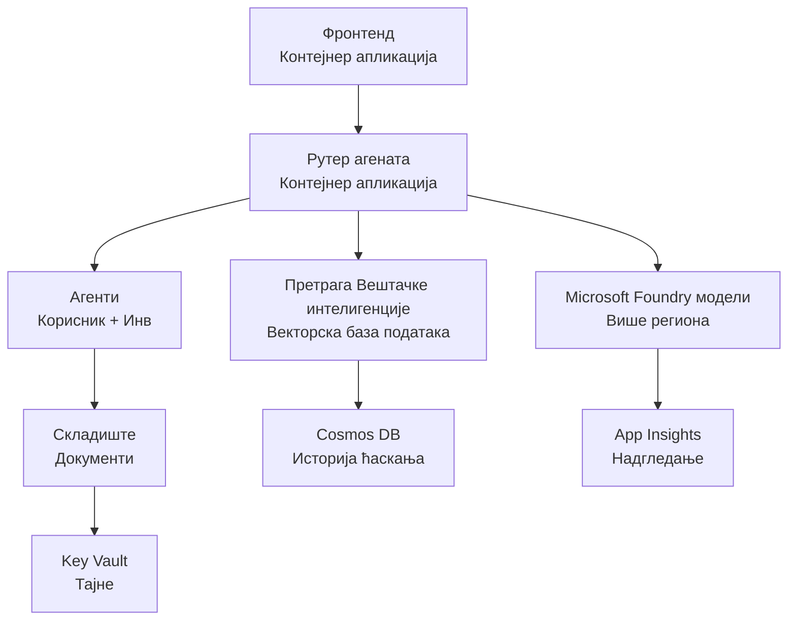

# Решење за малопродају са више агената - шаблон инфраструктуре

**Поглавље 5: Пакет за продукцијско постављање**
- **📚 Почетна страница курса**: [AZD за почетнике](../../README.md)
- **📖 Повезано поглавље**: [Поглавље 5: Решења вештачке интелигенције са више агената](../../README.md#-chapter-5-multi-agent-ai-solutions-advanced)
- **📝 Водич сценарија**: [Комплетна архитектура](../retail-scenario.md)
- **🎯 Брзо постављање**: [Једним кликом](#-quick-deployment)

> **⚠️ САМО ШАБЛОН ИНФРАСТРУКТУРЕ**  
> Овај ARM шаблон поставља **Azure ресурсе** за систем са више агената.  
>  
> **Шта се поставља (15-25 минута):**
> - ✅ Microsoft Foundry модели (gpt-4.1, gpt-4.1-mini, ембеддинг модели у 3 региона)
> - ✅ AI Search услуга (празна, спремна за креирање индекса)
> - ✅ Container Apps (место задржавања слика, спремно за ваш код)
> - ✅ Storage, Cosmos DB, Key Vault, Application Insights
>  
> **Шта НИЈЕ укључено (захтева развој):**
> - ❌ Код имплементације агената (Customer Agent, Inventory Agent)
> - ❌ Логика рутирања и API ендпоинти
> - ❌ Фронт-енд чат интерфејс
> - ❌ Шеме индекса претраге и ETL/пипелини за податке
> - ❌ **Процењени напор за развој: 80-120 сати**
>  
> **Користите овај шаблон ако:**
> - ✅ Желите да обезбедите Azure инфраструктуру за пројекат са више агената
> - ✅ Планирате да развијате имплементацију агената одвојено
> - ✅ Потребна вам је основа инфраструктуре спремна за продукцију
>  
> **Не користите ако:**
> - ❌ Очекујете одмах радни демо са више агената
> - ❌ Тражите комплетне примере апликационог кода

## Преглед

Овај директоријум садржи комплетан Azure Resource Manager (ARM) шаблон за постављање **основне инфраструктуре** система за подршку купцима са више агената. Шаблон обезбеђује све неопходне Azure сервисе, правилно конфигурисане и међусобно повезане, спремне за развој ваше апликације.

**Након постављања имаћете:** Инфраструктуру спремну за продукцију на Azure  
**Да бисте довршили систем, потребно је:** Код агената, фронт-енд UI и конфигурација података (види [Architecture Guide](../retail-scenario.md))

## 🎯 Шта се поставља

### Основна инфраструктура (статус након постављања)

✅ **Microsoft Foundry Models Services** (спремно за API позиве)
  - Примарни регион: распоређење gpt-4.1 (20K TPM капацитет)
  - Секундарни регион: распоређење gpt-4.1-mini (10K TPM капацитет)
  - Терцијарни регион: модел за текстуалне ембеддинге (30K TPM капацитет)
  - Регион за евалуацију: gpt-4.1 grader модел (15K TPM капацитет)
  - **Статус:** Потпуно функционално - може се одмах правити API позиве

✅ **Azure AI Search** (празна - спремна за конфигурацију)
  - Омогућене векторске претраге
  - Стандардни ниво са 1 партицијом, 1 репликом
  - **Статус:** Услуга ради, али захтева креирање индекса
  - **Потребна акција:** Креирајте search индекс са вашом шемом

✅ **Azure Storage Account** (празан - спреман за отпремање)
  - Blob контејнери: `documents`, `uploads`
  - Безбедна конфигурација (само HTTPS, без јавног приступа)
  - **Статус:** Спремно за пријем фајлова
  - **Потребна акција:** Отпремите ваше производне податке и документе

⚠️ **Container Apps окружење** (постављене слике места задржавања)
  - Agent router апликација (nginx подразумевана слика)
  - Frontend апликација (nginx подразумевана слика)
  - Ауто-скалирање конфигурисано (0-10 инстанци)
  - **Статус:** Покрећу се место задржавања контејнери
  - **Потребна акција:** Изградите и деплоy-ујте ваше апликације агената

✅ **Azure Cosmos DB** (празна - спремна за податке)
  - База података и контејнер пред-конфигурисани
  - Оптимизовано за операције мале латенције
  - TTL омогућен за аутоматско чишћење
  - **Статус:** Спремно за чување историје ћаскања

✅ **Azure Key Vault** (опционо - спремно за тајне)
  - Soft delete омогућен
  - RBAC конфигурисан за managed identities
  - **Статус:** Спремно за чување API кључева и низова за повезивање

✅ **Application Insights** (опционо - мониторинг активан)
  - Повезано са Log Analytics workspace-ом
  - Прилагођене метрике и аларми конфигурисани
  - **Статус:** Спремно да прими телеметрију из ваших апликација

✅ **Document Intelligence** (спремно за API позиве)
  - S0 ниво за продукцијске радне оптерећења
  - **Статус:** Спремно за обраду отпремљених докумената

✅ **Bing Search API** (спремно за API позиве)
  - S1 ниво за претраге у реалном времену
  - **Статус:** Спремно за веб претраге

### Режими постављања

| Mode | OpenAI Capacity | Container Instances | Search Tier | Storage Redundancy | Best For |
|------|-----------------|---------------------|-------------|-------------------|----------|
| **Minimal** | 10K-20K TPM | 0-2 replicas | Basic | LRS (Local) | Dev/test, learning, proof-of-concept |
| **Standard** | 30K-60K TPM | 2-5 replicas | Standard | ZRS (Zone) | Production, moderate traffic (<10K users) |
| **Premium** | 80K-150K TPM | 5-10 replicas, zone-redundant | Premium | GRS (Geo) | Enterprise, high traffic (>10K users), 99.99% SLA |

**Утицај на трошкове:**
- **Minimal → Standard:** ~4x повећање трошкова ($100-370/mo → $420-1,450/mo)
- **Standard → Premium:** ~3x повећање трошкова ($420-1,450/mo → $1,150-3,500/mo)
- **Одабир се базира на:** Очекиваном оптерећењу, SLA захтевима, буџетским ограничењима

**Планирање капацитета:**
- **TPM (Tokens Per Minute):** Укупно преко свих распореда модела
- **Container Instances:** Распон ауто-скалирања (мин-макс реплика)
- **Search Tier:** Утиче на перформансе упита и ограничења величине индекса

## 📋 Захтеви

### Потребни алати
1. **Azure CLI** (верзија 2.50.0 или новија)
   ```bash
   az --version  # Провери верзију
   az login      # Аутентификуј
   ```

2. **Активан Azure претплатнички налог** са правима Owner или Contributor
   ```bash
   az account show  # Потврдите претплату
   ```

### Потребне Azure квоте

Пре постављања, проверите довољне квоте у вашим циљним регијама:

```bash
# Проверите доступност Microsoft Foundry модела у вашем региону
az cognitiveservices account list-skus \
  --kind OpenAI \
  --location eastus2

# Проверите OpenAI квоту (пример за gpt-4.1)
az cognitiveservices usage list \
  --location eastus2 \
  --query "[?name.value=='OpenAI.Standard.gpt-4.1']"

# Проверите квоту за Container Apps
az provider show \
  --namespace Microsoft.App \
  --query "resourceTypes[?resourceType=='managedEnvironments'].locations"
```

**Минималне потребне квоте:**
- **Microsoft Foundry Models:** 3-4 распореда модела у више региона
  - gpt-4.1: 20K TPM (Tokens Per Minute)
  - gpt-4.1-mini: 10K TPM
  - text-embedding-ada-002: 30K TPM
  - **Напомена:** gpt-4.1 може имати листу чекања у неким регијама - проверите [model availability](https://learn.microsoft.com/azure/ai-services/openai/concepts/models)
- **Container Apps:** Managed окружење + 2-10 container инстанци
- **AI Search:** Стандардни ниво (Basic недовољан за векторску претрагу)
- **Cosmos DB:** Стандардно резервисано пропусно стање

**Ако квота није довољна:**
1. Идите у Azure Portal → Quotas → Request increase
2. Или користите Azure CLI:
   ```bash
   az support tickets create \
     --ticket-name "OpenAI-Quota-Increase" \
     --severity "minimal" \
     --description "Request quota increase for Microsoft Foundry Models gpt-4.1 in eastus2"
   ```
3. Размотрите алтернативне регионе са доступношћу

## 🚀 Брзо постављање

### Опција 1: Коришћење Azure CLI

```bash
# Клонирајте или преузмите шаблонске датотеке
git clone <repository-url>
cd examples/retail-multiagent-arm-template

# Учините скрипт за распоређивање извршним
chmod +x deploy.sh

# Распоредите са подразумеваним подешавањима
./deploy.sh -g myResourceGroup

# Распоредите за производно окружење са премијум функцијама
./deploy.sh -g myProdRG -e prod -m premium -l eastus2
```

### Опција 2: Коришћење Azure портала

[](https://portal.azure.com/#create/Microsoft.Template/uri/https%3A%2F%2Fraw.githubusercontent.com%2Fmicrosoft%2Fazd-for-beginners%2Fmain%2Fexamples%2Fretail-multiagent-arm-template%2Fazuredeploy.json)

### Опција 3: Коришћење Azure CLI директно

```bash
# Креирај групу ресурса
az group create --name myResourceGroup --location eastus2

# Размешти шаблон
az deployment group create \
  --resource-group myResourceGroup \
  --template-file azuredeploy.json \
  --parameters azuredeploy.parameters.json
```

## ⏱️ Време потребно за постављање

### Шта очекивати

| Phase | Duration | What Happens |
|-------|----------|--------------||
| **Template Validation** | 30-60 seconds | Azure валидира синтаксу ARM шаблона и параметре |
| **Resource Group Setup** | 10-20 seconds | Креира resource group (ако је потребно) |
| **OpenAI Provisioning** | 5-8 minutes | Креира 3-4 OpenAI налога и распоређује моделе |
| **Container Apps** | 3-5 minutes | Креира окружење и распоређује контейнере места задржавања |
| **Search & Storage** | 2-4 minutes | Поставља AI Search услугу и storage налоге |
| **Cosmos DB** | 2-3 minutes | Креира базу података и конфигурише контејнере |
| **Monitoring Setup** | 2-3 minutes | Поставља Application Insights и Log Analytics |
| **RBAC Configuration** | 1-2 minutes | Конфигурише managed identities и дозволе |
| **Total Deployment** | **15-25 minutes** | Комплетна инфраструктура спремна |

**Након постављања:**
- ✅ **Инфраструктура спремна:** Сви Azure сервиси постављени и покренути
- ⏱️ **Развој апликације:** 80-120 сати (ваша одговорност)
- ⏱️ **Конфигурација индекса:** 15-30 минута (захтева вашу шему)
- ⏱️ **Отпрема података:** Зависи од величине скупa података
- ⏱️ **Тестирање и валидација:** 2-4 часа

---

## ✅ Потврдите успешност постављања

### Корак 1: Провера провизије ресурса (2 минута)

```bash
# Проверите да ли су сви ресурси успешно распоређени
az resource list \
  --resource-group myResourceGroup \
  --query "[?provisioningState!='Succeeded'].{Name:name, Status:provisioningState, Type:type}" \
  --output table
```

**Очекује се:** Празна табела (сви ресурси показују статус "Succeeded")

### Корак 2: Верификација Microsoft Foundry Models распореда (3 минута)

```bash
# Прикажи све OpenAI налоге
az cognitiveservices account list \
  --resource-group myResourceGroup \
  --query "[?kind=='OpenAI'].{Name:name, Location:location, Status:properties.provisioningState}" \
  --output table

# Провери распоређивања модела за примарни регион
OPENAI_NAME=$(az cognitiveservices account list \
  --resource-group myResourceGroup \
  --query "[?kind=='OpenAI'] | [0].name" -o tsv)

az cognitiveservices account deployment list \
  --name $OPENAI_NAME \
  --resource-group myResourceGroup \
  --output table
```

**Очекује се:** 
- 3-4 OpenAI налога (примарни, секундарни, терцијарни, регион за евалуацију)
- 1-2 распореда модела по налогу (gpt-4.1, gpt-4.1-mini, text-embedding-ada-002)

### Корак 3: Тестирање ендпоинта инфраструктуре (5 минута)

```bash
# Дохвати URL-ове контейнерске апликације
az containerapp list \
  --resource-group myResourceGroup \
  --query "[].{Name:name, URL:properties.configuration.ingress.fqdn, Status:properties.runningStatus}" \
  --output table

# Тестирај крајњу тачку рутирања (биће враћена замјенска слика)
ROUTER_URL=$(az containerapp show \
  --name retail-router \
  --resource-group myResourceGroup \
  --query "properties.configuration.ingress.fqdn" -o tsv)

echo "Testing: https://$ROUTER_URL"
curl -I https://$ROUTER_URL || echo "Container running (placeholder image - expected)"
```

**Очекује се:** 
- Container Apps показују статус "Running"
- Подразумевани nginx одговори са HTTP 200 или 404 (још без апликационог кода)

### Корак 4: Верификација Microsoft Foundry Models API приступа (3 минута)

```bash
# Добијте OpenAI крајњу тачку и кључ
OPENAI_ENDPOINT=$(az cognitiveservices account show \
  --name $OPENAI_NAME \
  --resource-group myResourceGroup \
  --query "properties.endpoint" -o tsv)

OPENAI_KEY=$(az cognitiveservices account keys list \
  --name $OPENAI_NAME \
  --resource-group myResourceGroup \
  --query "key1" -o tsv)

# Тестирајте распоређивање gpt-4.1
curl "${OPENAI_ENDPOINT}openai/deployments/gpt-4.1/chat/completions?api-version=2024-08-01-preview" \
  -H "Content-Type: application/json" \
  -H "api-key: $OPENAI_KEY" \
  -d '{
    "messages": [{"role": "user", "content": "Say hello"}],
    "max_tokens": 10
  }'
```

**Очекује се:** JSON одговор са chat completion (потврђује да OpenAI функционише)

### Шта ради vs. шта не ради

**✅ Ради након постављања:**
- Microsoft Foundry Models модели распоређени и прихватају API позиве
- AI Search услуга ради (празна, још без индекса)
- Container Apps раде (nginx слике места задржавања)
- Storage налози доступни и спремни за отпремање
- Cosmos DB спреман за рад са подацима
- Application Insights прикупља инфраструктурну телеметрију
- Key Vault спреман за чување тајни

**❌ Још НЕ РАДИ (захтева развој):**
- Ендпоинти агената (није постављен апликациони код)
- Чат функционалност (захтева фронт-енд + бек-енд имплементацију)
- Упити претраге (још није креиран search индекс)
- Пипелин за обраду докумената (нису отпремљени подаци)
- Прилагођена телеметрија (захтева instrumentaцију апликације)

**Следећи кораци:** Погледајте [Post-Deployment Configuration](#-post-deployment-next-steps) за развој и деплоy ваше апликације

---

## ⚙️ Опције конфигурације

### Параметри шаблона

| Parameter | Type | Default | Description |
|-----------|------|---------|-------------|
| `projectName` | string | "retail" | Префикс за сва имена ресурса |
| `location` | string | Resource group location | Примарни регион за постављање |
| `secondaryLocation` | string | "westus2" | Секундарни регион за мултирегионално постављање |
| `tertiaryLocation` | string | "francecentral" | Регион за ембеддинг модел |
| `environmentName` | string | "dev" | Ознака окружења (dev/staging/prod) |
| `deploymentMode` | string | "standard" | Конфигурација постављања (minimal/standard/premium) |
| `enableMultiRegion` | bool | true | Омогући мултирегионално постављање |
| `enableMonitoring` | bool | true | Омогући Application Insights и логовање |
| `enableSecurity` | bool | true | Омогући Key Vault и појачану безбедност |

### Прилагођавање параметара

Измените `azuredeploy.parameters.json`:

```json
{
  "$schema": "https://schema.management.azure.com/schemas/2019-04-01/deploymentParameters.json#",
  "contentVersion": "1.0.0.0",
  "parameters": {
    "projectName": {
      "value": "mycompany"
    },
    "environmentName": {
      "value": "prod"
    },
    "deploymentMode": {
      "value": "premium"
    },
    "location": {
      "value": "eastus2"
    }
  }
}
```

## 🏗️ Преглед архитектуре


## 📖 Употреба скрипте за постављање

Скрипта `deploy.sh` пружа интерактивно искуство постављања:

```bash
# Прикажи помоћ
./deploy.sh --help

# Основно распоређивање
./deploy.sh -g myResourceGroup

# Напредно распоређивање са прилагођеним подешавањима
./deploy.sh \
  -g myProductionRG \
  -p companyname \
  -e prod \
  -m premium \
  -l eastus2

# Развојно распоређивање без вишерегионалне подршке
./deploy.sh \
  -g myDevRG \
  -e dev \
  -m minimal \
  --no-multi-region \
  --no-security
```

### Карактеристике скрипте

- ✅ **Валидација претпоставки** (Azure CLI, пријава, датотеке шаблона)
- ✅ **Управљање resource group-ом** (креира ако не постоји)
- ✅ **Валидација шаблона** пре постављања
- ✅ **Праћење напретка** са обојеним излазом
- ✅ **Приказ резултата постављања**
- ✅ **Упутства након постављања**

## 📊 Праћење постављања

### Провера статуса постављања

```bash
# Листа распоређивања
az deployment group list --resource-group myResourceGroup --output table

# Добиј детаље распоређивања
az deployment group show \
  --resource-group myResourceGroup \
  --name retail-deployment-YYYYMMDD-HHMMSS

# Прати напредак распоређивања
az deployment group create \
  --resource-group myResourceGroup \
  --template-file azuredeploy.json \
  --parameters azuredeploy.parameters.json \
  --verbose
```

### Излази (Outputs) постављања

Након успешног постављања, следећи излази су доступни:

- **Frontend URL**: Јавни ендпоинт за веб интерфејс
- **Router URL**: API ендпоинт за agent router
- **OpenAI Endpoints**: Примарни и секундарни OpenAI сервис ендпоинти
- **Search Service**: Azure AI Search сервис ендпоинт
- **Storage Account**: Име storage налога за документе
- **Key Vault**: Име Key Vault-а (ако је омогућено)
- **Application Insights**: Име сервиса за мониторинг (ако је омогућено)

## 🔧 После постављања: Следећи кораци
> **📝 Važno:** Infrastruktura je raspoređena, али треба да развијете и распоредите код апликације.

### Фаза 1: Развити агент апликације (Ваша одговорност)

ARM шаблон креира **празне Container Apps** са привременим nginx сликама. Ви морате:

**Потребан развој:**
1. **Имплементација агента** (30-40 сати)
   - Агенат за корисничку службу са интеграцијом gpt-4.1
   - Агенат за инвентар са интеграцијом gpt-4.1-mini
   - Логика маршрутирања агената

2. **Развој фронтенда** (20-30 сати)
   - UI за чет интерфејс (React/Vue/Angular)
   - Функционалност отпремања фајлова
   - Рендеровање и форматирање одговора

3. **Бекенд сервиси** (12-16 сати)
   - FastAPI или Express router
   - Middleware за аутентификацију
   - Интеграција телеметрије

**Погледајте:** [Vodič arhitekture](../retail-scenario.md) за детаљне шаблоне имплементације и примере кода

### Фаза 2: Конфигуришите AI Search Index (15-30 минута)

Креирајте индекс преtrage који одговара вашем моделу података:

```bash
# Добијте детаље услуге за претрагу
SEARCH_NAME=$(az search service list \
  --resource-group myResourceGroup \
  --query "[0].name" -o tsv)

SEARCH_KEY=$(az search admin-key show \
  --service-name $SEARCH_NAME \
  --resource-group myResourceGroup \
  --query "primaryKey" -o tsv)

# Креирајте индекс са вашом шемом (пример)
curl -X POST "https://${SEARCH_NAME}.search.windows.net/indexes?api-version=2023-11-01" \
  -H "Content-Type: application/json" \
  -H "api-key: ${SEARCH_KEY}" \
  -d '{
    "name": "products",
    "fields": [
      {"name": "id", "type": "Edm.String", "key": true},
      {"name": "title", "type": "Edm.String", "searchable": true},
      {"name": "content", "type": "Edm.String", "searchable": true},
      {"name": "category", "type": "Edm.String", "filterable": true},
      {"name": "content_vector", "type": "Collection(Edm.Single)", 
       "searchable": true, "dimensions": 1536, "vectorSearchProfile": "default"}
    ],
    "vectorSearch": {
      "algorithms": [{"name": "default", "kind": "hnsw"}],
      "profiles": [{"name": "default", "algorithm": "default"}]
    }
  }'
```

**Resursi:**
- [AI Search Index Schema Design](https://learn.microsoft.com/azure/search/search-what-is-an-index)
- [Vector Search Configuration](https://learn.microsoft.com/azure/search/vector-search-how-to-create-index)

### Фаза 3: Отпремите своје податке (Време варира)

Када будете имали податке о производима и документе:

```bash
# Добијте детаље налога за складиште
STORAGE_NAME=$(az storage account list \
  --resource-group myResourceGroup \
  --query "[0].name" -o tsv)

STORAGE_KEY=$(az storage account keys list \
  --account-name $STORAGE_NAME \
  --resource-group myResourceGroup \
  --query "[0].value" -o tsv)

# Отпремите своје документе
az storage blob upload-batch \
  --destination documents \
  --source /path/to/your/product/docs \
  --account-name $STORAGE_NAME \
  --account-key $STORAGE_KEY

# Пример: Отпремање једног фајла
az storage blob upload \
  --container-name documents \
  --name "product-manual.pdf" \
  --file /path/to/product-manual.pdf \
  --account-name $STORAGE_NAME \
  --account-key $STORAGE_KEY
```

### Фаза 4: Изградите и распоредите своје апликације (8-12 сати)

Када развијете код својих агената:

```bash
# 1. Креирајте Azure Container Registry (ако је потребно)
az acr create \
  --name myregistry \
  --resource-group myResourceGroup \
  --sku Basic

# 2. Изградите и отпремите слику агент рутера
docker build -t myregistry.azurecr.io/agent-router:v1 /path/to/your/router/code
az acr login --name myregistry
docker push myregistry.azurecr.io/agent-router:v1

# 3. Изградите и отпремите слику фронтенда
docker build -t myregistry.azurecr.io/frontend:v1 /path/to/your/frontend/code
docker push myregistry.azurecr.io/frontend:v1

# 4. Ажурирајте Container Apps са вашим сликама
az containerapp update \
  --name retail-router \
  --resource-group myResourceGroup \
  --image myregistry.azurecr.io/agent-router:v1

az containerapp update \
  --name retail-frontend \
  --resource-group myResourceGroup \
  --image myregistry.azurecr.io/frontend:v1

# 5. Поставите променљиве окружења
az containerapp update \
  --name retail-router \
  --resource-group myResourceGroup \
  --set-env-vars \
    OPENAI_ENDPOINT=secretref:openai-endpoint \
    OPENAI_KEY=secretref:openai-key \
    SEARCH_ENDPOINT=secretref:search-endpoint \
    SEARCH_KEY=secretref:search-key
```

### Фаза 5: Тестирајте вашу апликацију (2-4 сата)

```bash
# Добијте УРЛ ваше апликације
ROUTER_URL=$(az containerapp show \
  --name retail-router \
  --resource-group myResourceGroup \
  --query "properties.configuration.ingress.fqdn" -o tsv)

# Тестирајте ендпоинт агента (једном када ваш код буде размештен)
curl -X POST "https://${ROUTER_URL}/chat" \
  -H "Content-Type: application/json" \
  -d '{
    "message": "Hello, I need help with my order",
    "agent": "customer"
  }'

# Проверите логове апликације
az containerapp logs show \
  --name retail-router \
  --resource-group myResourceGroup \
  --follow
```

### Ресурси за имплементацију

**Архитектура и дизајн:**
- 📖 [Complete Architecture Guide](../retail-scenario.md) - Детаљни шаблони имплементације
- 📖 [Multi-Agent Design Patterns](https://learn.microsoft.com/azure/architecture/ai-ml/guide/multi-agent-systems)

**Примери кода:**
- 🔗 [Microsoft Foundry Models Chat Sample](https://github.com/Azure-Samples/azure-search-openai-demo) - RAG образац
- 🔗 [Semantic Kernel](https://github.com/microsoft/semantic-kernel) - Фрејмворк за агенте (C#)
- 🔗 [LangChain Azure](https://github.com/langchain-ai/langchain) - Оркестрација агената (Python)
- 🔗 [AutoGen](https://github.com/microsoft/autogen) - Конверзације више агената

**Процењени укупни напор:**
- Распоређивање инфраструктуре: 15-25 минута (✅ Завршено)
- Развој апликације: 80-120 сати (🔨 Ваш посао)
- Тестирање и оптимизација: 15-25 сати (🔨 Ваш посао)

## 🛠️ Решавање проблема

### Уобичајени проблеми

#### 1. Kvota za Microsoft Foundry Models је прекорачена

```bash
# Провери тренутну употребу квоте
az cognitiveservices usage list --location eastus2

# Затражи повећање квоте
az support tickets create \
  --ticket-name "OpenAI-Quota-Increase" \
  --severity "minimal" \
  --description "Request quota increase for Microsoft Foundry Models in region X"
```

#### 2. Raspoređivanje Container Apps није успело

```bash
# Провери логове контејнерске апликације
az containerapp logs show \
  --name retail-router \
  --resource-group myResourceGroup \
  --follow

# Поново покрени контејнерску апликацију
az containerapp revision restart \
  --name retail-router \
  --resource-group myResourceGroup
```

#### 3. Inicijalizacija Search сервиса

```bash
# Проверите статус услуге претраге
az search service show \
  --name <search-service-name> \
  --resource-group myResourceGroup

# Тестирајте повезаност услуге претраге
curl -X GET "https://<search-service-name>.search.windows.net/indexes?api-version=2023-11-01" \
  -H "api-key: <search-admin-key>"
```

### Валидација распоређивања

```bash
# Проверите да ли су сви ресурси креирани
az resource list \
  --resource-group myResourceGroup \
  --output table

# Проверите здравље ресурса
az resource list \
  --resource-group myResourceGroup \
  --query "[?provisioningState!='Succeeded'].{Name:name, Status:provisioningState, Type:type}" \
  --output table
```

## 🔐 Безбедносна разматрања

### Управљање кључевима
- Сви тајни подаци се чувају у Azure Key Vault (кada je omogućen)
- Container apps користе managed identity за аутентификацију
- Storage налози имају безбедне подразумеване поставке (само HTTPS, без јавног приступа blob-ovima)

### Мрежна безбедност
- Container apps користе интерну мрежу где је то могуће
- Search сервис конфигурисан са опцијом private endpoints
- Cosmos DB конфигурисан са минималним потребним дозволама

### RBAC конфигурација
```bash
# Доделите неопходне улоге за управљани идентитет
az role assignment create \
  --assignee <container-app-managed-identity> \
  --role "Cognitive Services OpenAI User" \
  --scope <openai-resource-id>
```

## 💰 Оптимизација трошкова

### Процене трошкова (месечно, USD)

| Režim | OpenAI | Container Apps | Search | Storage | Ukupno (procena) |
|------|--------|----------------|--------|---------|------------------|
| Minimalni | $50-200 | $20-50 | $25-100 | $5-20 | $100-370 |
| Standardni | $200-800 | $100-300 | $100-300 | $20-50 | $420-1450 |
| Premium | $500-2000 | $300-800 | $300-600 | $50-100 | $1150-3500 |

### Praćenje troškova

```bash
# Подесите упозорења о буџету
az consumption budget create \
  --account-name <subscription-id> \
  --budget-name "retail-budget" \
  --amount 500 \
  --time-grain Monthly \
  --start-date 2024-01-01 \
  --end-date 2024-12-31
```

## 🔄 Ажурирања и одржавање

### Ажурирања шаблона
- Користите контролу верзија за ARM шаблоне
- Тестирајте измене најпре у развојном окружењу
- Користите incremental deployment мод за ажурирања

### Ažuriranja ресурса
```bash
# Ажурирање са новим параметрима
az deployment group create \
  --resource-group myResourceGroup \
  --template-file azuredeploy.json \
  --parameters azuredeploy.parameters.json \
  --mode Incremental
```

### Bekap и опоравак
- Cosmos DB аутоматско прављење резервних копија омогућено
- Key Vault soft delete омогућен
- Ревизије Container app-ова се одржавају за опоравак

## 📞 Подршка

- **Проблеми са шаблоном**: [GitHub Issues](https://github.com/microsoft/azd-for-beginners/issues)
- **Azure подршка**: [Azure Support Portal](https://portal.azure.com/#blade/Microsoft_Azure_Support/HelpAndSupportBlade)
- **Заједница**: [Azure AI Discord](https://discord.gg/microsoft-azure)

---

**⚡ Спремни да распоредите своје multi-agent решење?**

Почните са: `./deploy.sh -g myResourceGroup`

---

<!-- CO-OP TRANSLATOR DISCLAIMER START -->
**Одрицање одговорности**:
Овај документ је преведен коришћењем услуге за превођење помоћу вештачке интелигенције [Co-op Translator](https://github.com/Azure/co-op-translator). Иако се трудимо да будемо прецизни, имајте у виду да аутоматски преводи могу да садрже грешке или нетачности. Оригинални документ на његовом изворном језику треба сматрати ауторитетним извором. За критичне информације препоручује се професионалан људски превод. Не сносимо одговорност за било какве неспоразуме или погрешне тумачења која произилазе из употребе овог превода.
<!-- CO-OP TRANSLATOR DISCLAIMER END -->