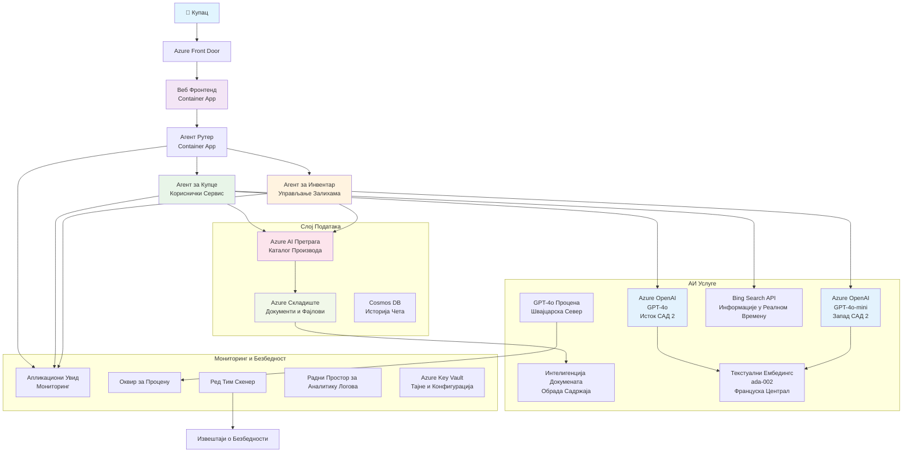

<!--
CO_OP_TRANSLATOR_METADATA:
{
  "original_hash": "77db71c83f2e7fbc9f50320bd1cc7116",
  "translation_date": "2025-11-23T18:03:36+00:00",
  "source_file": "examples/retail-scenario.md",
  "language_code": "sr"
}
-->
# Решење за подршку купцима са више агената - Сценарио за трговце

**Поглавље 5: AI решења са више агената**
- **📚 Почетна страна курса**: [AZD за почетнике](../README.md)
- **📖 Текуће поглавље**: [Поглавље 5: AI решења са више агената](../README.md#-chapter-5-multi-agent-ai-solutions-advanced)
- **⬅️ Предуслови**: [Поглавље 2: Развој заснован на AI](../docs/ai-foundry/azure-ai-foundry-integration.md)
- **➡️ Следеће поглавље**: [Поглавље 6: Валидација пре имплементације](../docs/pre-deployment/capacity-planning.md)
- **🚀 ARM шаблони**: [Пакет за имплементацију](retail-multiagent-arm-template/README.md)

> **⚠️ ВОДИЧ ЗА АРХИТЕКТУРУ - НИЈЕ ФУНКЦИОНАЛНА ИМПЛЕМЕНТАЦИЈА**  
> Овај документ пружа **свеобухватан план архитектуре** за изградњу система са више агената.  
> **Шта постоји:** ARM шаблон за имплементацију инфраструктуре (Azure OpenAI, AI Search, Container Apps, итд.)  
> **Шта морате изградити:** Код агената, логика рутирања, кориснички интерфејс, податковни токови (процењено 80-120 сати)  
>  
> **Користите ово као:**
> - ✅ Референцу архитектуре за ваш пројекат са више агената
> - ✅ Водич за учење дизајнерских образаца за више агената
> - ✅ Шаблон инфраструктуре за имплементацију Azure ресурса
> - ❌ НИЈЕ готова апликација (захтева значајан развој)

## Преглед

**Циљ учења:** Разумети архитектуру, дизајнерске одлуке и приступ имплементацији за изградњу продукцијски спремног чет-бота за подршку купцима са више агената за трговца, са напредним AI могућностима укључујући управљање инвентаром, обраду докумената и интелигентне интеракције са купцима.

**Време за завршетак:** Читање + разумевање (2-3 сата) | Комплетна имплементација (80-120 сати)

**Шта ћете научити:**
- Обрасци архитектуре са више агената и принципи дизајна
- Стратегије Azure OpenAI имплементације у више региона
- Интеграција AI Search са RAG (Retrieval-Augmented Generation)
- Оквири за евалуацију агената и тестирање безбедности
- Разматрања за продукцијску имплементацију и оптимизацију трошкова

## Циљеви архитектуре

**Образовни фокус:** Ова архитектура демонстрира обрасце за предузећа у системима са више агената.

### Захтеви система (за вашу имплементацију)

Решење за подршку купцима у продукцији захтева:
- **Више специјализованих агената** за различите потребе купаца (Служба за кориснике + Управљање инвентаром)
- **Имплементацију више модела** са одговарајућим планирањем капацитета (GPT-4o, GPT-4o-mini, уграђивања у више региона)
- **Динамичку интеграцију података** са AI Search и отпремањем датотека (претрага вектора + обрада докумената)
- **Свеобухватно праћење** и могућности евалуације (Application Insights + прилагођене метрике)
- **Безбедност на нивоу продукције** са валидацијом црвеног тима (скенирање рањивости + евалуација агената)

### Шта овај водич пружа

✅ **Обрасци архитектуре** - Доказани дизајн за скалабилне системе са више агената  
✅ **Шаблони инфраструктуре** - ARM шаблони за имплементацију свих Azure услуга  
✅ **Примери кода** - Референтне имплементације за кључне компоненте  
✅ **Упутства за конфигурацију** - Корак по корак упутства за подешавање  
✅ **Најбоље праксе** - Стратегије за безбедност, праћење, оптимизацију трошкова  

❌ **Није укључено** - Комплетна функционална апликација (захтева развојни напор)

## 🗺️ План имплементације

### Фаза 1: Проучавање архитектуре (2-3 сата) - ПОЧНИТЕ ОВДЕ

**Циљ:** Разумети дизајн система и интеракције компоненти

- [ ] Прочитајте цео овај документ
- [ ] Прегледајте дијаграм архитектуре и односе компоненти
- [ ] Разумите обрасце са више агената и дизајнерске одлуке
- [ ] Проучите примере кода за алате агената и рутирање
- [ ] Прегледајте процене трошкова и упутства за планирање капацитета

**Резултат:** Јасно разумевање шта треба изградити

### Фаза 2: Имплементација инфраструктуре (30-45 минута)

**Циљ:** Обезбедити Azure ресурсе користећи ARM шаблон

```bash
cd retail-multiagent-arm-template
./deploy.sh -g myResourceGroup -m standard
```

**Шта се имплементира:**
- ✅ Azure OpenAI (3 региона: GPT-4o, GPT-4o-mini, уграђивања)
- ✅ AI Search услуга (празна, потребна конфигурација индекса)
- ✅ Окружење за Container Apps (плацехолдер слике)
- ✅ Складишни налози, Cosmos DB, Key Vault
- ✅ Application Insights за праћење

**Шта недостаје:**
- ❌ Код имплементације агената
- ❌ Логика рутирања
- ❌ Кориснички интерфејс
- ❌ Шема индекса претраге
- ❌ Подацковни токови

### Фаза 3: Изградња апликације (80-120 сати)

**Циљ:** Имплементирати систем са више агената на основу ове архитектуре

1. **Имплементација агената** (30-40 сати)
   - Основна класа агента и интерфејси
   - Агенти за службу за кориснике са GPT-4o
   - Агенти за инвентар са GPT-4o-mini
   - Интеграција алата (AI Search, Bing, обрада датотека)

2. **Сервис за рутирање** (12-16 сати)
   - Логика класификације захтева
   - Избор агента и оркестрација
   - FastAPI/Express позадина

3. **Развој корисничког интерфејса** (20-30 сати)
   - Чет интерфејс
   - Функционалност за отпремање датотека
   - Приказ одговора

4. **Подацковни ток** (8-12 сати)
   - Креирање индекса AI Search
   - Обрада докумената са Document Intelligence
   - Генерисање и индексирање уграђивања

5. **Праћење и евалуација** (10-15 сати)
   - Имплементација прилагођене телеметрије
   - Оквир за евалуацију агената
   - Скенирање безбедности црвеног тима

### Фаза 4: Имплементација и тестирање (8-12 сати)

- Изградња Docker слика за све услуге
- Постављање у Azure Container Registry
- Ажурирање Container Apps са стварним сликама
- Конфигурисање променљивих окружења и тајни
- Покретање тестног скупа за евалуацију
- Извођење скенирања безбедности

**Укупно процењени напор:** 80-120 сати за искусне програмере

## Архитектура решења

### Дијаграм архитектуре


### Преглед компоненти

| Компонента | Сврха | Технологија | Регион |
|-----------|---------|------------|---------|
| **Веб интерфејс** | Кориснички интерфејс за интеракције са купцима | Container Apps | Примарни регион |
| **Рутер агената** | Рутира захтеве одговарајућем агенту | Container Apps | Примарни регион |
| **Агент за купце** | Обрађује упите службе за кориснике | Container Apps + GPT-4o | Примарни регион |
| **Агент за инвентар** | Управља залихама и испорукама | Container Apps + GPT-4o-mini | Примарни регион |
| **Azure OpenAI** | LLM инференција за агенте | Cognitive Services | Више региона |
| **AI Search** | Претрага вектора и RAG | AI Search услуга | Примарни регион |
| **Складишни налог** | Отпремање датотека и докумената | Blob Storage | Примарни регион |
| **Application Insights** | Праћење и телеметрија | Monitor | Примарни регион |
| **Модел за оцењивање** | Систем за евалуацију агената | Azure OpenAI | Секундарни регион |

## 📁 Структура пројекта

> **📍 Легенда статуса:**  
> ✅ = Постоји у репозиторијуму  
> 📝 = Референтна имплементација (пример кода у овом документу)  
> 🔨 = Потребно је креирати

```
retail-multiagent-solution/              🔨 Your project directory
├── .azure/                              🔨 Azure environment configs
│   ├── config.json                      🔨 Global config
│   └── env/
│       ├── .env.development             🔨 Dev environment
│       ├── .env.staging                 🔨 Staging environment
│       └── .env.production              🔨 Production environment
│
├── azure.yaml                          🔨 AZD main configuration
├── azure.parameters.json               🔨 Deployment parameters
├── README.md                           🔨 Solution documentation
│
├── infra/                              🔨 Infrastructure as Code (you create)
│   ├── main.bicep                      🔨 Main Bicep template (optional, ARM exists)
│   ├── main.parameters.json            🔨 Parameters file
│   ├── modules/                        📝 Bicep modules (reference examples below)
│   │   ├── ai-services.bicep           📝 Azure OpenAI deployments
│   │   ├── search.bicep                📝 AI Search configuration
│   │   ├── storage.bicep               📝 Storage accounts
│   │   ├── container-apps.bicep        📝 Container Apps environment
│   │   ├── monitoring.bicep            📝 Application Insights
│   │   ├── security.bicep              📝 Key Vault and RBAC
│   │   └── networking.bicep            📝 Virtual networks and DNS
│   ├── arm-template/                   ✅ ARM template version (EXISTS)
│   │   ├── azuredeploy.json            ✅ ARM main template (retail-multiagent-arm-template/)
│   │   └── azuredeploy.parameters.json ✅ ARM parameters
│   └── scripts/                        ✅/🔨 Deployment scripts
│       ├── deploy.sh                   ✅ Main deployment script (EXISTS)
│       ├── setup-data.sh               🔨 Data setup script (you create)
│       └── configure-rbac.sh           🔨 RBAC configuration (you create)
│
├── src/                                🔨 Application source code (YOU BUILD THIS)
│   ├── agents/                         📝 Agent implementations (examples below)
│   │   ├── base/                       🔨 Base agent classes
│   │   │   ├── agent.py                🔨 Abstract agent class
│   │   │   └── tools.py                🔨 Tool interfaces
│   │   ├── customer/                   🔨 Customer service agent
│   │   │   ├── agent.py                📝 Customer agent implementation (see below)
│   │   │   ├── prompts.py              🔨 System prompts
│   │   │   └── tools/                  🔨 Agent-specific tools
│   │   │       ├── search_tool.py      📝 AI Search integration (example below)
│   │   │       ├── bing_tool.py        📝 Bing Search integration (example below)
│   │   │       └── file_tool.py        🔨 File processing tool
│   │   └── inventory/                  🔨 Inventory management agent
│   │       ├── agent.py                🔨 Inventory agent implementation
│   │       ├── prompts.py              🔨 System prompts
│   │       └── tools/                  🔨 Agent-specific tools
│   │           ├── inventory_search.py 🔨 Inventory search tool
│   │           └── database_tool.py    🔨 Database query tool
│   │
│   ├── router/                         🔨 Agent routing service (you build)
│   │   ├── main.py                     🔨 FastAPI router application
│   │   ├── routing_logic.py            🔨 Request routing logic
│   │   └── middleware.py               🔨 Authentication & logging
│   │
│   ├── frontend/                       🔨 Web user interface (you build)
│   │   ├── Dockerfile                  🔨 Container configuration
│   │   ├── package.json                🔨 Node.js dependencies
│   │   ├── src/                        🔨 React/Vue source code
│   │   │   ├── components/             🔨 UI components
│   │   │   ├── pages/                  🔨 Application pages
│   │   │   ├── services/               🔨 API services
│   │   │   └── styles/                 🔨 CSS and themes
│   │   └── public/                     🔨 Static assets
│   │
│   ├── shared/                         🔨 Shared utilities (you build)
│   │   ├── config.py                   🔨 Configuration management
│   │   ├── telemetry.py                📝 Telemetry utilities (example below)
│   │   ├── security.py                 🔨 Security utilities
│   │   └── models.py                   🔨 Data models
│   │
│   └── evaluation/                     🔨 Evaluation and testing (you build)
│       ├── evaluator.py                📝 Agent evaluator (example below)
│       ├── red_team_scanner.py         📝 Security scanner (example below)
│       ├── test_cases.json             📝 Evaluation test cases (example below)
│       └── reports/                    🔨 Generated reports
│
├── data/                               🔨 Data and configuration (you create)
│   ├── search-schema.json              📝 AI Search index schema (example below)
│   ├── initial-docs/                   🔨 Initial document corpus
│   │   ├── product-manuals/            🔨 Product documentation (your data)
│   │   ├── policies/                   🔨 Company policies (your data)
│   │   └── faqs/                       🔨 Frequently asked questions (your data)
│   ├── fine-tuning/                    🔨 Fine-tuning datasets (optional)
│   │   ├── training.jsonl              🔨 Training data
│   │   └── validation.jsonl            🔨 Validation data
│   └── evaluation/                     🔨 Evaluation datasets
│       ├── test-conversations.json     📝 Test conversation data (example below)
│       └── ground-truth.json           🔨 Expected responses
│
├── scripts/                            # Utility scripts
│   ├── setup/                          # Setup scripts
│   │   ├── bootstrap.sh                # Initial environment setup
│   │   ├── install-dependencies.sh     # Install required tools
│   │   └── configure-env.sh            # Environment configuration
│   ├── data-management/                # Data management scripts
│   │   ├── upload-documents.py         # Document upload utility
│   │   ├── create-search-index.py      # Search index creation
│   │   └── sync-data.py                # Data synchronization
│   ├── deployment/                     # Deployment automation
│   │   ├── deploy-agents.sh            # Agent deployment
│   │   ├── update-frontend.sh          # Frontend updates
│   │   └── rollback.sh                 # Rollback procedures
│   └── monitoring/                     # Monitoring scripts
│       ├── health-check.py             # Health monitoring
│       ├── performance-test.py         # Performance testing
│       └── security-scan.py            # Security scanning
│
├── tests/                              # Test suites
│   ├── unit/                           # Unit tests
│   │   ├── test_agents.py              # Agent unit tests
│   │   ├── test_router.py              # Router unit tests
│   │   └── test_tools.py               # Tool unit tests
│   ├── integration/                    # Integration tests
│   │   ├── test_end_to_end.py          # E2E test scenarios
│   │   └── test_api.py                 # API integration tests
│   └── load/                           # Load testing
│       ├── load_test_config.yaml       # Load test configuration
│       └── scenarios/                  # Load test scenarios
│
├── docs/                               # Documentation
│   ├── architecture.md                 # Architecture documentation
│   ├── deployment-guide.md             # Deployment instructions
│   ├── agent-configuration.md          # Agent setup guide
│   ├── troubleshooting.md              # Troubleshooting guide
│   └── api/                            # API documentation
│       ├── agent-api.md                # Agent API reference
│       └── router-api.md               # Router API reference
│
├── hooks/                              # AZD lifecycle hooks
│   ├── preprovision.sh                 # Pre-provisioning tasks
│   ├── postprovision.sh                # Post-provisioning setup
│   ├── prepackage.sh                   # Pre-packaging tasks
│   └── postdeploy.sh                   # Post-deployment validation
│
└── .github/                            # GitHub workflows
    └── workflows/
        ├── ci-cd.yml                   # CI/CD pipeline
        ├── security-scan.yml           # Security scanning
        └── performance-test.yml        # Performance testing
```

---

## 🚀 Брзи почетак: Шта можете урадити одмах

### Опција 1: Само имплементација инфраструктуре (30 минута)

**Шта добијате:** Све Azure услуге имплементиране и спремне за развој

```bash
# Клонирај репозиторијум
git clone https://github.com/microsoft/AZD-for-beginners.git
cd AZD-for-beginners/examples/retail-multiagent-arm-template

# Деплој инфраструктуру
./deploy.sh -g myResourceGroup -m standard

# Потврди деплојмент
az resource list --resource-group myResourceGroup --output table
```

**Очекивани резултат:**
- ✅ Azure OpenAI услуге имплементиране (3 региона)
- ✅ AI Search услуга креирана (празна)
- ✅ Окружење за Container Apps спремно
- ✅ Складиште, Cosmos DB, Key Vault конфигурисани
- ❌ Још увек нема функционалних агената (само инфраструктура)

### Опција 2: Проучавање архитектуре (2-3 сата)

**Шта добијате:** Дубоко разумевање образаца са више агената

1. Прочитајте цео овај документ
2. Прегледајте примере кода за сваку компоненту
3. Разумите дизајнерске одлуке и компромисе
4. Проучите стратегије за оптимизацију трошкова
5. Испланирајте свој приступ имплементацији

**Очекивани резултат:**
- ✅ Јасан ментални модел архитектуре система
- ✅ Разумевање потребних компоненти
- ✅ Реалистичне процене напора
- ✅ План имплементације

### Опција 3: Изградња комплетног система (80-120 сати)

**Шта добијате:** Продукцијски спремно решење са више агената

1. **Фаза 1:** Имплементација инфраструктуре (завршено горе)
2. **Фаза 2:** Имплементација агената користећи примере кода испод (30-40 сати)
3. **Фаза 3:** Изградња сервиса за рутирање (12-16 сати)
4. **Фаза 4:** Креирање корисничког интерфејса (20-30 сати)
5. **Фаза 5:** Конфигурисање податковних токова (8-12 сати)
6. **Фаза 6:** Додавање праћења и евалуације (10-15 сати)

**Очекивани резултат:**
- ✅ Потпуно функционалан систем са више агената
- ✅ Праћење на нивоу продукције
- ✅ Валидација безбедности
- ✅ Оптимизована имплементација трошкова

---

## 📚 Референца архитектуре и водич за имплементацију

Следећи одељци пружају детаљне обрасце архитектуре, примере конфигурације и референтни код за вођење ваше имплементације.
## ✅ Спреман ARM шаблон за примену

> **✨ ОВО ЗАИСТА ПОСТОЈИ И РАДИ!**  
> За разлику од концептуалних примера кода изнад, ARM шаблон је **прави, функционални инфраструктурни систем** укључен у овај репозиторијум.

### Шта овај шаблон заправо ради

ARM шаблон у [`retail-multiagent-arm-template/`](../../../examples/retail-multiagent-arm-template) обезбеђује **целокупну Azure инфраструктуру** потребну за систем са више агената. Ово је **једини компонент који је спреман за употребу** - све остало захтева развој.

### Шта је укључено у ARM шаблон

ARM шаблон који се налази у [`retail-multiagent-arm-template/`](../../../examples/retail-multiagent-arm-template) укључује:

#### **Комплетна инфраструктура**
- ✅ **Azure OpenAI** инсталације у више региона (GPT-4o, GPT-4o-mini, embeddings, grader)
- ✅ **Azure AI Search** са могућностима претраге по векторима
- ✅ **Azure Storage** са контејнерима за документе и отпремање
- ✅ **Окружење за Container Apps** са аутоматским скалирањем
- ✅ **Агентски рутер и фронтенд** апликације у контејнерима
- ✅ **Cosmos DB** за чување историје разговора
- ✅ **Application Insights** за свеобухватно праћење
- ✅ **Key Vault** за сигурно управљање тајнама
- ✅ **Document Intelligence** за обраду датотека
- ✅ **Bing Search API** за информације у реалном времену

#### **Модови примене**
| Мод | Намена | Ресурси | Процењени трошак/месец |
|------|----------|-----------|---------------------|
| **Минимални** | Развој, тестирање | Основни SKUs, један регион | $100-370 |
| **Стандардни** | Производња, умерена скала | Стандардни SKUs, више региона | $420-1,450 |
| **Премијум** | Ентерпрајз, велика скала | Премијум SKUs, HA подешавање | $1,150-3,500 |

### 🎯 Брзе опције примене

#### Опција 1: Један клик за Azure примену

[](https://portal.azure.com/#create/Microsoft.Template/uri/https%3A%2F%2Fraw.githubusercontent.com%2Fmicrosoft%2Fazd-for-beginners%2Fmain%2Fexamples%2Fretail-multiagent-arm-template%2Fazuredeploy.json)

#### Опција 2: Примена преко Azure CLI

```bash
# Клонирајте репозиторијум
git clone https://github.com/microsoft/azd-for-beginners.git
cd azd-for-beginners/examples/retail-multiagent-arm-template

# Учините скрипту за распоређивање извршном
chmod +x deploy.sh

# Распоредите са подразумеваним подешавањима (стандардни режим)
./deploy.sh -g myResourceGroup

# Распоредите за продукцију са премиум функцијама
./deploy.sh -g myProdRG -e prod -m premium -l eastus2

# Распоредите минималну верзију за развој
./deploy.sh -g myDevRG -e dev -m minimal --no-multi-region
```

#### Опција 3: Директна примена ARM шаблона

```bash
# Креирај групу ресурса
az group create --name myResourceGroup --location eastus2

# Директно распореди шаблон
az deployment group create \
  --resource-group myResourceGroup \
  --template-file azuredeploy.json \
  --parameters azuredeploy.parameters.json \
  --parameters projectName=retail environmentName=prod
```

### Излазни резултати шаблона

Након успешне примене, добићете:

```json
{
  "frontendUrl": "https://retail-frontend-abc123.azurecontainerapps.io",
  "routerUrl": "https://retail-router-abc123.azurecontainerapps.io",
  "openAiEndpointPrimary": "https://retail-openai-primary-abc123.openai.azure.com/",
  "searchServiceEndpoint": "https://retail-search-abc123.search.windows.net",
  "storageAccountName": "retailstorage123abc",
  "keyVaultName": "retail-kv-abc123",
  "applicationInsightsName": "retail-ai-abc123"
}
```

### 🔧 Конфигурација након примене

ARM шаблон се брине о обезбеђивању инфраструктуре. Након примене:

1. **Конфигуришите индекс претраге**:
   ```bash
   # Користите обезбеђену шему претраге
   curl -X POST "${SEARCH_ENDPOINT}/indexes?api-version=2023-11-01" \
     -H "Content-Type: application/json" \
     -H "api-key: ${SEARCH_KEY}" \
     -d @../data/search-schema.json
   ```

2. **Отпремите почетне документе**:
   ```bash
   # Отпремите приручнике производа и базу знања
   az storage blob upload-batch \
     --destination documents \
     --source ../data/initial-docs \
     --account-name ${STORAGE_ACCOUNT}
   ```

3. **Примените код агента**:
   ```bash
   # Направите и примените стварне апликације агента
   docker build -t myregistry.azurecr.io/agent-router:latest ./src/router
   az containerapp update \
     --name retail-router \
     --resource-group myResourceGroup \
     --image myregistry.azurecr.io/agent-router:latest
   ```

### 🎛️ Опције прилагођавања

Измените `azuredeploy.parameters.json` да прилагодите своју примену:

```json
{
  "projectName": {"value": "mycompany"},
  "environmentName": {"value": "prod"},
  "deploymentMode": {"value": "premium"},
  "location": {"value": "eastus2"},
  "enableMultiRegion": {"value": true},
  "enableMonitoring": {"value": true},
  "enableSecurity": {"value": true}
}
```

### 📊 Карактеристике примене

- ✅ **Валидација предуслова** (Azure CLI, квоте, дозволе)
- ✅ **Висока доступност у више региона** са аутоматским преусмеравањем
- ✅ **Свеобухватно праћење** са Application Insights и Log Analytics
- ✅ **Најбоље праксе за безбедност** са Key Vault и RBAC
- ✅ **Оптимизација трошкова** са конфигурабилним модовима примене
- ✅ **Аутоматско скалирање** на основу образаца потражње
- ✅ **Ажурирања без прекида рада** са ревизијама Container Apps

### 🔍 Праћење и управљање

Након примене, пратите своје решење кроз:

- **Application Insights**: Метрике перформанси, праћење зависности и прилагођена телеметрија
- **Log Analytics**: Централизовано логовање свих компоненти
- **Azure Monitor**: Праћење здравља ресурса и доступности
- **Управљање трошковима**: Праћење трошкова у реалном времену и упозорења о буџету

---

## 📚 Комплетан водич за имплементацију

Овај документ сценарија у комбинацији са ARM шаблоном пружа све што је потребно за примену производно спремног решења за корисничку подршку заснованог на систему са више агената. Имплементација обухвата:

✅ **Дизајн архитектуре** - Свеобухватан системски дизајн са односима компоненти  
✅ **Обезбеђивање инфраструктуре** - Комплетан ARM шаблон за примену једним кликом  
✅ **Конфигурација агента** - Детаљно подешавање за агента за кориснике и инвентар  
✅ **Примена више модела** - Стратешко постављање модела у различитим регионима  
✅ **Интеграција претраге** - AI претрага са могућностима вектора и индексирања података  
✅ **Имплементација безбедности** - Тестирање отпорности, скенирање рањивости и сигурне праксе  
✅ **Праћење и евалуација** - Свеобухватна телеметрија и оквир за евалуацију агента  
✅ **Спремност за производњу** - Ентерпрајз примена са HA и опоравком од катастрофе  
✅ **Оптимизација трошкова** - Интелигентно рутирање и скалирање на основу употребе  
✅ **Водич за решавање проблема** - Уобичајени проблеми и стратегије решавања

---

## 📊 Резиме: Шта сте научили

### Покривени архитектонски обрасци

✅ **Дизајн система са више агената** - Специјализовани агенти (Корисник + Инвентар) са посебним моделима  
✅ **Примена у више региона** - Стратешко постављање модела ради оптимизације трошкова и редунданције  
✅ **RAG архитектура** - Интеграција AI претраге са векторским ембедингом за утемељене одговоре  
✅ **Евалуација агента** - Посебан модел за процену квалитета  
✅ **Оквир за безбедност** - Тестирање отпорности и обрасци скенирања рањивости  
✅ **Оптимизација трошкова** - Рутирање модела и стратегије планирања капацитета  
✅ **Праћење производње** - Application Insights са прилагођеном телеметријом  

### Шта овај документ пружа

| Компонента | Статус | Где се налази |
|-----------|--------|------------------|
| **Шаблон инфраструктуре** | ✅ Спреман за примену | [`retail-multiagent-arm-template/`](../../../examples/retail-multiagent-arm-template) |
| **Дијаграми архитектуре** | ✅ Комплетни | Mermaid дијаграм изнад |
| **Примери кода** | ✅ Референтне имплементације | Кроз овај документ |
| **Обрасци конфигурације** | ✅ Детаљна упутства | Секције 1-10 изнад |
| **Имплементације агента** | 🔨 Ви креирате ово | ~40 сати развоја |
| **Фронтенд UI** | 🔨 Ви креирате ово | ~25 сати развоја |
| **Подаци и процеси** | 🔨 Ви креирате ово | ~10 сати развоја |

### Реалност: Шта заиста постоји

**У репозиторијуму (спремно сада):**
- ✅ ARM шаблон који примењује 15+ Azure услуга (azuredeploy.json)
- ✅ Скрипта за примену са валидацијом (deploy.sh)
- ✅ Конфигурација параметара (azuredeploy.parameters.json)

**Референцирано у документу (ви креирате):**
- 🔨 Код имплементације агента (~30-40 сати)
- 🔨 Сервис за рутирање (~12-16 сати)
- 🔨 Фронтенд апликација (~20-30 сати)
- 🔨 Скрипте за подешавање података (~8-12 сати)
- 🔨 Оквир за праћење (~10-15 сати)

### Ваши следећи кораци

#### Ако желите да примените инфраструктуру (30 минута)
```bash
cd retail-multiagent-arm-template
./deploy.sh -g myResourceGroup
```

#### Ако желите да изградите комплетан систем (80-120 сати)
1. ✅ Прочитајте и разумите овај архитектонски документ (2-3 сата)
2. ✅ Примените инфраструктуру користећи ARM шаблон (30 минута)
3. 🔨 Имплементирајте агенте користећи референтне обрасце кода (~40 сати)
4. 🔨 Изградите сервис за рутирање са FastAPI/Express (~15 сати)
5. 🔨 Креирајте фронтенд UI са React/Vue (~25 сати)
6. 🔨 Конфигуришите процес података и индекс претраге (~10 сати)
7. 🔨 Додајте праћење и евалуацију (~15 сати)
8. ✅ Тестирајте, обезбедите и оптимизујте (~10 сати)

#### Ако желите да научите обрасце система са више агената (учење)
- 📖 Прегледајте дијаграм архитектуре и односе компоненти
- 📖 Проучите примере кода за SearchTool, BingTool, AgentEvaluator
- 📖 Разумите стратегију примене у више региона
- 📖 Научите оквире за евалуацију и безбедност
- 📖 Примените обрасце на сопствене пројекте

### Кључни закључци

1. **Инфраструктура vs. Апликација** - ARM шаблон обезбеђује инфраструктуру; агенти захтевају развој
2. **Стратегија за више региона** - Стратешко постављање модела смањује трошкове и побољшава поузданост
3. **Оквир за евалуацију** - Посебан модел за процену омогућава континуирану проверу квалитета
4. **Безбедност на првом месту** - Тестирање отпорности и скенирање рањивости су кључни за производњу
5. **Оптимизација трошкова** - Интелигентно рутирање између GPT-4o и GPT-4o-mini штеди 60-80%

### Процењени трошкови

| Мод примене | Инфраструктура/месец | Развој (једнократно) | Укупно први месец |
|-----------------|---------------------|------------------------|-------------------|
| **Минимални** | $100-370 | $15K-25K (80-120 сати) | $15.1K-25.4K |
| **Стандардни** | $420-1,450 | $15K-25K (исти напор) | $15.4K-26.5K |
| **Премијум** | $1,150-3,500 | $15K-25K (исти напор) | $16.2K-28.5K |

**Напомена:** Инфраструктура је <5% укупних трошкова за нове имплементације. Напор у развоју је главна инвестиција.

### Повезани ресурси

- 📚 [Водич за примену ARM шаблона](retail-multiagent-arm-template/README.md) - Подешавање инфраструктуре
- 📚 [Најбоље праксе за Azure OpenAI](https://learn.microsoft.com/azure/ai-services/openai/) - Примена модела
- 📚 [Документација за AI претрагу](https://learn.microsoft.com/azure/search/) - Конфигурација векторске претраге
- 📚 [Обрасци за Container Apps](https://learn.microsoft.com/azure/container-apps/) - Примена микросервиса
- 📚 [Application Insights](https://learn.microsoft.com/azure/azure-monitor/app/app-insights-overview) - Подешавање праћења

### Питања или проблеми?

- 🐛 [Пријавите проблеме](https://github.com/microsoft/AZD-for-beginners/issues) - Грешке у шаблону или документацији
- 💬 [GitHub дискусије](https://github.com/microsoft/AZD-for-beginners/discussions) - Питања о архитектури
- 📖 [FAQ](../../resources/faq.md) - Одговори на честа питања
- 🔧 [Водич за решавање проблема](../../docs/troubleshooting/common-issues.md) - Проблеми са применом

---

**Овај свеобухватни сценарио пружа архитектонски план ентерпрајз класе за AI системе са више агената, укључујући шаблоне инфраструктуре, упутства за имплементацију и најбоље праксе за производњу сложених решења за корисничку подршку уз Azure Developer CLI.**

---

<!-- CO-OP TRANSLATOR DISCLAIMER START -->
**Одрицање од одговорности**:  
Овај документ је преведен помоћу услуге за превођење вештачке интелигенције [Co-op Translator](https://github.com/Azure/co-op-translator). Иако настојимо да обезбедимо тачност, молимо вас да имате у виду да аутоматски преводи могу садржати грешке или нетачности. Оригинални документ на његовом изворном језику треба сматрати ауторитативним извором. За критичне информације препоручује се професионални превод од стране људи. Не преузимамо одговорност за било каква погрешна тумачења или неспоразуме који могу настати услед коришћења овог превода.
<!-- CO-OP TRANSLATOR DISCLAIMER END -->