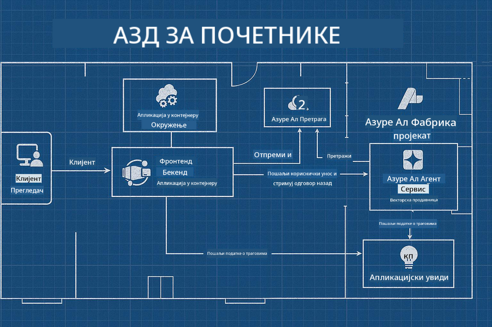

<!--
CO_OP_TRANSLATOR_METADATA:
{
  "original_hash": "245d24997bbcf2bae93bb2a503845d37",
  "translation_date": "2025-09-23T12:06:21+00:00",
  "source_file": "workshop/README.md",
  "language_code": "sr"
}
-->
# AZD за радионицу за AI програмере

## AZD шаблони

Изградња решења за AI апликације на нивоу предузећа за ваш специфичан сценарио је веома слична изградњи сопственог дома. Можете га сами дизајнирати, градити циглу по циглу и преузети одговорност да осигурате да испуњава све смернице за управљање и развој.

**ИЛИ ....**

Можете радити са архитектором који вам може дати _план_ за почетни дом, а затим радити са вама да га _прилагодите_ вашим потребама. Ово вам омогућава да се фокусирате на оно што чини **ваш дом** посебним, док ће се за основне инсталације, водовод и друге зависности побринути стручњаци.

**Ово је приступ иза [AI App Templates](https://ai.azure.com/templates)** - серија планова за изградњу различитих врста "домова" за AI апликације у зависности од ваших основних потреба и зависности.

## Прилагођавање шаблона

Шаблони су дизајнирани да раде са [Azure AI Foundry](https://ai.azure.com). Замислите ову платформу као вашег "грађевинског извођача" са приступом свим ресурсима, алатима и стручности која вам је потребна да завршите посао!

Све што треба да урадите је да изаберете [ваше почетне шаблоне](https://learn.microsoft.com/en-us/azure/ai-foundry/how-to/develop/ai-template-get-started). На пример, фокусираћемо се на шаблон _Get Started with AI Agents_ да изградимо "Агентски AI дом" који долази са функцијама као што су AI претрага, Red Teaming, евалуације, праћење, мониторинг и још много тога!



Све што вам треба је да закажете време са архитектом који ће вас водити кроз процес прилагођавања. [GitHub Copilot for Azure](https://learn.microsoft.com/en-us/azure/developer/github-copilot-azure/get-started) може бити тај водич. Само "разговарајте са њим" да бисте:

- Сазнали више о Azure функцијама у вашем шаблону
- Развили Azure ресурсе
- Добијали информације о вашој имплементацији
- Дијагностиковали и решавали проблеме!

На овој радионици ћемо научити како да _разложимо_ постојећи шаблон (да бисмо сазнали шта пружа), а затим га _прилагодимо_ (да бисмо испунили наше захтеве) - корак по корак.

AI шаблони **чине да ради** - завршетком радионице научићете како да **учините да буде ваше**

----

**Навигација кроз радионицу**
- **📚 Почетна страна курса**: [AZD за почетнике](../README.md)
- **📖 Повезана поглавља**: Обухвата [Поглавље 1](../README.md#-chapter-1-foundation--quick-start), [Поглавље 2](../README.md#-chapter-2-ai-first-development-recommended-for-ai-developers), и [Поглавље 5](../README.md#-chapter-5-multi-agent-ai-solutions-advanced)
- **🛠️ Практична лабораторија**: [AI радионица](../docs/ai-foundry/ai-workshop-lab.md)
- **🚀 Следећи кораци**: [Модули радионице](../../../workshop)

Добродошли на практичну радионицу за учење Azure Developer CLI (AZD) са фокусом на имплементацију AI апликација. Ова радионица је дизајнирана да вас одведе од основа AZD-а до имплементације AI решења спремних за производњу.

## Преглед радионице

**Трајање:** 2-3 сата  
**Ниво:** Почетни до средњи  
**Предуслови:** Основно познавање Azure-а, алата командне линије и AI концепата

### Шта ћете научити

- **Основе AZD-а**: Разумевање инфраструктуре као кода са AZD-ом
- 🤖 **Интеграција AI услуга**: Имплементација Azure OpenAI, AI претраге и других AI услуга
- **Имплементација контејнера**: Коришћење Azure Container Apps за AI апликације
- **Најбоље праксе за безбедност**: Примена Managed Identity и сигурних конфигурација
- **Мониторинг и праћење**: Постављање Application Insights за AI радне оптерећења
- **Шаблони за производњу**: Стратегије имплементације на нивоу предузећа

## Структура радионице

### Модул 1: Основе AZD-а (30 минута)
- Инсталација и конфигурација AZD-а
- Разумевање структуре AZD пројекта
- Ваша прва AZD имплементација
- **Лабораторија**: Имплементација једноставне веб апликације

### Модул 2: Интеграција Azure OpenAI (45 минута)
- Постављање Azure OpenAI ресурса
- Стратегије имплементације модела
- Конфигурација API приступа и аутентификације
- **Лабораторија**: Имплементација апликације за ћаскање са GPT-4

### Модул 3: RAG апликације (45 минута)
- Интеграција Azure AI претраге
- Обрада докумената са Azure Document Intelligence
- Векторска уграђивања и семантичка претрага
- **Лабораторија**: Изградња Q&A система за документе

### Модул 4: Имплементација у производњу (30 минута)
- Конфигурација Container Apps
- Оптимизација скалабилности и перформанси
- Мониторинг и логовање
- **Лабораторија**: Имплементација у производњу са праћењем

### Модул 5: Напредни обрасци (15 минута)
- Имплементације у више окружења
- Интеграција CI/CD-а
- Стратегије оптимизације трошкова
- **Закључак**: Контролна листа спремности за производњу

## Предуслови

### Потребни алати

Молимо вас да инсталирате ове алате пре радионице:

```bash
# Azure Developer CLI
curl -fsSL https://aka.ms/install-azd.sh | bash

# Azure CLI
curl -sL https://aka.ms/InstallAzureCLIDeb | sudo bash

# Git
sudo apt-get install git

# Docker
curl -fsSL https://get.docker.com -o get-docker.sh
sudo sh get-docker.sh

# Python 3.10+
sudo apt-get install python3.10 python3.10-venv python3-pip
```

### Постављање Azure налога

1. **Azure претплата**: [Пријавите се бесплатно](https://azure.microsoft.com/free/)  
2. **Приступ Azure OpenAI**: [Затражите приступ](https://aka.ms/oai/access)  
3. **Потребне дозволе**:  
   - Улога Contributor на претплати или групи ресурса  
   - User Access Administrator (за RBAC доделе)  

### Провера предуслова

Покрените овај скрипт да бисте проверили вашу конфигурацију:

```bash
#!/bin/bash
echo "Verifying workshop prerequisites..."

# Check AZD installation
if command -v azd &> /dev/null; then
    echo "✅ Azure Developer CLI: $(azd --version)"
else
    echo "❌ Azure Developer CLI not found"
fi

# Check Azure CLI
if command -v az &> /dev/null; then
    echo "✅ Azure CLI: $(az --version | head -n1)"
else
    echo "❌ Azure CLI not found"
fi

# Check Docker
if command -v docker &> /dev/null; then
    echo "✅ Docker: $(docker --version)"
else
    echo "❌ Docker not found"
fi

# Check Python
if command -v python3 &> /dev/null; then
    echo "✅ Python: $(python3 --version)"
else
    echo "❌ Python 3 not found"
fi

# Check Azure login
if az account show &> /dev/null; then
    echo "✅ Azure: Logged in as $(az account show --query user.name -o tsv)"
else
    echo "❌ Azure: Not logged in (run 'az login')"
fi

echo "Setup verification complete!"
```

## Материјали за радионицу

### Вежбе у лабораторији

Сваки модул укључује практичне лабораторије са почетним кодом и корак-по-корак упутствима:

- **[lab-1-azd-basics/](../../../workshop/lab-1-azd-basics)** - Ваша прва AZD имплементација  
- **[lab-2-openai-chat/](../../../workshop/lab-2-openai-chat)** - Апликација за ћаскање са Azure OpenAI  
- **[lab-3-rag-search/](../../../workshop/lab-3-rag-search)** - RAG апликација са AI претрагом  
- **[lab-4-production/](../../../workshop/lab-4-production)** - Шаблони за имплементацију у производњу  
- **[lab-5-advanced/](../../../workshop/lab-5-advanced)** - Напредни сценарији имплементације  

### Референтни материјали

- **[Водич за интеграцију AI Foundry](../docs/ai-foundry/azure-ai-foundry-integration.md)** - Свеобухватни обрасци интеграције  
- **[Водич за имплементацију AI модела](../docs/ai-foundry/ai-model-deployment.md)** - Најбоље праксе за имплементацију модела  
- **[Практике за производњу AI-а](../docs/ai-foundry/production-ai-practices.md)** - Шаблони за имплементацију на нивоу предузећа  
- **[Водич за решавање проблема са AI-ом](../docs/troubleshooting/ai-troubleshooting.md)** - Уобичајени проблеми и решења  

### Пример шаблона

Шаблони за брзи почетак за уобичајене AI сценарије:

```
workshop/templates/
├── minimal-chat/          # Basic OpenAI chat app
├── rag-application/       # RAG with AI Search
├── multi-model/          # Multiple AI services
└── production-ready/     # Enterprise template
```

## Почетак

### Опција 1: GitHub Codespaces (препоручено)

Најбржи начин за почетак радионице:

[](https://github.com/codespaces/new?hide_repo_select=true&ref=main&repo=YOUR_REPO_ID)

### Опција 2: Локални развој

1. **Клонирајте репозиторијум радионице:**  
```bash
git clone https://github.com/YOUR_ORG/AZD-for-beginners.git
cd AZD-for-beginners/workshop
```

2. **Пријавите се на Azure:**  
```bash
az login
azd auth login
```

3. **Почните са Лабораторијом 1:**  
```bash
cd lab-1-azd-basics
cat README.md  # Follow the instructions
```

### Опција 3: Радионица са инструктором

Ако присуствујете радионици са инструктором:

- 🎥 **Снимак радионице**: [Доступно на захтев](https://aka.ms/azd-ai-workshop)  
- 💬 **Discord заједница**: [Придружите се за подршку уживо](https://aka.ms/foundry/discord)  
- **Повратне информације о радионици**: [Поделите своје искуство](https://aka.ms/azd-workshop-feedback)  

## Временски оквир радионице

### Самостално учење (3 сата)

```
⏰ 00:00 - 00:30  Module 1: AZD Foundations
⏰ 00:30 - 01:15  Module 2: Azure OpenAI Integration
⏰ 01:15 - 02:00  Module 3: RAG Applications
⏰ 02:00 - 02:30  Module 4: Production Deployment
⏰ 02:30 - 02:45  Module 5: Advanced Patterns
⏰ 02:45 - 03:00  Q&A and Next Steps
```

### Сесија са инструктором (2.5 сата)

```
⏰ 00:00 - 00:15  Welcome & Prerequisites Check
⏰ 00:15 - 00:40  Module 1: Live Demo + Lab
⏰ 00:40 - 01:20  Module 2: OpenAI Integration
⏰ 01:20 - 01:30  Break
⏰ 01:30 - 02:10  Module 3: RAG Applications
⏰ 02:10 - 02:30  Module 4: Production Patterns
⏰ 02:30 - 02:45  Module 5: Advanced Topics
⏰ 02:45 - 03:00  Q&A and Resources
```

## Критеријуми успеха

До краја ове радионице, бићете у могућности да:

✅ **Имплементирате AI апликације** користећи AZD шаблоне  
✅ **Конфигуришете Azure OpenAI** услуге са одговарајућом безбедношћу  
✅ **Изградите RAG апликације** са интеграцијом Azure AI претраге  
✅ **Примените шаблоне за производњу** за AI радне оптерећења на нивоу предузећа  
✅ **Мониторишете и решавате проблеме** са имплементацијом AI апликација  
✅ **Примените стратегије оптимизације трошкова** за AI радне оптерећења  

## Заједница и подршка

### Током радионице

- 🙋 **Питања**: Користите ћаскање радионице или подигните руку  
- 🐛 **Проблеми**: Проверите [водич за решавање проблема](../docs/troubleshooting/ai-troubleshooting.md)  
- **Савети**: Поделите открића са другим учесницима  

### Након радионице

- 💬 **Discord**: [Azure AI Foundry заједница](https://aka.ms/foundry/discord)  
- **GitHub Issues**: [Пријавите проблеме са шаблонима](https://github.com/YOUR_ORG/AZD-for-beginners/issues)  
- 📧 **Повратне информације**: [Форма за евалуацију радионице](https://aka.ms/azd-workshop-feedback)  

## Следећи кораци

### Наставите са учењем

1. **Напредни сценарији**: Истражите [имплементације у више региона](../docs/ai-foundry/production-ai-practices.md#multi-region-deployment)  
2. **Интеграција CI/CD-а**: Поставите [GitHub Actions токове рада](../docs/deployment/github-actions.md)  
3. **Прилагођени шаблони**: Креирајте своје [AZD шаблоне](../docs/getting-started/custom-templates.md)  

### Примените у својим пројектима

1. **Процена**: Користите нашу [контролну листу спремности](./production-readiness-checklist.md)  
2. **Шаблони**: Почните са нашим [AI специфичним шаблонима](../../../workshop/templates)  
3. **Подршка**: Придружите се [Azure AI Foundry Discord-у](https://aka.ms/foundry/discord)  

### Поделите свој успех

- ⭐ **Означите репозиторијум звездицом** ако вам је радионица помогла  
- 🐦 **Поделите на друштвеним мрежама** са #AzureDeveloperCLI #AzureAI  
- 📝 **Напишите блог пост** о вашем путовању у имплементацији AI-а  

---

## Повратне информације о радионици

Ваше повратне информације нам помажу да побољшамо искуство радионице:

| Аспект | Оцена (1-5) | Коментари |
|--------|--------------|----------|
| Квалитет садржаја | ⭐⭐⭐⭐⭐ | |
| Практичне лабораторије | ⭐⭐⭐⭐⭐ | |
| Документација | ⭐⭐⭐⭐⭐ | |
| Ниво тежине | ⭐⭐⭐⭐⭐ | |
| Укупно искуство | ⭐⭐⭐⭐⭐ | |

**Пошаљите повратне информације**: [Форма за евалуацију радионице](https://aka.ms/azd-workshop-feedback)

---

**Претходно:** [Водич за решавање проблема са AI-ом](../docs/troubleshooting/ai-troubleshooting.md) | **Следеће:** Почните са [Лабораторијом 1: Основе AZD-а](../../../workshop/lab-1-azd-basics)

**Спремни да почнете са изградњом AI апликација помоћу AZD-а?**

[Почните са Лабораторијом 1: Основе AZD-а →](./lab-1-azd-basics/README.md)

---

