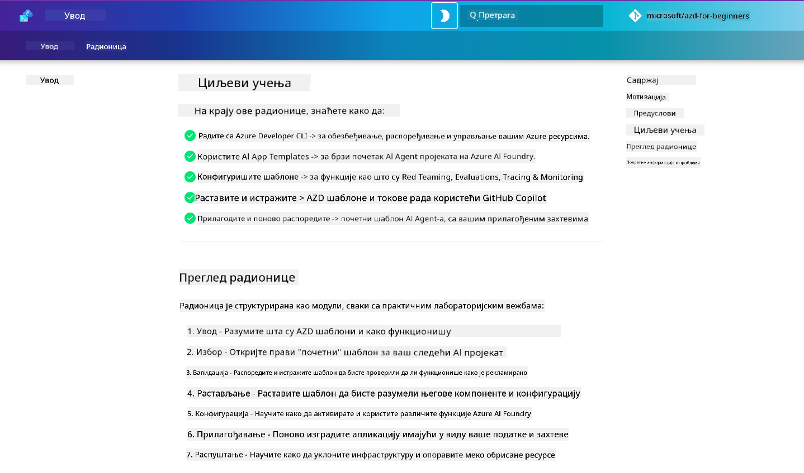

<!--
CO_OP_TRANSLATOR_METADATA:
{
  "original_hash": "9cc966416ab431c38b2ab863884b196c",
  "translation_date": "2025-09-25T01:22:10+00:00",
  "source_file": "workshop/README.md",
  "language_code": "sr"
}
-->
# AZD за радионицу за AI програмере

Добродошли на практичну радионицу за учење Azure Developer CLI (AZD) са фокусом на примену AI апликација. Ова радионица вам помаже да стекнете практично разумевање AZD шаблона у 3 корака:

1. **Откривање** - пронађите шаблон који вам одговара.
1. **Примена** - примените и проверите да ли ради.
1. **Прилагођавање** - модификујте и прилагодите шаблон својим потребама!

Током радионице, бићете упознати са основним алатима за програмере и радним токовима, који ће вам помоћи да убрзате свој развојни процес од почетка до краја.

<br/>

## Водич у претраживачу

Лекције радионице су у Markdown формату. Можете их прегледати директно на GitHub-у или покренути преглед у претраживачу као што је приказано на слици испод.



Да бисте користили ову опцију - направите форк репозиторијума на свом профилу и покрените GitHub Codespaces. Када терминал у VS Code-у постане активан, укуцајте ову команду:

```bash title="" linenums="0"
mkdocs serve > /dev/null 2>&1 &
```

За неколико секунди, видећете дијалог. Изаберите опцију `Open in browser`. Водич у претраживачу ће се сада отворити у новом табу. Неке предности овог прегледа:

1. **Уграђена претрага** - брзо пронађите кључне речи или лекције.
1. **Икона за копирање** - пређите мишем преко блокова кода да бисте видели ову опцију.
1. **Промена теме** - пребацујте између тамне и светле теме.
1. **Помоћ** - кликните на иконицу Discord-а у подножју да се придружите!

<br/>

## Преглед радионице

**Трајање:** 3-4 сата  
**Ниво:** Почетни до средњи  
**Предуслови:** Познавање Azure-а, AI концепата, VS Code-а и алата командне линије.

Ово је практична радионица где учите кроз рад. Када завршите вежбе, препоручујемо да прегледате AZD For Beginners курикулум како бисте наставили своје учење о безбедности и најбољим праксама продуктивности.

| Време | Модул  | Циљ |
|:---|:---|:---|
| 15 мин | [Увод](docs/instructions/0-Introduction.md) | Поставите основу, разумите циљеве |
| 30 мин | [Избор AI шаблона](docs/instructions/1-Select-AI-Template.md) | Истражите опције и изаберите почетни шаблон | 
| 30 мин | [Провера AI шаблона](docs/instructions/2-Validate-AI-Template.md) | Примените подразумевано решење на Azure |
| 30 мин | [Разлагање AI шаблона](docs/instructions/3-Deconstruct-AI-Template.md) | Истражите структуру и конфигурацију |
| 30 мин | [Конфигурисање AI шаблона](docs/instructions/4-Configure-AI-Template.md) | Активирајте и испробајте доступне функције |
| 30 мин | [Прилагођавање AI шаблона](docs/instructions/5-Customize-AI-Template.md) | Прилагодите шаблон својим потребама |
| 30 мин | [Уклањање инфраструктуре](docs/instructions/6-Teardown-Infrastructure.md) | Очистите и ослободите ресурсе |
| 15 мин | [Закључак и следећи кораци](docs/instructions/7-Wrap-up.md) | Ресурси за учење, изазов радионице |

<br/>

## Шта ћете научити

AZD шаблон замислите као песковник за учење у којем можете истражити различите могућности и алате за развој на Azure AI Foundry-ју. На крају радионице, требало би да имате интуитивно разумевање различитих алата и концепата у овом контексту.

| Концепт  | Циљ |
|:---|:---|
| **Azure Developer CLI** | Разумевање команди и радних токова алата |
| **AZD шаблони**| Разумевање структуре пројекта и конфигурације |
| **Azure AI Agent**| Обезбеђивање и примена Azure AI Foundry пројекта  |
| **Azure AI Search**| Омогућавање контекстуалног инжењеринга са агентима |
| **Посматрање**| Истраживање праћења, мониторинга и евалуација |
| **Red Teaming**| Истраживање тестирања отпорности и ублажавања |

<br/>

## Структура радионице

Радионица је структурирана тако да вас води кроз процес од откривања шаблона, преко примене, разлагања и прилагођавања - користећи званични [Getting Started with AI Agents](https://github.com/Azure-Samples/get-started-with-ai-agents) почетни шаблон као основу.

### [Модул 1: Избор AI шаблона](docs/instructions/1-Select-AI-Template.md) (30 мин)

- Шта су AI шаблони?
- Где могу пронаћи AI шаблоне?
- Како могу започети изградњу AI агената?
- **Лабораторија**: Брзи почетак са GitHub Codespaces

### [Модул 2: Провера AI шаблона](docs/instructions/2-Validate-AI-Template.md) (30 мин)

- Шта је архитектура AI шаблона?
- Шта је AZD развојни ток?
- Како могу добити помоћ за AZD развој?
- **Лабораторија**: Примена и провера AI Agents шаблона

### [Модул 3: Разлагање AI шаблона](docs/instructions/3-Deconstruct-AI-Template.md) (30 мин)

- Истражите своје окружење у `.azure/` 
- Истражите поставку ресурса у `infra/` 
- Истражите AZD конфигурацију у `azure.yaml`
- **Лабораторија**: Модификујте променљиве окружења и поново примените

### [Модул 4: Конфигурисање AI шаблона](docs/instructions/4-Configure-AI-Template.md) (30 мин)
- Истражите: Генерацију уз помоћ претраживања
- Истражите: Евалуацију агента и Red Teaming
- Истражите: Праћење и мониторинг
- **Лабораторија**: Истражите AI агента + посматрање 

### [Модул 5: Прилагођавање AI шаблона](docs/instructions/5-Customize-AI-Template.md) (30 мин)
- Дефинишите: PRD са захтевима сценарија
- Конфигуришите: Променљиве окружења за AZD
- Имплементирајте: Lifecycle Hooks за додатне задатке
- **Лабораторија**: Прилагодите шаблон за свој сценарио

### [Модул 6: Уклањање инфраструктуре](docs/instructions/6-Teardown-Infrastructure.md) (30 мин)
- Рекапитулација: Шта су AZD шаблони?
- Рекапитулација: Зашто користити Azure Developer CLI?
- Следећи кораци: Испробајте други шаблон!
- **Лабораторија**: Уклоните инфраструктуру и очистите

<br/>

## Изазов радионице

Желите да се додатно изазовете? Ево неких предлога за пројекте - или поделите своје идеје са нама!!

| Пројекат | Опис |
|:---|:---|
|1. **Разлагање сложеног AI шаблона** | Користите радни ток и алате које смо описали и видите да ли можете применити, проверити и прилагодити други AI шаблон решења. _Шта сте научили?_|
|2. **Прилагођавање за ваш сценарио**  | Покушајте да напишете PRD (Product Requirements Document) за други сценарио. Затим користите GitHub Copilot у вашем репозиторијуму шаблона у Agent Model-у - и замолите га да генерише радни ток прилагођавања за вас. _Шта сте научили? Како бисте могли да побољшате ове предлоге?_|
| | |

## Имате повратне информације?

1. Поставите питање на овом репозиторијуму - означите га `Workshop` ради лакшег сналажења.
1. Придружите се Azure AI Foundry Discord-у - повежите се са својим колегама!


| | | 
|:---|:---|
| **📚 Почетна страна курса**| [AZD For Beginners](../README.md)|
| **📖 Документација** | [Почните са AI шаблонима](https://learn.microsoft.com/en-us/azure/ai-foundry/how-to/develop/ai-template-get-started)|
| **🛠️AI шаблони** | [Azure AI Foundry Templates](https://ai.azure.com/templates) |
|**🚀 Следећи кораци** | [Прихватите изазов](../../../workshop) |
| | |

<br/>

---

**Претходно:** [Водич за решавање проблема са AI](../docs/troubleshooting/ai-troubleshooting.md) | **Следеће:** Почните са [Лабораторијом 1: Основе AZD](../../../workshop/lab-1-azd-basics)

**Спремни да започнете изградњу AI апликација са AZD?**

[Почните Лабораторију 1: Основе AZD →](./lab-1-azd-basics/README.md)

---

