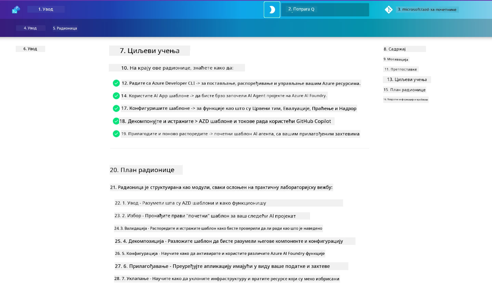

<div align="center">
  <div style="background: linear-gradient(135deg, #0078d4, #106ebe); border-radius: 10px; padding: 20px; margin: 20px 0; box-shadow: 0 4px 15px rgba(0, 120, 212, 0.3); border: 2px solid #005a9e;">
    <h2 style="color: white; margin: 0; font-size: 24px; text-shadow: 1px 1px 2px rgba(0,0,0,0.3);">
      🎯 Радионица AZD за AI програмере
    </h2>
    <p style="color: white; margin: 10px 0 0 0; font-size: 16px; text-shadow: 1px 1px 2px rgba(0,0,0,0.3);">
      <strong>Практична радионица за прављење AI апликација уз Azure Developer CLI.</strong><br>
      Завршите 7 модула да овладате AZD шаблонима и AI процесима распоређивања.
    </p>
    <div style="margin-top: 15px;">
      <span style="background: rgba(255,255,255,0.2); padding: 5px 10px; border-radius: 15px; color: white; font-size: 14px;">
        📅 Последње ажурирање: март 2026
      </span>
    </div>
  </div>
</div>

# Радионица AZD за AI програмере

Добро дошли у практичну радионицу за учење Azure Developer CLI (AZD) са фокусом на распоређивање AI апликација. Ова радионица вам помаже да стекнете примењено разумевање AZD шаблона у 3 корака:

1. **Проналажење** - пронађите шаблон који вам одговара.
1. **Распоређивање** - распоредите и потврдите да ради
1. **Прилагођавање** - модификујте и итерајте да би био ваш!

Током ове радионице бићете упознати и са основним алатима и радним токовима за развој, како бисте поједноставили свој крај-до-крај развојни пут.

<br/>

## Водич у прегледачу

Лекције радионице су у Markdown формату. Можете их прегледати директно на GitHub-у - или покренути преглед заснован на прегледачу као што је приказано на снимку екрана испод.



Да бисте користили ову опцију - форкујте репозиторијум на свој налог и покрените GitHub Codespaces. Када је VS Code терминал активан, укуцајте ову команду:

This browser preview works in GitHub Codespaces, dev containers, or a local clone with Python and MkDocs installed.

```bash title="" linenums="0"
mkdocs serve > /dev/null 2>&1 &
```

За неколико секунди видећете искачући дијалог. Изаберите опцију `Отвори у прегледачу`. Веб-водич ће се сада отворити у новом табу прегледача. Неке предности овог прегледа:

1. **Уграђена претрага** - брзо пронађите кључне речи или лекције.
1. **Икона за копирање** - померите курсор преко блокова кода да бисте видели ову опцију
1. **Промена теме** - пребацујте између тамне и светле теме
1. **Добијте помоћ** - кликните на Discord икону у подножју да се придружите!

<br/>

## Преглед радионице

**Трајање:** 3-4 сата  
**Ниво:** Почетни до средњи  
**Претпоставке:** Познавање Azure-а, AI концепата, VS Code-а и алата командне линије.

Ово је практична радионица у којој учите кроз рад. Када завршите вежбе, препоручујемо да прегледате курс AZD за почетнике да бисте наставили своје учење у смеру безбедности и продуктивности.

| Време| Модул  | Циљ |
|:---|:---|:---|
| 15 mins | [Увод](docs/instructions/0-Introduction.md) | Поставити оквир, разумети циљеве |
| 30 mins | [Изабери AI шаблон](docs/instructions/1-Select-AI-Template.md) | Истражите опције и одаберите почетни шаблон | 
| 30 mins | [Валидирај AI шаблон](docs/instructions/2-Validate-AI-Template.md) | Распоредите подразумевано решење на Azure |
| 30 mins | [Деконструиши AI шаблон](docs/instructions/3-Deconstruct-AI-Template.md) | Истражите структуру и конфигурацију |
| 30 mins | [Конфигуриши AI шаблон](docs/instructions/4-Configure-AI-Template.md) | Активирајте и испробајте доступне функције |
| 30 mins | [Прилагоди AI шаблон](docs/instructions/5-Customize-AI-Template.md) | Прилагодите шаблон својим потребама |
| 30 mins | [Уклоните инфраструктуру](docs/instructions/6-Teardown-Infrastructure.md) | Очистите и ослободите ресурсе |
| 15 mins | [Завршетак и следећи кораци](docs/instructions/7-Wrap-up.md) | Ресурси за учење, изазов радионице |

<br/>

## Шта ћете научити

Смрадите AZD шаблон као песак-кицујуће окружење за истраживање различитих могућности и алата за крај-до-крај развој на Microsoft Foundry платформи. На крају ове радионице, требало би да имате интуитивно разумевање различитих алата и концепата у овом контексту.

| Концепт  | Циљ |
|:---|:---|
| **Azure Developer CLI** | Разумети команде алата и радне токове|
| **AZD Templates**| Разумети структуру пројекта и конфигурацију|
| **Azure AI Agent**| Креирање и распоређивање Microsoft Foundry пројекта  |
| **Azure AI Search**| Омогућавање контекстног инжењеринга са агентима |
| **Observability**| Истражите праћење, мониторинг и процене |
| **Red Teaming**| Истражите адверсаријално тестирање и мере ублажавања |

<br/>

## Структура радионице

Радионица је структурирана тако да вас води од проналажења шаблона, до распоређивања, деконструкције и прилагођавања - користећи званични [Почетак рада са AI агентима](https://github.com/Azure-Samples/get-started-with-ai-agents) почетни шаблон као основу.

### [Модул 1: Изаберите AI шаблон](docs/instructions/1-Select-AI-Template.md) (30 mins)

- Шта су AI шаблони?
- Где могу да нађем AI шаблоне?
- Како да почнем да правим AI агенте?
- **Лаб:** Брзи почетак у Codespaces или dev контејнеру

### [Модул 2: Валидирај AI шаблон](docs/instructions/2-Validate-AI-Template.md) (30 mins)

- Каква је архитектура AI шаблона?
- Шта је AZD развојни радни ток?
- Како да добијем помоћ за AZD развој?
- **Лаб:** Распоредите и валидирајте AI Agents шаблон

### [Модул 3: Деконструиши AI шаблон](docs/instructions/3-Deconstruct-AI-Template.md) (30 mins)

- Истражите своје окружење у `.azure/` 
- Истражите своју конфигурацију ресурса у `infra/` 
- Истражите своју AZD конфигурацију у `azure.yaml`-овима
- **Лаб:** Модификујте променљиве окружења и поново распоредите

### [Модул 4: Конфигуриши AI шаблон](docs/instructions/4-Configure-AI-Template.md) (30 mins)
- Истражите: Retrieval Augmented Generation
- Истражите: Оцена агената и Red Teaming
- Истражите: Praћење и мониторинг
- **Лаб:** Истражите AI агента + Observability 

### [Модул 5: Прилагоди AI шаблон](docs/instructions/5-Customize-AI-Template.md) (30 mins)
- Дефинишите: PRD са захтевима сценарија
- Конфигуришите: променљиве окружења за AZD
- Имплементирајте: Lifecycle Hooks за додатне задатке
- **Лаб:** Прилагодите шаблон за свој сценарио

### [Модул 6: Уклоните инфраструктуру](docs/instructions/6-Teardown-Infrastructure.md) (30 mins)
- Рекап: Шта су AZD шаблони?
- Рекап: Зашто користити Azure Developer CLI?
- Следећи кораци: Испробајте други шаблон!
- **Лаб:** Депровизионисање инфраструктуре и чишћење

<br/>

## Изазов радионице

Желите да се додатно изазовете? Ево неколико предлога пројеката - или поделите своје идеје са нама!!

| Пројекат | Опис |
|:---|:---|
|1. **Деконструишите сложен AI шаблон** | Користите радни ток и алате које смо описали и видите да ли можете да распоредите, валидирате и прилагодите други AI шаблон решења. _Шта сте научили?_|
|2. **Прилагодите за свој сценарио**  | Покушајте да напишете PRD (Product Requirements Document) за други сценарио. Онда користите GitHub Copilot у вашем репо-у шаблона у Agent Model - и замолите га да генерише радни ток прилагођавања за вас. _Шта сте научили? Како бисте могли побољшати ове предлоге?_|
| | |

## Имате повратне информације?

1. Поставите issue у овај репозиторијум - означите га са `Workshop` ради лакшег сналажења.
1. Придружите се Microsoft Foundry Discord-у - повежите се са другим учесницима!


| | | 
|:---|:---|
| **📚 Course Home**| [AZD за почетнике](../README.md)|
| **📖 Documentation** | [Започните са AI шаблонима](https://learn.microsoft.com/en-us/azure/ai-foundry/how-to/develop/ai-template-get-started)|
| **🛠️AI Templates** | [Microsoft Foundry Templates](https://ai.azure.com/templates) |
|**🚀 Next Steps** | [Започните радионицу](#преглед-радионице) |
| | |

<br/>

---

**Навигација:** [Главни курс](../README.md) | [Увод](docs/instructions/0-Introduction.md) | [Модул 1: Изаберите шаблон](docs/instructions/1-Select-AI-Template.md)

**Спремни да почнете да правите AI апликације уз AZD?**

[Започните радионицу: Увод →](docs/instructions/0-Introduction.md)

---

<!-- CO-OP TRANSLATOR DISCLAIMER START -->
**Ограничење одговорности**:
Овај документ је преведен помоћу услуге за превођење засноване на вештачкој интелигенцији [Co-op Translator](https://github.com/Azure/co-op-translator). Иако се трудимо да будемо прецизни, имајте на уму да аутоматски преводи могу да садрже грешке или нетачности. Оригинални документ на свом изворном језику треба сматрати ауторитетним извором. За критичне информације препоручује се професионалан људски превод. Не сносимо одговорност за било какве неспоразуме или погрешне тумачења која произилазе из коришћења овог превода.
<!-- CO-OP TRANSLATOR DISCLAIMER END -->