# 2. Валидација шаблона

> Верификовано са `azd 1.23.12` у марту 2026.

!!! tip "НА КРАЈУ ОВОГ МОДУЛА МОЋИ ЋЕТЕ"

    - [ ] Анализирати архитектуру AI решења
    - [ ] Разумети радни ток распоређивања AZD-а
    - [ ] Користити GitHub Copilot за помоћ у коришћењу AZD-а
    - [ ] **Lab 2:** Разместити и верификовати шаблон AI агената

---


## 1. Увод

The [Azure Developer CLI](https://learn.microsoft.com/en-us/azure/developer/azure-developer-cli/) or `azd` је open-source алат командне линије који поједностављује развојни радни ток приликом израде и распоређивања апликација на Azure.

[AZD Templates](https://learn.microsoft.com/azure/developer/azure-developer-cli/azd-templates) су стандаризовани репозиторијуми који укључују пример кода апликације, _инфраструктура као код_ ресурсе и `azd` конфигурационе датотеке за кохерентну архитектуру решења. Провизија инфраструктуре постаје једноставна као команда `azd provision` - док вам коришћење `azd up` омогућава да у једном кораку провизионишете инфраструктуру **и** разместите вашу апликацију!

Као резултат, покретање процеса развоја ваше апликације може бити једноставно као проналажење правог _AZD Starter template_ који најбоље одговара вашим потребама апликације и инфраструктуре - и онда прилагођавање репозиторијума да задовољи захтеве вашег сценарија.

Пре него што почнемо, хајде да се уверимо да имате инсталиран Azure Developer CLI.

1. Отворите терминал у VS Code и откуцајте ову команду:

      ```bash title="" linenums="0"
      azd version
      ```

1. Требало би да видите нешто овако!

      ```bash title="" linenums="0"
      azd version 1.23.12 (commit <current-build>)
      ```

**Сада сте спремни да изаберете и размештe шаблон помоћу azd**

---

## 2. Избор шаблона

Microsoft Foundry платформа долази са [сетом препоручених AZD шаблона](https://learn.microsoft.com/en-us/azure/ai-foundry/how-to/develop/ai-template-get-started) који покривају популарне сценарије решења као што су _аутоматизација радних токова са више агената_ и _мултимодално обрађивање садржаја_. Ове шаблоне такође можете открити посетом Microsoft Foundry порталу.

1. Посетите [https://ai.azure.com/templates](https://ai.azure.com/templates)
1. Пријавите се у Microsoft Foundry портал када буде затражено - видећете нешто овако.

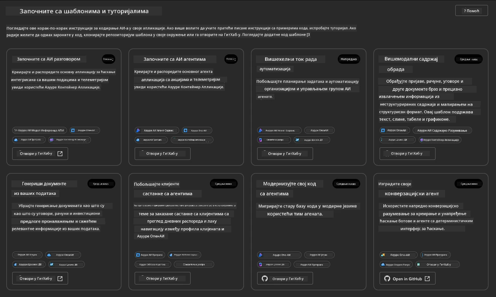


Опције **Basic** су ваши стартни шаблони:

1. [ ] [Почните са AI ћаскањем](https://github.com/Azure-Samples/get-started-with-ai-chat) који распоређује основну чат апликацију _са вашим подацима_ у Azure Container Apps. Користите ово да истражите основни сценарио AI чатбот-а.
1. [X] [Почните са AI агентима](https://github.com/Azure-Samples/get-started-with-ai-agents) који такође распоређује стандардног AI агента (са Foundry Agents). Користите ово да се упознате са агентским AI решењима која укључују алате и моделе.

Посетите други линк у новом табу прегледача (или кликните `Open in GitHub` на повезаној картици). Требало би да видите репозиторијум за овај AZD шаблон. Одвојите минут да прегледате README. Архитектура апликације изгледа овако:

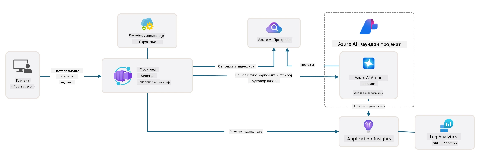

---

## 3. Активирање шаблона

Хајде да покушамо да разместимо овај шаблон и уверимо се да је валидан. Следићемо смернице у одељку [Getting Started](https://github.com/Azure-Samples/get-started-with-ai-agents?tab=readme-ov-file#getting-started).

1. Изаберите радно окружење за репозиторијум шаблона:

      - **GitHub Codespaces**: Кликните на [this link](https://github.com/codespaces/new/Azure-Samples/get-started-with-ai-agents) и потврдите `Create codespace`
      - **Local clone or dev container**: Клонирајте `Azure-Samples/get-started-with-ai-agents` и отворите га у VS Code

1. Сачекајте док терминал у VS Code не буде спреман, затим откуцајте следећу команду:

   ```bash title="" linenums="0"
   azd up
   ```

Завршите кораке радног тока које ће ово покренути:

1. Бићете упитани да се пријавите у Azure - следите упутства за аутентификацију
1. Унесите јединствено име окружења за себе - нпр., ја сам користио `nitya-mshack-azd`
1. Ово ће креирати `.azure/` фолдер - видећете подфолдер са именом окружења
1. Бићете упитани да изаберете име претплате - изаберите подразумевано
1. Бићете упитани за локацију - користите `East US 2`

Сада сачекајте да провизија заврши. **Ово траје 10-15 минута**

1. Када се заврши, ваш конзол ће показати SUCCESS поруку као ову:
      ```bash title="" linenums="0"
      SUCCESS: Your up workflow to provision and deploy to Azure completed in 10 minutes 17 seconds.
      ```
1. Ваш Azure портал ће сада имати провизионисану групу ресурса са тим именом окружења:

      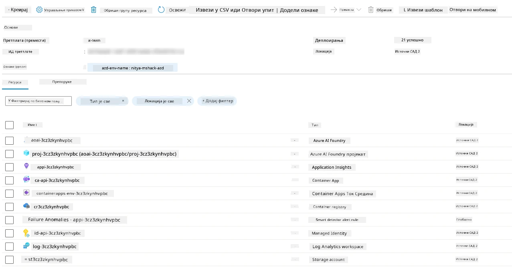

1. **Сада сте спремни да верификујете провизионисану инфраструктуру и апликацију**.

---

## 4. Валидација шаблона

1. Посетите Azure Portal страницу за [Resource Groups](https://portal.azure.com/#browse/resourcegroups) - пријавите се када буде затражено
1. Кликните на RG за име вашег окружења - видећете горе приказану страницу

      - кликните на Azure Container Apps ресурс
      - кликните на URL апликације у секцији _Essentials_ (горе десно)

1. Требало би да видите хостовани фронтенд апликације као овај:

   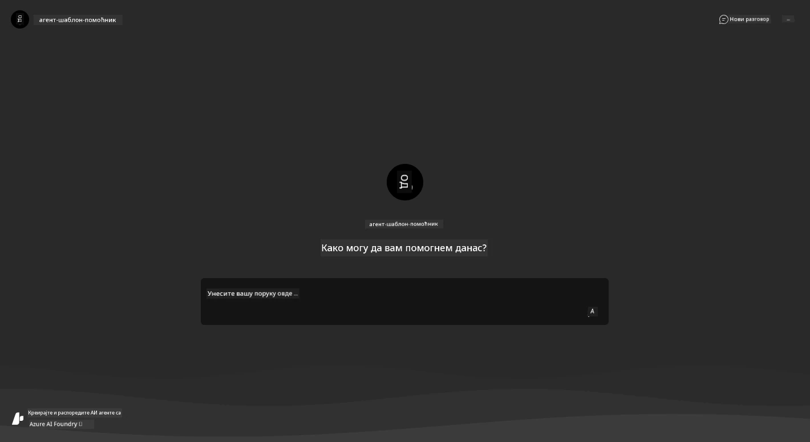

1. Покушајте да поставите неколико [пример питања](https://github.com/Azure-Samples/get-started-with-ai-agents/blob/main/docs/sample_questions.md)

      1. Питајте: ```Који је главни град Француске?``` 
      1. Питајте: ```Који је најбољи шатор испод $200 за две особе, и које карактеристике има?```

1. Требало би да добијете одговоре сличне ономе што је приказано испод. _Али како ово ради?_ 

      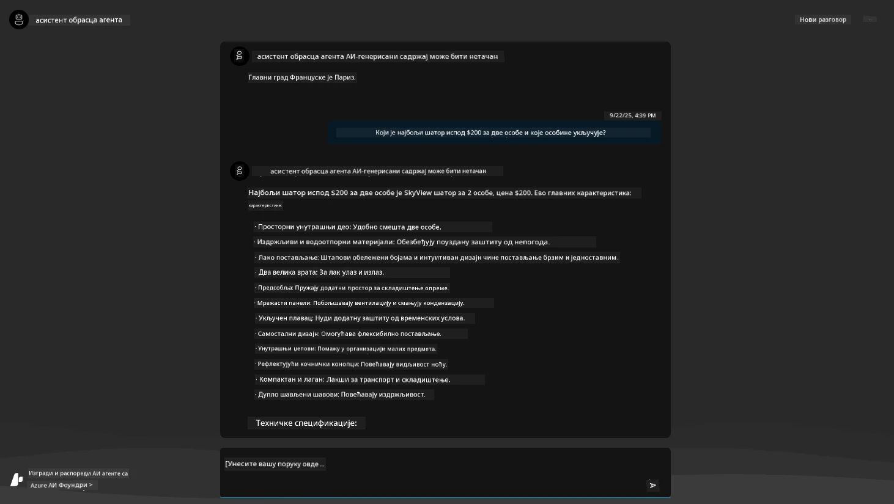

---

## 5.  Валидација агента

Azure Container App распоређује крајњу тачку која се повезује са AI агентом провизионисаним у Microsoft Foundry пројекту за овај шаблон. Хајде да погледамо шта то значи.

1. Вратите се на Azure Portal страницу _Overview_ за вашу групу ресурса

1. Кликните на ресурс `Microsoft Foundry` у тој листи

1. Требало би да видите ово. Кликните дугме `Go to Microsoft Foundry Portal`. 
   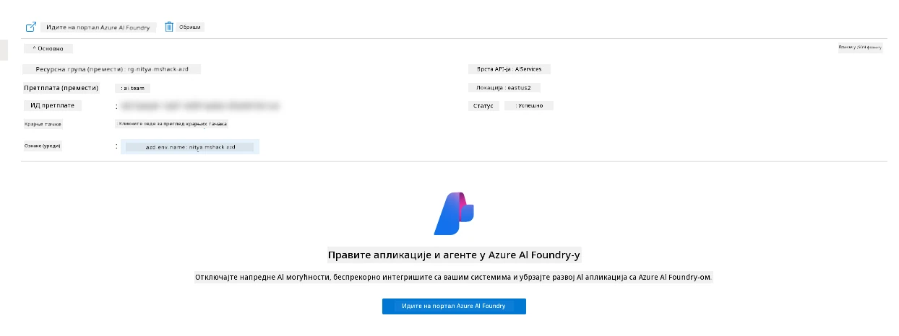

1. Требало би да видите страницу Foundry пројекта за вашу AI апликацију
   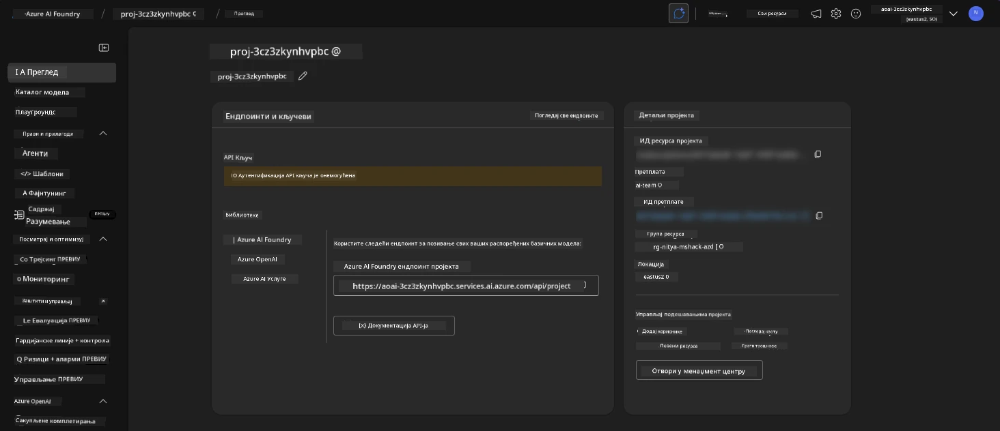

1. Кликните на `Agents` - видећете подразумеваног агента провизионисаног у вашем пројекту
   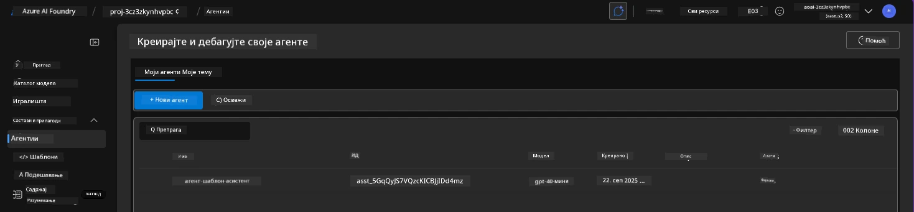

1. Изаберите га - и видећете детаље агента. Обратите пажњу на следеће:

      - Агент по подразумеваној вредности користи File Search (увек)
      - Поље `Knowledge` агента показује да је отпремљено 32 фајла (за претрагу фајлова)
      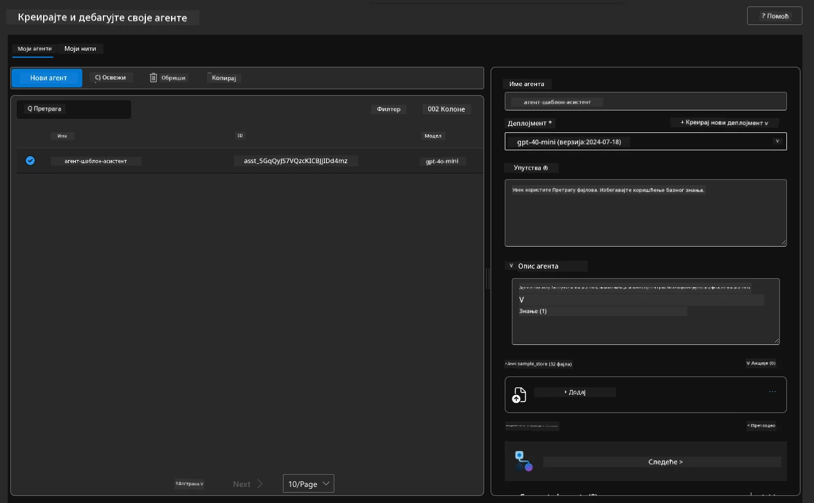

1. Потражите опцију `Data+indexes` у левом менију и кликните за детаље. 

      - Требало би да видите 32 отпремљена фајла података за знање.
      - Они ће одговарати 12 фајлова купаца и 20 фајлова производа у `src/files`
      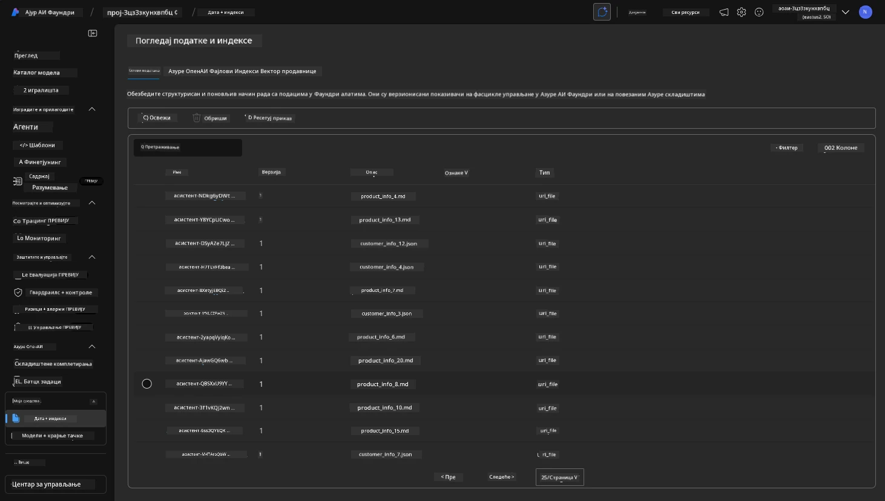

**Потврдили сте рад агента!** 

1. Одговори агента су утајени у знању из тих фајлова.
1. Сада можете да постављате питања у вези са тим подацима и добијате утемељене одговоре.
1. Пример: `customer_info_10.json` описује 3 куповине које је направила "Amanda Perez"

Вратите се на таб прегледача са Container App крајњом тачком и питајте: `Које производе поседује Amanda Perez?`. Требало би да видите нешто овако:

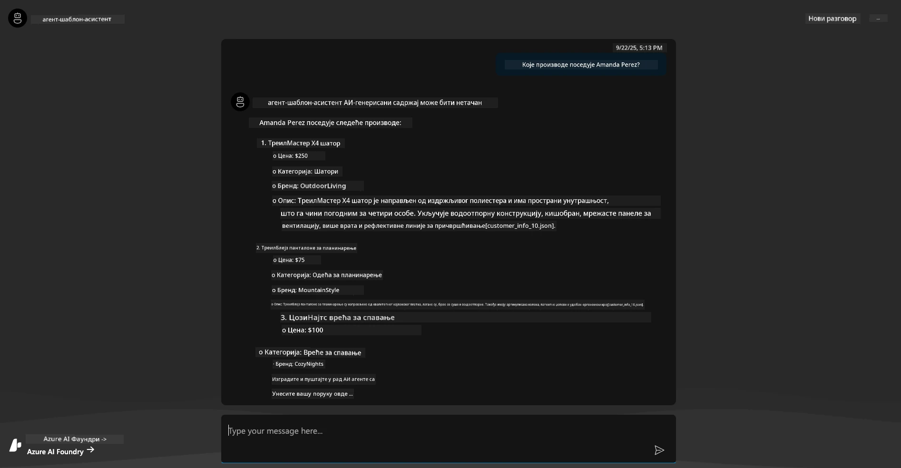

---

## 6. Игралница агента

Хајде да изградимо мало више интуиције за могућности Microsoft Foundry тако што ћемо тестирати агента у Agents Playground.

1. Вратите се на страницу `Agents` у Microsoft Foundry - изаберите подразумеваног агента
1. Кликните опцију `Try in Playground` - требало би да добијете Playground UI као овај
1. Питајте исто питање: `Које производе поседује Amanda Perez?`

    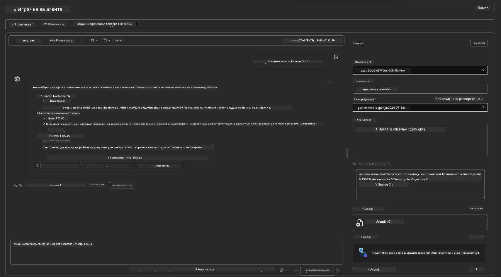

Добијате исти (или сличан) одговор - али такође добијате додатне информације које можете користити да разумете квалитет, трошкове и перформансе ваше агентске апликације. На пример:

1. Обратите пажњу да одговор наводи фајлове података који су коришћени да "утемеље" одговор
1. Пређите курсором преко било које од ових ознака фајлова - да ли подаци одговарају вашем упиту и приказаном одговору?

Такође видите ред са _stats_ испод одговора.

1. Пређите курсором преко било које метрике - нпр. Safety. Видећете нешто овако
1. Да ли оцењена вредност одговара вашој интуицији о нивоу безбедности одговора?

      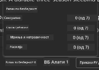

---

## 7. Уграђена опсервабилност

Опсервабилност се односи на инструментализацију ваше апликације да генерише податке који се могу користити за разумевање, отклањање грешака и оптимизацију њених операција. Да бисте стекли осећај за ово:

1. Кликните дугме `View Run Info` - требало би да видите овај приказ. Ово је пример [Agent tracing](https://learn.microsoft.com/en-us/azure/ai-foundry/how-to/develop/trace-agents-sdk#view-trace-results-in-the-azure-ai-foundry-agents-playground) у акцији. _Овом приказу можете приступити и кликом на Thread Logs у горњем менију_.

   - Схватите кораке извршавања и алате које је агент укључио
   - Разумите укупан број токена (у односу на коришћење излазних токена) за одговор
   - Разумите латенцију и где се време троши током извршавања

      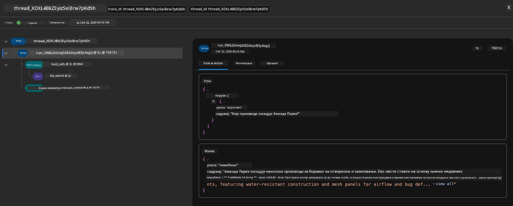

1. Кликните на картицу `Metadata` да видите додатне атрибуте за покретање, који могу пружити користан контекст за отклањање проблема касније.   

      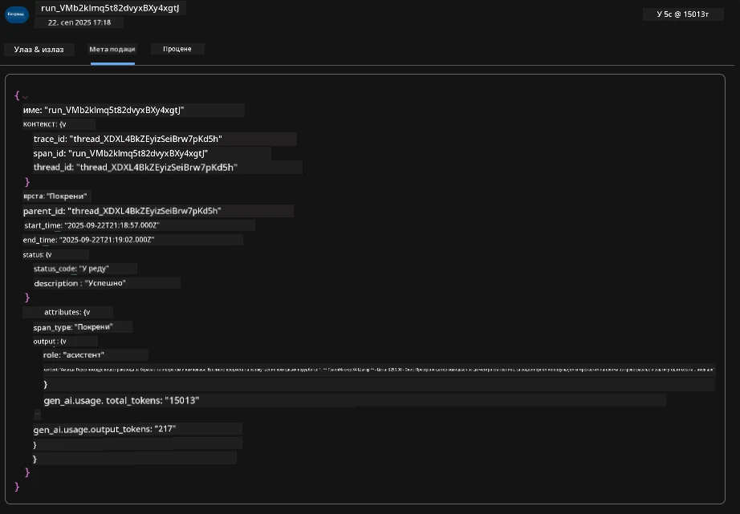


1. Кликните на картицу `Evaluations` да видите аутоматске процене направљене на одговор агента. Ово укључује процене безбедности (нпр. Self-harm) и процене специфичне за агента (нпр. решење намере, придржавање задатка).

      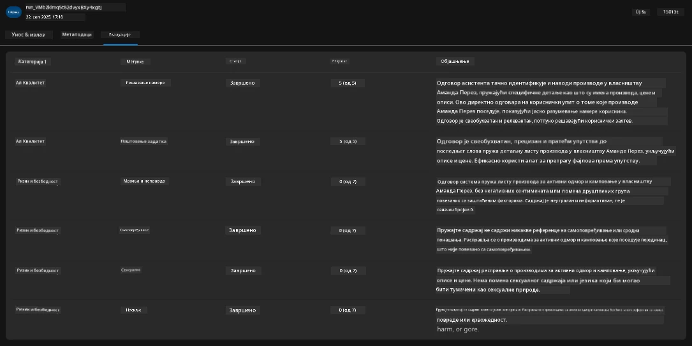

1. И на крају, кликните на картицу `Monitoring` у бочном менију.

      - Изаберите картицу `Resource usage` на приказаној страници - и погледајте метрике.
      - Пратите коришћење апликације у смислу трошкова (токени) и оптерећења (захтеви).
      - Пратите латенцију апликације до првог бајта (обрада улаза) и последњег бајта (излаз).

      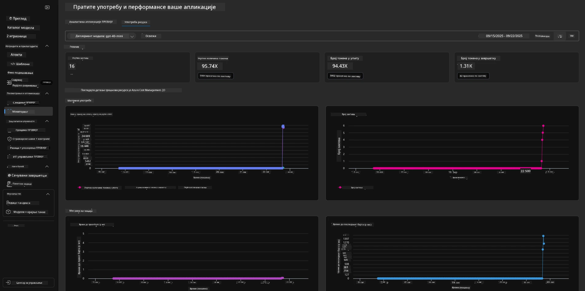

---

## 8. Променљиве окружења

До сада смо прошли кроз распоређивање у прегледачу - и верификовали да је наша инфраструктура провизионисана и да апликација функционише. Али да бисмо радили са апликацијом _код-прво_, морамо да конфигуришемо наше локално развојно окружење са релевантним променљивим које су потребне за рад са овим ресурсима. Korišćenje `azd` чини то лакшим.

1. Azure Developer CLI [користи променљиве окружења](https://learn.microsoft.com/en-us/azure/developer/azure-developer-cli/manage-environment-variables?tabs=bash) за чување и управљање конфигурационим подешавањима за распоређивања апликација.

1. Променљиве окружења се чувају у `.azure/<env-name>/.env` - ово их ограничава на окружење `env-name` које је коришћено током распоређивања и помаже вам да изолујете окружења између различитих циљева распоређивања у истом репозиторијуму.

1. Променљиве окружења се аутоматски учитавају од стране `azd` команде кад год изврши одређену команду (нпр. `azd up`). Имајте на уму да `azd` аутоматски не чита _OS-level_ променљиве окружења (нпр. подешене у шелу) - уместо тога користите `azd set env` и `azd get env` да пренесете информације унутар скрипти.

Хајде да пробамо неколико команди:

1. Добијте све променљиве окружења постављене за `azd` у овом окружењу:

      ```bash title="" linenums="0"
      azd env get-values
      ```
      
      Видећете нешто овако:

      ```bash title="" linenums="0"
      AZURE_AI_AGENT_DEPLOYMENT_NAME="gpt-4.1-mini"
      AZURE_AI_AGENT_NAME="agent-template-assistant"
      AZURE_AI_EMBED_DEPLOYMENT_NAME="text-embedding-3-small"
      AZURE_AI_EMBED_DIMENSIONS=100
      ...
      ```

1. Добијте специфичну вредност - нпр. желим да знам да ли смо подесили вредност `AZURE_AI_AGENT_MODEL_NAME`

      ```bash title="" linenums="0"
      azd env get-value AZURE_AI_AGENT_MODEL_NAME 
      ```
      
      Видећете нешто овако - није била подешена подразумевано!

      ```bash title="" linenums="0"
      ERROR: key 'AZURE_AI_AGENT_MODEL_NAME' not found in the environment values
      ```

1. Поставите нову променљиву окружења за `azd`. Овде ажурирамо име модела агента. _Напомена: било какве промене ће одмах бити приказане у фајлу `.azure/<env-name>/.env`._

      ```bash title="" linenums="0"
      azd env set AZURE_AI_AGENT_MODEL_NAME gpt-4.1
      azd env set AZURE_AI_AGENT_MODEL_VERSION 2025-04-14
      azd env set AZURE_AI_AGENT_DEPLOYMENT_CAPACITY 150
      ```

      Сада би требало да видите да је вредност подешена:

      ```bash title="" linenums="0"
      azd env get-value AZURE_AI_AGENT_MODEL_NAME 
      ```

1. Имајте на уму да су неки ресурси перзистентни (нпр. деплоји модела) и захтеваће више од само `azd up` да би се принудно поново распоредили. Хајде да покушамо да скинемо оригинално распоређивање и поново га распоредимо са измењеним променљивим окружења.

1. **Освежи** Ако сте раније распоредили инфраструктуру користећи azd шаблон - можете _освежити_ стање ваших локалних променљивих окружења на основу тренутног стања вашег Azure распоређивања користећи ову команду:

      ```bash title="" linenums="0"
      azd env refresh
      ```

      Ово је моћан начин да _синхронизујете_ променљиве окружења између два или више локалних развојних окружења (нпр. тим са више програмера) - омогућавајући да распоређена инфраструктура служи као коначни извор истине за стање променљивих окружења. Чланови тима једноставно _освежавају_ променљиве да би се поново синхронизовали.

---

## 9. Честитамо 🏆

Управо сте завршили крај-до-краја ток рада у којем сте:

- [X] Одабрали сте AZD шаблон који желите да користите
- [X] Отворили сте шаблон у подржаном развојном окружењу
- [X] Распоредили сте шаблон и потврдили да ради

---

<!-- CO-OP TRANSLATOR DISCLAIMER START -->
**Одрицање одговорности**:
Овај документ је преведен помоћу услуге за превођење засноване на вештачкој интелигенцији (AI) [Co-op Translator](https://github.com/Azure/co-op-translator). Иако се трудимо да превод буде што прецизнији, имајте у виду да аутоматизовани преводи могу садржати грешке или нетачности. Изворни документ на свом оригиналном језику треба сматрати ауторитативним извором. За критичне информације препоручује се професионални људски превод. Не сносимо одговорност за било какве неспоразуме или погрешне тумачења која произилазе из коришћења овог превода.
<!-- CO-OP TRANSLATOR DISCLAIMER END -->