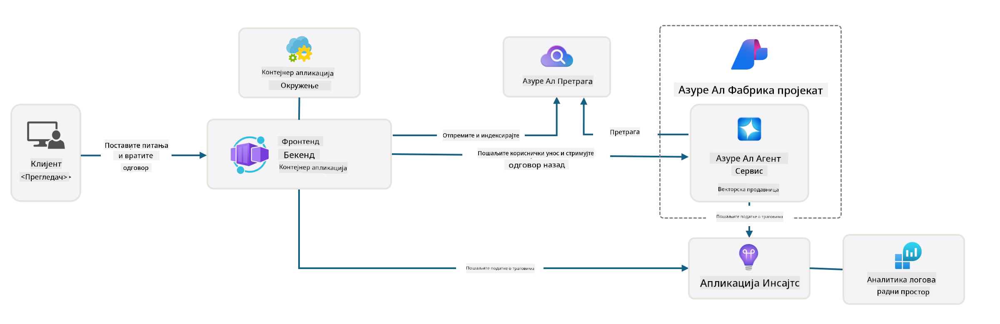

<!--
CO_OP_TRANSLATOR_METADATA:
{
  "original_hash": "4e403f041411361140d6beb88ab2a181",
  "translation_date": "2025-09-25T02:28:43+00:00",
  "source_file": "workshop/docs/instructions/3-Deconstruct-AI-Template.md",
  "language_code": "sr"
}
-->
# 3. Разложите шаблон

!!! tip "НА КРАЈУ ОВОГ МОДУЛА БИЋЕТЕ У МОГУЋНОСТИ"

    - [ ] Ставка
    - [ ] Ставка
    - [ ] Ставка
    - [ ] **Лабораторија 3:** 

---

Са AZD шаблонима и Azure Developer CLI (`azd`) можемо брзо започети наш пут развоја AI-а уз стандардизоване репозиторијуме који пружају пример кода, инфраструктуру и конфигурационе датотеке - у облику пројекта _стартер_ спремног за примену.

**Али сада, морамо разумети структуру пројекта и базу кода - и бити у могућности да прилагодимо AZD шаблон - без претходног искуства или разумевања AZD-а!**

---

## 1. Активирајте GitHub Copilot

### 1.1 Инсталирајте GitHub Copilot Chat

Време је да истражите [GitHub Copilot са Agent Mode](https://code.visualstudio.com/docs/copilot/chat/chat-agent-mode). Сада можемо користити природни језик да опишемо наш задатак на високом нивоу и добијемо помоћ у извршењу. За ову лабораторију, користићемо [Copilot Free план](https://github.com/github-copilot/signup) који има месечни лимит за комплетирања и интеракције у чету.

Екстензија се може инсталирати из marketplace-а, али би већ требало да буде доступна у вашем Codespaces окружењу. _Кликните `Open Chat` из падајућег менија Copilot иконе - и укуцајте упит као што је `What can you do?`_ - можда ће вам бити затражено да се пријавите. **GitHub Copilot Chat је спреман**.

### 1.2. Инсталирајте MCP сервере

Да би Agent Mode био ефикасан, потребан му је приступ правим алатима који му помажу да преузме знање или предузме акције. Овде MCP сервери могу помоћи. Конфигурисаћемо следеће сервере:

1. [Azure MCP Server](../../../../../workshop/docs/instructions)
1. [Microsoft Docs MCP Server](../../../../../workshop/docs/instructions)

Да бисте их активирали:

1. Направите датотеку под називом `.vscode/mcp.json` ако не постоји
1. Копирајте следеће у ту датотеку - и покрените сервере!
   ```json title=".vscode/mcp.json"
   {
      "servers": {
         "Azure MCP Server": {
            "command": "npx",
            "args": [
            "-y",
            "@azure/mcp@latest",
            "server",
            "start"
            ]
         },
         "microsoft.docs.mcp": {
            "type": "http",
            "url": "https://learn.microsoft.com/api/mcp"
         }
      }
   }
   ```

??? warning "Можда ћете добити грешку да `npx` није инсталиран (кликните да проширите за решење)"

      Да бисте решили ово, отворите датотеку `.devcontainer/devcontainer.json` и додајте ову линију у секцију са функцијама. Затим поново изградите контејнер. Сада би требало да имате инсталиран `npx`.

      ```title="" linenums="0"
         "features": {
            "ghcr.io/devcontainers/features/node:1": {},
            ...
         },
      ```

---

### 1.3. Тестирајте GitHub Copilot Chat

**Прво користите `az login` да се аутентификујете са Azure-ом из командне линије VS Code-а.**

Сада би требало да можете да упитате статус ваше Azure претплате и постављате питања о примењеним ресурсима или конфигурацији. Пробајте ове упите:

1. `List my Azure resource groups`
1. `#foundry list my current deployments`

Такође можете постављати питања о Azure документацији и добити одговоре засноване на Microsoft Docs MCP серверу. Пробајте ове упите:

1. `#microsoft_docs_search What is Azure Developer CLI?`
1. `#microsoft_docs_search Show me a Python tutorial to chat with deployed model`

Или можете затражити кодне исечке за завршетак задатка. Пробајте овај упит:

1. `Give me a Python code example that uses AAD for an interactive chat client`

У `Ask` режиму, ово ће пружити код који можете копирати и испробати. У `Agent` режиму, ово може ићи корак даље и креирати релевантне ресурсе за вас - укључујући скрипте за подешавање и документацију - да вам помогне у извршењу тог задатка.

**Сада сте опремљени да почнете истраживати репозиторијум шаблона**

---

## 2. Разложите архитектуру

??? prompt "ПИТАЈ: Објасни архитектуру апликације у docs/images/architecture.png у једном пасусу"

      Ова апликација је AI-покренута апликација за чет изграђена на Azure-у која демонстрира модерну архитектуру засновану на агентима. Решење се фокусира на Azure Container App који хостује главни код апликације, који обрађује кориснички унос и генерише интелигентне одговоре кроз AI агента. 
      
      Архитектура користи Azure AI Foundry Project као основу за AI могућности, повезујући се са Azure AI Services који пружају основне језичке моделе (као што је GPT-4o-mini) и функционалност агента. Корисничке интеракције пролазе кроз фронтенд заснован на React-у до FastAPI бекенда који комуницира са AI агент сервисом за генерисање контекстуалних одговора. 
      
      Систем укључује могућности преузимања знања кроз претрагу датотека или Azure AI Search сервис, омогућавајући агенту да приступи и цитира информације из отпремљених докумената. За оперативну изврсност, архитектура укључује свеобухватно праћење кроз Application Insights и Log Analytics Workspace за праћење, логовање и оптимизацију перформанси. 
      
      Azure Storage пружа blob складиште за податке апликације и отпремљене датотеке, док Managed Identity обезбеђује сигуран приступ између Azure ресурса без чувања акредитива. Цело решење је дизајнирано за скалабилност и одрживост, са контејнеризованом апликацијом која се аутоматски скалира на основу потражње уз уграђену сигурност, праћење и CI/CD могућности кроз Azure-ов екосистем управљаних услуга.



---

## 3. Структура репозиторијума

!!! prompt "ПИТАЈ: Објасни структуру фасцикли шаблона. Почни са визуелним хијерархијским дијаграмом."

??? info "ОДГОВОР: Визуелни хијерархијски дијаграм"

      ```bash title="" 
      get-started-with-ai-agents/
      ├── 📋 Конфигурација и подешавање
      │   ├── azure.yaml                    # Конфигурација Azure Developer CLI-а
      │   ├── docker-compose.yaml           # Локални развојни контејнери
      │   ├── pyproject.toml                # Конфигурација Python пројекта
      │   ├── requirements-dev.txt          # Зависности за развој
      │   └── .devcontainer/                # Подешавање VS Code dev контејнера
      │
      ├── 🏗️ Инфраструктура (infra/)
      │   ├── main.bicep                    # Главни инфраструктурни шаблон
      │   ├── api.bicep                     # Ресурси специфични за API
      │   ├── main.parameters.json          # Параметри инфраструктуре
      │   └── core/                         # Модуларне компоненте инфраструктуре
      │       ├── ai/                       # Конфигурације AI услуга
      │       ├── host/                     # Инфраструктура за хостовање
      │       ├── monitor/                  # Праћење и логовање
      │       ├── search/                   # Подешавање Azure AI Search-а
      │       ├── security/                 # Сигурност и идентитет
      │       └── storage/                  # Конфигурације складишта
      │
      ├── 💻 Извор апликације (src/)
      │   ├── api/                          # Бекенд API
      │   │   ├── main.py                   # Улазна тачка FastAPI апликације
      │   │   ├── routes.py                 # Дефиниције API рута
      │   │   ├── search_index_manager.py   # Функционалност претраге
      │   │   ├── data/                     # Обрада података API-а
      │   │   ├── static/                   # Статички веб ресурси
      │   │   └── templates/                # HTML шаблони
      │   ├── frontend/                     # React/TypeScript фронтенд
      │   │   ├── package.json              # Node.js зависности
      │   │   ├── vite.config.ts            # Конфигурација Vite-а
      │   │   └── src/                      # Изворни код фронтенда
      │   ├── data/                         # Пример датотека са подацима
      │   │   └── embeddings.csv            # Претходно израчунати embeddings
      │   ├── files/                        # Датотеке базе знања
      │   │   ├── customer_info_*.json      # Пример података о клијентима
      │   │   └── product_info_*.md         # Документација о производима
      │   ├── Dockerfile                    # Конфигурација контејнера
      │   └── requirements.txt              # Python зависности
      │
      ├── 🔧 Аутоматизација и скрипте (scripts/)
      │   ├── postdeploy.sh/.ps1           # Подешавање након примене
      │   ├── setup_credential.sh/.ps1     # Конфигурација акредитива
      │   ├── validate_env_vars.sh/.ps1    # Валидација окружења
      │   └── resolve_model_quota.sh/.ps1  # Управљање квотама модела
      │
      ├── 🧪 Тестирање и евалуација
      │   ├── tests/                        # Јединични и интеграциони тестови
      │   │   └── test_search_index_manager.py
      │   ├── evals/                        # Оквир за евалуацију агента
      │   │   ├── evaluate.py               # Покретач евалуације
      │   │   ├── eval-queries.json         # Тест упити
      │   │   └── eval-action-data-path.json
      │   ├── sandbox/                      # Развојно окружење
      │   │   ├── 1-quickstart.py           # Примери за брзи почетак
      │   │   └── aad-interactive-chat.py   # Примери аутентификације
      │   └── airedteaming/                 # Евалуација AI безбедности
      │       └── ai_redteaming.py          # Тестирање од стране "црвеног тима"
      │
      ├── 📚 Документација (docs/)
      │   ├── deployment.md                 # Водич за примену
      │   ├── local_development.md          # Упутства за локално подешавање
      │   ├── troubleshooting.md            # Уобичајени проблеми и решења
      │   ├── azure_account_setup.md        # Azure предуслови
      │   └── images/                       # Ресурси за документацију
      │
      └── 📄 Метаподаци пројекта
         ├── README.md                     # Преглед пројекта
         ├── CODE_OF_CONDUCT.md           # Водич за заједницу
         ├── CONTRIBUTING.md              # Водич за доприносе
         ├── LICENSE                      # Услови лиценце
         └── next-steps.md                # Упутства након примене
      ```

### 3.1. Основна архитектура апликације

Овај шаблон прати образац **веб апликације пуне функционалности** са:

- **Бекенд**: Python FastAPI са Azure AI интеграцијом
- **Фронтенд**: TypeScript/React са Vite системом за изградњу
- **Инфраструктура**: Azure Bicep шаблони за cloud ресурсе
- **Контејнеризација**: Docker за конзистентну примену

### 3.2 Инфраструктура као код (bicep)

Слој инфраструктуре користи **Azure Bicep** шаблоне организоване модуларно:

   - **`main.bicep`**: Оркестрира све Azure ресурсе
   - **`core/` модули**: Поново употребљиве компоненте за различите услуге
      - AI услуге (Azure OpenAI, AI Search)
      - Хостовање контејнера (Azure Container Apps)
      - Праћење (Application Insights, Log Analytics)
      - Сигурност (Key Vault, Managed Identity)

### 3.3 Извор апликације (`src/`)

**Бекенд API (`src/api/`)**:

- REST API заснован на FastAPI-у
- Интеграција Azure AI Agent сервиса
- Управљање индексом претраге за преузимање знања
- Могућности отпремања и обраде датотека

**Фронтенд (`src/frontend/`)**:

- Модеран React/TypeScript SPA
- Vite за брз развој и оптимизоване изградње
- Интерфејс за чет за интеракцију са агентом

**База знања (`src/files/`)**:

- Пример података о клијентима и производима
- Демонстрација преузимања знања заснованог на датотекама
- Примери у JSON и Markdown формату

### 3.4 DevOps и аутоматизација

**Скрипте (`scripts/`)**:

- Скрипте за PowerShell и Bash на више платформи
- Валидација и подешавање окружења
- Конфигурација након примене
- Управљање квотама модела

**Интеграција Azure Developer CLI-а**:

- Конфигурација `azure.yaml` за `azd` токове рада
- Аутоматизовано обезбеђивање и примена
- Управљање променљивим окружења

### 3.5 Тестирање и осигурање квалитета

**Оквир за евалуацију (`evals/`)**:

- Евалуација перформанси агента
- Тестирање квалитета упита и одговора
- Аутоматизовани процес процене

**AI безбедност (`airedteaming/`)**:

- Тестирање од стране "црвеног тима" за AI безбедност
- Скенирање рањивости у безбедности
- Практике одговорног AI-а

---

## 4. Честитамо 🏆

Успешно сте користили GitHub Copilot Chat са MCP серверима, да истражите репозиторијум.

- [X] Активирали GitHub Copilot за Azure
- [X] Разумели архитектуру апликације
- [X] Истражили структуру AZD шаблона

Ово вам даје осећај за _инфраструктуру као код_ ресурсе за овај шаблон. Следеће, погледаћемо конфигурациону датотеку за AZD.

---

