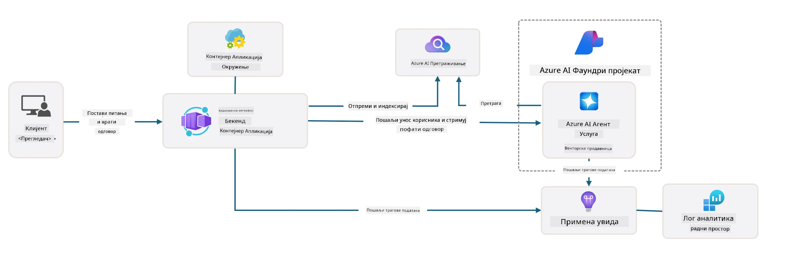

# 3. Deconstruct a Template

!!! tip "НА КРАЈУ ОВОГ МОДУЛА БИЋЕТЕ У МОГУЋНОСТИ"

    - [ ] Активирати GitHub Copilot са MCP серверима за помоћ у Azure-у
    - [ ] Разумети структуру фасцикле AZD шаблона и компоненте
    - [ ] Истражити образце организације инфраструктуре као кода (Bicep)
    - [ ] **Лаб 3:** Користити GitHub Copilot да истражите и разумете архитектуру репозиторијума 

---


Са AZD шаблонима и Azure Developer CLI (`azd`) можемо брзо покренути наше AI развојно путовање уз стандардизоване репозиторијуме који обезбеђују пример кода, инфраструктуру и конфигурационе датотеке - у облику пројекта за брзи старт спремног за деплојмент.

**Али сада, треба да разумемо структуру пројекта и кодну базу - и да будемо у стању да прилагодимо AZD шаблон - без претходног искуства или разумевања AZD-а!**

---

## 1. Activate GitHub Copilot

### 1.1 Install GitHub Copilot Chat

Време је да истражите [GitHub Copilot with Agent Mode](https://code.visualstudio.com/docs/copilot/chat/chat-agent-mode). Сада можемо користити природни језик да опишемо наш задатак на високом нивоу и добијемо помоћ у извршењу. За овај лабораторијски задатак користићемо [Copilot Free plan](https://github.com/github-copilot/signup) који има месечно ограничење за комплетирања и chat интеракције.

Екстензија се може инсталирати са marketplace-а, али би требало да је већ доступна у вашем Codespaces окружењу. _Кликните `Open Chat` из падајућег менија иконице Copilot - и унесите упит као `What can you do?`_ - можда ће бити затражено да се пријавите. **GitHub Copilot Chat је спреман**.

### 1.2. Install MCP Servers

Да би Agent режим био ефикасан, потребан му је приступ правим алатима који ће му помоћи да преузме знање или предузме радње. Тутa MCP сервери могу помоћи. Конфигурисаћемо следеће сервере:

1. [Azure MCP Server](../../../../../workshop/docs/instructions)
1. [Microsoft Docs MCP Server](../../../../../workshop/docs/instructions)

Да бисте их активирали:

1. Направите фајл под именом `.vscode/mcp.json` ако не постоји
1. Копирајте следеће у тај фајл - и покрените сервере!
   ```json title=".vscode/mcp.json"
   {
      "servers": {
         "Azure MCP Server": {
            "command": "npx",
            "args": [
            "-y",
            "@azure/mcp@latest",
            "server",
            "start"
            ]
         },
         "microsoft.docs.mcp": {
            "type": "http",
            "url": "https://learn.microsoft.com/api/mcp"
         }
      }
   }
   ```

??? warning "Могуће је да ћете добити грешку да `npx` није инсталиран (кликните да проширите за решење)"

      Да бисте то поправили, отворите `.devcontainer/devcontainer.json` фајл и додајте овај ред у секцију features. Затим поново саставите контејнер. Сада би требало да имате инсталиран `npx`.

      ```title="" linenums="0"
         "features": {
            "ghcr.io/devcontainers/features/node:1": {},
            ...
         },
      ```

---

### 1.3. Test GitHub Copilot Chat

**Прво користите `az login` да се аутентификујете са Azure из VS Code командне линије.**

Сада бисте требали моћи да упитате статус ваше Azure претплате и постављате питања о деплојованим ресурсима или конфигурацији. Испробајте ове упите:

1. `List my Azure resource groups`
1. `#foundry list my current deployments`

Такође можете постављати питања о Azure документацији и добијати одговоре ослоњене на Microsoft Docs MCP сервер. Испробајте ове упите:

1. `#microsoft_docs_search What is Azure Developer CLI?`
1. `#microsoft_docs_search Show me a Python tutorial to chat with deployed model`

Или можете тражити примере кода за извршење задатка. Испробајте овај упит.

1. `Give me a Python code example that uses AAD for an interactive chat client`

У `Ask` режиму, ово ће пружити код који можете копирати и испробати. У `Agent` режиму, ово може отићи корак даље и креирати релевантне ресурсе за вас - укључујући скрипте за подешавање и документацију - да би вам помогло да извршите тај задатак.

**Сада сте опремљени да почнете да истражујете репозиторијум шаблона**

---

## 2. Deconstruct Architecture

??? prompt "ASK: Explain the application architecture in docs/images/architecture.png in 1 paragraph"

      Ова апликација је AI-покретана ћаскачка апликација изграђена на Azure-у која демонстрира модерну архитектуру засновану на агентима. Решење је центрирано око Azure Container App који хостира главни код апликације, који обрађује кориснички унос и генерише интелигентне одговоре преко AI агента. 
      
      Архитектура користи Microsoft Foundry Project као основу за AI могућности, повезујући се са Azure AI Services који пружају основне језичке моделе (као што је gpt-4.1-mini) и функционалност агената. Корисничке интеракције протичу преко React базираног фронт-енда до FastAPI бекенда који комуницира са AI агент сервисом за генерисање контекстуалних одговора. 
      
      Систем укључује могућности претраживања знања кроз претрагу фајлова или Azure AI Search сервис, што агенту омогућава приступ и цитирање информација из отпремљених докумената. За оперативну изврсност, архитектура обухвата свеобухватно праћење преко Application Insights и Log Analytics Workspace за трасирање, логовање и оптимизацију перформанси. 
      
      Azure Storage обезбеђује blob складиште за податке апликације и отпрему фајлова, док Managed Identity обезбеђује сигуран приступ између Azure ресурса без чувања акредитива. Цео систем је дизајниран за скалабилност и одрживост, са контејнеризованом апликацијом која аутоматски скалира у зависности од оптерећења, истовремено пружајући уграђену безбедност, праћење и CI/CD могућности кроз Azure-ов екосистем управљаних сервиса.



---

## 3. Repository Structure

!!! prompt "ASK: Explain the template folder structure. Start with a visual hierarchical diagram."

??? info "ОДГОВОР: Визуелни хијерархијски дијаграм"

      ```bash title="" 
      get-started-with-ai-agents/
      ├── 📋 Configuration & Setup
      │   ├── azure.yaml                    # Azure Developer CLI configuration
      │   ├── docker-compose.yaml           # Local development containers
      │   ├── pyproject.toml                # Python project configuration
      │   ├── requirements-dev.txt          # Development dependencies
      │   └── .devcontainer/                # VS Code dev container setup
      │
      ├── 🏗️ Infrastructure (infra/)
      │   ├── main.bicep                    # Main infrastructure template
      │   ├── api.bicep                     # API-specific resources
      │   ├── main.parameters.json          # Infrastructure parameters
      │   └── core/                         # Modular infrastructure components
      │       ├── ai/                       # AI service configurations
      │       ├── host/                     # Hosting infrastructure
      │       ├── monitor/                  # Monitoring and logging
      │       ├── search/                   # Azure AI Search setup
      │       ├── security/                 # Security and identity
      │       └── storage/                  # Storage account configs
      │
      ├── 💻 Application Source (src/)
      │   ├── api/                          # Backend API
      │   │   ├── main.py                   # FastAPI application entry
      │   │   ├── routes.py                 # API route definitions
      │   │   ├── search_index_manager.py   # Search functionality
      │   │   ├── data/                     # API data handling
      │   │   ├── static/                   # Static web assets
      │   │   └── templates/                # HTML templates
      │   ├── frontend/                     # React/TypeScript frontend
      │   │   ├── package.json              # Node.js dependencies
      │   │   ├── vite.config.ts            # Vite build configuration
      │   │   └── src/                      # Frontend source code
      │   ├── data/                         # Sample data files
      │   │   └── embeddings.csv            # Pre-computed embeddings
      │   ├── files/                        # Knowledge base files
      │   │   ├── customer_info_*.json      # Customer data samples
      │   │   └── product_info_*.md         # Product documentation
      │   ├── Dockerfile                    # Container configuration
      │   └── requirements.txt              # Python dependencies
      │
      ├── 🔧 Automation & Scripts (scripts/)
      │   ├── postdeploy.sh/.ps1           # Post-deployment setup
      │   ├── setup_credential.sh/.ps1     # Credential configuration
      │   ├── validate_env_vars.sh/.ps1    # Environment validation
      │   └── resolve_model_quota.sh/.ps1  # Model quota management
      │
      ├── 🧪 Testing & Evaluation
      │   ├── tests/                        # Unit and integration tests
      │   │   └── test_search_index_manager.py
      │   ├── evals/                        # Agent evaluation framework
      │   │   ├── evaluate.py               # Evaluation runner
      │   │   ├── eval-queries.json         # Test queries
      │   │   └── eval-action-data-path.json
      │   ├── sandbox/                      # Development playground
      │   │   ├── 1-quickstart.py           # Getting started examples
      │   │   └── aad-interactive-chat.py   # Authentication examples
      │   └── airedteaming/                 # AI safety evaluation
      │       └── ai_redteaming.py          # Red team testing
      │
      ├── 📚 Documentation (docs/)
      │   ├── deployment.md                 # Deployment guide
      │   ├── local_development.md          # Local setup instructions
      │   ├── troubleshooting.md            # Common issues & fixes
      │   ├── azure_account_setup.md        # Azure prerequisites
      │   └── images/                       # Documentation assets
      │
      └── 📄 Project Metadata
         ├── README.md                     # Project overview
         ├── CODE_OF_CONDUCT.md           # Community guidelines
         ├── CONTRIBUTING.md              # Contribution guide
         ├── LICENSE                      # License terms
         └── next-steps.md                # Post-deployment guidance
      ```

### 3.1. Core App Architecture

Овај шаблон прати образац **full-stack веб апликације** са:

- **Backend**: Python FastAPI са интеграцијом Azure AI
- **Frontend**: TypeScript/React са Vite билд системом
- **Infrastructure**: Azure Bicep шаблони за cloud ресурсе
- **Containerization**: Docker за конзистентан деплојмент

### 3.2 Infra As Code (bicep)

Слој инфраструктуре користи **Azure Bicep** шаблоне организоване модуларно:

   - **`main.bicep`**: Оркестрира све Azure ресурсе
   - **`core/` modules**: Поново искоришћиви елементи за различите сервисе
      - AI сервиси (Microsoft Foundry Models, AI Search)
      - Хостинг контејнера (Azure Container Apps)
      - Мониторинг (Application Insights, Log Analytics)
      - Безбедност (Key Vault, Managed Identity)

### 3.3 Application Source (`src/`)

**Backend API (`src/api/`)**:

- REST API заснован на FastAPI
- Интеграција са Foundry Agents
- Управљање search индексом за проналажење знања
- Могућности отпремања и обраде фајлова

**Frontend (`src/frontend/`)**:

- Модеран React/TypeScript SPA
- Vite за брз развој и оптимизоване билдове
- Интерфејс за ћаскање за интеракције са агентом

**Knowledge Base (`src/files/`)**:

- Пример корисничких и продукт података
- Демонстрира претрагу знања засновану на датотекама
- Примери у JSON и Markdown формату


### 3.4 DevOps & Automation

**Scripts (`scripts/`)**:

- Cross-platform PowerShell и Bash скрипте
- Валидација окружења и подешавање
- Пост-деплоyмент конфигурација
- Управљање квотама модела

**Azure Developer CLI Integration**:

- `azure.yaml` конфигурација за `azd` радне токове
- Аутоматизовано провизионовање и деплојмент
- Управљање environment променљивим

### 3.5 Testing & Quality Assurance

**Evaluation Framework (`evals/`)**:

- Евалуација перформанси агената
- Тестирање квалитета одговор-упит
- Аутоматизована процена

**AI Safety (`airedteaming/`)**:

- Red team тестирање за AI безбедност
- Скенирање рањивости безбедности
- Процеси одговорног коришћења AI

---

## 4. Congratulations 🏆

Успешно сте користили GitHub Copilot Chat са MCP серверима да истражите репозиторијум.

- [X] Активиран GitHub Copilot за Azure
- [X] Разумета архитектура апликације
- [X] Истражили структуру AZD шаблона

Ово вам даје осећај о ресурсима _infrastructure as code_ за овај шаблон. Следеће, погледаћемо конфигурациони фајл за AZD.

---

<!-- CO-OP TRANSLATOR DISCLAIMER START -->
**Ограничење одговорности**:
Овај документ је преведен употребом AI сервиса за превођење [Co-op Translator](https://github.com/Azure/co-op-translator). Иако тежимо тачности, имајте у виду да аутоматски преводи могу садржати грешке или нетачности. Оригинални документ на његовом изворном језику треба сматрати ауторитетним извором. За критичне информације препоручује се професионални људски превод. Нисмо одговорни за било каква недоразумевања или погрешна тумачења која проистекну из коришћења овог превода.
<!-- CO-OP TRANSLATOR DISCLAIMER END -->