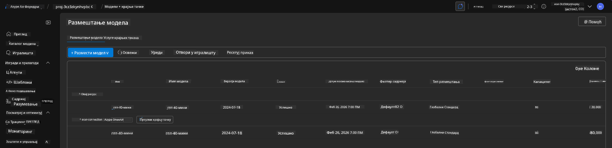
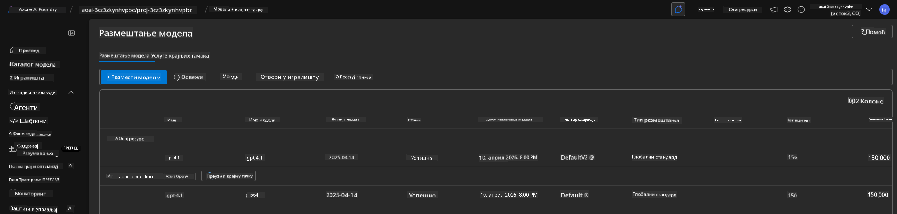

<!--
CO_OP_TRANSLATOR_METADATA:
{
  "original_hash": "6539a34c770f3ceff282370d72ee74dc",
  "translation_date": "2025-09-25T02:17:38+00:00",
  "source_file": "workshop/docs/instructions/6-Teardown-Infrastructure.md",
  "language_code": "sr"
}
-->
# 6. Уклањање инфраструктуре

!!! tip "НА КРАЈУ ОВОГ МОДУЛА БИЋЕТЕ У МОГУЋНОСТИ"

    - [ ] Ставка
    - [ ] Ставка
    - [ ] Ставка

---

## Додатне вежбе

Пре него што уклонимо пројекат, одвојите неколико минута за отворено истраживање.

!!! danger "NITYA-TODO: Осмислити неке предлоге за истраживање"

---

## Депровизионисање инфраструктуре

1. Уклањање инфраструктуре је једноставно као:
      
      ```bash title="" linenums="0"
      azd down --purge
      ```

1. Опција `--purge` осигурава да се такође уклоне ресурси когнитивних услуга који су меко обрисани, чиме се ослобађа квота коју су ти ресурси заузимали. Када се процес заврши, видећете нешто овако:
      
      ```bash title="" linenums="0"
      ? Total resources to delete: 11, are you sure you want to continue? Yes
      Deleting your resources can take some time.
      (✓) Done: Deleted resource group rg-nitya-mshack-azd
      (✓) Done: Purging Cognitive Account: aoai-3cz3zkynhvpbc

      SUCCESS: Your application was removed from Azure in 11 minutes 4 seconds.
      ```

1. (Опционо) Ако сада поново покренете `azd up`, приметићете да се модел gpt-4.1 поново поставља јер је променљива окружења промењена (и сачувана) у локалном `.azure` фолдеру.

      Ево како изгледају постављени модели **пре**:

      

      А овако изгледају **после**:
      

---

