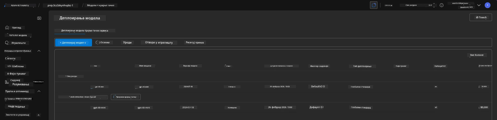
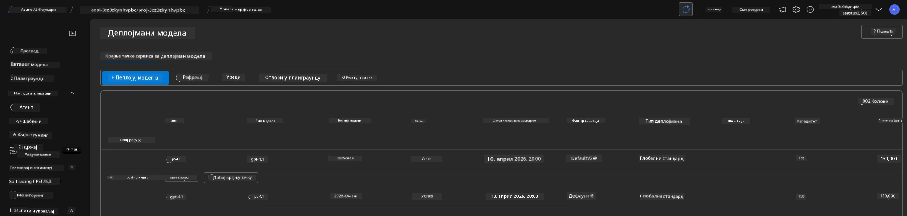

# 6. Уклањање инфраструктуре

!!! tip "НА КРАЈУ ОВОГ МОДУЛА МОЋИ ЋЕТЕ БИТИ"

    - [ ] Разумети значај чишћења ресурса и управљања трошковима
    - [ ] Користити `azd down` за безбедно уклањање инфраструктуре
    - [ ] Опоравити soft-deleted Cognitive Services ако је потребно
    - [ ] **Lab 6:** Очистити Azure ресурсе и проверити уклањање

---

## Бонус вежбе

Пре него што уклонимо пројекат, одвојите неколико минута за отворено истраживање.

!!! info "Искористите ове предлоге за истраживање"

    **Експериментишите са GitHub Copilot:**
    
    1. Питајте: `Које друге AZD шаблоне бих могао да испробам за сценарије са више агената?`
    2. Питајте: `Како могу да прилагодим упутства агента за случај употребе у здравству?`
    3. Питајте: `Које променљиве окружења контролишу оптимизацију трошкова?`
    
    **Истражите Azure портал:**
    
    1. Прегледајте Application Insights метрике за ваше размећтање
    2. Проверите анализу трошкова за ресурсе које сте обезбедили
    3. Још једном истражите agent playground на порталу Microsoft Foundry

---

## Деинсталирање инфраструктуре

1. Уклањање инфраструктуре је једноставно као:
      
      ```bash title="" linenums="0"
      azd down --purge
      ```
1. Опција `--purge` обезбеђује да се такође обришу soft-deleted Cognitive Service ресурси, чиме се ослобађа квота коју ти ресурси држе. Када се заврши видећете нешто овако:
      
      ```bash title="" linenums="0"
      ? Total resources to delete: 11, are you sure you want to continue? Yes
      Deleting your resources can take some time.
      (✓) Done: Deleted resource group rg-nitya-mshack-azd
      (✓) Done: Purging Cognitive Account: aoai-3cz3zkynhvpbc

      SUCCESS: Your application was removed from Azure in 11 minutes 4 seconds.
      ```

1. (Опционално) Ако сада поново покренете `azd up`, приметићете да ће модел gpt-4.1 бити деплојован пошто је променљива окружења промењена (и сачувана) у локалној фасцикли `.azure`. 

      Ево распоређивања модела **пре**:

      

      А овде је **после**:
      

---

<!-- CO-OP TRANSLATOR DISCLAIMER START -->
**Изјава о одрицању одговорности**:
Овај документ је преведен помоћу услуге за превођење засноване на вештачкој интелигенцији [Co-op Translator](https://github.com/Azure/co-op-translator). Иако настојимо да будемо тачни, имајте у виду да аутоматски преводи могу садржати грешке или нетачности. Оригинални документ на његовом изворном језику треба сматрати ауторитетом. За критичне информације препоручује се професионални људски превод. Не сносимо одговорност за било каква недоразумевања или погрешна тумачења која произилазе из употребе овог превода.
<!-- CO-OP TRANSLATOR DISCLAIMER END -->