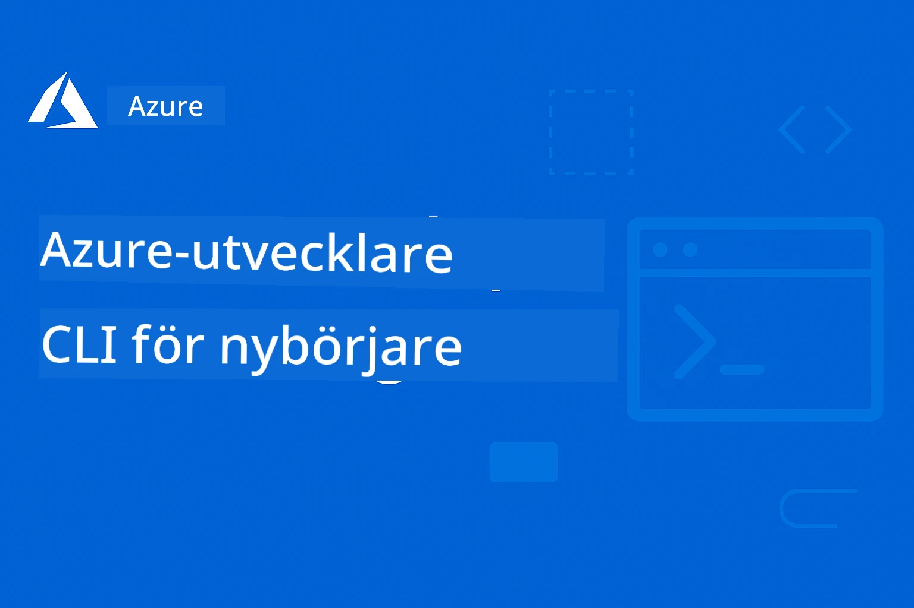

<!--
CO_OP_TRANSLATOR_METADATA:
{
  "original_hash": "068c87cc2641a81ca353ad7064ff326a",
  "translation_date": "2026-01-01T16:08:25+00:00",
  "source_file": "README.md",
  "language_code": "sv"
}
-->
# AZD för nybörjare: En strukturerad läranderesa

 

[](https://GitHub.com/microsoft/azd-for-beginners/watchers/)
[](https://GitHub.com/microsoft/azd-for-beginners/network/)
[](https://GitHub.com/microsoft/azd-for-beginners/stargazers/)

[](https://discord.gg/microsoft-azure)
[](https://discord.gg/nTYy5BXMWG)

## Komma igång med den här kursen

Följ dessa steg för att börja din AZD-läranderesa:

1. **Forka Repositoryt**: Klicka [](https://GitHub.com/microsoft/azd-for-beginners/fork)
2. **Klonаa Repositoryt**: `git clone https://github.com/microsoft/azd-for-beginners.git`
3. **Gå med i gemenskapen**: [Azure Discord Communities](https://discord.com/invite/ByRwuEEgH4) för experthjälp
4. **Välj din inlärningsväg**: Välj ett kapitel nedan som matchar din erfarenhetsnivå

### Stöd för flera språk

#### Automatiska översättningar (Alltid uppdaterade)

<!-- CO-OP TRANSLATOR LANGUAGES TABLE START -->
[Arabic](../ar/README.md) | [Bengali](../bn/README.md) | [Bulgarian](../bg/README.md) | [Burmese (Myanmar)](../my/README.md) | [Chinese (Simplified)](../zh/README.md) | [Chinese (Traditional, Hong Kong)](../hk/README.md) | [Chinese (Traditional, Macau)](../mo/README.md) | [Chinese (Traditional, Taiwan)](../tw/README.md) | [Croatian](../hr/README.md) | [Czech](../cs/README.md) | [Danish](../da/README.md) | [Dutch](../nl/README.md) | [Estonian](../et/README.md) | [Finnish](../fi/README.md) | [French](../fr/README.md) | [German](../de/README.md) | [Greek](../el/README.md) | [Hebrew](../he/README.md) | [Hindi](../hi/README.md) | [Hungarian](../hu/README.md) | [Indonesian](../id/README.md) | [Italian](../it/README.md) | [Japanese](../ja/README.md) | [Kannada](../kn/README.md) | [Korean](../ko/README.md) | [Lithuanian](../lt/README.md) | [Malay](../ms/README.md) | [Malayalam](../ml/README.md) | [Marathi](../mr/README.md) | [Nepali](../ne/README.md) | [Nigerian Pidgin](../pcm/README.md) | [Norwegian](../no/README.md) | [Persian (Farsi)](../fa/README.md) | [Polish](../pl/README.md) | [Portuguese (Brazil)](../br/README.md) | [Portuguese (Portugal)](../pt/README.md) | [Punjabi (Gurmukhi)](../pa/README.md) | [Romanian](../ro/README.md) | [Russian](../ru/README.md) | [Serbian (Cyrillic)](../sr/README.md) | [Slovak](../sk/README.md) | [Slovenian](../sl/README.md) | [Spanish](../es/README.md) | [Swahili](../sw/README.md) | [Swedish](./README.md) | [Tagalog (Filipino)](../tl/README.md) | [Tamil](../ta/README.md) | [Telugu](../te/README.md) | [Thai](../th/README.md) | [Turkish](../tr/README.md) | [Ukrainian](../uk/README.md) | [Urdu](../ur/README.md) | [Vietnamese](../vi/README.md)
<!-- CO-OP TRANSLATOR LANGUAGES TABLE END -->

## Kursöversikt

Bemästra Azure Developer CLI (azd) genom strukturerade kapitel utformade för progressivt lärande. **Särskilt fokus på distribution av AI-applikationer med Microsoft Foundry-integration.**

### Varför denna kurs är viktig för moderna utvecklare

Baserat på insikter från Microsoft Foundry Discord-gemenskapen vill **45% av utvecklarna använda AZD för AI-arbetslaster** men stöter på utmaningar med:
- Komplexa AI-arkitekturer med flera tjänster
- Bästa praxis för AI-distribution i produktion  
- Azure AI-tjänsteintegration och konfiguration
- Kostnadsoptimering för AI-arbetslaster
- Felsökning av AI-specifika distributionsproblem

### Lärandemål

Genom att slutföra denna strukturerade kurs kommer du att:
- **Bemästra AZD-grunderna**: Kärnkoncept, installation och konfiguration
- **Distribuera AI-applikationer**: Använd AZD med Microsoft Foundry-tjänster
- **Implementera Infrastruktur som kod**: Hantera Azure-resurser med Bicep-mallar
- **Felsöka distributioner**: Åtgärda vanliga problem och debugga fel
- **Optimera för produktion**: Säkerhet, skalning, övervakning och kostnadshantering
- **Bygga multi-agentlösningar**: Distribuera komplexa AI-arkitekturer

## 📚 Lärkapitel

*Välj din inlärningsväg baserat på erfarenhetsnivå och mål*

### 🚀 Kapitel 1: Grund & Kom igång
**Förkunskaper**: Azure-prenumeration, grundläggande kunskaper i kommandoraden  
**Tidsåtgång**: 30–45 minuter  
**Komplexitet**: ⭐

#### Vad du kommer att lära dig
- Förstå grundläggande koncept i Azure Developer CLI
- Installera AZD på din plattform
- Din första framgångsrika distribution

#### Lärresurser
- **🎯 Börja här**: [Vad är Azure Developer CLI?](../..)
- **📖 Teori**: [AZD Basics](docs/getting-started/azd-basics.md) - Kärnkoncept och terminologi
- **⚙️ Installation & uppsättning**: [Installation & Setup](docs/getting-started/installation.md) - Plattformspecifika guider
- **🛠️ Praktiskt**: [Ditt första projekt](docs/getting-started/first-project.md) - Steg-för-steg handledning
- **📋 Snabbreferens**: [Command Cheat Sheet](resources/cheat-sheet.md)

#### Praktiska övningar
```bash
# Snabb installationskontroll
azd version

# Distribuera din första applikation
azd init --template todo-nodejs-mongo
azd up
```

**💡 Kapitelresultat**: Distribuera framgångsrikt en enkel webbapplikation till Azure med AZD

**✅ Validering av framgång:**
```bash
# Efter att ha slutfört kapitel 1 ska du kunna:
azd version              # Visar installerad version
azd init --template todo-nodejs-mongo  # Initierar projekt
azd up                  # Distribuerar till Azure
azd show                # Visar URL för den körande appen
# Applikationen öppnas i webbläsaren och fungerar
azd down --force --purge  # Rensar upp resurser
```

**📊 Tidsåtgång:** 30–45 minuter  
**📈 Kompetensnivå efteråt:** Kan självständigt distribuera grundläggande applikationer

**✅ Validering av framgång:**
```bash
# Efter att ha slutfört kapitel 1 ska du kunna:
azd version              # Visar installerad version
azd init --template todo-nodejs-mongo  # Initierar projekt
azd up                  # Distribuerar till Azure
azd show                # Visar URL för den körande appen
# Applikationen öppnas i webbläsaren och fungerar
azd down --force --purge  # Rensar upp resurser
```

**📊 Tidsåtgång:** 30–45 minuter  
**📈 Kompetensnivå efteråt:** Kan självständigt distribuera grundläggande applikationer

---

### 🤖 Kapitel 2: AI-först utveckling (Rekommenderas för AI-utvecklare)
**Förkunskaper**: Kapitel 1 avklarat  
**Tidsåtgång**: 1–2 timmar  
**Komplexitet**: ⭐⭐

#### Vad du kommer att lära dig
- Microsoft Foundry-integration med AZD
- Distribuera AI-drivna applikationer
- Förstå AI-tjänsters konfigurationer

#### Lärresurser
- **🎯 Börja här**: [Microsoft Foundry Integration](docs/microsoft-foundry/microsoft-foundry-integration.md)
- **📖 Mönster**: [AI Model Deployment](docs/microsoft-foundry/ai-model-deployment.md) - Distribuera och hantera AI-modeller
- **🛠️ Workshop**: [AI Workshop Lab](docs/microsoft-foundry/ai-workshop-lab.md) - Gör dina AI-lösningar redo för AZD
- **🎥 Interaktiv guide**: [Workshop Materials](workshop/README.md) - Webbläsarbaserat lärande med MkDocs * DevContainer-miljö
- **📋 Mallar**: [Microsoft Foundry-mallar](../..)
- **📝 Exempel**: [AZD Deployment Examples](examples/README.md)

#### Praktiska övningar
```bash
# Distribuera din första AI-applikation
azd init --template azure-search-openai-demo
azd up

# Prova ytterligare AI-mallar
azd init --template openai-chat-app-quickstart
azd init --template agent-openai-python-prompty
```

**💡 Kapitelresultat**: Distribuera och konfigurera en AI-driven chattapplikation med RAG-funktioner

**✅ Validering av framgång:**
```bash
# Efter kapitel 2 ska du kunna:
azd init --template azure-search-openai-demo
azd up
# Testa AI-chattgränssnittet
# Ställa frågor och få AI-drivna svar med källor
# Verifiera att sökintegrationen fungerar
azd monitor  # Kontrollera att Application Insights visar telemetri
azd down --force --purge
```

**📊 Tidsåtgång:** 1–2 timmar  
**📈 Kompetensnivå efteråt:** Kan distribuera och konfigurera produktionsklara AI-applikationer  
**💰 Kostnadsmedvetenhet:** Förstå $80-150/month utvecklingskostnader, $300-3500/month produktionskostnader

#### 💰 Kostnadsaspekter för AI-distributioner

**Utvecklingsmiljö (Beräknat $80-150/månad):**
- Azure OpenAI (Pay-as-you-go): $0–50/månad (baserat på tokenanvändning)
- AI Search (Basic-nivå): $75/månad
- Container Apps (Consumption): $0–20/månad
- Lagring (Standard): $1–5/månad

**Produktionsmiljö (Beräknat $300-3,500+/månad):**
- Azure OpenAI (PTU för konsekvent prestanda): $3,000+/månad ELLER Pay-as-go vid hög volym
- AI Search (Standard-nivå): $250/månad
- Container Apps (Dedicated): $50–100/månad
- Application Insights: $5–50/månad
- Lagring (Premium): $10–50/månad

**💡 Tips för kostnadsoptimering:**
- Använd Azure OpenAI:s **Gratisnivå** för att lära dig (50,000 tokens/månad ingår)
- Kör `azd down` för att avallokera resurser när du inte aktivt utvecklar
- Börja med förbrukningsbaserad fakturering, uppgradera till PTU endast för produktion
- Använd `azd provision --preview` för att uppskatta kostnader före distribution
- Aktivera autoskalning: betala endast för faktisk användning

**Kostnadsövervakning:**
```bash
# Kontrollera uppskattade månatliga kostnader
azd provision --preview

# Övervaka faktiska kostnader i Azure-portalen
az consumption budget list --resource-group <your-rg>
```

---

### ⚙️ Kapitel 3: Konfiguration & autentisering
**Förkunskaper**: Kapitel 1 avklarat  
**Tidsåtgång**: 45–60 minuter  
**Komplexitet**: ⭐⭐

#### Vad du kommer att lära dig
- Miljökonfiguration och hantering
- Autentisering och säkerhetsbästa praxis
- Resursnamngivning och organisering

#### Lärresurser
- **📖 Konfiguration**: [Configuration Guide](docs/getting-started/configuration.md) - Miljöinställningar
- **🔐 Säkerhet**: [Authentication patterns and managed identity](docs/getting-started/authsecurity.md) - Autentiseringsmönster
- **📝 Exempel**: [Database App Example](examples/database-app/README.md) - AZD-databasexempel

#### Praktiska övningar
- Konfigurera flera miljöer (dev, staging, prod)
- Ställ in autentisering med managed identity
- Implementera miljöspecifika konfigurationer

**💡 Kapitelresultat**: Hantera flera miljöer med korrekt autentisering och säkerhet

---

### 🏗️ Kapitel 4: Infrastruktur som kod & distribution
**Förkunskaper**: Kapitel 1–3 genomförda  
**Tidsåtgång**: 1–1,5 timmar  
**Komplexitet**: ⭐⭐⭐

#### Vad du kommer att lära dig
- Avancerade distributionsmönster
- Infrastruktur som kod med Bicep
- Strategier för resursprovisionering

#### Lärresurser
- **📖 Distribution**: [Deployment Guide](docs/deployment/deployment-guide.md) - Kompletta arbetsflöden
- **🏗️ Provisionering**: [Provisioning Resources](docs/deployment/provisioning.md) - Azure-resurshantering
- **📝 Exempel**: [Container App Example](../../examples/container-app) - Containerbaserade distributioner

#### Praktiska övningar
- Skapa egna Bicep-mallar
- Distribuera multi-tjänsteapplikationer
- Implementera blue-green deployments

**💡 Kapitelresultat**: Distribuera komplexa multi-tjänsteapplikationer med egna infrastrukturmallar

---

### 🎯 Kapitel 5: Multi-agent AI-lösningar (Avancerat)
**Förkunskaper**: Kapitel 1–2 genomförda  
**Tidsåtgång**: 2–3 timmar  
**Komplexitet**: ⭐⭐⭐⭐

#### Vad du kommer att lära dig
- Arkitekturmönster för multi-agent
- Agentorkestrering och koordinering
- Produktionsklara AI-distributioner

#### Lärresurser
- **🤖 Framhävt projekt**: [Detaljhandels Multi-Agent-lösning](examples/retail-scenario.md) - Komplett implementation
- **🛠️ ARM Templates**: [ARM Template Package](../../examples/retail-multiagent-arm-template) - One-click deployment
- **📖 Architecture**: [Multi-agent coordination patterns](/docs/pre-deployment/coordination-patterns.md) - Patterns

#### Practical Exercises
```bash
# Distribuera den kompletta detaljhandelslösningen med flera agenter
cd examples/retail-multiagent-arm-template
./deploy.sh

# Utforska agentkonfigurationer
az deployment group show --resource-group <rg-name> --name <deployment-name>
```

**💡 Chapter Outcome**: Deploy and manage a production-ready multi-agent AI solution with Customer and Inventory agents

---

### 🔍 Kapitel 6: Förvalidering och planering före distribution
**Förkunskaper**: Kapitel 4 slutfört  
**Varaktighet**: 1 timme  
**Komplexitet**: ⭐⭐

#### Vad du kommer att lära dig
- Kapacitetsplanering och resursvalidering
- Strategier för val av SKU
- Förkontroller och automation

#### Lärresurser
- **📊 Planering**: [Capacity Planning](docs/pre-deployment/capacity-planning.md) - Resursvalidering
- **💰 Val**: [SKU Selection](docs/pre-deployment/sku-selection.md) - Kostnadseffektiva val
- **✅ Validering**: [Pre-flight Checks](docs/pre-deployment/preflight-checks.md) - Automatiserade skript

#### Praktiska övningar
- Kör skript för kapacitetsvalidering
- Optimera SKU-val för kostnad
- Implementera automatiserade förkontroller

**💡 Kapitlets mål**: Validera och optimera distributioner före genomförande

---

### 🚨 Kapitel 7: Felsökning och debuggningsmetoder
**Förkunskaper**: Ett av distributionskapitlen slutfört  
**Varaktighet**: 1–1,5 timmar  
**Komplexitet**: ⭐⭐

#### Vad du kommer att lära dig
- Systematiska debuggningsmetoder
- Vanliga problem och lösningar
- AI-specifik felsökning

#### Lärresurser
- **🔧 Vanliga problem**: [Common Issues](docs/troubleshooting/common-issues.md) - FAQ och lösningar
- **🕵️ Debuggning**: [Debugging Guide](docs/troubleshooting/debugging.md) - Steg-för-steg-strategier
- **🤖 AI-problem**: [AI-Specific Troubleshooting](docs/troubleshooting/ai-troubleshooting.md) - Problem med AI-tjänster

#### Praktiska övningar
- Diagnostisera distributionsfel
- Åtgärda autentiseringsproblem
- Debugga anslutning till AI-tjänster

**💡 Kapitlets mål**: Självständigt diagnostisera och lösa vanliga distributionsproblem

---

### 🏢 Kapitel 8: Produktions- och företagsmönster
**Förkunskaper**: Kapitel 1–4 slutförda  
**Varaktighet**: 2–3 timmar  
**Komplexitet**: ⭐⭐⭐⭐

#### Vad du kommer att lära dig
- Strategier för produktionsdistribution
- Säkerhetsmönster för företag
- Övervakning och kostnadsoptimering

#### Lärresurser
- **🏭 Produktion**: [Production AI Best Practices](docs/microsoft-foundry/production-ai-practices.md) - Företagsmönster
- **📝 Exempel**: [Microservices Example](../../examples/microservices) - Komplexa arkitekturer
- **📊 Övervakning**: [Application Insights integration](docs/pre-deployment/application-insights.md) - Övervakning

#### Praktiska övningar
- Implementera säkerhetsmönster för företag
- Sätt upp omfattande övervakning
- Distribuera till produktion med rätt styrning

**💡 Kapitlets mål**: Distribuera företagsklara applikationer med full produktionfunktionalitet

---

## 🎓 Workshopöversikt: Praktisk inlärningsupplevelse

> **⚠️ WORKSHOP STATUS: Active Development**  
> Workshopmaterialet utvecklas och förfinas för närvarande. Kärnmodulerna fungerar, men några avancerade avsnitt är ofullständiga. Vi arbetar aktivt för att slutföra allt innehåll. [Följ framsteg →](workshop/README.md)

### Interaktiva workshopmaterial
**Omfattande praktisk inlärning med webbläsarbaserade verktyg och guidade övningar**

Våra workshopmaterial erbjuder en strukturerad, interaktiv inlärningsupplevelse som kompletterar kapitelsbaserade kursplanen ovan. Workshopen är utformad för både självstudier och instruktörsledda sessioner.

#### 🛠️ Workshopfunktioner
- **Webbläsargränssnitt**: Komplett MkDocs-driven workshop med sök, kopiera och tema-funktioner
- **Integration med GitHub Codespaces**: Enklicksinställning av utvecklingsmiljö
- **Strukturerad lärväg**: 7-stegs guidade övningar (totalt 3,5 timmar)
- **Upptäckt → Distribution → Anpassning**: Progressiv metodik
- **Interaktiv DevContainer-miljö**: Förkonfigurerade verktyg och beroenden

#### 📚 Workshopstruktur
Workshopen följer en **Upptäckt → Distribution → Anpassning** metodik:

1. **Upptäcktsfas** (45 min)
   - Utforska Microsoft Foundry-mallar och tjänster
   - Förstå mönster för multi-agent-arkitektur
   - Gå igenom distributionskrav och förkunskaper

2. **Distributionsfas** (2 timmar)
   - Praktisk distribution av AI-applikationer med AZD
   - Konfigurera Azure AI-tjänster och endpoints
   - Implementera säkerhets- och autentiseringsmönster

3. **Anpassningsfas** (45 min)
   - Modifiera applikationer för specifika användningsfall
   - Optimera för produktionsdistribution
   - Implementera övervakning och kostnadshantering

#### 🚀 Komma igång med workshopen
```bash
# Alternativ 1: GitHub Codespaces (rekommenderas)
# Klicka på "Code" → "Create codespace on main" i repositoryt

# Alternativ 2: Lokal utveckling
git clone https://github.com/microsoft/azd-for-beginners.git
cd azd-for-beginners/workshop
# Följ installationsinstruktionerna i workshop/README.md
```

#### 🎯 Workshoppens inlärningsmål
Genom att slutföra workshopen kommer deltagarna att:
- **Distribuera produktions-AI-applikationer**: Använd AZD med Microsoft Foundry-tjänster
- **Bemästra multi-agent-arkitekturer**: Implementera koordinerade AI-agentlösningar
- **Implementera säkerhetsbästa praxis**: Konfigurera autentisering och åtkomstkontroll
- **Optimera för skalning**: Designa kostnadseffektiva, presterande distributioner
- **Felsöka distributioner**: Åtgärda vanliga problem självständigt

#### 📖 Workshopresurser
- **🎥 Interaktiv guide**: [Workshop Materials](workshop/README.md) - Webbläsarbaserat inlärningsmiljö
- **📋 Steg-för-steg-instruktioner**: [Guided Exercises](../../workshop/docs/instructions) - Detaljerade genomgångar
- **🛠️ AI Workshop Lab**: [AI Workshop Lab](docs/microsoft-foundry/ai-workshop-lab.md) - AI-fokuserade övningar
- **💡 Snabbstart**: [Workshop Setup Guide](workshop/README.md#quick-start) - Miljökonfiguration

**Perfekt för**: Företagsutbildning, universitetskurser, självstudier och utvecklarbootcamps.

---

## 📖 Vad är Azure Developer CLI?

Azure Developer CLI (azd) är ett utvecklarcentrerat kommandoradsgränssnitt som accelererar processen att bygga och distribuera applikationer till Azure. Det erbjuder:

- **Mallbaserade distributioner** - Använd förbyggda mallar för vanliga applikationsmönster
- **Infrastructure as Code** - Hantera Azure-resurser med Bicep eller Terraform  
- **Integrerade arbetsflöden** - Provisonera, distribuera och övervaka applikationer sömlöst
- **Utvecklarvänligt** - Optimerat för utvecklarproduktivitet och användarupplevelse

### **AZD + Microsoft Foundry: Perfekt för AI-driftsättningar**

**Varför AZD för AI-lösningar?** AZD hanterar de största utmaningarna som AI-utvecklare möter:

- **AI-klara mallar** - Förkonfigurerade mallar för Azure OpenAI, Cognitive Services och ML-arbetsflöden
- **Säkra AI-distributioner** - Inbyggda säkerhetsmönster för AI-tjänster, API-nycklar och model endpoints  
- **Produktionsmönster för AI** - Bästa praxis för skalbara, kostnadseffektiva AI-applikationsdistributioner
- **End-to-End AI-arbetsflöden** - Från modelutveckling till produktionsdistribution med korrekt övervakning
- **Kostnadsoptimering** - Smart resursallokering och skalningsstrategier för AI-arbetsbelastningar
- **Integration med Microsoft Foundry** - Sömlig koppling till Microsoft Foundry modellkatalog och endpoints

---

## 🎯 Mall- och exempelbibliotek

### Utvalda: Microsoft Foundry-mallar
**Börja här om du distribuerar AI-applikationer!**

> **Notera:** Dessa mallar visar olika AI-mönster. Vissa är externa Azure Samples, andra är lokala implementationer.

| Mall | Kapitel | Komplexitet | Tjänster | Typ |
|----------|---------|------------|----------|------|
| [**Kom igång med AI-chatt**](https://github.com/Azure-Samples/get-started-with-ai-chat) | Kapitel 2 | ⭐⭐ | AzureOpenAI + Azure AI Model Inference API + Azure AI Search + Azure Container Apps + Application Insights | External |
| [**Kom igång med AI-agenter**](https://github.com/Azure-Samples/get-started-with-ai-agents) | Kapitel 2 | ⭐⭐ | Azure AI Agent Service + AzureOpenAI + Azure AI Search + Azure Container Apps + Application Insights| External |
| [**Azure Search + OpenAI Demo**](https://github.com/Azure-Samples/azure-search-openai-demo) | Kapitel 2 | ⭐⭐ | AzureOpenAI + Azure AI Search + App Service + Storage | External |
| [**OpenAI Chat App Quickstart**](https://github.com/Azure-Samples/openai-chat-app-quickstart) | Kapitel 2 | ⭐ | AzureOpenAI + Container Apps + Application Insights | External |
| [**Agent OpenAI Python Prompty**](https://github.com/Azure-Samples/agent-openai-python-prompty) | Kapitel 5 | ⭐⭐⭐ | AzureOpenAI + Azure Functions + Prompty | External |
| [**Contoso Chat RAG**](https://github.com/Azure-Samples/contoso-chat) | Kapitel 8 | ⭐⭐⭐⭐ | AzureOpenAI + AI Search + Cosmos DB + Container Apps | External |
| [**Retail Multi-Agent Solution**](examples/retail-scenario.md) | Kapitel 5 | ⭐⭐⭐⭐ | AzureOpenAI + AI Search + Storage + Container Apps + Cosmos DB | **Local** |

### Utvalda: Kompletta inlärningsscenarier
**Produktionsklara applikationsmallar kopplade till inlärningskapitel**

| Mall | Inlärningskapitel | Komplexitet | Nyckelkunskap |
|----------|------------------|------------|--------------|
| [**openai-chat-app-quickstart**](https://github.com/Azure-Samples/openai-chat-app-quickstart) | Kapitel 2 | ⭐ | Grundläggande AI-distributionsmönster |
| [**azure-search-openai-demo**](https://github.com/Azure-Samples/azure-search-openai-demo) | Kapitel 2 | ⭐⭐ | RAG-implementering med Azure AI Search |
| [**ai-document-processing**](https://github.com/Azure-Samples/ai-document-processing) | Kapitel 4 | ⭐⭐ | Integration av Document Intelligence |
| [**agent-openai-python-prompty**](https://github.com/Azure-Samples/agent-openai-python-prompty) | Kapitel 5 | ⭐⭐⭐ | Agentramverk och function calling |
| [**contoso-chat**](https://github.com/Azure-Samples/contoso-chat) | Kapitel 8 | ⭐⭐⭐ | Enterprise AI-orchestrering |
| [**retail-multi-agent-solution**](examples/retail-scenario.md) | Kapitel 5 | ⭐⭐⭐⭐ | Multi-agent-arkitektur med Customer och Inventory-agenter |

### Lärande efter exempeltyp

> **📌 Lokala vs. Externa exempel:**  
> **Lokala exempel** (i detta repo) = Klara att använda omedelbart  
> **Externa exempel** (Azure Samples) = Klona från länkade repos

#### Lokala exempel (Klara att använda)
- [**Retail Multi-Agent Solution**](examples/retail-scenario.md) - Komplett produktionsklar implementation med ARM-templates
  - Multi-agent-arkitektur (Customer + Inventory-agenter)
  - Omfattande övervakning och utvärdering
  - Enklicksdistribution via ARM-template

#### Lokala exempel - Containerapplikationer (Kapitel 2-5)
**Omfattande exempel på containerdistribueringar i detta repo:**
- [**Container App Examples**](examples/container-app/README.md) - Komplett guide till containeriserade distributioner
  - [Simple Flask API](../../examples/container-app/simple-flask-api) - Enkel REST-API med scale-to-zero
  - [Microservices Architecture](../../examples/container-app/microservices) - Produktionsklar multi-service-distribution
  - Snabbstart, produktion och avancerade distributionsmönster
  - Övervakning, säkerhet och kostnadsoptimeringsråd

#### Externa exempel - Enkla applikationer (Kapitel 1-2)
**Klona dessa Azure Samples-repos för att komma igång:**
- [Simple Web App - Node.js + MongoDB](https://github.com/Azure-Samples/todo-nodejs-mongo) - Grundläggande distributionsmönster
- [Static Website - React SPA](https://github.com/Azure-Samples/todo-csharp-sql-swa-func) - Distribution av statiskt innehåll
- [Container App - Python Flask](https://github.com/Azure-Samples/container-apps-store-api-microservice) - REST-API-distribution

#### Externa exempel - Databasintegration (Kapitel 3-4)  
- [Database App - C# + SQL](https://github.com/Azure-Samples/todo-csharp-sql) - Mönster för databasanslutning
- [Functions + Cosmos DB](https://github.com/Azure-Samples/todo-python-mongo-swa-func) - Serverless dataarbetsflöde

#### Externa exempel - Avancerade mönster (Kapitel 4-8)
- [Java Microservices](https://github.com/Azure-Samples/java-microservices-aca-lab) - Multi-service-arkitekturer
- [Container Apps Jobs](https://github.com/Azure-Samples/container-apps-jobs) - Bakgrundsprocessering  
- [Enterprise ML Pipeline](https://github.com/Azure-Samples/mlops-v2) - Produktionsklara ML-mönster

### Externa mallkollektioner
- [**Official AZD Template Gallery**](https://azure.github.io/awesome-azd/) - Kuraterad samling av officiella och community-mallar
- [**Azure Developer CLI Templates**](https://learn.microsoft.com/en-us/azure/developer/azure-developer-cli/azd-templates) - Microsoft Learn mall-dokumentation
- [**Examples Directory**](examples/README.md) - Lokala inlärningsexempel med detaljerade förklaringar

---

## 📚 Inlärningsresurser & Referenser

### Snabbreferenser
- [**Command Cheat Sheet**](resources/cheat-sheet.md) - Viktiga azd-kommandon organiserade efter kapitel
- [**Glossary**](resources/glossary.md) - Azure- och azd-terminologi  
- [**FAQ**](resources/faq.md) - Vanliga frågor organiserade efter lärandekapitel
- [**Study Guide**](resources/study-guide.md) - Omfattande övningar

### Praktiska workshops
- [**AI Workshop Lab**](docs/microsoft-foundry/ai-workshop-lab.md) - Gör dina AI-lösningar AZD-distribuerbara (2-3 timmar)
- [**Interactive Workshop Guide**](workshop/README.md) - Webbläsarbaserad workshop med MkDocs och DevContainer-miljö
- [**Structured Learning Path**](../../workshop/docs/instructions) -7-stegs vägledda övningar (Upptäckt → Distribution → Anpassning)
- [**AZD For Beginners Workshop**](workshop/README.md) - Komplett praktiskt workshopmaterial med GitHub Codespaces-integration

### Externa lärresurser
- [Azure Developer CLI Documentation](https://learn.microsoft.com/en-us/azure/developer/azure-developer-cli/)
- [Azure Arkitekturcenter](https://learn.microsoft.com/en-us/azure/architecture/)
- [Azure Pricing Calculator](https://azure.microsoft.com/pricing/calculator/)
- [Azure Status](https://status.azure.com/)

---

## 🔧 Snabb felsökningsguide

**Vanliga problem som nybörjare stöter på och snabba lösningar:**

### ❌ "azd: command not found"

```bash
# Installera AZD först
# Windows (PowerShell):
winget install microsoft.azd

# macOS:
brew tap azure/azd && brew install azd

# Linux:
curl -fsSL https://aka.ms/install-azd.sh | bash

# Verifiera installationen
azd version
```

### ❌ "No subscription found" or "Subscription not set"

```bash
# Lista tillgängliga prenumerationer
az account list --output table

# Ställ in standardprenumeration
az account set --subscription "<subscription-id-or-name>"

# Ställ in för AZD-miljö
azd env set AZURE_SUBSCRIPTION_ID "<subscription-id>"

# Verifiera
az account show
```

### ❌ "InsufficientQuota" or "Quota exceeded"

```bash
# Prova en annan Azure-region
azd env set AZURE_LOCATION "westus2"
azd up

# Eller använd mindre SKU:er i utvecklingsmiljön
# Redigera infra/main.parameters.json:
{
  "sku": "B1"  // Instead of "P1V2"
}
```

### ❌ "azd up" fails halfway through

```bash
# Alternativ 1: Rensa och försök igen
azd down --force --purge
azd up

# Alternativ 2: Bara fixa infrastrukturen
azd provision

# Alternativ 3: Kontrollera detaljerade loggar
azd show
azd logs
```

### ❌ "Authentication failed" or "Token expired"

```bash
# Autentisera på nytt
az logout
az login

azd auth logout
azd auth login

# Verifiera autentisering
az account show
```

### ❌ "Resource already exists" or naming conflicts

```bash
# AZD genererar unika namn, men vid konflikt:
azd down --force --purge

# Försök sedan igen med en ny miljö
azd env new dev-v2
azd up
```

### ❌ Template deployment taking too long

**Normala väntetider:**
- Enkel webbapp: 5–10 minuter
- App med databas: 10–15 minuter
- AI-applikationer: 15–25 minuter (OpenAI-provisionering är långsam)

```bash
# Kontrollera framsteg
azd show

# Om du sitter fast i mer än 30 minuter, kontrollera Azure-portalen:
azd monitor
# Sök efter misslyckade distributioner
```

### ❌ "Permission denied" or "Forbidden"

```bash
# Kontrollera din roll i Azure
az role assignment list --assignee $(az account show --query user.name -o tsv)

# Du behöver minst rollen "Contributor"
# Be din Azure-administratör att bevilja:
# - Contributor (för resurser)
# - User Access Administrator (för rolltilldelningar)
```

### ❌ Can't find deployed application URL

```bash
# Visa alla tjänstendpunkter
azd show

# Eller öppna Azure-portalen
azd monitor

# Kontrollera en specifik tjänst
azd env get-values
# Sök efter *_URL-variabler
```

### 📚 Fulla felsökningsresurser

- **Vanliga problem-guide:** [Detaljerade lösningar](docs/troubleshooting/common-issues.md)
- **AI-specifika problem:** [AI-felsökning](docs/troubleshooting/ai-troubleshooting.md)
- **Felsökningsguide:** [Steg-för-steg felsökning](docs/troubleshooting/debugging.md)
- **Få hjälp:** [Azure Discord](https://discord.gg/microsoft-azure) #azure-developer-cli

---

## 🔧 Snabb felsökningsguide

**Vanliga problem som nybörjare stöter på och snabba lösningar:**

<details>
<summary><strong>❌ "azd: command not found"</strong></summary>

```bash
# Installera AZD först
# Windows (PowerShell):
winget install microsoft.azd

# macOS:
brew tap azure/azd && brew install azd

# Linux:
curl -fsSL https://aka.ms/install-azd.sh | bash

# Verifiera installationen
azd version
```
</details>

<details>
<summary><strong>❌ "No subscription found" or "Subscription not set"</strong></summary>

```bash
# Lista tillgängliga prenumerationer
az account list --output table

# Ange standardprenumeration
az account set --subscription "<subscription-id-or-name>"

# Ställ in för AZD-miljö
azd env set AZURE_SUBSCRIPTION_ID "<subscription-id>"

# Verifiera
az account show
```
</details>

<details>
<summary><strong>❌ "InsufficientQuota" or "Quota exceeded"</strong></summary>

```bash
# Försök med en annan Azure-region
azd env set AZURE_LOCATION "westus2"
azd up

# Eller använd mindre SKU:er i utveckling
# Redigera infra/main.parameters.json:
{
  "sku": "B1"  // Instead of "P1V2"
}
```
</details>

<details>
<summary><strong>❌ "azd up" fails halfway through</strong></summary>

```bash
# Alternativ 1: Rensa och försök igen
azd down --force --purge
azd up

# Alternativ 2: Åtgärda bara infrastrukturen
azd provision

# Alternativ 3: Kontrollera detaljerade loggar
azd show
azd logs
```
</details>

<details>
<summary><strong>❌ "Authentication failed" or "Token expired"</strong></summary>

```bash
# Autentisera igen
az logout
az login

azd auth logout
azd auth login

# Verifiera autentiseringen
az account show
```
</details>

<details>
<summary><strong>❌ "Resource already exists" or naming conflicts</strong></summary>

```bash
# AZD genererar unika namn, men om det uppstår en konflikt:
azd down --force --purge

# Försök då igen med en ny miljö
azd env new dev-v2
azd up
```
</details>

<details>
<summary><strong>❌ Template deployment taking too long</strong></summary>

**Normala väntetider:**
- Enkel webbapp: 5–10 minuter
- App med databas: 10–15 minuter
- AI-applikationer: 15–25 minuter (OpenAI-provisionering är långsam)

```bash
# Kontrollera framsteg
azd show

# Om du sitter fast mer än 30 minuter, kontrollera Azure-portalen:
azd monitor
# Sök efter misslyckade distributioner
```
</details>

<details>
<summary><strong>❌ "Permission denied" or "Forbidden"</strong></summary>

```bash
# Kontrollera din Azure-roll
az role assignment list --assignee $(az account show --query user.name -o tsv)

# Du behöver minst rollen "Contributor"
# Be din Azure-administratör att bevilja:
# - Contributor (för resurser)
# - User Access Administrator (för rolltilldelningar)
```
</details>

<details>
<summary><strong>❌ Can't find deployed application URL</strong></summary>

```bash
# Visa alla serviceendpunkter
azd show

# Eller öppna Azure-portalen
azd monitor

# Kontrollera en specifik tjänst
azd env get-values
# Sök efter *_URL-variabler
```
</details>

### 📚 Fulla felsökningsresurser

- **Vanliga problem-guide:** [Detaljerade lösningar](docs/troubleshooting/common-issues.md)
- **AI-specifika problem:** [AI-felsökning](docs/troubleshooting/ai-troubleshooting.md)
- **Felsökningsguide:** [Steg-för-steg felsökning](docs/troubleshooting/debugging.md)
- **Få hjälp:** [Azure Discord](https://discord.gg/microsoft-azure) #azure-developer-cli

---

## 🎓 Kursavslutning och certifiering

### Framstegsspårning
Spåra dina framsteg genom varje kapitel:

- [ ] **Kapitel 1**: Grund & Kom igång ✅
- [ ] **Kapitel 2**: AI-först utveckling ✅  
- [ ] **Kapitel 3**: Konfiguration & Autentisering ✅
- [ ] **Kapitel 4**: Infrastruktur som kod & Distribution ✅
- [ ] **Kapitel 5**: Multi-agent AI-lösningar ✅
- [ ] **Kapitel 6**: Förvalidering & Planering före distribution ✅
- [ ] **Kapitel 7**: Felsökning & Debugging ✅
- [ ] **Kapitel 8**: Produktions- & företagsmönster ✅

### Verifiering av lärande
Efter att ha slutfört varje kapitel, verifiera din kunskap genom att:
1. **Praktisk övning**: Slutför kapitlets praktiska distribution
2. **Kunskapskontroll**: Gå igenom FAQ-avsnittet för ditt kapitel
3. **Gemenskapsdiskussion**: Dela din erfarenhet i Azure Discord
4. **Nästa kapitel**: Gå vidare till nästa komplexitetsnivå

### Fördelar vid kursavslutning
När du har slutfört alla kapitel kommer du att ha:
- **Produktionsvana**: Distribuerat riktiga AI-applikationer till Azure
- **Professionella färdigheter**: Företagsredo distributionskompetens  
- **Gemenskapsigenkänning**: Aktiv medlem i Azure-utvecklargemenskapen
- **Karriärutveckling**: Eftertraktad AZD- och AI-distributionskompetens

---

## 🤝 Gemenskap & support

### Få hjälp & support
- **Tekniska problem**: [Rapportera buggar och begär funktioner](https://github.com/microsoft/azd-for-beginners/issues)
- **Lärandefrågor**: [Microsoft Azure Discord Community](https://discord.gg/microsoft-azure) and [](https://discord.gg/nTYy5BXMWG)
- **AI-specifik hjälp**: Gå med i [](https://discord.gg/nTYy5BXMWG)
- **Dokumentation**: [Officiell Azure Developer CLI-dokumentation](https://learn.microsoft.com/en-us/azure/developer/azure-developer-cli/)

### Insikter från Microsoft Foundry Discord

**Senaste omröstningsresultat från #Azure-kanalen:**
- **45%** av utvecklare vill använda AZD för AI-arbetsbelastningar
- **Största utmaningarna**: Distribution av flera tjänster, hantering av behörigheter, produktionsberedskap  
- **Mest efterfrågade**: AI-specifika mallar, felsökningsguider, bästa praxis

**Gå med i vår community för att:**
- Dela dina AZD + AI-upplevelser och få hjälp
- Få tillgång till tidiga förhandsvisningar av nya AI-mallar
- Bidra till bästa praxis för AI-distribution
- Påverka framtida AI + AZD-funktionsutveckling

### Bidra till kursen
Vi välkomnar bidrag! Läs vår [Contributing Guide](CONTRIBUTING.md) för detaljer om:
- **Förbättringar av innehåll**: Förbättra befintliga kapitel och exempel
- **Nya exempel**: Lägg till verkliga scenarier och mallar  
- **Översättning**: Hjälp till att underhålla flerspråkigt stöd
- **Bugg-rapporter**: Förbättra noggrannhet och tydlighet
- **Gemenskapsstandarder**: Följ våra inkluderande riktlinjer

---

## 📄 Kursinformation

### Licens
Detta projekt är licensierat under MIT-licensen - se filen [LICENSE](../../LICENSE) för detaljer.

### Relaterade Microsoft-inlärningsresurser

Vårt team producerar andra omfattande lärkurser:

<!-- CO-OP TRANSLATOR OTHER COURSES START -->
### LangChain
[](https://aka.ms/langchain4j-for-beginners)
[](https://aka.ms/langchainjs-for-beginners?WT.mc_id=m365-94501-dwahlin)

---

### Azure / Edge / MCP / Agenter
[](https://github.com/microsoft/AZD-for-beginners?WT.mc_id=academic-105485-koreyst)
[](https://github.com/microsoft/edgeai-for-beginners?WT.mc_id=academic-105485-koreyst)
[](https://github.com/microsoft/mcp-for-beginners?WT.mc_id=academic-105485-koreyst)
[](https://github.com/microsoft/ai-agents-for-beginners?WT.mc_id=academic-105485-koreyst)

---
 
### Generativ AI-serie
[](https://github.com/microsoft/generative-ai-for-beginners?WT.mc_id=academic-105485-koreyst)
[-9333EA?style=for-the-badge&labelColor=E5E7EB&color=9333EA)](https://github.com/microsoft/Generative-AI-for-beginners-dotnet?WT.mc_id=academic-105485-koreyst)
[-C084FC?style=for-the-badge&labelColor=E5E7EB&color=C084FC)](https://github.com/microsoft/generative-ai-for-beginners-java?WT.mc_id=academic-105485-koreyst)
[-E879F9?style=for-the-badge&labelColor=E5E7EB&color=E879F9)](https://github.com/microsoft/generative-ai-with-javascript?WT.mc_id=academic-105485-koreyst)

---
 
### Kärnkurser
[](https://aka.ms/ml-beginners?WT.mc_id=academic-105485-koreyst)
[](https://aka.ms/datascience-beginners?WT.mc_id=academic-105485-koreyst)
[](https://aka.ms/ai-beginners?WT.mc_id=academic-105485-koreyst)
[](https://github.com/microsoft/Security-101?WT.mc_id=academic-96948-sayoung)
[](https://aka.ms/webdev-beginners?WT.mc_id=academic-105485-koreyst)
[](https://aka.ms/iot-beginners?WT.mc_id=academic-105485-koreyst)
[](https://github.com/microsoft/xr-development-for-beginners?WT.mc_id=academic-105485-koreyst)

---
 
### Copilot-serien
[](https://aka.ms/GitHubCopilotAI?WT.mc_id=academic-105485-koreyst)
[](https://github.com/microsoft/mastering-github-copilot-for-dotnet-csharp-developers?WT.mc_id=academic-105485-koreyst)
[](https://github.com/microsoft/CopilotAdventures?WT.mc_id=academic-105485-koreyst)
<!-- CO-OP TRANSLATOR OTHER COURSES END -->

---

## 🗺️ Kursnavigering

**🚀 Redo att börja lära dig?**

**Nybörjare**: Starta med [Kapitel 1: Grundläggande & Snabbstart](../..)  
**AI-utvecklare**: Hoppa till [Kapitel 2: AI-först-utveckling](../..)  
**Erfarna utvecklare**: Börja med [Kapitel 3: Konfiguration & Autentisering](../..)

**Nästa steg**: [Börja Kapitel 1 - AZD-grunderna](docs/getting-started/azd-basics.md) →

---

<!-- CO-OP TRANSLATOR DISCLAIMER START -->
Ansvarsfriskrivning:
Detta dokument har översatts med hjälp av AI-översättningstjänsten [Co-op Translator](https://github.com/Azure/co-op-translator). Vi strävar efter noggrannhet, men var medveten om att automatiska översättningar kan innehålla fel eller brister. Den ursprungliga versionen av dokumentet på dess ursprungsspråk ska betraktas som den auktoritativa källan. För kritisk information rekommenderas professionell mänsklig översättning. Vi ansvarar inte för några missförstånd eller feltolkningar som uppstår till följd av användningen av denna översättning.
<!-- CO-OP TRANSLATOR DISCLAIMER END -->