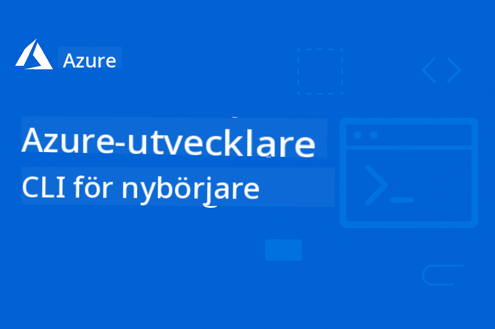

<!--
CO_OP_TRANSLATOR_METADATA:
{
  "original_hash": "05c30c9e5ed7951c72855108c6788034",
  "translation_date": "2025-12-25T04:31:05+00:00",
  "source_file": "README.md",
  "language_code": "sv"
}
-->
# AZD för nybörjare: En strukturerad inlärningsresa

 

[](https://GitHub.com/microsoft/azd-for-beginners/watchers/)
[](https://GitHub.com/microsoft/azd-for-beginners/network/)
[](https://GitHub.com/microsoft/azd-for-beginners/stargazers/)

[](https://discord.gg/microsoft-azure)
[](https://discord.gg/nTYy5BXMWG)

## Kom igång med den här kursen

Följ dessa steg för att påbörja din AZD-inlärningsresa:

1. **Forka förvaret**: Klicka [](https://GitHub.com/microsoft/azd-for-beginners/fork)
2. **Klona förvaret**: `git clone https://github.com/microsoft/azd-for-beginners.git`
3. **Gå med i communityt**: [Azure Discord Communities](https://discord.com/invite/ByRwuEEgH4) för expertstöd
4. **Välj din inlärningsväg**: Välj ett kapitel nedan som matchar din erfarenhetsnivå

### Flerspråkigt stöd

#### Automatiska översättningar (alltid uppdaterade)

<!-- CO-OP TRANSLATOR LANGUAGES TABLE START -->
[Arabiska](../ar/README.md) | [Bengali](../bn/README.md) | [Bulgariska](../bg/README.md) | [Burmesiska (Myanmar)](../my/README.md) | [Kinesiska (förenklad)](../zh/README.md) | [Kinesiska (traditionell, Hongkong)](../hk/README.md) | [Kinesiska (traditionell, Macao)](../mo/README.md) | [Kinesiska (traditionell, Taiwan)](../tw/README.md) | [Kroatiska](../hr/README.md) | [Tjeckiska](../cs/README.md) | [Danska](../da/README.md) | [Nederländska](../nl/README.md) | [Estniska](../et/README.md) | [Finska](../fi/README.md) | [Franska](../fr/README.md) | [Tyska](../de/README.md) | [Grekiska](../el/README.md) | [Hebreiska](../he/README.md) | [Hindi](../hi/README.md) | [Ungerska](../hu/README.md) | [Indonesiska](../id/README.md) | [Italienska](../it/README.md) | [Japanska](../ja/README.md) | [Kannada](../kn/README.md) | [Koreanska](../ko/README.md) | [Litauiska](../lt/README.md) | [Malajiska](../ms/README.md) | [Malayalam](../ml/README.md) | [Marathi](../mr/README.md) | [Nepalesiska](../ne/README.md) | [Nigeriansk Pidgin](../pcm/README.md) | [Norska](../no/README.md) | [Persiska (Farsi)](../fa/README.md) | [Polska](../pl/README.md) | [Portugisiska (Brasilien)](../br/README.md) | [Portugisiska (Portugal)](../pt/README.md) | [Punjabiska (Gurmukhi)](../pa/README.md) | [Rumänska](../ro/README.md) | [Ryska](../ru/README.md) | [Serbiska (kyrilliska)](../sr/README.md) | [Slovakiska](../sk/README.md) | [Slovenska](../sl/README.md) | [Spanska](../es/README.md) | [Swahili](../sw/README.md) | [Svenska](./README.md) | [Tagalog (filippinska)](../tl/README.md) | [Tamil](../ta/README.md) | [Telugu](../te/README.md) | [Thailändska](../th/README.md) | [Turkiska](../tr/README.md) | [Ukrainska](../uk/README.md) | [Urdu](../ur/README.md) | [Vietnamesiska](../vi/README.md)
<!-- CO-OP TRANSLATOR LANGUAGES TABLE END -->

## Kursöversikt

Bli skicklig i Azure Developer CLI (azd) genom strukturerade kapitel utformade för progressiv inlärning. **Särskilt fokus på distribution av AI-applikationer med Microsoft Foundry-integration.**

### Varför den här kursen är avgörande för moderna utvecklare

Baserat på insikter från Microsoft Foundry Discord-communityt, **vill 45% av utvecklarna använda AZD för AI-arbetsbelastningar** men stöter på utmaningar med:
- Komplexa AI-arkitekturer med flera tjänster
- Bästa praxis för produktionsdistribution av AI  
- Integration och konfiguration av Azure AI-tjänster
- Kostnadsoptimering för AI-arbetsbelastningar
- Felsökning av AI-specifika distributionsproblem

### Lärandemål

Genom att slutföra denna strukturerade kurs kommer du att:
- **Behärska AZD-grunderna**: Kärnkoncept, installation och konfiguration
- **Distribuera AI-applikationer**: Använd AZD med Microsoft Foundry-tjänster
- **Implementera infrastruktur som kod**: Hantera Azure-resurser med Bicep-mallar
- **Felsök distributioner**: Lös vanliga problem och debugga fel
- **Optimera för produktion**: Säkerhet, skalning, övervakning och kostnadshantering
- **Bygg multi-agentlösningar**: Distribuera komplexa AI-arkitekturer

## 📚 Inlärningskapitel

*Välj din inlärningsväg baserat på erfarenhetsnivå och mål*

### 🚀 Kapitel 1: Grund & Snabbstart
**Förutsättningar**: Azure-prenumeration, grundläggande kunskaper i kommandoraden  
**Varaktighet**: 30–45 minuter  
**Komplexitet**: ⭐

#### Vad du kommer att lära dig
- Förstå Azure Developer CLI:s grunder
- Installera AZD på din plattform
- Din första lyckade distribution

#### Lärresurser
- **🎯 Börja här**: [Vad är Azure Developer CLI?](../..)
- **📖 Teori**: [AZD-grunderna](docs/getting-started/azd-basics.md) - Kärnkoncept och terminologi
- **⚙️ Installera**: [Installation & Konfiguration](docs/getting-started/installation.md) - Plattformspecifika guider
- **🛠️ Praktiskt**: [Ditt första projekt](docs/getting-started/first-project.md) - Steg-för-steg-handledning
- **📋 Snabbreferens**: [Kommandosammanfattning](resources/cheat-sheet.md)

#### Praktiska övningar
```bash
# Snabb installationskontroll
azd version

# Distribuera din första applikation
azd init --template todo-nodejs-mongo
azd up
```

**💡 Kapitelresultat**: Distribuera framgångsrikt en enkel webbapplikation till Azure med AZD

**✅ Validering av framgång:**
```bash
# Efter att ha slutfört Kapitel 1 bör du kunna:
azd version              # Visar installerad version
azd init --template todo-nodejs-mongo  # Initierar projekt
azd up                  # Distribuerar till Azure
azd show                # Visar URL för den körande appen
# Applikationen öppnas i webbläsaren och fungerar
azd down --force --purge  # Rensar upp resurser
```

**📊 Tidsåtgång:** 30–45 minuter  
**📈 Kompetensnivå efter:** Kan distribuera grundläggande applikationer självständigt

**✅ Validering av framgång:**
```bash
# Efter att ha slutfört Kapitel 1 bör du kunna:
azd version              # Visar installerad version
azd init --template todo-nodejs-mongo  # Initierar projekt
azd up                  # Distribuerar till Azure
azd show                # Visar URL för körande app
# Applikationen öppnas i webbläsaren och fungerar
azd down --force --purge  # Rensar upp resurser
```

**📊 Tidsåtgång:** 30–45 minuter  
**📈 Kompetensnivå efter:** Kan distribuera grundläggande applikationer självständigt

---

### 🤖 Kapitel 2: AI-förstutveckling (Rekommenderat för AI-utvecklare)
**Förutsättningar**: Kapitel 1 slutfört  
**Varaktighet**: 1–2 timmar  
**Komplexitet**: ⭐⭐

#### Vad du kommer att lära dig
- Microsoft Foundry-integration med AZD
- Distribuera AI-drivna applikationer
- Förstå konfigurationer för AI-tjänster

#### Lärresurser
- **🎯 Börja här**: [Microsoft Foundry-integration](docs/microsoft-foundry/microsoft-foundry-integration.md)
- **📖 Mönster**: [AI Model Deployment](docs/microsoft-foundry/ai-model-deployment.md) - Distribuera och hantera AI-modeller
- **🛠️ Workshop**: [AI Workshop Lab](docs/microsoft-foundry/ai-workshop-lab.md) - Gör dina AI-lösningar redo för AZD
- **🎥 Interaktiv guide**: [Workshop Materials](workshop/README.md) - Webbläsarbaserad inlärning med MkDocs * DevContainer Environment
- **📋 Mallar**: [Microsoft Foundry Templates](../..)
- **📝 Exempel**: [AZD Deployment Examples](examples/README.md)

#### Praktiska övningar
```bash
# Distribuera din första AI-applikation
azd init --template azure-search-openai-demo
azd up

# Prova ytterligare AI-mallar
azd init --template openai-chat-app-quickstart
azd init --template agent-openai-python-prompty
```

**💡 Kapitelresultat**: Distribuera och konfigurera en AI-driven chattapplikation med RAG-funktioner

**✅ Validering av framgång:**
```bash
# Efter kapitel 2 ska du kunna:
azd init --template azure-search-openai-demo
azd up
# Testa AI-chattgränssnittet
# Ställa frågor och få AI-drivna svar med källor
# Verifiera att sökintegrationen fungerar
azd monitor  # Kontrollera att Application Insights visar telemetri
azd down --force --purge
```

**📊 Tidsåtgång:** 1–2 timmar  
**📈 Kompetensnivå efter:** Kan distribuera och konfigurera produktionsfärdiga AI-applikationer  
**💰 Kostnadsmedvetenhet:** Förstå utvecklingskostnader på $80–150/månad, produktionskostnader på $300–3500/månad

#### 💰 Kostnadsöverväganden för AI-distributioner

**Utvecklingsmiljö (Beräknat $80–150/månad):**
- Azure OpenAI (Pay-as-you-go): $0–50/månad (baserat på tokenanvändning)
- AI Search (Basic-nivå): $75/månad
- Container Apps (Consumption): $0–20/månad
- Storage (Standard): $1–5/månad

**Produktionsmiljö (Beräknat $300–3,500+/månad):**
- Azure OpenAI (PTU för konsekvent prestanda): $3,000+/månad ELLER Pay-as-you-go vid hög volym
- AI Search (Standard-nivå): $250/månad
- Container Apps (Dedikerat): $50–100/månad
- Application Insights: $5–50/månad
- Storage (Premium): $10–50/månad

**💡 Tips för kostnadsoptimering:**
- Använd **Free Tier** Azure OpenAI för inlärning (50 000 tokens/månad inkluderat)
- Kör `azd down` för att frigöra resurser när du inte aktivt utvecklar
- Börja med förbrukningsbaserad fakturering, uppgradera till PTU endast för produktion
- Använd `azd provision --preview` för att uppskatta kostnader före distribution
- Aktivera autoskalning: betala endast för faktisk användning

**Kostnadsövervakning:**
```bash
# Kontrollera uppskattade månadskostnader
azd provision --preview

# Övervaka faktiska kostnader i Azure-portalen
az consumption budget list --resource-group <your-rg>
```

---

### ⚙️ Kapitel 3: Konfiguration & Autentisering
**Förutsättningar**: Kapitel 1 slutfört  
**Varaktighet**: 45–60 minuter  
**Komplexitet**: ⭐⭐

#### Vad du kommer att lära dig
- Miljökonfiguration och hantering
- Autentisering och bästa säkerhetspraxis
- Resursnamngivning och organisering

#### Lärresurser
- **📖 Konfiguration**: [Configuration Guide](docs/getting-started/configuration.md) - Miljöinställningar
- **🔐 Säkerhet**: [Autentiseringsmönster och hanterad identitet](docs/getting-started/authsecurity.md) - Autentiseringsmönster
- **📝 Exempel**: [Database App Example](examples/database-app/README.md) - AZD-databasexempel

#### Praktiska övningar
- Konfigurera flera miljöer (dev, staging, prod)
- Ställ in hanterad identitetsautentisering
- Implementera miljöspecifika konfigurationer

**💡 Kapitelresultat**: Hantera flera miljöer med korrekt autentisering och säkerhet

---

### 🏗️ Kapitel 4: Infrastruktur som kod & Distribution
**Förutsättningar**: Kapitel 1–3 slutförda  
**Varaktighet**: 1–1,5 timmar  
**Komplexitet**: ⭐⭐⭐

#### Vad du kommer att lära dig
- Avancerade distributionsmönster
- Infrastruktur som kod med Bicep
- Strategier för resursprovisionering

#### Lärresurser
- **📖 Distribution**: [Deployment Guide](docs/deployment/deployment-guide.md) - Kompletta arbetsflöden
- **🏗️ Provisioning**: [Provisioning Resources](docs/deployment/provisioning.md) - Azure-resurshantering
- **📝 Exempel**: [Container App Example](../../examples/container-app) - Containeriserade distributioner

#### Praktiska övningar
- Skapa anpassade Bicep-mallar
- Distribuera applikationer med flera tjänster
- Implementera blue-green-distributionsstrategier

**💡 Kapitelresultat**: Distribuera komplexa applikationer med flera tjänster med hjälp av anpassade infrastrukturmallar

---

### 🎯 Kapitel 5: Multi-agent AI-lösningar (Avancerat)
**Förutsättningar**: Kapitel 1–2 slutförda  
**Varaktighet**: 2–3 timmar  
**Komplexitet**: ⭐⭐⭐⭐

#### Vad du kommer att lära dig
- Multi-agentarkitekturmönster
- Agentorkestrering och koordinering
- Produktionsklara AI-distributioner

#### Lärresurser
- **🤖 Utvalt projekt**: [Retail Multi-Agent Solution](examples/retail-scenario.md) - Komplett implementation
- **🛠️ ARM-mallar**: [ARM Template Package](../../examples/retail-multiagent-arm-template) - Distribution med ett klick
- **📖 Arkitektur**: [Koordineringsmönster för multiagent](/docs/pre-deployment/coordination-patterns.md) - Mönster

#### Praktiska övningar
```bash
# Distribuera den kompletta detaljhandelslösningen med flera agenter
cd examples/retail-multiagent-arm-template
./deploy.sh

# Utforska agentkonfigurationer
az deployment group show --resource-group <rg-name> --name <deployment-name>
```

**💡 Kapitelresultat**: Distribuera och hantera en produktionsklar multiagent-AI-lösning med kund- och lageragenter

---

### 🔍 Kapitel 6: Validering och planering före distribution
**Förutsättningar**: Kapitel 4 slutfört  
**Varaktighet**: 1 timme  
**Komplexitet**: ⭐⭐

#### Vad du kommer att lära dig
- Kapacitetsplanering och resursvalidering
- Strategier för val av SKU
- Förkontroller och automatisering

#### Lärresurser
- **📊 Planering**: [Kapacitetsplanering](docs/pre-deployment/capacity-planning.md) - Resursvalidering
- **💰 Val**: [Val av SKU](docs/pre-deployment/sku-selection.md) - Kostnadseffektiva val
- **✅ Validering**: [Förkontroller](docs/pre-deployment/preflight-checks.md) - Automatiserade skript

#### Praktiska övningar
- Kör skript för kapacitetsvalidering
- Optimera SKU-val för kostnad
- Implementera automatiserade förkontroller före distribution

**💡 Kapitelresultat**: Validera och optimera distributioner innan de körs

---

### 🚨 Kapitel 7: Felsökning och debugging
**Förutsättningar**: Valfritt distributionskapitel slutfört  
**Varaktighet**: 1–1,5 timmar  
**Komplexitet**: ⭐⭐

#### Vad du kommer att lära dig
- Systematiska felsökningsmetoder
- Vanliga problem och lösningar
- AI-specifik felsökning

#### Lärresurser
- **🔧 Vanliga problem**: [Vanliga problem](docs/troubleshooting/common-issues.md) - FAQ och lösningar
- **🕵️ Debugging**: [Felsökningsguide](docs/troubleshooting/debugging.md) - Steg-för-steg-strategier
- **🤖 AI-problem**: [AI-specifik felsökning](docs/troubleshooting/ai-troubleshooting.md) - Problem med AI-tjänster

#### Praktiska övningar
- Diagnostisera distributionsfel
- Lös autentiseringsproblem
- Felsök anslutningsproblem för AI-tjänster

**💡 Kapitelresultat**: Diagnostisera och åtgärda vanliga distributionsproblem självständigt

---

### 🏢 Kapitel 8: Produktions- och företagsmönster
**Förutsättningar**: Kapitel 1–4 slutförda  
**Varaktighet**: 2–3 timmar  
**Komplexitet**: ⭐⭐⭐⭐

#### Vad du kommer att lära dig
- Strategier för produktionsdistribution
- Företagssäkerhetsmönster
- Övervakning och kostnadsoptimering

#### Lärresurser
- **🏭 Produktion**: [Bästa praxis för produktions-AI](docs/microsoft-foundry/production-ai-practices.md) - Företagsmönster
- **📝 Exempel**: [Microservices-exempel](../../examples/microservices) - Komplexa arkitekturer
- **📊 Övervakning**: [Integration med Application Insights](docs/pre-deployment/application-insights.md) - Övervakning

#### Praktiska övningar
- Implementera företagsäkerhetsmönster
- Sätt upp omfattande övervakning
- Distribuera till produktion med korrekt styrning

**💡 Kapitelresultat**: Distribuera företagsklara applikationer med full produktionsfunktionalitet

---

## 🎓 Workshopöversikt: Praktisk inlärningsupplevelse

> **⚠️ WORKSHOP STATUS: Under aktiv utveckling**  
> Workshop-materialen utvecklas och förbättras för närvarande. Kärnmodulerna är funktionella, men vissa avancerade avsnitt är ofullständiga. Vi arbetar aktivt för att slutföra allt innehåll. [Följ utvecklingen →](workshop/README.md)

### Interaktiva workshopmaterial
**Omfattande praktisk inlärning med webbläsarbaserade verktyg och guidade övningar**

Våra workshopmaterial erbjuder en strukturerad, interaktiv inlärningsupplevelse som kompletterar den kapitelsbaserade kursplanen ovan. Workshopen är utformad för både självstudier och instruktörsledda sessioner.

#### 🛠️ Workshopfunktioner
- **Webbläsarbaserat gränssnitt**: Komplett MkDocs-driven workshop med sök, kopiera och teman
- **Integration med GitHub Codespaces**: Enklicksinstallation av utvecklingsmiljö
- **Strukturerad lärväg**: 7-stegs guidade övningar (totalt 3,5 timmar)
- **Upptäckt → Distribution → Anpassning**: Progressiv metodik
- **Interaktivt DevContainer-miljö**: Förkonfigurerade verktyg och beroenden

#### 📚 Workshopstruktur
Workshopen följer en **Upptäckt → Distribution → Anpassning**-metodik:

1. **Upptäcktsfas** (45 min)
   - Utforska Microsoft Foundry-mallar och tjänster
   - Förstå arkitekturmönster för multiagent
   - Granska distributionskrav och förutsättningar

2. **Distribueringsfas** (2 timmar)
   - Praktisk distribution av AI-applikationer med AZD
   - Konfigurera Azure AI-tjänster och endpoints
   - Implementera säkerhets- och autentiseringsmönster

3. **Anpassningsfas** (45 min)
   - Anpassa applikationer för specifika användningsfall
   - Optimera för produktionsdistribution
   - Implementera övervakning och kostnadshantering

#### 🚀 Komma igång med workshopen
```bash
# Alternativ 1: GitHub Codespaces (Rekommenderas)
# Klicka på "Code" → "Create codespace on main" i repositoryn

# Alternativ 2: Lokal utveckling
git clone https://github.com/microsoft/azd-for-beginners.git
cd azd-for-beginners/workshop
# Följ uppsättningsinstruktionerna i workshop/README.md
```

#### 🎯 Workshopens inlärningsmål
Genom att genomföra workshopen kommer deltagarna att:
- **Distribuera produktions-AI-applikationer**: Använd AZD med Microsoft Foundry-tjänster
- **Bemästra multiagentarkitekturer**: Implementera koordinerade AI-agentlösningar
- **Implementera säkerhetsbästa praxis**: Konfigurera autentisering och åtkomstkontroll
- **Optimera för skalning**: Designa kostnadseffektiva och presterande distributioner
- **Felsöka distributioner**: Åtgärda vanliga problem självständigt

#### 📖 Workshopresurser
- **🎥 Interaktiv guide**: [Workshopmaterial](workshop/README.md) - Webbläsarbaserad inlärningsmiljö
- **📋 Steg-för-steg-instruktioner**: [Guidad övningar](../../workshop/docs/instructions) - Detaljerade genomgångar
- **🛠️ AI Workshop Lab**: [AI Workshop Lab](docs/microsoft-foundry/ai-workshop-lab.md) - AI-fokuserade övningar
- **💡 Snabbstart**: [Guide för workshop-uppstart](workshop/README.md#quick-start) - Miljökonfiguration

**Perfekt för**: Företagsträning, universitetskurser, självstudier och utvecklarbootcamps.

---

## 📖 Vad är Azure Developer CLI?

Azure Developer CLI (azd) är ett utvecklarfokuserat kommandoradsgränssnitt som påskyndar processen att bygga och distribuera applikationer till Azure. Det erbjuder:

- **Mallbaserade distributioner** - Använd förbyggda mallar för vanliga applikationsmönster
- **Infrastruktur som kod** - Hantera Azure-resurser med Bicep eller Terraform
- **Integrerade arbetsflöden** - Provisionera, distribuera och övervaka applikationer sömlöst
- **Utvecklarvänligt** - Optimerat för utvecklarproduktivitet och användarupplevelse

### **AZD + Microsoft Foundry: Perfekt för AI-distributioner**

**Varför AZD för AI-lösningar?** AZD tar itu med de största utmaningarna som AI-utvecklare möter:

- **AI-klara mallar** - Förkonfigurerade mallar för Azure OpenAI, Cognitive Services och ML-arbetslaster
- **Säkra AI-distributioner** - Inbyggda säkerhetsmönster för AI-tjänster, API-nycklar och modeländpunkter
- **Produktions-AI-mönster** - Bästa praxis för skalbara, kostnadseffektiva AI-distributioner
- **End-to-end AI-arbetsflöden** - Från modellutveckling till produktionsdistribution med korrekt övervakning
- **Kostnadsoptimering** - Smart resursallokering och skalningsstrategier för AI-arbetslaster
- **Integrering med Microsoft Foundry** - Sömlös anslutning till Microsoft Foundrys modellkatalog och ändpunkter

---

## 🎯 Mallar & Exempelsbibliotek

### Utvalda: Microsoft Foundry-mallar
**Börja här om du distribuerar AI-applikationer!**

> **Obs:** Dessa mallar visar olika AI-mönster. Vissa är externa Azure-exempel, andra är lokala implementationer.

| Mall | Kapitel | Komplexitet | Tjänster | Typ |
|----------|---------|------------|----------|------|
| [**Kom igång med AI-chatt**](https://github.com/Azure-Samples/get-started-with-ai-chat) | Kapitel 2 | ⭐⭐ | AzureOpenAI + Azure AI Model Inference API + Azure AI Search + Azure Container Apps + Application Insights | Extern |
| [**Kom igång med AI-agenter**](https://github.com/Azure-Samples/get-started-with-ai-agents) | Kapitel 2 | ⭐⭐ | Azure AI Agent Service + AzureOpenAI + Azure AI Search + Azure Container Apps + Application Insights| Extern |
| [**Azure Search + OpenAI-demo**](https://github.com/Azure-Samples/azure-search-openai-demo) | Kapitel 2 | ⭐⭐ | AzureOpenAI + Azure AI Search + App Service + Storage | Extern |
| [**OpenAI Chat App Snabbstart**](https://github.com/Azure-Samples/openai-chat-app-quickstart) | Kapitel 2 | ⭐ | AzureOpenAI + Container Apps + Application Insights | Extern |
| [**Agent OpenAI Python Prompty**](https://github.com/Azure-Samples/agent-openai-python-prompty) | Kapitel 5 | ⭐⭐⭐ | AzureOpenAI + Azure Functions + Prompty | Extern |
| [**Contoso Chat RAG**](https://github.com/Azure-Samples/contoso-chat) | Kapitel 8 | ⭐⭐⭐⭐ | AzureOpenAI + AI Search + Cosmos DB + Container Apps | Extern |
| [**Retail Multi-Agent-lösning**](examples/retail-scenario.md) | Kapitel 5 | ⭐⭐⭐⭐ | AzureOpenAI + AI Search + Storage + Container Apps + Cosmos DB | **Lokal** |

### Utvalda: Kompletta inlärningsscenarier
**Produktionsklara applikationsmallar kopplade till lärkapitel**

| Mall | Lärokapitel | Komplexitet | Nyckellärdom |
|----------|------------------|------------|--------------|
| [**openai-chat-app-quickstart**](https://github.com/Azure-Samples/openai-chat-app-quickstart) | Kapitel 2 | ⭐ | Grundläggande AI-distributionsmönster |
| [**azure-search-openai-demo**](https://github.com/Azure-Samples/azure-search-openai-demo) | Kapitel 2 | ⭐⭐ | RAG-implementering med Azure AI Search |
| [**ai-document-processing**](https://github.com/Azure-Samples/ai-document-processing) | Kapitel 4 | ⭐⭐ | Dokumentintelligensintegration |
| [**agent-openai-python-prompty**](https://github.com/Azure-Samples/agent-openai-python-prompty) | Kapitel 5 | ⭐⭐⭐ | Agentramverk och funktionsanrop |
| [**contoso-chat**](https://github.com/Azure-Samples/contoso-chat) | Kapitel 8 | ⭐⭐⭐ | Företags-AI-orkestrering |
| [**retail-multi-agent-solution**](examples/retail-scenario.md) | Kapitel 5 | ⭐⭐⭐⭐ | Multiagentarkitektur med kund- och lageragenter |

### Lärande efter exempeltyp

> **📌 Lokala vs. externa exempel:**  
> **Lokala exempel** (i detta repo) = Klara att använda omedelbart  
> **Externa exempel** (Azure Samples) = Klona från länkade repositorier

#### Lokala exempel (Klara att använda)
- [**Retail Multi-Agent-lösning**](examples/retail-scenario.md) - Komplett produktionsklar implementation med ARM-mallar
  - Multiagentarkitektur (kund- och lageragenter)
  - Omfattande övervakning och utvärdering
  - Distribution med ett klick via ARM-mall

#### Lokala exempel - Containerapplikationer (Kapitel 2–5)
**Omfattande exempel på containerdistributioner i detta repo:**
- [**Containerapplikationsexempel**](examples/container-app/README.md) - Komplett guide till containerbaserade distributioner
  - [Enkel Flask-API](../../examples/container-app/simple-flask-api) - Grundläggande REST-API med skala-till-noll
  - [Mikrotjänstarkitektur](../../examples/container-app/microservices) - Produktionsklar multi-service-distribution
  - Snabbstart, produktion och avancerade distributionsmönster
  - Vägledning för övervakning, säkerhet och kostnadsoptimering

#### Externa exempel - Enkla applikationer (Kapitel 1–2)
**Klona dessa Azure Samples-repositorier för att komma igång:**
- [Simple Web App - Node.js + MongoDB](https://github.com/Azure-Samples/todo-nodejs-mongo) - Grundläggande distributionsmönster
- [Statisk webbplats - React SPA](https://github.com/Azure-Samples/todo-csharp-sql-swa-func) - Distribution av statiskt innehåll
- [Container App - Python Flask](https://github.com/Azure-Samples/container-apps-store-api-microservice) - Distribution av REST-API

#### Externa exempel - Dataintegrering (Kapitel 3–4)  
- [Database App - C# + SQL](https://github.com/Azure-Samples/todo-csharp-sql) - Databaskopplingsmönster
- [Functions + Cosmos DB](https://github.com/Azure-Samples/todo-python-mongo-swa-func) - Serverlöst dataarbetsflöde

#### Externa exempel - Avancerade mönster (Kapitel 4–8)
- [Java Microservices](https://github.com/Azure-Samples/java-microservices-aca-lab) - Multi-tjänstarkitekturer
- [Container Apps Jobs](https://github.com/Azure-Samples/container-apps-jobs) - Bakgrundsprocesser  
- [Enterprise ML Pipeline](https://github.com/Azure-Samples/mlops-v2) - Produktionsklara ML-mönster

### Externa mallkollektioner
- [**Officiellt AZD-mallgalleri**](https://azure.github.io/awesome-azd/) - Kuraterad samling av officiella och community-mallar
- [**Azure Developer CLI Templates**](https://learn.microsoft.com/en-us/azure/developer/azure-developer-cli/azd-templates) - Microsoft Learn mall-dokumentation
- [**Exempelkatalog**](examples/README.md) - Lokala inlärningsexempel med detaljerade förklaringar

---

## 📚 Lärresurser och referenser

### Snabbreferenser
- [**Kommandosnabbguide**](resources/cheat-sheet.md) - Viktiga azd-kommandon organiserade per kapitel
- [**Ordlista**](resources/glossary.md) - Azure- och azd-terminologi  
- [**Vanliga frågor (FAQ)**](resources/faq.md) - Vanliga frågor organiserade per lärkapitel
- [**Studieguide**](resources/study-guide.md) - Omfattande övningar

### Praktiska workshops
- [**AI-workshoplabb**](docs/microsoft-foundry/ai-workshop-lab.md) - Gör dina AI-lösningar möjliga att distribuera med AZD (2-3 timmar)
- [**Interaktiv workshopguide**](workshop/README.md) - Webbläsarbaserad workshop med MkDocs och DevContainer-miljö
- [**Strukturerad lärväg**](../../workshop/docs/instructions) - -7-steg guidade övningar (Discovery → Deployment → Customization)
- [**AZD för nybörjare-workshop**](workshop/README.md) - Komplett praktiskt workshopmaterial med GitHub Codespaces-integration

### Externa lärresurser
- [Azure Developer CLI Documentation](https://learn.microsoft.com/en-us/azure/developer/azure-developer-cli/)
- [Azure Architecture Center](https://learn.microsoft.com/en-us/azure/architecture/)
- [Azure Pricing Calculator](https://azure.microsoft.com/pricing/calculator/)
- [Azure Status](https://status.azure.com/)

---

## 🔧 Snabb felsökningsguide

**Vanliga problem som nybörjare stöter på och omedelbara lösningar:**

### ❌ "azd: command not found"

```bash
# Installera AZD först
# Windows (PowerShell):
winget install microsoft.azd

# macOS:
brew tap azure/azd && brew install azd

# Linux:
curl -fsSL https://aka.ms/install-azd.sh | bash

# Verifiera installationen
azd version
```

### ❌ "No subscription found" or "Subscription not set"

```bash
# Lista tillgängliga prenumerationer
az account list --output table

# Ange standardprenumeration
az account set --subscription "<subscription-id-or-name>"

# Ställ in för AZD-miljö
azd env set AZURE_SUBSCRIPTION_ID "<subscription-id>"

# Verifiera
az account show
```

### ❌ "InsufficientQuota" or "Quota exceeded"

```bash
# Prova en annan Azure-region
azd env set AZURE_LOCATION "westus2"
azd up

# Eller använd mindre SKU:er i utveckling
# Redigera infra/main.parameters.json:
{
  "sku": "B1"  // Instead of "P1V2"
}
```

### ❌ "azd up" fails halfway through

```bash
# Alternativ 1: Rensa och försök igen
azd down --force --purge
azd up

# Alternativ 2: Åtgärda bara infrastrukturen
azd provision

# Alternativ 3: Kontrollera detaljerade loggar
azd show
azd logs
```

### ❌ "Authentication failed" or "Token expired"

```bash
# Autentisera igen
az logout
az login

azd auth logout
azd auth login

# Verifiera autentisering
az account show
```

### ❌ "Resource already exists" or naming conflicts

```bash
# AZD genererar unika namn, men om det uppstår en konflikt:
azd down --force --purge

# Försök igen med en ny miljö
azd env new dev-v2
azd up
```

### ❌ Template deployment taking too long

**Normala väntetider:**
- Enkel webbapp: 5–10 minuter
- App med databas: 10–15 minuter
- AI-applikationer: 15–25 minuter (OpenAI-provisionering är långsam)

```bash
# Kontrollera framsteg
azd show

# Om du är fast mer än 30 minuter, kontrollera Azure-portalen:
azd monitor
# Sök efter misslyckade distributioner
```

### ❌ "Permission denied" or "Forbidden"

```bash
# Kontrollera din Azure-roll
az role assignment list --assignee $(az account show --query user.name -o tsv)

# Du behöver minst rollen "Contributor"
# Be din Azure-administratör att tilldela:
# - Contributor (för resurser)
# - User Access Administrator (för rolltilldelningar)
```

### ❌ Can't find deployed application URL

```bash
# Visa alla serviceändpunkter
azd show

# Eller öppna Azure-portalen
azd monitor

# Kontrollera en specifik tjänst
azd env get-values
# Sök efter *_URL-variabler
```

### 📚 Fullständiga felsökningsresurser

- **Guide för vanliga problem:** [Detaljerade lösningar](docs/troubleshooting/common-issues.md)
- **AI-specifika problem:** [AI-felsökning](docs/troubleshooting/ai-troubleshooting.md)
- **Felsökningsguide:** [Steg-för-steg felsökning](docs/troubleshooting/debugging.md)
- **Få hjälp:** [Azure Discord](https://discord.gg/microsoft-azure) #azure-developer-cli

---

## 🔧 Snabb felsökningsguide

**Vanliga problem som nybörjare stöter på och omedelbara lösningar:**

<details>
<summary><strong>❌ "azd: command not found"</strong></summary>

```bash
# Installera AZD först
# Windows (PowerShell):
winget install microsoft.azd

# macOS:
brew tap azure/azd && brew install azd

# Linux:
curl -fsSL https://aka.ms/install-azd.sh | bash

# Verifiera installationen
azd version
```
</details>

<details>
<summary><strong>❌ "No subscription found" or "Subscription not set"</strong></summary>

```bash
# Lista tillgängliga prenumerationer
az account list --output table

# Ange standardprenumeration
az account set --subscription "<subscription-id-or-name>"

# Ställ in för AZD-miljö
azd env set AZURE_SUBSCRIPTION_ID "<subscription-id>"

# Verifiera
az account show
```
</details>

<details>
<summary><strong>❌ "InsufficientQuota" or "Quota exceeded"</strong></summary>

```bash
# Prova en annan Azure-region
azd env set AZURE_LOCATION "westus2"
azd up

# Eller använd mindre SKU:er i utvecklingsmiljö
# Redigera infra/main.parameters.json:
{
  "sku": "B1"  // Instead of "P1V2"
}
```
</details>

<details>
<summary><strong>❌ "azd up" fails halfway through</strong></summary>

```bash
# Alternativ 1: Rensa och försök igen
azd down --force --purge
azd up

# Alternativ 2: Åtgärda bara infrastrukturen
azd provision

# Alternativ 3: Kontrollera detaljerade loggar
azd show
azd logs
```
</details>

<details>
<summary><strong>❌ "Authentication failed" or "Token expired"</strong></summary>

```bash
# Autentisera igen
az logout
az login

azd auth logout
azd auth login

# Verifiera autentisering
az account show
```
</details>

<details>
<summary><strong>❌ "Resource already exists" or naming conflicts</strong></summary>

```bash
# AZD genererar unika namn, men om det uppstår konflikt:
azd down --force --purge

# Försök sedan igen med en ny miljö
azd env new dev-v2
azd up
```
</details>

<details>
<summary><strong>❌ Template deployment taking too long</strong></summary>

**Normala väntetider:**
- Enkel webbapp: 5–10 minuter
- App med databas: 10–15 minuter
- AI-applikationer: 15–25 minuter (OpenAI-provisionering är långsam)

```bash
# Kontrollera framsteg
azd show

# Om du sitter fast mer än 30 minuter, kontrollera Azure-portalen:
azd monitor
# Sök efter misslyckade distributioner
```
</details>

<details>
<summary><strong>❌ "Permission denied" or "Forbidden"</strong></summary>

```bash
# Kontrollera din Azure-roll
az role assignment list --assignee $(az account show --query user.name -o tsv)

# Du behöver minst rollen "Contributor"
# Be din Azure-administratör att tilldela:
# - Contributor (för resurser)
# - User Access Administrator (för rolltilldelningar)
```
</details>

<details>
<summary><strong>❌ Can't find deployed application URL</strong></summary>

```bash
# Visa alla tjänstendpunkter
azd show

# Eller öppna Azure-portalen
azd monitor

# Kontrollera en specifik tjänst
azd env get-values
# Sök efter *_URL-variabler
```
</details>

### 📚 Fullständiga felsökningsresurser

- **Guide för vanliga problem:** [Detaljerade lösningar](docs/troubleshooting/common-issues.md)
- **AI-specifika problem:** [AI-felsökning](docs/troubleshooting/ai-troubleshooting.md)
- **Felsökningsguide:** [Steg-för-steg felsökning](docs/troubleshooting/debugging.md)
- **Få hjälp:** [Azure Discord](https://discord.gg/microsoft-azure) #azure-developer-cli

---

## 🎓 Kursavslutning och certifiering

### Framstegsspårning
Spåra din inlärningsprogress genom varje kapitel:

- [ ] **Kapitel 1**: Grundläggande & Kom igång ✅
- [ ] **Kapitel 2**: AI-först utveckling ✅  
- [ ] **Kapitel 3**: Konfiguration & autentisering ✅
- [ ] **Kapitel 4**: Infrastruktur som kod & distribution ✅
- [ ] **Kapitel 5**: Fleragent-AI-lösningar ✅
- [ ] **Kapitel 6**: Validering och planering före distribution ✅
- [ ] **Kapitel 7**: Felsökning & debugging ✅
- [ ] **Kapitel 8**: Produktion & företagsmönster ✅

### Verifiering av lärande
Efter att ha slutfört varje kapitel, verifiera dina kunskaper genom:
1. **Praktisk övning**: Slutför kapitlets praktiska distribution
2. **Kunskapskontroll**: Granska FAQ-avsnittet för ditt kapitel
3. **Diskussion i communityn**: Dela din erfarenhet i Azure Discord
4. **Nästa kapitel**: Gå vidare till nästa komplexitetsnivå

### Fördelar vid kursavslut
När du har slutfört alla kapitel kommer du att ha:
- **Produktionsvana**: Distribuerat riktiga AI-applikationer till Azure
- **Yrkeskunskaper**: Distributionskapacitet redo för företag  
- **Communityigenkänning**: Aktiv medlem i Azure-utvecklargemenskapen
- **Karriärutveckling**: Efterfrågad AZD- och AI-distributionskompetens

---

## 🤝 Community & support

### Få hjälp och support
- **Tekniska problem**: [Rapportera buggar och begär funktioner](https://github.com/microsoft/azd-for-beginners/issues)
- **Lärfrågor**: [Microsoft Azure Discord Community](https://discord.gg/microsoft-azure) and [](https://discord.gg/nTYy5BXMWG)
- **AI-specifik hjälp**: Gå med i [](https://discord.gg/nTYy5BXMWG)
- **Dokumentation**: [Official Azure Developer CLI documentation](https://learn.microsoft.com/en-us/azure/developer/azure-developer-cli/)

### Communityinsikter från Microsoft Foundry Discord

**Senaste omröstningsresultat från #Azure-kanalen:**
- **45%** av utvecklare vill använda AZD för AI-arbetsbelastningar
- **Topputmaningar**: Distributioner med flera tjänster, hantering av autentiseringsuppgifter, produktionsberedskap  
- **Mest efterfrågade**: AI-specifika mallar, felsökningsguider, bästa praxis

**Gå med i vår community för att:**
- Dela dina AZD + AI-upplevelser och få hjälp
- Få tillgång till tidiga förhandsvisningar av nya AI-mallar
- Bidra till bästa praxis för AI-distribution
- Påverka framtida AI + AZD-funktionsutveckling

### Bidra till kursen
Vi välkomnar bidrag! Läs vår [Bidragsguide](CONTRIBUTING.md) för detaljer om:
- **Innehållsförbättringar**: Förbättra befintliga kapitel och exempel
- **Nya exempel**: Lägg till verkliga scenarier och mallar  
- **Översättning**: Hjälp till att underhålla flerspråkigt stöd
- **Felrapporter**: Förbättra noggrannhet och tydlighet
- **Communitystandarder**: Följ våra inkluderande communityriktlinjer

---

## 📄 Kursinformation

### Licens
Detta projekt är licensierat under MIT-licensen - se filen [LICENSE](../../LICENSE) för detaljer.

### Relaterade Microsoft-lärresurser

Vårt team producerar andra omfattande lärkurser:

<!-- CO-OP TRANSLATOR OTHER COURSES START -->
### LangChain
[](https://aka.ms/langchain4j-for-beginners)
[](https://aka.ms/langchainjs-for-beginners?WT.mc_id=m365-94501-dwahlin)

---

### Azure / Edge / MCP / Agenter
[](https://github.com/microsoft/AZD-for-beginners?WT.mc_id=academic-105485-koreyst)
[](https://github.com/microsoft/edgeai-for-beginners?WT.mc_id=academic-105485-koreyst)
[](https://github.com/microsoft/mcp-for-beginners?WT.mc_id=academic-105485-koreyst)
[](https://github.com/microsoft/ai-agents-for-beginners?WT.mc_id=academic-105485-koreyst)

---
 
### Generativ AI-serie
[](https://github.com/microsoft/generative-ai-for-beginners?WT.mc_id=academic-105485-koreyst)
[-9333EA?style=for-the-badge&labelColor=E5E7EB&color=9333EA)](https://github.com/microsoft/Generative-AI-for-beginners-dotnet?WT.mc_id=academic-105485-koreyst)
[-C084FC?style=for-the-badge&labelColor=E5E7EB&color=C084FC)](https://github.com/microsoft/generative-ai-for-beginners-java?WT.mc_id=academic-105485-koreyst)
[-E879F9?style=for-the-badge&labelColor=E5E7EB&color=E879F9)](https://github.com/microsoft/generative-ai-with-javascript?WT.mc_id=academic-105485-koreyst)

---
 
### Kärninlärning
[](https://aka.ms/ml-beginners?WT.mc_id=academic-105485-koreyst)
[](https://aka.ms/datascience-beginners?WT.mc_id=academic-105485-koreyst)
[](https://aka.ms/ai-beginners?WT.mc_id=academic-105485-koreyst)
[](https://github.com/microsoft/Security-101?WT.mc_id=academic-96948-sayoung)
[](https://aka.ms/webdev-beginners?WT.mc_id=academic-105485-koreyst)
[](https://aka.ms/iot-beginners?WT.mc_id=academic-105485-koreyst)
[](https://github.com/microsoft/xr-development-for-beginners?WT.mc_id=academic-105485-koreyst)

---
 
### Copilot-serien
[](https://aka.ms/GitHubCopilotAI?WT.mc_id=academic-105485-koreyst)
[](https://github.com/microsoft/mastering-github-copilot-for-dotnet-csharp-developers?WT.mc_id=academic-105485-koreyst)
[](https://github.com/microsoft/CopilotAdventures?WT.mc_id=academic-105485-koreyst)
<!-- CO-OP TRANSLATOR OTHER COURSES END -->

---

## 🗺️ Kursnavigering

**🚀 Redo att börja lära dig?**

**Nybörjare**: Börja med [Kapitel 1: Grund & Snabbstart](../..)  
**AI-utvecklare**: Hoppa till [Kapitel 2: AI-först-utveckling](../..)  
**Erfarna utvecklare**: Börja med [Kapitel 3: Konfiguration & autentisering](../..)

**Nästa steg**: [Börja Kapitel 1 - AZD-grunderna](docs/getting-started/azd-basics.md) →

---

<!-- CO-OP TRANSLATOR DISCLAIMER START -->
**Ansvarsfriskrivning**:
Detta dokument har översatts med hjälp av AI-översättningstjänsten [Co-op Translator](https://github.com/Azure/co-op-translator). Vi strävar efter noggrannhet, men observera att automatiska översättningar kan innehålla fel eller brister. Originaldokumentet på dess ursprungliga språk bör betraktas som den auktoritativa källan. För kritisk information rekommenderas professionell mänsklig översättning. Vi ansvarar inte för eventuella missförstånd eller feltolkningar som uppstår till följd av användningen av denna översättning.
<!-- CO-OP TRANSLATOR DISCLAIMER END -->