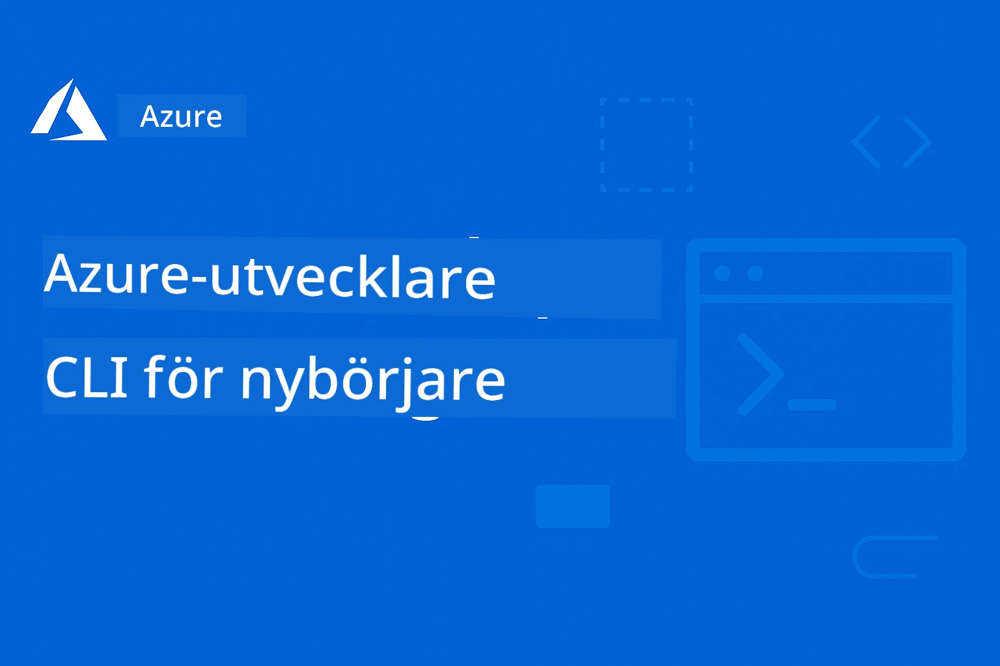

# AZD För Nybörjare: En Strukturerad Läranderesa

 

[](https://GitHub.com/microsoft/azd-for-beginners/watchers/)
[](https://GitHub.com/microsoft/azd-for-beginners/network/)
[](https://GitHub.com/microsoft/azd-for-beginners/stargazers/)

[](https://discord.com/invite/nkVh3dp)
[](https://discord.gg/nTYy5BXMWG)

---

### Automatiska översättningar (Alltid uppdaterade)

<!-- CO-OP TRANSLATOR LANGUAGES TABLE START -->
[Arabiska](../ar/README.md) | [Bengali](../bn/README.md) | [Bulgariska](../bg/README.md) | [Burmesiska (Myanmar)](../my/README.md) | [Kinesiska (förenklad)](../zh-CN/README.md) | [Kinesiska (traditionell, Hongkong)](../zh-HK/README.md) | [Kinesiska (traditionell, Macao)](../zh-MO/README.md) | [Kinesiska (traditionell, Taiwan)](../zh-TW/README.md) | [Kroatiska](../hr/README.md) | [Tjeckiska](../cs/README.md) | [Danska](../da/README.md) | [Nederländska](../nl/README.md) | [Estniska](../et/README.md) | [Finska](../fi/README.md) | [Franska](../fr/README.md) | [Tyska](../de/README.md) | [Grekiska](../el/README.md) | [Hebreiska](../he/README.md) | [Hindi](../hi/README.md) | [Ungerska](../hu/README.md) | [Indonesiska](../id/README.md) | [Italienska](../it/README.md) | [Japanska](../ja/README.md) | [Kannada](../kn/README.md) | [Khmer](../km/README.md) | [Koreanska](../ko/README.md) | [Litauiska](../lt/README.md) | [Malajiska](../ms/README.md) | [Malayalam](../ml/README.md) | [Marathi](../mr/README.md) | [Nepalesiska](../ne/README.md) | [Nigeriansk Pidgin](../pcm/README.md) | [Norska](../no/README.md) | [Persiska (Farsi)](../fa/README.md) | [Polska](../pl/README.md) | [Portugisiska (Brasilien)](../pt-BR/README.md) | [Portugisiska (Portugal)](../pt-PT/README.md) | [Punjabi (Gurmukhi)](../pa/README.md) | [Rumänska](../ro/README.md) | [Ryska](../ru/README.md) | [Serbiska (kyrilliska)](../sr/README.md) | [Slovakiska](../sk/README.md) | [Slovenska](../sl/README.md) | [Spanska](../es/README.md) | [Swahili](../sw/README.md) | [Svenska](./README.md) | [Tagalog (Filippinerna)](../tl/README.md) | [Tamil](../ta/README.md) | [Telugu](../te/README.md) | [Thailändska](../th/README.md) | [Turkiska](../tr/README.md) | [Ukrainska](../uk/README.md) | [Urdu](../ur/README.md) | [Vietnamesiska](../vi/README.md)

> **Föredrar du att klona lokalt?**
>
> Detta repository innehåller över 50 språköversättningar som kraftigt ökar nedladdningsstorleken. För att klona utan översättningar, använd sparse checkout:
>
> **Bash / macOS / Linux:**
> ```bash
> git clone --filter=blob:none --sparse https://github.com/microsoft/AZD-for-beginners.git
> cd AZD-for-beginners
> git sparse-checkout set --no-cone '/*' '!translations' '!translated_images'
> ```
>
> **CMD (Windows):**
> ```cmd
> git clone --filter=blob:none --sparse https://github.com/microsoft/AZD-for-beginners.git
> cd AZD-for-beginners
> git sparse-checkout set --no-cone "/*" "!translations" "!translated_images"
> ```
>
> Detta ger dig allt du behöver för att slutföra kursen med en mycket snabbare nedladdning.
<!-- CO-OP TRANSLATOR LANGUAGES TABLE END -->

## 🆕 Nytt i azd idag

Azure Developer CLI har vuxit bortom traditionella webbappar och API:er. Idag är azd det enda verktyget för att distribuera vilken applikation som helst till Azure — inklusive AI-drivna applikationer och intelligenta agenter.

Detta betyder följande för dig:

- **AI-agenter är nu förstklassiga azd-arbetslaster.** Du kan initiera, distribuera och hantera AI-agentprojekt med samma `azd init` → `azd up` arbetsflöde du redan känner till.
- **Microsoft Foundry-integration** ger modelldistribution, agenthosting och AI-tjänstkonfiguration direkt in i azd-mallarnas ekosystem.
- **Kärnarbetsflödet har inte förändrats.** Oavsett om du distribuerar en todo-app, en mikrotjänst eller en multi-agent AI-lösning, är kommandona desamma.

Om du har använt azd tidigare är AI-stödet en naturlig utvidgning — inte ett separat verktyg eller ett avancerat spår. Om du börjar från början kommer du att lära dig ett arbetsflöde som fungerar för allt.

---

## 🚀 Vad är Azure Developer CLI (azd)?

**Azure Developer CLI (azd)** är ett utvecklarvänligt kommandoradsverktyg som gör det enkelt att distribuera applikationer till Azure. Istället för att manuellt skapa och koppla dussintals Azure-resurser kan du distribuera hela applikationer med ett enda kommando.

### Magin med `azd up`

```bash
# Detta enda kommando gör allt:
# ✅ Skapar alla Azure-resurser
# ✅ Konfigurerar nätverk och säkerhet
# ✅ Bygger din applikationskod
# ✅ Distribuerar till Azure
# ✅ Ger dig en fungerande URL
azd up
```

**Det var allt!** Ingen klickning i Azure-portalen, inga komplexa ARM-mallar att lära sig först, ingen manuell konfiguration - bara fungerande applikationer på Azure.

---

## ❓ Azure Developer CLI vs Azure CLI: Vad är skillnaden?

Detta är den vanligaste frågan nybörjare ställer. Här är det enkla svaret:

| Feature | **Azure CLI (`az`)** | **Azure Developer CLI (`azd`)** |
|---------|---------------------|--------------------------------|
| **Purpose** | Hantera enskilda Azure-resurser | Distribuera kompletta applikationer |
| **Mindset** | Infrastrukturfokuserad | Applikationsfokuserad |
| **Example** | `az webapp create --name myapp...` | `azd up` |
| **Learning Curve** | Måste känna till Azure-tjänster | Känn bara din app |
| **Best For** | DevOps, Infrastruktur | Utvecklare, Prototypning |

### Enkel analogi

- **Azure CLI** är som att ha alla verktyg för att bygga ett hus - hammare, sågar, spikar. Du kan bygga vad som helst, men du måste kunna byggnadskonst.
- **Azure Developer CLI** är som att anlita en entreprenör - du beskriver vad du vill ha, och de tar hand om byggandet.

### När ska man använda vardera

| Scenario | Use This |
|----------|----------|
| "Jag vill snabbt distribuera min webbapp" | `azd up` |
| "Jag behöver bara skapa ett lagringskonto" | `az storage account create` |
| "Jag bygger en fullständig AI-applikation" | `azd init --template azure-search-openai-demo` |
| "Jag behöver felsöka en specifik Azure-resurs" | `az resource show` |
| "Jag vill ha produktionsklar distribution på några minuter" | `azd up --environment production` |

### De fungerar tillsammans!

AZD använder Azure CLI i bakgrunden. Du kan använda båda:
```bash
# Distribuera din app med AZD
azd up

# Finputsa sedan specifika resurser med Azure CLI
az webapp config set --name myapp --always-on true
```

---

## 🌟 Hitta mallar i Awesome AZD

Börja inte från början! **Awesome AZD** är community-samlingen av färdiga mallar för distribution:

| Resource | Description |
|----------|-------------|
| 🔗 [**Awesome AZD Gallery**](https://azure.github.io/awesome-azd/) | Bläddra bland över 200 mallar med distribution i ett klick |
| 🔗 [**Submit a Template**](https://github.com/Azure/awesome-azd/issues) | Bidra med din egen mall till communityn |
| 🔗 [**GitHub Repository**](https://github.com/Azure/awesome-azd) | Stjärnmärk och utforska källkoden |

### Populära AI-mallar från Awesome AZD

```bash
# RAG-chatt med Microsoft Foundry-modeller + AI-sökning
azd init --template azure-search-openai-demo

# Snabb AI-chattapplikation
azd init --template openai-chat-app-quickstart

# AI-agenter med Foundry-agenter
azd init --template get-started-with-ai-agents
```

---

## 🎯 Komma igång i 3 steg

Innan du börjar, se till att din dator är redo för den mall du vill distribuera:

**Windows:**
```powershell
.\validate-setup.ps1
```

**macOS / Linux:**
```bash
bash ./validate-setup.sh
```

Om någon nödvändig kontroll misslyckas, åtgärda det först och fortsätt sedan med snabbstarten.

### Steg 1: Installera AZD (2 minuter)

**Windows:**
```powershell
winget install microsoft.azd
```

**macOS:**
```bash
brew tap azure/azd && brew install azd
```

**Linux:**
```bash
curl -fsSL https://aka.ms/install-azd.sh | bash
```

### Steg 2: Autentisera för AZD

```bash
# Valfritt om du planerar att använda Azure CLI-kommandon direkt i denna kurs
az login

# Krävs för AZD-arbetsflöden
azd auth login
```

Om du är osäker på vilken du behöver, följ hela installationsflödet i [Installation & konfiguration](docs/chapter-01-foundation/installation.md#authentication-setup).

### Steg 3: Distribuera din första app

```bash
# Initiera från en mall
azd init --template todo-nodejs-mongo

# Distribuera till Azure (skapar allt!)
azd up
```

**🎉 Det var allt!** Din app är nu live på Azure.

### Städa upp (glöm inte!)

```bash
# Ta bort alla resurser när du är klar med att experimentera.
azd down --force --purge
```

---

## 📚 Hur du använder denna kurs

Denna kurs är utformad för **progressivt lärande** - börja där du känner dig bekväm och arbeta dig uppåt:

| Din erfarenhet | Börja här |
|-----------------|------------|
| **Helt ny i Azure** | [Kapitel 1: Grundläggande](#-chapter-1-foundation--quick-start) |
| **Känner till Azure, ny med AZD** | [Kapitel 1: Grundläggande](#-chapter-1-foundation--quick-start) |
| **Vill distribuera AI-appar** | [Kapitel 2: AI-först utveckling](#-chapter-2-ai-first-development-recommended-for-ai-developers) |
| **Vill ha praktisk övning** | [🎓 Interaktiv workshop](workshop/README.md) - 3-4 hour guided lab |
| **Behöver produktionsmönster** | [Kapitel 8: Produktion & företagsmönster](#-chapter-8-production--enterprise-patterns) |

### Snabbinstallation

1. **Gör en fork av detta repository**: [](https://GitHub.com/microsoft/azd-for-beginners/fork)
2. **Klona det**: `git clone https://github.com/YOUR-USERNAME/azd-for-beginners.git`
3. **Få hjälp**: [Azure Discord-community](https://discord.com/invite/ByRwuEEgH4)

> **Föredrar du att klona lokalt?**

> Detta repository innehåller över 50 språköversättningar som kraftigt ökar nedladdningsstorleken. För att klona utan översättningar, använd sparse checkout:
> ```bash
> git clone --filter=blob:none --sparse https://github.com/microsoft/AZD-for-beginners.git
> cd AZD-for-beginners
> git sparse-checkout set --no-cone '/*' '!translations' '!translated_images'
> ```
> Detta ger dig allt du behöver för att slutföra kursen med en mycket snabbare nedladdning.


## Kursöversikt

Bemästra Azure Developer CLI (azd) genom strukturerade kapitel utformade för progressivt lärande. **Särskilt fokus på distribution av AI-applikationer med Microsoft Foundry-integration.**

### Varför denna kurs är avgörande för moderna utvecklare

Baserat på insikter från Microsoft Foundry Discord-communityn vill **45% av utvecklarna använda AZD för AI-arbetsbelastningar** men stöter på utmaningar med:
- Komplexa AI-arkitekturer med flera tjänster
- Bästa praxis för AI-distribution i produktion  
- Integration och konfiguration av Azure AI-tjänster
- Kostnadsoptimering för AI-arbetsbelastningar
- Felsökning av AI-specifika distributionsproblem

### Lärandemål

Genom att slutföra denna strukturerade kurs kommer du att:
- **Behärska AZD-grunderna**: Kärnkoncept, installation och konfiguration
- **Distribuera AI-applikationer**: Använd AZD med Microsoft Foundry-tjänster
- **Implementera Infrastructure as Code**: Hantera Azure-resurser med Bicep-mallar
- **Felsök distributioner**: Åtgärda vanliga problem och felsökning
- **Optimera för produktion**: Säkerhet, skalning, övervakning och kostnadshantering
- **Bygg multi-agent-lösningar**: Distribuera komplexa AI-arkitekturer

## Innan du börjar: Konton, åtkomst och antaganden

Innan du börjar Kapitel 1, se till att du har följande på plats. Installationsstegen senare i denna guide förutsätter att dessa grunder redan är ordnade.
- **En Azure-prenumeration**: Du kan använda en befintlig prenumeration från jobbet eller ditt eget konto, eller skapa en [gratis provperiod](https://aka.ms/azurefreetrial) för att komma igång.
- **Behörighet att skapa Azure-resurser**: För de flesta övningar bör du åtminstone ha **Contributor**-åtkomst på målprenumerationen eller resursgruppen. Vissa kapitel kan också förutsätta att du kan skapa resursgrupper, hanterade identiteter och RBAC-tilldelningar.
- [**Ett GitHub-konto**](https://github.com): Detta är användbart för att forka repositoryt, spåra dina egna ändringar och använda GitHub Codespaces för workshopen.
- **Krav för mallens körmiljö**: Vissa mallar kräver lokala verktyg såsom Node.js, Python, Java eller Docker. Kör uppsättningsvalideraren innan du börjar så att du upptäcker saknade verktyg i tid.
- **Grundläggande terminalvana**: Du behöver inte vara expert, men du bör vara bekväm med att köra kommandon som `git clone`, `azd auth login`, och `azd up`.

> **Arbetar du i en företagsprenumeration?**
> Om din Azure-miljö hanteras av en administratör, bekräfta i förväg att du kan distribuera resurser i den prenumeration eller resursgrupp du planerar att använda. Om inte, be om en sandlåseprenumeration eller Contributor-åtkomst innan du börjar.

> **Ny på Azure?**
> Börja med din egen Azure-provkonto eller pay-as-you-go-prenumeration på https://aka.ms/azurefreetrial så att du kan slutföra övningarna från början till slut utan att behöva vänta på godkännanden på tenant-nivå.

## 🗺️ Kursöversikt: Snabb navigering per kapitel

Varje kapitel har en dedikerad README med lärandemål, snabbinstruktioner och övningar:

| Chapter | Topic | Lessons | Duration | Complexity |
|---------|-------|---------|----------|------------|
| **[Kapitel 1: Grundläggande](docs/chapter-01-foundation/README.md)** | Komma igång | [AZD-grunderna](docs/chapter-01-foundation/azd-basics.md) &#124; [Installation](docs/chapter-01-foundation/installation.md) &#124; [Första projektet](docs/chapter-01-foundation/first-project.md) | 30-45 min | ⭐ |
| **[Kapitel 2: AI-utveckling](docs/chapter-02-ai-development/README.md)** | AI-fokuserade appar | [Foundry-integration](docs/chapter-02-ai-development/microsoft-foundry-integration.md) &#124; [AI-agenter](docs/chapter-02-ai-development/agents.md) &#124; [Distribution av modeller](docs/chapter-02-ai-development/ai-model-deployment.md) &#124; [Workshop](docs/chapter-02-ai-development/ai-workshop-lab.md) | 1-2 timmar | ⭐⭐ |
| **[Kapitel 3: Konfiguration](docs/chapter-03-configuration/README.md)** | Autentisering & säkerhet | [Konfiguration](docs/chapter-03-configuration/configuration.md) &#124; [Autentisering & säkerhet](docs/chapter-03-configuration/authsecurity.md) | 45-60 min | ⭐⭐ |
| **[Kapitel 4: Infrastruktur](docs/chapter-04-infrastructure/README.md)** | IaC & Distribution | [Distributionsguide](docs/chapter-04-infrastructure/deployment-guide.md) &#124; [Provisionering](docs/chapter-04-infrastructure/provisioning.md) | 1-1,5 timmar | ⭐⭐⭐ |
| **[Kapitel 5: Multi-Agent](docs/chapter-05-multi-agent/README.md)** | AI-agentlösningar | [Detaljhandelsscenario](examples/retail-scenario.md) &#124; [Koordineringsmönster](docs/chapter-06-pre-deployment/coordination-patterns.md) | 2-3 timmar | ⭐⭐⭐⭐ |
| **[Kapitel 6: Fördistribution](docs/chapter-06-pre-deployment/README.md)** | Planering & Validering | [Förkontroller](docs/chapter-06-pre-deployment/preflight-checks.md) &#124; [Kapacitetsplanering](docs/chapter-06-pre-deployment/capacity-planning.md) &#124; [Val av SKU](docs/chapter-06-pre-deployment/sku-selection.md) &#124; [App Insights](docs/chapter-06-pre-deployment/application-insights.md) | 1 tim | ⭐⭐ |
| **[🎓 Workshop](workshop/README.md)** | Praktiskt labb | [Introduktion](workshop/docs/instructions/0-Introduction.md) &#124; [Val](workshop/docs/instructions/1-Select-AI-Template.md) &#124; [Validering](workshop/docs/instructions/2-Validate-AI-Template.md) &#124; [Nedbrytning](workshop/docs/instructions/3-Deconstruct-AI-Template.md) &#124; [Konfiguration](workshop/docs/instructions/4-Configure-AI-Template.md) &#124; [Anpassning](workshop/docs/instructions/5-Customize-AI-Template.md) &#124; [Nedmontering](workshop/docs/instructions/6-Teardown-Infrastructure.md) &#124; [Avslutning](workshop/docs/instructions/7-Wrap-up.md) | 3-4 timmar | ⭐⭐ |

**Total Course Duration:** ~10-14 hours | **Skill Progression:** Beginner → Production-Ready

---

## 📚 Lärandekapitel

*Välj din lärandeväg baserat på erfarenhetsnivå och mål*

### 🚀 Kapitel 1: Grundläggande & Kom igång
**Förutsättningar**: Azure-prenumeration, grundläggande kommandoradskunskaper  
**Tidsåtgång**: 30-45 minuter  
**Komplexitet**: ⭐

#### Vad du kommer att lära dig
- Förstå grunderna i Azure Developer CLI
- Installera AZD på din plattform
- Din första lyckade distribution

#### Lärresurser
- **🎯 Starta här**: [Vad är Azure Developer CLI?](#what-is-azure-developer-cli)
- **📖 Teori**: [AZD-grunderna](docs/chapter-01-foundation/azd-basics.md) - Kärnkoncept och terminologi
- **⚙️ Installation & uppsättning**: [Installation & Setup](docs/chapter-01-foundation/installation.md) - Plattformsspecifika guider
- **🛠️ Praktiskt**: [Ditt första projekt](docs/chapter-01-foundation/first-project.md) - Steg-för-steg-handledning
- **📋 Snabbreferens**: [Kommandofusklista](resources/cheat-sheet.md)

#### Praktiska övningar
```bash
# Snabb installationskontroll
azd version

# Distribuera din första applikation
azd init --template todo-nodejs-mongo
azd up
```

**💡 Kapitelresultat**: Distribuera framgångsrikt en enkel webbapplikation till Azure med AZD

**✅ Framgångsvalidering:**
```bash
# Efter att ha slutfört kapitel 1 bör du kunna:
azd version              # Visar installerad version
azd init --template todo-nodejs-mongo  # Initierar projektet
azd up                  # Distribuerar till Azure
azd show                # Visar URL för den körande appen
# Applikationen öppnas i webbläsaren och fungerar
azd down --force --purge  # Rensar upp resurser
```

**📊 Tidsåtgång:** 30-45 minuter  
**📈 Kompetens efter:** Kan distribuera grundläggande applikationer självständigt
**📈 Kompetens efter:** Kan distribuera grundläggande applikationer självständigt

---

### 🤖 Kapitel 2: AI-först utveckling (Rekommenderas för AI-utvecklare)
**Förutsättningar**: Kapitel 1 avklarat  
**Tidsåtgång**: 1-2 timmar  
**Komplexitet**: ⭐⭐

#### Vad du kommer att lära dig
- Microsoft Foundry-integration med AZD
- Distribuera AI-drivna applikationer
- Förstå konfigurationer för AI-tjänster

#### Lärresurser
- **🎯 Starta här**: [Microsoft Foundry-integration](docs/chapter-02-ai-development/microsoft-foundry-integration.md)
- **🤖 AI-agenter**: [AI-agenter](docs/chapter-02-ai-development/agents.md) - Distribuera intelligenta agenter med AZD
- **📖 Mönster**: [Distribution av modeller](docs/chapter-02-ai-development/ai-model-deployment.md) - Distribuera och hantera AI-modeller
- **🛠️ Workshop**: [AI Workshop Lab](docs/chapter-02-ai-development/ai-workshop-lab.md) - Gör dina AI-lösningar redo för AZD
- **🎥 Interaktiv guide**: [Workshop Materials](workshop/README.md) - Webbläsarbaserat lärande med MkDocs * DevContainer Environment
- **📋 Mallar**: [Microsoft Foundry Templates](#workshopresurser)
- **📝 Exempel**: [AZD Deployment Examples](examples/README.md)

#### Praktiska övningar
```bash
# Distribuera din första AI-applikation
azd init --template azure-search-openai-demo
azd up

# Prova ytterligare AI-mallar
azd init --template openai-chat-app-quickstart
azd init --template agent-openai-python-prompty
```

**💡 Kapitelresultat**: Distribuera och konfigurera en AI-driven chattapplikation med RAG-funktioner

**✅ Framgångsvalidering:**
```bash
# Efter kapitel 2 bör du kunna:
azd init --template azure-search-openai-demo
azd up
# Testa AI-chattgränssnittet
# Ställ frågor och få AI-drivna svar med källor
# Verifiera att sökintegrationen fungerar
azd monitor  # Kontrollera att Application Insights visar telemetri
azd down --force --purge
```

**📊 Tidsåtgång:** 1-2 timmar  
**📈 Kompetens efter:** Kan distribuera och konfigurera AI-applikationer som är produktionsklara  
**💰 Kostnadsmedvetenhet:** Förstå utvecklingskostnader på $80-150/månad, produktionskostnader $300-3500/månad

#### 💰 Kostnadsöverväganden för AI-distributioner

**Utvecklingsmiljö (uppskattat $80-150/månad):**
- Microsoft Foundry Models (betala per användning): $0-50/månad (baserat på token-användning)
- AI Search (Basic-nivå): $75/månad
- Container Apps (Consumption): $0-20/månad
- Lagring (Standard): $1-5/månad

**Produktionsmiljö (uppskattat $300-3,500+/månad):**
- Microsoft Foundry Models (PTU för konsekvent prestanda): $3,000+/månad ELLER betala per användning vid hög volym
- AI Search (Standard-nivå): $250/månad
- Container Apps (Dedicated): $50-100/månad
- Application Insights: $5-50/månad
- Lagring (Premium): $10-50/månad

**💡 Tips för kostnadsoptimering:**
- Använd **Free Tier** Microsoft Foundry Models för inlärning (Azure OpenAI 50,000 tokens/månad ingår)
- Kör `azd down` för att deallokera resurser när du inte utvecklar aktivt
- Börja med förbrukningsbaserad fakturering, uppgradera till PTU endast för produktion
- Använd `azd provision --preview` för att uppskatta kostnader före distribution
- Aktivera autoskalning: betala endast för faktisk användning

**Kostnadsövervakning:**
```bash
# Kontrollera uppskattade månadskostnader
azd provision --preview

# Övervaka faktiska kostnader i Azure-portalen
az consumption budget list --resource-group <your-rg>
```

---

### ⚙️ Kapitel 3: Konfiguration & autentisering
**Förutsättningar**: Kapitel 1 avklarat  
**Tidsåtgång**: 45-60 minuter  
**Komplexitet**: ⭐⭐

#### Vad du kommer att lära dig
- Miljökonfiguration och hantering
- Autentisering och säkerhetsbästa praxis
- Resursnamngivning och organisering

#### Lärresurser
- **📖 Konfiguration**: [Configuration Guide](docs/chapter-03-configuration/configuration.md) - Miljöinställningar
- **🔐 Säkerhet**: [Authentication patterns and managed identity](docs/chapter-03-configuration/authsecurity.md) - Autentiseringsmönster
- **📝 Exempel**: [Database App Example](examples/database-app/README.md) - AZD-databasexempel

#### Praktiska övningar
- Konfigurera flera miljöer (dev, staging, prod)
- Ställ in autentisering med hanterad identitet
- Implementera miljöspecifika konfigurationer

**💡 Kapitelresultat**: Hantera flera miljöer med korrekt autentisering och säkerhet

---

### 🏗️ Kapitel 4: Infrastruktur som kod & distribution
**Förutsättningar**: Kapitel 1–3 avklarade  
**Tidsåtgång**: 1-1,5 timmar  
**Komplexitet**: ⭐⭐⭐

#### Vad du kommer att lära dig
- Avancerade distributionsmönster
- Infrastruktur som kod med Bicep
- Strategier för resursprovisionering

#### Lärresurser
- **📖 Distribution**: [Distributionsguide](docs/chapter-04-infrastructure/deployment-guide.md) - Kompletta arbetsflöden
- **🏗️ Provisionering**: [Provisionering av resurser](docs/chapter-04-infrastructure/provisioning.md) - Azure-resurshantering
- **📝 Exempel**: [Containerappsexempel](../../examples/container-app) - Containeriserade distributioner

#### Praktiska övningar
- Skapa anpassade Bicep-mallar
- Distribuera flertjänstapplikationer
- Implementera blue-green-distributionstrategier

**💡 Kapitelresultat**: Distribuera komplexa flertjänstapplikationer med hjälp av anpassade infrastruktursmallar

---

### 🎯 Kapitel 5: Multi-agent AI-lösningar (Avancerat)
**Förutsättningar**: Kapitel 1–2 avklarade  
**Tidsåtgång**: 2-3 timmar  
**Komplexitet**: ⭐⭐⭐⭐

#### Vad du kommer att lära dig
- Arkitekturmönster för multi-agentssystem
- Agentorkestrering och koordinering
- Produktionsklara AI-distributioner

#### Lärresurser
- **🤖 Framhävt projekt**: [Detaljhandels multi-agentlösning](examples/retail-scenario.md) - Komplett implementation
- **🛠️ ARM-mallar**: [ARM Template Package](../../examples/retail-multiagent-arm-template) - En-klicks-distribution
- **📖 Arkitektur**: [Koordineringsmönster för multi-agenter](docs/chapter-06-pre-deployment/coordination-patterns.md) - Mönster

#### Praktiska övningar
```bash
# Distribuera den kompletta multiagentlösningen för detaljhandeln
cd examples/retail-multiagent-arm-template
./deploy.sh

# Utforska agentkonfigurationer
az deployment group show --resource-group <rg-name> --name <deployment-name>
```

**💡 Kapitelresultat**: Distribuera och hantera en produktionsklar multi-agent AI-lösning med kund- och lageragenter

---

### 🔍 Kapitel 6: Fördistribution – validering och planering
**Förutsättningar**: Kapitel 4 avklarat  
**Tidsåtgång**: 1 tim  
**Komplexitet**: ⭐⭐
#### Vad du kommer att lära dig
- Kapacitetsplanering och resursvalidering
- Strategier för SKU-val
- Förkontroller och automatisering

#### Lärresurser
- **📊 Planering**: [Kapacitetsplanering](docs/chapter-06-pre-deployment/capacity-planning.md) - Resursvalidering
- **💰 Val**: [SKU-val](docs/chapter-06-pre-deployment/sku-selection.md) - Kostnadseffektiva val
- **✅ Validering**: [Förkontroller](docs/chapter-06-pre-deployment/preflight-checks.md) - Automatiserade skript

#### Praktiska övningar
- Kör skript för kapacitetsvalidering
- Optimera SKU-val för kostnad
- Implementera automatiserade förkontroller före distribution

**💡 Kapitelresultat**: Validera och optimera distributioner innan de körs

---

### 🚨 Kapitel 7: Felsökning och debugging
**Förkunskaper**: Minst ett distributionskapitel genomfört  
**Varaktighet**: 1-1.5 timmar  
**Komplexitet**: ⭐⭐

#### Vad du kommer att lära dig
- Systematiska felsökningsmetoder
- Vanliga problem och lösningar
- AI-specifik felsökning

#### Lärresurser
- **🔧 Vanliga problem**: [Vanliga problem](docs/chapter-07-troubleshooting/common-issues.md) - FAQ och lösningar
- **🕵️ Felsökning**: [Felsökningsguide](docs/chapter-07-troubleshooting/debugging.md) - Steg-för-steg-strategier
- **🤖 AI-problem**: [AI-specifik felsökning](docs/chapter-07-troubleshooting/ai-troubleshooting.md) - Problem med AI-tjänster

#### Praktiska övningar
- Diagnostisera distributionsfel
- Lös autentiseringsproblem
- Felsök anslutning till AI-tjänster

**💡 Kapitelresultat**: Diagnostisera och åtgärda vanliga distributionsproblem självständigt

---

### 🏢 Kapitel 8: Produktions- och företagsmönster
**Förkunskaper**: Kapitel 1-4 genomförda  
**Varaktighet**: 2-3 timmar  
**Komplexitet**: ⭐⭐⭐⭐

#### Vad du kommer att lära dig
- Strategier för produktionsdistribution
- Säkerhetsmönster för företag
- Övervakning och kostnadsoptimering

#### Lärresurser
- **🏭 Produktion**: [Bästa praxis för produktions-AI](docs/chapter-08-production/production-ai-practices.md) - Företagsmönster
- **📝 Exempel**: [Exempel på mikrotjänster](../../examples/microservices) - Komplexa arkitekturer
- **📊 Övervakning**: [Integration med Application Insights](docs/chapter-06-pre-deployment/application-insights.md) - Övervakning

#### Praktiska övningar
- Implementera säkerhetsmönster för företag
- Ställ in omfattande övervakning
- Distribuera till produktion med lämplig styrning

**💡 Kapitelresultat**: Distribuera företagsanpassade applikationer med fulla produktionsmöjligheter

---

## 🎓 Workshopöversikt: Praktisk inlärningsupplevelse

> **⚠️ WORKSHOP STATUS: Under aktiv utveckling**  
> Workshopmaterialen utvecklas och förbättras för närvarande. Kärnmodulerna fungerar, men några avancerade avsnitt är ofullständiga. Vi arbetar aktivt för att slutföra allt innehåll. [Följ framstegen →](workshop/README.md)

### Interaktivt workshopmaterial
**Omfattande praktisk inlärning med webbläsarbaserade verktyg och guidade övningar**

Våra workshopmaterial erbjuder en strukturerad, interaktiv lärandeupplevelse som kompletterar kursinnehållet ovan. Workshopen är utformad för både självstudier och ledd undervisning.

#### 🛠️ Workshopfunktioner
- **Webbläsargränssnitt**: Komplett MkDocs-driven workshop med sök-, kopierings- och temafunktioner
- **GitHub Codespaces-integration**: Inställning av utvecklingsmiljö med ett klick
- **Strukturerad inlärningsväg**: 8-modulers guidade övningar (totalt 3-4 timmar)
- **Progressiv metodik**: Introduktion → Val → Validering → Dekonstruktion → Konfiguration → Anpassning → Avveckling → Avslutning
- **Interaktiv DevContainer-miljö**: Förkonfigurerade verktyg och beroenden

#### 📚 Workshopmodulstruktur
Workshopen följer en **8-moduls progressiv metodik** som tar dig från upptäckt till distributionsmästerskap:

| Modul | Ämne | Vad du kommer att göra | Varaktighet |
|--------|-------|----------------|----------|
| **0. Introduktion** | Workshopöversikt | Förstå lärmålen, förkunskaperna och workshopens struktur | 15 min |
| **1. Val** | Upptäckt av mallar | Utforska AZD-mallar och välj rätt AI-mall för ditt scenario | 20 min |
| **2. Validering** | Distribuera & Verifiera | Distribuera mallen med `azd up` och validera att infrastrukturen fungerar | 30 min |
| **3. Dekonstruktion** | Förstå strukturen | Använd GitHub Copilot för att utforska mallens arkitektur, Bicep-filer och kodorganisation | 30 min |
| **4. Konfiguration** | Fördjupning i azure.yaml | Bemästra `azure.yaml`-konfiguration, livscykelhakar och miljövariabler | 30 min |
| **5. Anpassning** | Gör den till din | Aktivera AI Search, spårning, utvärdering, och anpassa för ditt scenario | 45 min |
| **6. Avveckling** | Rensa upp | Avprovisionera resurser säkert med `azd down --purge` | 15 min |
| **7. Avslutning** | Nästa steg | Gå igenom prestationer, huvudkoncept och fortsätt din läranderesa | 15 min |

**Workshopflöde:**
```
Introduction → Selection → Validation → Deconstruction → Configuration → Customization → Teardown → Wrap-up
     ↓            ↓           ↓              ↓               ↓              ↓            ↓           ↓
  Overview    Find the     Deploy &      Explore        Master         Customize     Clean up    Review &
             right        verify        code &        azure.yaml      for your      resources   next steps
             template                   structure                     scenario
```

#### 🚀 Komma igång med workshopen
```bash
# Alternativ 1: GitHub Codespaces (Rekommenderat)
# Klicka på "Code" → "Create codespace on main" i repositoryt

# Alternativ 2: Lokal utveckling
git clone https://github.com/microsoft/azd-for-beginners.git
cd azd-for-beginners/workshop
# Följ installationsinstruktionerna i workshop/README.md
```

#### 🎯 Workshopens inlärningsmål
Genom att slutföra workshopen kommer deltagarna att:
- **Distribuera produktions-AI-applikationer**: Använd AZD med Microsoft Foundry-tjänster
- **Bemästra multi-agentarkitekturer**: Implementera koordinerade AI-agentlösningar
- **Implementera säkerhetsbästa praxis**: Konfigurera autentisering och åtkomstkontroll
- **Optimera för skala**: Designa kostnadseffektiva, högpresterande distributioner
- **Felsök distributioner**: Åtgärda vanliga problem självständigt

#### 📖 Workshopresurser
- **🎥 Interaktiv guide**: [Workshopmaterial](workshop/README.md) - Webbläsarbaserad lärmiljö
- **📋 Modul-för-modul-instruktioner**:
  - [0. Introduktion](workshop/docs/instructions/0-Introduction.md) - Workshopöversikt och mål
  - [1. Val](workshop/docs/instructions/1-Select-AI-Template.md) - Hitta och välj AI-mallar
  - [2. Validering](workshop/docs/instructions/2-Validate-AI-Template.md) - Distribuera och verifiera mallar
  - [3. Dekonstruktion](workshop/docs/instructions/3-Deconstruct-AI-Template.md) - Utforska mallens arkitektur
  - [4. Konfiguration](workshop/docs/instructions/4-Configure-AI-Template.md) - Bemästra azure.yaml
  - [5. Anpassning](workshop/docs/instructions/5-Customize-AI-Template.md) - Anpassa för ditt scenario
  - [6. Avveckling](workshop/docs/instructions/6-Teardown-Infrastructure.md) - Rensa upp resurser
  - [7. Avslutning](workshop/docs/instructions/7-Wrap-up.md) - Sammanfatta och nästa steg
- **🛠️ AI Workshop-labb**: [AI Workshop Lab](docs/chapter-02-ai-development/ai-workshop-lab.md) - AI-fokuserade övningar
- **💡 Snabbstart**: [Workshop Setup Guide](workshop/README.md#quick-start) - Miljökonfiguration

**Perfekt för**: Företagsutbildning, universitetskurser, självstyrt lärande och utvecklarbootcamps.

---

## 📖 Fördjupning: AZD-funktioner

Utöver grunderna erbjuder AZD kraftfulla funktioner för produktionsdistributioner:

- **Mallbaserade distributioner** - Använd förkonfigurerade mallar för vanliga applikationsmönster
- **Infrastruktur som kod** - Hantera Azure-resurser med Bicep eller Terraform  
- **Integrerade arbetsflöden** - Sömlöst provisionera, distribuera och övervaka applikationer
- **Utvecklarvänligt** - Optimerat för utvecklarproduktivitet och användarupplevelse

### **AZD + Microsoft Foundry: Perfekt för AI-distributioner**

**Varför AZD för AI-lösningar?** AZD tar itu med de största utmaningarna AI-utvecklare står inför:

- **AI-klara mallar** - Förkonfigurerade mallar för Microsoft Foundry-modeller, Cognitive Services och ML-arbetsbelastningar
- **Säkra AI-distributioner** - Inbyggda säkerhetsmönster för AI-tjänster, API-nycklar och modelendpunkter  
- **Produktionsmönster för AI** - Bästa praxis för skalbara, kostnadseffektiva AI-applikationsdistributioner
- **End-to-end AI-arbetsflöden** - Från modellutveckling till produktionsdistribution med korrekt övervakning
- **Kostnadsoptimering** - Smart resursallokering och skalningsstrategier för AI-arbetsbelastningar
- **Integration med Microsoft Foundry** - Sömlös anslutning till Microsoft Foundrys modellkatalog och endpunkter

---

## 🎯 Mallar & exempelbibliotek

### Utvalda: Microsoft Foundry-mallar
**Börja här om du distribuerar AI-applikationer!**

> **Obs:** Dessa mallar demonstrerar olika AI-mönster. Vissa är externa Azure Samples, andra är lokala implementationer.

| Mall | Kapitel | Komplexitet | Tjänster | Typ |
|----------|---------|------------|----------|------|
| [**Kom igång med AI-chatt**](https://github.com/Azure-Samples/get-started-with-ai-chat) | Kapitel 2 | ⭐⭐ | AzureOpenAI + Azure AI Model Inference API + Azure AI Search + Azure Container Apps + Application Insights | Extern |
| [**Kom igång med AI-agenter**](https://github.com/Azure-Samples/get-started-with-ai-agents) | Kapitel 2 | ⭐⭐ | Foundry Agents + AzureOpenAI + Azure AI Search + Azure Container Apps + Application Insights| Extern |
| [**Azure Search + OpenAI-demo**](https://github.com/Azure-Samples/azure-search-openai-demo) | Kapitel 2 | ⭐⭐ | AzureOpenAI + Azure AI Search + App Service + Storage | Extern |
| [**OpenAI Chat App Snabbstart**](https://github.com/Azure-Samples/openai-chat-app-quickstart) | Kapitel 2 | ⭐ | AzureOpenAI + Container Apps + Application Insights | Extern |
| [**Agent OpenAI Python Prompty**](https://github.com/Azure-Samples/agent-openai-python-prompty) | Kapitel 5 | ⭐⭐⭐ | AzureOpenAI + Azure Functions + Prompty | Extern |
| [**Contoso Chat RAG**](https://github.com/Azure-Samples/contoso-chat) | Kapitel 8 | ⭐⭐⭐⭐ | AzureOpenAI + AI Search + Cosmos DB + Container Apps | Extern |
| [**Retail Multi-Agent-lösning**](examples/retail-scenario.md) | Kapitel 5 | ⭐⭐⭐⭐ | AzureOpenAI + AI Search + Storage + Container Apps + Cosmos DB | **Lokal** |

### Utvalda: Kompletta inlärningsscenarier
**Produktionsklara applikationsmallar kopplade till lärkapitel**

| Mall | Lärkapitel | Komplexitet | Nyckellärdom |
|----------|------------------|------------|--------------|
| [**openai-chat-app-quickstart**](https://github.com/Azure-Samples/openai-chat-app-quickstart) | Kapitel 2 | ⭐ | Grundläggande AI-distributionsmönster |
| [**azure-search-openai-demo**](https://github.com/Azure-Samples/azure-search-openai-demo) | Kapitel 2 | ⭐⭐ | RAG-implementering med Azure AI Search |
| [**ai-document-processing**](https://github.com/Azure-Samples/ai-document-processing) | Kapitel 4 | ⭐⭐ | Integrering av Document Intelligence |
| [**agent-openai-python-prompty**](https://github.com/Azure-Samples/agent-openai-python-prompty) | Kapitel 5 | ⭐⭐⭐ | Agentramverk och funktionsanrop |
| [**contoso-chat**](https://github.com/Azure-Samples/contoso-chat) | Kapitel 8 | ⭐⭐⭐ | Företags-AI-orkestrering |
| [**retail-multi-agent-solution**](examples/retail-scenario.md) | Kapitel 5 | ⭐⭐⭐⭐ | Multi-agentarkitektur med Kund- och Lageragenter |

### Lärande efter exempeltyp

> **📌 Lokala vs externa exempel:**  
> **Lokala exempel** (i detta repo) = Klara att använda omedelbart  
> **Externa exempel** (Azure Samples) = Klona från länkade repositorier

#### Lokala exempel (Klara att använda)
- [**Retail Multi-Agent-lösning**](examples/retail-scenario.md) - Komplett produktionsklar implementation med ARM-mallar
  - Multi-agentarkitektur (Kund + Lager-agenter)
  - Omfattande övervakning och utvärdering
  - Distribution med ett klick via ARM-mall

#### Lokala exempel - Containerapplikationer (Kapitel 2-5)
**Omfattande exempel på containerdistributioner i detta repo:**
- [**Container App-exempel**](examples/container-app/README.md) - Komplett guide till containeriserade distributioner
  - [Enkel Flask-API](../../examples/container-app/simple-flask-api) - Grundläggande REST-API med scale-to-zero
  - [Mikrotjänstarkitektur](../../examples/container-app/microservices) - Produktionsklar flertjänstdistribution
  - Snabbstart, Produktion och Avancerade distributionsmönster
  - Riktlinjer för övervakning, säkerhet, och kostnadsoptimering

#### Externa exempel - Enkla applikationer (Kapitel 1-2)
**Klon dessa Azure Samples-repositorier för att komma igång:**
- [Enkel webbapp - Node.js + MongoDB](https://github.com/Azure-Samples/todo-nodejs-mongo) - Grundläggande distributionsmönster
- [Statisk webbplats - React SPA](https://github.com/Azure-Samples/todo-csharp-sql-swa-func) - Distribution av statiskt innehåll
- [Container App - Python Flask](https://github.com/Azure-Samples/container-apps-store-api-microservice) - Distribution av REST-API

#### Externa exempel - Databasintegration (Kapitel 3-4)
- [Databasapp - C# + SQL](https://github.com/Azure-Samples/todo-csharp-sql) - Mönster för databasanslutning
- [Functions + Cosmos DB](https://github.com/Azure-Samples/todo-python-mongo-swa-func) - Serverlöst dataarbetsflöde

#### Externa exempel - avancerade mönster (Kapitel 4-8)
- [Java Microservices](https://github.com/Azure-Samples/java-microservices-aca-lab) - Arkitektur med flera tjänster
- [Container Apps Jobs](https://github.com/Azure-Samples/container-apps-jobs) - Bakgrundsbehandling  
- [Enterprise ML Pipeline](https://github.com/Azure-Samples/mlops-v2) - Produktionsklara ML-mönster

### Externa mallkollektioner
- [**Official AZD Template Gallery**](https://azure.github.io/awesome-azd/) - Kurerad samling av officiella och community-mallar
- [**Azure Developer CLI Templates**](https://learn.microsoft.com/en-us/azure/developer/azure-developer-cli/azd-templates) - Microsoft Learn-mallarnas dokumentation
- [**Examples Directory**](examples/README.md) - Lokala inlärningsexempel med detaljerade förklaringar

---

## 📚 Lärresurser & Referenser

### Snabbreferenser
- [**Command Cheat Sheet**](resources/cheat-sheet.md) - Väsentliga azd-kommandon organiserade per kapitel
- [**Glossary**](resources/glossary.md) - Azure- och azd-terminologi  
- [**FAQ**](resources/faq.md) - Vanliga frågor organiserade per lärokapitel
- [**Study Guide**](resources/study-guide.md) - Omfattande övningsuppgifter

### Praktiska workshops
- [**AI Workshop Lab**](docs/chapter-02-ai-development/ai-workshop-lab.md) - Gör dina AI-lösningar AZD-distribuerbara (2-3 timmar)
- [**Interactive Workshop**](workshop/README.md) - 8-moduls guidade övningar med MkDocs och GitHub Codespaces
  - Följer: Introduktion → Val → Validering → Nedbrytning → Konfiguration → Anpassning → Nedmontering → Sammanfattning

### Externa lärresurser
- Azure Developer CLI-dokumentation: https://learn.microsoft.com/en-us/azure/developer/azure-developer-cli/
- Azure Arkitekturcenter: https://learn.microsoft.com/en-us/azure/architecture/
- Azure prisberäknare: https://azure.microsoft.com/pricing/calculator/
- Azure-status: https://status.azure.com/

### AI-agentfärdigheter för din redigerare
- [**Microsoft Azure Skills on skills.sh**](https://skills.sh/microsoft/github-copilot-for-azure) - 37 öppna agentfärdigheter för Azure AI, Foundry, distribution, diagnostik, kostnadsoptimering och mer. Installera dem i GitHub Copilot, Cursor, Claude Code eller någon stödd agent:
  ```bash
  npx skills add microsoft/github-copilot-for-azure
  ```

---

## 🔧 Snabb felsökningsguide

**Vanliga problem som nybörjare stöter på och omedelbara lösningar:**

<details>
<summary><strong>❌ "azd: command not found"</strong></summary>

```bash
# Installera AZD först
# Windows (PowerShell):
winget install microsoft.azd

# macOS:
brew tap azure/azd && brew install azd

# Linux:
curl -fsSL https://aka.ms/install-azd.sh | bash

# Verifiera installationen
azd version
```
</details>

<details>
<summary><strong>❌ "No subscription found" or "Subscription not set"</strong></summary>

```bash
# Lista tillgängliga prenumerationer
az account list --output table

# Ange standardprenumeration
az account set --subscription "<subscription-id-or-name>"

# Ställ in för AZD-miljön
azd env set AZURE_SUBSCRIPTION_ID "<subscription-id>"

# Verifiera
az account show
```
</details>

<details>
<summary><strong>❌ "InsufficientQuota" or "Quota exceeded"</strong></summary>

```bash
# Prova en annan Azure-region
azd env set AZURE_LOCATION "westus2"
azd up

# Eller använd mindre SKU:er i utveckling
# Redigera infra/main.parameters.json:
{
  "sku": "B1"  // Instead of "P1V2"
}
```
</details>

<details>
<summary><strong>❌ "azd up" fails halfway through</strong></summary>

```bash
# Alternativ 1: Rensa och försök igen
azd down --force --purge
azd up

# Alternativ 2: Endast åtgärda infrastrukturen
azd provision

# Alternativ 3: Kontrollera detaljerad status
azd show

# Alternativ 4: Kontrollera loggar i Azure Monitor
azd monitor --logs
```
</details>

<details>
<summary><strong>❌ "Authentication failed" or "Token expired"</strong></summary>

```bash
# Autentisera om för AZD
azd auth logout
azd auth login

# Valfritt: uppdatera även Azure CLI om du kör az-kommandon
az logout
az login

# Verifiera autentisering
az account show
```
</details>

<details>
<summary><strong>❌ "Resource already exists" or naming conflicts</strong></summary>

```bash
# AZD genererar unika namn, men vid konflikt:
azd down --force --purge

# Försök sedan igen med en ny miljö
azd env new dev-v2
azd up
```
</details>

<details>
<summary><strong>❌ Mallutplacering tar för lång tid</strong></summary>

**Normala väntetider:**
- Enkel webbapp: 5–10 minuter
- App med databas: 10–15 minuter
- AI-applikationer: 15–25 minuter (OpenAI-provisionering är långsam)

```bash
# Kontrollera framsteg
azd show

# Om du sitter fast längre än 30 minuter, kontrollera Azure-portalen:
azd monitor --overview
# Sök efter misslyckade distributioner
```
</details>

<details>
<summary><strong>❌ "Permission denied" or "Forbidden"</strong></summary>

```bash
# Kontrollera din Azure-roll
az role assignment list --assignee $(az account show --query user.name -o tsv)

# Du behöver minst rollen "Contributor"
# Be din Azure-administratör att bevilja:
# - Contributor (för resurser)
# - User Access Administrator (för rolltilldelningar)
```
</details>

<details>
<summary><strong>❌ Kan inte hitta den distribuerade applikationens URL</strong></summary>

```bash
# Visa alla serviceendpunkter
azd show

# Eller öppna Azure-portalen
azd monitor

# Kontrollera en specifik tjänst
azd env get-values
# Sök efter *_URL-variabler
```
</details>

### 📚 Fullständiga felsökningsresurser

- **Guide för vanliga problem:** [Detaljerade lösningar](docs/chapter-07-troubleshooting/common-issues.md)
- **AI-specifika problem:** [Felsökning för AI](docs/chapter-07-troubleshooting/ai-troubleshooting.md)
- **Felsökningsguide:** [Steg-för-steg felsökning](docs/chapter-07-troubleshooting/debugging.md)
- **Få hjälp:** [Azure Discord](https://discord.gg/microsoft-azure) #azure-developer-cli

---

## 🎓 Kursavslutning och certifiering

### Framstegsspårning
Håll koll på dina framsteg genom varje kapitel:

- [ ] **Kapitel 1**: Grund och snabbstart ✅
- [ ] **Kapitel 2**: AI-först utveckling ✅  
- [ ] **Kapitel 3**: Konfiguration & autentisering ✅
- [ ] **Kapitel 4**: Infrastruktur som kod & distribution ✅
- [ ] **Kapitel 5**: Fleragent-AI-lösningar ✅
- [ ] **Kapitel 6**: Validering och planering före distribution ✅
- [ ] **Kapitel 7**: Felsökning & debugging ✅
- [ ] **Kapitel 8**: Produktions- & företagsmönster ✅

### Verifiering av lärande
Efter att du har slutfört varje kapitel, verifiera din kunskap genom:
1. **Praktisk övning**: Utför kapitlets praktiska distribution
2. **Kunskapskontroll**: Granska FAQ-avsnittet för ditt kapitel
3. **Gemenskapsdiskussion**: Dela dina erfarenheter i Azure Discord
4. **Nästa kapitel**: Gå vidare till nästa komplexitetsnivå

### Fördelar vid kursavslutning
När du har slutfört alla kapitel kommer du att ha:
- **Driftsättningserfarenhet**: Distribuerat verkliga AI-applikationer till Azure
- **Professionella färdigheter**: Företagsanpassad distributionskompetens  
- **Gemenskapsigenkänning**: Aktiv medlem i Azure-utvecklargemenskapen
- **Karriärfrämjande**: Eftertraktad AZD- och AI-distributionskompetens

---

## 🤝 Gemenskap & Support

### Få hjälp & support
- **Tekniska problem**: [Rapportera buggar och begär funktioner](https://github.com/microsoft/azd-for-beginners/issues)
- **Frågor om lärande**: [Microsoft Azure Discord Community](https://discord.gg/microsoft-azure) and [](https://discord.gg/nTYy5BXMWG)
- **AI-specifik hjälp**: Gå med i [](https://discord.gg/nTYy5BXMWG)
- **Dokumentation**: [Officiell Azure Developer CLI-dokumentation](https://learn.microsoft.com/en-us/azure/developer/azure-developer-cli/)

### Gemenskapens insikter från Microsoft Foundry Discord

**Senaste omröstningsresultat från #Azure-kanalen:**
- **45%** av utvecklare vill använda AZD för AI-arbetslaster
- **Topputmaningar**: Fler-tjänstdistributioner, hantering av autentiseringsuppgifter, produktionsberedskap  
- **Mest efterfrågade**: AI-specifika mallar, felsökningsguider, bästa praxis

**Gå med i vår gemenskap för att:**
- Dela dina AZD + AI-erfarenheter och få hjälp
- Få tillgång till tidiga förhandsvisningar av nya AI-mallar
- Bidra till bästa praxis för AI-distribution
- Påverka framtida AI + AZD-funktionsutveckling

### Bidra till kursen
Vi välkomnar bidrag! Läs vår [Bidragsguide](CONTRIBUTING.md) för detaljer om:
- **Förbättringar av innehåll**: Förbättra befintliga kapitel och exempel
- **Nya exempel**: Lägg till verkliga scenarier och mallar  
- **Översättning**: Hjälp till att upprätthålla flerspråkigt stöd
- **Buggrapporter**: Förbättra noggrannhet och tydlighet
- **Gemenskapsstandarder**: Följ våra inkluderande gemenskapsriktlinjer

---

## 📄 Kursinformation

### Licens
Detta projekt är licensierat under MIT-licensen - se the [LICENSE](../../LICENSE) file for details.

### Relaterade Microsoft-lärresurser

Vårt team producerar andra omfattande utbildningskurser:

<!-- CO-OP TRANSLATOR OTHER COURSES START -->
### LangChain
[](https://aka.ms/langchain4j-for-beginners)
[](https://aka.ms/langchainjs-for-beginners?WT.mc_id=m365-94501-dwahlin)
[](https://github.com/microsoft/langchain-for-beginners?WT.mc_id=m365-94501-dwahlin)
---

### Azure / Edge / MCP / Agenter
[](https://github.com/microsoft/AZD-for-beginners?WT.mc_id=academic-105485-koreyst)
[](https://github.com/microsoft/edgeai-for-beginners?WT.mc_id=academic-105485-koreyst)
[](https://github.com/microsoft/mcp-for-beginners?WT.mc_id=academic-105485-koreyst)
[](https://github.com/microsoft/ai-agents-for-beginners?WT.mc_id=academic-105485-koreyst)

---
 
### Generativ AI-serie
[](https://github.com/microsoft/generative-ai-for-beginners?WT.mc_id=academic-105485-koreyst)
[-9333EA?style=for-the-badge&labelColor=E5E7EB&color=9333EA)](https://github.com/microsoft/Generative-AI-for-beginners-dotnet?WT.mc_id=academic-105485-koreyst)
[-C084FC?style=for-the-badge&labelColor=E5E7EB&color=C084FC)](https://github.com/microsoft/generative-ai-for-beginners-java?WT.mc_id=academic-105485-koreyst)
[-E879F9?style=for-the-badge&labelColor=E5E7EB&color=E879F9)](https://github.com/microsoft/generative-ai-with-javascript?WT.mc_id=academic-105485-koreyst)

---
 
### Kärnkurser
[](https://aka.ms/ml-beginners?WT.mc_id=academic-105485-koreyst)
[](https://aka.ms/datascience-beginners?WT.mc_id=academic-105485-koreyst)
[](https://aka.ms/ai-beginners?WT.mc_id=academic-105485-koreyst)
[](https://github.com/microsoft/Security-101?WT.mc_id=academic-96948-sayoung)
[](https://aka.ms/webdev-beginners?WT.mc_id=academic-105485-koreyst)
[](https://aka.ms/iot-beginners?WT.mc_id=academic-105485-koreyst)
[](https://github.com/microsoft/xr-development-for-beginners?WT.mc_id=academic-105485-koreyst)

---
 
### Copilot-serien
[](https://aka.ms/GitHubCopilotAI?WT.mc_id=academic-105485-koreyst)
[](https://github.com/microsoft/mastering-github-copilot-for-dotnet-csharp-developers?WT.mc_id=academic-105485-koreyst)
[](https://github.com/microsoft/CopilotAdventures?WT.mc_id=academic-105485-koreyst)
<!-- CO-OP TRANSLATOR OTHER COURSES END -->

---

## 🗺️ Kursnavigering

**🚀 Redo att börja lära dig?**

**Nybörjare**: Börja med [Kapitel 1: Grundläggande & Snabbstart]  
**AI-utvecklare**: Hoppa till [Kapitel 2: AI-fokuserad utveckling](#-chapter-2-ai-first-development-recommended-for-ai-developers)  
**Erfarna utvecklare**: Börja med [Kapitel 3: Konfiguration & Autentisering](#️-chapter-3-configuration--authentication)

**Nästa steg**: [Börja Kapitel 1 - AZD-grunderna](docs/chapter-01-foundation/azd-basics.md) →

---

<!-- CO-OP TRANSLATOR DISCLAIMER START -->
**Disclaimer**:
Detta dokument har översatts med hjälp av AI-översättningstjänsten [Co-op Translator](https://github.com/Azure/co-op-translator). Även om vi strävar efter noggrannhet, bör du vara medveten om att automatiska översättningar kan innehålla fel eller felaktigheter. Originaldokumentet på dess ursprungliga språk ska betraktas som den auktoritativa källan. För kritisk information rekommenderas professionell mänsklig översättning. Vi ansvarar inte för några missförstånd eller feltolkningar som uppstår till följd av användningen av denna översättning.
<!-- CO-OP TRANSLATOR DISCLAIMER END -->