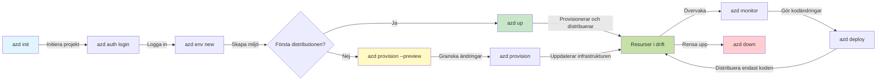
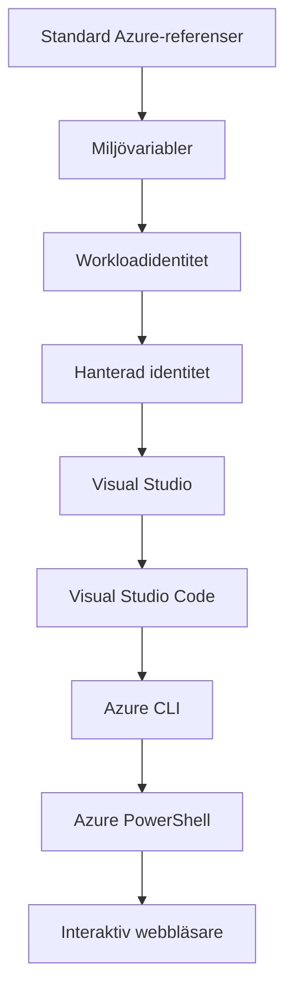

# AZD Basics - Förstå Azure Developer CLI

# AZD Basics - Kärnkoncept och grundläggande principer

**Chapter Navigation:**
- **📚 Course Home**: [AZD For Beginners](../../README.md)
- **📖 Current Chapter**: Chapter 1 - Foundation & Quick Start
- **⬅️ Previous**: [Course Overview](../../README.md#-chapter-1-foundation--quick-start)
- **➡️ Next**: [Installation & Setup](installation.md)
- **🚀 Next Chapter**: [Chapter 2: AI-First Development](../chapter-02-ai-development/microsoft-foundry-integration.md)

## Introduction

Denna lektion introducerar dig till Azure Developer CLI (azd), ett kraftfullt kommandoradsverktyg som påskyndar din resa från lokal utveckling till distribution på Azure. Du får lära dig grundläggande koncept, kärnfunktioner och förstå hur azd förenklar deployment av molnnativa applikationer.

## Learning Goals

I slutet av denna lektion kommer du att:
- Förstå vad Azure Developer CLI är och dess huvudsakliga syfte
- Lära dig kärnkoncepten kring mallar, miljöer och tjänster
- Utforska nyckelfunktioner inklusive mallstyrd utveckling och Infrastructure as Code
- Förstå azd-projektstrukturen och arbetsflödet
- Vara förberedd för att installera och konfigurera azd för din utvecklingsmiljö

## Learning Outcomes

Efter att ha slutfört denna lektion kommer du att kunna:
- Förklara azd:s roll i moderna molnutvecklingsarbetsflöden
- Identifiera komponenterna i en azd-projektstruktur
- Beskriva hur mallar, miljöer och tjänster fungerar tillsammans
- Förstå fördelarna med Infrastructure as Code med azd
- Känna igen olika azd-kommandon och deras syften

## What is Azure Developer CLI (azd)?

Azure Developer CLI (azd) är ett kommandoradsverktyg utformat för att påskynda din resa från lokal utveckling till distribution på Azure. Det förenklar processen att bygga, distribuera och hantera molnnativa applikationer på Azure.

### 🎯 Varför använda AZD? En verklig jämförelse

Låt oss jämföra distribution av en enkel webbapp med databas:

#### ❌ UTAN AZD: Manuell Azure-distribution (30+ minuter)

```bash
# Steg 1: Skapa resursgrupp
az group create --name myapp-rg --location eastus

# Steg 2: Skapa App Service-plan
az appservice plan create --name myapp-plan \
  --resource-group myapp-rg \
  --sku B1 --is-linux

# Steg 3: Skapa webbapp
az webapp create --name myapp-web-unique123 \
  --resource-group myapp-rg \
  --plan myapp-plan \
  --runtime "NODE:18-lts"

# Steg 4: Skapa Cosmos DB-konto (10-15 minuter)
az cosmosdb create --name myapp-cosmos-unique123 \
  --resource-group myapp-rg \
  --kind MongoDB

# Steg 5: Skapa databas
az cosmosdb mongodb database create \
  --account-name myapp-cosmos-unique123 \
  --resource-group myapp-rg \
  --name tododb

# Steg 6: Skapa kollektion
az cosmosdb mongodb collection create \
  --account-name myapp-cosmos-unique123 \
  --resource-group myapp-rg \
  --database-name tododb \
  --name todos

# Steg 7: Hämta anslutningssträng
CONN_STR=$(az cosmosdb keys list \
  --name myapp-cosmos-unique123 \
  --resource-group myapp-rg \
  --type connection-strings \
  --query "connectionStrings[0].connectionString" -o tsv)

# Steg 8: Konfigurera appinställningar
az webapp config appsettings set \
  --name myapp-web-unique123 \
  --resource-group myapp-rg \
  --settings MONGODB_URI="$CONN_STR"

# Steg 9: Aktivera loggning
az webapp log config --name myapp-web-unique123 \
  --resource-group myapp-rg \
  --application-logging filesystem \
  --detailed-error-messages true

# Steg 10: Ställ in Application Insights
az monitor app-insights component create \
  --app myapp-insights \
  --location eastus \
  --resource-group myapp-rg

# Steg 11: Länka Application Insights till webbappen
INSTRUMENTATION_KEY=$(az monitor app-insights component show \
  --app myapp-insights \
  --resource-group myapp-rg \
  --query "instrumentationKey" -o tsv)

az webapp config appsettings set \
  --name myapp-web-unique123 \
  --resource-group myapp-rg \
  --settings APPINSIGHTS_INSTRUMENTATIONKEY="$INSTRUMENTATION_KEY"

# Steg 12: Bygg applikationen lokalt
npm install
npm run build

# Steg 13: Skapa distributionspaket
zip -r app.zip . -x "*.git*" "node_modules/*"

# Steg 14: Distribuera applikationen
az webapp deployment source config-zip \
  --resource-group myapp-rg \
  --name myapp-web-unique123 \
  --src app.zip

# Steg 15: Vänta och be att det fungerar 🙏
# (Ingen automatisk validering, manuell testning krävs)
```

**Problem:**
- ❌ 15+ kommandon att komma ihåg och köra i rätt ordning
- ❌ 30–45 minuter manuellt arbete
- ❌ Lätt att göra misstag (felstavningar, fel parametrar)
- ❌ Anslutningssträngar exponerade i terminalhistoriken
- ❌ Ingen automatisk återställning om något går fel
- ❌ Svårt att replikera för teammedlemmar
- ❌ Olika varje gång (inte reproducerbart)

#### ✅ MED AZD: Automatisk distribution (5 kommandon, 10–15 minuter)

```bash
# Steg 1: Initiera från en mall
azd init --template todo-nodejs-mongo

# Steg 2: Autentisera
azd auth login

# Steg 3: Skapa en miljö
azd env new dev

# Steg 4: Förhandsgranska ändringar (valfritt men rekommenderas)
azd provision --preview

# Steg 5: Distribuera allt
azd up

# ✨ Klart! Allt är distribuerat, konfigurerat och övervakat
```

**Fördelar:**
- ✅ **5 kommandon** vs. 15+ manuella steg
- ✅ **10–15 minuter** total tid (mest väntetid mot Azure)
- ✅ **Noll fel** - automatiserat och testat
- ✅ **Hemligheter hanteras säkert** via Key Vault
- ✅ **Automatisk återställning** vid fel
- ✅ **Fullt reproducerbar** - samma resultat varje gång
- ✅ **Redo för teamet** - vem som helst kan distribuera med samma kommandon
- ✅ **Infrastructure as Code** - versionskontrollerade Bicep-mallar
- ✅ **Inbyggd övervakning** - Application Insights konfigureras automatiskt

### 📊 Tids- och felreduktion

| Metric | Manual Deployment | AZD Deployment | Improvement |
|:-------|:------------------|:---------------|:------------|
| **Commands** | 15+ | 5 | 67% färre |
| **Time** | 30-45 min | 10-15 min | 60% snabbare |
| **Error Rate** | ~40% | <5% | 88% minskning |
| **Consistency** | Low (manual) | 100% (automated) | Perfekt |
| **Team Onboarding** | 2-4 hours | 30 minutes | 75% snabbare |
| **Rollback Time** | 30+ min (manual) | 2 min (automated) | 93% snabbare |

## Core Concepts

### Templates
Mallar är grunden i azd. De innehåller:
- **Application code** - Din källkod och beroenden
- **Infrastructure definitions** - Azure-resurser definierade i Bicep eller Terraform
- **Configuration files** - Inställningar och miljövariabler
- **Deployment scripts** - Automatiserade deploy-flöden

### Environments
Miljöer representerar olika deploymentsmål:
- **Development** - För test och utveckling
- **Staging** - Förproduktionsmiljö
- **Production** - Live-produktionsmiljö

Varje miljö upprätthåller sina egna:
- Azure resource group
- Konfigurationsinställningar
- Deploy-status

### Services
Tjänster är byggstenarna i din applikation:
- **Frontend** - Webbapplikationer, SPA:er
- **Backend** - API:er, mikrotjänster
- **Database** - Databaser och lagringslösningar
- **Storage** - Fil- och blob-lagring

## Key Features

### 1. Template-Driven Development
```bash
# Bläddra bland tillgängliga mallar
azd template list

# Initiera från en mall
azd init --template <template-name>
```

### 2. Infrastructure as Code
- **Bicep** - Azures domänspecifika språk
- **Terraform** - Multi-cloud infrastrukturverktyg
- **ARM Templates** - Azure Resource Manager-mallar

### 3. Integrated Workflows
```bash
# Fullständigt distributionsarbetsflöde
azd up            # Provision + Deploy — detta sker utan manuell inblandning vid första installationen

# 🧪 NYTT: Förhandsgranska infrastruktursändringar innan distribution (SÄKERT)
azd provision --preview    # Simulera distribution av infrastrukturen utan att göra ändringar

azd provision     # Skapa Azure-resurser — använd detta om du uppdaterar infrastrukturen
azd deploy        # Distribuera applikationskod eller distribuera om applikationskoden efter uppdatering
azd down          # Rensa upp resurser
```

#### 🛡️ Säker infrastrukturplanering med förhandsgranskning
Kommandot `azd provision --preview` är en game-changer för säkra distributioner:
- **Torrkörningsanalys** - Visar vad som kommer att skapas, ändras eller tas bort
- **Ingen risk** - Inga faktiska ändringar görs i din Azure-miljö
- **Team-samarbete** - Dela förhandsgranskningsresultat innan distribution
- **Kostnadsuppskattning** - Förstå resurskostnader innan åtagande

```bash
# Exempel på förhandsgranskningsarbetsflöde
azd provision --preview           # Se vad som kommer att ändras
# Granska resultatet, diskutera med teamet
azd provision                     # Tillämpa ändringarna med självförtroende
```

### 📊 Visuellt: AZD-utvecklingsarbetsflöde


**Arbetsflödesförklaring:**
1. **Init** - Starta med en mall eller nytt projekt
2. **Auth** - Autentisera mot Azure
3. **Environment** - Skapa isolerad deploy-miljö
4. **Preview** - 🆕 Förhandsgranska alltid infrastrukturförändringar först (säker praxis)
5. **Provision** - Skapa/uppdatera Azure-resurser
6. **Deploy** - Tryck upp din applikationskod
7. **Monitor** - Övervaka applikationens prestanda
8. **Iterate** - Gör ändringar och deploya om koden
9. **Cleanup** - Ta bort resurser när du är klar

### 4. Environment Management
```bash
# Skapa och hantera miljöer
azd env new <environment-name>
azd env select <environment-name>
azd env list
```

## 📁 Project Structure

En typisk azd-projektstruktur:
```
my-app/
├── .azd/                    # azd configuration
│   └── config.json
├── .azure/                  # Azure deployment artifacts
├── .devcontainer/          # Development container config
├── .github/workflows/      # GitHub Actions
├── .vscode/               # VS Code settings
├── infra/                 # Infrastructure code
│   ├── main.bicep        # Main infrastructure template
│   ├── main.parameters.json
│   └── modules/          # Reusable modules
├── src/                  # Application source code
│   ├── api/             # Backend services
│   └── web/             # Frontend application
├── azure.yaml           # azd project configuration
└── README.md
```

## 🔧 Configuration Files

### azure.yaml
Huvudprojektets konfigurationsfil:
```yaml
name: my-awesome-app
metadata:
  template: my-template@1.0.0

services:
  web:
    project: ./src/web
    language: js
    host: appservice
  api:
    project: ./src/api
    language: js
    host: appservice

hooks:
  preprovision:
    shell: pwsh
    run: echo "Preparing to provision..."
```

### .azure/config.json
Miljöspecifik konfiguration:
```json
{
  "version": 1,
  "defaultEnvironment": "dev",
  "environments": {
    "dev": {
      "subscriptionId": "your-subscription-id",
      "location": "eastus"
    }
  }
}
```

## 🎪 Vanliga arbetsflöden med praktiska övningar

> **💡 Learning Tip:** Följ dessa övningar i ordning för att bygga upp dina AZD-kunskaper stegvis.

### 🎯 Exercise 1: Initialize Your First Project

**Goal:** Skapa ett AZD-projekt och utforska dess struktur

**Steps:**
```bash
# Använd en beprövad mall
azd init --template todo-nodejs-mongo

# Utforska de genererade filerna
ls -la  # Visa alla filer inklusive dolda

# Viktiga filer som skapats:
# - azure.yaml (huvudkonfiguration)
# - infra/ (infrastrukturkod)
# - src/ (applikationskod)
```

**✅ Success:** Du har azure.yaml, infra/, och src/ kataloger

---

### 🎯 Exercise 2: Deploy to Azure

**Goal:** Slutför end-to-end distribution

**Steps:**
```bash
# 1. Autentisera
az login && azd auth login

# 2. Skapa miljö
azd env new dev
azd env set AZURE_LOCATION eastus

# 3. Förhandsgranska ändringar (REKOMMENDERAS)
azd provision --preview

# 4. Distribuera allt
azd up

# 5. Verifiera distributionen
azd show    # Visa din apps URL
```

**Expected Time:** 10-15 minutes  
**✅ Success:** Applikationens URL öppnas i webbläsaren

---

### 🎯 Exercise 3: Multiple Environments

**Goal:** Distribuera till dev och staging

**Steps:**
```bash
# Har redan dev, skapa staging
azd env new staging
azd env set AZURE_LOCATION westus2
azd up

# Växla mellan dem
azd env list
azd env select dev
```

**✅ Success:** Två separata resursgrupper i Azure-portalen

---

### 🛡️ Clean Slate: `azd down --force --purge`

När du behöver återställa helt:

```bash
azd down --force --purge
```

**Vad det gör:**
- `--force`: Inga bekräftelseuppmaningar
- `--purge`: Tar bort all lokal state och Azure-resurser

**Använd när:**
- Deployment misslyckades mitt i processen
- Byter projekt
- Behöver en nystart

---

## 🎪 Original Workflow Reference

### Starting a New Project
```bash
# Metod 1: Använd befintlig mall
azd init --template todo-nodejs-mongo

# Metod 2: Börja från början
azd init

# Metod 3: Använd aktuell katalog
azd init .
```

### Development Cycle
```bash
# Ställ in utvecklingsmiljön
azd auth login
azd env new dev
azd env select dev

# Distribuera allt
azd up

# Gör ändringar och distribuera igen
azd deploy

# Rensa upp när du är klar
azd down --force --purge # kommandot i Azure Developer CLI är en **fullständig återställning** för din miljö—särskilt användbart när du felsöker misslyckade distributioner, rensar upp föräldralösa resurser eller förbereder för en ny distribution.
```

## Understanding `azd down --force --purge`
Kommandot `azd down --force --purge` är ett kraftfullt sätt att fullständigt riva ner din azd-miljö och alla associerade resurser. Här är en genomgång av vad varje flagga gör:
```
--force
```
- Hoppar över bekräftelseuppmaningar.
- Användbart för automatisering eller skriptning där manuell inmatning inte är möjlig.
- Säkerställer att nerrivningen fortsätter utan avbrott, även om CLI:n upptäcker inkonsekvenser.

```
--purge
```
Tar bort **all associerad metadata**, inklusive:
Environment state
Lokal `.azure` mapp
Cachelagrad distributionsinformation
Förhindrar att azd "kommer ihåg" tidigare distributioner, vilket kan orsaka problem som felmatchade resursgrupper eller föråldrade registerreferenser.


### Varför använda båda?
När du kört fast med `azd up` på grund av kvarvarande state eller partiella distributioner, säkerställer denna kombination en **ren start**.

Det är särskilt hjälpsamt efter manuella resursborttagningar i Azure-portalen eller när du byter mallar, miljöer eller konventioner för namngivning av resursgrupper.


### Hantera flera miljöer
```bash
# Skapa stagingmiljö
azd env new staging
azd env select staging
azd up

# Byt tillbaka till dev
azd env select dev

# Jämför miljöer
azd env list
```

## 🔐 Authentication and Credentials

Att förstå autentisering är avgörande för lyckade azd-distributioner. Azure använder flera autentiseringsmetoder, och azd utnyttjar samma credential chain som andra Azure-verktyg.

### Azure CLI Authentication (`az login`)

Innan du använder azd behöver du autentisera mot Azure. Den vanligaste metoden är att använda Azure CLI:

```bash
# Interaktiv inloggning (öppnar en webbläsare)
az login

# Logga in med specifik tenant
az login --tenant <tenant-id>

# Logga in med serviceprincipal
az login --service-principal -u <app-id> -p <password> --tenant <tenant-id>

# Kontrollera aktuell inloggningsstatus
az account show

# Lista tillgängliga prenumerationer
az account list --output table

# Ange standardprenumeration
az account set --subscription <subscription-id>
```

### Authentication Flow
1. **Interactive Login**: Öppnar din standardwebbläsare för autentisering
2. **Device Code Flow**: För miljöer utan webbläsaråtkomst
3. **Service Principal**: För automatisering och CI/CD-scenarier
4. **Managed Identity**: För Azure-hostade applikationer

### DefaultAzureCredential Chain

`DefaultAzureCredential` är en credential-typ som erbjuder en förenklad autentiseringsupplevelse genom att automatiskt försöka flera credential-källor i en viss ordning:

#### Credential Chain Order

#### 1. Environment Variables
```bash
# Ställ in miljövariabler för service principal
export AZURE_CLIENT_ID="<app-id>"
export AZURE_CLIENT_SECRET="<password>"
export AZURE_TENANT_ID="<tenant-id>"
```

#### 2. Workload Identity (Kubernetes/GitHub Actions)
Används automatiskt i:
- Azure Kubernetes Service (AKS) med Workload Identity
- GitHub Actions med OIDC-federation
- Andra federerade identitetsscenarier

#### 3. Managed Identity
För Azure-resurser som:
- Virtuella maskiner
- App Service
- Azure Functions
- Container Instances

```bash
# Kontrollera om den körs på en Azure-resurs med hanterad identitet
az account show --query "user.type" --output tsv
# Returnerar: "servicePrincipal" om hanterad identitet används
```

#### 4. Developer Tools Integration
- **Visual Studio**: Använder automatiskt inloggad konto
- **VS Code**: Använder Azure Account-extension-kredentialer
- **Azure CLI**: Använder `az login`-kredentialer (vanligast för lokal utveckling)

### AZD Authentication Setup

```bash
# Metod 1: Använd Azure CLI (Rekommenderas för utveckling)
az login
azd auth login  # Använder befintliga Azure CLI-autentiseringsuppgifter

# Metod 2: Direkt azd-autentisering
azd auth login --use-device-code  # För headless-miljöer

# Metod 3: Kontrollera autentiseringsstatus
azd auth login --check-status

# Metod 4: Logga ut och autentisera igen
azd auth logout
azd auth login
```

### Authentication Best Practices

#### For Local Development
```bash
# 1. Logga in med Azure CLI
az login

# 2. Verifiera att du har rätt prenumeration
az account show
az account set --subscription "Your Subscription Name"

# 3. Använd azd med befintliga inloggningsuppgifter
azd auth login
```

#### For CI/CD Pipelines
```yaml
# GitHub Actions example
- name: Azure Login
  uses: azure/login@v1
  with:
    creds: ${{ secrets.AZURE_CREDENTIALS }}

- name: Deploy with azd
  run: |
    azd auth login --client-id ${{ secrets.AZURE_CLIENT_ID }} \
                    --client-secret ${{ secrets.AZURE_CLIENT_SECRET }} \
                    --tenant-id ${{ secrets.AZURE_TENANT_ID }}
    azd up --no-prompt
```

#### For Production Environments
- Använd **Managed Identity** när du kör på Azure-resurser
- Använd **Service Principal** för automatiseringsscenarier
- Undvik att lagra credentialer i kod eller konfigurationsfiler
- Använd **Azure Key Vault** för känslig konfiguration

### Vanliga autentiseringsproblem och lösningar

#### Issue: "No subscription found"
```bash
# Lösning: Ange standardprenumeration
az account list --output table
az account set --subscription "<subscription-id>"
azd env set AZURE_SUBSCRIPTION_ID "<subscription-id>"
```

#### Issue: "Insufficient permissions"
```bash
# Lösning: Kontrollera och tilldela nödvändiga roller
az role assignment list --assignee $(az account show --query user.name --output tsv)

# Vanliga nödvändiga roller:
# - Contributor (för resurshantering)
# - User Access Administrator (för rolltilldelningar)
```

#### Issue: "Token expired"
```bash
# Lösning: Autentisera igen
az logout
az login
azd auth logout
azd auth login
```

### Authentication i olika scenarier

#### Local Development
```bash
# Konto för personlig utveckling
az login
azd auth login
```

#### Team Development
```bash
# Använd en specifik tenant för organisationen
az login --tenant contoso.onmicrosoft.com
azd auth login
```

#### Multi-tenant Scenarios
```bash
# Växla mellan hyresgäster
az login --tenant tenant1.onmicrosoft.com
# Driftsätt till hyresgäst 1
azd up

az login --tenant tenant2.onmicrosoft.com  
# Driftsätt till hyresgäst 2
azd up
```

### Säkerhetsöverväganden

1. **Credential Storage**: Lagra aldrig credentails i källkoden
2. **Scope Limitation**: Använd principen om minsta privilegium för service principals
3. **Token Rotation**: Rotera regelbundet service principal-hemligheter
4. **Audit Trail**: Övervaka autentiserings- och deploy-aktiviteter
5. **Network Security**: Använd privata endpoints när det är möjligt

### Felsökning av autentisering

```bash
# Felsök autentiseringsproblem
azd auth login --check-status
az account show
az account get-access-token

# Vanliga diagnostiska kommandon
whoami                          # Aktuell användarkontext
az ad signed-in-user show      # Azure AD-användardetaljer
az group list                  # Testa resursåtkomst
```

## Understanding `azd down --force --purge`

### Discovery
```bash
azd template list              # Bläddra bland mallar
azd template show <template>   # Detaljer om mallen
azd init --help               # Initieringsalternativ
```

### Project Management
```bash
azd show                     # Projektöversikt
azd env show                 # Aktuell miljö
azd config list             # Konfigurationsinställningar
```

### Monitoring
```bash
azd monitor                  # Öppna övervakningen i Azure-portalen
azd monitor --logs           # Visa applikationsloggar
azd monitor --live           # Visa realtidsmetrik
azd pipeline config          # Konfigurera CI/CD
```

## Best Practices

### 1. Use Meaningful Names
```bash
# Bra
azd env new production-east
azd init --template web-app-secure

# Undvik
azd env new env1
azd init --template template1
```

### 2. Leverage Templates
- Börja med befintliga mallar
- Anpassa efter dina behov
- Skapa återanvändbara mallar för din organisation

### 3. Environment Isolation
- Använd separata miljöer för dev/staging/prod
- Distribuera aldrig direkt till produktion från en lokal maskin
- Använd CI/CD-pipelines för produktionsdistributioner

### 4. Configuration Management
- Använd miljövariabler för känsliga data
- Håll konfiguration i versionskontroll
- Dokumentera miljöspecifika inställningar

## Learning Progression

### Beginner (Week 1-2)
1. Installera azd och autentisera
2. Distribuera en enkel mall
3. Förstå projektstruktur
4. Lära dig grundläggande kommandon (up, down, deploy)

### Intermediate (Week 3-4)
1. Anpassa mallar
2. Hantera flera miljöer
3. Förstå infrastrukturkod
4. Sätt upp CI/CD-pipelines

### Advanced (Week 5+)
1. Skapa egna mallar
2. Avancerade infrastrukturmönster
3. Multi-region distributioner
4. Företagsklasskonfigurationer

## Next Steps

**📖 Continue Chapter 1 Learning:**
- [Installation och konfiguration](installation.md) - Få azd installerat och konfigurerat
- [Ditt första projekt](first-project.md) - Komplett praktisk handledning
- [Konfigurationsguide](configuration.md) - Avancerade konfigurationsalternativ

**🎯 Redo för nästa kapitel?**
- [Kapitel 2: AI-först utveckling](../chapter-02-ai-development/microsoft-foundry-integration.md) - Börja bygga AI-applikationer

## Ytterligare resurser

- [Översikt över Azure Developer CLI](https://learn.microsoft.com/en-us/azure/developer/azure-developer-cli/)
- [Mallgalleri](https://azure.github.io/awesome-azd/)
- [Gemenskapsexempel](https://github.com/Azure-Samples)

---

## 🙋 Vanliga frågor

### Allmänna frågor

**Q: Vad är skillnaden mellan AZD och Azure CLI?**

A: Azure CLI (`az`) används för att hantera individuella Azure-resurser. AZD (`azd`) används för att hantera hela applikationer:

```bash
# Azure CLI - Resurshantering på låg nivå
az webapp create --name myapp --resource-group rg
az sql server create --name myserver --resource-group rg
# ...många fler kommandon behövs

# AZD - Hantering på applikationsnivå
azd up  # Distribuerar hela appen med alla resurser
```

**Tänk på det så här:**
- `az` = Arbeta med enskilda Legobitar
- `azd` = Arbeta med kompletta Legoset

---

**Q: Behöver jag kunna Bicep eller Terraform för att använda AZD?**

A: Nej! Börja med mallar:
```bash
# Använd befintlig mall - ingen kunskap om IaC krävs
azd init --template todo-nodejs-mongo
azd up
```

Du kan lära dig Bicep senare för att anpassa infrastrukturen. Mallar ger fungerande exempel att lära sig av.

---

**Q: Hur mycket kostar det att köra AZD-mallar?**

A: Kostnaderna varierar per mall. De flesta utvecklingsmallar kostar 50–150 USD/månad:

```bash
# Förhandsgranska kostnader innan du distribuerar
azd provision --preview

# Rensa alltid upp när du inte använder den
azd down --force --purge  # Tar bort alla resurser
```

**Proffstips:** Använd gratisnivåer där det är möjligt:
- App Service: F1 (Gratisnivå)
- Azure OpenAI: 50,000 tokens/månad gratis
- Cosmos DB: 1000 RU/s gratisnivå

---

**Q: Kan jag använda AZD med befintliga Azure-resurser?**

A: Ja, men det är enklare att börja från början. AZD fungerar bäst när det hanterar hela livscykeln. För befintliga resurser:

```bash
# Alternativ 1: Importera befintliga resurser (avancerat)
azd init
# Ändra sedan infra/ för att referera till befintliga resurser

# Alternativ 2: Börja om från början (rekommenderas)
azd init --template matching-your-stack
azd up  # Skapar en ny miljö
```

---

**Q: Hur delar jag mitt projekt med lagkamrater?**

A: Commit:a AZD-projektet till Git (men INTE .azure-mappen):

```bash
# Redan i .gitignore som standard
.azure/        # Innehåller hemligheter och miljödata
*.env          # Miljövariabler

# Dåvarande teammedlemmar:
git clone <your-repo>
azd auth login
azd env new <their-name>-dev
azd up
```

Alla får identisk infrastruktur från samma mallar.

---

### Felsökningsfrågor

**Q: "azd up" misslyckades halvvägs. Vad gör jag?**

A: Kontrollera felet, åtgärda det och försök igen:

```bash
# Visa detaljerade loggar
azd show

# Vanliga åtgärder:

# 1. Om kvoten överskrids:
azd env set AZURE_LOCATION "westus2"  # Försök en annan region

# 2. Om resursnamnskonflikt:
azd down --force --purge  # Börja om från början
azd up  # Försök igen

# 3. Om autentiseringen har gått ut:
az login
azd auth login
azd up
```

**Vanligaste problemet:** Fel Azure-prenumeration vald
```bash
az account list --output table
az account set --subscription "<correct-subscription>"
```

---

**Q: Hur distribuerar jag bara kodändringar utan att reprovisionera?**

A: Använd `azd deploy` istället för `azd up`:

```bash
azd up          # Första gången: provisionera + distribuera (långsamt)

# Gör kodändringar...

azd deploy      # Efterföljande gånger: distribuera endast (snabbt)
```

Hastighetsjämförelse:
- `azd up`: 10–15 minuter (provisionerar infrastruktur)
- `azd deploy`: 2–5 minuter (endast kod)

---

**Q: Kan jag anpassa infrastruktur-mallarna?**

A: Ja! Redigera Bicep-filerna i `infra/`:

```bash
# Efter azd init
cd infra/
code main.bicep  # Redigera i VS Code

# Förhandsgranska ändringar
azd provision --preview

# Tillämpa ändringar
azd provision
```

**Tips:** Börja smått - ändra SKUs först:
```bicep
// infra/main.bicep
sku: {
  name: 'B1'  // Change to 'P1V2' for production
}
```

---

**Q: Hur tar jag bort allt som AZD skapade?**

A: Ett kommando tar bort alla resurser:

```bash
azd down --force --purge

# Detta tar bort:
# - Alla Azure-resurser
# - Resursgrupp
# - Lokal miljöstatus
# - Cachelagrade distributionsdata
```

**Kör alltid detta när:**
- Färdig med att testa en mall
- Växlar till ett annat projekt
- Vill börja om från början

**Kostnadsbesparing:** Att ta bort oanvända resurser = $0 i kostnader

---

**Q: Vad händer om jag av misstag raderade resurser i Azure-portalen?**

A: AZD-tillstånd kan hamna ur synk. Tillvägagångssätt för en ren start:

```bash
# 1. Ta bort lokalt tillstånd
azd down --force --purge

# 2. Börja om
azd up

# Alternativ: Låt AZD upptäcka och åtgärda
azd provision  # Kommer att skapa saknade resurser
```

---

### Avancerade frågor

**Q: Kan jag använda AZD i CI/CD-pipelines?**

A: Ja! Exempel med GitHub Actions:

```yaml
# .github/workflows/deploy.yml
name: Deploy with AZD

on:
  push:
    branches: [main]

jobs:
  deploy:
    runs-on: ubuntu-latest
    steps:
      - uses: actions/checkout@v2
      
      - name: Install azd
        run: curl -fsSL https://aka.ms/install-azd.sh | bash
      
      - name: Azure Login
        run: |
          azd auth login \
            --client-id ${{ secrets.AZURE_CLIENT_ID }} \
            --client-secret ${{ secrets.AZURE_CLIENT_SECRET }} \
            --tenant-id ${{ secrets.AZURE_TENANT_ID }}
      
      - name: Deploy
        run: azd up --no-prompt
```

---

**Q: Hur hanterar jag hemligheter och känslig data?**

A: AZD integreras automatiskt med Azure Key Vault:

```bash
# Hemligheter lagras i Key Vault, inte i koden
azd env set DATABASE_PASSWORD "$(openssl rand -base64 32)"

# AZD automatiskt:
# 1. Skapar Key Vault
# 2. Lagrar hemlighet
# 3. Ger appen åtkomst via hanterad identitet
# 4. Injicerar vid körning
```

**Begå aldrig:**
- `.azure/`-mappen (innehåller miljödata)
- `.env`-filer (lokala hemligheter)
- Anslutningssträngar

---

**Q: Kan jag distribuera till flera regioner?**

A: Ja, skapa en miljö per region:

```bash
# Östra USA-miljö
azd env new prod-eastus
azd env set AZURE_LOCATION eastus
azd up

# Västra Europa-miljö
azd env new prod-westeurope
azd env set AZURE_LOCATION westeurope
azd up

# Varje miljö är oberoende
azd env list
```

För verkliga multi-region-appar, anpassa Bicep-mallarna för att distribuera till flera regioner samtidigt.

---

**Q: Var kan jag få hjälp om jag fastnar?**

1. **AZD-dokumentation:** https://learn.microsoft.com/azure/developer/azure-developer-cli/
2. **GitHub-ärenden:** https://github.com/Azure/azure-dev/issues
3. **Discord:** [Azure Discord](https://discord.gg/microsoft-azure) - kanalen #azure-developer-cli
4. **Stack Overflow:** Använd taggen `azure-developer-cli`
5. **Denna kurs:** [Felsökningsguide](../chapter-07-troubleshooting/common-issues.md)

**Proffstips:** Innan du frågar, kör:
```bash
azd show       # Visar aktuellt tillstånd
azd version    # Visar din version
```
Inkludera denna information i din fråga för snabbare hjälp.

---

## 🎓 Vad händer härnäst?

Du förstår nu AZD-grunderna. Välj din väg:

### 🎯 För nybörjare:
1. **Nästa:** [Installation och konfiguration](installation.md) - Installera AZD på din dator
2. **Sedan:** [Ditt första projekt](first-project.md) - Distribuera din första app
3. **Öva:** Slutför alla 3 övningar i denna lektion

### 🚀 För AI-utvecklare:
1. **Hoppa till:** [Kapitel 2: AI-först utveckling](../chapter-02-ai-development/microsoft-foundry-integration.md)
2. **Distribuera:** Börja med `azd init --template get-started-with-ai-chat`
3. **Lär dig:** Bygg medan du distribuerar

### 🏗️ För erfarna utvecklare:
1. **Granska:** [Konfigurationsguide](configuration.md) - Avancerade inställningar
2. **Utforska:** [Infrastruktur som kod](../chapter-04-infrastructure/provisioning.md) - Djupdykning i Bicep
3. **Bygg:** Skapa egna mallar för din stack

---

**Kapitelnavigering:**
- **📚 Kursstartsida**: [AZD för nybörjare](../../README.md)
- **📖 Aktuellt kapitel**: Kapitel 1 - Grund & Snabbstart  
- **⬅️ Föregående**: [Kursöversikt](../../README.md#-chapter-1-foundation--quick-start)
- **➡️ Nästa**: [Installation och konfiguration](installation.md)
- **🚀 Nästa kapitel**: [Kapitel 2: AI-först utveckling](../chapter-02-ai-development/microsoft-foundry-integration.md)

---

<!-- CO-OP TRANSLATOR DISCLAIMER START -->
Ansvarsfriskrivning:
Detta dokument har översatts med hjälp av AI-översättningstjänsten Co-op Translator (https://github.com/Azure/co-op-translator). Även om vi strävar efter noggrannhet, observera att automatiska översättningar kan innehålla fel eller brister. Originaldokumentet på sitt ursprungliga språk ska betraktas som den auktoritativa källan. För kritisk information rekommenderas professionell översättning utförd av en människa. Vi ansvarar inte för några missförstånd eller feltolkningar som uppstår vid användning av denna översättning.
<!-- CO-OP TRANSLATOR DISCLAIMER END -->