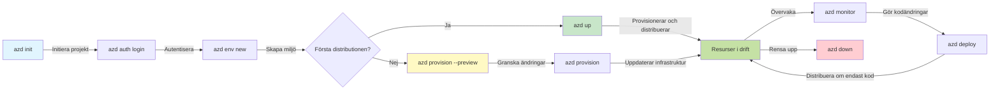
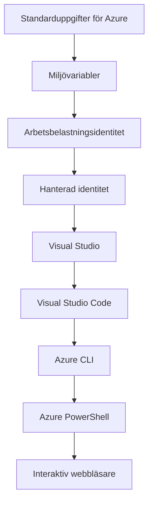

# AZD-grunder - Förstå Azure Developer CLI

# AZD-grunder - Kärnkoncept och grunderna

**Kapitelnavigering:**
- **📚 Kursens startsida**: [AZD för nybörjare](../../README.md)
- **📖 Aktuellt kapitel**: Kapitel 1 - Grund & Snabbstart
- **⬅️ Föregående**: [Kursöversikt](../../README.md#-chapter-1-foundation--quick-start)
- **➡️ Nästa**: [Installation och konfiguration](installation.md)
- **🚀 Nästa kapitel**: [Kapitel 2: AI-först utveckling](../chapter-02-ai-development/microsoft-foundry-integration.md)

## Introduktion

Denna lektion introducerar dig till Azure Developer CLI (azd), ett kraftfullt kommandoradsverktyg som påskyndar din resa från lokal utveckling till distribution i Azure. Du kommer att lära dig grundläggande begrepp, kärnfunktioner och förstå hur azd förenklar distribution av molnnativa applikationer.

## Lärandemål

I slutet av denna lektion kommer du att:
- Förstå vad Azure Developer CLI är och dess primära syfte
- Lära dig kärnbegreppen om mallar, miljöer och tjänster
- Utforska nyckelfunktioner inklusive mallstyrd utveckling och Infrastruktur som kod
- Förstå azd-projektstruktur och arbetsflöde
- Vara förberedd att installera och konfigurera azd för din utvecklingsmiljö

## Läranderesultat

Efter att ha slutfört denna lektion kommer du att kunna:
- Förklara azd:s roll i moderna molnutvecklingsarbetsflöden
- Identifiera komponenterna i en azd-projektstruktur
- Beskriva hur mallar, miljöer och tjänster fungerar tillsammans
- Förstå fördelarna med Infrastruktur som Kod med azd
- Känna igen olika azd-kommandon och deras syften

## Vad är Azure Developer CLI (azd)?

Azure Developer CLI (azd) är ett kommandoradsverktyg utformat för att påskynda din resa från lokal utveckling till distribution i Azure. Det förenklar processen att bygga, distribuera och hantera molnnativa applikationer i Azure.

### Vad kan du distribuera med azd?

azd stöder ett brett spektrum av arbetsbelastningar — och listan växer hela tiden. Idag kan du använda azd för att distribuera:

| Typ av arbetsbelastning | Exempel | Samma arbetsflöde? |
|---------------|----------|----------------|
| **Traditionella applikationer** | Webbappar, REST-API:er, statiska webbplatser | ✅ `azd up` |
| **Tjänster och mikrotjänster** | Container Apps, Function Apps, backend med flera tjänster | ✅ `azd up` |
| **AI-drivna applikationer** | Chattappar med Microsoft Foundry-modeller, RAG-lösningar med AI Search | ✅ `azd up` |
| **Intelligenta agenter** | Foundry-hostade agenter, orkestrering av flera agenter | ✅ `azd up` |

Nyckelinsikten är att **azd-livscykeln förblir densamma oavsett vad du distribuerar**. Du initierar ett projekt, provisionerar infrastruktur, distribuerar din kod, övervakar din app och städar upp — oavsett om det är en enkel webbplats eller en sofistikerad AI-agent.

Denna kontinuitet är avsiktlig. azd behandlar AI-funktioner som en annan typ av tjänst som din applikation kan använda, inte som något fundamentalt annorlunda. En chattendpoint som stöds av Microsoft Foundry-modeller är, ur azd:s perspektiv, bara en annan tjänst att konfigurera och distribuera.

### 🎯 Varför använda AZD? En verklighetsbaserad jämförelse

Låt oss jämföra distributionen av en enkel webbapp med databas:

#### ❌ UTAN AZD: Manuell Azure-distribution (30+ minuter)

```bash
# Steg 1: Skapa resursgrupp
az group create --name myapp-rg --location eastus

# Steg 2: Skapa App Service-plan
az appservice plan create --name myapp-plan \
  --resource-group myapp-rg \
  --sku B1 --is-linux

# Steg 3: Skapa webbapp
az webapp create --name myapp-web-unique123 \
  --resource-group myapp-rg \
  --plan myapp-plan \
  --runtime "NODE:18-lts"

# Steg 4: Skapa Cosmos DB-konto (10-15 minuter)
az cosmosdb create --name myapp-cosmos-unique123 \
  --resource-group myapp-rg \
  --kind MongoDB

# Steg 5: Skapa databas
az cosmosdb mongodb database create \
  --account-name myapp-cosmos-unique123 \
  --resource-group myapp-rg \
  --name tododb

# Steg 6: Skapa kollektion
az cosmosdb mongodb collection create \
  --account-name myapp-cosmos-unique123 \
  --resource-group myapp-rg \
  --database-name tododb \
  --name todos

# Steg 7: Hämta anslutningssträng
CONN_STR=$(az cosmosdb keys list \
  --name myapp-cosmos-unique123 \
  --resource-group myapp-rg \
  --type connection-strings \
  --query "connectionStrings[0].connectionString" -o tsv)

# Steg 8: Konfigurera appinställningar
az webapp config appsettings set \
  --name myapp-web-unique123 \
  --resource-group myapp-rg \
  --settings MONGODB_URI="$CONN_STR"

# Steg 9: Aktivera loggning
az webapp log config --name myapp-web-unique123 \
  --resource-group myapp-rg \
  --application-logging filesystem \
  --detailed-error-messages true

# Steg 10: Konfigurera Application Insights
az monitor app-insights component create \
  --app myapp-insights \
  --location eastus \
  --resource-group myapp-rg

# Steg 11: Länka App Insights till webbappen
INSTRUMENTATION_KEY=$(az monitor app-insights component show \
  --app myapp-insights \
  --resource-group myapp-rg \
  --query "instrumentationKey" -o tsv)

az webapp config appsettings set \
  --name myapp-web-unique123 \
  --resource-group myapp-rg \
  --settings APPINSIGHTS_INSTRUMENTATIONKEY="$INSTRUMENTATION_KEY"

# Steg 12: Bygg applikationen lokalt
npm install
npm run build

# Steg 13: Skapa distributionspaket
zip -r app.zip . -x "*.git*" "node_modules/*"

# Steg 14: Distribuera applikationen
az webapp deployment source config-zip \
  --resource-group myapp-rg \
  --name myapp-web-unique123 \
  --src app.zip

# Steg 15: Vänta och hoppas att det fungerar 🙏
# (Ingen automatiserad validering, manuell testning krävs)
```

**Problem:**
- ❌ 15+ kommandon att komma ihåg och köra i ordning
- ❌ 30–45 minuters manuellt arbete
- ❌ Lätt att göra misstag (stavfel, felaktiga parametrar)
- ❌ Anslutningssträngar syns i terminalhistoriken
- ❌ Ingen automatiserad återställning om något misslyckas
- ❌ Svårt att replikera för teammedlemmar
- ❌ Olika varje gång (inte reproducerbart)

#### ✅ MED AZD: Automatiserad distribution (5 kommandon, 10-15 minuter)

```bash
# Steg 1: Initiera från mall
azd init --template todo-nodejs-mongo

# Steg 2: Autentisera
azd auth login

# Steg 3: Skapa miljö
azd env new dev

# Steg 4: Förhandsgranska ändringar (valfritt men rekommenderas)
azd provision --preview

# Steg 5: Distribuera allt
azd up

# ✨ Klart! Allt är distribuerat, konfigurerat och övervakat
```

**Fördelar:**
- ✅ **5 kommandon** vs. 15+ manuella steg
- ✅ **10–15 minuter** totalt (mest väntetid för Azure)
- ✅ **Färre manuella misstag** - konsekvent, mallstyrt arbetsflöde
- ✅ **Säker hantering av hemligheter** - många mallar använder Azure-hanterad hemlighetslagring
- ✅ **Repeterbara distributioner** - samma arbetsflöde varje gång
- ✅ **Fullt reproducerbart** - samma resultat varje gång
- ✅ **Teamklar** - vem som helst kan distribuera med samma kommandon
- ✅ **Infrastructure as Code** - versionshanterade Bicep-mallar
- ✅ **Inbyggd övervakning** - Application Insights konfigureras automatiskt

### 📊 Tids- och felreducering

| Mått | Manuell distribution | AZD-distribution | Förbättring |
|:-------|:------------------|:---------------|:------------|
| **Kommandon** | 15+ | 5 | 67% färre |
| **Tid** | 30–45 min | 10–15 min | 60% snabbare |
| **Felprocent** | ~40% | <5% | 88% minskning |
| **Konsistens** | Låg (manuell) | 100% (automatiserad) | Perfekt |
| **Onboarding för team** | 2–4 timmar | 30 minuter | 75% snabbare |
| **Återställningstid** | 30+ min (manuell) | 2 min (automatiserad) | 93% snabbare |

## Kärnkoncept

### Mallar
Mallar är grunden i azd. De innehåller:
- **Applikationskod** - Din källkod och beroenden
- **Infrastrukturbeskrivningar** - Azure-resurser definierade i Bicep eller Terraform
- **Konfigurationsfiler** - Inställningar och miljövariabler
- **Distributionsskript** - Automatiserade distributionsarbetsflöden

### Miljöer
Miljöer representerar olika distributionsmål:
- **Utveckling** - För test och utveckling
- **Staging** - Förproduktionsmiljö
- **Produktion** - Live-produktionsmiljö

Varje miljö har sin egen:
- Azure-resursgrupp
- Konfigurationsinställningar
- Distribueringsstatus

### Tjänster
Tjänster är byggstenarna i din applikation:
- **Frontend** - Webbapplikationer, SPAs
- **Backend** - API:er, mikrotjänster
- **Databas** - Lagringslösningar för data
- **Lagring** - Fil- och blob-lagring

## Nyckelfunktioner

### 1. Mallstyrd utveckling
```bash
# Bläddra bland tillgängliga mallar
azd template list

# Initiera från en mall
azd init --template <template-name>
```

### 2. Infrastruktur som kod
- **Bicep** - Azures domänspecifika språk
- **Terraform** - Verktyg för multi-cloud-infrastruktur
- **ARM-mallar** - Azure Resource Manager-mallar

### 3. Integrerade arbetsflöden
```bash
# Fullständigt driftsättningsarbetsflöde
azd up            # Provisionera + driftsätt — detta är automatiserat för första uppsättningen

# 🧪 NYTT: Förhandsgranska infrastruktursändringar före driftsättning (SÄKERT)
azd provision --preview    # Simulera driftsättning av infrastruktur utan att göra ändringar

azd provision     # Skapa Azure-resurser, om du uppdaterar infrastrukturen använd detta
azd deploy        # Driftsätt applikationskod eller driftsätt om applikationskoden efter uppdatering
azd down          # Rensa upp resurser
```

#### 🛡️ Säker infrastrukturplanering med förhandsgranskning
Kommandot `azd provision --preview` är en avgörande förbättring för säkra distributioner:
- **Torrkörningsanalys** - Visar vad som kommer att skapas, modifieras eller tas bort
- **Nollrisk** - Inga faktiska ändringar görs i din Azure-miljö
- **Team-samarbete** - Dela förhandsgranskningsresultat innan distribution
- **Kostnadsestimering** - Förstå resurskostnader innan åtagande

```bash
# Exempel på förhandsgranskningsarbetsflöde
azd provision --preview           # Se vad som kommer att ändras
# Granska resultatet, diskutera med teamet
azd provision                     # Genomför ändringarna med förtroende
```

### 📊 Visual: AZD-utvecklingsarbetsflöde



**Arbetsflödesförklaring:**
1. **Init** - Börja med en mall eller ett nytt projekt
2. **Auth** - Autentisera mot Azure
3. **Environment** - Skapa isolerad distributionsmiljö
4. **Preview** - 🆕 Förhandsgranska alltid infrastrukturändringar först (säker praxis)
5. **Provision** - Skapa/uppdatera Azure-resurser
6. **Deploy** - Skicka upp din applikationskod
7. **Monitor** - Övervaka applikationens prestanda
8. **Iterate** - Göra ändringar och distribuera om koden
9. **Cleanup** - Ta bort resurser när arbetet är klart

### 4. Miljöhantering
```bash
# Skapa och hantera miljöer
azd env new <environment-name>
azd env select <environment-name>
azd env list
```

### 5. Tillägg och AI-kommandon

azd använder ett tilläggssystem för att lägga till funktionalitet utöver kärn-CLI:t. Detta är särskilt användbart för AI-arbetsbelastningar:

```bash
# Lista tillgängliga tillägg
azd extension list

# Installera Foundry agents-tillägget
azd extension install azure.ai.agents

# Initiera ett AI-agentprojekt från ett manifest
azd ai agent init -m agent-manifest.yaml

# Testa en driftsatt agent (visar latens och tid till första byte)
azd ai agent invoke

# Starta MCP-servern för AI-assisterad utveckling (Alpha)
azd mcp start
```

**Agentens livscykel, från början till slut.** När du har installerat `azure.ai.agents`, tar ett enda arbetsflöde dig från idé till en körande, övervakad agent. Du behöver inte alla dessa dag ett — bara veta att de finns:

| Steg | Kommando | Vad det gör |
|-------|---------|--------------|
| **Scaffold** | `azd ai agent init -m <manifest>` | Generera ett agentprojekt från ett manifest |
| **Test** | `azd ai agent invoke` | Anropa agenten och se responstider |
| **Mät** | `azd ai agent eval generate` | Skapa en utvärderingsdataset för agenten |
| **Förbättra** | `azd ai agent optimize` | Optimera agentinstruktioner mot dina data |
| **Inspektera** | `azd ai agent endpoint show` | Visa den levande ändpunktens konfiguration |
| **Rensa upp** | `azd ai agent delete` | Radera en hostad agent och alla dess versioner |

> Tillägg behandlas i detalj i [Kapitel 2: AI-först utveckling](../chapter-02-ai-development/agents.md) och referensen [AZD AI CLI-kommandon](../chapter-08-production/production-ai-practices.md#azd-ai-cli-commands-and-extensions).

## 📁 Projektstruktur

En typisk azd-projektstruktur:
```
my-app/
├── .azd/                    # azd configuration
│   └── config.json
├── .azure/                  # Azure deployment artifacts
├── .devcontainer/          # Development container config
├── .github/workflows/      # GitHub Actions
├── .vscode/               # VS Code settings
├── infra/                 # Infrastructure code
│   ├── main.bicep        # Main infrastructure template
│   ├── main.parameters.json
│   └── modules/          # Reusable modules
├── src/                  # Application source code
│   ├── api/             # Backend services
│   └── web/             # Frontend application
├── azure.yaml           # azd project configuration
└── README.md
```

## 🔧 Konfigurationsfiler

### azure.yaml
Huvudkonfigurationsfilen för projektet:
```yaml
name: my-awesome-app
metadata:
  template: my-template@1.0.0

services:
  web:
    project: ./src/web
    language: js
    host: appservice
  api:
    project: ./src/api
    language: js
    host: appservice

hooks:
  preprovision:
    shell: pwsh
    run: echo "Preparing to provision..."
```

### .azure/config.json
Miljöspecifik konfiguration:
```json
{
  "version": 1,
  "defaultEnvironment": "dev",
  "environments": {
    "dev": {
      "subscriptionId": "your-subscription-id",
      "location": "eastus"
    }
  }
}
```

## 🎪 Vanliga arbetsflöden med praktiska övningar

> **💡 Lärandetips:** Följ dessa övningar i ordning för att gradvis bygga dina AZD-färdigheter.

### 🎯 Övning 1: Initiera ditt första projekt

**Mål:** Skapa ett AZD-projekt och utforska dess struktur

**Steg:**
```bash
# Använd en beprövad mall
azd init --template todo-nodejs-mongo

# Utforska de genererade filerna
ls -la  # Visa alla filer, inklusive dolda

# Viktiga filer som skapats:
# - azure.yaml (huvudkonfiguration)
# - infra/ (infrastrukturkod)
# - src/ (applikationskod)
```

**✅ Lyckat:** Du har azure.yaml, infra/, och src/ kataloger

---

### 🎯 Övning 2: Distribuera till Azure

**Mål:** Slutför end-to-end-distributionen

**Steg:**
```bash
# 1. Autentisera
az login && azd auth login

# 2. Skapa miljö
azd env new dev
azd env set AZURE_LOCATION eastus

# 3. Förhandsgranska ändringar (REKOMMENDERAS)
azd provision --preview

# 4. Distribuera allt
azd up

# 5. Verifiera distributionen
azd show    # Visa din app-URL
```

**Beräknad tid:** 10–15 minuter  
**✅ Lyckat:** Applikationens URL öppnas i webbläsaren

---

### 🎯 Övning 3: Flera miljöer

**Mål:** Distribuera till dev och staging

**Steg:**
```bash
# Har redan dev, skapa staging
azd env new staging
azd env set AZURE_LOCATION westus2
azd up

# Växla mellan dem
azd env list
azd env select dev
```

**✅ Lyckat:** Två separata resursgrupper i Azure-portalen

---

### 🛡️ Ren start: `azd down --force --purge`

När du behöver återställa helt:

```bash
azd down --force --purge
```

**Vad det gör:**
- `--force`: Inga bekräftelsepromptar
- `--purge`: Raderar allt lokalt tillstånd och Azure-resurser

**Använd när:**
- Distributionen misslyckades mitt i processen
- När du byter projekt
- Behöver en nystart

---

## 🎪 Ursprungligt arbetsflödesreferens

### Starta ett nytt projekt
```bash
# Metod 1: Använd befintlig mall
azd init --template todo-nodejs-mongo

# Metod 2: Börja från början
azd init

# Metod 3: Använd aktuell katalog
azd init .
```

### Utvecklingscykel
```bash
# Ställ in utvecklingsmiljö
azd auth login
azd env new dev
azd env select dev

# Distribuera allt
azd up

# Gör ändringar och distribuera igen
azd deploy

# Rensa upp när du är klar
azd down --force --purge # kommandot i Azure Developer CLI är en **hård återställning** för din miljö—särskilt användbart när du felsöker misslyckade driftsättningar, rensar upp övergivna resurser eller förbereder för en ny driftsättning.
```

## Att förstå `azd down --force --purge`
Kommandot `azd down --force --purge` är ett kraftfullt sätt att helt riva ner din azd-miljö och alla associerade resurser. Här är en förklaring av vad varje flagga gör:
```
--force
```
- Hoppar över bekräftelsepromptar.
- Användbart för automatisering eller skript där manuell inmatning inte är möjlig.
- Säkerställer att nedmonteringen fortsätter utan avbrott, även om CLI upptäcker inkonsekvenser.

```
--purge
```
Raderar **all tillhörande metadata**, inklusive:
Miljöstatus
Lokal `.azure`-mapp
Cachelagrad distributionsinformation
Förhindrar att azd "kommer ihåg" tidigare distributioner, vilket kan orsaka problem som felmatchade resursgrupper eller utdaterade registerreferenser.


### Varför använda båda?
När du kört fast med `azd up` på grund av kvarstående tillstånd eller partiella distributioner, säkerställer denna kombination en **ren start**.

Det är särskilt hjälpsamt efter manuella raderingar av resurser i Azure-portalen eller när du byter mallar, miljöer eller namngivningskonventioner för resursgrupper.


### Hantera flera miljöer
```bash
# Skapa stagingmiljö
azd env new staging
azd env select staging
azd up

# Byt tillbaka till dev
azd env select dev

# Jämför miljöer
azd env list
```

## 🔐 Autentisering och behörigheter

Att förstå autentisering är avgörande för framgångsrika azd-distributioner. Azure använder flera autentiseringsmetoder, och azd använder samma autentiseringskedja som andra Azure-verktyg.

### Azure CLI-autentisering (`az login`)

Innan du använder azd behöver du autentisera mot Azure. Det vanligaste är att använda Azure CLI:

```bash
# Interaktiv inloggning (öppnar webbläsaren)
az login

# Logga in med specifik tenant
az login --tenant <tenant-id>

# Logga in med serviceprincipal
az login --service-principal -u <app-id> -p <password> --tenant <tenant-id>

# Kontrollera aktuell inloggningsstatus
az account show

# Lista tillgängliga prenumerationer
az account list --output table

# Ange standardprenumeration
az account set --subscription <subscription-id>
```

### Autentiseringsflöde
1. **Interaktiv inloggning**: Öppnar din standardwebbläsare för autentisering
2. **Device Code Flow**: För miljöer utan webbläsaråtkomst
3. **Service Principal**: För automatisering och CI/CD-scenarier
4. **Managed Identity**: För Azure-hostade applikationer

### DefaultAzureCredential-kedjan

`DefaultAzureCredential` är en credential-typ som ger en förenklad autentiseringsupplevelse genom att automatiskt prova flera autentiseringskällor i en viss ordning:

#### Kedjans ordning


#### 1. Environment Variables
```bash
# Ställ in miljövariabler för tjänsthuvudkonto
export AZURE_CLIENT_ID="<app-id>"
export AZURE_CLIENT_SECRET="<password>"
export AZURE_TENANT_ID="<tenant-id>"
```

#### 2. Workload Identity (Kubernetes/GitHub Actions)
Används automatiskt i:
- Azure Kubernetes Service (AKS) med Workload Identity
- GitHub Actions med OIDC-federation
- Andra scenarier med federerad identitet

#### 3. Managed Identity
För Azure-resurser som:
- Virtuella maskiner
- App Service
- Azure Functions
- Containerinstanser

```bash
# Kontrollera om det körs på en Azure-resurs med hanterad identitet
az account show --query "user.type" --output tsv
# Returnerar: "servicePrincipal" om hanterad identitet används
```

#### 4. Integration med utvecklarverktyg
- **Visual Studio**: Använder automatiskt inloggat konto
- **VS Code**: Använder Azure Account-extensionens behörigheter
- **Azure CLI**: Använder `az login`-behörigheter (vanligast för lokal utveckling)

### AZD Authentication Setup

```bash
# Metod 1: Använd Azure CLI (Rekommenderas för utveckling)
az login
azd auth login  # Använder befintliga Azure CLI-referenser

# Metod 2: Direkt azd-autentisering
azd auth login --use-device-code  # För headless-miljöer

# Metod 3: Kontrollera autentiseringsstatus
azd auth login --check-status

# Metod 4: Logga ut och autentisera igen
azd auth logout
azd auth login
```

### Bästa praxis för autentisering

#### För lokal utveckling
```bash
# 1. Logga in med Azure CLI
az login

# 2. Verifiera korrekt prenumeration
az account show
az account set --subscription "Your Subscription Name"

# 3. Använd azd med befintliga autentiseringsuppgifter
azd auth login
```

#### För CI/CD-pipelines
```yaml
# GitHub Actions example
- name: Azure Login
  uses: azure/login@v1
  with:
    creds: ${{ secrets.AZURE_CREDENTIALS }}

- name: Deploy with azd
  run: |
    azd auth login --client-id ${{ secrets.AZURE_CLIENT_ID }} \
                    --client-secret ${{ secrets.AZURE_CLIENT_SECRET }} \
                    --tenant-id ${{ secrets.AZURE_TENANT_ID }}
    azd up --no-prompt
```

#### För produktionsmiljöer
- Använd **Managed Identity** när du kör på Azure-resurser
- Använd **Service Principal** för automationsscenarier
- Undvik att lagra autentiseringsuppgifter i kod eller konfigurationsfiler
- Använd **Azure Key Vault** för känslig konfiguration

### Vanliga autentiseringsproblem och lösningar

#### Problem: "Ingen prenumeration hittades"
```bash
# Lösning: Ställ in standardprenumeration
az account list --output table
az account set --subscription "<subscription-id>"
azd env set AZURE_SUBSCRIPTION_ID "<subscription-id>"
```

#### Problem: "Otillräckliga behörigheter"
```bash
# Lösning: Kontrollera och tilldela nödvändiga roller
az role assignment list --assignee $(az account show --query user.name --output tsv)

# Vanliga nödvändiga roller:
# - Contributor (för resurshantering)
# - User Access Administrator (för rolltilldelningar)
```

#### Problem: "Token har gått ut"
```bash
# Lösning: Logga in igen
az logout
az login
azd auth logout
azd auth login
```

### Autentisering i olika scenarier

#### Lokal utveckling
```bash
# Personligt utvecklingskonto
az login
azd auth login
```

#### Utveckling i team
```bash
# Använd en specifik hyresgäst för organisationen
az login --tenant contoso.onmicrosoft.com
azd auth login
```

#### Multitenant-scenarier
```bash
# Växla mellan hyresgäster
az login --tenant tenant1.onmicrosoft.com
# Distribuera till hyresgäst 1
azd up

az login --tenant tenant2.onmicrosoft.com  
# Distribuera till hyresgäst 2
azd up
```

### Säkerhetsöverväganden

1. **Lagring av autentiseringsuppgifter**: Spara aldrig autentiseringsuppgifter i källkoden
2. **Begränsa behörighetsomfång**: Använd principen om minsta privilegium för service principals
3. **Token-rotation**: Rotera regelbundet service principal-hemligheter
4. **Revisionslogg**: Övervaka autentiserings- och distributionsaktiviteter
5. **Nätverkssäkerhet**: Använd privata endpoints när det är möjligt

### Felsökning av autentisering

```bash
# Felsök autentiseringsproblem
azd auth login --check-status
az account show
az account get-access-token

# Vanliga diagnostikkommandon
whoami                          # Aktuell användarkontext
az ad signed-in-user show      # Microsoft Entra ID-användardetaljer
az group list                  # Testa resursåtkomst
```

## Förståelse för `azd down --force --purge`

### Upptäckt
```bash
azd template list              # Bläddra bland mallar
azd template show <template>   # Mallens detaljer
azd init --help               # Initialiseringsalternativ
```

### Projektledning
```bash
azd show                     # Projektöversikt
azd env list                # Tillgängliga miljöer och vald standard
azd config show            # Konfigurationsinställningar
```

### Övervakning
```bash
azd monitor                  # Öppna övervakning i Azure-portalen
azd monitor --logs           # Visa applikationsloggar
azd monitor --live           # Visa realtidsmått
azd pipeline config          # Konfigurera CI/CD
```

## Bästa praxis

### 1. Använd meningsfulla namn
```bash
# Bra
azd env new production-east
azd init --template web-app-secure

# Undvik
azd env new env1
azd init --template template1
```

### 2. Utnyttja mallar
- Börja med befintliga mallar
- Anpassa efter dina behov
- Skapa återanvändbara mallar för din organisation

### 3. Isolering av miljöer
- Använd separata miljöer för dev/staging/prod
- Distribuera aldrig direkt till produktion från en lokal dator
- Använd CI/CD-pipelines för produktionsdistributioner

### 4. Konfigurationshantering
- Använd miljövariabler för känsliga data
- Håll konfiguration i versionskontroll
- Dokumentera miljöspecifika inställningar

## Lärande progression

### Nybörjare (Vecka 1-2)
1. Installera azd och autentisera
2. Distribuera en enkel mall
3. Förstå projektstrukturen
4. Lär dig grundläggande kommandon (up, down, deploy)

### Mellanliggande (Vecka 3-4)
1. Anpassa mallar
2. Hantera flera miljöer
3. Förstå infrastrukturkod
4. Sätta upp CI/CD-pipelines

### Avancerad (Vecka 5+)
1. Skapa egna mallar
2. Avancerade infrastrukturmönster
3. Distributioner i flera regioner
4. Konfigurationer i företagsklass

## Nästa steg

**📖 Fortsätt lärandet i Kapitel 1:**
- [Installation och uppsättning](installation.md) - Få azd installerat och konfigurerat
- [Ditt första projekt](first-project.md) - Slutför den praktiska handledningen
- [Konfigurationsguide](configuration.md) - Avancerade konfigurationsalternativ

**🎯 Redo för nästa kapitel?**
- [Kapitel 2: AI-först utveckling](../chapter-02-ai-development/microsoft-foundry-integration.md) - Börja bygga AI-applikationer

## Ytterligare resurser

- [Översikt av Azure Developer CLI](https://learn.microsoft.com/en-us/azure/developer/azure-developer-cli/)
- [Mallgalleri](https://azure.github.io/awesome-azd/)
- [Community-exempel](https://github.com/Azure-Samples)

---

## 🙋 Vanliga frågor

### Allmänna frågor

**Q: Vad är skillnaden mellan AZD och Azure CLI?**

A: Azure CLI (`az`) används för att hantera enskilda Azure-resurser. AZD (`azd`) används för att hantera hela applikationer:

```bash
# Azure CLI - hantering av resurser på lågnivå
az webapp create --name myapp --resource-group rg
az sql server create --name myserver --resource-group rg
# ...många fler kommandon behövs

# AZD - hantering på applikationsnivå
azd up  # Distribuerar hela appen med alla resurser
```

**Tänk på det så här:**
- `az` = arbetar med enskilda legobitar
- `azd` = arbetar med kompletta legoset

---

**Q: Behöver jag kunna Bicep eller Terraform för att använda AZD?**

A: Nej! Börja med mallar:
```bash
# Använd befintlig mall - ingen kunskap om IaC krävs
azd init --template todo-nodejs-mongo
azd up
```

Du kan lära dig Bicep senare för att anpassa infrastrukturen. Mallar ger fungerande exempel att lära sig av.

---

**Q: Hur mycket kostar det att köra AZD-mallar?**

A: Kostnader varierar beroende på mall. De flesta utvecklingsmallar kostar $50-150/månad:

```bash
# Förhandsgranska kostnader innan driftsättning
azd provision --preview

# Rensa alltid upp när du inte använder det
azd down --force --purge  # Tar bort alla resurser
```

**Proffstips:** Använd gratisnivåer där det är tillgängligt:
- App Service: F1 (gratisnivå)
- Microsoft Foundry Models: Azure OpenAI 50,000 tokens/månad gratis
- Cosmos DB: 1000 RU/s gratisnivå

---

**Q: Kan jag använda AZD med befintliga Azure-resurser?**

A: Ja, men det är enklare att börja från början. AZD fungerar bäst när det hanterar hela livscykeln. För befintliga resurser:

```bash
# Alternativ 1: Importera befintliga resurser (avancerat)
azd init
# Ändra sedan infra/ för att referera till befintliga resurser

# Alternativ 2: Börja på nytt (rekommenderas)
azd init --template matching-your-stack
azd up  # Skapar en ny miljö
```

---

**Q: Hur delar jag mitt projekt med teammedlemmar?**

A: Commit:a AZD-projektet till Git (men INTE .azure-mappen):

```bash
# Redan i .gitignore som standard
.azure/        # Innehåller hemligheter och miljödata
*.env          # Miljövariabler

# Teammedlemmar då:
git clone <your-repo>
azd auth login
azd env new <their-name>-dev
azd up
```

Alla får identisk infrastruktur från samma mallar.

---

### Felsökningsfrågor

**Q: "azd up" misslyckades halvvägs. Vad gör jag?**

A: Kontrollera felet, åtgärda det och försök igen:

```bash
# Visa detaljerade loggar
azd show

# Vanliga åtgärder:

# 1. Om kvoten överskridits:
azd env set AZURE_LOCATION "westus2"  # Prova en annan region

# 2. Om det uppstår konflikt med resursnamnet:
azd down --force --purge  # Börja om från början
azd up  # Försök igen

# 3. Om autentiseringen har gått ut:
az login
azd auth login
azd up
```

**Vanligaste problemet:** Fel Azure-prenumeration vald
```bash
az account list --output table
az account set --subscription "<correct-subscription>"
```

---

**Q: Hur distribuerar jag bara kodändringar utan att reprovisionera?**

A: Använd `azd deploy` istället för `azd up`:

```bash
azd up          # Första gången: provisionering + driftsättning (långsamt)

# Gör kodändringar...

azd deploy      # Efterföljande gånger: endast driftsättning (snabbt)
```

Hastighetsjämförelse:
- `azd up`: 10-15 minuter (provisionerar infrastruktur)
- `azd deploy`: 2-5 minuter (endast kod)

---

**Q: Kan jag anpassa infrastruktursmallarna?**

A: Ja! Redigera Bicep-filerna i `infra/`:

```bash
# Efter azd init
cd infra/
code main.bicep  # Redigera i VS Code

# Förhandsgranska ändringar
azd provision --preview

# Tillämpa ändringar
azd provision
```

**Tips:** Börja smått – ändra SKUs först:
```bicep
// infra/main.bicep
sku: {
  name: 'B1'  // Change to 'P1V2' for production
}
```

---

**Q: Hur tar jag bort allt som AZD skapade?**

A: Ett kommando tar bort alla resurser:

```bash
azd down --force --purge

# Detta tar bort:
# - Alla Azure-resurser
# - Resursgrupp
# - Lokal miljöstatus
# - Cachelagrade distributionsdata
```

**Kör alltid detta när:**
- När du är klar med att testa en mall
- Byter till ett annat projekt
- Vill börja om från början

**Kostnadsbesparingar:** Radering av oanvända resurser = $0 i kostnad

---

**Q: Vad händer om jag av misstag raderade resurser i Azure-portalen?**

A: AZD:s tillstånd kan komma ur synk. Tillvägagångssätt för en ren start:

```bash
# 1. Ta bort lokalt tillstånd
azd down --force --purge

# 2. Börja om från början
azd up

# Alternativ: Låt AZD upptäcka och åtgärda
azd provision  # Kommer att skapa saknade resurser
```

---

### Avancerade frågor

**Q: Kan jag använda AZD i CI/CD-pipelines?**

A: Ja! Exempel med GitHub Actions:

```yaml
# .github/workflows/deploy.yml
name: Deploy with AZD

on:
  push:
    branches: [main]

jobs:
  deploy:
    runs-on: ubuntu-latest
    steps:
      - uses: actions/checkout@v2
      
      - name: Install azd
        run: curl -fsSL https://aka.ms/install-azd.sh | bash
      
      - name: Azure Login
        run: |
          azd auth login \
            --client-id ${{ secrets.AZURE_CLIENT_ID }} \
            --client-secret ${{ secrets.AZURE_CLIENT_SECRET }} \
            --tenant-id ${{ secrets.AZURE_TENANT_ID }}
      
      - name: Deploy
        run: azd up --no-prompt
```

---

**Q: Hur hanterar jag hemligheter och känsliga uppgifter?**

A: AZD integreras automatiskt med Azure Key Vault:

```bash
# Hemligheter lagras i Key Vault, inte i koden
azd env set DATABASE_PASSWORD "$(openssl rand -base64 32)"

# AZD gör automatiskt:
# 1. Skapar Key Vault
# 2. Lagrar en hemlighet
# 3. Ger appen åtkomst via Managed Identity
# 4. Injicerar vid körning
```

**Begå aldrig:**
- `.azure/`-mappen (innehåller miljödata)
- `.env`-filer (lokala hemligheter)
- Anslutningssträngar

---

**Q: Kan jag distribuera till flera regioner?**

A: Ja, skapa en miljö per region:

```bash
# Miljö i östra USA
azd env new prod-eastus
azd env set AZURE_LOCATION eastus
azd up

# Miljö i västra Europa
azd env new prod-westeurope
azd env set AZURE_LOCATION westeurope
azd up

# Varje miljö är oberoende
azd env list
```

För verkliga multi-region-appar, anpassa Bicep-mallar för att distribuera till flera regioner samtidigt.

---

**Q: Var kan jag få hjälp om jag sitter fast?**

1. **AZD-dokumentation:** https://learn.microsoft.com/azure/developer/azure-developer-cli/
2. **GitHub Issues:** https://github.com/Azure/azure-dev/issues
3. **Discord:** [Azure Discord](https://discord.gg/microsoft-azure) - #azure-developer-cli-kanal
4. **Stack Overflow:** Tagga `azure-developer-cli`
5. **Denna kurs:** [Felsökningsguide](../chapter-07-troubleshooting/common-issues.md)

**Proffstips:** Innan du frågar, kör:
```bash
azd show       # Visar aktuellt tillstånd
azd version    # Visar din version
```
Inkludera denna information i din fråga för snabbare hjälp.

---

## 🎓 Vad kommer härnäst?

Du förstår nu grunderna i AZD. Välj din väg:

### 🎯 För nybörjare:
1. **Nästa:** [Installation och uppsättning](installation.md) - Installera AZD på din dator
2. **Sedan:** [Ditt första projekt](first-project.md) - Distribuera din första app
3. **Öva:** Slutför alla 3 övningar i den här lektionen

### 🚀 För AI-utvecklare:
1. **Hoppa till:** [Kapitel 2: AI-först utveckling](../chapter-02-ai-development/microsoft-foundry-integration.md)
2. **Distribuera:** Börja med `azd init --template get-started-with-ai-chat`
3. **Lär dig:** Bygg medan du distribuerar

### 🏗️ För erfarna utvecklare:
1. **Granska:** [Konfigurationsguide](configuration.md) - Avancerade inställningar
2. **Utforska:** [Infrastructure as Code](../chapter-04-infrastructure/provisioning.md) - Fördjupning i Bicep
3. **Bygg:** Skapa egna mallar för din stack

---

**Kapitelnavigering:**
- **📚 Kursens startsida**: [AZD för nybörjare](../../README.md)
- **📖 Aktuellt kapitel**: Kapitel 1 - Grund & Snabbstart  
- **⬅️ Föregående**: [Kursöversikt](../../README.md#-chapter-1-foundation--quick-start)
- **➡️ Nästa**: [Installation och uppsättning](installation.md)
- **🚀 Nästa kapitel**: [Kapitel 2: AI-först utveckling](../chapter-02-ai-development/microsoft-foundry-integration.md)

---

<!-- CO-OP TRANSLATOR DISCLAIMER START -->
**Ansvarsfriskrivning**:
Detta dokument har översatts med hjälp av AI-översättningstjänsten [Co-op Translator](https://github.com/Azure/co-op-translator). Även om vi strävar efter noggrannhet, var vänlig notera att automatiska översättningar kan innehålla fel eller brister. Det ursprungliga dokumentet på dess modersmål bör betraktas som den auktoritativa källan. För kritisk information rekommenderas professionell mänsklig översättning. Vi ansvarar inte för några missförstånd eller feltolkningar som uppstår till följd av användningen av denna översättning.
<!-- CO-OP TRANSLATOR DISCLAIMER END -->