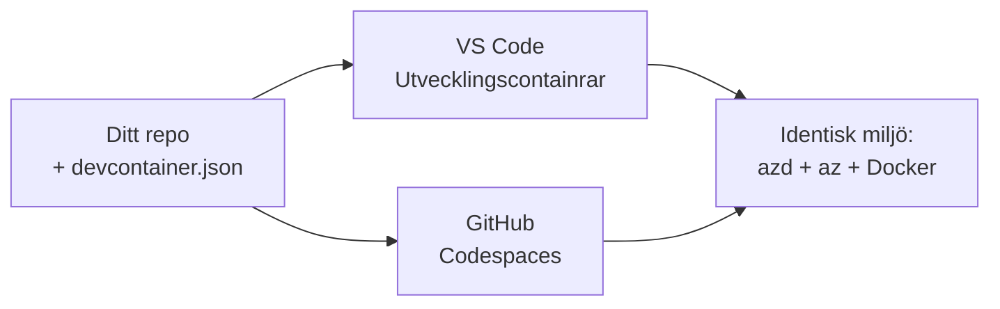

# Dev Containers & GitHub Codespaces för azd

**Kapitelnavigering:**
- **📚 Kursens startsida**: [AZD For Beginners](../../README.md)
- **📖 Aktuellt kapitel**: Chapter 1 - Foundation & Quick Start
- **⬅️ Föregående**: [Bring Your Own App](bring-your-own-app.md)
- **🚀 Nästa kapitel**: [Chapter 2: AI-First Development](../chapter-02-ai-development/README.md)

> Validerad mot `azd 1.25.6` i juni 2026.

## Introduktion

Att installera azd, rätt språk-runtime, Docker och Azure CLI på varje maskin är ett besvär — och det är den främsta anledningen till att en handledning som "fungerar på min maskin" fallerar för någon annan. En **devcontainer** löser detta genom att beskriva hela din verktygskedja i en fil. Alla som öppnar projektet i VS Code eller GitHub Codespaces får exakt samma miljö, med azd redan installerat. Denna lektion visar hur du lägger till en.

## Lärandemål

Efter denna lektion kommer du att:
- Förstå vad en devcontainer är och varför den hjälper med azd
- Lägga till en minimal `.devcontainer/devcontainer.json` i ett projekt
- Inkludera azd, Azure CLI och Docker via Dev Container *funktioner*
- Öppna projektet i GitHub Codespaces eller VS Code

## Läranderesultat

Efter att ha genomfört denna lektion kommer du att kunna:
- Skapa en `devcontainer.json` för ett azd-projekt
- Lägga till azd och Azure-verktyg utan manuella installationer
- Köra `azd up` inifrån en container eller Codespace

---

## Vad är en devcontainer?

En devcontainer är en Docker-baserad utvecklingsmiljö som definieras av en `.devcontainer/devcontainer.json`-fil i ditt repository. När du öppnar projektet:

- **VS Code** (med Dev Containers-tillägget) bygger containern och ansluter till den.
- **GitHub Codespaces** bygger samma container i molnet och ger dig en webbläsarbaserad editor.

Oavsett får varje medarbetare identiska verktyg—ingen "installerade du azd?"-felsökning.



---

## Steg 1: Skapa devcontainer-filen

Skapa `.devcontainer/devcontainer.json` i roten av ditt projekt:

```json
{
  "name": "azd-project",
  "image": "mcr.microsoft.com/devcontainers/base:bookworm",
  "features": {
    "ghcr.io/devcontainers/features/azure-cli:1": {},
    "ghcr.io/azure/azure-dev/azd:latest": {},
    "ghcr.io/devcontainers/features/docker-in-docker:2": {},
    "ghcr.io/devcontainers/features/node:1": {}
  },
  "customizations": {
    "vscode": {
      "extensions": [
        "ms-azuretools.azure-dev",
        "ms-azuretools.vscode-bicep"
      ]
    }
  },
  "forwardPorts": [3000],
  "postCreateCommand": "azd version"
}
```

Vad varje del gör:

| Key | Purpose |
|-----|---------|
| `image` | Bas-OS för containern |
| `features` | Förbyggda installatörer—här: Azure CLI, **azd**, Docker och Node.js |
| `customizations.vscode.extensions` | Installerar automatiskt azd- och Bicep-tilläggen för VS Code |
| `forwardPorts` | Exponerar din apps port till din webbläsare |
| `postCreateCommand` | Körs en gång efter att containern byggts (här, en kontroll) |

> Funktionen `ghcr.io/azure/azure-dev/azd:latest` är det officiella sättet att få azd i en container. Lås en specifik version (till exempel `azd:1.25.6`) om du behöver reproducerbarhet.

---

## Steg 2: Matcha funktionen till ditt appspråk

Byt ut `node`-funktionen mot vad din app använder:

```jsonc
// Python project
"ghcr.io/devcontainers/features/python:1": {},

// .NET project
"ghcr.io/devcontainers/features/dotnet:2": {},

// Java project
"ghcr.io/devcontainers/features/java:1": {},

// Go project
"ghcr.io/devcontainers/features/go:1": {}
```

Behåll `docker-in-docker` om din `host` är `containerapp`, `aks` eller något som bygger en containerbild—azd behöver Docker för att bygga och pusha bilder.

---

## Steg 3: Öppna den

**I VS Code:**
1. Installera tillägget **Dev Containers**.
2. Öppna projektmappen.
3. Klicka **Reopen in Container** när du uppmanas (eller kör *Dev Containers: Reopen in Container*).

**I GitHub Codespaces:**
1. Pusha repot till GitHub.
2. Klicka **Code → Codespaces → Create codespace on main**.
3. Vänta på att containern byggs—azd är redo i terminalen.

---

## Steg 4: Distribuera från insidan av containern

Containern har azd förinstallerat, så det normala arbetsflödet fungerar som vanligt:

```bash
azd auth login --use-device-code   # enhetskod är praktisk inne i Codespaces
azd up
```

> **Varför `--use-device-code`?** I en fjärrcontainer eller Codespace finns ingen lokal webbläsare att omdirigera till, så device-code-inloggning är den tillförlitliga vägen. Du klistrar in en kod i en webbläsarflik för att slutföra inloggningen.

---

## Vanliga fallgropar

| Problem | Åtgärd |
|---------|--------|
| `azd up` kan inte bygga en bild | Lägg till funktionen `docker-in-docker` |
| Webbläsarinloggning fastnar i Codespaces | Använd `azd auth login --use-device-code` |
| Verktyg skiljer sig mellan teammedlemmar | Lås funktioners versioner (t.ex. `azd:1.25.6`) |
| Appen inte nåbar i webbläsaren | Lägg till porten i `forwardPorts` |

---

## Sammanfattning

- En devcontainer gör din azd-verktygskedja reproducerbar för alla.
- Lägg till azd, Azure CLI och Docker via Dev Container *funktioner*.
- Matcha den språkspecifika funktionen till din app och behåll `docker-in-docker` för containerhosts.
- Använd device-code-inloggning när du kör inne i Codespaces.

---

## 🔗 Navigering

| Riktning | Resurs |
|-----------|----------|
| **Föregående** | [Bring Your Own App](bring-your-own-app.md) |
| **Kapitelöversikt** | [Chapter 1: Foundation & Quick Start](README.md) |
| **Nästa kapitel** | [Chapter 2: AI-First Development](../chapter-02-ai-development/README.md) |

## 📖 Relaterade resurser

- [Installation & Setup](installation.md)
- [Kommandosnabbguide](../../resources/cheat-sheet.md)
- [Officiell Dev Containers-specifikation](https://containers.dev/)
- [azd Dev Container-funktion](https://github.com/Azure/azure-dev/tree/main/ext/devcontainer)

---

<!-- CO-OP TRANSLATOR DISCLAIMER START -->
**Ansvarsfriskrivning**:
Detta dokument har översatts med hjälp av AI-översättningstjänsten [Co-op Translator](https://github.com/Azure/co-op-translator). Även om vi strävar efter noggrannhet, var vänlig notera att automatiska översättningar kan innehålla fel eller brister. Det ursprungliga dokumentet på dess modersmål bör betraktas som den auktoritativa källan. För kritisk information rekommenderas professionell mänsklig översättning. Vi ansvarar inte för några missförstånd eller feltolkningar som uppstår till följd av användningen av denna översättning.
<!-- CO-OP TRANSLATOR DISCLAIMER END -->