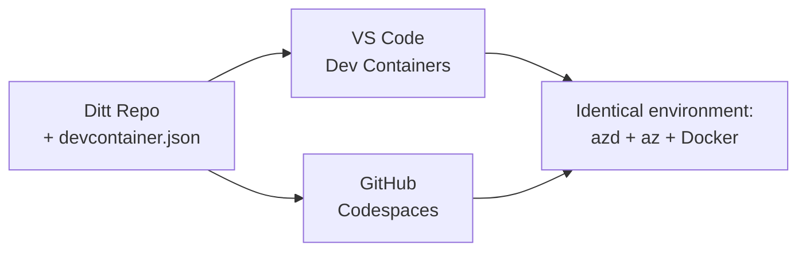

# Dev Containers & GitHub Codespaces för azd

**Kapitelnavigering:**
- **📚 Kursstart**: [AZD för nybörjare](../../README.md)
- **📖 Aktuellt kapitel**: Kapitel 1 - Grundläggande & Snabbstart
- **⬅️ Föregående**: [Ta med din egen app](bring-your-own-app.md)
- **🚀 Nästa kapitel**: [Kapitel 2: AI-Först Utveckling](../chapter-02-ai-development/README.md)

> Validerad mot `azd 1.27.1` i juli 2026.

## Introduktion

Att installera azd, rätt språkruntime, Docker och Azure CLI på varje maskin är ett projekt – och det är den huvudsakliga anledningen till att en handledning som "fungerar på min maskin" inte fungerar för någon annan. En **dev container** löser detta genom att beskriva hela din verktygskedja i en fil. Alla som öppnar projektet i VS Code eller GitHub Codespaces får exakt samma miljö, med azd redan installerat. Den här lektionen visar hur man lägger till en.

## Inlärningsmål

I slutet av denna lektion ska du kunna:
- Förstå vad en dev container är och varför den hjälper med azd
- Lägga till en minimal `.devcontainer/devcontainer.json` i ett projekt
- Inkludera azd, Azure CLI och Docker via Dev Container *features*
- Öppna projektet i GitHub Codespaces eller VS Code

## Inlärningsresultat

Efter att ha genomfört denna lektion kan du:
- Skapa en `devcontainer.json` för ett azd-projekt
- Lägga till azd och Azure-verktyg utan manuella installationer
- Köra `azd up` från en container eller Codespace

---

## Vad är en Dev Container?

En dev container är en Docker-baserad utvecklingsmiljö som definieras av en fil `.devcontainer/devcontainer.json` i ditt repository. När du öppnar projektet:

- **VS Code** (med Dev Containers-tillägget) bygger containern och ansluter till den.
- **GitHub Codespaces** bygger samma container i molnet och ger dig en webbläsarbaserad editor.

Oavsett ger varje bidragsgivare identiska verktyg – inget "har du installerat azd?" felsökande.



---

## Steg 1: Skapa devcontainer-filen

Skapa `.devcontainer/devcontainer.json` i roten av ditt projekt:

```json
{
  "name": "azd-project",
  "image": "mcr.microsoft.com/devcontainers/base:bookworm",
  "features": {
    "ghcr.io/devcontainers/features/azure-cli:1": {},
    "ghcr.io/azure/azure-dev/azd:latest": {},
    "ghcr.io/devcontainers/features/docker-in-docker:2": {},
    "ghcr.io/devcontainers/features/node:1": {}
  },
  "customizations": {
    "vscode": {
      "extensions": [
        "ms-azuretools.azure-dev",
        "ms-azuretools.vscode-bicep"
      ]
    }
  },
  "forwardPorts": [3000],
  "postCreateCommand": "azd version"
}
```

Vad varje del gör:

| Nyckel | Syfte |
|-------|---------|
| `image` | Bas-OS för containern |
| `features` | Förbyggda installationer – här: Azure CLI, **azd**, Docker och Node.js |
| `customizations.vscode.extensions` | Installerar automatiskt azd- och Bicep-tilläggen för VS Code |
| `forwardPorts` | Exponerar din apps port till webbläsaren |
| `postCreateCommand` | Körs en gång efter att containern byggts (här, en snabb kontroll) |

> `ghcr.io/azure/azure-dev/azd:latest` är det officiella sättet att få azd i en container. Lås till en specifik version (t.ex. `azd:1.27.1`) om du behöver reproducerbarhet.

---

## Steg 2: Anpassa feature efter ditt appspråk

Byt ut `node`-feature mot det som ditt app använder:

```jsonc
// Python project
"ghcr.io/devcontainers/features/python:1": {},

// .NET project
"ghcr.io/devcontainers/features/dotnet:2": {},

// Java project
"ghcr.io/devcontainers/features/java:1": {},

// Go project
"ghcr.io/devcontainers/features/go:1": {}
```

Behåll `docker-in-docker` om din `host` är `containerapp`, `aks` eller något som bygger en containerbild—azd behöver Docker för att bygga och pusha bilder.

---

## Steg 3: Öppna den

**I VS Code:**
1. Installera tillägget **Dev Containers**.
2. Öppna projektmappen.
3. Klicka på **Öppna på nytt i container** när du får prompten (eller kör *Dev Containers: Reopen in Container*).

**I GitHub Codespaces:**
1. Tryck upp repot till GitHub.
2. Klicka på **Code → Codespaces → Create codespace on main**.
3. Vänta på att containern byggs – azd är redo i terminalen.

---

## Steg 4: Distribuera från insidan av containern

Containern har azd förinstallerat, så den vanliga arbetsflödet fungerar direkt:

```bash
azd auth login --use-device-code   # enhetskod är praktisk i Codespaces
azd up
```

> **Varför `--use-device-code`?** I en fjärrcontainer eller Codespace finns ingen lokal webbläsare att omdirigera till, så enhetkod-inloggning är den pålitliga vägen. Du klistrar in en kod i en webbläsarflik för att slutföra inloggningen.

---

## Vanliga fallgropar

| Fallgrop | Lösning |
|---------|---------|
| `azd up` kan inte bygga en image | Lägg till `docker-in-docker`-feature |
| Webbläsarinloggning fastnar i Codespaces | Använd `azd auth login --use-device-code` |
| Verktyg skiljer mellan teammedlemmar | Lås feature-versioner (t.ex. `azd:1.27.1`) |
| Appen är inte åtkomlig i webbläsaren | Lägg till porten i `forwardPorts` |

---

## Sammanfattning

- En dev container gör din azd-verktygskedja reproducerbar för alla.
- Lägg till azd, Azure CLI och Docker via Dev Container *features*.
- Anpassa språkfeaturen efter din app och behåll `docker-in-docker` för containerhosts.
- Använd enhetskod-inloggning när du kör i Codespaces.

---

## 🔗 Navigering

| Riktning | Resurs |
|---------|---------|
| **Föregående** | [Ta med din egen app](bring-your-own-app.md) |
| **Kapitelstart** | [Kapitel 1: Grundläggande & Snabbstart](README.md) |
| **Nästa kapitel** | [Kapitel 2: AI-Först Utveckling](../chapter-02-ai-development/README.md) |

## 📖 Relaterade resurser

- [Installation & Setup](installation.md)
- [Kommandolathund](../../resources/cheat-sheet.md)
- [Officiella Dev Containers-specifikationen](https://containers.dev/)
- [azd Dev Container feature](https://github.com/Azure/azure-dev/tree/main/ext/devcontainer)

---

<!-- CO-OP TRANSLATOR DISCLAIMER START -->
**Ansvarsfriskrivning**:
Detta dokument har översatts med hjälp av AI-översättningstjänsten [Co-op Translator](https://github.com/Azure/co-op-translator). Även om vi strävar efter noggrannhet, var vänlig notera att automatiska översättningar kan innehålla fel eller brister. Det ursprungliga dokumentet på dess modersmål bör betraktas som den auktoritativa källan. För kritisk information rekommenderas professionell mänsklig översättning. Vi ansvarar inte för några missförstånd eller feltolkningar som uppstår till följd av användningen av denna översättning.
<!-- CO-OP TRANSLATOR DISCLAIMER END -->