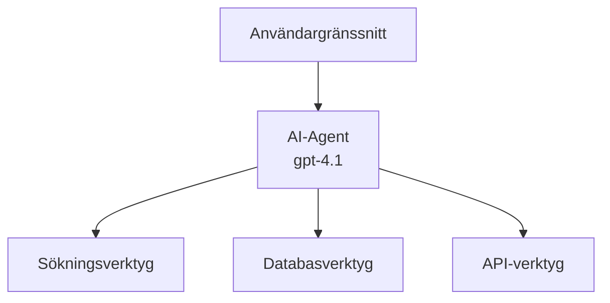
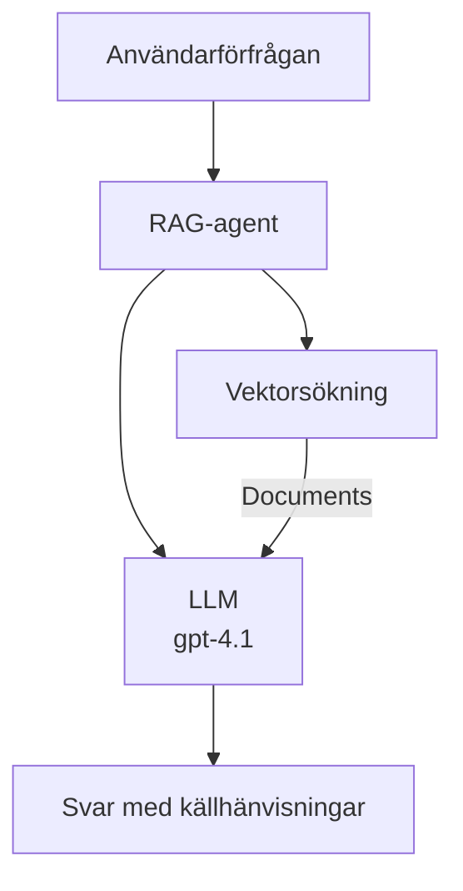
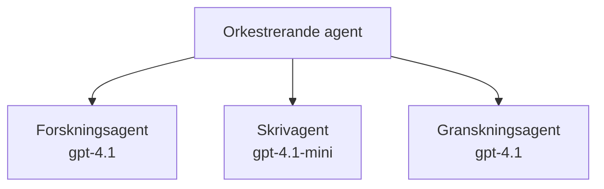

# AI-agenter med Azure Developer CLI

**Kapitelnavigering:**
- **📚 Kursstart**: [AZD För Nybörjare](../../README.md)
- **📖 Aktuellt Kapitel**: Kapitel 2 - AI-Först Utveckling
- **⬅️ Föregående**: [Microsoft Foundry Integration](microsoft-foundry-integration.md)
- **➡️ Nästa**: [AI Modellimplementering](ai-model-deployment.md)
- **🚀 Avancerat**: [Multi-Agent Lösningar](../../examples/retail-scenario.md)

---

## Introduktion

AI-agenter är autonoma program som kan uppfatta sin omgivning, fatta beslut och vidta åtgärder för att uppnå specifika mål. Till skillnad från enkla chatbots som svarar på uppmaningar kan agenter:

- **Använda verktyg** - Anropa API:er, söka i databaser, köra kod
- **Planera och resonera** - Dela upp komplexa uppgifter i steg
- **Lära sig från kontext** - Behålla minne och anpassa beteende
- **Samarbeta** - Arbeta med andra agenter (multi-agentsystem)

Denna guide visar hur du distribuerar AI-agenter till Azure med Azure Developer CLI (azd).

> **Valideringsnotis (2026-07-13):** Denna guide granskades mot `azd` `1.27.1` och `azure.ai.agents` `1.0.0-beta.5`. Upplevelsen `azd ai` är fortfarande förhandsgranskning, så kontrollera hjälp för extension om dina installerade flaggor skiljer sig.

## Lärandemål

Genom att slutföra denna guide kommer du att:
- Förstå vad AI-agenter är och hur de skiljer sig från chatbots
- Distribuera färdiga AI-agentmallar med AZD
- Konfigurera Foundry Agents för anpassade agenter
- Implementera grundläggande agentmönster (verktygsanvändning, RAG, multi-agent)
- Övervaka och felsöka distribuerade agenter

## Förväntade Resultat

När du är klar kommer du att kunna:
- Distribuera AI-agentapplikationer till Azure med ett enda kommando
- Konfigurera agentverktyg och funktioner
- Implementera retrieval-augmented generation (RAG) med agenter
- Designa multi-agentarkitekturer för komplexa arbetsflöden
- Felsöka vanliga problem vid agentdistribution

---

## 🤖 Vad gör en agent annorlunda än en chatbot?

| Funktion | Chatbot | AI-Agent |
|---------|---------|----------|
| **Beteende** | Svarar på uppmaningar | Tar autonoma åtgärder |
| **Verktyg** | Inga | Kan anropa API:er, söka, köra kod |
| **Minne** | Endast sessionsbaserat | Beständigt minne över sessioner |
| **Planering** | Endast ett svar | Flera steg i resonemang |
| **Samarbete** | Enskild enhet | Kan samarbeta med andra agenter |

### Enkel liknelse

- **Chatbot** = En hjälpsam person som svarar på frågor vid en informationsdisk
- **AI-Agent** = En personlig assistent som kan ringa samtal, boka möten och slutföra uppgifter åt dig

---

## 🚀 Snabbstart: Distribuera din första agent

### Alternativ 1: Foundry Agents-mall (Rekommenderad)

```bash
# Initiera AI-agenternas mall
azd init --template get-started-with-ai-agents

# Distribuera till Azure
azd up
```

**Det som distribueras:**
- ✅ Foundry Agents
- ✅ Microsoft Foundry-modeller (gpt-4.1)
- ✅ Azure AI Search (för RAG)
- ✅ Azure Container Apps (webbgränssnitt)
- ✅ Application Insights (övervakning)

**Tid:** ~15-20 minuter
**Kostnad:** ~$100-150/månad (utveckling)

### Alternativ 2: OpenAI-agent med Prompty

```bash
# Initiera Prompty-baserad agentmall
azd init --template agent-openai-python-prompty

# Distribuera till Azure
azd up
```

**Det som distribueras:**
- ✅ Azure Functions (serverlös agentkörning)
- ✅ Microsoft Foundry-modeller
- ✅ Prompty-konfigurationsfiler
- ✅ Exempelagent-implementation

**Tid:** ~10-15 minuter
**Kostnad:** ~$50-100/månad (utveckling)

### Alternativ 3: RAG Chat-agent

```bash
# Initiera RAG chattmall
azd init --template azure-search-openai-demo

# Distribuera till Azure
azd up
```

**Det som distribueras:**
- ✅ Microsoft Foundry-modeller
- ✅ Azure AI Search med exempeldatan
- ✅ Dokumentprocesspipeline
- ✅ Chattgränssnitt med källhänvisningar

**Tid:** ~15-25 minuter
**Kostnad:** ~$80-150/månad (utveckling)

### Alternativ 4: AZD AI Agent Init (Förhandsgranskning baserad på manifest eller mall)

Om du har en agentmanifestfil kan du använda kommandot `azd ai` för att bygga upp ett Foundry Agent Service-projekt direkt. Nyliga förhandsgranskningsversioner har också lagt till mallbaserad initieringsstöd, så den exakta förloppsguiden kan skilja sig något beroende på vilken extensionversion du har installerad.

```bash
# Installera AI-agenter-tillägget
azd extension install azure.ai.agents

# Valfritt: verifiera den installerade förhandsversionen
azd extension show azure.ai.agents

# Initiera från en agentmanifest
azd ai agent init -m agent-manifest.yaml

# Distribuera till Azure
azd up

# Testa den distribuerade agenten (visar latens + tid-till-första-byte)
azd ai agent invoke
```

**När du ska använda `azd ai agent init` kontra `azd init --template`:**

| Tillvägagångssätt | Bäst för | Hur det fungerar |
|----------|----------|------|
| `azd init --template` | Starta från en fungerande exempelapp | Klonar hela mallrepo med kod + infrastruktur |
| `azd ai agent init -m` | Bygga från din egen agentmanifest | Skapar projektstruktur från din agentdefinition |

> **Tips:** Använd `azd init --template` när du lär dig (Alternativ 1-3 ovan). Använd `azd ai agent init` när du bygger produktionsagenter med egna manifest.

Efter `azd up` leder samma extension dig genom resten av agentlivscykeln: `azd ai agent invoke` för att testa, `azd ai agent eval generate` och `azd ai agent optimize` för att mäta och förbättra kvalitet, samt `azd ai agent delete` för att rensa upp. Se [AZD AI CLI Commands](../chapter-08-production/production-ai-practices.md#azd-ai-cli-commands-and-extensions) för fullständigt referensmaterial.

---

## 🏗️ Agentarkitektur-mönster

### Mönster 1: Enkel agent med verktyg

Det enklaste agentmönstret — en agent som kan använda flera verktyg.



**Lämpligt för:**
- Kundsupport-botar
- Forskningsassistenter
- Dataanalysagenter

**AZD-mall:** `azure-search-openai-demo`

### Mönster 2: RAG-agent (Retrieval-Augmented Generation)

En agent som hämtar relevanta dokument innan den genererar svar.



**Lämpligt för:**
- Företagskunskapsbaser
- Dokumentfrågesystem
- Efterlevnads- och juridisk forskning

**AZD-mall:** `azure-search-openai-demo`

### Mönster 3: Multi-Agent-system

Flera specialiserade agenter som samarbetar kring komplexa uppgifter.



**Lämpligt för:**
- Komplex innehållsgenerering
- Flera steg i arbetsflöden
- Uppgifter som kräver olika expertisområden

**Lär dig mer:** [Multi-Agent Koordinationsmönster](../chapter-06-pre-deployment/coordination-patterns.md)

---

## ⚙️ Konfigurera agentverktyg

Agenter blir kraftfulla när de kan använda verktyg. Så här konfigurerar du vanliga verktyg:

### Verktygskonfiguration i Foundry Agents

```python
# agent_config.py
from azure.ai.projects import AIProjectClient
from azure.ai.projects.models import FunctionTool, CodeInterpreterTool

# Definiera anpassade verktyg
search_tool = FunctionTool(
    name="search_knowledge_base",
    description="Search the company knowledge base for relevant documents",
    parameters={
        "type": "object",
        "properties": {
            "query": {
                "type": "string",
                "description": "The search query"
            }
        },
        "required": ["query"]
    }
)

# Skapa agent med verktyg
agent = project_client.agents.create_agent(
    model="gpt-4.1",
    name="Support Agent",
    instructions="You are a helpful support agent. Use the search tool to find relevant information.",
    tools=[search_tool, CodeInterpreterTool()]
)
```

### Miljökonfiguration

```bash
# Ställ in agent-specifika miljövariabler
azd env set AZURE_OPENAI_MODEL "gpt-4.1"
azd env set AGENT_INSTRUCTIONS "You are a helpful assistant..."
azd env set ENABLE_CODE_INTERPRETER "true"
azd env set ENABLE_FILE_SEARCH "true"

# Distribuera med uppdaterad konfiguration
azd deploy
```

---

## 📊 Övervaka agenter

### Integrering med Application Insights

Alla AZD-agentmallar inkluderar Application Insights för övervakning:

```bash
# Öppna övervakningspanel
azd monitor --overview

# Visa live-loggar
azd monitor --logs

# Visa live-mått
azd monitor --live
```

### Viktiga mätvärden att följa

| Metrik | Beskrivning | Mål |
|--------|-------------|-----|
| Svarsfördröjning | Tid för att generera svar | < 5 sekunder |
| Tokenanvändning | Tokens per förfrågan | Övervaka för kostnad |
| Framgångsfrekvens för verktygsanrop | % av lyckade verktygskörningar | > 95% |
| Felprocent | Misslyckade agentförfrågningar | < 1% |
| Användarnöjdhet | Betyg från användarfeedback | > 4.0/5.0 |

### Anpassad loggning för agenter

```python
import os
from azure.monitor.opentelemetry import configure_azure_monitor
from opentelemetry import trace

# Konfigurera Azure Monitor med OpenTelemetry
configure_azure_monitor(
    connection_string=os.environ["APPLICATIONINSIGHTS_CONNECTION_STRING"]
)

tracer = trace.get_tracer(__name__)

def log_agent_interaction(user_query, agent_response, tools_used, latency_ms):
    with tracer.start_as_current_span("agent_interaction") as span:
        span.set_attributes({
            "user_query": user_query,
            "response_length": len(agent_response),
            "tools_used": tools_used,
            "latency_ms": latency_ms
        })
```

> **Notis:** Installera nödvändiga paket: `pip install azure-monitor-opentelemetry opentelemetry`

---

## 💰 Kostnadsaspekter

### Uppskattade månadskostnader per mönster

| Mönster | Utvecklingsmiljö | Produktion |
|---------|------------------|------------|
| Enkel agent | $50-100 | $200-500 |
| RAG-agent | $80-150 | $300-800 |
| Multi-agent (2-3 agenter) | $150-300 | $500-1,500 |
| Företagsmulti-agent | $300-500 | $1,500-5,000+ |

### Kostnadsoptimeringstips

1. **Använd gpt-4.1-mini för enkla uppgifter**
   ```bash
   azd env set AZURE_OPENAI_MODEL "gpt-4.1-mini"
   ```

2. **Implementera caching för återkommande förfrågningar**
   ```python
   from functools import lru_cache
   
   @lru_cache(maxsize=1000)
   def get_cached_response(query_hash):
       return agent.run(query_hash)
   ```

3. **Sätt token-gränser per körning**
   ```python
   # Sätt max_completion_tokens när du kör agenten, inte vid skapandet
   run = project_client.agents.create_run(
       thread_id=thread.id,
       agent_id=agent.id,
       max_completion_tokens=1000  # Begränsa svarslängden
   )
   ```

4. **Skala ner till noll vid inaktivitet**
   ```bash
   # Containerappar skalar automatiskt ner till noll
   azd env set MIN_REPLICAS "0"
   ```

---

## 🔧 Felsökning av agenter

### Vanliga problem och lösningar

<details>
<summary><strong>❌ Agent svarar inte på verktygsanrop</strong></summary>

```bash
# Kontrollera om verktyg är korrekt registrerade
azd show

# Verifiera OpenAI-distribution
az cognitiveservices account deployment list \
  --name $AZURE_OPENAI_NAME \
  --resource-group $RG_NAME

# Kontrollera agentloggar
azd monitor --logs
```

**Vanliga orsaker:**
- Verktygs funktionssignatur stämmer inte
- Saknade nödvändiga behörigheter
- API-endpoint ej åtkomlig
</details>

<details>
<summary><strong>❌ Hög latens i agentens svar</strong></summary>

```bash
# Kontrollera Application Insights för flaskhalsar
azd monitor --live

# Överväg att använda en snabbare modell
azd env set AZURE_OPENAI_MODEL "gpt-4.1-mini"
azd deploy
```

**Optimeringstips:**
- Använd strömningssvar
- Implementera caching av svar
- Minska kontextfönstrets storlek
</details>

<details>
<summary><strong>❌ Agenten returnerar felaktig eller hallucinatorisk information</strong></summary>

```python
# Förbättra med bättre systemuppmaningar
instructions = """
You are a helpful assistant. IMPORTANT:
- Only answer based on provided context
- If you don't know, say "I don't know"
- Always cite your sources
- Never make up information
"""

# Lägg till hämtning för grundning
agent = project_client.agents.create_agent(
    model="gpt-4.1",
    instructions=instructions,
    tools=[FileSearchTool()]  # Grunda svar i dokument
)
```
</details>

<details>
<summary><strong>❌ Fel för överskriden token-gräns</strong></summary>

```python
# Implementera hantering av kontextfönster
def truncate_context(messages, max_tokens=8000, model="gpt-4.1"):
    """Keep only recent messages within token limit."""
    import tiktoken
    encoding = tiktoken.encoding_for_model(model)
    total_tokens = 0
    truncated = []
    
    for msg in reversed(messages):
        msg_tokens = len(encoding.encode(msg.content))
        if total_tokens + msg_tokens > max_tokens:
            break
        truncated.insert(0, msg)
        total_tokens += msg_tokens
    
    return truncated
```
</details>

---

## 🎓 Praktiska övningar

### Övning 1: Distribuera en grundläggande agent (20 minuter)

**Mål:** Distribuera din första AI-agent med AZD

```bash
# Steg 1: Initiera mall
azd init --template get-started-with-ai-agents

# Steg 2: Logga in på Azure
azd auth login
# Om du arbetar över hyresgäster, lägg till --tenant-id <tenant-id>

# Steg 3: Distribuera
azd up

# Steg 4: Testa agenten
# Förväntad output efter distribution:
#   Distribution klar!
#   Slutpunkt: https://<app-name>.<region>.azurecontainerapps.io
# Öppna URL:en som visas i output och försök ställa en fråga

# Steg 5: Visa övervakning
azd monitor --overview

# Steg 6: Rensa upp
azd down --force --purge
```

**Kriterier för framgång:**
- [ ] Agenten svarar på frågor
- [ ] Kan nå övervakningsinstrumentpanel via `azd monitor`
- [ ] Resurser rensade framgångsrikt

### Övning 2: Lägg till ett anpassat verktyg (30 minuter)

**Mål:** Utöka en agent med ett anpassat verktyg

1. Distribuera agentmallen:
   ```bash
   azd init --template get-started-with-ai-agents
   azd up
   ```
2. Skapa en ny verktygsfunktion i agentkoden:
   ```python
   def get_weather(location: str) -> str:
       """Get current weather for a location."""
       # API-anrop till vädertjänst
       return f"Weather in {location}: Sunny, 72°F"
   ```
3. Registrera verktyget med agenten:
   ```python
   from azure.ai.projects.models import FunctionTool

   weather_tool = FunctionTool(
       name="get_weather",
       description="Get current weather for a location",
       parameters={
           "type": "object",
           "properties": {
               "location": {"type": "string", "description": "City name"}
           },
           "required": ["location"]
       }
   )

   agent = project_client.agents.create_agent(
       model="gpt-4.1",
       name="Weather Agent",
       tools=[weather_tool]
   )
   ```
4. Distribuera om och testa:
   ```bash
   azd deploy
   # Fråga: "Hur är vädret i Seattle?"
   # Förväntat: Agenten anropar get_weather("Seattle") och returnerar väderinformationen
   ```

**Kriterier för framgång:**
- [ ] Agenten känner igen väderrelaterade frågor
- [ ] Verktyget anropas korrekt
- [ ] Svaret inkluderar väderinformation

### Övning 3: Bygg en RAG-agent (45 minuter)

**Mål:** Skapa en agent som svarar på frågor från dina dokument

```bash
# Steg 1: Distribuera RAG-mallen
azd init --template azure-search-openai-demo
azd up

# Steg 2: Ladda upp dina dokument
# Placera PDF/TXT-filer i data/-mappen, kör sedan:
python scripts/prepdocs.py

# Steg 3: Testa med domänspecifika frågor
# Öppna webbappens URL från azd up-utmatningen
# Ställ frågor om dina uppladdade dokument
# Svar bör innehålla referenser som [doc.pdf]
```

**Kriterier för framgång:**
- [ ] Agenten svarar från uppladdade dokument
- [ ] Svaren inkluderar källhänvisningar
- [ ] Ingen hallucinering på frågor utanför omfånget

---

## 📚 Nästa steg

Nu när du förstår AI-agenter, utforska dessa avancerade ämnen:

| Ämne | Beskrivning | Länk |
|-------|-------------|------|
| **Multi-Agent System** | Bygg system med flera samarbetande agenter | [Detaljhandels-exempel med multi-agent](../../examples/retail-scenario.md) |
| **Koordinationsmönster** | Lär dig orkestrering och kommunikationsmönster | [Koordinationsmönster](../chapter-06-pre-deployment/coordination-patterns.md) |
| **Produktionsdistribution** | Agentdistribution redo för företagsanvändning | [Produktions-AI-praktiker](../chapter-08-production/production-ai-practices.md) |
| **Agentutvärdering** | Testa och utvärdera agenters prestanda | [AI-felsökning](../chapter-07-troubleshooting/ai-troubleshooting.md) |
| **AI Workshop Lab** | Praktiskt: Gör din AI-lösning AZD-redo | [AI Workshop Lab](ai-workshop-lab.md) |

---

## 📖 Ytterligare resurser

### Officiell dokumentation
- [Microsoft Foundry Agent Service](https://learn.microsoft.com/azure/ai-services/agents/)
- [Microsoft Foundry Agent Service Snabbstart](https://learn.microsoft.com/azure/ai-services/agents/quickstart)
- [Semantic Kernel Agent Framework](https://learn.microsoft.com/semantic-kernel/)

### AZD-mallar för agenter
- [Kom igång med AI-agenter](https://github.com/Azure-Samples/get-started-with-ai-agents)
- [Agent OpenAI Python Prompty](https://github.com/Azure-Samples/agent-openai-python-prompty)
- [Azure Search OpenAI Demo](https://github.com/Azure-Samples/azure-search-openai-demo)

### Communityresurser
- [Awesome AZD - Agentmallar](https://azure.github.io/awesome-azd/?tags=ai-agents)
- [Azure AI Discord](https://discord.gg/microsoft-azure)
- [Microsoft Foundry Discord](https://discord.gg/nTYy5BXMWG)

### Agentkunskaper för din editor
- [**Microsoft Azure Agentkunskaper**](https://skills.sh/microsoft/github-copilot-for-azure) - Installera återanvändbara AI-agentkunskaper för Azure-utveckling i GitHub Copilot, Cursor eller någon stödd agent. Inkluderar färdigheter för [Azure AI](https://skills.sh/microsoft/github-copilot-for-azure/azure-ai), [Microsoft Foundry](https://skills.sh/microsoft/github-copilot-for-azure/microsoft-foundry), [distribution](https://skills.sh/microsoft/github-copilot-for-azure/azure-deploy) och [diagnostik](https://skills.sh/microsoft/github-copilot-for-azure/azure-diagnostics):
  ```bash
  npx skills add microsoft/github-copilot-for-azure
  ```

---

**Navigering**
- **Föregående Lektion**: [Microsoft Foundry Integration](microsoft-foundry-integration.md)
- **Nästa Lektion**: [AI Modellimplementering](ai-model-deployment.md)

---

<!-- CO-OP TRANSLATOR DISCLAIMER START -->
**Ansvarsfriskrivning**:
Detta dokument har översatts med hjälp av AI-översättningstjänsten [Co-op Translator](https://github.com/Azure/co-op-translator). Även om vi strävar efter noggrannhet, var vänlig notera att automatiska översättningar kan innehålla fel eller brister. Det ursprungliga dokumentet på dess modersmål bör betraktas som den auktoritativa källan. För kritisk information rekommenderas professionell mänsklig översättning. Vi ansvarar inte för några missförstånd eller feltolkningar som uppstår till följd av användningen av denna översättning.
<!-- CO-OP TRANSLATOR DISCLAIMER END -->