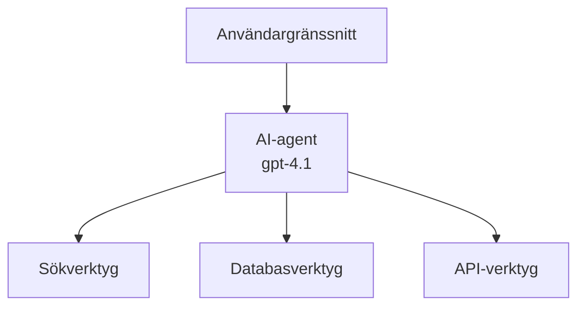
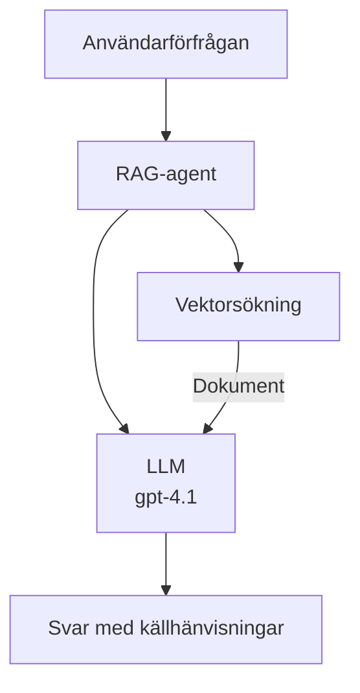
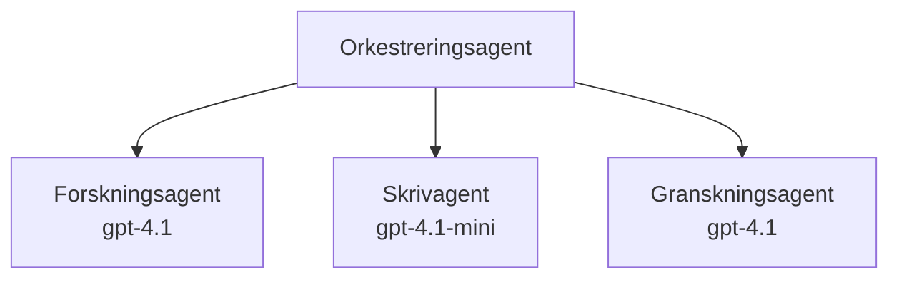

# AI-agenter med Azure Developer CLI

**Kapitelnavigering:**
- **📚 Kursstart**: [AZD For Beginners](../../README.md)
- **📖 Nuvarande kapitel**: Kapitel 2 - AI-först-utveckling
- **⬅️ Föregående**: [Microsoft Foundry Integration](microsoft-foundry-integration.md)
- **➡️ Nästa**: [AI Model Deployment](ai-model-deployment.md)
- **🚀 Avancerat**: [Multi-Agent Solutions](../../examples/retail-scenario.md)

---

## Introduktion

AI-agenter är autonoma program som kan uppfatta sin omgivning, fatta beslut och vidta åtgärder för att nå specifika mål. Till skillnad från enkla chattbotar som svarar på frågor kan agenter:

- **Använda verktyg** - Anropa API:er, söka i databaser, köra kod
- **Planera och resonera** - Dela upp komplexa uppgifter i steg
- **Lära av kontext** - Bibehålla minne och anpassa beteende
- **Samarbeta** - Arbeta med andra agenter (multi-agent-system)

Denna guide visar hur du distribuerar AI-agenter till Azure med Azure Developer CLI (azd).

> **Valideringsanteckning (2026-03-25):** Denna guide granskades mot `azd` `1.23.12` och `azure.ai.agents` `0.1.18-preview`. `azd ai`-upplevelsen är fortfarande driven av förhandsversioner, så kontrollera tilläggets hjälp om dina installerade flaggor skiljer sig.

## Inlärningsmål

Genom att slutföra denna guide kommer du att:
- Förstå vad AI-agenter är och hur de skiljer sig från chattbotar
- Distribuera färdiga AI-agentmallar med AZD
- Konfigurera Foundry-agenter för anpassade agenter
- Implementera grundläggande agentmönster (verktygsanvändning, RAG, multi-agent)
- Övervaka och felsöka distribuerade agenter

## Läranderesultat

Efter slutförandet kommer du att kunna:
- Distribuera AI-agentapplikationer till Azure med ett enda kommando
- Konfigurera agentverktyg och funktioner
- Implementera retrieval-augmented generation (RAG) med agenter
- Designa multi-agentarkitekturer för komplexa arbetsflöden
- Felsöka vanliga distributionsproblem för agenter

---

## 🤖 Vad skiljer en agent från en chattbot?

| Funktion | Chattbot | AI-agent |
|---------|---------|----------|
| **Beteende** | Svarar på uppmaningar | Vidtar autonoma åtgärder |
| **Verktyg** | Inga | Kan anropa API:er, söka, köra kod |
| **Minne** | Endast sessionsbaserat | Beständigt minne över sessioner |
| **Planering** | Enkel respons | Flera stegs resonemang |
| **Samarbete** | En enda enhet | Kan samarbeta med andra agenter |

### Enkel analogi

- **Chattbot** = En hjälpsam person som svarar på frågor vid en informationsdisk
- **AI-agent** = En personlig assistent som kan ringa, boka möten och slutföra uppgifter åt dig

---

## 🚀 Snabbstart: Distribuera din första agent

### Alternativ 1: Foundry Agents-mall (Rekommenderas)

```bash
# Initiera AI-agenternas mall
azd init --template get-started-with-ai-agents

# Distribuera till Azure
azd up
```

**Vad som distribueras:**
- ✅ Foundry Agents
- ✅ Microsoft Foundry Models (gpt-4.1)
- ✅ Azure AI Search (för RAG)
- ✅ Azure Container Apps (webbgränssnitt)
- ✅ Application Insights (övervakning)

**Tid:** ~15–20 minuter
**Kostnad:** ~$100–150/månad (utveckling)

### Alternativ 2: OpenAI-agent med Prompty

```bash
# Initiera Prompty-baserade agentmallen
azd init --template agent-openai-python-prompty

# Distribuera till Azure
azd up
```

**Vad som distribueras:**
- ✅ Azure Functions (serverlös agentkörning)
- ✅ Microsoft Foundry Models
- ✅ Prompty-konfigurationsfiler
- ✅ Exempelimplementering av agent

**Tid:** ~10–15 minuter
**Kostnad:** ~$50–100/månad (utveckling)

### Alternativ 3: RAG-chattagent

```bash
# Initiera RAG-chattmall
azd init --template azure-search-openai-demo

# Distribuera till Azure
azd up
```

**Vad som distribueras:**
- ✅ Microsoft Foundry Models
- ✅ Azure AI Search med exempeldata
- ✅ Dokumentbearbetningspipeline
- ✅ Chattgränssnitt med referenser

**Tid:** ~15–25 minuter
**Kostnad:** ~$80–150/månad (utveckling)

### Alternativ 4: AZD AI Agent Init (Manifest- eller Mallbaserad förhandsvisning)

Om du har en agentmanifestfil kan du använda kommandot `azd ai` för att skapa ett Foundry Agent Service-projekt direkt. Nyare förhandsversionsutgåvor lade även till mallbaserat initieringsstöd, så den exakta promptflödet kan skilja sig något beroende på din installerade tilläggsversion.

```bash
# Installera tillägget för AI-agenter
azd extension install azure.ai.agents

# Valfritt: verifiera den installerade förhandsversionen
azd extension show azure.ai.agents

# Initiera från ett agentmanifest
azd ai agent init -m agent-manifest.yaml

# Distribuera till Azure
azd up
```

**När du ska använda `azd ai agent init` vs `azd init --template`:**

| Tillvägagångssätt | Bäst för | Hur det fungerar |
|----------|----------|------|
| `azd init --template` | Börjar från en fungerande exempelapp | Klonar ett komplett mallrepo med kod + infrastruktur |
| `azd ai agent init -m` | Bygga från ditt eget agentmanifest | Skapar projekstruktur från din agentdefinition |

> **Tips:** Använd `azd init --template` när du lär dig (Alternativ 1–3 ovan). Använd `azd ai agent init` när du bygger produktionsagenter med dina egna manifest. Se [AZD AI CLI Commands](../chapter-08-production/production-ai-practices.md#azd-ai-cli-commands-and-extensions) för full referens.

---

## 🏗️ Agentarkitekturmönster

### Mönster 1: Enskild agent med verktyg

Det enklaste agentmönstret - en agent som kan använda flera verktyg.


**Bäst för:**
- Kundtjänstbotar
- Forskningsassistenter
- Dataanalysagenter

**AZD-mall:** `azure-search-openai-demo`

### Mönster 2: RAG-agent (Retrieval-Augmented Generation)

En agent som hämtar relevanta dokument innan den genererar svar.


**Bäst för:**
- Företagskunskapsbaser
- Dokument Q&A-system
- Regelefterlevnad och juridisk forskning

**AZD-mall:** `azure-search-openai-demo`

### Mönster 3: Multi-agent-system

Flera specialiserade agenter som arbetar tillsammans på komplexa uppgifter.


**Bäst för:**
- Komplex innehållsgenerering
- Flerstegsarbetsflöden
- Uppgifter som kräver olika expertis

**Läs mer:** [Multi-Agent Coordination Patterns](../chapter-06-pre-deployment/coordination-patterns.md)

---

## ⚙️ Konfigurera agentverktyg

Agenter blir kraftfulla när de kan använda verktyg. Så här konfigurerar du vanliga verktyg:

### Verktygskonfiguration i Foundry Agents

```python
# agent_config.py
from azure.ai.projects import AIProjectClient
from azure.ai.projects.models import FunctionTool, CodeInterpreterTool

# Definiera anpassade verktyg
search_tool = FunctionTool(
    name="search_knowledge_base",
    description="Search the company knowledge base for relevant documents",
    parameters={
        "type": "object",
        "properties": {
            "query": {
                "type": "string",
                "description": "The search query"
            }
        },
        "required": ["query"]
    }
)

# Skapa agent med verktyg
agent = project_client.agents.create_agent(
    model="gpt-4.1",
    name="Support Agent",
    instructions="You are a helpful support agent. Use the search tool to find relevant information.",
    tools=[search_tool, CodeInterpreterTool()]
)
```

### Miljökonfiguration

```bash
# Ställ in agentspecifika miljövariabler
azd env set AZURE_OPENAI_MODEL "gpt-4.1"
azd env set AGENT_INSTRUCTIONS "You are a helpful assistant..."
azd env set ENABLE_CODE_INTERPRETER "true"
azd env set ENABLE_FILE_SEARCH "true"

# Distribuera med uppdaterad konfiguration
azd deploy
```

---

## 📊 Övervaka agenter

### Application Insights-integrering

Alla AZD-agentmallar inkluderar Application Insights för övervakning:

```bash
# Öppna övervakningspanelen
azd monitor --overview

# Visa loggar i realtid
azd monitor --logs

# Visa mätvärden i realtid
azd monitor --live
```

### Viktiga mätvärden att spåra

| Mätvärde | Beskrivning | Mål |
|--------|-------------|--------|
| Svarslatens | Tid för att generera svar | < 5 sekunder |
| Tokenanvändning | Tokens per begäran | Övervaka för kostnad |
| Framgångsfrekvens för verktygsanrop | % framgångsrika verktygsutskrifter | > 95% |
| Felkvot | Misslyckade agentbegäranden | < 1% |
| Användarnöjdhet | Feedbackpoäng | > 4.0/5.0 |

### Anpassad loggning för agenter

```python
import os
from azure.monitor.opentelemetry import configure_azure_monitor
from opentelemetry import trace

# Konfigurera Azure Monitor med OpenTelemetry
configure_azure_monitor(
    connection_string=os.environ["APPLICATIONINSIGHTS_CONNECTION_STRING"]
)

tracer = trace.get_tracer(__name__)

def log_agent_interaction(user_query, agent_response, tools_used, latency_ms):
    with tracer.start_as_current_span("agent_interaction") as span:
        span.set_attributes({
            "user_query": user_query,
            "response_length": len(agent_response),
            "tools_used": tools_used,
            "latency_ms": latency_ms
        })
```

> **Obs:** Installera de nödvändiga paketen: `pip install azure-monitor-opentelemetry opentelemetry`

---

## 💰 Kostnadsöverväganden

### Uppskattade månadskostnader per mönster

| Mönster | Utvecklingsmiljö | Produktion |
|---------|-----------------|------------|
| Enskild agent | $50-100 | $200-500 |
| RAG-agent | $80-150 | $300-800 |
| Multi-agent (2–3 agenter) | $150-300 | $500-1,500 |
| Företags multi-agent | $300-500 | $1,500-5,000+ |

### Tips för kostnadsoptimering

1. **Använd gpt-4.1-mini för enkla uppgifter**
   ```bash
   azd env set AZURE_OPENAI_MODEL "gpt-4.1-mini"
   ```

2. **Implementera caching för upprepade förfrågningar**
   ```python
   from functools import lru_cache
   
   @lru_cache(maxsize=1000)
   def get_cached_response(query_hash):
       return agent.run(query_hash)
   ```

3. **Sätt tokenbegränsningar per körning**
   ```python
   # Ange max_completion_tokens när agenten körs, inte vid skapandet
   run = project_client.agents.create_run(
       thread_id=thread.id,
       agent_id=agent.id,
       max_completion_tokens=1000  # Begränsa svarslängden
   )
   ```

4. **Skala till noll när det inte används**
   ```bash
   # Containerappar skalas automatiskt till noll
   azd env set MIN_REPLICAS "0"
   ```

---

## 🔧 Felsökning av agenter

### Vanliga problem och lösningar

<details>
<summary><strong>❌ Agent svarar inte på verktygsanrop</strong></summary>

```bash
# Kontrollera att verktygen är korrekt registrerade
azd show

# Verifiera OpenAI-distributionen
az cognitiveservices account deployment list \
  --name $AZURE_OPENAI_NAME \
  --resource-group $RG_NAME

# Kontrollera agentloggarna
azd monitor --logs
```

**Vanliga orsaker:**
- Signatur för verktygsfunktionen matchar inte
- Saknade nödvändiga behörigheter
- API-endpointen är inte åtkomlig
</details>

<details>
<summary><strong>❌ Hög latens i agentens svar</strong></summary>

```bash
# Kontrollera Application Insights efter flaskhalsar
azd monitor --live

# Överväg att använda en snabbare modell
azd env set AZURE_OPENAI_MODEL "gpt-4.1-mini"
azd deploy
```

**Optimeringstips:**
- Använd streaming-svar
- Implementera svarscaching
- Minska kontextfönstrets storlek
</details>

<details>
<summary><strong>❌ Agenten returnerar felaktig eller hallucinatorisk information</strong></summary>

```python
# Förbättra med bättre systempromptar
instructions = """
You are a helpful assistant. IMPORTANT:
- Only answer based on provided context
- If you don't know, say "I don't know"
- Always cite your sources
- Never make up information
"""

# Lägg till hämtning för förankring
agent = project_client.agents.create_agent(
    model="gpt-4.1",
    instructions=instructions,
    tools=[FileSearchTool()]  # Förankra svar i dokument
)
```
</details>

<details>
<summary><strong>❌ Fel: överskridet token-gräns</strong></summary>

```python
# Implementera hantering av kontextfönster
def truncate_context(messages, max_tokens=8000, model="gpt-4.1"):
    """Keep only recent messages within token limit."""
    import tiktoken
    encoding = tiktoken.encoding_for_model(model)
    total_tokens = 0
    truncated = []
    
    for msg in reversed(messages):
        msg_tokens = len(encoding.encode(msg.content))
        if total_tokens + msg_tokens > max_tokens:
            break
        truncated.insert(0, msg)
        total_tokens += msg_tokens
    
    return truncated
```
</details>

---

## 🎓 Praktiska övningar

### Övning 1: Distribuera en grundläggande agent (20 minuter)

**Mål:** Distributera din första AI-agent med AZD

```bash
# Steg 1: Initiera mallen
azd init --template get-started-with-ai-agents

# Steg 2: Logga in på Azure
azd auth login
# Om du arbetar över flera tenants, lägg till --tenant-id <tenant-id>

# Steg 3: Distribuera
azd up

# Steg 4: Testa agenten
# Förväntad utdata efter distribution:
#   Distribution slutförd!
#   Endpunkt: https://<app-name>.<region>.azurecontainerapps.io
# Öppna URL:en som visas i utdata och försök ställa en fråga

# Steg 5: Visa övervakning
azd monitor --overview

# Steg 6: Rensa upp
azd down --force --purge
```

**Framgångskriterier:**
- [ ] Agenten svarar på frågor
- [ ] Kan komma åt övervakningspanelen via `azd monitor`
- [ ] Resurser tas bort framgångsrikt

### Övning 2: Lägg till ett eget verktyg (30 minuter)

**Mål:** Utöka en agent med ett anpassat verktyg

1. Distribuera agentmallen:
   ```bash
   azd init --template get-started-with-ai-agents
   azd up
   ```
2. Skapa en ny verktygsfunktion i din agentkod:
   ```python
   def get_weather(location: str) -> str:
       """Get current weather for a location."""
       # API-anrop till vädertjänst
       return f"Weather in {location}: Sunny, 72°F"
   ```
3. Registrera verktyget hos agenten:
   ```python
   from azure.ai.projects.models import FunctionTool

   weather_tool = FunctionTool(
       name="get_weather",
       description="Get current weather for a location",
       parameters={
           "type": "object",
           "properties": {
               "location": {"type": "string", "description": "City name"}
           },
           "required": ["location"]
       }
   )

   agent = project_client.agents.create_agent(
       model="gpt-4.1",
       name="Weather Agent",
       tools=[weather_tool]
   )
   ```
4. Distribuera om och testa:
   ```bash
   azd deploy
   # Fråga: "Hur är vädret i Seattle?"
   # Förväntat: Agenten anropar get_weather("Seattle") och returnerar väderinformation
   ```

**Framgångskriterier:**
- [ ] Agenten känner igen väderrelaterade frågor
- [ ] Verktyget anropas korrekt
- [ ] Svaret innehåller väderinformation

### Övning 3: Bygg en RAG-agent (45 minuter)

**Mål:** Skapa en agent som svarar på frågor utifrån dina dokument

```bash
# Steg 1: Distribuera RAG-mallen
azd init --template azure-search-openai-demo
azd up

# Steg 2: Ladda upp dina dokument
# Placera PDF/TXT-filer i mappen data/, kör sedan:
python scripts/prepdocs.py

# Steg 3: Testa med domänspecifika frågor
# Öppna webbappens URL från utdata från azd up
# Ställ frågor om dina uppladdade dokument
# Svaren bör innehålla citatreferenser som [doc.pdf]
```

**Framgångskriterier:**
- [ ] Agenten svarar från uppladdade dokument
- [ ] Svaren inkluderar källhänvisningar
- [ ] Ingen hallucination på frågor utanför omfånget

---

## 📚 Nästa steg

Nu när du förstår AI-agenter, utforska dessa avancerade ämnen:

| Ämne | Beskrivning | Länk |
|-------|-------------|------|
| **Multi-Agent Systems** | Bygg system med flera samarbetande agenter | [Retail Multi-Agent Example](../../examples/retail-scenario.md) |
| **Coordination Patterns** | Lär dig orkestrerings- och kommunikationsmönster | [Coordination Patterns](../chapter-06-pre-deployment/coordination-patterns.md) |
| **Production Deployment** | Agentdistribution redo för företagsmiljö | [Production AI Practices](../chapter-08-production/production-ai-practices.md) |
| **Agent Evaluation** | Testa och utvärdera agentens prestanda | [AI Troubleshooting](../chapter-07-troubleshooting/ai-troubleshooting.md) |
| **AI Workshop Lab** | Praktiskt: Gör din AI-lösning AZD-redo | [AI Workshop Lab](ai-workshop-lab.md) |

---

## 📖 Ytterligare resurser

### Officiell dokumentation
- [Azure AI Agent Service](https://learn.microsoft.com/azure/ai-services/agents/)
- [Azure AI Foundry Agent Service Quickstart](https://learn.microsoft.com/azure/ai-services/agents/quickstart)
- [Semantic Kernel Agent Framework](https://learn.microsoft.com/semantic-kernel/)

### AZD-mallar för agenter
- [Get Started with AI Agents](https://github.com/Azure-Samples/get-started-with-ai-agents)
- [Agent OpenAI Python Prompty](https://github.com/Azure-Samples/agent-openai-python-prompty)
- [Azure Search OpenAI Demo](https://github.com/Azure-Samples/azure-search-openai-demo)

### Community-resurser
- [Awesome AZD - Agent Templates](https://azure.github.io/awesome-azd/?tags=ai-agents)
- [Azure AI Discord](https://discord.gg/microsoft-azure)
- [Microsoft Foundry Discord](https://discord.gg/nTYy5BXMWG)

### Agentfärdigheter för din editor
- [**Microsoft Azure Agent Skills**](https://skills.sh/microsoft/github-copilot-for-azure) - Installera återanvändbara AI-agentfärdigheter för Azure-utveckling i GitHub Copilot, Cursor eller någon annan stödjad agent. Inkluderar färdigheter för [Azure AI](https://skills.sh/microsoft/github-copilot-for-azure/azure-ai), [Microsoft Foundry](https://skills.sh/microsoft/github-copilot-for-azure/microsoft-foundry), [distribution](https://skills.sh/microsoft/github-copilot-for-azure/azure-deploy), och [diagnostik](https://skills.sh/microsoft/github-copilot-for-azure/azure-diagnostics):
  ```bash
  npx skills add microsoft/github-copilot-for-azure
  ```

---

**Navigation**
- **Föregående lektion**: [Microsoft Foundry Integration](microsoft-foundry-integration.md)
- **Nästa lektion**: [AI Model Deployment](ai-model-deployment.md)

---

<!-- CO-OP TRANSLATOR DISCLAIMER START -->
**Disclaimer**:
Detta dokument har översatts med hjälp av AI-översättningstjänsten [Co-op Translator](https://github.com/Azure/co-op-translator). Trots att vi strävar efter noggrannhet bör du vara medveten om att automatiska översättningar kan innehålla fel eller brister. Det ursprungliga dokumentet på dess modersmål bör betraktas som den auktoritativa källan. För kritisk information rekommenderas professionell mänsklig översättning. Vi ansvarar inte för några missförstånd eller feltolkningar som uppstår till följd av användningen av denna översättning.
<!-- CO-OP TRANSLATOR DISCLAIMER END -->