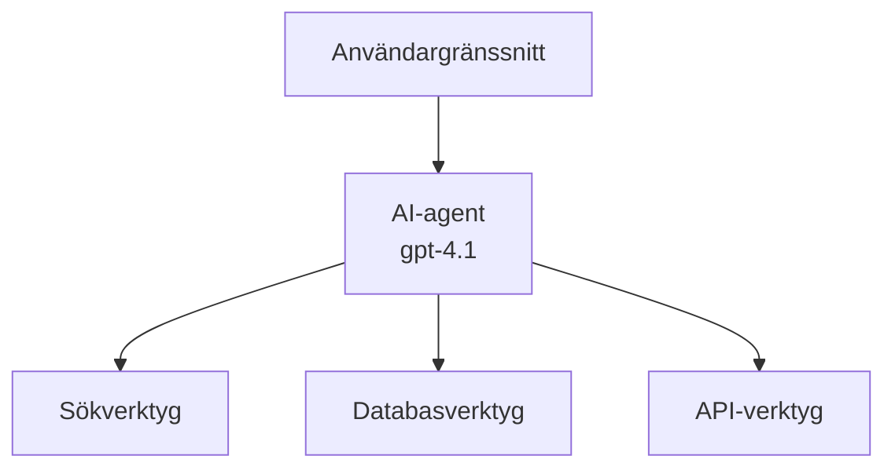
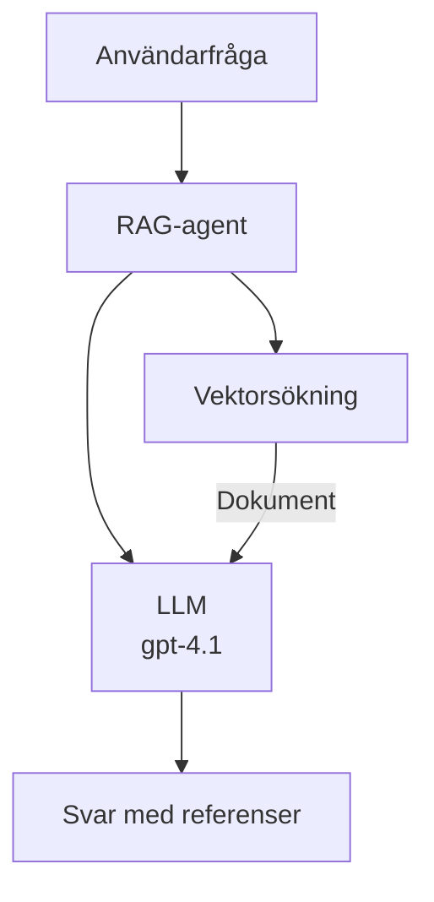

# AI-agenter med Azure Developer CLI

**Chapter Navigation:**
- **📚 Course Home**: [AZD For Beginners](../../README.md)
- **📖 Current Chapter**: Kapitel 2 - AI-First Development
- **⬅️ Previous**: [Microsoft Foundry Integration](microsoft-foundry-integration.md)
- **➡️ Next**: [AI Model Deployment](ai-model-deployment.md)
- **🚀 Advanced**: [Multi-Agent Solutions](../../examples/retail-scenario.md)

---

## Introduction

AI-agenter är autonoma program som kan uppfatta sin omgivning, fatta beslut och vidta åtgärder för att nå specifika mål. Till skillnad från enkla chattbotar som svarar på uppmaningar kan agenter:

- **Använda verktyg** - Anropa API:er, söka i databaser, köra kod
- **Planera och resonera** - Dela upp komplexa uppgifter i steg
- **Lära från kontext** - Behålla minne och anpassa beteende
- **Samarbeta** - Arbeta med andra agenter (multi-agent-system)

Denna guide visar hur du distribuerar AI-agenter till Azure med Azure Developer CLI (azd).

> **Validation note (2026-03-25):** Denna guide granskades mot `azd` `1.23.12` och `azure.ai.agents` `0.1.18-preview`. `azd ai`-upplevelsen är fortfarande preview-driven, så kontrollera förlängningens hjälp om dina installerade flaggor skiljer sig.

## Learning Goals

Genom att slutföra denna guide kommer du att:
- Förstå vad AI-agenter är och hur de skiljer sig från chattbotar
- Distribuera förbyggda AI-agentmallar med AZD
- Konfigurera Foundry Agents för anpassade agenter
- Implementera grundläggande agentmönster (verktygsanvändning, RAG, multi-agent)
- Övervaka och felsöka distribuerade agenter

## Learning Outcomes

Efter slutförandet kommer du att kunna:
- Distribuera AI-agentapplikationer till Azure med ett enda kommando
- Konfigurera agentverktyg och funktioner
- Implementera retrieval-augmented generation (RAG) med agenter
- Designa multi-agentarkitekturer för komplexa arbetsflöden
- Felsöka vanliga problem vid agentdistribution

---

## 🤖 Vad gör en agent annorlunda än en chattbot?

| Feature | Chatbot | AI Agent |
|---------|---------|----------|
| **Behavior** | Responds to prompts | Takes autonomous actions |
| **Tools** | None | Can call APIs, search, execute code |
| **Memory** | Session-based only | Persistent memory across sessions |
| **Planning** | Single response | Multi-step reasoning |
| **Collaboration** | Single entity | Can work with other agents |

### Enkel analogi

- **Chattbot** = En hjälpsam person som svarar på frågor vid en informationsdisk
- **AI-agent** = En personlig assistent som kan ringa, boka möten och slutföra uppgifter åt dig

---

## 🚀 Snabbstart: Distribuera din första agent

### Alternativ 1: Foundry Agents Template (Rekommenderat)

```bash
# Initiera mallen för AI-agenter
azd init --template get-started-with-ai-agents

# Distribuera till Azure
azd up
```

**Vad som distribueras:**
- ✅ Foundry Agents
- ✅ Microsoft Foundry Models (gpt-4.1)
- ✅ Azure AI Search (för RAG)
- ✅ Azure Container Apps (webbgränssnitt)
- ✅ Application Insights (övervakning)

**Tid:** ~15-20 minuter
**Kostnad:** ~$100-150/månad (utveckling)

### Alternativ 2: OpenAI Agent med Prompty

```bash
# Initiera den Prompty-baserade agentmallen
azd init --template agent-openai-python-prompty

# Distribuera till Azure
azd up
```

**Vad som distribueras:**
- ✅ Azure Functions (serverlös agentkörning)
- ✅ Microsoft Foundry Models
- ✅ Prompty-konfigurationsfiler
- ✅ Exempel på agentimplementering

**Tid:** ~10-15 minuter
**Kostnad:** ~$50-100/månad (utveckling)

### Alternativ 3: RAG Chattagent

```bash
# Initiera RAG-chattmall
azd init --template azure-search-openai-demo

# Distribuera till Azure
azd up
```

**Vad som distribueras:**
- ✅ Microsoft Foundry Models
- ✅ Azure AI Search med exempeldata
- ✅ Dokumentbehandlingspipeline
- ✅ Chattgränssnitt med källhänvisningar

**Tid:** ~15-25 minuter
**Kostnad:** ~$80-150/månad (utveckling)

### Alternativ 4: AZD AI Agent Init (Manifest- eller mallbaserad Preview)

Om du har en agentmanifestfil kan du använda kommandot `azd ai` för att skaffa en Foundry Agent Service-projektstruktur direkt. Nyliga preview-utgåvor lade också till mallbaserat initieringsstöd, så den exakta promptflödet kan skilja sig något beroende på din installerade förlängningsversion.

```bash
# Installera tillägget för AI-agenter
azd extension install azure.ai.agents

# Valfritt: verifiera den installerade förhandsvisningsversionen
azd extension show azure.ai.agents

# Initiera från ett agentmanifest
azd ai agent init -m agent-manifest.yaml

# Distribuera till Azure
azd up

# Testa den distribuerade agenten (visar latens + tid till första byte)
azd ai agent invoke
```

**När du ska använda `azd ai agent init` vs `azd init --template`:**

| Approach | Best For | How It Works |
|----------|----------|------|
| `azd init --template` | Starting from a working sample app | Clones a full template repo with code + infra |
| `azd ai agent init -m` | Building from your own agent manifest | Scaffolds project structure from your agent definition |

> **Tip:** Använd `azd init --template` när du lär dig (Alternativ 1–3 ovan). Använd `azd ai agent init` när du bygger produktionsagenter med dina egna manifest.

Efter `azd up` tar samma förlängning dig genom resten av agentlivscykeln: `azd ai agent invoke` för test, `azd ai agent eval generate` och `azd ai agent optimize` för att mäta och förbättra kvaliteten, och `azd ai agent delete` för att rensa upp. Se [AZD AI CLI Commands](../chapter-08-production/production-ai-practices.md#azd-ai-cli-commands-and-extensions) för full referens.

---

## 🏗️ Agentarkitekturmönster

### Mönster 1: Enskild agent med verktyg

Det enklaste agentmönstret - en agent som kan använda flera verktyg.



**Bäst för:**
- Kundsupportbotar
- Forskningsassistenter
- Dataanalysagenter

**AZD Template:** `azure-search-openai-demo`

### Mönster 2: RAG-agent (Retrieval-Augmented Generation)

En agent som hämtar relevanta dokument innan den genererar svar.



**Bäst för:**
- Företags kunskapsbaser
- Dokument Q&A-system
- Compliance och juridisk forskning

**AZD Template:** `azure-search-openai-demo`

### Mönster 3: Multi-Agent-system

Flera specialiserade agenter som arbetar tillsammans med komplexa uppgifter.


**Bäst för:**
- Komplext innehållsskapande
- Flerstegsarbetsflöden
- Uppgifter som kräver olika expertis

**Läs mer:** [Multi-Agent Coordination Patterns](../chapter-06-pre-deployment/coordination-patterns.md)

---

## ⚙️ Konfigurera agentverktyg

Agenter blir kraftfulla när de kan använda verktyg. Så här konfigurerar du vanliga verktyg:

### Verktygskonfiguration i Foundry Agents

```python
# agent_config.py
from azure.ai.projects import AIProjectClient
from azure.ai.projects.models import FunctionTool, CodeInterpreterTool

# Definiera anpassade verktyg
search_tool = FunctionTool(
    name="search_knowledge_base",
    description="Search the company knowledge base for relevant documents",
    parameters={
        "type": "object",
        "properties": {
            "query": {
                "type": "string",
                "description": "The search query"
            }
        },
        "required": ["query"]
    }
)

# Skapa agent med verktyg
agent = project_client.agents.create_agent(
    model="gpt-4.1",
    name="Support Agent",
    instructions="You are a helpful support agent. Use the search tool to find relevant information.",
    tools=[search_tool, CodeInterpreterTool()]
)
```

### Miljökonfiguration

```bash
# Ställ in agentspecifika miljövariabler
azd env set AZURE_OPENAI_MODEL "gpt-4.1"
azd env set AGENT_INSTRUCTIONS "You are a helpful assistant..."
azd env set ENABLE_CODE_INTERPRETER "true"
azd env set ENABLE_FILE_SEARCH "true"

# Distribuera med uppdaterad konfiguration
azd deploy
```

---

## 📊 Övervakning av agenter

### Application Insights-integration

Alla AZD-agentmallar inkluderar Application Insights för övervakning:

```bash
# Öppna övervakningspanelen
azd monitor --overview

# Visa loggar i realtid
azd monitor --logs

# Visa mätvärden i realtid
azd monitor --live
```

### Nyckelmetrik att följa

| Metric | Description | Target |
|--------|-------------|--------|
| Response Latency | Time to generate response | < 5 seconds |
| Token Usage | Tokens per request | Monitor for cost |
| Tool Call Success Rate | % of successful tool executions | > 95% |
| Error Rate | Failed agent requests | < 1% |
| User Satisfaction | Feedback scores | > 4.0/5.0 |

### Anpassad loggning för agenter

```python
import os
from azure.monitor.opentelemetry import configure_azure_monitor
from opentelemetry import trace

# Konfigurera Azure Monitor med OpenTelemetry
configure_azure_monitor(
    connection_string=os.environ["APPLICATIONINSIGHTS_CONNECTION_STRING"]
)

tracer = trace.get_tracer(__name__)

def log_agent_interaction(user_query, agent_response, tools_used, latency_ms):
    with tracer.start_as_current_span("agent_interaction") as span:
        span.set_attributes({
            "user_query": user_query,
            "response_length": len(agent_response),
            "tools_used": tools_used,
            "latency_ms": latency_ms
        })
```

> **Note:** Install the required packages: `pip install azure-monitor-opentelemetry opentelemetry`

---

## 💰 Kostnadsöverväganden

### Uppskattade månadskostnader per mönster

| Pattern | Dev Environment | Production |
|---------|-----------------|------------|
| Single Agent | $50-100 | $200-500 |
| RAG Agent | $80-150 | $300-800 |
| Multi-Agent (2-3 agents) | $150-300 | $500-1,500 |
| Enterprise Multi-Agent | $300-500 | $1,500-5,000+ |

### Tips för kostnadsoptimering

1. **Använd gpt-4.1-mini för enkla uppgifter**
   ```bash
   azd env set AZURE_OPENAI_MODEL "gpt-4.1-mini"
   ```

2. **Implementera caching för upprepade förfrågningar**
   ```python
   from functools import lru_cache
   
   @lru_cache(maxsize=1000)
   def get_cached_response(query_hash):
       return agent.run(query_hash)
   ```

3. **Sätt tokenbegränsningar per körning**
   ```python
   # Ange max_completion_tokens när agenten körs, inte vid skapandet
   run = project_client.agents.create_run(
       thread_id=thread.id,
       agent_id=agent.id,
       max_completion_tokens=1000  # Begränsa svarslängden
   )
   ```

4. **Skala till noll när den inte används**
   ```bash
   # Containerappar skaleras automatiskt ner till noll
   azd env set MIN_REPLICAS "0"
   ```

---

## 🔧 Felsökning av agenter

### Vanliga problem och lösningar

<details>
<summary><strong>❌ Agent svarar inte på verktygsanrop</strong></summary>

```bash
# Kontrollera om verktygen är korrekt registrerade
azd show

# Verifiera OpenAI-distributionen
az cognitiveservices account deployment list \
  --name $AZURE_OPENAI_NAME \
  --resource-group $RG_NAME

# Kontrollera agentloggar
azd monitor --logs
```

**Vanliga orsaker:**
- Signatur för verktygsfunktionen matchar inte
- Saknade nödvändiga behörigheter
- API-slutpunkt inte åtkomlig
</details>

<details>
<summary><strong>❌ Hög latens i agentsvar</strong></summary>

```bash
# Kontrollera Application Insights efter flaskhalsar
azd monitor --live

# Överväg att använda en snabbare modell
azd env set AZURE_OPENAI_MODEL "gpt-4.1-mini"
azd deploy
```

**Optimeringstips:**
- Använd streaming-svar
- Implementera svarscaching
- Minska kontextfönstrets storlek
</details>

<details>
<summary><strong>❌ Agent returnerar felaktig eller hallucinatorisk information</strong></summary>

```python
# Förbättra med bättre systempromptar
instructions = """
You are a helpful assistant. IMPORTANT:
- Only answer based on provided context
- If you don't know, say "I don't know"
- Always cite your sources
- Never make up information
"""

# Lägg till hämtning för förankring
agent = project_client.agents.create_agent(
    model="gpt-4.1",
    instructions=instructions,
    tools=[FileSearchTool()]  # Förankra svar i dokument
)
```
</details>

<details>
<summary><strong>❌ Tokenbegränsning överskriden fel</strong></summary>

```python
# Implementera hantering av kontextfönster
def truncate_context(messages, max_tokens=8000, model="gpt-4.1"):
    """Keep only recent messages within token limit."""
    import tiktoken
    encoding = tiktoken.encoding_for_model(model)
    total_tokens = 0
    truncated = []
    
    for msg in reversed(messages):
        msg_tokens = len(encoding.encode(msg.content))
        if total_tokens + msg_tokens > max_tokens:
            break
        truncated.insert(0, msg)
        total_tokens += msg_tokens
    
    return truncated
```
</details>

---

## 🎓 Praktiska övningar

### Övning 1: Distribuera en grundläggande agent (20 minuter)

**Mål:** Distribuera din första AI-agent med AZD

```bash
# Steg 1: Initiera mallen
azd init --template get-started-with-ai-agents

# Steg 2: Logga in på Azure
azd auth login
# Om du arbetar över flera tenants, lägg till --tenant-id <tenant-id>

# Steg 3: Distribuera
azd up

# Steg 4: Testa agenten
# Förväntad utdata efter distribution:
#   Distribution slutförd!
#   Slutpunkt: https://<app-name>.<region>.azurecontainerapps.io
# Öppna URL:en som visas i utdata och försök ställa en fråga

# Steg 5: Visa övervakning
azd monitor --overview

# Steg 6: Rensa upp
azd down --force --purge
```

**Framgångskriterier:**
- [ ] Agent svarar på frågor
- [ ] Kan komma åt övervakningspanelen via `azd monitor`
- [ ] Resurser rensades upp framgångsrikt

### Övning 2: Lägg till ett anpassat verktyg (30 minuter)

**Mål:** Utöka en agent med ett anpassat verktyg

1. Distribuera agentmallen:
   ```bash
   azd init --template get-started-with-ai-agents
   azd up
   ```
2. Skapa en ny verktygsfunktion i din agentkod:
   ```python
   def get_weather(location: str) -> str:
       """Get current weather for a location."""
       # API-anrop till vädertjänst
       return f"Weather in {location}: Sunny, 72°F"
   ```
3. Registrera verktyget med agenten:
   ```python
   from azure.ai.projects.models import FunctionTool

   weather_tool = FunctionTool(
       name="get_weather",
       description="Get current weather for a location",
       parameters={
           "type": "object",
           "properties": {
               "location": {"type": "string", "description": "City name"}
           },
           "required": ["location"]
       }
   )

   agent = project_client.agents.create_agent(
       model="gpt-4.1",
       name="Weather Agent",
       tools=[weather_tool]
   )
   ```
4. Distribuera om och testa:
   ```bash
   azd deploy
   # Fråga: "Vad är vädret i Seattle?"
   # Förväntat: Agenten anropar get_weather("Seattle") och returnerar väderinformation
   ```

**Framgångskriterier:**
- [ ] Agent känner igen väderrelaterade frågor
- [ ] Verktyget anropas korrekt
- [ ] Svaret innehåller väderinformation

### Övning 3: Bygg en RAG-agent (45 minuter)

**Mål:** Skapa en agent som svarar på frågor från dina dokument

```bash
# Steg 1: Distribuera RAG-mallen
azd init --template azure-search-openai-demo
azd up

# Steg 2: Ladda upp dina dokument
# Placera PDF/TXT-filer i katalogen data/, kör sedan:
python scripts/prepdocs.py

# Steg 3: Testa med domänspecifika frågor
# Öppna webbappens URL från 'azd up'-utdata
# Ställ frågor om dina uppladdade dokument
# Svar bör innehålla källhänvisningar som [doc.pdf]
```

**Framgångskriterier:**
- [ ] Agent svarar från uppladdade dokument
- [ ] Svaren inkluderar källhänvisningar
- [ ] Ingen hallucination på frågor utanför omfattningen

---

## 📚 Nästa steg

Nu när du förstår AI-agenter, utforska dessa avancerade ämnen:

| Topic | Description | Link |
|-------|-------------|------|
| **Multi-Agent Systems** | Build systems with multiple collaborating agents | [Retail Multi-Agent Example](../../examples/retail-scenario.md) |
| **Coordination Patterns** | Learn orchestration and communication patterns | [Coordination Patterns](../chapter-06-pre-deployment/coordination-patterns.md) |
| **Production Deployment** | Enterprise-ready agent deployment | [Production AI Practices](../chapter-08-production/production-ai-practices.md) |
| **Agent Evaluation** | Test and evaluate agent performance | [AI Troubleshooting](../chapter-07-troubleshooting/ai-troubleshooting.md) |
| **AI Workshop Lab** | Hands-on: Make your AI solution AZD-ready | [AI Workshop Lab](ai-workshop-lab.md) |

---

## 📖 Ytterligare resurser

### Officiell dokumentation
- [Microsoft Foundry Agent Service](https://learn.microsoft.com/azure/ai-services/agents/)
- [Microsoft Foundry Agent Service Quickstart](https://learn.microsoft.com/azure/ai-services/agents/quickstart)
- [Semantic Kernel Agent Framework](https://learn.microsoft.com/semantic-kernel/)

### AZD-mallar för agenter
- [Get Started with AI Agents](https://github.com/Azure-Samples/get-started-with-ai-agents)
- [Agent OpenAI Python Prompty](https://github.com/Azure-Samples/agent-openai-python-prompty)
- [Azure Search OpenAI Demo](https://github.com/Azure-Samples/azure-search-openai-demo)

### Communityresurser
- [Awesome AZD - Agent Templates](https://azure.github.io/awesome-azd/?tags=ai-agents)
- [Azure AI Discord](https://discord.gg/microsoft-azure)
- [Microsoft Foundry Discord](https://discord.gg/nTYy5BXMWG)

### Agent Skills för din redigerare
- [**Microsoft Azure Agent Skills**](https://skills.sh/microsoft/github-copilot-for-azure) - Installera återanvändbara AI-agentfärdigheter för Azure-utveckling i GitHub Copilot, Cursor eller någon stödd agent. Inkluderar färdigheter för [Azure AI](https://skills.sh/microsoft/github-copilot-for-azure/azure-ai), [Microsoft Foundry](https://skills.sh/microsoft/github-copilot-for-azure/microsoft-foundry), [deployment](https://skills.sh/microsoft/github-copilot-for-azure/azure-deploy), och [diagnostics](https://skills.sh/microsoft/github-copilot-for-azure/azure-diagnostics):
  ```bash
  npx skills add microsoft/github-copilot-for-azure
  ```

---

**Navigation**
- **Previous Lesson**: [Microsoft Foundry Integration](microsoft-foundry-integration.md)
- **Next Lesson**: [AI Model Deployment](ai-model-deployment.md)

---

<!-- CO-OP TRANSLATOR DISCLAIMER START -->
**Ansvarsfriskrivning**:
Detta dokument har översatts med hjälp av AI-översättningstjänsten [Co-op Translator](https://github.com/Azure/co-op-translator). Även om vi strävar efter noggrannhet, var vänlig notera att automatiska översättningar kan innehålla fel eller brister. Det ursprungliga dokumentet på dess modersmål bör betraktas som den auktoritativa källan. För kritisk information rekommenderas professionell mänsklig översättning. Vi ansvarar inte för några missförstånd eller feltolkningar som uppstår till följd av användningen av denna översättning.
<!-- CO-OP TRANSLATOR DISCLAIMER END -->