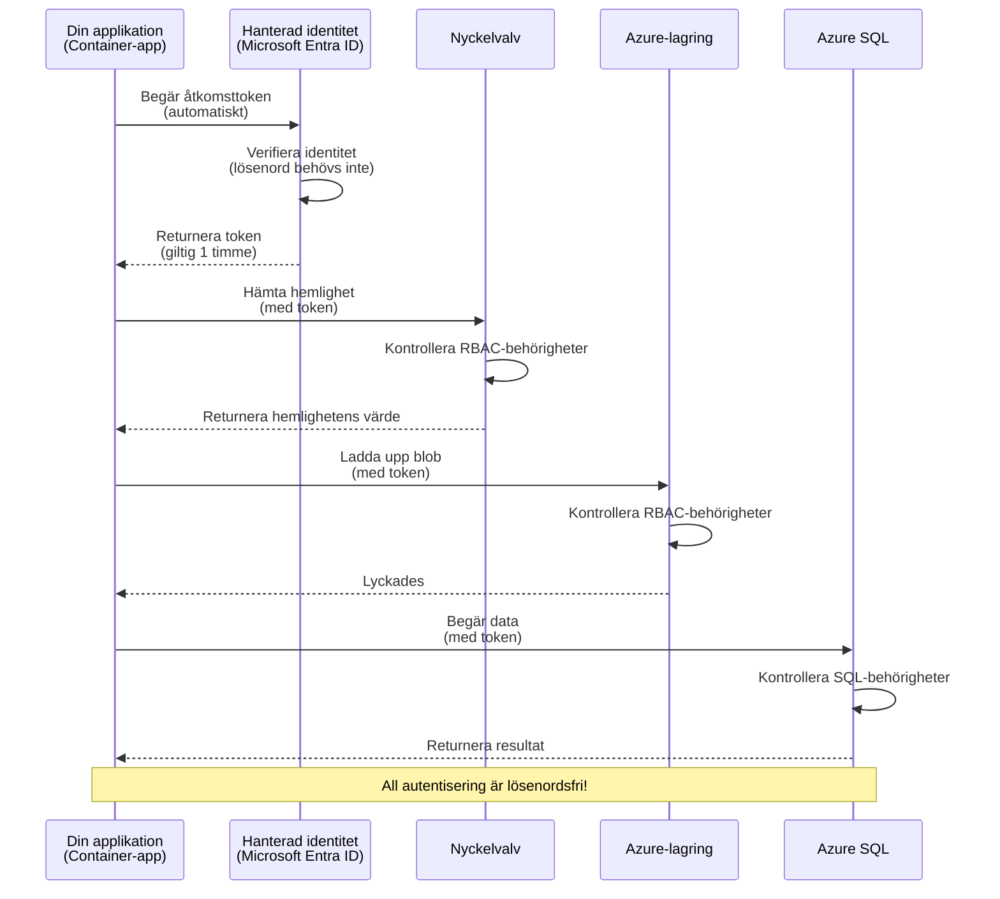
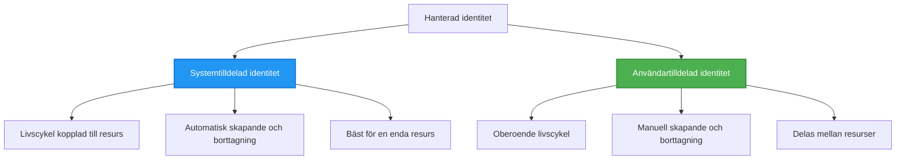

# Autentiseringsmönster och hanterad identitet

⏱️ **Beräknad tid**: 45-60 minuter | 💰 **Kostnadspåverkan**: Gratis (inga ytterligare avgifter) | ⭐ **Komplexitet**: Medel

**📚 Lärandespår:**
- ← Föregående: [Konfigurationshantering](configuration.md) - Hantera miljövariabler och hemligheter
- 🎯 **Du är här**: Autentisering & Säkerhet (Hanterad identitet, Key Vault, säkra mönster)
- → Nästa: [Första projektet](first-project.md) - Bygg din första AZD-applikation
- 🏠 [Kursöversikt](../../README.md)

---

## Vad du kommer att lära dig

Genom att slutföra denna lektion kommer du att:
- Förstå Azure-autentiseringsmönster (nycklar, anslutningssträngar, hanterad identitet)
- Implementera **hanterad identitet** för lösenordslös autentisering
- Säkra hemligheter med **Azure Key Vault**-integration
- Konfigurera **rollbaserad åtkomstkontroll (RBAC)** för AZD-distributioner
- Tillämpa säkerhetsbästa praxis i Container Apps och Azure-tjänster
- Migrera från nyckelbaserad till identitetsbaserad autentisering

## Varför hanterad identitet är viktig

### Problemet: traditionell autentisering

**Innan hanterad identitet:**
```javascript
// ❌ SÄKERHETSRISK: Hårdkodade hemligheter i koden
const connectionString = "Server=mydb.database.windows.net;User=admin;Password=P@ssw0rd123";
const storageKey = "xK7mN9pQ2wR5tY8uI0oP3aS6dF1gH4jK...";
const cosmosKey = "C2x7B9n4M1p8Q5w3E6r0T2y5U8i1O4p7...";
```

**Problem:**
- 🔴 **Utsatta hemligheter** i kod, konfigurationsfiler, miljövariabler
- 🔴 **Kredentialrotation** kräver kodändringar och ny distribution
- 🔴 **Revisionsmardrömmar** - vem åtkom vad, när?
- 🔴 **Spridning** - hemligheter utspridda över flera system
- 🔴 **Efterlevnadsrisker** - underkänner säkerhetsrevisioner

### Lösningen: hanterad identitet

**Efter hanterad identitet:**
```javascript
// ✅ SÄKERT: Inga hemligheter i koden
const credential = new DefaultAzureCredential();
const client = new BlobServiceClient(
  "https://mystorageaccount.blob.core.windows.net",
  credential  // Azure hanterar autentisering automatiskt
);
```

**Fördelar:**
- ✅ **Inga hemligheter** i kod eller konfiguration
- ✅ **Automatisk rotation** - Azure hanterar det
- ✅ **Full revisionsspårning** i Microsoft Entra ID-loggar
- ✅ **Centraliserad säkerhet** - hantera i Azure-portalen
- ✅ **Efterlevnadsklar** - uppfyller säkerhetsstandarder

**Analogi**: Traditionell autentisering är som att bära flera fysiska nycklar för olika dörrar. Hanterad identitet är som att ha ett säkerhetskort som automatiskt ger åtkomst baserat på vem du är—inga nycklar att tappa, kopiera eller rotera.

---

## Arkitekturöversikt

### Autentiseringsflöde med hanterad identitet



### Typer av hanterade identiteter



| Funktion | Systemtilldelad | Användartilldelad |
|---------|----------------|---------------|
| **Livscykel** | Bunden till resurs | Oberoende |
| **Skapande** | Automatisk med resurs | Manuellt skapad |
| **Borttagning** | Raderas med resurs | Består efter radering av resurs |
| **Delning** | Endast en resurs | Flera resurser |
| **Användningsfall** | Enkla scenarier | Komplexa scenarier med flera resurser |
| **AZD standard** | ✅ Rekommenderas | Valfritt |

---

## Förutsättningar

### Nödvändiga verktyg

Du bör redan ha dessa installerade från tidigare lektioner:

```bash
# Verifiera Azure Developer CLI
azd version
# ✅ Förväntat: azd version 1.0.0 eller högre

# Verifiera Azure CLI
az --version
# ✅ Förväntat: azure-cli 2.50.0 eller högre
```

### Azure-krav

- Aktiv Azure-prenumeration
- Behörigheter för:
  - Skapa hanterade identiteter
  - Tilldela RBAC-roller
  - Skapa Key Vault-resurser
  - Distribuera Container Apps

### Förkunskaper

Du bör ha slutfört:
- [Installationsguide](installation.md) - AZD-installation
- [AZD-grunderna](azd-basics.md) - Kärnkoncept
- [Konfigurationshantering](configuration.md) - Miljövariabler

---

## Lektion 1: Förstå autentiseringsmönster

### Mönster 1: Anslutningssträngar (Legacy - Undvik)

**Hur det fungerar:**
```bash
# Anslutningssträngen innehåller autentiseringsuppgifter
STORAGE_CONNECTION_STRING="DefaultEndpointsProtocol=https;AccountName=myaccount;AccountKey=xK7mN9pQ2wR5..."
COSMOS_CONNECTION_STRING="AccountEndpoint=https://myaccount.documents.azure.com:443/;AccountKey=C2x7..."
SQL_CONNECTION_STRING="Server=myserver.database.windows.net;User=admin;Password=P@ssw0rd..."
```

**Problem:**
- ❌ Hemligheter synliga i miljövariabler
- ❌ Loggas i distributionssystem
- ❌ Svårt att rotera
- ❌ Ingen revisionslogg över åtkomst

**När det ska användas:** Endast för lokal utveckling, aldrig i produktion.

---

### Mönster 2: Key Vault-referenser (Bättre)

**Hur det fungerar:**
```bicep
// Store secret in Key Vault
resource keyVault 'Microsoft.KeyVault/vaults@2023-02-01' = {
  name: 'mykv'
  properties: {
    enableRbacAuthorization: true
  }
}

// Reference in Container App
env: [
  {
    name: 'STORAGE_KEY'
    secretRef: 'storage-key'  // References Key Vault
  }
]
```

**Fördelar:**
- ✅ Hemligheter lagras säkert i Key Vault
- ✅ Centraliserad hantering av hemligheter
- ✅ Rotering utan kodändringar

**Begränsningar:**
- ⚠️ Använder fortfarande nycklar/lösenord
- ⚠️ Behöver hantera åtkomst till Key Vault

**När det ska användas:** Övergångssteg från anslutningssträngar till hanterad identitet.

---

### Mönster 3: Hanterad identitet (Bästa praxis)

**Hur det fungerar:**
```bicep
// Enable managed identity
resource containerApp 'Microsoft.App/containerApps@2023-05-01' = {
  name: 'myapp'
  identity: {
    type: 'SystemAssigned'  // Automatically creates identity
  }
}

// Grant permissions
resource roleAssignment 'Microsoft.Authorization/roleAssignments@2022-04-01' = {
  scope: storageAccount
  properties: {
    roleDefinitionId: storageBlobDataContributorRole
    principalId: containerApp.identity.principalId
  }
}
```

**Applikationskod:**
```javascript
// Inga hemligheter behövs!
const { DefaultAzureCredential } = require('@azure/identity');
const { BlobServiceClient } = require('@azure/storage-blob');

const credential = new DefaultAzureCredential();
const blobServiceClient = new BlobServiceClient(
  'https://mystorageaccount.blob.core.windows.net',
  credential
);
```

**Fördelar:**
- ✅ Inga hemligheter i kod/konfig
- ✅ Automatisk credential-rotation
- ✅ Full revisionsspårning
- ✅ RBAC-baserade behörigheter
- ✅ Efterlevnadsklar

**När det ska användas:** Alltid, för produktionsapplikationer.

---

### Mönster 4: Serviceprincipaler (CI/CD & Automation)

Hanterad identitet är guldkant *för resurser som körs inom Azure*. Men vad händer med saker som körs **utanför** Azure—som en CI/CD-pipeline på en build-agent, eller ett skript på din laptop som inte kan använda din interaktiva inloggning? Där kommer en **serviceprincipal** in: en icke-mänsklig identitet med sina egna autentiseringsuppgifter som en automatiserad process kan logga in som.

**Hur det fungerar:**

Skapa en serviceprincipal begränsad till en resursgrupp (principen om minsta privilegium):

```bash
az ad sp create-for-rbac \
  --name "myapp-cicd" \
  --role contributor \
  --scopes /subscriptions/<sub-id>/resourceGroups/<rg-name>
```

Detta skriver ut ett klient-ID, klienthemlighet och tenant-ID. azd kan logga in med dem icke-interaktivt:

```bash
azd auth login \
  --client-id "<appId>" \
  --client-secret "<password>" \
  --tenant-id "<tenant>"
```

**Föredra federerade referenser (OIDC) framför hemligheter.** Istället för en långlivad klienthemlighet, konfigurera en federerad referens så pipelinen byter en kortlivad token—ingen hemlighet att läcka eller rotera:

```bash
azd auth login \
  --client-id "<appId>" \
  --federated-credential-provider "github" \
  --tenant-id "<tenant>"
```

> `azd pipeline config` ställer in detta åt dig automatiskt. Se CI/CD-genomgångarna i [Chapter 8](../chapter-08-production/production-ai-practices.md).

**Fördelar:**
- ✅ Fungerar utanför Azure (build-agenter, on-prem, andra moln)
- ✅ Kan begränsas till en resursgrupp med en roll
- ✅ Federerad (OIDC) variant använder ingen lagrad hemlighet

**Avvägningar:**
- ⚠️ Hemlighetsbaserad variant kräver noggrann lagring och rotation
- ⚠️ En läckt hemlighet ger allt det SP kan göra—håll scope tajta

**När det ska användas:** CI/CD-pipelines och automation som inte kan använda hanterad identitet. Föredra alltid **federerad/OIDC**-variant framför en klienthemlighet, och föredra hanterad identitet när arbetsbelastningen körs inom Azure.

**Säker lagring av referenser:**
- Begå aldrig hemligheter—använd pipelinens hemlighetslager (GitHub Actions secrets, Azure DevOps variable groups / Key Vault).
- Begränsa SP till den minsta roll och resursgrupp den behöver.
- Sätt en utgångstid och rotera, eller eliminera hemligheten helt med OIDC.

---

## Lektion 2: Implementera hanterad identitet med AZD

### Steg-för-steg-implementering

Låt oss bygga en säker Container App som använder hanterad identitet för att komma åt Azure Storage och Key Vault.

### Projektstruktur

```
secure-app/
├── azure.yaml                 # AZD configuration
├── infra/
│   ├── main.bicep            # Main infrastructure
│   ├── core/
│   │   ├── identity.bicep    # Managed identity setup
│   │   ├── keyvault.bicep    # Key Vault configuration
│   │   └── storage.bicep     # Storage with RBAC
│   └── app/
│       └── container-app.bicep
└── src/
    ├── app.js                # Application code
    ├── package.json
    └── Dockerfile
```

### 1. Konfigurera AZD (azure.yaml)

```yaml
name: secure-app
metadata:
  template: secure-app@1.0.0

services:
  api:
    project: ./src
    language: js
    host: containerapp

# Enable managed identity (AZD handles this automatically)
```

### 2. Infrastruktur: Aktivera hanterad identitet

**Fil: `infra/main.bicep`**

```bicep
targetScope = 'subscription'

param environmentName string
param location string = 'eastus'

var tags = { 'azd-env-name': environmentName }

// Resource group
resource rg 'Microsoft.Resources/resourceGroups@2021-04-01' = {
  name: 'rg-${environmentName}'
  location: location
  tags: tags
}

// Storage Account
module storage './core/storage.bicep' = {
  name: 'storage'
  scope: rg
  params: {
    name: 'st${uniqueString(rg.id)}'
    location: location
    tags: tags
  }
}

// Key Vault
module keyVault './core/keyvault.bicep' = {
  name: 'keyvault'
  scope: rg
  params: {
    name: 'kv-${uniqueString(rg.id)}'
    location: location
    tags: tags
  }
}

// Container App with Managed Identity
module containerApp './app/container-app.bicep' = {
  name: 'container-app'
  scope: rg
  params: {
    name: 'ca-${environmentName}'
    location: location
    tags: tags
    storageAccountName: storage.outputs.name
    keyVaultName: keyVault.outputs.name
  }
}

// Grant Container App access to Storage
module storageRoleAssignment './core/role-assignment.bicep' = {
  name: 'storage-role'
  scope: rg
  params: {
    principalId: containerApp.outputs.identityPrincipalId
    roleDefinitionId: 'ba92f5b4-2d11-453d-a403-e96b0029c9fe'  // Storage Blob Data Contributor
    targetResourceId: storage.outputs.id
  }
}

// Grant Container App access to Key Vault
module kvRoleAssignment './core/role-assignment.bicep' = {
  name: 'kv-role'
  scope: rg
  params: {
    principalId: containerApp.outputs.identityPrincipalId
    roleDefinitionId: '4633458b-17de-408a-b874-0445c86b69e6'  // Key Vault Secrets User
    targetResourceId: keyVault.outputs.id
  }
}

// Outputs
output AZURE_STORAGE_ACCOUNT_NAME string = storage.outputs.name
output AZURE_KEY_VAULT_NAME string = keyVault.outputs.name
output APP_URL string = containerApp.outputs.url
```

### 3. Container App med systemtilldelad identitet

**Fil: `infra/app/container-app.bicep`**

```bicep
param name string
param location string
param tags object = {}
param storageAccountName string
param keyVaultName string

resource containerApp 'Microsoft.App/containerApps@2023-05-01' = {
  name: name
  location: location
  tags: tags
  identity: {
    type: 'SystemAssigned'  // 🔑 Enable managed identity
  }
  properties: {
    configuration: {
      ingress: {
        external: true
        targetPort: 3000
      }
    }
    template: {
      containers: [
        {
          name: 'api'
          image: 'myregistry.azurecr.io/api:latest'
          resources: {
            cpu: json('0.5')
            memory: '1Gi'
          }
          env: [
            {
              name: 'AZURE_STORAGE_ACCOUNT_NAME'
              value: storageAccountName
            }
            {
              name: 'AZURE_KEY_VAULT_NAME'
              value: keyVaultName
            }
            // 🔑 No secrets - managed identity handles authentication!
          ]
        }
      ]
    }
  }
}

// Output the identity for RBAC assignments
output identityPrincipalId string = containerApp.identity.principalId
output id string = containerApp.id
output url string = 'https://${containerApp.properties.configuration.ingress.fqdn}'
```

### 4. RBAC-rolltilldelningsmodul

**Fil: `infra/core/role-assignment.bicep`**

```bicep
param principalId string
param roleDefinitionId string  // Azure built-in role ID
param targetResourceId string

resource roleAssignment 'Microsoft.Authorization/roleAssignments@2022-04-01' = {
  name: guid(principalId, roleDefinitionId, targetResourceId)
  scope: resourceId('Microsoft.Resources/resourceGroups', resourceGroup().name)
  properties: {
    roleDefinitionId: subscriptionResourceId('Microsoft.Authorization/roleDefinitions', roleDefinitionId)
    principalId: principalId
    principalType: 'ServicePrincipal'
  }
}

output id string = roleAssignment.id
```

### 5. Applikationskod med hanterad identitet

**Fil: `src/app.js`**

```javascript
const express = require('express');
const { DefaultAzureCredential } = require('@azure/identity');
const { BlobServiceClient } = require('@azure/storage-blob');
const { SecretClient } = require('@azure/keyvault-secrets');

const app = express();
const PORT = process.env.PORT || 3000;

// 🔑 Initiera autentiseringsuppgifter (fungerar automatiskt med hanterad identitet)
const credential = new DefaultAzureCredential();

// Inställning för Azure Storage
const storageAccountName = process.env.AZURE_STORAGE_ACCOUNT_NAME;
const blobServiceClient = new BlobServiceClient(
  `https://${storageAccountName}.blob.core.windows.net`,
  credential  // Inga nycklar behövs!
);

// Inställning för Key Vault
const keyVaultName = process.env.AZURE_KEY_VAULT_NAME;
const secretClient = new SecretClient(
  `https://${keyVaultName}.vault.azure.net`,
  credential  // Inga nycklar behövs!
);

// Hälsokontroll
app.get('/health', (req, res) => {
  res.json({ status: 'healthy', authentication: 'managed-identity' });
});

// Ladda upp fil till bloblagring
app.post('/upload', async (req, res) => {
  try {
    const containerClient = blobServiceClient.getContainerClient('uploads');
    await containerClient.createIfNotExists();
    
    const blobName = `file-${Date.now()}.txt`;
    const blockBlobClient = containerClient.getBlockBlobClient(blobName);
    
    await blockBlobClient.upload('Hello from managed identity!', 30);
    
    res.json({
      success: true,
      blobName: blobName,
      message: 'File uploaded using managed identity!'
    });
  } catch (error) {
    console.error('Upload error:', error);
    res.status(500).json({ error: error.message });
  }
});

// Hämta hemlighet från Key Vault
app.get('/secret/:name', async (req, res) => {
  try {
    const secretName = req.params.name;
    const secret = await secretClient.getSecret(secretName);
    
    res.json({
      name: secretName,
      value: secret.value,
      message: 'Secret retrieved using managed identity!'
    });
  } catch (error) {
    console.error('Secret error:', error);
    res.status(500).json({ error: error.message });
  }
});

// Lista blobbehållare (visar läsåtkomst)
app.get('/containers', async (req, res) => {
  try {
    const containers = [];
    for await (const container of blobServiceClient.listContainers()) {
      containers.push(container.name);
    }
    
    res.json({
      containers: containers,
      count: containers.length,
      message: 'Containers listed using managed identity!'
    });
  } catch (error) {
    console.error('List error:', error);
    res.status(500).json({ error: error.message });
  }
});

app.listen(PORT, () => {
  console.log(`Secure API listening on port ${PORT}`);
  console.log('Authentication: Managed Identity (passwordless)');
});
```

**Fil: `src/package.json`**

```json
{
  "name": "secure-app",
  "version": "1.0.0",
  "dependencies": {
    "express": "^4.18.2",
    "@azure/identity": "^4.0.0",
    "@azure/storage-blob": "^12.17.0",
    "@azure/keyvault-secrets": "^4.7.0"
  },
  "scripts": {
    "start": "node app.js"
  }
}
```

### 6. Distribuera och testa

```bash
# Initiera AZD-miljö
azd init

# Driftsätt infrastruktur och applikation
azd up

# Hämta appens URL
APP_URL=$(azd env get-values | grep APP_URL | cut -d '=' -f2 | tr -d '"')

# Testa hälsokontrollen
curl $APP_URL/health
```

**✅ Förväntat resultat:**
```json
{
  "status": "healthy",
  "authentication": "managed-identity"
}
```

**Testa blob-uppladdning:**
```bash
curl -X POST $APP_URL/upload
```

**✅ Förväntat resultat:**
```json
{
  "success": true,
  "blobName": "file-1700404800000.txt",
  "message": "File uploaded using managed identity!"
}
```

**Testa containerlista:**
```bash
curl $APP_URL/containers
```

**✅ Förväntat resultat:**
```json
{
  "containers": ["uploads"],
  "count": 1,
  "message": "Containers listed using managed identity!"
}
```

---

## Vanliga Azure RBAC-roller

### Inbyggda roll-ID:n för hanterad identitet

| Tjänst | Rollnamn | Roll-ID | Behörigheter |
|---------|-----------|---------|-------------|
| **Storage** | Storage Blob Data Reader | `2a2b9908-6b94-4a3d-8e5a-a7d8f8cc8a12` | Läsa blobbar och containers |
| **Storage** | Storage Blob Data Contributor | `ba92f5b4-2d11-453d-a403-e96b0029c9fe` | Läsa, skriva, ta bort blobbar |
| **Storage** | Storage Queue Data Contributor | `974c5e8b-45b9-4653-ba55-5f855dd0fb88` | Läsa, skriva, ta bort kömeddelanden |
| **Key Vault** | Key Vault Secrets User | `4633458b-17de-408a-b874-0445c86b69e6` | Läsa hemligheter |
| **Key Vault** | Key Vault Secrets Officer | `b86a8fe4-44ce-4948-aee5-eccb2c155cd7` | Läsa, skriva, ta bort hemligheter |
| **Cosmos DB** | Cosmos DB Built-in Data Reader | `00000000-0000-0000-0000-000000000001` | Läsa Cosmos DB-data |
| **Cosmos DB** | Cosmos DB Built-in Data Contributor | `00000000-0000-0000-0000-000000000002` | Läsa, skriva Cosmos DB-data |
| **SQL Database** | SQL DB Contributor | `9b7fa17d-e63e-47b0-bb0a-15c516ac86ec` | Hantera SQL-databaser |
| **Service Bus** | Azure Service Bus Data Owner | `090c5cfd-751d-490a-894a-3ce6f1109419` | Skicka, ta emot och hantera meddelanden |

### Hur man hittar roll-ID:n

```bash
# Lista alla inbyggda roller
az role definition list --query "[].{Name:roleName, ID:name}" --output table

# Sök efter en specifik roll
az role definition list --query "[?contains(roleName, 'Storage Blob')].{Name:roleName, ID:name}" --output table

# Hämta detaljer om rollen
az role definition list --name "Storage Blob Data Contributor"
```

---

## Praktiska övningar

### Övning 1: Aktivera hanterad identitet för befintlig app ⭐⭐ (Medel)

**Mål**: Lägg till hanterad identitet i en befintlig Container App-distribution

**Scenario**: Du har en Container App som använder anslutningssträngar. Konvertera den till hanterad identitet.

**Startpunkt**: Container App med denna konfiguration:

```bicep
// ❌ Current: Using connection string
env: [
  {
    name: 'STORAGE_CONNECTION_STRING'
    secretRef: 'storage-connection'
  }
]
```

**Steg**:

1. **Aktivera hanterad identitet i Bicep:**

```bicep
resource containerApp 'Microsoft.App/containerApps@2023-05-01' = {
  name: 'myapp'
  identity: {
    type: 'SystemAssigned'  // Add this
  }
  // ... rest of configuration
}
```

2. **Ge Storage-åtkomst:**

```bicep
// Get storage account reference
resource storageAccount 'Microsoft.Storage/storageAccounts@2023-01-01' existing = {
  name: storageAccountName
}

// Assign role
resource roleAssignment 'Microsoft.Authorization/roleAssignments@2022-04-01' = {
  name: guid(containerApp.id, 'ba92f5b4-2d11-453d-a403-e96b0029c9fe', storageAccount.id)
  scope: storageAccount
  properties: {
    roleDefinitionId: subscriptionResourceId('Microsoft.Authorization/roleDefinitions', 'ba92f5b4-2d11-453d-a403-e96b0029c9fe')
    principalId: containerApp.identity.principalId
    principalType: 'ServicePrincipal'
  }
}
```

3. **Uppdatera applikationskoden:**

**Före (anslutningssträng):**
```javascript
const { BlobServiceClient } = require('@azure/storage-blob');

const blobServiceClient = BlobServiceClient.fromConnectionString(
  process.env.STORAGE_CONNECTION_STRING
);
```

**Efter (hanterad identitet):**
```javascript
const { DefaultAzureCredential } = require('@azure/identity');
const { BlobServiceClient } = require('@azure/storage-blob');

const credential = new DefaultAzureCredential();
const blobServiceClient = new BlobServiceClient(
  `https://${process.env.STORAGE_ACCOUNT_NAME}.blob.core.windows.net`,
  credential
);
```

4. **Uppdatera miljövariabler:**

```bicep
env: [
  {
    name: 'STORAGE_ACCOUNT_NAME'
    value: storageAccountName  // Just the name, no secrets!
  }
  // Remove STORAGE_CONNECTION_STRING
]
```

5. **Distribuera och testa:**

```bash
# Distribuera om
azd up

# Testa att det fortfarande fungerar
curl https://myapp.azurecontainerapps.io/upload
```

**✅ Framgångskriterier:**
- ✅ Applikationen distribueras utan fel
- ✅ Storage-operationer fungerar (ladda upp, lista, ladda ner)
- ✅ Inga anslutningssträngar i miljövariabler
- ✅ Identiteten syns i Azure-portalen under "Identity" bladet

**Verifiering:**

```bash
# Kontrollera att hanterad identitet är aktiverad
az containerapp show \
  --name myapp \
  --resource-group rg-myapp \
  --query "identity.type"
# ✅ Förväntat: "SystemAssigned"

# Kontrollera rolltilldelning
az role assignment list \
  --assignee $(az containerapp show --name myapp --resource-group rg-myapp --query "identity.principalId" -o tsv) \
  --scope /subscriptions/{sub-id}/resourceGroups/rg-myapp/providers/Microsoft.Storage/storageAccounts/mystorageaccount
# ✅ Förväntat: Visar rollen "Storage Blob Data Contributor"
```

**Tid**: 20-30 minuter

---

### Övning 2: Åtkomst för flera tjänster med användartilldelad identitet ⭐⭐⭐ (Avancerad)

**Mål**: Skapa en användartilldelad identitet som delas mellan flera Container Apps

**Scenario**: Du har 3 mikrotjänster som alla behöver åtkomst till samma Storage-konto och Key Vault.

**Steg**:

1. **Skapa användartilldelad identitet:**

**Fil: `infra/core/identity.bicep`**

```bicep
param name string
param location string
param tags object = {}

resource userAssignedIdentity 'Microsoft.ManagedIdentity/userAssignedIdentities@2023-01-31' = {
  name: name
  location: location
  tags: tags
}

output id string = userAssignedIdentity.id
output principalId string = userAssignedIdentity.properties.principalId
output clientId string = userAssignedIdentity.properties.clientId
```

2. **Tilldela roller till användartilldelad identitet:**

```bicep
// In main.bicep
module userIdentity './core/identity.bicep' = {
  name: 'user-identity'
  scope: rg
  params: {
    name: 'id-${environmentName}'
    location: location
    tags: tags
  }
}

// Grant Storage access
resource storageRoleAssignment 'Microsoft.Authorization/roleAssignments@2022-04-01' = {
  name: guid(userIdentity.outputs.principalId, 'storage-contributor')
  scope: storageAccount
  properties: {
    roleDefinitionId: subscriptionResourceId('Microsoft.Authorization/roleDefinitions', 'ba92f5b4-2d11-453d-a403-e96b0029c9fe')
    principalId: userIdentity.outputs.principalId
    principalType: 'ServicePrincipal'
  }
}

// Grant Key Vault access
resource kvRoleAssignment 'Microsoft.Authorization/roleAssignments@2022-04-01' = {
  name: guid(userIdentity.outputs.principalId, 'kv-secrets-user')
  scope: keyVault
  properties: {
    roleDefinitionId: subscriptionResourceId('Microsoft.Authorization/roleDefinitions', '4633458b-17de-408a-b874-0445c86b69e6')
    principalId: userIdentity.outputs.principalId
    principalType: 'ServicePrincipal'
  }
}
```

3. **Tilldela identiteten till flera Container Apps:**

```bicep
resource apiGateway 'Microsoft.App/containerApps@2023-05-01' = {
  name: 'api-gateway'
  identity: {
    type: 'UserAssigned'
    userAssignedIdentities: {
      '${userIdentity.outputs.id}': {}
    }
  }
  // ... rest of config
}

resource productService 'Microsoft.App/containerApps@2023-05-01' = {
  name: 'product-service'
  identity: {
    type: 'UserAssigned'
    userAssignedIdentities: {
      '${userIdentity.outputs.id}': {}
    }
  }
  // ... rest of config
}

resource orderService 'Microsoft.App/containerApps@2023-05-01' = {
  name: 'order-service'
  identity: {
    type: 'UserAssigned'
    userAssignedIdentities: {
      '${userIdentity.outputs.id}': {}
    }
  }
  // ... rest of config
}
```

4. **Applikationskod (alla tjänster använder samma mönster):**

```javascript
const { DefaultAzureCredential, ManagedIdentityCredential } = require('@azure/identity');

// För användartilldelad identitet, ange klient-ID
const credential = new ManagedIdentityCredential(
  process.env.AZURE_CLIENT_ID  // Klient-ID för användartilldelad identitet
);

// Eller använd DefaultAzureCredential (upptäcker automatiskt)
const credential = new DefaultAzureCredential();

const blobServiceClient = new BlobServiceClient(
  `https://${process.env.STORAGE_ACCOUNT_NAME}.blob.core.windows.net`,
  credential
);
```

5. **Distribuera och verifiera:**

```bash
azd up

# Testa att alla tjänster kan komma åt lagringen
curl https://api-gateway.azurecontainerapps.io/upload
curl https://product-service.azurecontainerapps.io/upload
curl https://order-service.azurecontainerapps.io/upload
```

**✅ Framgångskriterier:**
- ✅ En identitet delas över 3 tjänster
- ✅ Alla tjänster kan komma åt Storage och Key Vault
- ✅ Identiteten kvarstår om du tar bort en tjänst
- ✅ Centraliserad behörighetshantering

**Fördelar med användartilldelad identitet:**
- Enkel identitet att hantera
- Konsekventa behörigheter över tjänster
- Består vid radering av tjänst
- Bättre för komplexa arkitekturer

**Tid**: 30-40 minuter

---

### Övning 3: Implementera rotation av Key Vault-hemligheter ⭐⭐⭐ (Avancerad)

**Mål**: Spara tredjeparts-API-nycklar i Key Vault och få åtkomst till dem med hanterad identitet

**Scenario**: Din app behöver anropa ett externt API (OpenAI, Stripe, SendGrid) som kräver API-nycklar.

**Steg**:

1. **Skapa Key Vault med RBAC:**

**Fil: `infra/core/keyvault.bicep`**

```bicep
param name string
param location string
param tags object = {}

resource keyVault 'Microsoft.KeyVault/vaults@2023-02-01' = {
  name: name
  location: location
  tags: tags
  properties: {
    enableRbacAuthorization: true  // Use RBAC instead of access policies
    sku: {
      family: 'A'
      name: 'standard'
    }
    tenantId: subscription().tenantId
    enableSoftDelete: true
    softDeleteRetentionInDays: 90
  }
}

// Allow Container App to read secrets
output id string = keyVault.id
output name string = keyVault.name
output uri string = keyVault.properties.vaultUri
```

2. **Lagra hemligheter i Key Vault:**

```bash
# Hämta Key Vault-namn
KV_NAME=$(azd env get-values | grep AZURE_KEY_VAULT_NAME | cut -d '=' -f2 | tr -d '"')

# Lagra tredjeparts-API-nycklar
az keyvault secret set \
  --vault-name $KV_NAME \
  --name "OpenAI-ApiKey" \
  --value "sk-proj-xxxxxxxxxxxxx"

az keyvault secret set \
  --vault-name $KV_NAME \
  --name "Stripe-ApiKey" \
  --value "sk_live_xxxxxxxxxxxxx"

az keyvault secret set \
  --vault-name $KV_NAME \
  --name "SendGrid-ApiKey" \
  --value "SG.xxxxxxxxxxxxx"
```

3. **Applikationskod för att hämta hemligheter:**

**Fil: `src/config.js`**

```javascript
const { DefaultAzureCredential } = require('@azure/identity');
const { SecretClient } = require('@azure/keyvault-secrets');

class Config {
  constructor() {
    this.credential = new DefaultAzureCredential();
    this.secretClient = new SecretClient(
      `https://${process.env.AZURE_KEY_VAULT_NAME}.vault.azure.net`,
      this.credential
    );
    this.cache = {};
  }

  async getSecret(secretName) {
    // Kontrollera cachen först
    if (this.cache[secretName]) {
      return this.cache[secretName];
    }

    try {
      const secret = await this.secretClient.getSecret(secretName);
      this.cache[secretName] = secret.value;
      console.log(`✅ Retrieved secret: ${secretName}`);
      return secret.value;
    } catch (error) {
      console.error(`❌ Failed to get secret ${secretName}:`, error.message);
      throw error;
    }
  }

  async getOpenAIKey() {
    return this.getSecret('OpenAI-ApiKey');
  }

  async getStripeKey() {
    return this.getSecret('Stripe-ApiKey');
  }

  async getSendGridKey() {
    return this.getSecret('SendGrid-ApiKey');
  }
}

module.exports = new Config();
```

4. **Använd hemligheter i applikationen:**

**Fil: `src/app.js`**

```javascript
const express = require('express');
const config = require('./config');
const { OpenAI } = require('openai');

const app = express();

// Initiera OpenAI med nyckel från Key Vault
let openaiClient;

async function initializeServices() {
  const openaiKey = await config.getOpenAIKey();
  openaiClient = new OpenAI({ apiKey: openaiKey });
  console.log('✅ Services initialized with secrets from Key Vault');
}

// Anropa vid uppstart
initializeServices().catch(console.error);

app.post('/chat', async (req, res) => {
  try {
    const completion = await openaiClient.chat.completions.create({
      model: 'gpt-4.1',
      messages: [{ role: 'user', content: 'Hello!' }]
    });
    
    res.json({
      response: completion.choices[0].message.content,
      authentication: 'Key from Key Vault via Managed Identity'
    });
  } catch (error) {
    res.status(500).json({ error: error.message });
  }
});

app.listen(3000, () => {
  console.log('Secure API with Key Vault integration running');
});
```

5. **Distribuera och testa:**

```bash
azd up

# Testa att API-nycklar fungerar
curl -X POST https://myapp.azurecontainerapps.io/chat \
  -H "Content-Type: application/json" \
  -d '{"message":"Hello AI"}'
```

**✅ Framgångskriterier:**
- ✅ Inga API-nycklar i kod eller miljövariabler
- ✅ Applikationen hämtar nycklar från Key Vault
- ✅ Tredjeparts-API:er fungerar korrekt
- ✅ Kan rotera nycklar utan kodändringar

**Rotera en hemlighet:**

```bash
# Uppdatera hemligheten i Key Vault
az keyvault secret set \
  --vault-name $KV_NAME \
  --name "OpenAI-ApiKey" \
  --value "sk-proj-NEW_KEY_HERE"

# Starta om appen för att hämta den nya nyckeln
az containerapp revision restart \
  --name myapp \
  --resource-group rg-myapp
```

**Tid**: 25–35 minuter

---

## Kunskapskontroll

### 1. Autentiseringsmönster ✓

Testa din förståelse:

- [ ] **Q1**: Vilka är de tre huvudsakliga autentiseringsmönstren? 
  - **A**: Anslutningssträngar (ärvda), Key Vault-referenser (övergång), Managed Identity (bäst)

- [ ] **Q2**: Varför är Managed Identity bättre än anslutningssträngar?
  - **A**: Inga hemligheter i koden, automatisk rotation, full revisionslogg, RBAC-behörigheter

- [ ] **Q3**: När skulle du använda en användartilldelad identitet istället för en systemtilldelad?
  - **A**: När identiteten delas mellan flera resurser eller när identitetens livscykel är oberoende av resursens livscykel

**Praktisk verifiering:**
```bash
# Kontrollera vilken typ av identitet din app använder
az containerapp show \
  --name myapp \
  --resource-group rg-myapp \
  --query "identity.type"

# Lista alla rolltilldelningar för identiteten
az role assignment list \
  --assignee $(az containerapp show --name myapp --resource-group rg-myapp --query "identity.principalId" -o tsv)
```

---

### 2. RBAC och behörigheter ✓

Testa din förståelse:

- [ ] **Q1**: Vilket är roll-ID:t för "Storage Blob Data Contributor"?
  - **A**: `ba92f5b4-2d11-453d-a403-e96b0029c9fe`

- [ ] **Q2**: Vilka rättigheter ger "Key Vault Secrets User"?
  - **A**: Endast läsrättigheter till hemligheter (kan inte skapa, uppdatera eller radera)

- [ ] **Q3**: Hur ger du en Container App åtkomst till Azure SQL?
  - **A**: Tilldela rollen "SQL DB Contributor" eller konfigurera Microsoft Entra ID-autentisering för SQL

**Praktisk verifiering:**
```bash
# Hitta en specifik roll
az role definition list --name "Storage Blob Data Contributor"

# Kontrollera vilka roller som är tilldelade din identitet
PRINCIPAL_ID=$(az containerapp show --name myapp --resource-group rg-myapp --query "identity.principalId" -o tsv)
az role assignment list --assignee $PRINCIPAL_ID --output table
```

---

### 3. Key Vault-integrering ✓

Testa din förståelse:

- [ ] **Q1**: Hur aktiverar du RBAC för Key Vault istället för åtkomstpolicyer?
  - **A**: Sätt `enableRbacAuthorization: true` i Bicep

- [ ] **Q2**: Vilket Azure SDK-bibliotek hanterar autentisering med Managed Identity?
  - **A**: `@azure/identity` med klassen `DefaultAzureCredential`

- [ ] **Q3**: Hur länge ligger Key Vault-hemligheter kvar i cache?
  - **A**: Beror på applikationen; implementera din egen cachingstrategi

**Praktisk verifiering:**
```bash
# Testa åtkomst till Key Vault
az keyvault secret show \
  --vault-name $KV_NAME \
  --name "OpenAI-ApiKey" \
  --query "value"

# Kontrollera att RBAC är aktiverat
az keyvault show \
  --name $KV_NAME \
  --query "properties.enableRbacAuthorization"
# ✅ Förväntat: true
```

---

## Säkerhetsrekommendationer

### ✅ GÖR:

1. **Använd alltid Managed Identity i produktion**
   ```bicep
   identity: {
     type: 'SystemAssigned'
   }
   ```

2. **Använd RBAC-roller med minsta möjliga behörighet**
   - Använd "Reader"-roller när det är möjligt
   - Undvik "Owner" eller "Contributor" om det inte är nödvändigt

3. **Spara tredjepartsnycklar i Key Vault**
   ```javascript
   const apiKey = await secretClient.getSecret('ThirdPartyApiKey');
   ```

4. **Aktivera revisionsloggning**
   ```bicep
   diagnosticSettings: {
     logs: [{ category: 'AuditEvent', enabled: true }]
   }
   ```

5. **Använd olika identiteter för dev/staging/prod**
   ```bash
   azd env new dev
   azd env new staging
   azd env new prod
   ```

6. **Rotera hemligheter regelbundet**
   - Sätt utgångsdatum på Key Vault-hemligheter
   - Automatisera rotation med Azure Functions

### ❌ GÖR INTE:

1. **Hårdkoda aldrig hemligheter**
   ```javascript
   // ❌ DÅLIGT
   const apiKey = "sk-proj-xxxxxxxxxxxxx";
   ```

2. **Använd inte connection strings i produktion**
   ```javascript
   // ❌ DÅLIGT
   BlobServiceClient.fromConnectionString(process.env.STORAGE_CONNECTION_STRING)
   ```

3. **Ge inte överdrivna behörigheter**
   ```bicep
   // ❌ BAD - too much access
   roleDefinitionId: 'Owner'
   
   // ✅ GOOD - least privilege
   roleDefinitionId: 'Storage Blob Data Reader'
   ```

4. **Logga inte hemligheter**
   ```javascript
   // ❌ DÅLIGT
   console.log('API Key:', apiKey);
   
   // ✅ BRA
   console.log('API Key retrieved successfully');
   ```

5. **Dela inte produktionsidentiteter mellan miljöer**
   ```bicep
   // ❌ BAD - same identity for dev and prod
   // ✅ GOOD - separate identities per environment
   ```

---

## Felsökningsguide

### Problem: "Unauthorized" vid åtkomst till Azure Storage

**Symtom:**
```
Error: Unauthorized (403)
AuthorizationPermissionMismatch: This request is not authorized to perform this operation
```

**Diagnos:**

```bash
# Kontrollera om hanterad identitet är aktiverad
az containerapp show \
  --name myapp \
  --resource-group rg-myapp \
  --query "identity.type"
# ✅ Förväntat: "SystemAssigned" eller "UserAssigned"

# Kontrollera rolltilldelningar
PRINCIPAL_ID=$(az containerapp show --name myapp --resource-group rg-myapp --query "identity.principalId" -o tsv)
az role assignment list --assignee $PRINCIPAL_ID

# Förväntat: Bör se "Storage Blob Data Contributor" eller liknande roll
```

**Lösningar:**

1. **Tilldela korrekt RBAC-roll:**
```bash
STORAGE_ID=$(az storage account show --name mystorageaccount --resource-group rg-myapp --query "id" -o tsv)
az role assignment create \
  --assignee $PRINCIPAL_ID \
  --role "Storage Blob Data Contributor" \
  --scope $STORAGE_ID
```

2. **Vänta på propagering (kan ta 5–10 minuter):**
```bash
# Kontrollera rolltilldelningens status
az role assignment list --assignee $PRINCIPAL_ID --scope $STORAGE_ID
```

3. **Verifiera att applikationskoden använder rätt autentisering:**
```javascript
// Se till att du använder DefaultAzureCredential
const credential = new DefaultAzureCredential();
```

---

### Problem: Åtkomst till Key Vault nekad

**Symtom:**
```
Error: Forbidden (403)
The user, group or application does not have secrets get permission
```

**Diagnos:**

```bash
# Kontrollera att Key Vault RBAC är aktiverat
az keyvault show \
  --name $KV_NAME \
  --query "properties.enableRbacAuthorization"
# ✅ Förväntat: true

# Kontrollera rolltilldelningar
az role assignment list \
  --assignee $PRINCIPAL_ID \
  --scope /subscriptions/{sub-id}/resourceGroups/rg-myapp/providers/Microsoft.KeyVault/vaults/$KV_NAME
```

**Lösningar:**

1. **Aktivera RBAC på Key Vault:**
```bash
az keyvault update \
  --name $KV_NAME \
  --enable-rbac-authorization true
```

2. **Tilldela rollen Key Vault Secrets User:**
```bash
KV_ID=$(az keyvault show --name $KV_NAME --query "id" -o tsv)
az role assignment create \
  --assignee $PRINCIPAL_ID \
  --role "Key Vault Secrets User" \
  --scope $KV_ID
```

---

### Problem: DefaultAzureCredential misslyckas lokalt

**Symtom:**
```
Error: DefaultAzureCredential failed to retrieve a token
CredentialUnavailableError: No credential available
```

**Diagnos:**

```bash
# Kontrollera om du är inloggad
az account show

# Kontrollera autentisering för Azure CLI
az ad signed-in-user show
```

**Lösningar:**

1. **Logga in i Azure CLI:**
```bash
az login
```

2. **Ställ in Azure-prenumeration:**
```bash
az account set --subscription "Your Subscription Name"
```

3. **För lokal utveckling, använd miljövariabler:**
```bash
export AZURE_TENANT_ID="your-tenant-id"
export AZURE_CLIENT_ID="your-client-id"
export AZURE_CLIENT_SECRET="your-client-secret"
```

4. **Eller använd en annan autentiseringsmetod lokalt:**
```javascript
const { DefaultAzureCredential, AzureCliCredential } = require('@azure/identity');

// Använd AzureCliCredential för lokal utveckling
const credential = process.env.NODE_ENV === 'production' 
  ? new DefaultAzureCredential()
  : new AzureCliCredential();
```

---

### Problem: Rolltilldelning tar för lång tid att propagera

**Symtom:**
- Roll tilldelad framgångsrikt
- Får fortfarande 403-fel
- Intermittent åtkomst (ibland fungerar det, ibland inte)

**Förklaring:**
Ändringar i Azure RBAC kan ta 5–10 minuter att propagera globalt.

**Lösning:**

```bash
# Vänta och försök igen
echo "Waiting for RBAC propagation..."
sleep 300  # Vänta 5 minuter

# Testa åtkomst
curl https://myapp.azurecontainerapps.io/upload

# Om det fortfarande inte fungerar, starta om appen
az containerapp revision restart \
  --name myapp \
  --resource-group rg-myapp
```

---

## Kostnadsaspekter

### Kostnader för Managed Identity

| Resurs | Kostnad |
|----------|------|
| **Managed Identity** | 🆓 **GRATIS** - Ingen avgift |
| **RBAC Role Assignments** | 🆓 **GRATIS** - Ingen avgift |
| **Microsoft Entra ID Token Requests** | 🆓 **GRATIS** - Ingår |
| **Key Vault Operations** | $0.03 per 10 000 operationer |
| **Key Vault Storage** | $0.024 per hemlighet per månad |

**Managed Identity sparar pengar genom att:**
- ✅ Eliminera Key Vault-operationer för tjänst-till-tjänst-autentisering
- ✅ Minska säkerhetsincidenter (inga läckta autentiseringsuppgifter)
- ✅ Minska driftkostnader (ingen manuell rotation)

**Exempel på kostnadsjämförelse (per månad):**

| Scenario | Connection Strings | Managed Identity | Savings |
|----------|-------------------|-----------------|---------|
| Liten app (1M requests) | ~$50 (Key Vault + ops) | ~$0 | $50/månad |
| Medium app (10M requests) | ~$200 | ~$0 | $200/månad |
| Large app (100M requests) | ~$1,500 | ~$0 | $1,500/månad |

---

## Lär dig mer

### Officiell dokumentation
- [Azure Managed Identity](https://learn.microsoft.com/entra/identity/managed-identities-azure-resources/overview)
- [Azure RBAC](https://learn.microsoft.com/azure/role-based-access-control/overview)
- [Azure Key Vault](https://learn.microsoft.com/azure/key-vault/general/overview)
- [DefaultAzureCredential](https://learn.microsoft.com/dotnet/api/azure.identity.defaultazurecredential)

### SDK-dokumentation
- [@azure/identity (Node.js)](https://www.npmjs.com/package/@azure/identity)
- [Azure.Identity (C#)](https://www.nuget.org/packages/Azure.Identity/)
- [azure-identity (Python)](https://pypi.org/project/azure-identity/)

### Nästa steg i denna kurs
- ← Föregående: [Konfigurationshantering](configuration.md)
- → Nästa: [Första projektet](first-project.md)
- 🏠 [Kursens startsida](../../README.md)

### Relaterade exempel
- [Exempel: Microsoft Foundry Models Chat](../../../../examples/azure-openai-chat) - Använder Managed Identity för Microsoft Foundry Models
- [Microservices-exempel](../../../../examples/microservices) - Autentiseringsmönster för flera tjänster

---

## Sammanfattning

**Du har lärt dig:**
- ✅ Tre autentiseringsmönster (anslutningssträngar, Key Vault, Managed Identity)
- ✅ Hur man aktiverar och konfigurerar Managed Identity i AZD
- ✅ RBAC-rolltilldelningar för Azure-tjänster
- ✅ Key Vault-integrering för tredjepartshemligheter
- ✅ Användartilldelade vs systemtilldelade identiteter
- ✅ Säkerhetsbästa praxis och felsökning

**Viktiga slutsatser:**
1. **Använd alltid Managed Identity i produktion** - Inga hemligheter, automatisk rotation
2. **Använd RBAC-roller med minsta möjliga behörighet** - Ge endast nödvändiga rättigheter
3. **Spara tredjepartsnycklar i Key Vault** - Centraliserad hantering av hemligheter
4. **Separera identiteter per miljö** - Isolering mellan dev, staging och prod
5. **Aktivera revisionsloggning** - Spåra vem som åt vad

**Nästa steg:**
1. Slutför de praktiska övningarna ovan
2. Migrera en befintlig app från connection strings till Managed Identity
3. Bygg ditt första AZD-projekt med säkerhet från dag ett: [Första projektet](first-project.md)

---

<!-- CO-OP TRANSLATOR DISCLAIMER START -->
**Ansvarsfriskrivning**:
Detta dokument har översatts med hjälp av AI-översättningstjänsten [Co-op Translator](https://github.com/Azure/co-op-translator). Även om vi strävar efter noggrannhet, var vänlig notera att automatiska översättningar kan innehålla fel eller brister. Det ursprungliga dokumentet på dess modersmål bör betraktas som den auktoritativa källan. För kritisk information rekommenderas professionell mänsklig översättning. Vi ansvarar inte för några missförstånd eller feltolkningar som uppstår till följd av användningen av denna översättning.
<!-- CO-OP TRANSLATOR DISCLAIMER END -->