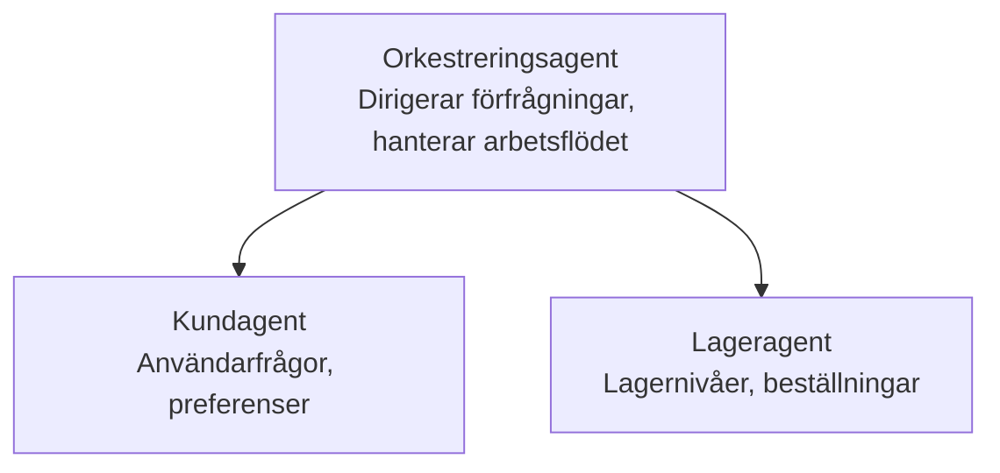

# Kapitel 5: Multi-agent AI-lösningar

**📚 Kurs**: [AZD för nybörjare](../../README.md) | **⏱️ Varaktighet**: 2-3 hours | **⭐ Komplexitet**: Avancerad

---

## Översikt

Detta kapitel täcker avancerade mönster för fleragentsarkitektur, agentorkestrering och produktionsklara AI-distributioner för komplexa scenarier.

> Validerad mot `azd 1.25.6` i juni 2026.

## Lärandemål

Genom att slutföra detta kapitel kommer du att:
- Förstå fleragentsarkitekturens mönster
- Distribuera koordinerade AI-agentssystem
- Implementera agent-till-agent-kommunikation
- Bygga produktionsklara fleragentslösningar

---

## 📚 Lektioner

| # | Lektion | Beskrivning | Tid |
|---|--------|-------------|------|
| 1 | [Multi-Agent Basics](multi-agent-basics.md) | Praktisk övning: distribuera en fungerande multi-agent-app med `azd up` | 45 min |
| 2 | [Coordination Patterns](../chapter-06-pre-deployment/coordination-patterns.md) | Strategier för agentorkestrering (fortsätter i Kapitel 6) | 30 min |
| 3 | [ARM Template Deployment](../../examples/retail-multiagent-arm-template/README.md) | Exempel på distribution med ett klick | 30 min |

> **Börja med lektion 1.** Det är den enda helt praktiska, distribuerbara lektionen i detta kapitel. Lektion 2 finns i Kapitel 6 (den delas med förplanering inför distribution), och [Retail Multi-Agent-lösning](../../examples/retail-scenario.md) är en arkitekturblåkopi — en designreferens, inte en mall som körs med ett enda kommando.

---

## 🚀 Snabbstart

```bash
# Alternativ 1: Distribuera från en mall
azd init --template agent-openai-python-prompty
azd up

# Alternativ 2: Distribuera från ett agentmanifest (kräver tillägget azure.ai.agents)
azd extension install azure.ai.agents
azd ai agent init -m agent-manifest.yaml
azd up
```

> **Vilket tillvägagångssätt?** Använd `azd init --template` för att börja från ett fungerande exempel. Använd `azd ai agent init` när du har ditt eget agentmanifest. Se [AZD AI CLI-referens](../chapter-08-production/production-ai-practices.md#azd-ai-cli-commands-and-extensions) för fullständiga detaljer.

---

## 🤖 Multi-agentarkitektur



---

## 🎯 Utvald lösning: Retail Multi-Agent

[Retail Multi-Agent-lösning](../../examples/retail-scenario.md) demonstrerar:

- **Kundagent**: Hanterar användarinteraktioner och preferenser
- **Lageragent**: Hanterar lager och orderhantering
- **Orkestrator**: Koordinerar mellan agenter
- **Delat minne**: Hantering av kontext över agenter

### Tjänster som används

| Tjänst | Syfte |
|---------|---------|
| Microsoft Foundry Models | Språkförståelse |
| Azure AI Search | Produktkatalog |
| Cosmos DB | Agenttillstånd och minne |
| Container Apps | Värd för agenter |
| Application Insights | Övervakning |

---

## 🔗 Navigering

| Riktning | Kapitel |
|-----------|---------|
| **Previous** | [Kapitel 4: Infrastructure](../chapter-04-infrastructure/README.md) |
| **Next** | [Kapitel 6: Pre-Deployment](../chapter-06-pre-deployment/README.md) |

---

## 📖 Relaterade resurser

- [Guide för AI-agenter](../chapter-02-ai-development/agents.md)
- [AI i produktion: bästa praxis](../chapter-08-production/production-ai-practices.md)
- [AI-felsökning](../chapter-07-troubleshooting/ai-troubleshooting.md)

---

<!-- CO-OP TRANSLATOR DISCLAIMER START -->
**Ansvarsfriskrivning**:
Detta dokument har översatts med hjälp av AI-översättningstjänsten [Co-op Translator](https://github.com/Azure/co-op-translator). Även om vi strävar efter noggrannhet, var vänlig notera att automatiska översättningar kan innehålla fel eller brister. Det ursprungliga dokumentet på dess modersmål bör betraktas som den auktoritativa källan. För kritisk information rekommenderas professionell mänsklig översättning. Vi ansvarar inte för några missförstånd eller feltolkningar som uppstår till följd av användningen av denna översättning.
<!-- CO-OP TRANSLATOR DISCLAIMER END -->