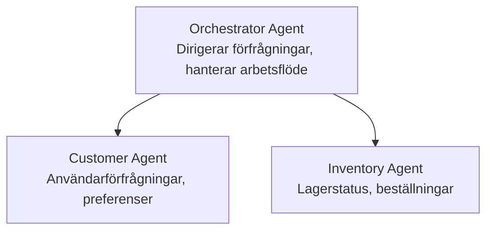

# Kapitel 5: Multi-Agent AI-lösningar

**📚 Kurs**: [AZD För Nybörjare](../../README.md) | **⏱️ Varaktighet**: 2-3 timmar | **⭐ Komplext**: Avancerat

---

## Översikt

Detta kapitel behandlar avancerade multi-agent arkitekturmodeller, agentorkestrering och produktionsklara AI-distributioner för komplexa scenarier.

> Validerat mot `azd 1.27.1` i juli 2026.

## Lärandemål

Genom att slutföra detta kapitel kommer du att:
- Förstå multi-agent arkitekturmodeller
- Distribuera koordinerade AI-agentssystem
- Implementera agent-till-agent kommunikation
- Bygga produktionsklara multi-agentlösningar

---

## 📚 Lektioner

| # | Lektion | Beskrivning | Tid |
|---|--------|-------------|------|
| 1 | [Multi-Agent Grundläggande](multi-agent-basics.md) | Praktiskt: driftsätt en fungerande multi-agent-app med `azd up` | 45 min |
| 2 | [Koordineringsmönster](../chapter-06-pre-deployment/coordination-patterns.md) | Agentorkestreringsstrategier (fortsätter i Kapitel 6) | 30 min |
| 3 | [ARM-mall Distribution](../../examples/retail-multiagent-arm-template/README.md) | Exempel på distribution med ett klick | 30 min |

> **Börja med Lektion 1.** Det är den enda helt praktiska och driftsättbara lektionen i detta kapitel. Lektion 2 finns i Kapitel 6 (den delas med fördistributionplanering), och [Retail Multi-Agent-lösningen](../../examples/retail-scenario.md) är en arkitektur blueprint—en designreferens, inte en mall med ett enda kommando.

---

## 🚀 Snabbstart

```bash
# Alternativ 1: Distribuera från en mall
azd init --template agent-openai-python-prompty
azd up

# Alternativ 2: Distribuera från ett agentmanifest (kräver azure.ai.agents-tillägg)
azd extension install azure.ai.agents
azd ai agent init -m agent-manifest.yaml
azd up
```

> **Vilket tillvägagångssätt?** Använd `azd init --template` för att börja från ett fungerande exempel. Använd `azd ai agent init` när du har din egen agentmanifest. Se [AZD AI CLI-referensen](../chapter-08-production/production-ai-practices.md#azd-ai-cli-commands-and-extensions) för fullständiga detaljer.

---

## 🤖 Multi-Agent Arkitektur



---

## 🎯 Utvald Lösning: Retail Multi-Agent

[Retail Multi-Agent-lösningen](../../examples/retail-scenario.md) demonstrerar:

- **Kundagent**: Hanterar användarinteraktioner och preferenser
- **Lageragent**: Hanterar lagersaldo och orderhantering
- **Orkestrator**: Koordinerar mellan agenter
- **Delat minne**: Kontexthantering över agenter

### Använda Tjänster

| Tjänst | Syfte |
|---------|---------|
| Microsoft Foundry Models | Språkförståelse |
| Azure AI Search | Produktkatalog |
| Cosmos DB | Agentstatus och minne |
| Container Apps | Agentvärd |
| Application Insights | Övervakning |

---

## 🔗 Navigering

| Riktning | Kapitel |
|-----------|---------|
| **Föregående** | [Kapitel 4: Infrastruktur](../chapter-04-infrastructure/README.md) |
| **Nästa** | [Kapitel 6: Fördistribution](../chapter-06-pre-deployment/README.md) |

---

## 📖 Relaterade Resurser

- [AI-Agentguide](../chapter-02-ai-development/agents.md)
- [Produktionspraxis för AI](../chapter-08-production/production-ai-practices.md)
- [AI Felsökning](../chapter-07-troubleshooting/ai-troubleshooting.md)

---

<!-- CO-OP TRANSLATOR DISCLAIMER START -->
**Ansvarsfriskrivning**:
Detta dokument har översatts med hjälp av AI-översättningstjänsten [Co-op Translator](https://github.com/Azure/co-op-translator). Även om vi strävar efter noggrannhet, var vänlig notera att automatiska översättningar kan innehålla fel eller brister. Det ursprungliga dokumentet på dess modersmål bör betraktas som den auktoritativa källan. För kritisk information rekommenderas professionell mänsklig översättning. Vi ansvarar inte för några missförstånd eller feltolkningar som uppstår till följd av användningen av denna översättning.
<!-- CO-OP TRANSLATOR DISCLAIMER END -->