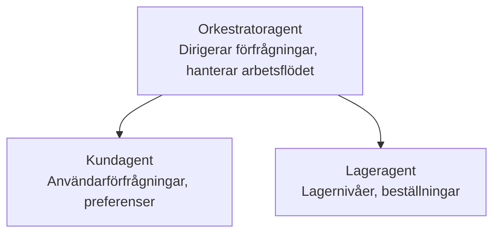

# Kapitel 5: Fleragent-AI-lösningar

**📚 Kurs**: [AZD för nybörjare](../../README.md) | **⏱️ Tid**: 2-3 timmar | **⭐ Komplexitet**: Avancerad

---

## Översikt

Detta kapitel täcker avancerade fleragent-arkitekturmönster, agentorkestrering och produktionsklara AI-distributioner för komplexa scenarier.

> Validerad mot `azd 1.23.12` i mars 2026.

## Lärandemål

Genom att genomföra detta kapitel kommer du att:
- Förstå fleragent-arkitekturmönster
- Distribuera koordinerade AI-agentssystem
- Implementera agent-till-agent-kommunikation
- Bygga produktionsklara fleragentlösningar

---

## 📚 Lektioner

| # | Lektion | Beskrivning | Tid |
|---|--------|-------------|------|
| 1 | [Detaljhandel: Fleragentlösning](../../examples/retail-scenario.md) | Komplett genomgång av implementationen | 90 min |
| 2 | [Koordineringsmönster](../chapter-06-pre-deployment/coordination-patterns.md) | Strategier för agentorkestrering | 30 min |
| 3 | [Distribution med ARM-mall](../../examples/retail-multiagent-arm-template/README.md) | Distribuering med ett klick | 30 min |

---

## 🚀 Snabbstart

```bash
# Alternativ 1: Distribuera från en mall
azd init --template agent-openai-python-prompty
azd up

# Alternativ 2: Distribuera från ett agentmanifest (kräver tillägget azure.ai.agents)
azd extension install azure.ai.agents
azd ai agent init -m agent-manifest.yaml
azd up
```

> **Vilken metod?** Använd `azd init --template` för att börja från ett fungerande exempel. Använd `azd ai agent init` när du har ditt eget agentmanifest. Se [AZD AI CLI-referensen](../chapter-08-production/production-ai-practices.md#azd-ai-cli-commands-and-extensions) för fullständiga detaljer.

---

## 🤖 Fleragentarkitektur


---

## 🎯 Utvald lösning: Detaljhandel - fleragentlösning

Lösningen [Detaljhandel: Fleragentlösning](../../examples/retail-scenario.md) visar:

- **Kundagent**: Hanterar användarinteraktioner och preferenser
- **Lageragent**: Hanterar lager och orderbearbetning
- **Orkestrator**: Koordinerar mellan agenterna
- **Delat minne**: Hantering av kontext mellan agenter

### Använda tjänster

| Tjänst | Syfte |
|---------|---------|
| Microsoft Foundry Models | Språkförståelse |
| Azure AI Search | Produktkatalog |
| Cosmos DB | Agenttillstånd och minne |
| Container Apps | Värd för agenter |
| Application Insights | Övervakning |

---

## 🔗 Navigering

| Riktning | Kapitel |
|-----------|---------|
| **Föregående** | [Kapitel 4: Infrastruktur](../chapter-04-infrastructure/README.md) |
| **Nästa** | [Kapitel 6: Fördistribution](../chapter-06-pre-deployment/README.md) |

---

## 📖 Relaterade resurser

- [Guide till AI-agenter](../chapter-02-ai-development/agents.md)
- [Produktionspraxis för AI](../chapter-08-production/production-ai-practices.md)
- [AI-felsökning](../chapter-07-troubleshooting/ai-troubleshooting.md)

---

<!-- CO-OP TRANSLATOR DISCLAIMER START -->
**Disclaimer**:
Detta dokument har översatts med hjälp av AI-översättningstjänsten [Co-op Translator](https://github.com/Azure/co-op-translator). Även om vi strävar efter noggrannhet, observera att automatiska översättningar kan innehålla fel eller felaktigheter. Det ursprungliga dokumentet på dess ursprungsspråk bör betraktas som den auktoritativa källan. För kritisk information rekommenderas professionell mänsklig översättning. Vi ansvarar inte för några missförstånd eller feltolkningar som uppstår till följd av användningen av denna översättning.
<!-- CO-OP TRANSLATOR DISCLAIMER END -->