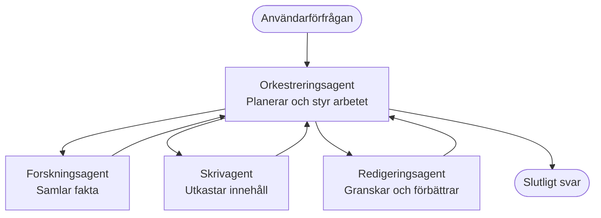

# Grundläggande för Multi-Agent – Distribuera ditt första koordinerade AI-system

**Kapitelnavigering:**
- **📚 Kursstart**: [AZD För Nybörjare](../../README.md)
- **📖 Nuvarande Kapitel**: Kapitel 5 – Multi-Agent AI-lösningar
- **⬅️ Föregående**: [Kapitel 4: Infrastruktur](../chapter-04-infrastructure/README.md)
- **➡️ Nästa**: [Koordinationsmönster](../chapter-06-pre-deployment/coordination-patterns.md)

> Validerad mot `azd 1.27.1` i juli 2026.

## Inledning

I tidigare kapitel distribuerade du en enskild applikation—och i Kapitel 2 distribuerade du en enskild AI-agent. Denna lektion tar nästa steg: att distribuera ett **multi-agent-system**, där flera specialiserade agenter samarbetar för att lösa ett problem som en enda agent inte skulle klara lika bra på egen hand.

Den goda nyheten för nybörjare: **du behöver inga nya kommandon.** En multi-agent-lösning är fortfarande ett azd-projekt. Du kommer att `azd init`, `azd up`, testa, och `azd down`—exakt den arbetsflöde du redan kan. Det som ändras är *formen* på appen inuti.

## Lärandemål

I slutet av denna lektion kommer du att:
- Förstå vad "multi-agent" betyder och när det är värt den extra komplexiteten
- Känna igen de vanliga rollerna i ett multi-agent-system (orkestrator + specialister)
- Distribuera en verklig, fungerande multi-agent-mall med `azd up`
- Förstå Azure-resurserna som stöder en multi-agent-app
- Veta hur du verifierar, anpassar och säkert river ner lösningen

## Läranderesultat

Efter att ha slutfört denna lektion kommer du att kunna:
- Förklara skillnaden mellan en enskild agent och ett multi-agent-system
- Välja mellan en enskild agent med verktyg och en sann multi-agent-design
- Distribuera och testa en multi-agent-mall från början till slut med azd
- Identifiera var varje agent körs och hur de kommunicerar
- Rensa upp alla resurser för att undvika löpande kostnader

---

## Vad är ett multi-agent-system?

En enskild AI-agent är en modell med en uppsättning instruktioner och (valfritt) några verktyg. Det fungerar bra för fokuserade uppgifter. Men när en uppgift växer—forskning, sedan skrivande, sedan redigering, sedan faktagranskning—gör allt i en prompt agenten långsammare, mindre pålitlig och svårare att felsöka.

Ett **multi-agent-system** delar upp arbetet i specialister som var och en gör ett jobb väl, koordinerat av en orkestrator:



### De två roller du alltid kommer att se

| Roll | Uppgift | Exempel |
|------|---------|---------|
| **Orkestrator** | Bestämmer *vad som händer härnäst* och styr jobbet mellan agenter | "Först forskning, sedan skrivande, sen redigering" |
| **Specialist** | Gör ett fokuserat jobb och lämnar ett resultat | En "forskare" som bara samlar fakta |

### Behöver du verkligen flera agenter?

Börja enkelt. Använd multi-agent **endast** när någon av dessa är sann:

- ✅ Uppgiften har **tydliga steg** som gynnas av olika instruktioner (forskning vs. skrivande vs. granskning)
- ✅ Du vill att specialister ska köras **parallellt** för att spara tid
- ✅ Olika steg kräver **olika verktyg eller datakällor**
- ✅ Du behöver att varje steg är **självständigt testbart och felsökningsbart**

Om din uppgift är en enkel fråga och svar eller ett enkelt verktygsanrop är en **enskild agent med verktyg** (Kapitel 2) enklare, billigare och lättare att hantera.

> **Tips för nybörjare:** "Fler agenter" är inte "bättre." Varje agent lägger till fördröjning, kostnad och något nytt att övervaka. Lägg till agenter bara när problemet tydligt delas upp i delar.

---

## Två sätt att bygga multi-agent på Azure

| Tillvägagångssätt | Vad det är | Bäst för |
|-----------------|------------|----------|
| **Enskild agent + verktyg** | En Foundry-agent som anropar funktioner/verktyg | Enkla arbetsflöden, komma igång |
| **Flera koordinerade agenter** | Flera agenter med en orkestrator | Tydliga steg, parallellt arbete, specialisering |

Denna lektion fokuserar på det andra tillvägagångssättet med en **färdig mall**, så att du kan se ett riktigt multi-agent-system i drift innan du bygger ditt eget.

---

## Praktiskt: Distribuera en fungerande multi-agent-app

Vi kommer att distribuera **Contoso Creative Writer**, ett officiellt Azure-exempel som använder flera agenter (forskare, författare, redaktör) som koordineras för att producera en artikel. Det är en utmärkt första multi-agent-app eftersom rollerna är lätta att förstå.

### Steg 1: Initialisera mallen

```bash
# Skapa en arbetsmapp
mkdir creative-writer && cd creative-writer

# Initiera från den officiella multi-agent-mallen
azd init --template contoso-creative-writer
```

> Bläddra bland fler multi-agent-mallar när som helst i [Awesome AZD AI-galleriet](https://azure.github.io/awesome-azd/?tags=ai). Andra nybörjarvänliga alternativ inkluderar `get-started-with-ai-agents` och `azure-ai-travel-agents`.

### Steg 2: Autentisera

```bash
# Krävs för azd-arbetsflöden
azd auth login
```

### Steg 3: Skapa en miljö

```bash
azd env new dev
```

### Steg 4: Förhandsgranska, sedan distribuera

```bash
# Se vad som kommer att skapas innan du spenderar något (rekommenderas)
azd provision --preview

# Tillhandahåll infrastruktur och distribuera alla agenter i ett steg
azd up
```

`azd up` kommer att fråga efter prenumeration och region, sedan förse Azure-resurser och distribuera applikationen. AI-distributioner kan ta längre tid än en enkel webbapp—om du distribuerar större modeller kan du förlänga distributionstidsgränsen:

```bash
azd deploy --timeout 1800
```

> **Viktig info om kostnad och kapacitet:** Multi-agent-appar distribuerar AI-modeller som använder kvot och medför kostnad. Om `azd up` misslyckas på grund av kvot för modell, se [AI Felsökning](../chapter-07-troubleshooting/ai-troubleshooting.md) för region- och kvotåtgärder, samt Kapitel 6 [Kapacitetsplanering](../chapter-06-pre-deployment/capacity-planning.md).

---

## Förstå vad du distribuerade

En typisk multi-agent-app som denna förser uppsättningen av Azure-resurser som direkt motsvarar ansvarsområdena i diagrammet ovan:

| Resurs | Varför den finns |
|--------|----------------|
| **Microsoft Foundry / Modeller** | Värdar språkmodellerna varje agent använder |
| **Azure AI Search** | Ger forskaragenten jordad data att söka i |
| **Container Apps** (eller App Service) | Värdar orkestrator- och agentkod |
| **Cosmos DB** (i vissa exempel) | Lagrar delat tillstånd/minne som skickas mellan agenter |
| **Application Insights** | Spårar förfrågningar *över* agenter så du kan felsöka flödet |

### Hur agenterna kommunicerar med varandra

I de flesta azd multi-agent-exempel körs **orkestratorn i din applikationskod** (till exempel med ett ramverk som Semantic Kernel eller Microsoft Agent Framework). Orkestratorn anropar varje specialistagent i tur och ordning, skickar vidare resultaten och sammanställer det slutgiltiga svaret. Agenterna delar kontext genom:

- **Funktions-/verksanrop** — orkestratorn anropar en specialist och får ett resultat tillbaka
- **Delat minne** — en databas (ofta Cosmos DB) håller tillstånd som båda agenter kan läsa
- **Meddelanden/händelser** — för lösare koppling kommunicerar agenter via en kö eller Service Bus

> **Varför detta är viktigt för felsökning:** eftersom varje steg är separat visar Application Insights *vilken* agent som var långsam eller misslyckades. Det är en huvudorsak till att dela upp arbete mellan agenter från början.

---

## Verifiera distributionen

Bekräfta att systemet faktiskt fungerar innan du går vidare:

```bash
# Visa de distribuerade slutpunkterna
azd show

# Öppna appens övervakningspanel
azd monitor

# Följ loggarna om något verkar fel
azd monitor --logs
```

Öppna sedan appens URL från `azd show` och testa en förfrågan som berör alla agenter (för Creative Writer, be den skriva en kort artikel om ett ämne). I Application Insights **transaktionssökning** bör du se förfrågan spridas över forskar-, författar- och redigeringsstegen.

**Kriterier för framgång:**
- ✅ `azd show` listar en nåbar slutpunkt
- ✅ En förfrågan ger ett resultat som tydligt gått igenom flera steg
- ✅ Application Insights visar spår för mer än ett agentsteg

---

## Anpassa: Lägg till eller justera en agent

Eftersom varje agent bara är instruktioner plus verktyg är anpassning lättillgänglig:

1. **Hitta agentdefinitionerna** i mallen (ofta en `prompts/`, `agents/` eller `*.prompty`-uppsättning filer).
2. **Justera en agents instruktioner** — till exempel, be redigeringsagenten att upprätthålla en specifik ton eller ordantal.
3. **Distribuera endast om koden** (infrastrukturen förändras inte):

   ```bash
   azd deploy
   ```

För att gå längre och bygga agenter från ditt *egna* manifest, använd agentförlängningen och dess fullständiga livscykel:

```bash
azd extension install azure.ai.agents
azd ai agent init -m agent-manifest.yaml
azd up
azd ai agent invoke      # test, med responstid
```

Se [Kapitel 2: Agenter](../chapter-02-ai-development/agents.md) och [AZD AI CLI-referensen](../chapter-08-production/production-ai-practices.md#azd-ai-cli-commands-and-extensions) för hela agentlivscykeln (`invoke`, `eval generate`, `optimize`, `delete`).

---

## Rensa upp

Multi-agent-appar kör flera debiterbara tjänster. Riv ner allt när du är klar:

```bash
azd down --force --purge
```

Flaggan `--purge` tar även bort mjukborttagna AI-resurser (som Foundry/Azure AI Services-konton) så de inte blockerar framtida distribution eller fortsätter att orsaka kostnader.

---

## En notis om produktions-multi-agent-system

[Retail Multi-Agent Solution](../../examples/retail-scenario.md) i detta repo är en **arkitekturblåkopiering**, inte en en-kommandos mall—den dokumenterar hur ett produktionsretailsystem *skulle* byggas (och klargör att en fullständig byggnad är en stor insats). Använd den som en designreferens *efter* att du distribuerat ett fungerande exempel här. För produktionsaspekter (motståndskraft, kostnad, övervakning, styrning), fortsätt till [Kapitel 8: Produktions-AI-praktiker](../chapter-08-production/production-ai-practices.md).

---

## Sammanfattning

- Ett multi-agent-system delar upp arbete mellan specialister koordinerade av en orkestrator.
- Använd det bara när uppgiften har tydliga steg, parallellism, eller olika verktyg per steg—annars föredra en enskild agent.
- azd-arbetsflödet är oförändrat: `azd init` → `azd up` → testa → `azd down`.
- En riktig mall som `contoso-creative-writer` låter dig se och anpassa en fungerande multi-agent-app idag.
- Application Insights-spårning över agenter är en av de största praktiska fördelarna med multi-agent-designen.

---

## 🔗 Navigering

| Riktning | Lektion |
|----------|---------|
| **Föregående** | [Kapitel 4: Infrastruktur](../chapter-04-infrastructure/README.md) |
| **Nästa** | [Koordinationsmönster](../chapter-06-pre-deployment/coordination-patterns.md) |

## 📖 Relaterade resurser

- [AI Agents Guide](../chapter-02-ai-development/agents.md)
- [Koordinationsmönster](../chapter-06-pre-deployment/coordination-patterns.md)
- [Produktions-AI-praktiker](../chapter-08-production/production-ai-practices.md)
- [AI Felsökning](../chapter-07-troubleshooting/ai-troubleshooting.md)

---

<!-- CO-OP TRANSLATOR DISCLAIMER START -->
**Ansvarsfriskrivning**:
Detta dokument har översatts med hjälp av AI-översättningstjänsten [Co-op Translator](https://github.com/Azure/co-op-translator). Även om vi strävar efter noggrannhet, var vänlig notera att automatiska översättningar kan innehålla fel eller brister. Det ursprungliga dokumentet på dess modersmål bör betraktas som den auktoritativa källan. För kritisk information rekommenderas professionell mänsklig översättning. Vi ansvarar inte för några missförstånd eller feltolkningar som uppstår till följd av användningen av denna översättning.
<!-- CO-OP TRANSLATOR DISCLAIMER END -->