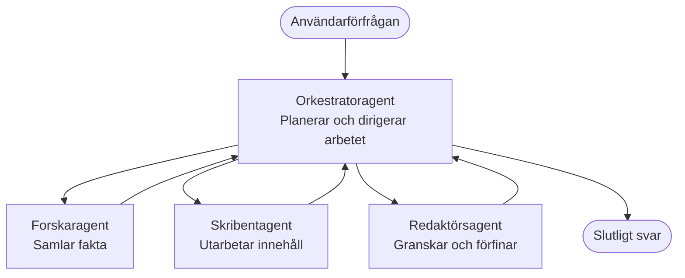

# Multi-Agent Basics - Distribuera ditt första koordinerade AI-system

**Chapter Navigation:**
- **📚 Course Home**: [AZD för nybörjare](../../README.md)
- **📖 Current Chapter**: Kapitel 5 - Multi-agent AI-lösningar
- **⬅️ Previous**: [Kapitel 4: Infrastruktur](../chapter-04-infrastructure/README.md)
- **➡️ Next**: [Koordinationsmönster](../chapter-06-pre-deployment/coordination-patterns.md)

> Validerad mot `azd 1.25.6` i juni 2026.

## Introduktion

I de tidigare kapitlen distribuerade du en enda applikation—och i Kapitel 2 distribuerade du en enskild AI-agent. Denna lektion tar nästa steg: att distribuera ett **fleragentsystem**, där flera specialiserade agenter samarbetar för att lösa ett problem som ingen enskild agent skulle klara lika bra på egen hand.

Den goda nyheten för nybörjare: **du behöver inga nya kommandon.** Ett fleragentsystem är fortfarande ett azd-projekt. Du kommer att `azd init`, `azd up`, testa och `azd down`—exakt det arbetsflöde du redan kan. Det som förändras är *appens struktur* inuti.

## Lärandemål

I slutet av den här lektionen kommer du att:
- Förstå vad "fleragent" betyder och när det är värt den extra komplexiteten
- Känna igen de vanliga rollerna i ett fleragentsystem (orkestrator + specialister)
- Distribuera en verklig, fungerande fleragentmall med `azd up`
- Förstå vilka Azure-resurser som stöder en fleragentapp
- Veta hur du verifierar, anpassar och tar ner lösningen säkert

## Läranderesultat

Efter att ha slutfört denna lektion kommer du att kunna:
- Förklara skillnaden mellan en enda agent och ett fleragentsystem
- Välja mellan en enskild agent med verktyg och en verklig fleragentdesign
- Distribuera och testa en fleragentmall från början till slut med azd
- Identifiera var varje agent körs och hur de kommunicerar
- Rensa upp alla resurser för att undvika löpande kostnader

---

## Vad är ett fleragentsystem?

En enda AI-agent är en modell med en uppsättning instruktioner och (valfritt) några verktyg. Det fungerar bra för fokuserade uppgifter. Men när en uppgift växer—forskning, sedan skrivning, sedan redigering, sedan faktagranskning—blir det att stoppa allt i en prompt att agenten blir långsammare, mindre pålitlig och svårare att felsöka.

Ett **fleragentsystem** delar upp arbetet i specialister som var och en gör ett jobb bra, koordinerade av en orkestrator:



### De två rollerna du alltid kommer att se

| Roll | Uppgift | Exempel |
|------|-----|---------|
| **Orkestrator** | Avgör *vad som händer härnäst* och skickar arbete mellan agenter | "Först forska, sedan skriva, sedan redigera" |
| **Specialist** | Utför en fokuserad uppgift och returnerar ett resultat | En "forskare" som bara samlar fakta |

### Behöver du faktiskt flera agenter?

Börja enkelt. Välj fleragent **endast** när en av följande är sann:

- ✅ Uppgiften har **distinkta steg** som gynnas av olika instruktioner (forskning vs. skrivning vs. granskning)
- ✅ Du vill att specialister ska köras **parallellt** för att spara tid
- ✅ Olika steg behöver **olika verktyg eller datakällor**
- ✅ Du behöver att varje steg är **självständigt testbart och felsökningsbart**

Om din uppgift är en enkel fråga-och-svar eller ett enkelt verktygsanrop är en **enskild agent med verktyg** (Kapitel 2) enklare, billigare och lättare att hantera.

> **Nybörjartips:** "Fler agenter" är inte samma sak som "bättre." Varje agent lägger till latens, kostnad och något nytt att övervaka. Lägg till agenter endast när problemet tydligt delar upp sig i delar.

---

## Två sätt att bygga fleragent på Azure

| Tillvägagångssätt | Vad det är | Passar för |
|----------|-----------|----------|
| **En agent + verktyg** | En Foundry-agent som anropar funktioner/verktyg | Enkla arbetsflöden, komma igång |
| **Flera koordinerade agenter** | Flera agenter med en orkestrator | Distinkta steg, parallellt arbete, specialisering |

Den här lektionen fokuserar på det andra tillvägagångssättet med en **färdig mall**, så att du kan se ett verkligt fleragentsystem i drift innan du bygger ditt eget.

---

## Praktiskt: Distribuera en fungerande fleragent-app

Vi kommer att distribuera **Contoso Creative Writer**, ett officiellt Azure-exempel som använder flera agenter (forskare, författare, redaktör) koordinerade för att producera en artikel. Det är en utmärkt första fleragent-app eftersom rollerna är lätta att förstå.

### Steg 1: Initiera mallen

```bash
# Skapa en arbetsmapp
mkdir creative-writer && cd creative-writer

# Initiera från den officiella multi-agentmallen
azd init --template contoso-creative-writer
```

> Bläddra bland fleragentmallar när som helst i [Awesome AZD AI-galleriet](https://azure.github.io/awesome-azd/?tags=ai). Andra nybörjarvänliga alternativ inkluderar `get-started-with-ai-agents` och `azure-ai-travel-agents`.

### Steg 2: Autentisera

```bash
# Krävs för azd-arbetsflöden
azd auth login
```

### Steg 3: Skapa en miljö

```bash
azd env new dev
```

### Steg 4: Förhandsgranska, sedan distribuera

```bash
# Se vad som kommer att skapas innan du spenderar något (rekommenderas)
azd provision --preview

# Provisionera infrastruktur och distribuera alla agenter i ett steg
azd up
```

`azd up` kommer att be om en prenumeration och region, sedan provisionera Azure-resurserna och distribuera applikationen. AI-distributioner kan ta längre tid än en enkel webbapp—om du distribuerar större modeller kan du förlänga distributionstidsgränsen:

```bash
azd deploy --timeout 1800
```

> **Observera kostnad och kapacitet:** Fleragentappar distribuerar AI-modeller som förbrukar kvot och medför kostnader. Om `azd up` misslyckas på grund av modellkvot, se [AI Troubleshooting](../chapter-07-troubleshooting/ai-troubleshooting.md) för region- och kvotlösningar, och Kapitel 6 [Capacity Planning](../chapter-06-pre-deployment/capacity-planning.md).

---

## Förstå vad du distribuerade

En typisk fleragentapp som denna provisionerar en uppsättning Azure-resurser som kartläggs direkt till ansvaren i diagrammet ovan:

| Resurs | Varför den finns |
|----------|----------------|
| **Microsoft Foundry / Models** | Värdar de språkmodeller som varje agent använder |
| **Azure AI Search** | Ger forskaragenten grundad data att söka i |
| **Container Apps** (eller App Service) | Värdar orkestratorn och agentkoden |
| **Cosmos DB** (i vissa exempel) | Lagrar delat tillstånd/minne som överförs mellan agenter |
| **Application Insights** | Spårar förfrågningar *över* agenter så att du kan felsöka flödet |

### Hur agenterna kommunicerar med varandra

I de flesta azd-fleragentexempel körs **orkestratorn i din applikationskod** (till exempel med ett ramverk som Semantic Kernel eller Microsoft Agent Framework). Orkestratorn anropar varje specialistagent i tur och ordning, skickar vidare resultaten och sätter ihop det slutliga svaret. Agenterna delar kontext genom:

- **Funktions-/verktygsanrop** — orkestratorn anropar en specialist och får ett resultat tillbaka
- **Delat minne** — en databas (ofta Cosmos DB) håller tillstånd som båda agenter kan läsa
- **Meddelanden/händelser** — för lösare koppling kommunicerar agenter via en kö eller Service Bus

> **Varför detta spelar roll för felsökning:** eftersom varje steg är separat visar Application Insights *vilken* agent som var långsam eller misslyckades. Det är en huvudorsak till att dela upp arbete över agenter från början.

---

## Verifiera distributionen

Bekräfta att systemet faktiskt fungerar innan du går vidare:

```bash
# Visa de distribuerade slutpunkterna
azd show

# Öppna appens övervakningspanel
azd monitor

# Följ loggarna om något verkar fel
azd monitor --logs
```

Öppna sedan appens URL från `azd show` och prova en förfrågan som använder alla agenter (för Creative Writer, be den skriva en kort artikel om ett ämne). I Application Insights **transaction search** bör du se att förfrågan förgrenar sig över forskar-, författar- och redaktörsstegen.

**Kriterier för framgång:**
- ✅ `azd show` listar en åtkomlig endpoint
- ✅ En förfrågan ger ett resultat som tydligt gått igenom flera steg
- ✅ Application Insights visar spår för mer än ett agentsteg

---

## Anpassa: Lägg till eller justera en agent

Eftersom varje agent bara är instruktioner plus verktyg är anpassning tillgänglig:

1. **Hitta agentdefinitionerna** i mallen (ofta en `prompts/`, `agents/` eller `*.prompty` uppsättning filer).
2. **Justera en agents instruktioner** — till exempel, be redaktörsagenten att upprätthålla en specifik ton eller ordantal.
3. **Distribuera om endast koden** (infrastrukturen är oförändrad):

   ```bash
   azd deploy
   ```

För att gå vidare och bygga agenter från din *egna* manifest, använd agenttillägget och dess fulla livscykel:

```bash
azd extension install azure.ai.agents
azd ai agent init -m agent-manifest.yaml
azd up
azd ai agent invoke      # test, med mätning av svarstid
```

Se [Kapitel 2: Agenter](../chapter-02-ai-development/agents.md) och [AZD AI CLI-referensen](../chapter-08-production/production-ai-practices.md#azd-ai-cli-commands-and-extensions) för den kompletta agentlivscykeln (`invoke`, `eval generate`, `optimize`, `delete`).

---

## Rensa upp

Fleragentappar kör flera debiterbara tjänster. Ta ner allt när du är klar:

```bash
azd down --force --purge
```

Flaggan `--purge` tar också bort mjukt raderade AI-resurser (som Foundry/Azure AI Services-konton) så att de inte blockerar en framtida ominstallation eller fortsätter att medföra kostnader.

---

## En notering om fleragentsystem i produktion

[Retail Multi-Agent Solution](../../examples/retail-scenario.md) i detta repo är ett **arkitekturblåtryck**, inte en mall som körs med ett enda kommando—det dokumenterar hur ett produktionsklart detaljhandelssystem *skulle* byggas (och anger tydligt att en fullständig byggnation är ett omfattande arbete). Använd det som en designreferens *efter* att du har distribuerat ett fungerande exempel här. För produktionsfrågor (resiliens, kostnad, övervakning, styrning), fortsätt till [Kapitel 8: Produktionspraxis för AI](../chapter-08-production/production-ai-practices.md).

---

## Sammanfattning

- Ett fleragentsystem delar upp arbete mellan specialister koordinerade av en orkestrator.
- Använd det bara när uppgiften har distinkta steg, parallellism eller olika verktyg per steg—annars föredra en enda agent.
- azd-arbetsflödet är oförändrat: `azd init` → `azd up` → testa → `azd down`.
- En riktig mall som `contoso-creative-writer` låter dig se och anpassa en fungerande fleragentapp idag.
- Application Insights-spårning över agenter är en av de största praktiska fördelarna med fleragentdesignen.

---

## 🔗 Navigering

| Direction | Lesson |
|-----------|--------|
| **Previous** | [Kapitel 4: Infrastruktur](../chapter-04-infrastructure/README.md) |
| **Next** | [Koordinationsmönster](../chapter-06-pre-deployment/coordination-patterns.md) |

## 📖 Relaterade resurser

- [Guide för AI-agenter](../chapter-02-ai-development/agents.md)
- [Koordinationsmönster](../chapter-06-pre-deployment/coordination-patterns.md)
- [Produktionspraxis för AI](../chapter-08-production/production-ai-practices.md)
- [Felsökning för AI](../chapter-07-troubleshooting/ai-troubleshooting.md)

---

<!-- CO-OP TRANSLATOR DISCLAIMER START -->
**Ansvarsfriskrivning**:
Detta dokument har översatts med hjälp av AI-översättningstjänsten [Co-op Translator](https://github.com/Azure/co-op-translator). Även om vi strävar efter noggrannhet, var vänlig notera att automatiska översättningar kan innehålla fel eller brister. Det ursprungliga dokumentet på dess modersmål bör betraktas som den auktoritativa källan. För kritisk information rekommenderas professionell mänsklig översättning. Vi ansvarar inte för några missförstånd eller feltolkningar som uppstår till följd av användningen av denna översättning.
<!-- CO-OP TRANSLATOR DISCLAIMER END -->