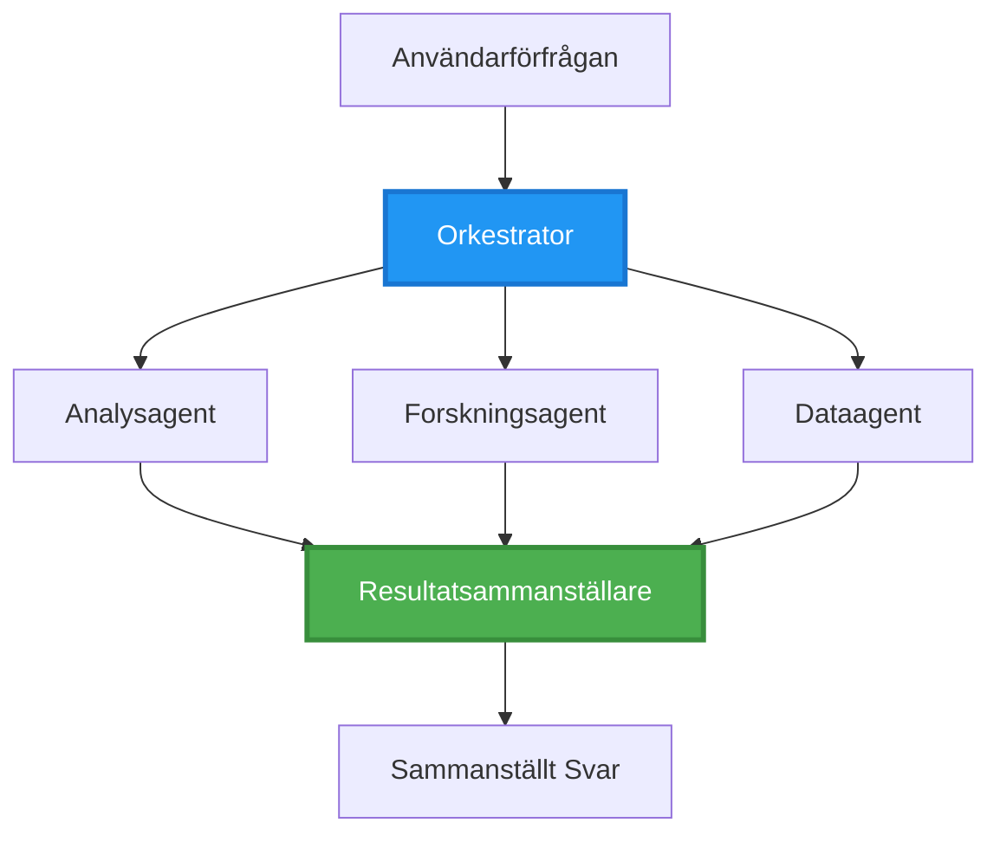
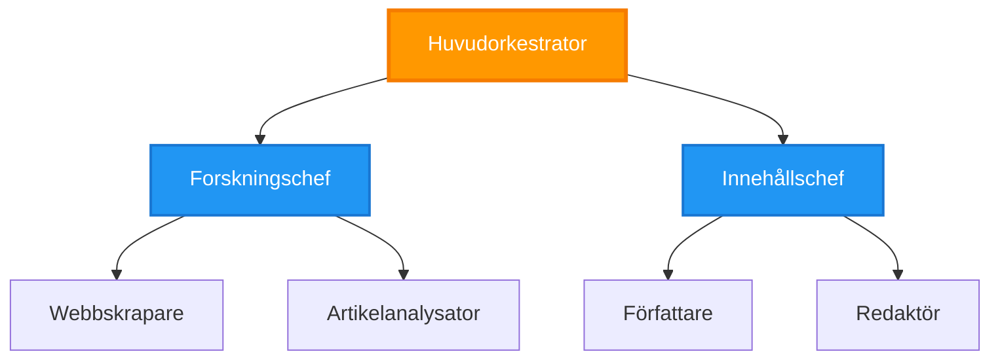
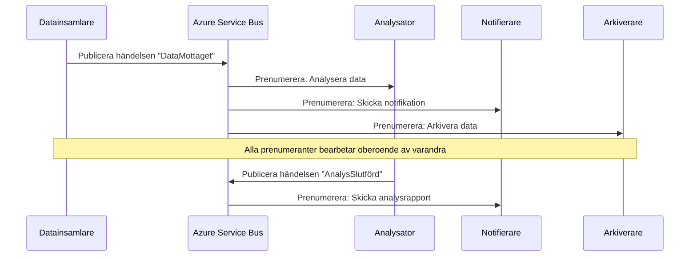

# Samordningsmönster för flera agenter

⏱️ **Uppskattad tid**: 60–75 minuter | 💰 **Beräknad kostnad**: ~$100-300/månad | ⭐ **Komplexitet**: Avancerad

**📚 Lärandespår:**
- ← Föregående: [Kapacitetsplanering](capacity-planning.md) - Resursdimensionering och skalningsstrategier
- 🎯 **Du är här**: Samordningsmönster för flera agenter (orkestrering, kommunikation, tillståndshantering)
- → Nästa: [Val av SKU](sku-selection.md) - Välja rätt Azure-tjänster
- 🏠 [Kursöversikt](../../README.md)

---

## Vad du kommer att lära dig

Genom att slutföra den här lektionen kommer du att:
- Förstå **arkitekturmönster för flera agenter** och när de ska användas
- Implementera **orkestreringsmönster** (centraliserat, decentraliserat, hierarkiskt)
- Designa **agentkommunikations**strategier (synkront, asynkront, händelsestyrt)
- Hantera **delat tillstånd** över distribuerade agenter
- Distribuera **fleragentsystem** på Azure med AZD
- Tillämpa **samordningsmönster** för verkliga AI-scenarier
- Övervaka och felsöka distribuerade agentsystem

## Varför samordning av flera agenter är viktigt

### Utvecklingen: Från enskild agent till flera agenter

**Enskild agent (Enkel):**
```
User → Agent → Response
```
- ✅ Lätt att förstå och implementera
- ✅ Snabb för enkla uppgifter
- ❌ Begränsad av enskild models kapaciteter
- ❌ Kan inte parallellisera komplexa uppgifter
- ❌ Ingen specialisering

**Fleragentsystem (Avancerat):**
```mermaid
graph TD
    Orchestrator[Orkestratör] --> Agent1[Agent1<br/>Plan]
    Orchestrator --> Agent2[Agent2<br/>Kod]
    Orchestrator --> Agent3[Agent3<br/>Granskning]
```- ✅ Specialiserade agenter för specifika uppgifter
- ✅ Parallell körning för snabbhet
- ✅ Modulärt och lätt att underhålla
- ✅ Bättre för komplexa arbetsflöden
- ⚠️ Kräver samordningslogik

**Analogi**: En enskild agent är som en person som gör alla uppgifter. Ett fleragentsystem är som ett team där varje medlem har specialiserade färdigheter (forskare, kodare, granskare, skrivare) som arbetar tillsammans.

---

## Kärnkoordineringsmönster

### Mönster 1: Sekventiell samordning (Ansvarskedja)

**När du ska använda**: Uppgifter måste slutföras i en specifik ordning, varje agent bygger vidare på föregående output.

```mermaid
sequenceDiagram
    participant User
    participant Orchestrator
    participant Agent1 as Forskningsagent
    participant Agent2 as Skrivande agent
    participant Agent3 as Redigeringsagent
    
    User->>Orchestrator: "Skriv en artikel om AI"
    Orchestrator->>Agent1: Undersök ämnet
    Agent1-->>Orchestrator: Forskningsresultat
    Orchestrator->>Agent2: Skriv utkast (med hjälp av forskningen)
    Agent2-->>Orchestrator: Utkast till artikel
    Orchestrator->>Agent3: Redigera och förbättra
    Agent3-->>Orchestrator: Slutgiltig artikel
    Orchestrator-->>User: Polerad artikel
    
    Note over User,Agent3: Sekventiell: Varje steg väntar på det föregående
```
**Fördelar:**
- ✅ Tydligt dataflöde
- ✅ Lätt att felsöka
- ✅ Förutsägbar exekveringsordning

**Begränsningar:**
- ❌ Långsammare (ingen parallellism)
- ❌ Ett fel blockerar hela kedjan
- ❌ Kan inte hantera ömsesidigt beroende uppgifter

**Exempel på användningsfall:**
- Innehållsskapande-pipeline (forskning → skriva → redigera → publicera)
- Kodgenerering (planera → implementera → testa → distribuera)
- Rapportgenerering (datainsamling → analys → visualisering → sammanfattning)

---

### Mönster 2: Parallell samordning (Fan-Out/Fan-In)

**När du ska använda**: Oberoende uppgifter kan köras samtidigt, resultat kombineras i slutet.


**Fördelar:**
- ✅ Snabbt (parallell körning)
- ✅ Feltolerant (delvisa resultat accepteras)
- ✅ Skalbar horisontellt

**Begränsningar:**
- ⚠️ Resultat kan komma i oordning
- ⚠️ Kräver aggregeringslogik
- ⚠️ Komplex tillståndshantering

**Exempel på användningsfall:**
- Flerkällig datainsamling (API:er + databaser + webbsökning)
- Konkurrensanalys (flera modeller genererar lösningar, bästa väljs)
- Översättningstjänster (översätt till flera språk samtidigt)

---

### Mönster 3: Hierarkisk samordning (Manager-Worker)

**När du ska använda**: Komplexa arbetsflöden med deluppgifter, delegering behövs.


**Fördelar:**
- ✅ Hanterar komplexa arbetsflöden
- ✅ Modulärt och lätt att underhålla
- ✅ Tydliga ansvarsgränser

**Begränsningar:**
- ⚠️ Mer komplex arkitektur
- ⚠️ Högre latens (flera samordningslager)
- ⚠️ Kräver sofistikerad orkestrering

**Exempel på användningsfall:**
- Företagsdokumenthantering (klassificera → dirigera → bearbeta → arkivera)
- Flerstegs datapipelines (ingå → rensa → transformera → analysera → rapportera)
- Komplexa automationsarbetsflöden (planering → resursallokering → utförande → övervakning)

---

### Mönster 4: Händelsestyrd samordning (Publish-Subscribe)

**När du ska använda**: Agenter behöver reagera på händelser, lös koppling önskas.


**Fördelar:**
- ✅ Lös koppling mellan agenter
- ✅ Lätt att lägga till nya agenter (bara prenumerera)
- ✅ Asynkron bearbetning
- ✅ Resilient (meddelandepersistens)

**Begränsningar:**
- ⚠️ Eventuell konsistens
- ⚠️ Komplex felsökning
- ⚠️ Utmaningar med meddelandeordning

**Exempel på användningsfall:**
- Realtidsövervakningssystem (larm, dashboards, loggar)
- Flernkanalsnotifikationer (email, SMS, push, Slack)
- Datapipelines (flera konsumenter av samma data)

---

### Mönster 5: Konsensusbaserad samordning (Röstning/Quorum)

**När du ska använda**: Behöver överenskommelse från flera agenter innan vidare steg.

```mermaid
graph TB
    Input[Inmatningsuppgift]
    Agent1[Agent 1: gpt-4.1]
    Agent2[Agent 2: Claude]
    Agent3[Agent 3: Gemini]
    Voter[Konsensusröstare]
    Output[Överenskommet resultat]
    
    Input --> Agent1
    Input --> Agent2
    Input --> Agent3
    Agent1 --> Voter
    Agent2 --> Voter
    Agent3 --> Voter
    Voter --> Output
    
    style Voter fill:#9C27B0,stroke:#7B1FA2,stroke-width:3px,color:#fff
```}
**Fördelar:**
- ✅ Högre noggrannhet (flera åsikter)
- ✅ Feltolerant (minoritetfel accepteras)
- ✅ Inbyggd kvalitetskontroll

**Begränsningar:**
- ❌ Kostsamt (flera modellanrop)
- ❌ Långsammare (väntar på alla agenter)
- ⚠️ Konfliktlösning behövs

**Exempel på användningsfall:**
- Innehållsmoderering (flera modeller granskar innehåll)
- Kodgranskning (flera linters/analysatorer)
- Medicinsk diagnos (flera AI-modeller, expertvalidering)

---

## Arkitekturöversikt

### Komplett fleragentsystem på Azure

```mermaid
graph TB
    User[Användare/API-klient]
    APIM[Azure API-hantering]
    Orchestrator[Orkestrator-tjänst<br/>Container-app]
    ServiceBus[Azure Service Bus<br/>Event Hub]
    
    Agent1[Forskningsagent<br/>Container-app]
    Agent2[Författaragent<br/>Container-app]
    Agent3[Analytikeragent<br/>Container-app]
    Agent4[Granskningsagent<br/>Container-app]
    
    CosmosDB[(Cosmos DB<br/>Delat tillstånd)]
    Storage[Azure Storage<br/>Artefakter]
    AppInsights[Application Insights<br/>Övervakning]
    
    User --> APIM
    APIM --> Orchestrator
    
    Orchestrator --> ServiceBus
    ServiceBus --> Agent1
    ServiceBus --> Agent2
    ServiceBus --> Agent3
    ServiceBus --> Agent4
    
    Agent1 --> CosmosDB
    Agent2 --> CosmosDB
    Agent3 --> CosmosDB
    Agent4 --> CosmosDB
    
    Agent1 --> Storage
    Agent2 --> Storage
    Agent3 --> Storage
    Agent4 --> Storage
    
    Orchestrator -.-> AppInsights
    Agent1 -.-> AppInsights
    Agent2 -.-> AppInsights
    Agent3 -.-> AppInsights
    Agent4 -.-> AppInsights
    
    style Orchestrator fill:#FF9800,stroke:#F57C00,stroke-width:3px,color:#fff
    style ServiceBus fill:#9C27B0,stroke:#7B1FA2,stroke-width:3px,color:#fff
    style CosmosDB fill:#4CAF50,stroke:#388E3C,stroke-width:3px,color:#fff
```
**Nyckelkomponenter:**

| Component | Purpose | Azure Service |
|-----------|---------|---------------|
| **API Gateway** | Ingångspunkt, rate limiting, auth | API Management |
| **Orchestrator** | Koordinerar agentarbetsflöden | Container Apps |
| **Message Queue** | Asynkron kommunikation | Service Bus / Event Hubs |
| **Agents** | Specialiserade AI-arbetare | Container Apps / Functions |
| **State Store** | Delat tillstånd, uppgiftsspårning | Cosmos DB |
| **Artifact Storage** | Dokument, resultat, loggar | Blob Storage |
| **Monitoring** | Distribuerad spårning, loggar | Application Insights |

---

## Förutsättningar

### Nödvändiga verktyg

```bash
# Verifiera Azure Developer CLI
azd version
# ✅ Förväntat: azd version 1.0.0 eller högre

# Verifiera Azure CLI
az --version
# ✅ Förväntat: azure-cli 2.50.0 eller högre

# Verifiera Docker (för lokal testning)
docker --version
# ✅ Förväntat: Docker version 20.10 eller högre
```

### Krav för Azure

- Aktiv Azure-prenumeration
- Behörigheter att skapa:
  - Container Apps
  - Service Bus namespaces
  - Cosmos DB accounts
  - Storage accounts
  - Application Insights

### Förkunskaper

Du bör ha slutfört:
- [Configuration Management](../chapter-03-configuration/configuration.md)
- [Authentication & Security](../chapter-03-configuration/authsecurity.md)
- [Microservices Example](../../../../examples/microservices)

---

## Implementeringsguide

### Projektstruktur

```
multi-agent-system/
├── azure.yaml                    # AZD configuration
├── infra/
│   ├── main.bicep               # Main infrastructure
│   ├── core/
│   │   ├── servicebus.bicep     # Message queue
│   │   ├── cosmos.bicep         # State store
│   │   ├── storage.bicep        # Artifact storage
│   │   └── monitoring.bicep     # Application Insights
│   └── app/
│       ├── orchestrator.bicep   # Orchestrator service
│       └── agent.bicep          # Agent template
└── src/
    ├── orchestrator/            # Orchestration logic
    │   ├── app.py
    │   ├── workflows.py
    │   └── Dockerfile
    ├── agents/
    │   ├── research/            # Research agent
    │   ├── writer/              # Writer agent
    │   ├── analyst/             # Analyst agent
    │   └── reviewer/            # Reviewer agent
    └── shared/
        ├── state_manager.py     # Shared state logic
        └── message_handler.py   # Message handling
```

---

## Lektion 1: Sekventiellt samordningsmönster

### Implementering: Pipeline för innehållsskapande

Låt oss bygga en sekventiell pipeline: Forskning → Skriv → Redigera → Publicera

### 1. AZD-konfiguration

**Fil: `azure.yaml`**

```yaml
name: content-pipeline
metadata:
  template: multi-agent-sequential@1.0.0

services:
  orchestrator:
    project: ./src/orchestrator
    language: python
    host: containerapp
  
  research-agent:
    project: ./src/agents/research
    language: python
    host: containerapp
  
  writer-agent:
    project: ./src/agents/writer
    language: python
    host: containerapp
  
  editor-agent:
    project: ./src/agents/editor
    language: python
    host: containerapp
```

### 2. Infrastruktur: Service Bus för samordning

**Fil: `infra/core/servicebus.bicep`**

```bicep
param name string
param location string
param tags object = {}

resource serviceBusNamespace 'Microsoft.ServiceBus/namespaces@2022-10-01-preview' = {
  name: name
  location: location
  tags: tags
  sku: {
    name: 'Standard'
    tier: 'Standard'
  }
  properties: {
    minimumTlsVersion: '1.2'
  }
}

// Queue for orchestrator → research agent
resource researchQueue 'Microsoft.ServiceBus/namespaces/queues@2022-10-01-preview' = {
  parent: serviceBusNamespace
  name: 'research-tasks'
  properties: {
    maxDeliveryCount: 3
    lockDuration: 'PT5M'
    deadLetteringOnMessageExpiration: true
  }
}

// Queue for research agent → writer agent
resource writerQueue 'Microsoft.ServiceBus/namespaces/queues@2022-10-01-preview' = {
  parent: serviceBusNamespace
  name: 'writer-tasks'
  properties: {
    maxDeliveryCount: 3
    lockDuration: 'PT5M'
  }
}

// Queue for writer agent → editor agent
resource editorQueue 'Microsoft.ServiceBus/namespaces/queues@2022-10-01-preview' = {
  parent: serviceBusNamespace
  name: 'editor-tasks'
  properties: {
    maxDeliveryCount: 3
    lockDuration: 'PT5M'
  }
}

output namespace string = serviceBusNamespace.name
output connectionString string = listKeys('${serviceBusNamespace.id}/AuthorizationRules/RootManageSharedAccessKey', serviceBusNamespace.apiVersion).primaryConnectionString
```

### 3. Delad tillståndshanterare

**Fil: `src/shared/state_manager.py`**

```python
from azure.cosmos import CosmosClient, PartitionKey
from datetime import datetime
import os

class StateManager:
    """Manages shared state across agents using Cosmos DB"""
    
    def __init__(self):
        endpoint = os.environ['COSMOS_ENDPOINT']
        key = os.environ['COSMOS_KEY']
        
        self.client = CosmosClient(endpoint, key)
        self.database = self.client.get_database_client('agent-state')
        self.container = self.database.get_container_client('tasks')
    
    def create_task(self, task_id: str, task_type: str, input_data: dict):
        """Create a new task"""
        task = {
            'id': task_id,
            'type': task_type,
            'status': 'pending',
            'input': input_data,
            'created_at': datetime.utcnow().isoformat(),
            'steps': []
        }
        self.container.create_item(task)
        return task
    
    def update_task_step(self, task_id: str, step_name: str, result: dict):
        """Update task with completed step"""
        task = self.container.read_item(task_id, partition_key=task_id)
        
        task['steps'].append({
            'name': step_name,
            'completed_at': datetime.utcnow().isoformat(),
            'result': result
        })
        
        self.container.replace_item(task_id, task)
        return task
    
    def complete_task(self, task_id: str, final_result: dict):
        """Mark task as complete"""
        task = self.container.read_item(task_id, partition_key=task_id)
        task['status'] = 'completed'
        task['result'] = final_result
        task['completed_at'] = datetime.utcnow().isoformat()
        self.container.replace_item(task_id, task)
        return task
    
    def get_task(self, task_id: str):
        """Retrieve task state"""
        return self.container.read_item(task_id, partition_key=task_id)
```

### 4. Orkestratortjänst

**Fil: `src/orchestrator/app.py`**

```python
from flask import Flask, request, jsonify
from azure.servicebus import ServiceBusClient, ServiceBusMessage
import json
import uuid
import os
from shared.state_manager import StateManager

app = Flask(__name__)
state_manager = StateManager()

# Service Bus-anslutning
servicebus_connection_str = os.environ['SERVICEBUS_CONNECTION_STRING']
servicebus_client = ServiceBusClient.from_connection_string(servicebus_connection_str)

@app.route('/health', methods=['GET'])
def health():
    return jsonify({'status': 'healthy', 'service': 'orchestrator'})

@app.route('/create-content', methods=['POST'])
def create_content():
    """
    Sequential workflow: Research → Write → Edit → Publish
    """
    data = request.json
    topic = data.get('topic')
    
    if not topic:
        return jsonify({'error': 'Topic required'}), 400
    
    # Skapa uppgift i tillståndslagring
    task_id = str(uuid.uuid4())
    task = state_manager.create_task(
        task_id=task_id,
        task_type='content_creation',
        input_data={'topic': topic}
    )
    
    # Skicka meddelande till forskningsagent (första steget)
    sender = servicebus_client.get_queue_sender('research-tasks')
    message = ServiceBusMessage(
        body=json.dumps({
            'task_id': task_id,
            'topic': topic,
            'next_queue': 'writer-tasks'  # Vart ska resultaten skickas
        }),
        content_type='application/json'
    )
    
    with sender:
        sender.send_messages(message)
    
    return jsonify({
        'task_id': task_id,
        'status': 'started',
        'workflow': 'sequential',
        'steps': ['research', 'write', 'edit', 'publish'],
        'message': 'Content creation pipeline initiated'
    }), 202

@app.route('/task/<task_id>', methods=['GET'])
def get_task_status(task_id):
    """Check task status"""
    try:
        task = state_manager.get_task(task_id)
        return jsonify(task)
    except Exception as e:
        return jsonify({'error': str(e)}), 404

if __name__ == '__main__':
    app.run(host='0.0.0.0', port=8080)
```

### 5. Forskningsagent

**Fil: `src/agents/research/app.py`**

```python
from azure.servicebus import ServiceBusClient, ServiceBusMessage
from openai import AzureOpenAI
import json
import os
import time
from shared.state_manager import StateManager

# Initiera klienter
state_manager = StateManager()
servicebus_client = ServiceBusClient.from_connection_string(
    os.environ['SERVICEBUS_CONNECTION_STRING']
)

openai_client = AzureOpenAI(
    api_key=os.environ['AZURE_OPENAI_API_KEY'],
    api_version="2024-02-01",
    azure_endpoint=os.environ['AZURE_OPENAI_ENDPOINT']
)

def process_research_task(message_data):
    """Process research request and pass to writer"""
    task_id = message_data['task_id']
    topic = message_data['topic']
    next_queue = message_data['next_queue']
    
    print(f"🔬 Researching: {topic}")
    
    # Anropa Microsoft Foundry-modeller för forskning
    response = openai_client.chat.completions.create(
        model="gpt-4.1",
        messages=[
            {"role": "system", "content": "You are a research assistant. Provide comprehensive research on the given topic."},
            {"role": "user", "content": f"Research this topic thoroughly: {topic}"}
        ],
        max_tokens=1500
    )
    
    research_results = response.choices[0].message.content
    
    # Uppdatera tillstånd
    state_manager.update_task_step(
        task_id=task_id,
        step_name='research',
        result={'research': research_results}
    )
    
    # Skicka till nästa agent (författare)
    sender = servicebus_client.get_queue_sender(next_queue)
    message = ServiceBusMessage(
        body=json.dumps({
            'task_id': task_id,
            'topic': topic,
            'research': research_results,
            'next_queue': 'editor-tasks'
        }),
        content_type='application/json'
    )
    
    with sender:
        sender.send_messages(message)
    
    print(f"✅ Research complete for task {task_id}")

def main():
    """Listen to research queue"""
    receiver = servicebus_client.get_queue_receiver('research-tasks')
    
    print("🔬 Research Agent started, listening for tasks...")
    
    with receiver:
        while True:
            messages = receiver.receive_messages(max_wait_time=5)
            for message in messages:
                try:
                    message_data = json.loads(str(message))
                    process_research_task(message_data)
                    receiver.complete_message(message)
                except Exception as e:
                    print(f"❌ Error processing message: {e}")
                    receiver.abandon_message(message)

if __name__ == '__main__':
    main()
```

### 6. Skrivaragent

**Fil: `src/agents/writer/app.py`**

```python
from azure.servicebus import ServiceBusClient, ServiceBusMessage
from openai import AzureOpenAI
import json
import os
from shared.state_manager import StateManager

state_manager = StateManager()
servicebus_client = ServiceBusClient.from_connection_string(
    os.environ['SERVICEBUS_CONNECTION_STRING']
)

openai_client = AzureOpenAI(
    api_key=os.environ['AZURE_OPENAI_API_KEY'],
    api_version="2024-02-01",
    azure_endpoint=os.environ['AZURE_OPENAI_ENDPOINT']
)

def process_writing_task(message_data):
    """Write article based on research"""
    task_id = message_data['task_id']
    topic = message_data['topic']
    research = message_data['research']
    next_queue = message_data['next_queue']
    
    print(f"✍️ Writing article: {topic}")
    
    # Anropa Microsoft Foundry Models för att skriva en artikel
    response = openai_client.chat.completions.create(
        model="gpt-4.1",
        messages=[
            {"role": "system", "content": "You are a professional writer. Write engaging, well-structured articles."},
            {"role": "user", "content": f"Based on this research:\n\n{research}\n\nWrite a comprehensive article about: {topic}"}
        ],
        max_tokens=2000
    )
    
    article_draft = response.choices[0].message.content
    
    # Uppdatera status
    state_manager.update_task_step(
        task_id=task_id,
        step_name='writing',
        result={'draft': article_draft}
    )
    
    # Skicka till redaktören
    sender = servicebus_client.get_queue_sender(next_queue)
    message = ServiceBusMessage(
        body=json.dumps({
            'task_id': task_id,
            'topic': topic,
            'draft': article_draft
        }),
        content_type='application/json'
    )
    
    with sender:
        sender.send_messages(message)
    
    print(f"✅ Article draft complete for task {task_id}")

def main():
    """Listen to writer queue"""
    receiver = servicebus_client.get_queue_receiver('writer-tasks')
    
    print("✍️ Writer Agent started, listening for tasks...")
    
    with receiver:
        while True:
            messages = receiver.receive_messages(max_wait_time=5)
            for message in messages:
                try:
                    message_data = json.loads(str(message))
                    process_writing_task(message_data)
                    receiver.complete_message(message)
                except Exception as e:
                    print(f"❌ Error: {e}")
                    receiver.abandon_message(message)

if __name__ == '__main__':
    main()
```

### 7. Redigeringsagent

**Fil: `src/agents/editor/app.py`**

```python
from azure.servicebus import ServiceBusClient
from openai import AzureOpenAI
import json
import os
from shared.state_manager import StateManager

state_manager = StateManager()
servicebus_client = ServiceBusClient.from_connection_string(
    os.environ['SERVICEBUS_CONNECTION_STRING']
)

openai_client = AzureOpenAI(
    api_key=os.environ['AZURE_OPENAI_API_KEY'],
    api_version="2024-02-01",
    azure_endpoint=os.environ['AZURE_OPENAI_ENDPOINT']
)

def process_editing_task(message_data):
    """Edit and finalize article"""
    task_id = message_data['task_id']
    topic = message_data['topic']
    draft = message_data['draft']
    
    print(f"📝 Editing article: {topic}")
    
    # Anropa Microsoft Foundry Models för att redigera
    response = openai_client.chat.completions.create(
        model="gpt-4.1",
        messages=[
            {"role": "system", "content": "You are an expert editor. Improve grammar, clarity, and structure."},
            {"role": "user", "content": f"Edit and improve this article:\n\n{draft}"}
        ],
        max_tokens=2000
    )
    
    final_article = response.choices[0].message.content
    
    # Markera uppgiften som slutförd
    state_manager.complete_task(
        task_id=task_id,
        final_result={
            'topic': topic,
            'final_article': final_article,
            'word_count': len(final_article.split())
        }
    )
    
    print(f"✅ Article finalized for task {task_id}")

def main():
    """Listen to editor queue"""
    receiver = servicebus_client.get_queue_receiver('editor-tasks')
    
    print("📝 Editor Agent started, listening for tasks...")
    
    with receiver:
        while True:
            messages = receiver.receive_messages(max_wait_time=5)
            for message in messages:
                try:
                    message_data = json.loads(str(message))
                    process_editing_task(message_data)
                    receiver.complete_message(message)
                except Exception as e:
                    print(f"❌ Error: {e}")
                    receiver.abandon_message(message)

if __name__ == '__main__':
    main()
```

### 8. Distribuera och testa

```bash
# Alternativ A: Mallbaserad distribution
azd init
azd up

# Alternativ B: Distribution via agentmanifest (kräver tillägg)
azd extension install azure.ai.agents
azd ai agent init -m agent-manifest.yaml
azd up
```

> Se [AZD AI CLI Commands](../chapter-08-production/production-ai-practices.md#azd-ai-cli-commands-and-extensions) för alla `azd ai` flaggor och alternativ.

```bash
# Hämta orkestrator-URL
ORCHESTRATOR_URL=$(azd env get-values | grep ORCHESTRATOR_URL | cut -d '=' -f2 | tr -d '"')

# Skapa innehåll
curl -X POST $ORCHESTRATOR_URL/create-content \
  -H "Content-Type: application/json" \
  -d '{"topic": "The Future of AI in Healthcare"}'
```

**✅ Förväntat resultat:**
```json
{
  "task_id": "a1b2c3d4-e5f6-7890-abcd-ef1234567890",
  "status": "started",
  "workflow": "sequential",
  "steps": ["research", "write", "edit", "publish"],
  "message": "Content creation pipeline initiated"
}
```

**Kontrollera uppgiftsframsteg:**
```bash
TASK_ID="a1b2c3d4-e5f6-7890-abcd-ef1234567890"
curl $ORCHESTRATOR_URL/task/$TASK_ID
```

**✅ Förväntat resultat (slutfört):**
```json
{
  "id": "a1b2c3d4-e5f6-7890-abcd-ef1234567890",
  "type": "content_creation",
  "status": "completed",
  "steps": [
    {
      "name": "research",
      "completed_at": "2025-11-19T10:30:00Z",
      "result": {"research": "..."}
    },
    {
      "name": "writing",
      "completed_at": "2025-11-19T10:32:00Z",
      "result": {"draft": "..."}
    }
  ],
  "result": {
    "topic": "The Future of AI in Healthcare",
    "final_article": "...",
    "word_count": 1500
  }
}
```

---

## Lektion 2: Parallellt samordningsmönster

### Implementering: Flerkällig forskningsaggregator

Låt oss bygga ett parallellt system som samlar information från flera källor samtidigt.

### Parallell orkestrator

**Fil: `src/orchestrator/parallel_workflow.py`**

```python
from flask import Flask, request, jsonify
from azure.servicebus import ServiceBusClient, ServiceBusMessage
import json
import uuid
import os
from shared.state_manager import StateManager

app = Flask(__name__)
state_manager = StateManager()

servicebus_client = ServiceBusClient.from_connection_string(
    os.environ['SERVICEBUS_CONNECTION_STRING']
)

@app.route('/research-parallel', methods=['POST'])
def research_parallel():
    """
    Parallel workflow: Multiple agents work simultaneously
    """
    data = request.json
    query = data.get('query')
    
    task_id = str(uuid.uuid4())
    task = state_manager.create_task(
        task_id=task_id,
        task_type='parallel_research',
        input_data={
            'query': query,
            'agents': ['web', 'academic', 'news', 'social']
        }
    )
    
    # Fan-out: Skicka till alla agenter samtidigt
    agents = [
        ('web-research-queue', 'web'),
        ('academic-research-queue', 'academic'),
        ('news-research-queue', 'news'),
        ('social-research-queue', 'social')
    ]
    
    for queue_name, agent_type in agents:
        sender = servicebus_client.get_queue_sender(queue_name)
        message = ServiceBusMessage(
            body=json.dumps({
                'task_id': task_id,
                'query': query,
                'agent_type': agent_type,
                'result_queue': 'aggregation-queue'
            }),
            content_type='application/json'
        )
        
        with sender:
            sender.send_messages(message)
    
    return jsonify({
        'task_id': task_id,
        'status': 'started',
        'workflow': 'parallel',
        'agents_dispatched': 4,
        'message': 'Parallel research initiated'
    }), 202

if __name__ == '__main__':
    app.run(host='0.0.0.0', port=8080)
```

### Aggregeringslogik

**Fil: `src/agents/aggregator/app.py`**

```python
from azure.servicebus import ServiceBusClient
import json
import os
from collections import defaultdict
from shared.state_manager import StateManager

state_manager = StateManager()
servicebus_client = ServiceBusClient.from_connection_string(
    os.environ['SERVICEBUS_CONNECTION_STRING']
)

# Spåra resultat per uppgift
task_results = defaultdict(list)
expected_agents = 4  # webb, akademisk, nyheter, social

def process_result(message_data):
    """Aggregate results from parallel agents"""
    task_id = message_data['task_id']
    agent_type = message_data['agent_type']
    result = message_data['result']
    
    # Spara resultat
    task_results[task_id].append({
        'agent': agent_type,
        'data': result
    })
    
    print(f"📊 Received result from {agent_type} agent ({len(task_results[task_id])}/{expected_agents})")
    
    # Kontrollera om alla agenter är klara (fan-in)
    if len(task_results[task_id]) == expected_agents:
        print(f"✅ All agents completed for task {task_id}. Aggregating...")
        
        # Kombinera resultat
        aggregated = {
            'query': message_data['query'],
            'sources': task_results[task_id],
            'summary': generate_summary(task_results[task_id])
        }
        
        # Markera som slutförd
        state_manager.complete_task(task_id, aggregated)
        
        # Städa upp
        del task_results[task_id]
        
        print(f"✅ Aggregation complete for task {task_id}")

def generate_summary(results):
    """Generate summary from all sources"""
    summaries = [r['data'].get('summary', '') for r in results]
    return '\n\n'.join(summaries)

def main():
    """Listen to aggregation queue"""
    receiver = servicebus_client.get_queue_receiver('aggregation-queue')
    
    print("📊 Aggregator started, listening for results...")
    
    with receiver:
        while True:
            messages = receiver.receive_messages(max_wait_time=5)
            for message in messages:
                try:
                    message_data = json.loads(str(message))
                    process_result(message_data)
                    receiver.complete_message(message)
                except Exception as e:
                    print(f"❌ Error: {e}")
                    receiver.abandon_message(message)

if __name__ == '__main__':
    main()
```

**Fördelar med parallellt mönster:**
- ⚡ **4x snabbare** (agenter körs samtidigt)
- 🔄 **Feltolerant** (delvisa resultat accepteras)
- 📈 **Skalbar** (lägg till fler agenter enkelt)

---

## Praktiska övningar

### Övning 1: Lägg till timeout-hantering ⭐⭐ (Medel)

**Mål**: Implementera timeout-logik så att aggregatoren inte väntar för alltid på långsamma agenter.

**Steg**:

1. **Lägg till timeout-spårning i aggregatoren:**

```python
from datetime import datetime, timedelta

task_timeouts = {}  # task_id -> utgångstid

def process_result(message_data):
    task_id = message_data['task_id']
    
    # Ställ in timeout för första resultatet
    if task_id not in task_timeouts:
        task_timeouts[task_id] = datetime.utcnow() + timedelta(seconds=30)
    
    task_results[task_id].append({
        'agent': message_data['agent_type'],
        'data': message_data['result']
    })
    
    # Kontrollera om komplett ELLER om tiden gått ut
    if len(task_results[task_id]) == expected_agents or \
       datetime.utcnow() > task_timeouts[task_id]:
        
        print(f"📊 Aggregating with {len(task_results[task_id])}/{expected_agents} results")
        
        aggregated = {
            'query': message_data['query'],
            'sources': task_results[task_id],
            'completed_agents': len(task_results[task_id]),
            'timed_out': len(task_results[task_id]) < expected_agents
        }
        
        state_manager.complete_task(task_id, aggregated)
        
        # Rensa upp
        del task_results[task_id]
        del task_timeouts[task_id]
```

2. **Testa med artificiella fördröjningar:**

```python
# I en agent, lägg till en fördröjning för att simulera långsam bearbetning
import time
time.sleep(35)  # Överskrider 30 sekunders tidsgräns
```

3. **Distribuera och verifiera:**

```bash
azd deploy aggregator

# Skicka in uppgift
curl -X POST $ORCHESTRATOR_URL/research-parallel \
  -H "Content-Type: application/json" \
  -d '{"query": "AI safety research"}'

# Kontrollera resultaten efter 30 sekunder
curl $ORCHESTRATOR_URL/task/$TASK_ID
```

**✅ Framgångskriterier:**
- ✅ Uppgiften slutförs efter 30 sekunder även om agenter är ofullständiga
- ✅ Svar indikerar delvisa resultat (`"timed_out": true`)
- ✅ Tillgängliga resultat returneras (3 av 4 agenter)

**Tid**: 20–25 minuter

---

### Övning 2: Implementera retry-logik ⭐⭐⭐ (Avancerad)

**Mål**: Försök automatiskt att köra om misslyckade agentuppgifter innan du ger upp.

**Steg**:

1. **Lägg till retry-spårning i orkestratorn:**

```python
from dataclasses import dataclass
from typing import Dict

@dataclass
class RetryConfig:
    max_retries: int = 3
    backoff_seconds: int = 5

retry_counts: Dict[str, int] = {}  # meddelande_id -> antal_omförsök

def send_with_retry(queue_name: str, message_data: dict, retry_config: RetryConfig):
    """Send message with retry metadata"""
    message_id = message_data.get('message_id', str(uuid.uuid4()))
    message_data['message_id'] = message_id
    message_data['retry_count'] = retry_counts.get(message_id, 0)
    message_data['max_retries'] = retry_config.max_retries
    
    sender = servicebus_client.get_queue_sender(queue_name)
    message = ServiceBusMessage(
        body=json.dumps(message_data),
        content_type='application/json',
        message_id=message_id
    )
    
    with sender:
        sender.send_messages(message)
```

2. **Lägg till retry-hanterare i agenterna:**

```python
def process_with_retry(message, receiver, process_func):
    """Process message with automatic retry on failure"""
    try:
        message_data = json.loads(str(message))
        
        # Bearbeta meddelandet
        process_func(message_data)
        
        # Lyckat - slutfört
        receiver.complete_message(message)
        
    except Exception as e:
        message_id = message.message_id
        retry_count = message_data.get('retry_count', 0)
        max_retries = message_data.get('max_retries', 3)
        
        if retry_count < max_retries:
            # Försök igen: överge och lägg tillbaka i kön med ökat antal försök
            print(f"⚠️ Retry {retry_count + 1}/{max_retries} for message {message_id}")
            
            message_data['retry_count'] = retry_count + 1
            
            # Skicka tillbaka till samma kö med fördröjning
            time.sleep(5 * (retry_count + 1))  # Exponentiell backoff
            send_with_retry(queue_name, message_data, RetryConfig())
            
            receiver.complete_message(message)  # Ta bort originalet
        else:
            # Max antal försök överskridet - flytta till dead-letter-kön
            print(f"❌ Max retries exceeded for message {message_id}")
            receiver.dead_letter_message(
                message,
                reason="MaxRetriesExceeded",
                error_description=str(e)
            )
```

3. **Övervaka dead letter-kön:**

```python
def monitor_dead_letters():
    """Check dead letter queue for failed messages"""
    receiver = servicebus_client.get_queue_receiver(
        'research-queue',
        sub_queue='deadletter'
    )
    
    with receiver:
        messages = receiver.receive_messages(max_wait_time=5)
        for message in messages:
            print(f"☠️ Dead letter: {message.message_id}")
            print(f"Reason: {message.dead_letter_reason}")
            print(f"Description: {message.dead_letter_error_description}")
```

**✅ Framgångskriterier:**
- ✅ Misslyckade uppgifter försöker om automatiskt (upp till 3 gånger)
- ✅ Exponentiell backoff mellan retries (5s, 10s, 15s)
- ✅ Efter max retries går meddelanden till dead letter-kön
- ✅ Dead letter-kön kan övervakas och återuppspelas

**Tid**: 30–40 minuter

---

### Övning 3: Implementera kretsbrytare ⭐⭐⭐ (Avancerad)

**Mål**: Förhindra kaskadfel genom att stoppa förfrågningar till felande agenter.

**Steg**:

1. **Skapa kretsbrytarklass:**

```python
from enum import Enum
from datetime import datetime, timedelta

class CircuitState(Enum):
    CLOSED = "closed"      # Normal drift
    OPEN = "open"          # Fungerar inte, avvisa förfrågningar
    HALF_OPEN = "half_open"  # Testar om återhämtning skett

class CircuitBreaker:
    def __init__(self, failure_threshold=5, timeout_seconds=60):
        self.failure_threshold = failure_threshold
        self.timeout_seconds = timeout_seconds
        self.failure_count = 0
        self.last_failure_time = None
        self.state = CircuitState.CLOSED
    
    def call(self, func):
        """Execute function with circuit breaker protection"""
        if self.state == CircuitState.OPEN:
            # Kontrollera om tidsgränsen har löpt ut
            if datetime.utcnow() - self.last_failure_time > timedelta(seconds=self.timeout_seconds):
                self.state = CircuitState.HALF_OPEN
                print("🔄 Circuit breaker: HALF_OPEN (testing)")
            else:
                raise Exception(f"Circuit breaker OPEN for agent. Try again in {self.timeout_seconds}s")
        
        try:
            result = func()
            
            # Lyckad
            if self.state == CircuitState.HALF_OPEN:
                self.state = CircuitState.CLOSED
                self.failure_count = 0
                print("✅ Circuit breaker: CLOSED (recovered)")
            
            return result
            
        except Exception as e:
            self.failure_count += 1
            self.last_failure_time = datetime.utcnow()
            
            if self.failure_count >= self.failure_threshold:
                self.state = CircuitState.OPEN
                print(f"🔴 Circuit breaker: OPEN (too many failures)")
            
            raise e
```

2. **Applicera på agentanrop:**

```python
# I orkestratorn
agent_circuits = {
    'web': CircuitBreaker(failure_threshold=5, timeout_seconds=60),
    'academic': CircuitBreaker(failure_threshold=5, timeout_seconds=60),
    'news': CircuitBreaker(failure_threshold=5, timeout_seconds=60),
    'social': CircuitBreaker(failure_threshold=5, timeout_seconds=60)
}

def send_to_agent(agent_type, message_data):
    """Send with circuit breaker protection"""
    circuit = agent_circuits[agent_type]
    
    try:
        circuit.call(lambda: send_message(agent_type, message_data))
    except Exception as e:
        print(f"⚠️ Skipping {agent_type} agent: {e}")
        # Fortsätt med andra agenter
```

3. **Testa kretsbrytaren:**

```bash
# Simulera upprepade fel (stoppa en agent)
az containerapp stop --name web-research-agent --resource-group rg-agents

# Skicka flera förfrågningar
for i in {1..10}; do
  curl -X POST $ORCHESTRATOR_URL/research-parallel \
    -H "Content-Type: application/json" \
    -d '{"query": "test query '$i'"}'
  sleep 2
done

# Kontrollera loggarna - du bör se att kretsen är öppen efter 5 fel
# Använd Azure CLI för Container App-loggar:
az containerapp logs show --name orchestrator --resource-group $RG_NAME --tail 50
```

**✅ Framgångskriterier:**
- ✅ Efter 5 fel öppnas kretsen (avvisar förfrågningar)
- ✅ Efter 60 sekunder går kretsen till halvöppen (tester återhämtning)
- ✅ Andra agenter fortsätter fungera normalt
- ✅ Kretsen stängs automatiskt när agenten återhämtar sig

**Tid**: 40–50 minuter

---

## Övervakning och felsökning

### Distribuerad spårning med Application Insights

**Fil: `src/shared/tracing.py`**

```python
from opencensus.ext.azure.log_exporter import AzureLogHandler
from opencensus.ext.azure.trace_exporter import AzureExporter
from opencensus.trace import config_integration
from opencensus.trace.tracer import Tracer
from opencensus.trace.samplers import AlwaysOnSampler
import logging
import os

# Konfigurera spårning
config_integration.trace_integrations(['requests', 'logging'])

connection_string = os.environ.get('APPLICATIONINSIGHTS_CONNECTION_STRING')

# Skapa spårare
tracer = Tracer(
    exporter=AzureExporter(connection_string=connection_string),
    sampler=AlwaysOnSampler()
)

# Konfigurera loggning
logger = logging.getLogger(__name__)
logger.addHandler(AzureLogHandler(connection_string=connection_string))
logger.setLevel(logging.INFO)

def trace_agent_call(agent_name, task_id, operation):
    """Trace agent operations"""
    with tracer.span(name=f'{agent_name}.{operation}') as span:
        span.add_attribute('agent', agent_name)
        span.add_attribute('task_id', task_id)
        span.add_attribute('operation', operation)
        
        try:
            result = operation()
            span.add_attribute('status', 'success')
            return result
        except Exception as e:
            span.add_attribute('status', 'error')
            span.add_attribute('error', str(e))
            raise
```

### Application Insights-frågor

**Spåra fleragentsarbetsflöden:**

```kusto
// Trace complete workflow for a task
traces
| where customDimensions.task_id == "a1b2c3d4-..."
| project timestamp, message, customDimensions.agent, customDimensions.operation
| order by timestamp asc
```

**Jämförelse av agentprestanda:**

```kusto
// Compare agent execution times
dependencies
| where name contains "agent"
| summarize 
    avg_duration = avg(duration),
    p95_duration = percentile(duration, 95),
    count = count()
  by agent = tostring(customDimensions.agent)
| order by avg_duration desc
```

**Felanalyser:**

```kusto
// Find which agents fail most
exceptions
| where customDimensions.agent != ""
| summarize 
    failure_count = count(),
    unique_errors = dcount(outerMessage)
  by agent = tostring(customDimensions.agent)
| order by failure_count desc
```

---

## Kostnadsanalys

### Kostnader för fleragentsystem (månadsuppskattningar)

| Komponent | Konfiguration | Kostnad |
|-----------|--------------|------|
| **Orchestrator** | 1 Container App (1 vCPU, 2GB) | $30-50 |
| **4 Agents** | 4 Container Apps (0.5 vCPU, 1GB each) | $60-120 |
| **Service Bus** | Standard tier, 10M messages | $10-20 |
| **Cosmos DB** | Serverless, 5GB storage, 1M RUs | $25-50 |
| **Blob Storage** | 10GB storage, 100K operations | $5-10 |
| **Application Insights** | 5GB ingestion | $10-15 |
| **Microsoft Foundry Models** | gpt-4.1, 10M tokens | $100-300 |
| **Totalt** | | **$240-565/month** |

### Strategier för kostnadsoptimering

1. **Använd serverlöst där det är möjligt:**
   ```bicep
   // Cosmos DB serverless (no minimum cost)
   properties: {
     databaseAccountOfferType: 'Standard'
     capabilities: [{ name: 'EnableServerless' }]
   }
   ```

2. **Skala agenter till noll när de är inaktiva:**
   ```bicep
   scale: {
     minReplicas: 0  // Scale to zero when no messages
     maxReplicas: 10
   }
   ```

3. **Använd batchning för Service Bus:**
   ```python
   # Skicka meddelanden i batchar (billigare)
   sender.send_messages([message1, message2, message3])
   ```

4. **Cacha ofta använda resultat:**
   ```python
   # Använd Azure Cache for Redis
   if cache.exists(query_hash):
       return cache.get(query_hash)
   ```

---

## Bästa praxis

### ✅ GÖR:

1. **Använd idempotenta operationer**
   ```python
   # Agenten kan säkert bearbeta samma meddelande flera gånger
   def process_task(task_id):
       if state_manager.task_exists(task_id):
           print(f"Task {task_id} already processed, skipping")
           return
       # Bearbeta uppgiften...
   ```

2. **Implementera omfattande loggning**
   ```python
   logger.info(f"Agent: {agent_name}, Task: {task_id}, Action: {action}")
   ```

3. **Använd korrelations-ID:n**
   ```python
   # Skicka task_id genom hela arbetsflödet
   message_data = {
       'task_id': task_id,  # Korrelations-ID
       'timestamp': datetime.utcnow().isoformat()
   }
   ```

4. **Ställ in meddelandets TTL (time-to-live)**
   ```bicep
   properties: {
     defaultMessageTimeToLive: 'PT1H'  // 1 hour max
   }
   ```

5. **Övervaka dead letter-köer**
   ```python
   # Regelbunden övervakning av misslyckade meddelanden
   monitor_dead_letters()
   ```

### ❌ GÖR INTE:

1. **Skapa inte cirkulära beroenden**
   ```python
   # ❌ DÅLIGT: Agent A → Agent B → Agent A (oändlig loop)
   # ✅ BRA: Definiera en tydlig riktad acyklisk graf (DAG)
   ```

2. **Blockera inte agenttrådar**
   ```python
   # ❌ DÅLIGT: Synkron väntan
   while not task_complete:
       time.sleep(1)
   
   # ✅ BRA: Använd callbacks för meddelandekön
   ```

3. **Ignorera inte partiella fel**
   ```python
   # ❌ DÅLIGT: Avsluta hela arbetsflödet om en agent misslyckas
   # ✅ BRA: Returnera delresultat med felindikatorer
   ```

4. **Använd inte oändliga omförsök**
   ```python
   # ❌ DÅLIGT: försök igen för evigt
   # ✅ BRA: max_retries = 3, sedan till dead-letter-kön
   ```

---

## Felsökningsguide

### Problem: Meddelanden fastnar i kön

**Symtom:**
- Meddelanden samlas i kön
- Agenter bearbetar inte
- Uppgiftens status fastnar på "väntande"

**Diagnos:**
```bash
# Kontrollera ködjupet
az servicebus queue show \
  --namespace-name mybus \
  --name research-tasks \
  --query "countDetails"

# Kontrollera agentloggarna med Azure CLI
az containerapp logs show --name research-agent --resource-group $RG_NAME --tail 50
```

**Lösningar:**

1. **Öka antalet agentrepliker:**
   ```bash
   az containerapp update \
     --name research-agent \
     --min-replicas 3 \
     --max-replicas 10
   ```

2. **Kontrollera dead letter-kön:**
   ```bash
   az servicebus queue show \
     --namespace-name mybus \
     --name research-tasks \
     --query "countDetails.deadLetterMessageCount"
   ```

---

### Problem: Uppgiftstimeout/slutförs aldrig

**Symtom:**
- Uppgiftens status förblir "pågående"
- Vissa agenter slutför, andra gör det inte
- Inga felmeddelanden

**Diagnos:**
```bash
# Kontrollera uppgiftens status
curl $ORCHESTRATOR_URL/task/$TASK_ID

# Kontrollera Application Insights
# Kör frågan: traces | where customDimensions.task_id == "..."
```

**Lösningar:**

1. **Implementera timeout i aggregatoren (Övning 1)**

2. **Kontrollera agentfel med Azure Monitor:**
   ```bash
   # Visa loggar via azd monitor
   azd monitor --logs
   
   # Eller använd Azure CLI för att kontrollera loggar för en specifik containerapp
   az containerapp logs show --name <agent-name> --resource-group $RG_NAME --follow | grep "ERROR\|FAIL"
   ```

3. **Verifiera att alla agenter körs:**
   ```bash
   az containerapp list \
     --resource-group rg-agents \
     --query "[].{name:name, status:properties.runningStatus}"
   ```

---

## Läs mer

### Officiell dokumentation
- [Azure Service Bus](https://learn.microsoft.com/azure/service-bus-messaging/service-bus-messaging-overview)
- [Cosmos DB](https://learn.microsoft.com/azure/cosmos-db/introduction)
- [Container Apps DAPR](https://learn.microsoft.com/azure/container-apps/dapr-overview)
- [Multi-Agent Design Patterns](https://learn.microsoft.com/azure/architecture/guide/ai/multi-agent-systems)

### Nästa steg i den här kursen
- ← Föregående: [Capacity Planning](capacity-planning.md)
- → Nästa: [Val av SKU](sku-selection.md)
- 🏠 [Kursens startsida](../../README.md)

### Relaterade exempel
- [Microservices Example](../../../../examples/microservices) - Mönster för tjänstkommunikation
- [Microsoft Foundry Models Example](../../../../examples/azure-openai-chat) - AI-integration

---

## Sammanfattning

**Du har lärt dig:**
- ✅ Fem samordningsmönster (sekventiell, parallell, hierarkisk, händelsestyrd, konsensus)
- ✅ Fleragentarkitektur på Azure (Service Bus, Cosmos DB, Container Apps)
- ✅ Tillståndshantering över distribuerade agenter
- ✅ Tidsgränshantering, omförsök och kretsbrytare
- ✅ Övervakning och felsökning av distribuerade system
- ✅ Strategier för kostnadsoptimering

**Viktigaste slutsatserna:**
1. **Välj rätt mönster** - Sekventiell för ordnade arbetsflöden, parallell för hastighet, händelsestyrd för flexibilitet
2. **Hantera tillstånd noggrant** - Använd Cosmos DB eller liknande för delat tillstånd
3. **Hantera fel på ett smidigt sätt** - Timeouts, omförsök, kretsbrytare, dead letter-köer
4. **Övervaka allt** - Distribuerad spårning är avgörande för felsökning
5. **Optimera kostnaderna** - Skala till noll, använd serverlöst, implementera caching

**Nästa steg:**
1. Slutför de praktiska övningarna
2. Bygg ett fleragentsystem för ditt användningsfall
3. Studera [Val av SKU](sku-selection.md) för att optimera prestanda och kostnader

---

<!-- CO-OP TRANSLATOR DISCLAIMER START -->
Ansvarsfriskrivning:
Detta dokument har översatts med hjälp av AI-översättningstjänsten [Co-op Translator](https://github.com/Azure/co-op-translator). Även om vi strävar efter noggrannhet bör du vara medveten om att automatiska översättningar kan innehålla fel eller brister. Originaldokumentet på dess ursprungliga språk bör betraktas som den auktoritativa källan. För kritisk information rekommenderas professionell mänsklig översättning. Vi ansvarar inte för några missförstånd eller feltolkningar som uppstår genom användningen av denna översättning.
<!-- CO-OP TRANSLATOR DISCLAIMER END -->