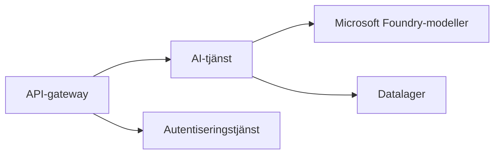
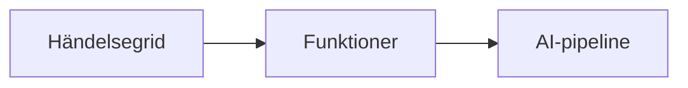

# Kapitel 8: Produktions- och företagsmönster

**📚 Kurs**: [AZD For Beginners](../../README.md) | **⏱️ Varaktighet**: 2-3 timmar | **⭐ Svårighetsgrad**: Avancerad

---

## Översikt

Detta kapitel täcker företagsklara distributionsmönster, säkerhetshärdning, övervakning och kostnadsoptimering för produktions-AI-arbetsbelastningar.

> Validerad mot `azd 1.25.6` i juni 2026.

## Lärandemål

Genom att slutföra detta kapitel kommer du att:
- Distribuera robusta applikationer i flera regioner
- Implementera företagsmässiga säkerhetsmönster
- Konfigurera omfattande övervakning
- Optimera kostnader i skala
- Sätta upp CI/CD-pipelines med AZD

---

## 📚 Lektioner

| # | Lektion | Beskrivning | Tid |
|---|--------|-------------|------|
| 1 | [Produktions-AI-praktiker](production-ai-practices.md) | Företagsdistributionsmönster | 90 min |

---

## 🚀 Produktionschecklista

- [ ] Distribution över flera regioner för resiliens
- [ ] Hanterad identitet för autentisering (inga nycklar)
- [ ] Application Insights för övervakning
- [ ] Kostnadsbudgetar och aviseringar konfigurerade
- [ ] Säkerhetsskanning aktiverad
- [ ] Integration med CI/CD-pipelines
- [ ] Plan för katastrofåterställning

---

## 🏗️ Arkitekturmönster

### Mönster 1: Mikrotjänst-AI



### Mönster 2: Händelsedriven AI



---

## 🔐 Bästa praxis för säkerhet

```bicep
// Use managed identity
identity: {
  type: 'SystemAssigned'
}

// Private endpoints for AI services
properties: {
  publicNetworkAccess: 'Disabled'
  networkAcls: {
    defaultAction: 'Deny'
  }
}
```

---

## 💰 Kostnadsoptimering

| Strategi | Besparingar |
|----------|---------|
| Skala till noll (Container Apps) | 60-80% |
| Använd konsumtionsnivåer för utveckling | 50-70% |
| Schemalagd skalning | 30-50% |
| Reserverad kapacitet | 20-40% |

```bash
# Ställ in budgetvarningar
az consumption budget create \
  --budget-name "AI-Budget" \
  --amount 500 \
  --category Cost \
  --time-grain Monthly
```

---

## 📊 Övervakningskonfiguration

```bash
# Strömma loggar
azd monitor --logs

# Kontrollera Application Insights
azd monitor --overview

# Visa mätvärden
az monitor metrics list --resource <resource-id>
```

---

## 🔗 Navigering

| Riktning | Kapitel |
|-----------|---------|
| **Föregående** | [Kapitel 7: Felsökning](../chapter-07-troubleshooting/README.md) |
| **Kurs slutförd** | [Kursöversikt](../../README.md) |

---

## 📖 Relaterade resurser

- [Guide för AI-agenter](../chapter-02-ai-development/agents.md)
- [Application Insights](../chapter-06-pre-deployment/application-insights.md)
- [Multi-agentlösningar](../chapter-05-multi-agent/README.md)
- [Exempel på mikrotjänster](../../examples/microservices/README.md)

---

<!-- CO-OP TRANSLATOR DISCLAIMER START -->
**Ansvarsfriskrivning**:
Detta dokument har översatts med hjälp av AI-översättningstjänsten [Co-op Translator](https://github.com/Azure/co-op-translator). Även om vi strävar efter noggrannhet, var vänlig notera att automatiska översättningar kan innehålla fel eller brister. Det ursprungliga dokumentet på dess modersmål bör betraktas som den auktoritativa källan. För kritisk information rekommenderas professionell mänsklig översättning. Vi ansvarar inte för några missförstånd eller feltolkningar som uppstår till följd av användningen av denna översättning.
<!-- CO-OP TRANSLATOR DISCLAIMER END -->