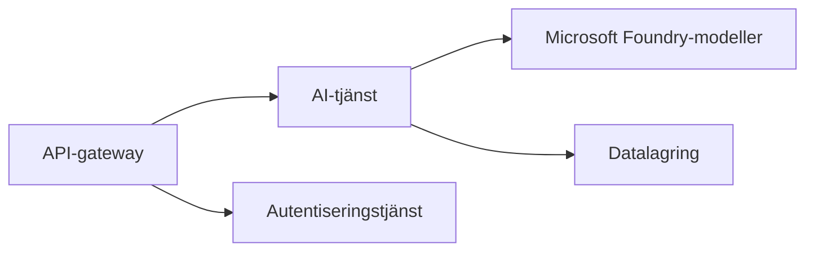
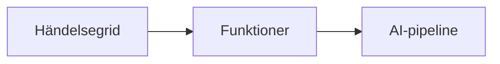

# Kapitel 8: Produktion & Företagsmönster

**📚 Kurs**: [AZD For Beginners](../../README.md) | **⏱️ Varaktighet**: 2-3 timmar | **⭐ Komplexitet**: Avancerad

---

## Översikt

Detta kapitel täcker företagsfärdiga driftsmönster, säkerhetshärdning, övervakning och kostnadsoptimering för produktions-AI-arbetsbelastningar.

## Lärandemål

Genom att slutföra detta kapitel kommer du att:
- Distribuera applikationer över flera regioner för motståndskraft
- Implementera företagsäkerhetsmönster
- Konfigurera omfattande övervakning
- Optimera kostnader i stor skala
- Ställa in CI/CD-pipelines med AZD

---

## 📚 Lektioner

| # | Lektion | Beskrivning | Tid |
|---|--------|-------------|------|
| 1 | [Produktions-AI-praktiker](production-ai-practices.md) | Företagsdriftsmönster | 90 min |

---

## 🚀 Produktionschecklista

- [ ] Distribuering i flera regioner för motståndskraft
- [ ] Hanterad identitet för autentisering (inga nycklar)
- [ ] Application Insights för övervakning
- [ ] Kostnadsbudgetar och aviseringar konfigurerade
- [ ] Säkerhetsskanning aktiverad
- [ ] Integration av CI/CD-pipeline
- [ ] Plan för katastrofåterställning

---

## 🏗️ Arkitekturmönster

### Mönster 1: AI med mikrotjänster


### Mönster 2: Händelsestyrd AI


---

## 🔐 Säkerhetsbästa praxis

```bicep
// Use managed identity
identity: {
  type: 'SystemAssigned'
}

// Private endpoints for AI services
properties: {
  publicNetworkAccess: 'Disabled'
  networkAcls: {
    defaultAction: 'Deny'
  }
}
```

---

## 💰 Kostnadsoptimering

| Strategi | Besparingar |
|----------|-------------|
| Skala till noll (Container Apps) | 60-80% |
| Använd konsumtionsnivåer för utveckling | 50-70% |
| Schemalagd skalning | 30-50% |
| Reserverad kapacitet | 20-40% |

```bash
# Ställ in budgetvarningar
az consumption budget create \
  --budget-name "AI-Budget" \
  --amount 500 \
  --category Cost \
  --time-grain Monthly
```

---

## 📊 Övervakningsinställningar

```bash
# Strömma loggar
azd monitor --logs

# Kontrollera Application Insights
azd monitor

# Visa mätvärden
az monitor metrics list --resource <resource-id>
```

---

## 🔗 Navigering

| Riktning | Kapitel |
|-----------|---------|
| **Föregående** | [Kapitel 7: Felsökning](../chapter-07-troubleshooting/README.md) |
| **Kurs slutförd** | [Kursens startsida](../../README.md) |

---

## 📖 Relaterade resurser

- [Guide för AI-agenter](../chapter-02-ai-development/agents.md)
- [Application Insights](../chapter-06-pre-deployment/application-insights.md)
- [Lösningar med flera agenter](../chapter-05-multi-agent/README.md)
- [Mikrotjänstexempel](../../examples/microservices/README.md)

---

<!-- CO-OP TRANSLATOR DISCLAIMER START -->
Ansvarsfriskrivning:
Detta dokument har översatts med hjälp av AI-översättningstjänsten Co-op Translator (https://github.com/Azure/co-op-translator). Även om vi strävar efter noggrannhet bör du vara medveten om att automatiska översättningar kan innehålla fel eller felaktigheter. Det ursprungliga dokumentet på sitt originalspråk ska betraktas som den auktoritativa källan. För kritisk information rekommenderas en professionell mänsklig översättning. Vi ansvarar inte för eventuella missförstånd eller feltolkningar som uppstår vid användning av denna översättning.
<!-- CO-OP TRANSLATOR DISCLAIMER END -->