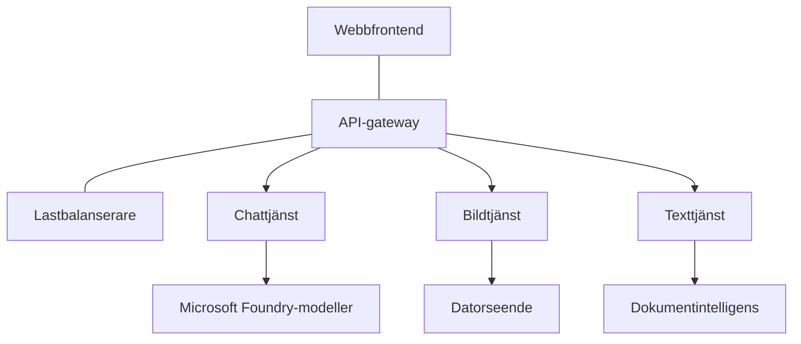

# Bästa praxis för produktions-AI-arbetsbelastningar med AZD

**Kapitelnavigering:**
- **📚 Kursstart**: [AZD For Beginners](../../README.md)
- **📖 Aktuellt kapitel**: Kapitel 8 - Produktions- och företagsmönster
- **⬅️ Föregående kapitel**: [Kapitel 7: Felsökning](../chapter-07-troubleshooting/debugging.md)
- **⬅️ Även relaterat**: [AI Workshop Lab](ai-workshop-lab.md)
- **🎯 Kurs slutförd**: [AZD For Beginners](../../README.md)

## Översikt

Denna guide ger omfattande bästa praxis för att distribuera produktionsklara AI-arbetsbelastningar med Azure Developer CLI (AZD). Baserat på återkoppling från Microsoft Foundry Discord-gemenskapen och verkliga kunddistributioner, tar dessa praxis upp de vanligaste utmaningarna i produktions-AI-system.

## Viktiga utmaningar som adresseras

Baserat på resultaten från vår communityundersökning är detta de främsta utmaningarna utvecklare möter:

- **45%** har problem med AI-distributioner med flera tjänster
- **38%** har problem med autentiseringsuppgifter och hantering av hemligheter  
- **35%** upplever svårigheter med produktionsberedskap och skalning
- **32%** behöver bättre strategier för kostnadsoptimering
- **29%** kräver förbättrad övervakning och felsökning

## Arkitekturmönster för produktions-AI

### Mönster 1: Mikrotjänstarkitektur för AI

**När man ska använda**: Komplexa AI-applikationer med flera kapabiliteter



**AZD-implementation**:

```yaml
# azure.yaml
name: enterprise-ai-platform
services:
  web:
    project: ./web
    host: staticwebapp
  api-gateway:
    project: ./api-gateway
    host: containerapp
  chat-service:
    project: ./services/chat
    host: containerapp
  vision-service:
    project: ./services/vision
    host: containerapp
  text-service:
    project: ./services/text
    host: containerapp
```

### Mönster 2: Händelsestyrd AI-bearbetning

**När man ska använda**: Batchbearbetning, dokumentanalys, asynkrona arbetsflöden

```bicep
// Event Hub for AI processing pipeline
resource eventHub 'Microsoft.EventHub/namespaces@2023-01-01-preview' = {
  name: eventHubNamespaceName
  location: location
  sku: {
    name: 'Standard'
    tier: 'Standard'
    capacity: 1
  }
}

// Service Bus for reliable message processing
resource serviceBus 'Microsoft.ServiceBus/namespaces@2022-10-01-preview' = {
  name: serviceBusNamespaceName
  location: location
  sku: {
    name: 'Premium'
    tier: 'Premium'
    capacity: 1
  }
}

// Function App for processing
resource functionApp 'Microsoft.Web/sites@2023-01-01' = {
  name: functionAppName
  location: location
  kind: 'functionapp,linux'
  properties: {
    siteConfig: {
      appSettings: [
        {
          name: 'FUNCTIONS_EXTENSION_VERSION'
          value: '~4'
        }
        {
          name: 'AZURE_OPENAI_ENDPOINT'
          value: '@Microsoft.KeyVault(VaultName=${keyVault.name};SecretName=openai-endpoint)'
        }
      ]
    }
  }
}
```

## Att tänka på AI-agenters hälsa

När en traditionell webbapp går sönder är symptomen välbekanta: en sida laddas inte, ett API returnerar ett fel eller en deployment misslyckas. AI-drivna applikationer kan gå sönder på alla samma sätt—men de kan också bete sig fel på mer subtila sätt som inte ger uppenbara felmeddelanden.

Detta avsnitt hjälper dig bygga en mental modell för att övervaka AI-arbetsbelastningar så att du vet var du ska titta när saker inte verkar rätt.

### Hur agenthälsa skiljer sig från traditionell apphälsa

En traditionell app fungerar antingen eller så gör den det inte. En AI-agent kan se ut att fungera men ändå ge dåliga resultat. Tänk på agenthälsa i två lager:

| Lager | Vad att övervaka | Var man ska titta |
|-------|--------------|---------------|
| **Infrastrukturhälsa** | Kör tjänsten? Är resurserna provisionerade? Är slutpunkter nåbara? | `azd monitor`, Azure Portal resursstatus, container-/app-loggar |
| **Beteendehälsa** | Svarar agenten korrekt? Är svaren snabba nog? Anropas modellen korrekt? | Application Insights-spår, latensmetrik för modellanrop, loggar för svarskvalitet |

Infrastrukturhälsa är bekant—det är samma för vilken azd-app som helst. Beteendehälsa är det nya lager som AI-arbetsbelastningar introducerar.

### Var man ska titta när AI-appar inte beter sig som förväntat

Om din AI-applikation inte producerar de resultat du förväntar dig, här är en konceptuell checklista:

1. **Börja med grunderna.** Kör appen? Kan den nå sina beroenden? Kontrollera `azd monitor` och resursstatus precis som du skulle göra för vilken app som helst.
2. **Kontrollera modellanslutningen.** Anropar din applikation modellen framgångsrikt? Misslyckade eller tidsöverskridna modellanrop är den vanligaste orsaken till problem med AI-appar och kommer att synas i dina applikationsloggar.
3. **Titta på vad modellen fick.** AI-svar beror på ingången (prompten och eventuell hämtad kontext). Om output är fel, är oftast input fel. Kontrollera om din applikation skickar rätt data till modellen.
4. **Granska svarslatens.** Modellanrop är långsammare än typiska API-anrop. Om din app känns trög, kontrollera om modellens svarstider har ökat—detta kan indikera throttling, kapacitetsgränser eller regionöverbelastning.
5. **Var uppmärksam på kostnadssignaler.** Oväntade toppar i tokenanvändning eller API-anrop kan indikera en loop, en felkonfigurerad prompt eller överdrivna retries.

Du behöver inte bemästra observability-verktyg direkt. Huvudpoängen är att AI-applikationer har ett extra lager av beteende att övervaka, och azd:s inbyggda övervakning (`azd monitor`) ger dig en startpunkt för att undersöka båda lagren.

---

## Säkerhetsbästa praxis

### 1. Zero Trust-säkerhetsmodell

**Implementeringsstrategi**:
- Ingen tjänst-till-tjänst-kommunikation utan autentisering
- Alla API-anrop använder hanterade identiteter
- Nätverksisolering med privata slutpunkter
- Åtkomstkontroller enligt principen om minsta privilegium

```bicep
// Managed Identity for each service
resource chatServiceIdentity 'Microsoft.ManagedIdentity/userAssignedIdentities@2023-01-31' = {
  name: 'chat-service-identity'
  location: location
}

// Role assignments with minimal permissions
resource openAIUserRole 'Microsoft.Authorization/roleAssignments@2022-04-01' = {
  scope: openAIAccount
  name: guid(openAIAccount.id, chatServiceIdentity.id, openAIUserRoleDefinitionId)
  properties: {
    roleDefinitionId: subscriptionResourceId('Microsoft.Authorization/roleDefinitions', '5e0bd9bd-7b93-4f28-af87-19fc36ad61bd')
    principalId: chatServiceIdentity.properties.principalId
    principalType: 'ServicePrincipal'
  }
}
```

### 2. Säker hantering av hemligheter

**Key Vault-integrationsmönster**:

```bicep
// Key Vault with proper access policies
resource keyVault 'Microsoft.KeyVault/vaults@2023-02-01' = {
  name: keyVaultName
  location: location
  properties: {
    tenantId: tenant().tenantId
    sku: {
      family: 'A'
      name: 'premium'  // Use premium for production
    }
    enableRbacAuthorization: true  // Use RBAC instead of access policies
    enablePurgeProtection: true    // Prevent accidental deletion
    enableSoftDelete: true
    softDeleteRetentionInDays: 90
  }
}

// Store all AI service credentials
resource openAIKeySecret 'Microsoft.KeyVault/vaults/secrets@2023-02-01' = {
  parent: keyVault
  name: 'openai-api-key'
  properties: {
    value: openAIAccount.listKeys().key1
    attributes: {
      enabled: true
    }
  }
}
```

### 3. Nätverkssäkerhet

**Konfiguration av privata slutpunkter**:

```bicep
// Virtual Network for AI services
resource virtualNetwork 'Microsoft.Network/virtualNetworks@2023-04-01' = {
  name: vnetName
  location: location
  properties: {
    addressSpace: {
      addressPrefixes: ['10.0.0.0/16']
    }
    subnets: [
      {
        name: 'ai-services-subnet'
        properties: {
          addressPrefix: '10.0.1.0/24'
          privateEndpointNetworkPolicies: 'Disabled'
        }
      }
      {
        name: 'app-services-subnet'
        properties: {
          addressPrefix: '10.0.2.0/24'
          delegations: [
            {
              name: 'Microsoft.Web/serverFarms'
              properties: {
                serviceName: 'Microsoft.Web/serverFarms'
              }
            }
          ]
        }
      }
    ]
  }
}

// Private endpoints for all AI services
resource openAIPrivateEndpoint 'Microsoft.Network/privateEndpoints@2023-04-01' = {
  name: '${openAIAccountName}-pe'
  location: location
  properties: {
    subnet: {
      id: virtualNetwork.properties.subnets[0].id
    }
    privateLinkServiceConnections: [
      {
        name: 'openai-connection'
        properties: {
          privateLinkServiceId: openAIAccount.id
          groupIds: ['account']
        }
      }
    ]
  }
}
```

## Prestanda och skalning

### 1. Auto-skalningsstrategier

**Auto-skalning för Container Apps**:

```bicep
resource containerApp 'Microsoft.App/containerApps@2023-05-01' = {
  name: containerAppName
  location: location
  properties: {
    configuration: {
      ingress: {
        external: true
        targetPort: 8000
        transport: 'http'
      }
    }
    template: {
      scale: {
        minReplicas: 2  // Always have 2 instances minimum
        maxReplicas: 50 // Scale up to 50 for high load
        rules: [
          {
            name: 'http-scaling'
            http: {
              metadata: {
                concurrentRequests: '20'  // Scale when >20 concurrent requests
              }
            }
          }
          {
            name: 'cpu-scaling'
            custom: {
              type: 'cpu'
              metadata: {
                type: 'Utilization'
                value: '70'  // Scale when CPU >70%
              }
            }
          }
        ]
      }
    }
  }
}
```

### 2. Cachingstrategier

**Redis-cache för AI-svar**:

```bicep
// Redis Premium for production workloads
resource redisCache 'Microsoft.Cache/redis@2023-04-01' = {
  name: redisCacheName
  location: location
  properties: {
    sku: {
      name: 'Premium'
      family: 'P'
      capacity: 1
    }
    enableNonSslPort: false
    minimumTlsVersion: '1.2'
    redisConfiguration: {
      'maxmemory-policy': 'allkeys-lru'
    }
    // Enable clustering for high availability
    redisVersion: '6.0'
    shardCount: 2
  }
}

// Cache configuration in application
var cacheConnectionString = '${redisCache.properties.hostName}:6380,password=${redisCache.listKeys().primaryKey},ssl=True,abortConnect=False'
```

### 3. Lastbalansering och trafikhantering

**Application Gateway med WAF**:

```bicep
// Application Gateway with Web Application Firewall
resource applicationGateway 'Microsoft.Network/applicationGateways@2023-04-01' = {
  name: appGatewayName
  location: location
  properties: {
    sku: {
      name: 'WAF_v2'
      tier: 'WAF_v2'
      capacity: 2
    }
    webApplicationFirewallConfiguration: {
      enabled: true
      firewallMode: 'Prevention'
      ruleSetType: 'OWASP'
      ruleSetVersion: '3.2'
    }
    // Backend pools for AI services
    backendAddressPools: [
      {
        name: 'ai-services-pool'
        properties: {
          backendAddresses: [
            {
              fqdn: '${containerApp.properties.configuration.ingress.fqdn}'
            }
          ]
        }
      }
    ]
  }
}
```

## 💰 Kostnadsoptimering

### 1. Rätt dimensionering av resurser

**Miljöspecifika konfigurationer**:

```bash
# Utvecklingsmiljö
azd env new development
azd env set AZURE_OPENAI_SKU "S0"
azd env set AZURE_OPENAI_CAPACITY 10
azd env set AZURE_SEARCH_SKU "basic"
azd env set CONTAINER_CPU 0.5
azd env set CONTAINER_MEMORY 1.0

# Produktionsmiljö
azd env new production
azd env set AZURE_OPENAI_SKU "S0"
azd env set AZURE_OPENAI_CAPACITY 100
azd env set AZURE_SEARCH_SKU "standard"
azd env set CONTAINER_CPU 2.0
azd env set CONTAINER_MEMORY 4.0
```

### 2. Kostnadsövervakning och budgetar

```bicep
// Cost management and budgets
resource budget 'Microsoft.Consumption/budgets@2023-05-01' = {
  name: 'ai-workload-budget'
  properties: {
    timePeriod: {
      startDate: '2024-01-01'
      endDate: '2024-12-31'
    }
    timeGrain: 'Monthly'
    amount: 2000  // $2000 monthly budget
    category: 'Cost'
    notifications: {
      warning: {
        enabled: true
        operator: 'GreaterThan'
        threshold: 80
        contactEmails: [
          'finance@company.com'
          'engineering@company.com'
        ]
        contactRoles: [
          'Owner'
          'Contributor'
        ]
      }
      critical: {
        enabled: true
        operator: 'GreaterThan'
        threshold: 95
        contactEmails: [
          'cto@company.com'
        ]
      }
    }
  }
}
```

### 3. Optimering av tokenanvändning

**OpenAI-kostnadshantering**:

```typescript
// Tokenoptimering på applikationsnivå
class TokenOptimizer {
  private readonly maxTokens = 4000;
  private readonly reserveTokens = 500;
  
  optimizePrompt(userInput: string, context: string): string {
    const availableTokens = this.maxTokens - this.reserveTokens;
    const estimatedTokens = this.estimateTokens(userInput + context);
    
    if (estimatedTokens > availableTokens) {
      // Förkorta kontexten, inte användarens indata
      context = this.truncateContext(context, availableTokens - this.estimateTokens(userInput));
    }
    
    return `${context}\n\nUser: ${userInput}`;
  }
  
  private estimateTokens(text: string): number {
    // Ungefärlig uppskattning: 1 token ≈ 4 tecken
    return Math.ceil(text.length / 4);
  }
}
```

## Övervakning och observerbarhet

### 1. Omfattande Application Insights

```bicep
// Application Insights with advanced features
resource applicationInsights 'Microsoft.Insights/components@2020-02-02' = {
  name: applicationInsightsName
  location: location
  kind: 'web'
  properties: {
    Application_Type: 'web'
    WorkspaceResourceId: logAnalyticsWorkspace.id
    SamplingPercentage: 100  // Full sampling for AI apps
    DisableIpMasking: false  // Enable for security
  }
}

// Custom metrics for AI operations
resource aiMetricAlerts 'Microsoft.Insights/metricAlerts@2018-03-01' = {
  name: 'ai-high-error-rate'
  location: 'global'
  properties: {
    description: 'Alert when AI service error rate is high'
    severity: 2
    enabled: true
    scopes: [
      applicationInsights.id
    ]
    evaluationFrequency: 'PT1M'
    windowSize: 'PT5M'
    criteria: {
      'odata.type': 'Microsoft.Azure.Monitor.SingleResourceMultipleMetricCriteria'
      allOf: [
        {
          name: 'high-error-rate'
          metricName: 'requests/failed'
          operator: 'GreaterThan'
          threshold: 10
          timeAggregation: 'Count'
        }
      ]
    }
  }
}
```

### 2. AI-specifik övervakning

**Anpassade instrumentpaneler för AI-metriker**:

```json
// Dashboard configuration for AI workloads
{
  "dashboard": {
    "name": "AI Application Monitoring",
    "tiles": [
      {
        "name": "OpenAI Request Volume",
        "query": "requests | where name contains 'openai' | summarize count() by bin(timestamp, 5m)"
      },
      {
        "name": "AI Response Latency",
        "query": "requests | where name contains 'openai' | summarize avg(duration) by bin(timestamp, 5m)"
      },
      {
        "name": "Token Usage",
        "query": "customMetrics | where name == 'openai_tokens_used' | summarize sum(value) by bin(timestamp, 1h)"
      },
      {
        "name": "Cost per Hour",
        "query": "customMetrics | where name == 'openai_cost' | summarize sum(value) by bin(timestamp, 1h)"
      }
    ]
  }
}
```

### 3. Hälsokontroller och uppetidsövervakning

```bicep
// Application Insights availability tests
resource availabilityTest 'Microsoft.Insights/webtests@2022-06-15' = {
  name: 'ai-app-availability-test'
  location: location
  tags: {
    'hidden-link:${applicationInsights.id}': 'Resource'
  }
  properties: {
    SyntheticMonitorId: 'ai-app-availability-test'
    Name: 'AI Application Availability Test'
    Description: 'Tests AI application endpoints'
    Enabled: true
    Frequency: 300  // 5 minutes
    Timeout: 120    // 2 minutes
    Kind: 'ping'
    Locations: [
      {
        Id: 'us-east-2-azr'
      }
      {
        Id: 'us-west-2-azr'
      }
    ]
    Configuration: {
      WebTest: '''
        <WebTest Name="AI Health Check" 
                 Id="8d2de8d2-a2b0-4c2e-9a0d-8f9c9a0b8c8d" 
                 Enabled="True" 
                 CssProjectStructure="" 
                 CssIteration="" 
                 Timeout="120" 
                 WorkItemIds="" 
                 xmlns="http://microsoft.com/schemas/VisualStudio/TeamTest/2010" 
                 Description="" 
                 CredentialUserName="" 
                 CredentialPassword="" 
                 PreAuthenticate="True" 
                 Proxy="default" 
                 StopOnError="False" 
                 RecordedResultFile="" 
                 ResultsLocale="">
          <Items>
            <Request Method="GET" 
                     Guid="a5f10126-e4cd-570d-961c-cea43999a200" 
                     Version="1.1" 
                     Url="${webApp.properties.defaultHostName}/health" 
                     ThinkTime="0" 
                     Timeout="120" 
                     ParseDependentRequests="True" 
                     FollowRedirects="True" 
                     RecordResult="True" 
                     Cache="False" 
                     ResponseTimeGoal="0" 
                     Encoding="utf-8" 
                     ExpectedHttpStatusCode="200" 
                     ExpectedResponseUrl="" 
                     ReportingName="" 
                     IgnoreHttpStatusCode="False" />
          </Items>
        </WebTest>
      '''
    }
  }
}
```

## Katastrofåterställning och hög tillgänglighet

### 1. Distribuering i flera regioner

```yaml
# azure.yaml - Multi-region configuration
name: ai-app-multiregion
services:
  api-primary:
    project: ./api
    host: containerapp
    env:
      - AZURE_REGION=eastus
  api-secondary:
    project: ./api
    host: containerapp
    env:
      - AZURE_REGION=westus2
```

```bicep
// Traffic Manager for global load balancing
resource trafficManager 'Microsoft.Network/trafficManagerProfiles@2022-04-01' = {
  name: trafficManagerProfileName
  location: 'global'
  properties: {
    profileStatus: 'Enabled'
    trafficRoutingMethod: 'Priority'
    dnsConfig: {
      relativeName: trafficManagerProfileName
      ttl: 30
    }
    monitorConfig: {
      protocol: 'HTTPS'
      port: 443
      path: '/health'
      intervalInSeconds: 30
      toleratedNumberOfFailures: 3
      timeoutInSeconds: 10
    }
    endpoints: [
      {
        name: 'primary-endpoint'
        type: 'Microsoft.Network/trafficManagerProfiles/azureEndpoints'
        properties: {
          targetResourceId: primaryAppService.id
          endpointStatus: 'Enabled'
          priority: 1
        }
      }
      {
        name: 'secondary-endpoint'
        type: 'Microsoft.Network/trafficManagerProfiles/azureEndpoints'
        properties: {
          targetResourceId: secondaryAppService.id
          endpointStatus: 'Enabled'
          priority: 2
        }
      }
    ]
  }
}
```

### 2. Säkerhetskopiering och återställning av data

```bicep
// Backup configuration for critical data
resource backupVault 'Microsoft.DataProtection/backupVaults@2023-05-01' = {
  name: backupVaultName
  location: location
  identity: {
    type: 'SystemAssigned'
  }
  properties: {
    storageSettings: [
      {
        datastoreType: 'VaultStore'
        type: 'LocallyRedundant'
      }
    ]
  }
}

// Backup policy for AI models and data
resource backupPolicy 'Microsoft.DataProtection/backupVaults/backupPolicies@2023-05-01' = {
  parent: backupVault
  name: 'ai-data-backup-policy'
  properties: {
    policyRules: [
      {
        backupParameters: {
          backupType: 'Full'
          objectType: 'AzureBackupParams'
        }
        trigger: {
          schedule: {
            repeatingTimeIntervals: [
              'R/2024-01-01T02:00:00+00:00/P1D'  // Daily at 2 AM
            ]
          }
          objectType: 'ScheduleBasedTriggerContext'
        }
        dataStore: {
          datastoreType: 'VaultStore'
          objectType: 'DataStoreInfoBase'
        }
        name: 'BackupDaily'
        objectType: 'AzureBackupRule'
      }
    ]
  }
}
```

## DevOps och CI/CD-integration

### 1. GitHub Actions-arbetsflöde

```yaml
# .github/workflows/deploy-ai-app.yml
name: Deploy AI Application

on:
  push:
    branches: [main]
  pull_request:
    branches: [main]

jobs:
  test:
    runs-on: ubuntu-latest
    steps:
      - uses: actions/checkout@v4
      
      - name: Setup Python
        uses: actions/setup-python@v4
        with:
          python-version: '3.11'
          
      - name: Install dependencies
        run: |
          pip install -r requirements.txt
          pip install pytest
          
      - name: Run tests
        run: pytest tests/
        
      - name: AI Safety Tests
        run: |
          python scripts/test_ai_safety.py
          python scripts/validate_prompts.py

  deploy-staging:
    needs: test
    if: github.event_name == 'pull_request'
    runs-on: ubuntu-latest
    steps:
      - uses: actions/checkout@v4
      
      - name: Setup AZD
        uses: Azure/setup-azd@v2
        
      - name: Login to Azure
        uses: azure/login@v1
        with:
          creds: ${{ secrets.AZURE_CREDENTIALS }}
          
      - name: Deploy to Staging
        run: |
          azd env select staging
          azd deploy

  deploy-production:
    needs: test
    if: github.ref == 'refs/heads/main'
    runs-on: ubuntu-latest
    steps:
      - uses: actions/checkout@v4
      
      - name: Setup AZD
        uses: Azure/setup-azd@v2
        
      - name: Login to Azure
        uses: azure/login@v1
        with:
          creds: ${{ secrets.AZURE_CREDENTIALS }}
          
      - name: Deploy to Production
        run: |
          azd env select production
          azd deploy
          
      - name: Run Production Health Checks
        run: |
          python scripts/health_check.py --env production
```

### 2. Infrastrukturvalidering

```bash
# scripts/validate_infrastructure.sh
#!/bin/bash

echo "Validating AI infrastructure deployment..."

# Kontrollera att alla nödvändiga tjänster körs
services=("openai" "search" "storage" "keyvault")
for service in "${services[@]}"; do
    echo "Checking $service..."
    if ! az resource list --resource-type "Microsoft.CognitiveServices/accounts" --query "[?contains(name, '$service')]" -o tsv; then
        echo "ERROR: $service not found"
        exit 1
    fi
done

# Validera OpenAI-modellutplaceringar
echo "Validating OpenAI model deployments..."
models=$(az cognitiveservices account deployment list --name $AZURE_OPENAI_NAME --resource-group $AZURE_RESOURCE_GROUP --query "[].name" -o tsv)
if [[ ! $models == *"gpt-4.1-mini"* ]]; then
  echo "ERROR: Required model gpt-4.1-mini not deployed"
    exit 1
fi

# Testa AI-tjänstens anslutning
echo "Testing AI service connectivity..."
python scripts/test_connectivity.py

echo "Infrastructure validation completed successfully!"
```

## Checklista för produktionsberedskap

### Säkerhet ✅
- [ ] Alla tjänster använder hanterade identiteter
- [ ] Hemligheter lagras i Key Vault
- [ ] Privata slutpunkter konfigurerade
- [ ] Nätverkssäkerhetsgrupper implementerade
- [ ] RBAC med minsta privilegier
- [ ] WAF aktiverat på offentliga slutpunkter

### Prestanda ✅
- [ ] Auto-skalning konfigurerad
- [ ] Caching implementerat
- [ ] Lastbalansering konfigurerad
- [ ] CDN för statiskt innehåll
- [ ] Databasanslutningspooling
- [ ] Optimering av tokenanvändning

### Övervakning ✅
- [ ] Application Insights konfigurerat
- [ ] Anpassade mätvärden definierade
- [ ] Varningsregler konfigurerade
- [ ] Instrumentpanel skapad
- [ ] Hälsokontroller implementerade
- [ ] Policyer för logglagring

### Tillförlitlighet ✅
- [ ] Distribution i flera regioner
- [ ] Plan för backup och återställning
- [ ] Circuit breakers implementerade
- [ ] Återförsökspolicys konfigurerade
- [ ] Kontrollerad degradering
- [ ] Slutpunkter för hälsokontroller

### Kostnadshantering ✅
- [ ] Budgetvarningar konfigurerade
- [ ] Rätt dimensionering av resurser
- [ ] Dev/test-rabatter tillämpade
- [ ] Reserverade instanser köpta
- [ ] Instrumentpanel för kostnadsövervakning
- [ ] Regelbundna kostnadsgranskningar

### Efterlevnad ✅
- [ ] Krav på dataresidens uppfyllda
- [ ] Granskningsloggning aktiverad
- [ ] Efterlevnadspolicys tillämpade
- [ ] Säkerhetsbaslinjer implementerade
- [ ] Regelbundna säkerhetsbedömningar
- [ ] Incidenthanteringsplan

## Prestandamått

### Typiska produktionsmått

| Mätvärde | Mål | Övervakning |
|--------|--------|------------|
| **Svarstid** | < 2 sekunder | Application Insights |
| **Tillgänglighet** | 99.9% | Uptime monitoring |
| **Felprocent** | < 0.1% | Application logs |
| **Tokenanvändning** | < $500/månad | Cost management |
| **Samtidiga användare** | 1000+ | Load testing |
| **Återhämtningstid** | < 1 timme | Disaster recovery tests |

### Belastningstestning

```bash
# Skript för belastningstestning av AI-applikationer
python scripts/load_test.py \
  --endpoint https://your-ai-app.azurewebsites.net \
  --concurrent-users 100 \
  --duration 300 \
  --ramp-up 60
```

## 🤝 Gemenskapens bästa praxis

Baserat på återkoppling från Microsoft Foundry Discord-gemenskapen:

### Topprekommendationer från gemenskapen:

1. **Börja smått, skala gradvis**: Börja med grundläggande SKU:er och skala upp baserat på faktisk användning
2. **Övervaka allt**: Sätt upp omfattande övervakning från dag ett
3. **Automatisera säkerhet**: Använd infrastruktur som kod för konsekvent säkerhet
4. **Testa noggrant**: Inkludera AI-specifik testning i din pipeline
5. **Planera för kostnader**: Övervaka tokenanvändning och sätt upp budgetvarningar tidigt

### Vanliga fallgropar att undvika:

- ❌ Hårdkoda API-nycklar i koden
- ❌ Inte sätta upp korrekt övervakning
- ❌ Ignorera kostnadsoptimering
- ❌ Inte testa felscenarier
- ❌ Distribuera utan hälsokontroller

## AZD AI CLI-kommandon och extensioner

AZD innehåller en växande uppsättning AI-specifika kommandon och extensioner som förenklar produktions-AI-arbetsflöden. Dessa verktyg överbryggar gapet mellan lokal utveckling och produktionsdistribution för AI-arbetsbelastningar.

### AZD-extensioner för AI

AZD använder ett extensionssystem för att lägga till AI-specifika kapabiliteter. Installera och hantera extensioner med:

```bash
# Lista alla tillgängliga tillägg (inklusive AI)
azd extension list

# Visa detaljer om installerade tillägg
azd extension show azure.ai.agents

# Installera Foundry Agents-tillägget
azd extension install azure.ai.agents

# Installera finjusteringstillägget
azd extension install azure.ai.finetune

# Installera tillägget för anpassade modeller
azd extension install azure.ai.models

# Uppgradera alla installerade tillägg
azd extension upgrade --all
```

**Tillgängliga AI-extensioner:**

| Extension | Syfte | Status |
|-----------|---------|--------|
| `azure.ai.agents` | Hantering av Foundry Agent Service | Förhandsgranskning |
| `azure.ai.skills` | Återanvändbara agentfärdigheter | Förhandsgranskning |
| `azure.ai.connections` | Foundry-anslutningar (datakällor, verktyg) | Förhandsgranskning |
| `azure.ai.finetune` | Foundry-modellfinjustering | Förhandsgranskning |
| `azure.ai.models` | Foundry-anpassade modeller | Förhandsgranskning |
| `azure.coding-agent` | Konfiguration av kodningsagent | Tillgänglig |

> `azure.ai.agents`-extensionen utvecklas snabbt. Denna kurs är validerad mot `0.1.40-preview`. Kör `azd extension upgrade --all` för att hämta den senaste kommandosamlingen, och `azd extension show azure.ai.agents` för att bekräfta din installerade version.

**Vad är de nyare `skills`- och `connections`-extensionerna?**

Två preview-extensioner dök upp tillsammans med agentverktygen och är värda att förstå även som nybörjare:

- **`azure.ai.skills`** — En **skill** är en återanvändbar kapabilitet (ett paketerat verktyg eller beteende) du kan bifoga till en eller flera agenter istället för att implementera den varje gång. Tänk på det som en delad byggsten: definiera en "sök i dokumentationen" eller "slå upp en order"-skill en gång, och återanvänd den över agenter. Detta håller multi-agent-system (Kapitel 5) konsekventa och undviker kopiera-klistra.
- **`azure.ai.connections`** — En **connection** är en hanterad länk från ditt Foundry-projekt till en extern resurs som dina agenter behöver—en datakälla (som Azure AI Search), en verktygslänk eller en annan tjänst. Connections centraliserar var och hur agenter får åtkomst till data, så autentiseringsuppgifter och slutpunkter finns på ett styrt ställe istället för utspritt i koden.

Du behöver inte dessa för att distribuera dina första agenter—håll dig till `azure.ai.agents` medan du lär dig. Vänd dig till `skills` när du upptäcker att du duplicerar samma verktyg över agenter, och till `connections` när flera agenter delar samma datakälla.

### Initiera agentprojekt med `azd ai agent init`

Kommandot `azd ai agent init` skapar ett produktionsklart AI-agentprojekt integrerat med Microsoft Foundry Agent Service:

```bash
# Initiera ett nytt agentprojekt från ett agentmanifest
azd ai agent init -m <manifest-path-or-uri>

# Initiera och rikta in mot ett specifikt Foundry-projekt
azd ai agent init -m agent-manifest.yaml --project-id <foundry-project-id>

# Initiera med en anpassad källkatalog
azd ai agent init -m agent-manifest.yaml --src ./agents/my-agent

# Rikta Container Apps som värd
azd ai agent init -m agent-manifest.yaml --host containerapp
```

**Viktiga flaggor:**

| Flagga | Beskrivning |
|------|-------------|
| `-m, --manifest` | Sökväg eller URI till ett agentmanifest att lägga till i ditt projekt |
| `-p, --project-id` | Befintligt Microsoft Foundry Project ID för din azd-miljö |
| `-s, --src` | Katalog för att ladda ner agentdefinitionen (standard: `src/<agent-id>`) |
| `--host` | Åsidosätt standardhosten (t.ex. `containerapp`) |
| `-e, --environment` | Den azd-miljö som ska användas |

**Tips för produktion**: Använd `--project-id` för att ansluta direkt till ett befintligt Foundry-projekt, så att din agentkod och molnresurser är länkade från början.

### Hantera agentlivscykeln

Utöver `init` erbjuder `azure.ai.agents`-extensionen kommandon för hela livscykeln för en hostad agent—testa, utvärdera, optimera och pensionera den:

```bash
# Anropa en driftsatt agent och visa serverns svarstider
# (total latens och tid till första byte)
azd ai agent invoke

# Visa den aktiva slutpunktens konfiguration innan du ändrar den
azd ai agent endpoint show

# Generera en utvärderingsdataset för agenten
azd ai agent eval generate --dataset ./eval/dataset.jsonl

# Optimera agentens instruktioner utifrån din utvärderingsdata
# (kräver en optimization_model i agentprojektet)
azd ai agent optimize

# Ladda ner den driftsatta källkoden för en kodbaserad hostad agent
# (med SHA-256-verifiering)
azd ai agent code download

# Ta bort en hostad agent och alla dess versioner
# (--force avslutar aktiva sessioner)
azd ai agent delete --force
```

**Livscykel i korthet:**

| Fas | Kommando | Produktionsanvändning |
|-------|---------|----------------|
| Test | `azd ai agent invoke` | Validera svar och mät latens innan release |
| Inspektera | `azd ai agent endpoint show` | Granska endpoint-autentisering/konfig; upptäck brytande förändringar tidigt |
| Mäta | `azd ai agent eval generate` | Bygg en repeterbar utvärderingsuppsättning från verkliga spår |
| Förbättra | `azd ai agent optimize` | Finjustera instruktioner mot uppmätt kvalitet |
| Återställ | `azd ai agent code download` | Hämta den exakt distribuerade koden för revision/rollback |
| Avveckla | `azd ai agent delete --force` | Ta ner en agent och dess versioner på ett rent sätt |

> Dessa är preview-kommandon och kan ändras mellan extension-versioner. Kör `azd ai agent --help` för att se de exakta underkommandon som finns i din installerade version.

### Model Context Protocol (MCP) med `azd mcp`
AZD includes built-in MCP server support (Alpha), enabling AI agents and tools to interact with your Azure resources through a standardized protocol:

```bash
# Starta MCP-servern för ditt projekt
azd mcp start

# Granska de aktuella Copilot-samtycksreglerna för körning av verktyg
azd copilot consent list
```

The MCP server exposes your azd project context—environments, services, and Azure resources—to AI-powered development tools. This enables:

- **AI-assisted deployment**: Let coding agents query your project state and trigger deployments
- **Resource discovery**: AI tools can discover what Azure resources your project uses
- **Environment management**: Agents can switch between dev/staging/production environments

### Infrastructure Generation with `azd infra generate`

For production AI workloads, you can generate and customize Infrastructure as Code rather than relying on automatic provisioning:

```bash
# Generera Bicep/Terraform-filer från din projektdefinition
azd infra generate
```

This writes IaC to disk so you can:
- Review and audit infrastructure before deploying
- Add custom security policies (network rules, private endpoints)
- Integrate with existing IaC review processes
- Version control infrastructure changes separately from application code

### Production Lifecycle Hooks

AZD hooks let you inject custom logic at every stage of the deployment lifecycle—critical for production AI workflows:

```yaml
# azure.yaml - Production hooks example
name: ai-production-app
hooks:
  preprovision:
    shell: sh
    run: scripts/validate-quotas.sh    # Check AI model quota before provisioning
  postprovision:
    shell: sh
    run: scripts/configure-networking.sh  # Set up private endpoints
  predeploy:
    shell: sh
    run: scripts/run-ai-safety-tests.sh  # Run prompt safety checks
  postdeploy:
    shell: sh
    run: scripts/smoke-test.sh           # Verify agent responses post-deploy
services:
  agent-api:
    project: ./src/agent
    host: containerapp
    hooks:
      predeploy:
        shell: sh
        run: scripts/validate-model-access.sh  # Per-service hook
```

```bash
# Kör en specifik hook manuellt under utveckling
azd hooks run predeploy
```

**Recommended production hooks for AI workloads:**

| Hook | Use Case |
|------|----------|
| `preprovision` | Validate subscription quotas for AI model capacity |
| `postprovision` | Configure private endpoints, deploy model weights |
| `predeploy` | Run AI safety tests, validate prompt templates |
| `postdeploy` | Smoke test agent responses, verify model connectivity |

### CI/CD Pipeline Configuration

Use `azd pipeline config` to connect your project to GitHub Actions or Azure Pipelines with secure Azure authentication:

```bash
# Konfigurera CI/CD-pipeline (interaktiv)
azd pipeline config

# Konfigurera med en specifik leverantör
azd pipeline config --provider github
```

This command:
- Creates a service principal with least-privilege access
- Configures federated credentials (no stored secrets)
- Generates or updates your pipeline definition file
- Sets required environment variables in your CI/CD system

#### Step-by-step: your first GitHub Actions pipeline

Here's the full walkthrough from a working azd project to automated deployments on every push.

**1. Make sure your project is on GitHub**

```bash
git init
git add .
git commit -m "Initial azd project"
gh repo create my-ai-app --private --source=. --push
```

**2. Run pipeline config**

```bash
azd pipeline config --provider github
```

azd will, interactively:
- Ask which Azure subscription and environment to target
- Create an Entra **app registration + service principal** for the pipeline
- Set up **federated credentials (OIDC)**—so GitHub authenticates to Azure with short-lived tokens and **no secrets are stored**
- Push the required **variables** to your GitHub repo (`AZURE_CLIENT_ID`, `AZURE_TENANT_ID`, `AZURE_SUBSCRIPTION_ID`, `AZURE_ENV_NAME`, `AZURE_LOCATION`)

**3. Understand the generated workflow**

azd adds `.github/workflows/azure-dev.yml`. The key parts look like this:

```yaml
# .github/workflows/azure-dev.yml
on:
  push:
    branches: [ main ]
  workflow_dispatch:        # lets you run it manually too

permissions:
  id-token: write           # required for OIDC federated login
  contents: read

jobs:
  build:
    runs-on: ubuntu-latest
    env:
      AZURE_CLIENT_ID: ${{ vars.AZURE_CLIENT_ID }}
      AZURE_TENANT_ID: ${{ vars.AZURE_TENANT_ID }}
      AZURE_SUBSCRIPTION_ID: ${{ vars.AZURE_SUBSCRIPTION_ID }}
      AZURE_ENV_NAME: ${{ vars.AZURE_ENV_NAME }}
      AZURE_LOCATION: ${{ vars.AZURE_LOCATION }}
    steps:
      - uses: actions/checkout@v4
      - name: Install azd
        uses: Azure/setup-azd@v2
      - name: Log in with OIDC
        run: azd auth login --client-id "$AZURE_CLIENT_ID" --federated-credential-provider "github" --tenant-id "$AZURE_TENANT_ID"
      - name: Provision infrastructure
        run: azd provision --no-prompt
      - name: Deploy application
        run: azd deploy --no-prompt
```

**4. Verify it works**

```bash
# Pusha en ändring för att utlösa pipelinen
git commit -am "Trigger pipeline" --allow-empty
git push
```

Open the **Actions** tab in your GitHub repo and watch the workflow run `azd provision` and `azd deploy` automatically.

> **Why federated credentials matter:** older pipelines stored a client secret in GitHub. OIDC federated credentials remove that secret entirely—GitHub requests a short-lived token at runtime, which is both more secure and nothing to rotate or leak. This is the default `azd pipeline config` sets up.

> **Secrets vs. variables:** non-sensitive identifiers (`AZURE_CLIENT_ID`, etc.) go in repo **variables**. If your app genuinely needs a secret at build time, add it as a GitHub **secret** and reference it with `${{ secrets.NAME }}`—but prefer Key Vault + managed identity at runtime (see [Chapter 3](../chapter-03-configuration/authsecurity.md)).

**Production workflow with pipeline config:**

```bash
# 1. Ställ in produktionsmiljön
azd env new production
azd env set AZURE_OPENAI_CAPACITY 100

# 2. Konfigurera pipelinjen
azd pipeline config --provider github

# 3. Pipelinjen kör azd deploy vid varje push till main
```

#### Step-by-step: Azure DevOps Pipelines

Prefer Azure DevOps over GitHub Actions? azd supports it natively with the `azdo` provider. The flow is nearly identical—azd generates the pipeline file, creates a service connection, and wires up authentication.

**1. Make sure you have an Azure DevOps project**

You need an organization and a project at `https://dev.azure.com/<your-org>`. Generate a Personal Access Token (PAT) with **Build (Read & execute)**, **Code (Read & write)**, and **Service Connections (Read, query & manage)** scopes—azd will prompt you for it.

**2. Configure the pipeline**

```bash
azd pipeline config --provider azdo
```

azd will:
- Ask for your Azure DevOps organization and project
- Create (or reuse) a **service connection** to Azure using a service principal
- Configure **workload identity federation (OIDC)** so no client secret is stored
- Commit an `azure-dev.yml` pipeline definition to your repo

**3. Review the generated `azure-dev.yml`**

azd writes a pipeline that provisions and deploys on every push to `main`:

```yaml
# azure-dev.yml
trigger:
  - main

pool:
  vmImage: ubuntu-latest

steps:
  - task: setup-azd@1
    displayName: Install azd

  - script: azd provision --no-prompt
    displayName: Provision Infrastructure
    env:
      AZURE_SUBSCRIPTION_ID: $(AZURE_SUBSCRIPTION_ID)
      AZURE_ENV_NAME: $(AZURE_ENV_NAME)
      AZURE_LOCATION: $(AZURE_LOCATION)

  - script: azd deploy --no-prompt
    displayName: Deploy Application
    env:
      AZURE_SUBSCRIPTION_ID: $(AZURE_SUBSCRIPTION_ID)
      AZURE_ENV_NAME: $(AZURE_ENV_NAME)
      AZURE_LOCATION: $(AZURE_LOCATION)
```

**4. Where the variables come from**

azd stores the environment values (`AZURE_ENV_NAME`, `AZURE_LOCATION`, `AZURE_SUBSCRIPTION_ID`) as a **variable group** in Azure DevOps so the pipeline can read them. You can view and edit them under **Pipelines → Library**.

> **Same OIDC benefit as GitHub:** the `azdo` provider also configures workload identity federation by default, so there's no client secret stored in the service connection—Azure DevOps exchanges a short-lived token at runtime. Pass `--auth-type client-credentials` only if your organization can't use OIDC yet.

**5. Run it**

```bash
git commit -am "Add Azure DevOps pipeline" --allow-empty
git push
```

Open **Pipelines** in Azure DevOps to watch `azd provision` and `azd deploy` run.

### Adding Components with `azd add`

Incrementally add Azure services to an existing project:

```bash
# Lägg till en ny tjänstekomponent interaktivt
azd add
```

This is particularly useful for expanding production AI applications—for example, adding a vector search service, a new agent endpoint, or a monitoring component to an existing deployment.

## Additional Resources

- **Azure Well-Architected Framework**: [AI workload guidance](https://learn.microsoft.com/azure/well-architected/ai/)
- **Microsoft Foundry Documentation**: [Official docs](https://learn.microsoft.com/azure/ai-studio/)
- **Community Templates**: [Azure Samples](https://github.com/Azure-Samples)
- **Discord Community**: [#Azure channel](https://discord.gg/microsoft-azure)
- **Agent Skills for Azure**: [microsoft/github-copilot-for-azure on skills.sh](https://skills.sh/microsoft/github-copilot-for-azure) - 37 open agent skills for Azure AI, Foundry, deployment, cost optimization, and diagnostics. Install in your editor:
  ```bash
  npx skills add microsoft/github-copilot-for-azure
  ```

---

**Chapter Navigation:**
- **📚 Course Home**: [AZD For Beginners](../../README.md)
- **📖 Current Chapter**: Chapter 8 - Production & Enterprise Patterns
- **⬅️ Previous Chapter**: [Chapter 7: Troubleshooting](../chapter-07-troubleshooting/debugging.md)
- **⬅️ Also Related**: [AI Workshop Lab](ai-workshop-lab.md)
- **� Course Complete**: [AZD For Beginners](../../README.md)

**Remember**: Production AI workloads require careful planning, monitoring, and continuous optimization. Start with these patterns and adapt them to your specific requirements.

---

<!-- CO-OP TRANSLATOR DISCLAIMER START -->
**Ansvarsfriskrivning**:
Detta dokument har översatts med hjälp av AI-översättningstjänsten [Co-op Translator](https://github.com/Azure/co-op-translator). Även om vi strävar efter noggrannhet, var vänlig notera att automatiska översättningar kan innehålla fel eller brister. Det ursprungliga dokumentet på dess modersmål bör betraktas som den auktoritativa källan. För kritisk information rekommenderas professionell mänsklig översättning. Vi ansvarar inte för några missförstånd eller feltolkningar som uppstår till följd av användningen av denna översättning.
<!-- CO-OP TRANSLATOR DISCLAIMER END -->