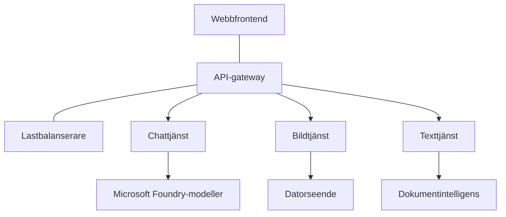

# Bästa praxis för produktions-AI-arbetsbelastningar med AZD

**Kapitelnavigering:**
- **📚 Kursens startsida**: [AZD för nybörjare](../../README.md)
- **📖 Aktuellt kapitel**: Kapitel 8 - Produktions- och företagsmönster
- **⬅️ Föregående kapitel**: [Kapitel 7: Felsökning](../chapter-07-troubleshooting/debugging.md)
- **⬅️ Relaterat**: [AI Workshop-labb](ai-workshop-lab.md)
- **🎯 Kurs slutförd**: [AZD för nybörjare](../../README.md)

## Översikt

Denna guide ger omfattande bästa praxis för att distribuera produktionsklara AI-arbetsbelastningar med Azure Developer CLI (AZD). Baserat på feedback från Microsoft Foundry Discord-gemenskapen och verkliga kundimplementationer tar dessa praxis upp de vanligaste utmaningarna i produktions-AI-system.

## Viktiga utmaningar som tas upp

Baserat på resultat från vår community-omröstning är detta de främsta utmaningarna utvecklare står inför:

- **45%** har problem med AI-distributioner med flera tjänster
- **38%** har problem med hantering av autentiseringsuppgifter och hemligheter  
- **35%** tycker att produktionsberedskap och skalning är svåra
- **32%** behöver bättre strategier för kostnadsoptimering
- **29%** behöver förbättrad övervakning och felsökning

## Arkitekturmönster för produktions-AI

### Mönster 1: Mikrotjänst-AI-arkitektur

**När man ska använda det**: Komplexa AI-applikationer med flera funktioner


**AZD-implementering**:

```yaml
# azure.yaml
name: enterprise-ai-platform
services:
  web:
    project: ./web
    host: staticwebapp
  api-gateway:
    project: ./api-gateway
    host: containerapp
  chat-service:
    project: ./services/chat
    host: containerapp
  vision-service:
    project: ./services/vision
    host: containerapp
  text-service:
    project: ./services/text
    host: containerapp
```

### Mönster 2: Händelsestyrd AI-bearbetning

**När man ska använda det**: Batchbearbetning, dokumentanalys, asynkrona arbetsflöden

```bicep
// Event Hub for AI processing pipeline
resource eventHub 'Microsoft.EventHub/namespaces@2023-01-01-preview' = {
  name: eventHubNamespaceName
  location: location
  sku: {
    name: 'Standard'
    tier: 'Standard'
    capacity: 1
  }
}

// Service Bus for reliable message processing
resource serviceBus 'Microsoft.ServiceBus/namespaces@2022-10-01-preview' = {
  name: serviceBusNamespaceName
  location: location
  sku: {
    name: 'Premium'
    tier: 'Premium'
    capacity: 1
  }
}

// Function App for processing
resource functionApp 'Microsoft.Web/sites@2023-01-01' = {
  name: functionAppName
  location: location
  kind: 'functionapp,linux'
  properties: {
    siteConfig: {
      appSettings: [
        {
          name: 'FUNCTIONS_EXTENSION_VERSION'
          value: '~4'
        }
        {
          name: 'AZURE_OPENAI_ENDPOINT'
          value: '@Microsoft.KeyVault(VaultName=${keyVault.name};SecretName=openai-endpoint)'
        }
      ]
    }
  }
}
```

## Att tänka på AI-agentens hälsa

När en traditionell webbapp går sönder är symtomen bekanta: en sida laddas inte, ett API returnerar ett fel eller en distribution misslyckas. AI-drivna applikationer kan gå sönder på samma sätt — men de kan också bete sig felaktigt på mer subtila sätt som inte ger uppenbara felmeddelanden.

Detta avsnitt hjälper dig att bygga en mental modell för övervakning av AI-arbetsbelastningar så att du vet var du ska leta när något verkar fel.

### Hur agenthälsa skiljer sig från traditionell apphälsa

En traditionell app fungerar antingen eller inte. En AI-agent kan verka fungera men ge dåliga resultat. Tänk på agenthälsa i två lager:

| Lager | Vad att bevaka | Var du ska titta |
|-------|--------------|---------------|
| **Infrastrukturhälsa** | Körs tjänsten? Är resurserna provisionerade? Är slutpunkterna nåbara? | `azd monitor`, resurshälsa i Azure-portalen, container-/apploggar |
| **Beteendehälsa** | Svarar agenten korrekt? Är svaren snabba? Anropas modellen korrekt? | Application Insights-spår, metrik för modellanropslatens, loggar för svarskvalitet |

Infrastrukturhälsa är bekant—det är samma för vilken azd-app som helst. Beteendehälsa är det nya lager som AI-arbetsbelastningar introducerar.

### Var du ska titta när AI-appar inte beter sig som förväntat

Om din AI-applikation inte producerar de resultat du förväntar dig finns här en konceptuell kontrollista:

1. **Börja med grunderna.** Kör appen? Kan den nå sina beroenden? Kontrollera `azd monitor` och resurshälsan precis som du skulle göra för vilken app som helst.
2. **Kontrollera modellanslutningen.** Anropar din applikation AI-modellen framgångsrikt? Misslyckade eller tidsavbrutna modelanrop är den vanligaste orsaken till problem i AI-appar och syns i dina applikationsloggar.
3. **Titta på vad modellen fick.** AI-svar beror på indata (prompten och eventuellt hämtat kontext). Om utsignalen är felaktig är oftast indatan fel. Kontrollera om din applikation skickar rätt data till modellen.
4. **Granska svarslatenser.** Modellanrop till AI är långsammare än typiska API-anrop. Om din app känns seg, kontrollera om modellens responstider har ökat—detta kan indikera begränsning (throttling), kapacitetsgränser eller regionnivå-trängsel.
5. **Håll koll på kostnadssignaler.** Oväntade toppar i tokenanvändning eller API-anrop kan indikera en loop, en felkonfigurerad prompt eller överdrivna återförsök.

Du behöver inte bemästra observabilitetsverktyg direkt. Huvudpoängen är att AI-applikationer har ett extra beteendelager att övervaka, och azd:s inbyggda övervakning (`azd monitor`) ger dig en startpunkt för att undersöka båda lagren.

---

## Säkerhets bästa praxis

### 1. Zero-trust-säkerhetsmodell

**Implementeringsstrategi**:
- Ingen tjänst-till-tjänst-kommunikation utan autentisering
- Alla API-anrop använder hanterade identiteter
- Nätverksisolering med privata slutpunkter
- Åtkomstkontroller med minsta privilegium

```bicep
// Managed Identity for each service
resource chatServiceIdentity 'Microsoft.ManagedIdentity/userAssignedIdentities@2023-01-31' = {
  name: 'chat-service-identity'
  location: location
}

// Role assignments with minimal permissions
resource openAIUserRole 'Microsoft.Authorization/roleAssignments@2022-04-01' = {
  scope: openAIAccount
  name: guid(openAIAccount.id, chatServiceIdentity.id, openAIUserRoleDefinitionId)
  properties: {
    roleDefinitionId: subscriptionResourceId('Microsoft.Authorization/roleDefinitions', '5e0bd9bd-7b93-4f28-af87-19fc36ad61bd')
    principalId: chatServiceIdentity.properties.principalId
    principalType: 'ServicePrincipal'
  }
}
```

### 2. Säker hantering av hemligheter

**Key Vault-integrationsmönster**:

```bicep
// Key Vault with proper access policies
resource keyVault 'Microsoft.KeyVault/vaults@2023-02-01' = {
  name: keyVaultName
  location: location
  properties: {
    tenantId: tenant().tenantId
    sku: {
      family: 'A'
      name: 'premium'  // Use premium for production
    }
    enableRbacAuthorization: true  // Use RBAC instead of access policies
    enablePurgeProtection: true    // Prevent accidental deletion
    enableSoftDelete: true
    softDeleteRetentionInDays: 90
  }
}

// Store all AI service credentials
resource openAIKeySecret 'Microsoft.KeyVault/vaults/secrets@2023-02-01' = {
  parent: keyVault
  name: 'openai-api-key'
  properties: {
    value: openAIAccount.listKeys().key1
    attributes: {
      enabled: true
    }
  }
}
```

### 3. Nätverkssäkerhet

**Konfiguration av privata slutpunkter**:

```bicep
// Virtual Network for AI services
resource virtualNetwork 'Microsoft.Network/virtualNetworks@2023-04-01' = {
  name: vnetName
  location: location
  properties: {
    addressSpace: {
      addressPrefixes: ['10.0.0.0/16']
    }
    subnets: [
      {
        name: 'ai-services-subnet'
        properties: {
          addressPrefix: '10.0.1.0/24'
          privateEndpointNetworkPolicies: 'Disabled'
        }
      }
      {
        name: 'app-services-subnet'
        properties: {
          addressPrefix: '10.0.2.0/24'
          delegations: [
            {
              name: 'Microsoft.Web/serverFarms'
              properties: {
                serviceName: 'Microsoft.Web/serverFarms'
              }
            }
          ]
        }
      }
    ]
  }
}

// Private endpoints for all AI services
resource openAIPrivateEndpoint 'Microsoft.Network/privateEndpoints@2023-04-01' = {
  name: '${openAIAccountName}-pe'
  location: location
  properties: {
    subnet: {
      id: virtualNetwork.properties.subnets[0].id
    }
    privateLinkServiceConnections: [
      {
        name: 'openai-connection'
        properties: {
          privateLinkServiceId: openAIAccount.id
          groupIds: ['account']
        }
      }
    ]
  }
}
```

## Prestanda och skalning

### 1. Autoskalningsstrategier

**Autoskalning för Container Apps**:

```bicep
resource containerApp 'Microsoft.App/containerApps@2023-05-01' = {
  name: containerAppName
  location: location
  properties: {
    configuration: {
      ingress: {
        external: true
        targetPort: 8000
        transport: 'http'
      }
    }
    template: {
      scale: {
        minReplicas: 2  // Always have 2 instances minimum
        maxReplicas: 50 // Scale up to 50 for high load
        rules: [
          {
            name: 'http-scaling'
            http: {
              metadata: {
                concurrentRequests: '20'  // Scale when >20 concurrent requests
              }
            }
          }
          {
            name: 'cpu-scaling'
            custom: {
              type: 'cpu'
              metadata: {
                type: 'Utilization'
                value: '70'  // Scale when CPU >70%
              }
            }
          }
        ]
      }
    }
  }
}
```

### 2. Cachestrategier

**Redis-cache för AI-svar**:

```bicep
// Redis Premium for production workloads
resource redisCache 'Microsoft.Cache/redis@2023-04-01' = {
  name: redisCacheName
  location: location
  properties: {
    sku: {
      name: 'Premium'
      family: 'P'
      capacity: 1
    }
    enableNonSslPort: false
    minimumTlsVersion: '1.2'
    redisConfiguration: {
      'maxmemory-policy': 'allkeys-lru'
    }
    // Enable clustering for high availability
    redisVersion: '6.0'
    shardCount: 2
  }
}

// Cache configuration in application
var cacheConnectionString = '${redisCache.properties.hostName}:6380,password=${redisCache.listKeys().primaryKey},ssl=True,abortConnect=False'
```

### 3. Lastbalansering och trafikhantering

**Application Gateway med WAF**:

```bicep
// Application Gateway with Web Application Firewall
resource applicationGateway 'Microsoft.Network/applicationGateways@2023-04-01' = {
  name: appGatewayName
  location: location
  properties: {
    sku: {
      name: 'WAF_v2'
      tier: 'WAF_v2'
      capacity: 2
    }
    webApplicationFirewallConfiguration: {
      enabled: true
      firewallMode: 'Prevention'
      ruleSetType: 'OWASP'
      ruleSetVersion: '3.2'
    }
    // Backend pools for AI services
    backendAddressPools: [
      {
        name: 'ai-services-pool'
        properties: {
          backendAddresses: [
            {
              fqdn: '${containerApp.properties.configuration.ingress.fqdn}'
            }
          ]
        }
      }
    ]
  }
}
```

## 💰 Kostnadsoptimering

### 1. Rätt dimensionering av resurser

**Konfigurationer specifika för miljö**:

```bash
# Utvecklingsmiljö
azd env new development
azd env set AZURE_OPENAI_SKU "S0"
azd env set AZURE_OPENAI_CAPACITY 10
azd env set AZURE_SEARCH_SKU "basic"
azd env set CONTAINER_CPU 0.5
azd env set CONTAINER_MEMORY 1.0

# Produktionsmiljö
azd env new production
azd env set AZURE_OPENAI_SKU "S0"
azd env set AZURE_OPENAI_CAPACITY 100
azd env set AZURE_SEARCH_SKU "standard"
azd env set CONTAINER_CPU 2.0
azd env set CONTAINER_MEMORY 4.0
```

### 2. Kostnadsövervakning och budgetar

```bicep
// Cost management and budgets
resource budget 'Microsoft.Consumption/budgets@2023-05-01' = {
  name: 'ai-workload-budget'
  properties: {
    timePeriod: {
      startDate: '2024-01-01'
      endDate: '2024-12-31'
    }
    timeGrain: 'Monthly'
    amount: 2000  // $2000 monthly budget
    category: 'Cost'
    notifications: {
      warning: {
        enabled: true
        operator: 'GreaterThan'
        threshold: 80
        contactEmails: [
          'finance@company.com'
          'engineering@company.com'
        ]
        contactRoles: [
          'Owner'
          'Contributor'
        ]
      }
      critical: {
        enabled: true
        operator: 'GreaterThan'
        threshold: 95
        contactEmails: [
          'cto@company.com'
        ]
      }
    }
  }
}
```

### 3. Optimering av tokenanvändning

**OpenAI-kostnadshantering**:

```typescript
// Tokenoptimering på applikationsnivå
class TokenOptimizer {
  private readonly maxTokens = 4000;
  private readonly reserveTokens = 500;
  
  optimizePrompt(userInput: string, context: string): string {
    const availableTokens = this.maxTokens - this.reserveTokens;
    const estimatedTokens = this.estimateTokens(userInput + context);
    
    if (estimatedTokens > availableTokens) {
      // Förkorta kontexten, inte användarens indata
      context = this.truncateContext(context, availableTokens - this.estimateTokens(userInput));
    }
    
    return `${context}\n\nUser: ${userInput}`;
  }
  
  private estimateTokens(text: string): number {
    // Ungefärlig uppskattning: 1 token ≈ 4 tecken
    return Math.ceil(text.length / 4);
  }
}
```

## Övervakning och observabilitet

### 1. Omfattande Application Insights

```bicep
// Application Insights with advanced features
resource applicationInsights 'Microsoft.Insights/components@2020-02-02' = {
  name: applicationInsightsName
  location: location
  kind: 'web'
  properties: {
    Application_Type: 'web'
    WorkspaceResourceId: logAnalyticsWorkspace.id
    SamplingPercentage: 100  // Full sampling for AI apps
    DisableIpMasking: false  // Enable for security
  }
}

// Custom metrics for AI operations
resource aiMetricAlerts 'Microsoft.Insights/metricAlerts@2018-03-01' = {
  name: 'ai-high-error-rate'
  location: 'global'
  properties: {
    description: 'Alert when AI service error rate is high'
    severity: 2
    enabled: true
    scopes: [
      applicationInsights.id
    ]
    evaluationFrequency: 'PT1M'
    windowSize: 'PT5M'
    criteria: {
      'odata.type': 'Microsoft.Azure.Monitor.SingleResourceMultipleMetricCriteria'
      allOf: [
        {
          name: 'high-error-rate'
          metricName: 'requests/failed'
          operator: 'GreaterThan'
          threshold: 10
          timeAggregation: 'Count'
        }
      ]
    }
  }
}
```

### 2. AI-specifik övervakning

**Anpassade dashboards för AI-metriker**:

```json
// Dashboard configuration for AI workloads
{
  "dashboard": {
    "name": "AI Application Monitoring",
    "tiles": [
      {
        "name": "OpenAI Request Volume",
        "query": "requests | where name contains 'openai' | summarize count() by bin(timestamp, 5m)"
      },
      {
        "name": "AI Response Latency",
        "query": "requests | where name contains 'openai' | summarize avg(duration) by bin(timestamp, 5m)"
      },
      {
        "name": "Token Usage",
        "query": "customMetrics | where name == 'openai_tokens_used' | summarize sum(value) by bin(timestamp, 1h)"
      },
      {
        "name": "Cost per Hour",
        "query": "customMetrics | where name == 'openai_cost' | summarize sum(value) by bin(timestamp, 1h)"
      }
    ]
  }
}
```

### 3. Hälsokontroller och upptidövervakning

```bicep
// Application Insights availability tests
resource availabilityTest 'Microsoft.Insights/webtests@2022-06-15' = {
  name: 'ai-app-availability-test'
  location: location
  tags: {
    'hidden-link:${applicationInsights.id}': 'Resource'
  }
  properties: {
    SyntheticMonitorId: 'ai-app-availability-test'
    Name: 'AI Application Availability Test'
    Description: 'Tests AI application endpoints'
    Enabled: true
    Frequency: 300  // 5 minutes
    Timeout: 120    // 2 minutes
    Kind: 'ping'
    Locations: [
      {
        Id: 'us-east-2-azr'
      }
      {
        Id: 'us-west-2-azr'
      }
    ]
    Configuration: {
      WebTest: '''
        <WebTest Name="AI Health Check" 
                 Id="8d2de8d2-a2b0-4c2e-9a0d-8f9c9a0b8c8d" 
                 Enabled="True" 
                 CssProjectStructure="" 
                 CssIteration="" 
                 Timeout="120" 
                 WorkItemIds="" 
                 xmlns="http://microsoft.com/schemas/VisualStudio/TeamTest/2010" 
                 Description="" 
                 CredentialUserName="" 
                 CredentialPassword="" 
                 PreAuthenticate="True" 
                 Proxy="default" 
                 StopOnError="False" 
                 RecordedResultFile="" 
                 ResultsLocale="">
          <Items>
            <Request Method="GET" 
                     Guid="a5f10126-e4cd-570d-961c-cea43999a200" 
                     Version="1.1" 
                     Url="${webApp.properties.defaultHostName}/health" 
                     ThinkTime="0" 
                     Timeout="120" 
                     ParseDependentRequests="True" 
                     FollowRedirects="True" 
                     RecordResult="True" 
                     Cache="False" 
                     ResponseTimeGoal="0" 
                     Encoding="utf-8" 
                     ExpectedHttpStatusCode="200" 
                     ExpectedResponseUrl="" 
                     ReportingName="" 
                     IgnoreHttpStatusCode="False" />
          </Items>
        </WebTest>
      '''
    }
  }
}
```

## Katastrofåterställning och hög tillgänglighet

### 1. Distribution i flera regioner

```yaml
# azure.yaml - Multi-region configuration
name: ai-app-multiregion
services:
  api-primary:
    project: ./api
    host: containerapp
    env:
      - AZURE_REGION=eastus
  api-secondary:
    project: ./api
    host: containerapp
    env:
      - AZURE_REGION=westus2
```

```bicep
// Traffic Manager for global load balancing
resource trafficManager 'Microsoft.Network/trafficManagerProfiles@2022-04-01' = {
  name: trafficManagerProfileName
  location: 'global'
  properties: {
    profileStatus: 'Enabled'
    trafficRoutingMethod: 'Priority'
    dnsConfig: {
      relativeName: trafficManagerProfileName
      ttl: 30
    }
    monitorConfig: {
      protocol: 'HTTPS'
      port: 443
      path: '/health'
      intervalInSeconds: 30
      toleratedNumberOfFailures: 3
      timeoutInSeconds: 10
    }
    endpoints: [
      {
        name: 'primary-endpoint'
        type: 'Microsoft.Network/trafficManagerProfiles/azureEndpoints'
        properties: {
          targetResourceId: primaryAppService.id
          endpointStatus: 'Enabled'
          priority: 1
        }
      }
      {
        name: 'secondary-endpoint'
        type: 'Microsoft.Network/trafficManagerProfiles/azureEndpoints'
        properties: {
          targetResourceId: secondaryAppService.id
          endpointStatus: 'Enabled'
          priority: 2
        }
      }
    ]
  }
}
```

### 2. Säkerhetskopiering och återställning av data

```bicep
// Backup configuration for critical data
resource backupVault 'Microsoft.DataProtection/backupVaults@2023-05-01' = {
  name: backupVaultName
  location: location
  identity: {
    type: 'SystemAssigned'
  }
  properties: {
    storageSettings: [
      {
        datastoreType: 'VaultStore'
        type: 'LocallyRedundant'
      }
    ]
  }
}

// Backup policy for AI models and data
resource backupPolicy 'Microsoft.DataProtection/backupVaults/backupPolicies@2023-05-01' = {
  parent: backupVault
  name: 'ai-data-backup-policy'
  properties: {
    policyRules: [
      {
        backupParameters: {
          backupType: 'Full'
          objectType: 'AzureBackupParams'
        }
        trigger: {
          schedule: {
            repeatingTimeIntervals: [
              'R/2024-01-01T02:00:00+00:00/P1D'  // Daily at 2 AM
            ]
          }
          objectType: 'ScheduleBasedTriggerContext'
        }
        dataStore: {
          datastoreType: 'VaultStore'
          objectType: 'DataStoreInfoBase'
        }
        name: 'BackupDaily'
        objectType: 'AzureBackupRule'
      }
    ]
  }
}
```

## DevOps och CI/CD-integrering

### 1. GitHub Actions-arbetsflöde

```yaml
# .github/workflows/deploy-ai-app.yml
name: Deploy AI Application

on:
  push:
    branches: [main]
  pull_request:
    branches: [main]

jobs:
  test:
    runs-on: ubuntu-latest
    steps:
      - uses: actions/checkout@v4
      
      - name: Setup Python
        uses: actions/setup-python@v4
        with:
          python-version: '3.11'
          
      - name: Install dependencies
        run: |
          pip install -r requirements.txt
          pip install pytest
          
      - name: Run tests
        run: pytest tests/
        
      - name: AI Safety Tests
        run: |
          python scripts/test_ai_safety.py
          python scripts/validate_prompts.py

  deploy-staging:
    needs: test
    if: github.event_name == 'pull_request'
    runs-on: ubuntu-latest
    steps:
      - uses: actions/checkout@v4
      
      - name: Setup AZD
        uses: Azure/setup-azd@v1.0.0
        
      - name: Login to Azure
        uses: azure/login@v1
        with:
          creds: ${{ secrets.AZURE_CREDENTIALS }}
          
      - name: Deploy to Staging
        run: |
          azd env select staging
          azd deploy

  deploy-production:
    needs: test
    if: github.ref == 'refs/heads/main'
    runs-on: ubuntu-latest
    steps:
      - uses: actions/checkout@v4
      
      - name: Setup AZD
        uses: Azure/setup-azd@v1.0.0
        
      - name: Login to Azure
        uses: azure/login@v1
        with:
          creds: ${{ secrets.AZURE_CREDENTIALS }}
          
      - name: Deploy to Production
        run: |
          azd env select production
          azd deploy
          
      - name: Run Production Health Checks
        run: |
          python scripts/health_check.py --env production
```

### 2. Infrastruktursvalidering

```bash
# skript/validera_infrastruktur.sh
#!/bin/bash

echo "Validating AI infrastructure deployment..."

# Kontrollera att alla nödvändiga tjänster är igång
services=("openai" "search" "storage" "keyvault")
for service in "${services[@]}"; do
    echo "Checking $service..."
    if ! az resource list --resource-type "Microsoft.CognitiveServices/accounts" --query "[?contains(name, '$service')]" -o tsv; then
        echo "ERROR: $service not found"
        exit 1
    fi
done

# Validera distributioner av OpenAI-modeller
echo "Validating OpenAI model deployments..."
models=$(az cognitiveservices account deployment list --name $AZURE_OPENAI_NAME --resource-group $AZURE_RESOURCE_GROUP --query "[].name" -o tsv)
if [[ ! $models == *"gpt-35-turbo"* ]]; then
    echo "ERROR: Required model gpt-35-turbo not deployed"
    exit 1
fi

# Testa anslutningen till AI-tjänsten
echo "Testing AI service connectivity..."
python scripts/test_connectivity.py

echo "Infrastructure validation completed successfully!"
```

## Checklista för produktionsberedskap

### Säkerhet ✅
- [ ] Alla tjänster använder hanterade identiteter
- [ ] Hemligheter lagras i Key Vault
- [ ] Privata slutpunkter konfigurerade
- [ ] Nätverkssäkerhetsgrupper implementerade
- [ ] RBAC med minsta privilegium
- [ ] WAF aktiverat på publika slutpunkter

### Prestanda ✅
- [ ] Autoskalning konfigurerad
- [ ] Caching implementerat
- [ ] Lastbalansering konfigurerad
- [ ] CDN för statiskt innehåll
- [ ] Databasanslutningspoolning
- [ ] Optimering av tokenanvändning

### Övervakning ✅
- [ ] Application Insights konfigurerat
- [ ] Anpassade metrikvärden definierade
- [ ] Larmregler konfigurerade
- [ ] Instrumentpanel skapad
- [ ] Hälsokontroller implementerade
- [ ] Regler för loggbevarande

### Tillförlitlighet ✅
- [ ] Distribution i flera regioner
- [ ] Plan för säkerhetskopiering och återställning
- [ ] Circuit breakers implementerade
- [ ] Policys för återförsök konfigurerade
- [ ] Kontrollerad degradering
- [ ] Endpunkter för hälsokontroller

### Kostnadshantering ✅
- [ ] Budgetlarm konfigurerade
- [ ] Rätt dimensionering av resurser
- [ ] Rabatt för dev/test tillämpad
- [ ] Förbokade instanser köpta
- [ ] Kostnadsövervakningsinstrumentpanel
- [ ] Regelbundna kostnadsgranskningar

### Efterlevnad ✅
- [ ] Krav på datalokalisation uppfyllda
- [ ] Revisionsloggning aktiverad
- [ ] Efterlevnadspolicys tillämpade
- [ ] Säkerhetsbaslinjer implementerade
- [ ] Regelbundna säkerhetsbedömningar
- [ ] Plan för incidenthantering

## Prestandamått

### Typiska produktionsmått

| Mått | Mål | Övervakning |
|--------|--------|------------|
| **Svarstid** | < 2 sekunder | Application Insights |
| **Tillgänglighet** | 99.9% | Upptidövervakning |
| **Felkvot** | < 0.1% | Applikationsloggar |
| **Tokenanvändning** | < $500/månad | Kostnadshantering |
| **Samtidiga användare** | 1000+ | Belastningstestning |
| **Återhämtningstid** | < 1 timme | Tester för katastrofåterställning |

### Belastningstestning

```bash
# Skript för belastningstest av AI-applikationer
python scripts/load_test.py \
  --endpoint https://your-ai-app.azurewebsites.net \
  --concurrent-users 100 \
  --duration 300 \
  --ramp-up 60
```

## 🤝 Gemenskapens bästa praxis

Baserat på feedback från Microsoft Foundry Discord-gemenskapen:

### Topprekommendationer från gemenskapen:

1. **Börja litet, skala gradvis**: Börja med grundläggande SKU:er och skala upp baserat på verklig användning
2. **Övervaka allt**: Ställ in omfattande övervakning från dag ett
3. **Automatisera säkerheten**: Använd infrastruktur som kod för konsekvent säkerhet
4. **Testa noggrant**: Inkludera AI-specifika tester i din pipeline
5. **Planera för kostnader**: Övervaka tokenanvändning och ställ in budgetlarm tidigt

### Vanliga fallgropar att undvika:

- ❌ Att hårdkoda API-nycklar i koden
- ❌ Att inte sätta upp korrekt övervakning
- ❌ Att ignorera kostnadsoptimering
- ❌ Att inte testa felscenarier
- ❌ Att distribuera utan hälsokontroller

## AZD AI CLI-kommandon och tillägg

AZD inkluderar ett växande antal AI-specifika kommandon och tillägg som effektiviserar produktions-AI-arbetsflöden. Dessa verktyg överbryggar gapet mellan lokal utveckling och produktionsdistribution för AI-arbetsbelastningar.

### AZD-tillägg för AI

AZD använder ett tilläggssystem för att lägga till AI-specifika funktioner. Installera och hantera tillägg med:

```bash
# Lista alla tillgängliga tillägg (inklusive AI)
azd extension list

# Installera Foundry agents-tillägget
azd extension install azure.ai.agents

# Installera finjusteringstillägget
azd extension install azure.ai.finetune

# Installera tillägget för anpassade modeller
azd extension install azure.ai.models

# Uppgradera alla installerade tillägg
azd extension upgrade --all
```

**Tillgängliga AI-tillägg:**

| Tillägg | Syfte | Status |
|-----------|---------|--------|
| `azure.ai.agents` | Hantering av Foundry Agent Service | Förhandsgranskning |
| `azure.ai.finetune` | Finjustering av Foundry-modeller | Förhandsgranskning |
| `azure.ai.models` | Foundry-anpassade modeller | Förhandsgranskning |
| `azure.coding-agent` | Konfiguration av kodningsagent | Tillgänglig |

### Initiera agentprojekt med `azd ai agent init`

Kommandot `azd ai agent init` skapar ett färdigt produktionsklart AI-agentprojekt integrerat med Microsoft Foundry Agent Service:

```bash
# Initiera ett nytt agentprojekt från ett agentmanifest
azd ai agent init -m <manifest-path-or-uri>

# Initiera och rikta in mot ett specifikt Foundry-projekt
azd ai agent init -m agent-manifest.yaml --project-id <foundry-project-id>

# Initiera med en anpassad källkatalog
azd ai agent init -m agent-manifest.yaml --src ./agents/my-agent

# Ange Container Apps som värd
azd ai agent init -m agent-manifest.yaml --host containerapp
```

**Viktiga flaggor:**

| Flagga | Beskrivning |
|------|-------------|
| `-m, --manifest` | Sökväg eller URI till en agentmanifest att lägga till i ditt projekt |
| `-p, --project-id` | Befintligt Microsoft Foundry-projekt-ID för din azd-miljö |
| `-s, --src` | Katalog att ladda ner agentdefinitionen till (standard: `src/<agent-id>`) |
| `--host` | Åsidosätt standardvärdet för host (t.ex. `containerapp`) |
| `-e, --environment` | Den azd-miljö som ska användas |

**Produktionstips**: Använd `--project-id` för att ansluta direkt till ett befintligt Foundry-projekt, så att din agentkod och dina molnresurser är länkade från början.

### Model Context Protocol (MCP) med `azd mcp`

AZD inkluderar inbyggt stöd för MCP-servern (Alpha), vilket gör det möjligt för AI-agenter och verktyg att interagera med dina Azure-resurser via ett standardiserat protokoll:

```bash
# Starta MCP-servern för ditt projekt
azd mcp start

# Hantera samtycke för verktyg vid MCP-operationer
azd mcp consent
```

MCP-servern exponerar ditt azd-projektkontext—miljöer, tjänster och Azure-resurser—till AI-drivna utvecklingsverktyg. Detta möjliggör:

- **AI-assisterad distribution**: Låt kodningsagenter fråga ditt projekttillstånd och trigga distributioner
- **Resursupptäckt**: AI-verktyg kan upptäcka vilka Azure-resurser ditt projekt använder
- **Miljöhantering**: Agenter kan växla mellan dev/staging/production-miljöer

### Generering av infrastruktur med `azd infra generate`

För produktions-AI-arbetsbelastningar kan du generera och anpassa Infrastruktur som Kod istället för att förlita dig på automatisk provisioning:

```bash
# Generera Bicep/Terraform-filer från din projektdefinition
azd infra generate
```

Detta skriver IaC till disk så att du kan:
- Granska och revidera infrastrukturen innan distribution
- Lägg till anpassade säkerhetspolicys (nätverksregler, privata slutpunkter)
- Integrera med befintliga granskprocesser för IaC
- Versionshantera infrastrukturändringar separat från applikationskoden

### Produktionslivscykelhooks

AZD-hooks låter dig injicera anpassad logik i varje steg av distributionslivscykeln—kritiskt för produktions-AI-arbetsflöden:

```yaml
# azure.yaml - Production hooks example
name: ai-production-app
hooks:
  preprovision:
    shell: sh
    run: scripts/validate-quotas.sh    # Check AI model quota before provisioning
  postprovision:
    shell: sh
    run: scripts/configure-networking.sh  # Set up private endpoints
  predeploy:
    shell: sh
    run: scripts/run-ai-safety-tests.sh  # Run prompt safety checks
  postdeploy:
    shell: sh
    run: scripts/smoke-test.sh           # Verify agent responses post-deploy
services:
  agent-api:
    project: ./src/agent
    host: containerapp
    hooks:
      predeploy:
        shell: sh
        run: scripts/validate-model-access.sh  # Per-service hook
```

```bash
# Kör en specifik hook manuellt under utveckling
azd hooks run predeploy
```

**Rekommenderade produktionshooks för AI-arbetsbelastningar:**

| Hook | Användningsfall |
|------|----------|
| `preprovision` | Validera prenumerationskvoter för AI-modellkapacitet |
| `postprovision` | Konfigurera privata slutpunkter, distribuera modellvikter |
| `predeploy` | Kör AI-säkerhetstester, validera promptmallar |
| `postdeploy` | Röktesta agentens svar, verifiera modellanslutning |

### CI/CD-pipelinekonfiguration

Använd `azd pipeline config` för att ansluta ditt projekt till GitHub Actions eller Azure Pipelines med säker Azure-autentisering:

```bash
# Konfigurera CI/CD-pipeline (interaktiv)
azd pipeline config

# Konfigurera med en specifik leverantör
azd pipeline config --provider github
```

Detta kommando:
- Skapar en serviceprincipal med minst privilegier
- Konfigurerar federerade uppgifter (inga lagrade hemligheter)
- Genererar eller uppdaterar din pipeline-definitionsfil
- Ställer in nödvändiga miljövariabler i ditt CI/CD-system

**Produktionsarbetsflöde med pipelinekonfiguration:**

```bash
# 1. Ställ in produktionsmiljön
azd env new production
azd env set AZURE_OPENAI_CAPACITY 100

# 2. Konfigurera pipelinen
azd pipeline config --provider github

# 3. Pipelinen kör azd deploy vid varje push till main
```

### Lägga till komponenter med `azd add`

Lägg gradvis till Azure-tjänster i ett befintligt projekt:

```bash
# Lägg till en ny tjänstkomponent interaktivt
azd add
```

Detta är särskilt användbart för att utöka produktions-AI-applikationer—till exempel att lägga till en vektorsöktjänst, en ny agentendpoint eller en övervakningskomponent till en befintlig distribution.

## Ytterligare resurser
- **Azure Well-Architected Framework**: [Vägledning för AI-arbetsbelastningar](https://learn.microsoft.com/azure/well-architected/ai/)
- **Microsoft Foundry-dokumentation**: [Officiell dokumentation](https://learn.microsoft.com/azure/ai-studio/)
- **Gemenskapsmallar**: [Azure Samples](https://github.com/Azure-Samples)
- **Discord-community**: [#Azure-kanal](https://discord.gg/microsoft-azure)
- **Agentfärdigheter för Azure**: [microsoft/github-copilot-for-azure on skills.sh](https://skills.sh/microsoft/github-copilot-for-azure) - 37 öppna agentfärdigheter för Azure AI, Foundry, driftsättning, kostnadsoptimering och diagnostik. Installera i din editor:
  ```bash
  npx skills add microsoft/github-copilot-for-azure
  ```

---

**Kapitelnavigering:**
- **📚 Kursens startsida**: [AZD For Beginners](../../README.md)
- **📖 Aktuellt kapitel**: Kapitel 8 - Produktions- och företagsmönster
- **⬅️ Föregående kapitel**: [Kapitel 7: Felsökning](../chapter-07-troubleshooting/debugging.md)
- **⬅️ Även relaterat**: [AI Workshop-labb](ai-workshop-lab.md)
- **� Kurs slutförd**: [AZD For Beginners](../../README.md)

**Kom ihåg**: Produktions-AI-arbetsbelastningar kräver noggrann planering, övervakning och kontinuerlig optimering. Börja med dessa mönster och anpassa dem efter dina specifika krav.

---

<!-- CO-OP TRANSLATOR DISCLAIMER START -->
Friskrivning:
Detta dokument har översatts med hjälp av AI-översättningstjänsten [Co-op Translator](https://github.com/Azure/co-op-translator). Även om vi strävar efter noggrannhet bör du observera att automatiska översättningar kan innehålla fel eller felaktigheter. Det ursprungliga dokumentet på dess ursprungliga språk bör betraktas som den auktoritativa källan. För kritisk information rekommenderas professionell mänsklig översättning. Vi ansvarar inte för några missförstånd eller feltolkningar som uppstår till följd av användningen av denna översättning.
<!-- CO-OP TRANSLATOR DISCLAIMER END -->