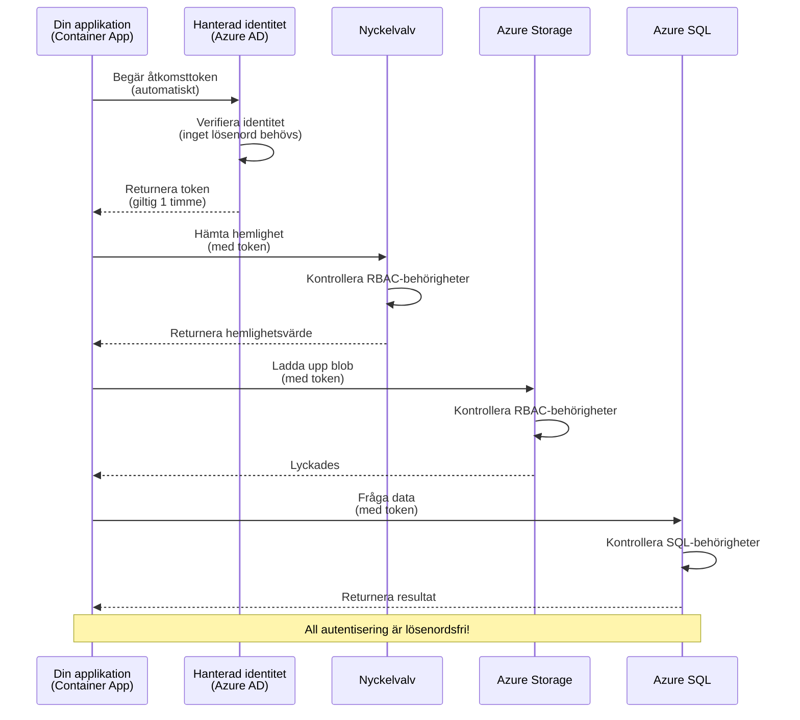
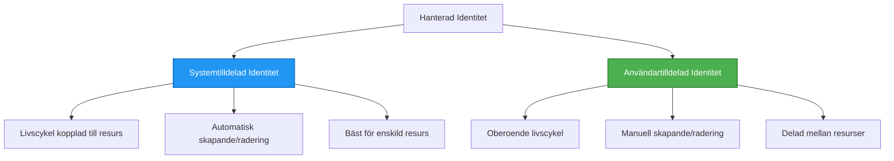

# Autentiseringsmönster och Hanterad Identitet

⏱️ **Beräknad tid**: 45-60 minuter | 💰 **Kostnadseffekt**: Gratis (inga extra avgifter) | ⭐ **Komplexitet**: Medel

**📚 Lärandebana:**
- ← Föregående: [Konfigurationshantering](configuration.md) - Hantering av miljövariabler och hemligheter
- 🎯 **Du är här**: Autentisering & Säkerhet (Hanterad identitet, Key Vault, säkra mönster)
- → Nästa: [Första projektet](first-project.md) - Bygg din första AZD-applikation
- 🏠 [Kursens startsida](../../README.md)

---

## Vad du kommer att lära dig

Genom att slutföra denna lektion kommer du:
- Förstå Azure-autentiseringsmönster (nycklar, anslutningssträngar, hanterad identitet)
- Implementera **Hanterad Identitet** för lösenordslös autentisering
- Skydda hemligheter med **Azure Key Vault**-integration
- Konfigurera **rollbaserad åtkomstkontroll (RBAC)** för AZD-distributioner
- Tillämpa säkerhetsbästa praxis i Container Apps och Azure-tjänster
- Migrera från nyckelbaserad till identitetsbaserad autentisering

## Varför hanterad identitet är viktig

### Problemet: Traditionell autentisering

**Före hanterad identitet:**
```javascript
// ❌ SÄKERHETSRISK: Hårdkodade hemligheter i kod
const connectionString = "Server=mydb.database.windows.net;User=admin;Password=P@ssw0rd123";
const storageKey = "xK7mN9pQ2wR5tY8uI0oP3aS6dF1gH4jK...";
const cosmosKey = "C2x7B9n4M1p8Q5w3E6r0T2y5U8i1O4p7...";
```

**Problem:**
- 🔴 **Exponerade hemligheter** i kod, konfigurationsfiler, miljövariabler
- 🔴 **Credential rotation** kräver kodändringar och omdistribution
- 🔴 **Revisionsmardrömmar** - vem åtkomstade vad, när?
- 🔴 **Spridning** - hemligheter utspridda över flera system
- 🔴 **Efterlevnadsrisker** - misslyckas med säkerhetsrevisioner

### Lösningen: Hanterad identitet

**Efter hanterad identitet:**
```javascript
// ✅ SÄKER: Inga hemligheter i koden
const credential = new DefaultAzureCredential();
const client = new BlobServiceClient(
  "https://mystorageaccount.blob.core.windows.net",
  credential  // Azure hanterar autentisering automatiskt
);
```

**Fördelar:**
- ✅ **Inga hemligheter** i kod eller konfiguration
- ✅ **Automatisk rotation** - Azure hanterar det
- ✅ **Fullständig revisionsspårning** i Azure AD-loggar
- ✅ **Centraliserad säkerhet** - hantera i Azure Portal
- ✅ **Efterlevnadsredo** - uppfyller säkerhetsstandarder

**Liknelse**: Traditionell autentisering är som att bära flera fysiska nycklar för olika dörrar. Hanterad identitet är som att ha en säkerhetsbricka som automatiskt ger åtkomst baserat på vem du är—inga nycklar att tappa, kopiera eller rotera.

---

## Arkitekturöversikt

### Autentiseringsflöde med hanterad identitet


### Typer av hanterade identiteter


| Funktion | Systemtilldelad | Användartilldelad |
|----------|-----------------|-------------------|
| **Livscykel** | Bundet till resurs | Oberoende |
| **Skapande** | Automatiskt med resurs | Manuellt skapande |
| **Radering** | Raderas med resurs | Består efter resursradering |
| **Delning** | Endast en resurs | Flera resurser |
| **Användningsfall** | Enkla scenarier | Komplexa scenarier med flera resurser |
| **AZD-standard** | ✅ Rekommenderas | Valfritt |

---

## Förutsättningar

### Nödvändiga verktyg

Du bör redan ha dessa installerade från tidigare lektioner:

```bash
# Verifiera Azure Developer CLI
azd version
# ✅ Förväntat: azd version 1.0.0 eller högre

# Verifiera Azure CLI
az --version
# ✅ Förväntat: azure-cli 2.50.0 eller högre
```

### Azure-krav

- Aktiv Azure-prenumeration
- Behörigheter att:
  - Skapa hanterade identiteter
  - Tilldela RBAC-roller
  - Skapa Key Vault-resurser
  - Distribuera Container Apps

### Kunskapsförutsättningar

Du bör ha slutfört:
- [Installationsguide](installation.md) - AZD-setup
- [AZD-grunder](azd-basics.md) - Grundläggande koncept
- [Konfigurationshantering](configuration.md) - Miljövariabler

---

## Lektion 1: Förstå autentiseringsmönster

### Mönster 1: Anslutningssträngar (Legacy - Undvik)

**Hur det fungerar:**
```bash
# Anslutningssträngen innehåller autentiseringsuppgifter
STORAGE_CONNECTION_STRING="DefaultEndpointsProtocol=https;AccountName=myaccount;AccountKey=xK7mN9pQ2wR5..."
COSMOS_CONNECTION_STRING="AccountEndpoint=https://myaccount.documents.azure.com:443/;AccountKey=C2x7..."
SQL_CONNECTION_STRING="Server=myserver.database.windows.net;User=admin;Password=P@ssw0rd..."
```

**Problem:**
- ❌ Hemligheter synliga i miljövariabler
- ❌ Loggas i distributionssystem
- ❌ Svårt att rotera
- ❌ Ingen revisionsspårning av åtkomst

**När ska det användas:** Endast för lokal utveckling, aldrig produktion.

---

### Mönster 2: Key Vault-referenser (Bättre)

**Hur det fungerar:**
```bicep
// Store secret in Key Vault
resource keyVault 'Microsoft.KeyVault/vaults@2023-02-01' = {
  name: 'mykv'
  properties: {
    enableRbacAuthorization: true
  }
}

// Reference in Container App
env: [
  {
    name: 'STORAGE_KEY'
    secretRef: 'storage-key'  // References Key Vault
  }
]
```

**Fördelar:**
- ✅ Hemligheter lagras säkert i Key Vault
- ✅ Centraliserad hantering av hemligheter
- ✅ Rotation utan kodändringar

**Begränsningar:**
- ⚠️ Fortfarande användning av nycklar/lösenord
- ⚠️ Behöver hantera åtkomst till Key Vault

**När ska det användas:** Övergångssteg från anslutningssträngar till hanterad identitet.

---

### Mönster 3: Hanterad identitet (Bästa praxis)

**Hur det fungerar:**
```bicep
// Enable managed identity
resource containerApp 'Microsoft.App/containerApps@2023-05-01' = {
  name: 'myapp'
  identity: {
    type: 'SystemAssigned'  // Automatically creates identity
  }
}

// Grant permissions
resource roleAssignment 'Microsoft.Authorization/roleAssignments@2022-04-01' = {
  scope: storageAccount
  properties: {
    roleDefinitionId: storageBlobDataContributorRole
    principalId: containerApp.identity.principalId
  }
}
```

**Applikationskod:**
```javascript
// Inga hemligheter behövs!
const { DefaultAzureCredential } = require('@azure/identity');
const { BlobServiceClient } = require('@azure/storage-blob');

const credential = new DefaultAzureCredential();
const blobServiceClient = new BlobServiceClient(
  'https://mystorageaccount.blob.core.windows.net',
  credential
);
```

**Fördelar:**
- ✅ Inga hemligheter i kod/konfiguration
- ✅ Automatisk credential rotation
- ✅ Fullständig revisionsspårning
- ✅ RBAC-baserade behörigheter
- ✅ Efterlevnadsredo

**När ska det användas:** Alltid, för produktionsapplikationer.

---

## Lektion 2: Implementera hanterad identitet med AZD

### Steg-för-steg-implementering

Låt oss bygga en säker Container App som använder hanterad identitet för att komma åt Azure Storage och Key Vault.

### Projektstruktur

```
secure-app/
├── azure.yaml                 # AZD configuration
├── infra/
│   ├── main.bicep            # Main infrastructure
│   ├── core/
│   │   ├── identity.bicep    # Managed identity setup
│   │   ├── keyvault.bicep    # Key Vault configuration
│   │   └── storage.bicep     # Storage with RBAC
│   └── app/
│       └── container-app.bicep
└── src/
    ├── app.js                # Application code
    ├── package.json
    └── Dockerfile
```

### 1. Konfigurera AZD (azure.yaml)

```yaml
name: secure-app
metadata:
  template: secure-app@1.0.0

services:
  api:
    project: ./src
    language: js
    host: containerapp

# Enable managed identity (AZD handles this automatically)
```

### 2. Infrastruktur: Aktivera hanterad identitet

**Fil: `infra/main.bicep`**

```bicep
targetScope = 'subscription'

param environmentName string
param location string = 'eastus'

var tags = { 'azd-env-name': environmentName }

// Resource group
resource rg 'Microsoft.Resources/resourceGroups@2021-04-01' = {
  name: 'rg-${environmentName}'
  location: location
  tags: tags
}

// Storage Account
module storage './core/storage.bicep' = {
  name: 'storage'
  scope: rg
  params: {
    name: 'st${uniqueString(rg.id)}'
    location: location
    tags: tags
  }
}

// Key Vault
module keyVault './core/keyvault.bicep' = {
  name: 'keyvault'
  scope: rg
  params: {
    name: 'kv-${uniqueString(rg.id)}'
    location: location
    tags: tags
  }
}

// Container App with Managed Identity
module containerApp './app/container-app.bicep' = {
  name: 'container-app'
  scope: rg
  params: {
    name: 'ca-${environmentName}'
    location: location
    tags: tags
    storageAccountName: storage.outputs.name
    keyVaultName: keyVault.outputs.name
  }
}

// Grant Container App access to Storage
module storageRoleAssignment './core/role-assignment.bicep' = {
  name: 'storage-role'
  scope: rg
  params: {
    principalId: containerApp.outputs.identityPrincipalId
    roleDefinitionId: 'ba92f5b4-2d11-453d-a403-e96b0029c9fe'  // Storage Blob Data Contributor
    targetResourceId: storage.outputs.id
  }
}

// Grant Container App access to Key Vault
module kvRoleAssignment './core/role-assignment.bicep' = {
  name: 'kv-role'
  scope: rg
  params: {
    principalId: containerApp.outputs.identityPrincipalId
    roleDefinitionId: '4633458b-17de-408a-b874-0445c86b69e6'  // Key Vault Secrets User
    targetResourceId: keyVault.outputs.id
  }
}

// Outputs
output AZURE_STORAGE_ACCOUNT_NAME string = storage.outputs.name
output AZURE_KEY_VAULT_NAME string = keyVault.outputs.name
output APP_URL string = containerApp.outputs.url
```

### 3. Container App med systemtilldelad identitet

**Fil: `infra/app/container-app.bicep`**

```bicep
param name string
param location string
param tags object = {}
param storageAccountName string
param keyVaultName string

resource containerApp 'Microsoft.App/containerApps@2023-05-01' = {
  name: name
  location: location
  tags: tags
  identity: {
    type: 'SystemAssigned'  // 🔑 Enable managed identity
  }
  properties: {
    configuration: {
      ingress: {
        external: true
        targetPort: 3000
      }
    }
    template: {
      containers: [
        {
          name: 'api'
          image: 'myregistry.azurecr.io/api:latest'
          resources: {
            cpu: json('0.5')
            memory: '1Gi'
          }
          env: [
            {
              name: 'AZURE_STORAGE_ACCOUNT_NAME'
              value: storageAccountName
            }
            {
              name: 'AZURE_KEY_VAULT_NAME'
              value: keyVaultName
            }
            // 🔑 No secrets - managed identity handles authentication!
          ]
        }
      ]
    }
  }
}

// Output the identity for RBAC assignments
output identityPrincipalId string = containerApp.identity.principalId
output id string = containerApp.id
output url string = 'https://${containerApp.properties.configuration.ingress.fqdn}'
```

### 4. RBAC-rolltilldelningsmodul

**Fil: `infra/core/role-assignment.bicep`**

```bicep
param principalId string
param roleDefinitionId string  // Azure built-in role ID
param targetResourceId string

resource roleAssignment 'Microsoft.Authorization/roleAssignments@2022-04-01' = {
  name: guid(principalId, roleDefinitionId, targetResourceId)
  scope: resourceId('Microsoft.Resources/resourceGroups', resourceGroup().name)
  properties: {
    roleDefinitionId: subscriptionResourceId('Microsoft.Authorization/roleDefinitions', roleDefinitionId)
    principalId: principalId
    principalType: 'ServicePrincipal'
  }
}

output id string = roleAssignment.id
```

### 5. Applikationskod med hanterad identitet

**Fil: `src/app.js`**

```javascript
const express = require('express');
const { DefaultAzureCredential } = require('@azure/identity');
const { BlobServiceClient } = require('@azure/storage-blob');
const { SecretClient } = require('@azure/keyvault-secrets');

const app = express();
const PORT = process.env.PORT || 3000;

// 🔑 Initiera autentiseringsuppgifter (fungerar automatiskt med hanterad identitet)
const credential = new DefaultAzureCredential();

// Azure Storage-inställning
const storageAccountName = process.env.AZURE_STORAGE_ACCOUNT_NAME;
const blobServiceClient = new BlobServiceClient(
  `https://${storageAccountName}.blob.core.windows.net`,
  credential  // Inga nycklar behövs!
);

// Key Vault-inställning
const keyVaultName = process.env.AZURE_KEY_VAULT_NAME;
const secretClient = new SecretClient(
  `https://${keyVaultName}.vault.azure.net`,
  credential  // Inga nycklar behövs!
);

// Hälsokontroll
app.get('/health', (req, res) => {
  res.json({ status: 'healthy', authentication: 'managed-identity' });
});

// Ladda upp fil till blob-lagring
app.post('/upload', async (req, res) => {
  try {
    const containerClient = blobServiceClient.getContainerClient('uploads');
    await containerClient.createIfNotExists();
    
    const blobName = `file-${Date.now()}.txt`;
    const blockBlobClient = containerClient.getBlockBlobClient(blobName);
    
    await blockBlobClient.upload('Hello from managed identity!', 30);
    
    res.json({
      success: true,
      blobName: blobName,
      message: 'File uploaded using managed identity!'
    });
  } catch (error) {
    console.error('Upload error:', error);
    res.status(500).json({ error: error.message });
  }
});

// Hämta hemlighet från Key Vault
app.get('/secret/:name', async (req, res) => {
  try {
    const secretName = req.params.name;
    const secret = await secretClient.getSecret(secretName);
    
    res.json({
      name: secretName,
      value: secret.value,
      message: 'Secret retrieved using managed identity!'
    });
  } catch (error) {
    console.error('Secret error:', error);
    res.status(500).json({ error: error.message });
  }
});

// Lista blob-behållare (demonstrerar läsbehörighet)
app.get('/containers', async (req, res) => {
  try {
    const containers = [];
    for await (const container of blobServiceClient.listContainers()) {
      containers.push(container.name);
    }
    
    res.json({
      containers: containers,
      count: containers.length,
      message: 'Containers listed using managed identity!'
    });
  } catch (error) {
    console.error('List error:', error);
    res.status(500).json({ error: error.message });
  }
});

app.listen(PORT, () => {
  console.log(`Secure API listening on port ${PORT}`);
  console.log('Authentication: Managed Identity (passwordless)');
});
```

**Fil: `src/package.json`**

```json
{
  "name": "secure-app",
  "version": "1.0.0",
  "dependencies": {
    "express": "^4.18.2",
    "@azure/identity": "^4.0.0",
    "@azure/storage-blob": "^12.17.0",
    "@azure/keyvault-secrets": "^4.7.0"
  },
  "scripts": {
    "start": "node app.js"
  }
}
```

### 6. Distribuera och testa

```bash
# Initiera AZD-miljö
azd init

# Distribuera infrastruktur och applikation
azd up

# Hämta appens URL
APP_URL=$(azd env get-values | grep APP_URL | cut -d '=' -f2 | tr -d '"')

# Testa hälsokontroll
curl $APP_URL/health
```

**✅ Förväntad output:**
```json
{
  "status": "healthy",
  "authentication": "managed-identity"
}
```

**Testa blob-uppladdning:**
```bash
curl -X POST $APP_URL/upload
```

**✅ Förväntad output:**
```json
{
  "success": true,
  "blobName": "file-1700404800000.txt",
  "message": "File uploaded using managed identity!"
}
```

**Testa containerlistning:**
```bash
curl $APP_URL/containers
```

**✅ Förväntad output:**
```json
{
  "containers": ["uploads"],
  "count": 1,
  "message": "Containers listed using managed identity!"
}
```

---

## Vanliga Azure RBAC-roller

### Inbyggda roll-ID:n för hanterad identitet

| Tjänst | Rollnamn | Roll-ID | Behörigheter |
|--------|----------|---------|--------------|
| **Storage** | Storage Blob Data Reader | `2a2b9908-6b94-4a3d-8e5a-a7d8f8cc8a12` | Läs blobar och containers |
| **Storage** | Storage Blob Data Contributor | `ba92f5b4-2d11-453d-a403-e96b0029c9fe` | Läs, skriv, ta bort blobar |
| **Storage** | Storage Queue Data Contributor | `974c5e8b-45b9-4653-ba55-5f855dd0fb88` | Läs, skriv, ta bort kömeddelanden |
| **Key Vault** | Key Vault Secrets User | `4633458b-17de-408a-b874-0445c86b69e6` | Läs hemligheter |
| **Key Vault** | Key Vault Secrets Officer | `b86a8fe4-44ce-4948-aee5-eccb2c155cd7` | Läs, skriv, ta bort hemligheter |
| **Cosmos DB** | Cosmos DB Built-in Data Reader | `00000000-0000-0000-0000-000000000001` | Läs Cosmos DB-data |
| **Cosmos DB** | Cosmos DB Built-in Data Contributor | `00000000-0000-0000-0000-000000000002` | Läs, skriv Cosmos DB-data |
| **SQL Database** | SQL DB Contributor | `9b7fa17d-e63e-47b0-bb0a-15c516ac86ec` | Hantera SQL-databaser |
| **Service Bus** | Azure Service Bus Data Owner | `090c5cfd-751d-490a-894a-3ce6f1109419` | Skicka, ta emot, hantera meddelanden |

### Hur man hittar roll-ID:n

```bash
# Lista alla inbyggda roller
az role definition list --query "[].{Name:roleName, ID:name}" --output table

# Sök efter specifik roll
az role definition list --query "[?contains(roleName, 'Storage Blob')].{Name:roleName, ID:name}" --output table

# Hämta rollinformation
az role definition list --name "Storage Blob Data Contributor"
```

---

## Praktiska övningar

### Övning 1: Aktivera hanterad identitet för befintlig app ⭐⭐ (Medel)

**Mål**: Lägg till hanterad identitet till en befintlig Container App-distribution

**Scenario**: Du har en Container App som använder anslutningssträngar. Konvertera den till hanterad identitet.

**Startpunkt**: Container App med denna konfiguration:

```bicep
// ❌ Current: Using connection string
env: [
  {
    name: 'STORAGE_CONNECTION_STRING'
    secretRef: 'storage-connection'
  }
]
```

**Steg**:

1. **Aktivera hanterad identitet i Bicep:**

```bicep
resource containerApp 'Microsoft.App/containerApps@2023-05-01' = {
  name: 'myapp'
  identity: {
    type: 'SystemAssigned'  // Add this
  }
  // ... rest of configuration
}
```

2. **Ge Storage-åtkomst:**

```bicep
// Get storage account reference
resource storageAccount 'Microsoft.Storage/storageAccounts@2023-01-01' existing = {
  name: storageAccountName
}

// Assign role
resource roleAssignment 'Microsoft.Authorization/roleAssignments@2022-04-01' = {
  name: guid(containerApp.id, 'ba92f5b4-2d11-453d-a403-e96b0029c9fe', storageAccount.id)
  scope: storageAccount
  properties: {
    roleDefinitionId: subscriptionResourceId('Microsoft.Authorization/roleDefinitions', 'ba92f5b4-2d11-453d-a403-e96b0029c9fe')
    principalId: containerApp.identity.principalId
    principalType: 'ServicePrincipal'
  }
}
```

3. **Uppdatera applikationskod:**

**Före (anslutningssträng):**
```javascript
const { BlobServiceClient } = require('@azure/storage-blob');

const blobServiceClient = BlobServiceClient.fromConnectionString(
  process.env.STORAGE_CONNECTION_STRING
);
```

**Efter (hanterad identitet):**
```javascript
const { DefaultAzureCredential } = require('@azure/identity');
const { BlobServiceClient } = require('@azure/storage-blob');

const credential = new DefaultAzureCredential();
const blobServiceClient = new BlobServiceClient(
  `https://${process.env.STORAGE_ACCOUNT_NAME}.blob.core.windows.net`,
  credential
);
```

4. **Uppdatera miljövariabler:**

```bicep
env: [
  {
    name: 'STORAGE_ACCOUNT_NAME'
    value: storageAccountName  // Just the name, no secrets!
  }
  // Remove STORAGE_CONNECTION_STRING
]
```

5. **Distribuera och testa:**

```bash
# Återutplacera
azd up

# Testa att det fortfarande fungerar
curl https://myapp.azurecontainerapps.io/upload
```

**✅ Framgångskriterier:**
- ✅ Applikationen distribueras utan fel
- ✅ Storage-operationer fungerar (uppladdning, listning, nedladdning)
- ✅ Inga anslutningssträngar i miljövariabler
- ✅ Identitet synlig i Azure Portal under "Identitet"-bladet

**Verifiering:**

```bash
# Kontrollera att hanterad identitet är aktiverad
az containerapp show \
  --name myapp \
  --resource-group rg-myapp \
  --query "identity.type"
# ✅ Förväntat: "SystemAssigned"

# Kontrollera rolltilldelning
az role assignment list \
  --assignee $(az containerapp show --name myapp --resource-group rg-myapp --query "identity.principalId" -o tsv) \
  --scope /subscriptions/{sub-id}/resourceGroups/rg-myapp/providers/Microsoft.Storage/storageAccounts/mystorageaccount
# ✅ Förväntat: Visar rollen "Storage Blob Data Contributor"
```

**Tid**: 20-30 minuter

---

### Övning 2: Multi-tjänståtkomst med användartilldelad identitet ⭐⭐⭐ (Avancerad)

**Mål**: Skapa en användartilldelad identitet som delas mellan flera Container Apps

**Scenario**: Du har 3 mikrotjänster som alla behöver åtkomst till samma Storage-konto och Key Vault.

**Steg**:

1. **Skapa användartilldelad identitet:**

**Fil: `infra/core/identity.bicep`**

```bicep
param name string
param location string
param tags object = {}

resource userAssignedIdentity 'Microsoft.ManagedIdentity/userAssignedIdentities@2023-01-31' = {
  name: name
  location: location
  tags: tags
}

output id string = userAssignedIdentity.id
output principalId string = userAssignedIdentity.properties.principalId
output clientId string = userAssignedIdentity.properties.clientId
```

2. **Tilldela roller till användartilldelad identitet:**

```bicep
// In main.bicep
module userIdentity './core/identity.bicep' = {
  name: 'user-identity'
  scope: rg
  params: {
    name: 'id-${environmentName}'
    location: location
    tags: tags
  }
}

// Grant Storage access
resource storageRoleAssignment 'Microsoft.Authorization/roleAssignments@2022-04-01' = {
  name: guid(userIdentity.outputs.principalId, 'storage-contributor')
  scope: storageAccount
  properties: {
    roleDefinitionId: subscriptionResourceId('Microsoft.Authorization/roleDefinitions', 'ba92f5b4-2d11-453d-a403-e96b0029c9fe')
    principalId: userIdentity.outputs.principalId
    principalType: 'ServicePrincipal'
  }
}

// Grant Key Vault access
resource kvRoleAssignment 'Microsoft.Authorization/roleAssignments@2022-04-01' = {
  name: guid(userIdentity.outputs.principalId, 'kv-secrets-user')
  scope: keyVault
  properties: {
    roleDefinitionId: subscriptionResourceId('Microsoft.Authorization/roleDefinitions', '4633458b-17de-408a-b874-0445c86b69e6')
    principalId: userIdentity.outputs.principalId
    principalType: 'ServicePrincipal'
  }
}
```

3. **Tilldela identitet till flera Container Apps:**

```bicep
resource apiGateway 'Microsoft.App/containerApps@2023-05-01' = {
  name: 'api-gateway'
  identity: {
    type: 'UserAssigned'
    userAssignedIdentities: {
      '${userIdentity.outputs.id}': {}
    }
  }
  // ... rest of config
}

resource productService 'Microsoft.App/containerApps@2023-05-01' = {
  name: 'product-service'
  identity: {
    type: 'UserAssigned'
    userAssignedIdentities: {
      '${userIdentity.outputs.id}': {}
    }
  }
  // ... rest of config
}

resource orderService 'Microsoft.App/containerApps@2023-05-01' = {
  name: 'order-service'
  identity: {
    type: 'UserAssigned'
    userAssignedIdentities: {
      '${userIdentity.outputs.id}': {}
    }
  }
  // ... rest of config
}
```

4. **Applikationskod (alla tjänster använder samma mönster):**

```javascript
const { DefaultAzureCredential, ManagedIdentityCredential } = require('@azure/identity');

// För användartilldelad identitet, ange klient-ID
const credential = new ManagedIdentityCredential(
  process.env.AZURE_CLIENT_ID  // Klient-ID för användartilldelad identitet
);

// Eller använd DefaultAzureCredential (auto-detekterar)
const credential = new DefaultAzureCredential();

const blobServiceClient = new BlobServiceClient(
  `https://${process.env.STORAGE_ACCOUNT_NAME}.blob.core.windows.net`,
  credential
);
```

5. **Distribuera och verifiera:**

```bash
azd up

# Testa att alla tjänster kan komma åt lagring
curl https://api-gateway.azurecontainerapps.io/upload
curl https://product-service.azurecontainerapps.io/upload
curl https://order-service.azurecontainerapps.io/upload
```

**✅ Framgångskriterier:**
- ✅ En identitet delas mellan 3 tjänster
- ✅ Alla tjänster kan komma åt Storage och Key Vault
- ✅ Identiteten består om du tar bort en tjänst
- ✅ Centraliserad behörighetshantering

**Fördelar med användartilldelad identitet:**
- En identitet att hantera
- Konsekventa behörigheter mellan tjänster
- Överlever tjänstradering
- Bättre för komplexa arkitekturer

**Tid**: 30-40 minuter

---

### Övning 3: Implementera Key Vault-hemlighetsrotation ⭐⭐⭐ (Avancerad)

**Mål**: Lagra API-nycklar från tredje part i Key Vault och komma åt dem med hanterad identitet

**Scenario**: Din app behöver anropa en extern API (OpenAI, Stripe, SendGrid) som kräver API-nycklar.

**Steg**:

1. **Skapa Key Vault med RBAC:**

**Fil: `infra/core/keyvault.bicep`**

```bicep
param name string
param location string
param tags object = {}

resource keyVault 'Microsoft.KeyVault/vaults@2023-02-01' = {
  name: name
  location: location
  tags: tags
  properties: {
    enableRbacAuthorization: true  // Use RBAC instead of access policies
    sku: {
      family: 'A'
      name: 'standard'
    }
    tenantId: subscription().tenantId
    enableSoftDelete: true
    softDeleteRetentionInDays: 90
  }
}

// Allow Container App to read secrets
output id string = keyVault.id
output name string = keyVault.name
output uri string = keyVault.properties.vaultUri
```

2. **Lagra hemligheter i Key Vault:**

```bash
# Hämta Key Vault-namn
KV_NAME=$(azd env get-values | grep AZURE_KEY_VAULT_NAME | cut -d '=' -f2 | tr -d '"')

# Lagra API-nycklar från tredje part
az keyvault secret set \
  --vault-name $KV_NAME \
  --name "OpenAI-ApiKey" \
  --value "sk-proj-xxxxxxxxxxxxx"

az keyvault secret set \
  --vault-name $KV_NAME \
  --name "Stripe-ApiKey" \
  --value "sk_live_xxxxxxxxxxxxx"

az keyvault secret set \
  --vault-name $KV_NAME \
  --name "SendGrid-ApiKey" \
  --value "SG.xxxxxxxxxxxxx"
```

3. **Applikationskod för att hämta hemligheter:**

**Fil: `src/config.js`**

```javascript
const { DefaultAzureCredential } = require('@azure/identity');
const { SecretClient } = require('@azure/keyvault-secrets');

class Config {
  constructor() {
    this.credential = new DefaultAzureCredential();
    this.secretClient = new SecretClient(
      `https://${process.env.AZURE_KEY_VAULT_NAME}.vault.azure.net`,
      this.credential
    );
    this.cache = {};
  }

  async getSecret(secretName) {
    // Kontrollera cache först
    if (this.cache[secretName]) {
      return this.cache[secretName];
    }

    try {
      const secret = await this.secretClient.getSecret(secretName);
      this.cache[secretName] = secret.value;
      console.log(`✅ Retrieved secret: ${secretName}`);
      return secret.value;
    } catch (error) {
      console.error(`❌ Failed to get secret ${secretName}:`, error.message);
      throw error;
    }
  }

  async getOpenAIKey() {
    return this.getSecret('OpenAI-ApiKey');
  }

  async getStripeKey() {
    return this.getSecret('Stripe-ApiKey');
  }

  async getSendGridKey() {
    return this.getSecret('SendGrid-ApiKey');
  }
}

module.exports = new Config();
```

4. **Använd hemligheter i applikationen:**

**Fil: `src/app.js`**

```javascript
const express = require('express');
const config = require('./config');
const { OpenAI } = require('openai');

const app = express();

// Initiera OpenAI med nyckel från Key Vault
let openaiClient;

async function initializeServices() {
  const openaiKey = await config.getOpenAIKey();
  openaiClient = new OpenAI({ apiKey: openaiKey });
  console.log('✅ Services initialized with secrets from Key Vault');
}

// Anropa vid start
initializeServices().catch(console.error);

app.post('/chat', async (req, res) => {
  try {
    const completion = await openaiClient.chat.completions.create({
      model: 'gpt-4',
      messages: [{ role: 'user', content: 'Hello!' }]
    });
    
    res.json({
      response: completion.choices[0].message.content,
      authentication: 'Key from Key Vault via Managed Identity'
    });
  } catch (error) {
    res.status(500).json({ error: error.message });
  }
});

app.listen(3000, () => {
  console.log('Secure API with Key Vault integration running');
});
```

5. **Distribuera och testa:**

```bash
azd up

# Testa att API-nycklar fungerar
curl -X POST https://myapp.azurecontainerapps.io/chat \
  -H "Content-Type: application/json" \
  -d '{"message":"Hello AI"}'
```

**✅ Framgångskriterier:**
- ✅ Inga API-nycklar i kod eller miljövariabler
- ✅ Applikationen hämtar nycklar från Key Vault
- ✅ Tredjeparts-API:er fungerar korrekt
- ✅ Kan rotera nycklar utan kodändringar

**Rotera en hemlighet:**

```bash
# Uppdatera hemlighet i Key Vault
az keyvault secret set \
  --vault-name $KV_NAME \
  --name "OpenAI-ApiKey" \
  --value "sk-proj-NEW_KEY_HERE"

# Starta om appen för att hämta nyckeln
az containerapp revision restart \
  --name myapp \
  --resource-group rg-myapp
```

**Tid**: 25-35 minuter

---

## Kunskapskontroll

### 1. Autentiseringsmönster ✓

Testa din förståelse:

- [ ] **Q1**: Vilka är de tre huvudsakliga autentiseringsmönstren? 
  - **A**: Anslutningssträngar (legacy), Key Vault-referenser (övergång), Hanterad identitet (bäst)

- [ ] **Q2**: Varför är hanterad identitet bättre än anslutningssträngar?
  - **A**: Inga hemligheter i kod, automatisk rotation, fullständig revisionsspårning, RBAC-behörigheter

- [ ] **Q3**: När skulle du använda användartilldelad identitet istället för systemtilldelad?
  - **A**: När identiteten delas mellan flera resurser eller när identitetens livscykel är oberoende av resursens livscykel

**Praktisk verifiering:**
```bash
# Kontrollera vilken typ av identitet din app använder
az containerapp show \
  --name myapp \
  --resource-group rg-myapp \
  --query "identity.type"

# Lista alla rolltilldelningar för identiteten
az role assignment list \
  --assignee $(az containerapp show --name myapp --resource-group rg-myapp --query "identity.principalId" -o tsv)
```

---

### 2. RBAC och behörigheter ✓

Testa din förståelse:

- [ ] **Q1**: Vad är roll-ID:t för "Storage Blob Data Contributor"?
  - **A**: `ba92f5b4-2d11-453d-a403-e96b0029c9fe`

- [ ] **Q2**: Vilka behörigheter ger "Key Vault Secrets User"?
  - **A**: Läsbehörighet för hemligheter (kan inte skapa, uppdatera eller ta bort)

- [ ] **Q3**: Hur ger du en Container App åtkomst till Azure SQL?
  - **A**: Tilldela rollen "SQL DB Contributor" eller konfigurera Azure AD-autentisering för SQL

**Praktisk verifiering:**
```bash
# Hitta specifik roll
az role definition list --name "Storage Blob Data Contributor"

# Kontrollera vilka roller som är tilldelade din identitet
PRINCIPAL_ID=$(az containerapp show --name myapp --resource-group rg-myapp --query "identity.principalId" -o tsv)
az role assignment list --assignee $PRINCIPAL_ID --output table
```

---

### 3. Key Vault-integration ✓

Testa din förståelse:
- [ ] **Q1**: Hur aktiverar du RBAC för Key Vault istället för åtkomstpolicyer?
  - **A**: Ställ in `enableRbacAuthorization: true` i Bicep

- [ ] **Q2**: Vilket Azure SDK-bibliotek hanterar autentisering med hanterad identitet?
  - **A**: `@azure/identity` med klassen `DefaultAzureCredential`

- [ ] **Q3**: Hur länge stannar Key Vault-hemligheter i cacheminnet?
  - **A**: Beroende på applikationen; implementera din egen cachestrategi

**Praktisk Verifiering:**
```bash
# Testa åtkomst till Key Vault
az keyvault secret show \
  --vault-name $KV_NAME \
  --name "OpenAI-ApiKey" \
  --query "value"

# Kontrollera att RBAC är aktiverat
az keyvault show \
  --name $KV_NAME \
  --query "properties.enableRbacAuthorization"
# ✅ Förväntat: sant
```

---

## Säkerhetsbästa praxis

### ✅ GÖR:

1. **Använd alltid hanterad identitet i produktion**
   ```bicep
   identity: {
     type: 'SystemAssigned'
   }
   ```

2. **Använd RBAC-roller med minst privilegier**
   - Använd "Reader"-roller när det är möjligt
   - Undvik "Owner" eller "Contributor" om det inte är nödvändigt

3. **Lagra tredjepartsnycklar i Key Vault**
   ```javascript
   const apiKey = await secretClient.getSecret('ThirdPartyApiKey');
   ```

4. **Aktivera granskningsloggning**
   ```bicep
   diagnosticSettings: {
     logs: [{ category: 'AuditEvent', enabled: true }]
   }
   ```

5. **Använd olika identiteter för utveckling/staging/produktion**
   ```bash
   azd env new dev
   azd env new staging
   azd env new prod
   ```

6. **Rotera hemligheter regelbundet**
   - Ställ in utgångsdatum för Key Vault-hemligheter
   - Automatisera rotation med Azure Functions

### ❌ GÖR INTE:

1. **Hårdkoda aldrig hemligheter**
   ```javascript
   // ❌ DÅLIG
   const apiKey = "sk-proj-xxxxxxxxxxxxx";
   ```

2. **Använd inte anslutningssträngar i produktion**
   ```javascript
   // ❌ DÅLIGT
   BlobServiceClient.fromConnectionString(process.env.STORAGE_CONNECTION_STRING)
   ```

3. **Ge inte överdrivna behörigheter**
   ```bicep
   // ❌ BAD - too much access
   roleDefinitionId: 'Owner'
   
   // ✅ GOOD - least privilege
   roleDefinitionId: 'Storage Blob Data Reader'
   ```

4. **Logga inte hemligheter**
   ```javascript
   // ❌ DÅLIGT
   console.log('API Key:', apiKey);
   
   // ✅ BRA
   console.log('API Key retrieved successfully');
   ```

5. **Dela inte produktionsidentiteter mellan miljöer**
   ```bicep
   // ❌ BAD - same identity for dev and prod
   // ✅ GOOD - separate identities per environment
   ```

---

## Felsökningsguide

### Problem: "Unauthorized" vid åtkomst till Azure Storage

**Symptom:**
```
Error: Unauthorized (403)
AuthorizationPermissionMismatch: This request is not authorized to perform this operation
```

**Diagnos:**

```bash
# Kontrollera om hanterad identitet är aktiverad
az containerapp show \
  --name myapp \
  --resource-group rg-myapp \
  --query "identity.type"
# ✅ Förväntat: "SystemAssigned" eller "UserAssigned"

# Kontrollera rolltilldelningar
PRINCIPAL_ID=$(az containerapp show --name myapp --resource-group rg-myapp --query "identity.principalId" -o tsv)
az role assignment list --assignee $PRINCIPAL_ID

# Förväntat: Bör se "Storage Blob Data Contributor" eller liknande roll
```

**Lösningar:**

1. **Tilldela korrekt RBAC-roll:**
```bash
STORAGE_ID=$(az storage account show --name mystorageaccount --resource-group rg-myapp --query "id" -o tsv)
az role assignment create \
  --assignee $PRINCIPAL_ID \
  --role "Storage Blob Data Contributor" \
  --scope $STORAGE_ID
```

2. **Vänta på spridning (kan ta 5-10 minuter):**
```bash
# Kontrollera status för rolltilldelning
az role assignment list --assignee $PRINCIPAL_ID --scope $STORAGE_ID
```

3. **Verifiera att applikationskoden använder rätt autentiseringsuppgifter:**
```javascript
// Se till att du använder DefaultAzureCredential
const credential = new DefaultAzureCredential();
```

---

### Problem: Åtkomst till Key Vault nekas

**Symptom:**
```
Error: Forbidden (403)
The user, group or application does not have secrets get permission
```

**Diagnos:**

```bash
# Kontrollera att Key Vault RBAC är aktiverat
az keyvault show \
  --name $KV_NAME \
  --query "properties.enableRbacAuthorization"
# ✅ Förväntat: sant

# Kontrollera rolltilldelningar
az role assignment list \
  --assignee $PRINCIPAL_ID \
  --scope /subscriptions/{sub-id}/resourceGroups/rg-myapp/providers/Microsoft.KeyVault/vaults/$KV_NAME
```

**Lösningar:**

1. **Aktivera RBAC på Key Vault:**
```bash
az keyvault update \
  --name $KV_NAME \
  --enable-rbac-authorization true
```

2. **Tilldela rollen Key Vault Secrets User:**
```bash
KV_ID=$(az keyvault show --name $KV_NAME --query "id" -o tsv)
az role assignment create \
  --assignee $PRINCIPAL_ID \
  --role "Key Vault Secrets User" \
  --scope $KV_ID
```

---

### Problem: DefaultAzureCredential fungerar inte lokalt

**Symptom:**
```
Error: DefaultAzureCredential failed to retrieve a token
CredentialUnavailableError: No credential available
```

**Diagnos:**

```bash
# Kontrollera om du är inloggad
az account show

# Kontrollera Azure CLI-autentisering
az ad signed-in-user show
```

**Lösningar:**

1. **Logga in på Azure CLI:**
```bash
az login
```

2. **Ställ in Azure-prenumeration:**
```bash
az account set --subscription "Your Subscription Name"
```

3. **För lokal utveckling, använd miljövariabler:**
```bash
export AZURE_TENANT_ID="your-tenant-id"
export AZURE_CLIENT_ID="your-client-id"
export AZURE_CLIENT_SECRET="your-client-secret"
```

4. **Eller använd en annan autentisering lokalt:**
```javascript
const { DefaultAzureCredential, AzureCliCredential } = require('@azure/identity');

// Använd AzureCliCredential för lokal utveckling
const credential = process.env.NODE_ENV === 'production' 
  ? new DefaultAzureCredential()
  : new AzureCliCredential();
```

---

### Problem: Rolltilldelning tar för lång tid att sprida

**Symptom:**
- Roll tilldelad framgångsrikt
- Fortfarande 403-fel
- Intermittent åtkomst (fungerar ibland, ibland inte)

**Förklaring:**
Ändringar i Azure RBAC kan ta 5-10 minuter att sprida globalt.

**Lösning:**

```bash
# Vänta och försök igen
echo "Waiting for RBAC propagation..."
sleep 300  # Vänta 5 minuter

# Testa åtkomst
curl https://myapp.azurecontainerapps.io/upload

# Om det fortfarande misslyckas, starta om appen
az containerapp revision restart \
  --name myapp \
  --resource-group rg-myapp
```

---

## Kostnadsöverväganden

### Kostnader för hanterad identitet

| Resurs | Kostnad |
|--------|---------|
| **Hanterad identitet** | 🆓 **GRATIS** - Ingen kostnad |
| **RBAC-rolltilldelningar** | 🆓 **GRATIS** - Ingen kostnad |
| **Azure AD-tokenförfrågningar** | 🆓 **GRATIS** - Ingår |
| **Key Vault-operationer** | $0.03 per 10,000 operationer |
| **Key Vault-lagring** | $0.024 per hemlighet per månad |

**Hanterad identitet sparar pengar genom att:**
- ✅ Eliminera Key Vault-operationer för tjänst-till-tjänst-autentisering
- ✅ Minska säkerhetsincidenter (inga läckta autentiseringsuppgifter)
- ✅ Minska operativt arbete (ingen manuell rotation)

**Exempel på kostnadsjämförelse (månatlig):**

| Scenario | Anslutningssträngar | Hanterad identitet | Besparingar |
|----------|---------------------|--------------------|-------------|
| Liten app (1M förfrågningar) | ~$50 (Key Vault + operationer) | ~$0 | $50/månad |
| Medelstor app (10M förfrågningar) | ~$200 | ~$0 | $200/månad |
| Stor app (100M förfrågningar) | ~$1,500 | ~$0 | $1,500/månad |

---

## Läs mer

### Officiell dokumentation
- [Azure Managed Identity](https://learn.microsoft.com/entra/identity/managed-identities-azure-resources/overview)
- [Azure RBAC](https://learn.microsoft.com/azure/role-based-access-control/overview)
- [Azure Key Vault](https://learn.microsoft.com/azure/key-vault/general/overview)
- [DefaultAzureCredential](https://learn.microsoft.com/dotnet/api/azure.identity.defaultazurecredential)

### SDK-dokumentation
- [@azure/identity (Node.js)](https://www.npmjs.com/package/@azure/identity)
- [Azure.Identity (C#)](https://www.nuget.org/packages/Azure.Identity/)
- [azure-identity (Python)](https://pypi.org/project/azure-identity/)

### Nästa steg i kursen
- ← Föregående: [Konfigurationshantering](configuration.md)
- → Nästa: [Första projektet](first-project.md)
- 🏠 [Kursens startsida](../../README.md)

### Relaterade exempel
- [Azure OpenAI Chat Exempel](../../../../examples/azure-openai-chat) - Använder hanterad identitet för Azure OpenAI
- [Mikrotjänster Exempel](../../../../examples/microservices) - Autentiseringsmönster för flera tjänster

---

## Sammanfattning

**Du har lärt dig:**
- ✅ Tre autentiseringsmönster (anslutningssträngar, Key Vault, hanterad identitet)
- ✅ Hur man aktiverar och konfigurerar hanterad identitet i AZD
- ✅ RBAC-rolltilldelningar för Azure-tjänster
- ✅ Key Vault-integrering för tredjepartshemligheter
- ✅ Användar- och systemtilldelade identiteter
- ✅ Säkerhetsbästa praxis och felsökning

**Viktiga insikter:**
1. **Använd alltid hanterad identitet i produktion** - Inga hemligheter, automatisk rotation
2. **Använd RBAC-roller med minst privilegier** - Ge endast nödvändiga behörigheter
3. **Lagra tredjepartsnycklar i Key Vault** - Centraliserad hantering av hemligheter
4. **Separera identiteter per miljö** - Isolering för utveckling, staging och produktion
5. **Aktivera granskningsloggning** - Spåra vem som har åtkomst till vad

**Nästa steg:**
1. Slutför de praktiska övningarna ovan
2. Migrera en befintlig app från anslutningssträngar till hanterad identitet
3. Bygg ditt första AZD-projekt med säkerhet från dag ett: [Första projektet](first-project.md)

---

<!-- CO-OP TRANSLATOR DISCLAIMER START -->
**Ansvarsfriskrivning**:  
Detta dokument har översatts med hjälp av AI-översättningstjänsten [Co-op Translator](https://github.com/Azure/co-op-translator). Även om vi strävar efter noggrannhet, bör det noteras att automatiserade översättningar kan innehålla fel eller felaktigheter. Det ursprungliga dokumentet på dess ursprungliga språk bör betraktas som den auktoritativa källan. För kritisk information rekommenderas professionell mänsklig översättning. Vi ansvarar inte för eventuella missförstånd eller feltolkningar som uppstår vid användning av denna översättning.
<!-- CO-OP TRANSLATOR DISCLAIMER END -->