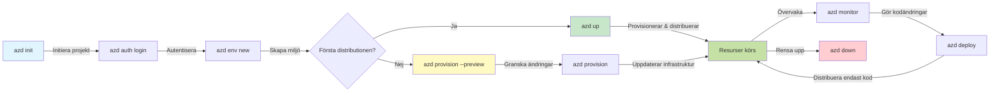
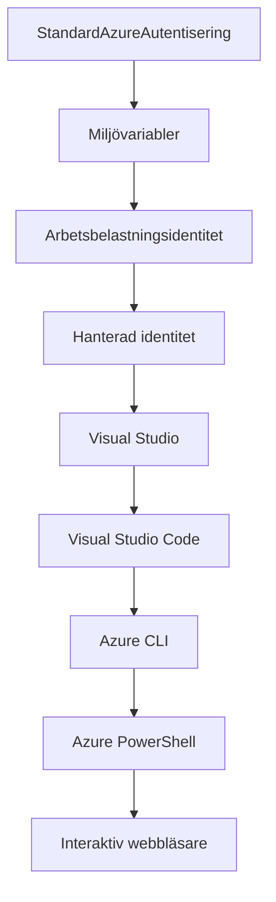

# AZD Grunder - Förstå Azure Developer CLI

# AZD Grunder - Kärnkoncept och Grundläggande

**Kapitelnavigation:**
- **📚 Kursens startsida**: [AZD För Nybörjare](../../README.md)
- **📖 Nuvarande kapitel**: Kapitel 1 - Grundläggande & Snabbstart
- **⬅️ Föregående**: [Kursöversikt](../../README.md#-chapter-1-foundation--quick-start)
- **➡️ Nästa**: [Installation & Konfiguration](installation.md)
- **🚀 Nästa kapitel**: [Kapitel 2: AI-Driven Utveckling](../microsoft-foundry/microsoft-foundry-integration.md)

## Introduktion

Den här lektionen introducerar dig till Azure Developer CLI (azd), ett kraftfullt kommandoradsverktyg som påskyndar din resa från lokal utveckling till Azure-distribution. Du kommer att lära dig de grundläggande koncepten, kärnfunktionerna och förstå hur azd förenklar distributionen av molnbaserade applikationer.

## Lärandemål

I slutet av denna lektion kommer du att:
- Förstå vad Azure Developer CLI är och dess huvudsakliga syfte
- Lära dig kärnkoncepten kring mallar, miljöer och tjänster
- Utforska nyckelfunktioner som mallbaserad utveckling och Infrastructure as Code
- Förstå azd-projektstrukturen och arbetsflödet
- Vara redo att installera och konfigurera azd för din utvecklingsmiljö

## Läranderesultat

Efter att ha avslutat denna lektion kommer du att kunna:
- Förklara azds roll i moderna molnutvecklingsarbetsflöden
- Identifiera komponenterna i en azd-projektstruktur
- Beskriva hur mallar, miljöer och tjänster samverkar
- Förstå fördelarna med Infrastructure as Code med azd
- Känna igen olika azd-kommandon och deras syften

## Vad är Azure Developer CLI (azd)?

Azure Developer CLI (azd) är ett kommandoradsverktyg som är utformat för att påskynda din resa från lokal utveckling till Azure-distribution. Det förenklar processen att bygga, distribuera och hantera molnbaserade applikationer på Azure.

### 🎯 Varför använda AZD? En verklig jämförelse

Låt oss jämföra distributionen av en enkel webbapplikation med databas:

#### ❌ UTAN AZD: Manuell Azure-distribution (30+ minuter)

```bash
# Steg 1: Skapa resursgrupp
az group create --name myapp-rg --location eastus

# Steg 2: Skapa App Service Plan
az appservice plan create --name myapp-plan \
  --resource-group myapp-rg \
  --sku B1 --is-linux

# Steg 3: Skapa Web App
az webapp create --name myapp-web-unique123 \
  --resource-group myapp-rg \
  --plan myapp-plan \
  --runtime "NODE:18-lts"

# Steg 4: Skapa Cosmos DB-konto (10-15 minuter)
az cosmosdb create --name myapp-cosmos-unique123 \
  --resource-group myapp-rg \
  --kind MongoDB

# Steg 5: Skapa databas
az cosmosdb mongodb database create \
  --account-name myapp-cosmos-unique123 \
  --resource-group myapp-rg \
  --name tododb

# Steg 6: Skapa samling
az cosmosdb mongodb collection create \
  --account-name myapp-cosmos-unique123 \
  --resource-group myapp-rg \
  --database-name tododb \
  --name todos

# Steg 7: Hämta anslutningssträng
CONN_STR=$(az cosmosdb keys list \
  --name myapp-cosmos-unique123 \
  --resource-group myapp-rg \
  --type connection-strings \
  --query "connectionStrings[0].connectionString" -o tsv)

# Steg 8: Konfigurera appinställningar
az webapp config appsettings set \
  --name myapp-web-unique123 \
  --resource-group myapp-rg \
  --settings MONGODB_URI="$CONN_STR"

# Steg 9: Aktivera loggning
az webapp log config --name myapp-web-unique123 \
  --resource-group myapp-rg \
  --application-logging filesystem \
  --detailed-error-messages true

# Steg 10: Ställ in Application Insights
az monitor app-insights component create \
  --app myapp-insights \
  --location eastus \
  --resource-group myapp-rg

# Steg 11: Länka App Insights till Web App
INSTRUMENTATION_KEY=$(az monitor app-insights component show \
  --app myapp-insights \
  --resource-group myapp-rg \
  --query "instrumentationKey" -o tsv)

az webapp config appsettings set \
  --name myapp-web-unique123 \
  --resource-group myapp-rg \
  --settings APPINSIGHTS_INSTRUMENTATIONKEY="$INSTRUMENTATION_KEY"

# Steg 12: Bygg applikationen lokalt
npm install
npm run build

# Steg 13: Skapa distributionspaket
zip -r app.zip . -x "*.git*" "node_modules/*"

# Steg 14: Distribuera applikationen
az webapp deployment source config-zip \
  --resource-group myapp-rg \
  --name myapp-web-unique123 \
  --src app.zip

# Steg 15: Vänta och hoppas att det fungerar 🙏
# (Ingen automatisk validering, manuell testning krävs)
```

**Problem:**
- ❌ 15+ kommandon att komma ihåg och köra i rätt ordning
- ❌ 30-45 minuters manuellt arbete
- ❌ Lätt att göra misstag (felstavningar, fel parametrar)
- ❌ Anslutningssträngar exponeras i terminalhistoriken
- ❌ Ingen automatisk återställning om något går fel
- ❌ Svårt att replikera för teammedlemmar
- ❌ Olika varje gång (inte reproducerbart)

#### ✅ MED AZD: Automatiserad distribution (5 kommandon, 10-15 minuter)

```bash
# Steg 1: Initiera från mall
azd init --template todo-nodejs-mongo

# Steg 2: Autentisera
azd auth login

# Steg 3: Skapa miljö
azd env new dev

# Steg 4: Förhandsgranska ändringar (valfritt men rekommenderat)
azd provision --preview

# Steg 5: Distribuera allt
azd up

# ✨ Klart! Allt är distribuerat, konfigurerat och övervakat
```

**Fördelar:**
- ✅ **5 kommandon** jämfört med 15+ manuella steg
- ✅ **10-15 minuter** total tid (mest väntan på Azure)
- ✅ **Inga fel** - automatiserat och testat
- ✅ **Hemligheter hanteras säkert** via Key Vault
- ✅ **Automatisk återställning** vid fel
- ✅ **Fullt reproducerbart** - samma resultat varje gång
- ✅ **Teamvänligt** - alla kan distribuera med samma kommandon
- ✅ **Infrastructure as Code** - versionskontrollerade Bicep-mallar
- ✅ **Inbyggd övervakning** - Application Insights konfigureras automatiskt

### 📊 Tids- och felreduktion

| Mätvärde | Manuell distribution | AZD-distribution | Förbättring |
|:---------|:---------------------|:-----------------|:------------|
| **Kommandon** | 15+ | 5 | 67% färre |
| **Tid** | 30-45 min | 10-15 min | 60% snabbare |
| **Felfrekvens** | ~40% | <5% | 88% minskning |
| **Konsistens** | Låg (manuell) | 100% (automatiserad) | Perfekt |
| **Team Onboarding** | 2-4 timmar | 30 minuter | 75% snabbare |
| **Återställningstid** | 30+ min (manuell) | 2 min (automatiserad) | 93% snabbare |

## Kärnkoncept

### Mallar
Mallar är grunden för azd. De innehåller:
- **Applikationskod** - Din källkod och beroenden
- **Infrastrukturbeskrivningar** - Azure-resurser definierade i Bicep eller Terraform
- **Konfigurationsfiler** - Inställningar och miljövariabler
- **Distributionsskript** - Automatiserade distributionsarbetsflöden

### Miljöer
Miljöer representerar olika distributionsmål:
- **Utveckling** - För testning och utveckling
- **Staging** - Förproduktionsmiljö
- **Produktion** - Live-produktionsmiljö

Varje miljö har sin egen:
- Azure-resursgrupp
- Konfigurationsinställningar
- Distributionsstatus

### Tjänster
Tjänster är byggstenarna i din applikation:
- **Frontend** - Webbapplikationer, SPAs
- **Backend** - API:er, mikrotjänster
- **Databas** - Databaslösningar
- **Lagring** - Fil- och bloblagring

## Nyckelfunktioner

### 1. Mallbaserad utveckling
```bash
# Bläddra bland tillgängliga mallar
azd template list

# Initiera från en mall
azd init --template <template-name>
```

### 2. Infrastructure as Code
- **Bicep** - Azures domänspecifika språk
- **Terraform** - Multimolninfrastrukturverktyg
- **ARM-mallar** - Azure Resource Manager-mallar

### 3. Integrerade arbetsflöden
```bash
# Slutför distributionsarbetsflöde
azd up            # Tillhandahåll + Distribuera detta är automatiskt för första installationsgången

# 🧪 NYTT: Förhandsgranska infrastruktursändringar innan distribution (SÄKERT)
azd provision --preview    # Simulera infrastruktursdistribution utan att göra ändringar

azd provision     # Skapa Azure-resurser om du uppdaterar infrastrukturen använd detta
azd deploy        # Distribuera applikationskod eller distribuera om applikationskod efter uppdatering
azd down          # Rensa upp resurser
```

#### 🛡️ Säker infrastrukturplanering med förhandsgranskning
Kommandot `azd provision --preview` är en game-changer för säkra distributioner:
- **Torrkörningsanalys** - Visar vad som kommer att skapas, ändras eller tas bort
- **Noll risk** - Inga faktiska ändringar görs i din Azure-miljö
- **Team-samarbete** - Dela förhandsgranskningsresultat innan distribution
- **Kostnadsberäkning** - Förstå resurskostnader innan åtagande

```bash
# Exempel på förhandsgranskningsarbetsflöde
azd provision --preview           # Se vad som kommer att ändras
# Granska resultatet, diskutera med teamet
azd provision                     # Tillämpa ändringar med självförtroende
```

### 📊 Visuellt: AZD Utvecklingsarbetsflöde


**Arbetsflödesförklaring:**
1. **Init** - Börja med mall eller nytt projekt
2. **Auth** - Autentisera med Azure
3. **Miljö** - Skapa isolerad distributionsmiljö
4. **Förhandsgranskning** - 🆕 Förhandsgranska alltid infrastrukturändringar först (säker praxis)
5. **Provision** - Skapa/uppdatera Azure-resurser
6. **Deploy** - Skicka din applikationskod
7. **Monitor** - Övervaka applikationens prestanda
8. **Iterera** - Gör ändringar och distribuera om kod
9. **Rensa** - Ta bort resurser när du är klar

### 4. Miljöhantering
```bash
# Skapa och hantera miljöer
azd env new <environment-name>
azd env select <environment-name>
azd env list
```

## 📁 Projektstruktur

En typisk azd-projektstruktur:
```
my-app/
├── .azd/                    # azd configuration
│   └── config.json
├── .azure/                  # Azure deployment artifacts
├── .devcontainer/          # Development container config
├── .github/workflows/      # GitHub Actions
├── .vscode/               # VS Code settings
├── infra/                 # Infrastructure code
│   ├── main.bicep        # Main infrastructure template
│   ├── main.parameters.json
│   └── modules/          # Reusable modules
├── src/                  # Application source code
│   ├── api/             # Backend services
│   └── web/             # Frontend application
├── azure.yaml           # azd project configuration
└── README.md
```

## 🔧 Konfigurationsfiler

### azure.yaml
Huvudkonfigurationsfilen för projektet:
```yaml
name: my-awesome-app
metadata:
  template: my-template@1.0.0

services:
  web:
    project: ./src/web
    language: js
    host: appservice
  api:
    project: ./src/api
    language: js
    host: appservice

hooks:
  preprovision:
    shell: pwsh
    run: echo "Preparing to provision..."
```

### .azure/config.json
Miljöspecifik konfiguration:
```json
{
  "version": 1,
  "defaultEnvironment": "dev",
  "environments": {
    "dev": {
      "subscriptionId": "your-subscription-id",
      "location": "eastus"
    }
  }
}
```

## 🎪 Vanliga arbetsflöden med praktiska övningar

> **💡 Lärandetips:** Följ dessa övningar i ordning för att bygga dina AZD-färdigheter stegvis.

### 🎯 Övning 1: Initiera ditt första projekt

**Mål:** Skapa ett AZD-projekt och utforska dess struktur

**Steg:**
```bash
# Använd en beprövad mall
azd init --template todo-nodejs-mongo

# Utforska de genererade filerna
ls -la  # Visa alla filer inklusive dolda

# Viktiga filer skapade:
# - azure.yaml (huvudkonfiguration)
# - infra/ (infrastrukturkod)
# - src/ (applikationskod)
```

**✅ Framgång:** Du har azure.yaml, infra/ och src/-kataloger

---

### 🎯 Övning 2: Distribuera till Azure

**Mål:** Slutför en end-to-end-distribution

**Steg:**
```bash
# 1. Autentisera
az login && azd auth login

# 2. Skapa miljö
azd env new dev
azd env set AZURE_LOCATION eastus

# 3. Förhandsgranska ändringar (REKOMMENDERAS)
azd provision --preview

# 4. Distribuera allt
azd up

# 5. Verifiera distribution
azd show    # Visa din app-URL
```

**Förväntad tid:** 10-15 minuter  
**✅ Framgång:** Applikations-URL öppnas i webbläsaren

---

### 🎯 Övning 3: Flera miljöer

**Mål:** Distribuera till utveckling och staging

**Steg:**
```bash
# Har redan utveckling, skapa staging
azd env new staging
azd env set AZURE_LOCATION westus2
azd up

# Växla mellan dem
azd env list
azd env select dev
```

**✅ Framgång:** Två separata resursgrupper i Azure Portal

---

### 🛡️ Ren start: `azd down --force --purge`

När du behöver helt återställa:

```bash
azd down --force --purge
```

**Vad det gör:**
- `--force`: Inga bekräftelsefrågor
- `--purge`: Tar bort all lokal status och Azure-resurser

**Använd när:**
- Distribution misslyckades halvvägs
- Byter projekt
- Behöver en ny start

---

## 🎪 Ursprungligt arbetsflödesreferens

### Starta ett nytt projekt
```bash
# Metod 1: Använd befintlig mall
azd init --template todo-nodejs-mongo

# Metod 2: Börja från början
azd init

# Metod 3: Använd aktuell katalog
azd init .
```

### Utvecklingscykel
```bash
# Ställ in utvecklingsmiljö
azd auth login
azd env new dev
azd env select dev

# Distribuera allt
azd up

# Gör ändringar och distribuera om
azd deploy

# Rensa upp när du är klar
azd down --force --purge # kommandot i Azure Developer CLI är en **hård återställning** för din miljö—särskilt användbart när du felsöker misslyckade distributioner, rensar upp övergivna resurser eller förbereder för en ny distribution.
```

## Förstå `azd down --force --purge`
Kommandot `azd down --force --purge` är ett kraftfullt sätt att helt ta bort din azd-miljö och alla associerade resurser. Här är en uppdelning av vad varje flagga gör:
```
--force
```
- Hoppar över bekräftelsefrågor.
- Användbart för automatisering eller skript där manuell inmatning inte är möjlig.
- Säkerställer att nedmonteringen fortsätter utan avbrott, även om CLI upptäcker inkonsekvenser.

```
--purge
```
Tar bort **all associerad metadata**, inklusive:
Miljöstatus
Lokal `.azure`-mapp
Cachelagrad distributionsinformation
Förhindrar att azd "kommer ihåg" tidigare distributioner, vilket kan orsaka problem som felaktiga resursgrupper eller gamla registerreferenser.

### Varför använda båda?
När du har stött på problem med `azd up` på grund av kvarvarande status eller partiella distributioner, säkerställer denna kombination en **ren start**.

Det är särskilt användbart efter manuella resursborttagningar i Azure-portalen eller vid byte av mallar, miljöer eller namngivningskonventioner för resursgrupper.

### Hantering av flera miljöer
```bash
# Skapa staging-miljö
azd env new staging
azd env select staging
azd up

# Växla tillbaka till utveckling
azd env select dev

# Jämför miljöer
azd env list
```

## 🔐 Autentisering och behörigheter

Att förstå autentisering är avgörande för framgångsrika azd-distributioner. Azure använder flera autentiseringsmetoder, och azd utnyttjar samma autentiseringskedja som används av andra Azure-verktyg.

### Azure CLI-autentisering (`az login`)

Innan du använder azd måste du autentisera med Azure. Den vanligaste metoden är att använda Azure CLI:

```bash
# Interaktiv inloggning (öppnar webbläsare)
az login

# Logga in med specifik klient
az login --tenant <tenant-id>

# Logga in med tjänstehuvud
az login --service-principal -u <app-id> -p <password> --tenant <tenant-id>

# Kontrollera aktuell inloggningsstatus
az account show

# Lista tillgängliga prenumerationer
az account list --output table

# Ställ in standardprenumeration
az account set --subscription <subscription-id>
```

### Autentiseringsflöde
1. **Interaktiv inloggning**: Öppnar din standardwebbläsare för autentisering
2. **Enhetskodflöde**: För miljöer utan webbläsartillgång
3. **Service Principal**: För automatisering och CI/CD-scenarier
4. **Managed Identity**: För Azure-hostade applikationer

### DefaultAzureCredential-kedja

`DefaultAzureCredential` är en autentiseringstyp som ger en förenklad autentiseringsupplevelse genom att automatiskt försöka flera autentiseringskällor i en specifik ordning:

#### Autentiseringskedjans ordning

#### 1. Miljövariabler
```bash
# Ställ in miljövariabler för tjänstehuvud
export AZURE_CLIENT_ID="<app-id>"
export AZURE_CLIENT_SECRET="<password>"
export AZURE_TENANT_ID="<tenant-id>"
```

#### 2. Workload Identity (Kubernetes/GitHub Actions)
Används automatiskt i:
- Azure Kubernetes Service (AKS) med Workload Identity
- GitHub Actions med OIDC-federation
- Andra federerade identitetsscenarier

#### 3. Managed Identity
För Azure-resurser som:
- Virtuella maskiner
- App Service
- Azure Functions
- Container Instances

```bash
# Kontrollera om körs på Azure-resurs med hanterad identitet
az account show --query "user.type" --output tsv
# Returnerar: "servicePrincipal" om hanterad identitet används
```

#### 4. Integration med utvecklingsverktyg
- **Visual Studio**: Använder automatiskt inloggat konto
- **VS Code**: Använder Azure Account-tilläggsautentisering
- **Azure CLI**: Använder `az login`-autentisering (vanligast för lokal utveckling)

### AZD-autentiseringsinställning

```bash
# Metod 1: Använd Azure CLI (Rekommenderas för utveckling)
az login
azd auth login  # Använder befintliga Azure CLI-referenser

# Metod 2: Direkt azd-autentisering
azd auth login --use-device-code  # För miljöer utan användargränssnitt

# Metod 3: Kontrollera autentiseringsstatus
azd auth login --check-status

# Metod 4: Logga ut och autentisera igen
azd auth logout
azd auth login
```

### Autentiseringsbästa praxis

#### För lokal utveckling
```bash
# 1. Logga in med Azure CLI
az login

# 2. Verifiera korrekt prenumeration
az account show
az account set --subscription "Your Subscription Name"

# 3. Använd azd med befintliga autentiseringsuppgifter
azd auth login
```

#### För CI/CD-pipelines
```yaml
# GitHub Actions example
- name: Azure Login
  uses: azure/login@v1
  with:
    creds: ${{ secrets.AZURE_CREDENTIALS }}

- name: Deploy with azd
  run: |
    azd auth login --client-id ${{ secrets.AZURE_CLIENT_ID }} \
                    --client-secret ${{ secrets.AZURE_CLIENT_SECRET }} \
                    --tenant-id ${{ secrets.AZURE_TENANT_ID }}
    azd up --no-prompt
```

#### För produktionsmiljöer
- Använd **Managed Identity** när du kör på Azure-resurser
- Använd **Service Principal** för automatiseringsscenarier
- Undvik att lagra autentiseringsuppgifter i kod eller konfigurationsfiler
- Använd **Azure Key Vault** för känslig konfiguration

### Vanliga autentiseringsproblem och lösningar

#### Problem: "Ingen prenumeration hittades"
```bash
# Lösning: Ställ in standardabonnemang
az account list --output table
az account set --subscription "<subscription-id>"
azd env set AZURE_SUBSCRIPTION_ID "<subscription-id>"
```

#### Problem: "Otillräckliga behörigheter"
```bash
# Lösning: Kontrollera och tilldela nödvändiga roller
az role assignment list --assignee $(az account show --query user.name --output tsv)

# Vanliga nödvändiga roller:
# - Medverkande (för resursförvaltning)
# - Användaråtkomstadministratör (för rolltilldelningar)
```

#### Problem: "Token har gått ut"
```bash
# Lösning: Återautentisera
az logout
az login
azd auth logout
azd auth login
```

### Autentisering i olika scenarier

#### Lokal utveckling
```bash
# Personligt utvecklingskonto
az login
azd auth login
```

#### Teamutveckling
```bash
# Använd specifik hyresgäst för organisation
az login --tenant contoso.onmicrosoft.com
azd auth login
```

#### Multitenant-scenarier
```bash
# Växla mellan hyresgäster
az login --tenant tenant1.onmicrosoft.com
# Distribuera till hyresgäst 1
azd up

az login --tenant tenant2.onmicrosoft.com  
# Distribuera till hyresgäst 2
azd up
```

### Säkerhetsöverväganden

1. **Lagring av autentiseringsuppgifter**: Lagra aldrig autentiseringsuppgifter i källkod
2. **Begränsning av åtkomst**: Använd principen om minst privilegium för service principals
3. **Tokenrotation**: Rotera regelbundet hemligheter för service principals
4. **Granskning**: Övervaka autentiserings- och distributionsaktiviteter
5. **Nätverkssäkerhet**: Använd privata slutpunkter när det är möjligt

### Felsökning av autentisering

```bash
# Felsök autentiseringsproblem
azd auth login --check-status
az account show
az account get-access-token

# Vanliga diagnostiska kommandon
whoami                          # Nuvarande användarkontext
az ad signed-in-user show      # Azure AD användardetaljer
az group list                  # Testa resursåtkomst
```

## Förstå `azd down --force --purge`

### Upptäckt
```bash
azd template list              # Bläddra bland mallar
azd template show <template>   # Mallinformation
azd init --help               # Initieringsalternativ
```

### Projektledning
```bash
azd show                     # Projektöversikt
azd env show                 # Nuvarande miljö
azd config list             # Konfigurationsinställningar
```

### Övervakning
```bash
azd monitor                  # Öppna Azure-portalen
azd pipeline config          # Ställ in CI/CD
azd logs                     # Visa applikationsloggar
```

## Bästa praxis

### 1. Använd meningsfulla namn
```bash
# Bra
azd env new production-east
azd init --template web-app-secure

# Undvik
azd env new env1
azd init --template template1
```

### 2. Utnyttja mallar
- Börja med befintliga mallar
- Anpassa efter dina behov
- Skapa återanvändbara mallar för din organisation

### 3. Miljöisolering
- Använd separata miljöer för utveckling/staging/produktion
- Distribuera aldrig direkt till produktion från lokal maskin
- Använd CI/CD-pipelines för produktionsdistributioner

### 4. Konfigurationshantering
- Använd miljövariabler för känslig data
- Håll konfiguration i versionskontroll
- Dokumentera miljöspecifika inställningar

## Lärandeprogression

### Nybörjare (Vecka 1-2)
1. Installera azd och autentisera
2. Distribuera en enkel mall
3. Förstå projektstruktur
4. Lär dig grundläggande kommandon (up, down, deploy)

### Mellannivå (Vecka 3-4)
1. Anpassa mallar
2. Hantera flera miljöer
3. Förstå infrastrukturkod
4. Ställ in CI/CD-pipelines

### Avancerad (Vecka 5+)
1. Skapa egna mallar
2. Avancerade infrastrukturmönster
3. Multiregion-distributioner
4. Konfigurationer på företagsnivå

## Nästa steg

**📖 Fortsätt med Kapitel 1:**
- [Installation & Setup](installation.md) - Installera och konfigurera azd
- [Your First Project](first-project.md) - Komplett praktisk handledning
- [Configuration Guide](configuration.md) - Avancerade konfigurationsalternativ

**🎯 Redo för nästa kapitel?**
- [Kapitel 2: AI-First Development](../microsoft-foundry/microsoft-foundry-integration.md) - Börja bygga AI-applikationer

## Ytterligare resurser

- [Azure Developer CLI Översikt](https://learn.microsoft.com/en-us/azure/developer/azure-developer-cli/)
- [Mallgalleri](https://azure.github.io/awesome-azd/)
- [Community-exempel](https://github.com/Azure-Samples)

---

## 🙋 Vanliga frågor

### Allmänna frågor

**F: Vad är skillnaden mellan AZD och Azure CLI?**

S: Azure CLI (`az`) används för att hantera enskilda Azure-resurser. AZD (`azd`) används för att hantera hela applikationer:

```bash
# Azure CLI - Låg nivå resursförvaltning
az webapp create --name myapp --resource-group rg
az sql server create --name myserver --resource-group rg
# ...många fler kommandon behövs

# AZD - Applikationsnivåhantering
azd up  # Distribuerar hela appen med alla resurser
```

**Tänk på det så här:**
- `az` = Arbeta med enskilda Lego-bitar
- `azd` = Arbeta med kompletta Lego-set

---

**F: Behöver jag kunna Bicep eller Terraform för att använda AZD?**

S: Nej! Börja med mallar:
```bash
# Använd befintlig mall - ingen IaC-kunskap behövs
azd init --template todo-nodejs-mongo
azd up
```

Du kan lära dig Bicep senare för att anpassa infrastrukturen. Mallar ger fungerande exempel att lära sig från.

---

**F: Hur mycket kostar det att köra AZD-mallar?**

S: Kostnaderna varierar beroende på mall. De flesta utvecklingsmallar kostar $50-150/månad:

```bash
# Förhandsgranska kostnader innan distribution
azd provision --preview

# Rensa alltid upp när det inte används
azd down --force --purge  # Tar bort alla resurser
```

**Tips:** Använd gratisnivåer där det är möjligt:
- App Service: F1 (Gratis) nivå
- Azure OpenAI: 50 000 tokens/månad gratis
- Cosmos DB: 1000 RU/s gratisnivå

---

**F: Kan jag använda AZD med befintliga Azure-resurser?**

S: Ja, men det är enklare att börja från början. AZD fungerar bäst när det hanterar hela livscykeln. För befintliga resurser:

```bash
# Alternativ 1: Importera befintliga resurser (avancerat)
azd init
# Ändra sedan infra/ för att referera till befintliga resurser

# Alternativ 2: Börja från början (rekommenderas)
azd init --template matching-your-stack
azd up  # Skapar ny miljö
```

---

**F: Hur delar jag mitt projekt med teammedlemmar?**

S: Lägg till AZD-projektet i Git (men INTE .azure-mappen):

```bash
# Redan i .gitignore som standard
.azure/        # Innehåller hemligheter och miljödata
*.env          # Miljövariabler

# Teammedlemmar då:
git clone <your-repo>
azd auth login
azd env new <their-name>-dev
azd up
```

Alla får identisk infrastruktur från samma mallar.

---

### Felsökningsfrågor

**F: "azd up" misslyckades halvvägs. Vad gör jag?**

S: Kontrollera felet, åtgärda det och försök igen:

```bash
# Visa detaljerade loggar
azd show

# Vanliga lösningar:

# 1. Om kvoten överskrids:
azd env set AZURE_LOCATION "westus2"  # Försök med en annan region

# 2. Om resursnamnkonflikt:
azd down --force --purge  # Börja om från början
azd up  # Försök igen

# 3. Om autentisering har gått ut:
az login
azd auth login
azd up
```

**Vanligaste problemet:** Fel Azure-prenumeration vald
```bash
az account list --output table
az account set --subscription "<correct-subscription>"
```

---

**F: Hur distribuerar jag bara kodändringar utan att återskapa infrastrukturen?**

S: Använd `azd deploy` istället för `azd up`:

```bash
azd up          # Första gången: provision + deploy (långsam)

# Gör kodändringar...

azd deploy      # Efterföljande gånger: endast deploy (snabb)
```

Hastighetsjämförelse:
- `azd up`: 10-15 minuter (skapar infrastruktur)
- `azd deploy`: 2-5 minuter (endast kod)

---

**F: Kan jag anpassa infrastrukturmallarna?**

S: Ja! Redigera Bicep-filerna i `infra/`:

```bash
# Efter azd init
cd infra/
code main.bicep  # Redigera i VS Code

# Förhandsgranska ändringar
azd provision --preview

# Tillämpa ändringar
azd provision
```

**Tips:** Börja smått - ändra SKUs först:
```bicep
// infra/main.bicep
sku: {
  name: 'B1'  // Change to 'P1V2' for production
}
```

---

**F: Hur tar jag bort allt som AZD skapade?**

S: Ett kommando tar bort alla resurser:

```bash
azd down --force --purge

# Detta tar bort:
# - Alla Azure-resurser
# - Resursgrupp
# - Lokal miljöstatus
# - Cachad distributionsdata
```

**Kör alltid detta när:**
- Du har testat klart en mall
- Byter till ett annat projekt
- Vill börja om från början

**Kostnadsbesparing:** Ta bort oanvända resurser = $0 kostnader

---

**F: Vad händer om jag av misstag raderade resurser i Azure-portalen?**

S: AZD:s tillstånd kan bli osynkroniserat. Börja om från början:

```bash
# 1. Ta bort lokal status
azd down --force --purge

# 2. Börja om från början
azd up

# Alternativ: Låt AZD upptäcka och fixa
azd provision  # Kommer att skapa saknade resurser
```

---

### Avancerade frågor

**F: Kan jag använda AZD i CI/CD-pipelines?**

S: Ja! Exempel med GitHub Actions:

```yaml
# .github/workflows/deploy.yml
name: Deploy with AZD

on:
  push:
    branches: [main]

jobs:
  deploy:
    runs-on: ubuntu-latest
    steps:
      - uses: actions/checkout@v2
      
      - name: Install azd
        run: curl -fsSL https://aka.ms/install-azd.sh | bash
      
      - name: Azure Login
        run: |
          azd auth login \
            --client-id ${{ secrets.AZURE_CLIENT_ID }} \
            --client-secret ${{ secrets.AZURE_CLIENT_SECRET }} \
            --tenant-id ${{ secrets.AZURE_TENANT_ID }}
      
      - name: Deploy
        run: azd up --no-prompt
```

---

**F: Hur hanterar jag hemligheter och känslig data?**

S: AZD integreras automatiskt med Azure Key Vault:

```bash
# Hemligheter lagras i Key Vault, inte i kod
azd env set DATABASE_PASSWORD "$(openssl rand -base64 32)"

# AZD automatiskt:
# 1. Skapar Key Vault
# 2. Lagrar hemlighet
# 3. Ger app åtkomst via Managed Identity
# 4. Injicerar vid körning
```

**Lägg aldrig till:**
- `.azure/`-mappen (innehåller miljödata)
- `.env`-filer (lokala hemligheter)
- Anslutningssträngar

---

**F: Kan jag distribuera till flera regioner?**

S: Ja, skapa en miljö per region:

```bash
# Östra USA-miljön
azd env new prod-eastus
azd env set AZURE_LOCATION eastus
azd up

# Västra Europa-miljön
azd env new prod-westeurope
azd env set AZURE_LOCATION westeurope
azd up

# Varje miljö är oberoende
azd env list
```

För verkliga multi-region-appar, anpassa Bicep-mallar för att distribuera till flera regioner samtidigt.

---

**F: Var kan jag få hjälp om jag kör fast?**

1. **AZD-dokumentation:** https://learn.microsoft.com/azure/developer/azure-developer-cli/
2. **GitHub Issues:** https://github.com/Azure/azure-dev/issues
3. **Discord:** [Azure Discord](https://discord.gg/microsoft-azure) - #azure-developer-cli-kanalen
4. **Stack Overflow:** Tagga `azure-developer-cli`
5. **Denna kurs:** [Felsökningsguide](../troubleshooting/common-issues.md)

**Tips:** Innan du frågar, kör:
```bash
azd show       # Visar nuvarande tillstånd
azd version    # Visar din version
```
Inkludera denna information i din fråga för snabbare hjälp.

---

## 🎓 Vad är nästa steg?

Nu förstår du grunderna i AZD. Välj din väg:

### 🎯 För nybörjare:
1. **Nästa:** [Installation & Setup](installation.md) - Installera AZD på din dator
2. **Sedan:** [Your First Project](first-project.md) - Distribuera din första app
3. **Öva:** Slutför alla 3 övningar i denna lektion

### 🚀 För AI-utvecklare:
1. **Hoppa till:** [Kapitel 2: AI-First Development](../microsoft-foundry/microsoft-foundry-integration.md)
2. **Distribuera:** Börja med `azd init --template get-started-with-ai-chat`
3. **Lär dig:** Bygg medan du distribuerar

### 🏗️ För erfarna utvecklare:
1. **Granska:** [Configuration Guide](configuration.md) - Avancerade inställningar
2. **Utforska:** [Infrastructure as Code](../deployment/provisioning.md) - Fördjupning i Bicep
3. **Bygg:** Skapa anpassade mallar för din stack

---

**Kapitelöversikt:**
- **📚 Kurshem**: [AZD For Beginners](../../README.md)
- **📖 Nuvarande kapitel**: Kapitel 1 - Grundläggande & Snabbstart  
- **⬅️ Föregående**: [Kursöversikt](../../README.md#-chapter-1-foundation--quick-start)
- **➡️ Nästa**: [Installation & Setup](installation.md)
- **🚀 Nästa kapitel**: [Kapitel 2: AI-First Development](../microsoft-foundry/microsoft-foundry-integration.md)

---

<!-- CO-OP TRANSLATOR DISCLAIMER START -->
**Ansvarsfriskrivning**:  
Detta dokument har översatts med hjälp av AI-översättningstjänsten [Co-op Translator](https://github.com/Azure/co-op-translator). Även om vi strävar efter noggrannhet, bör det noteras att automatiserade översättningar kan innehålla fel eller felaktigheter. Det ursprungliga dokumentet på dess ursprungliga språk bör betraktas som den auktoritativa källan. För kritisk information rekommenderas professionell mänsklig översättning. Vi ansvarar inte för eventuella missförstånd eller feltolkningar som uppstår vid användning av denna översättning.
<!-- CO-OP TRANSLATOR DISCLAIMER END -->