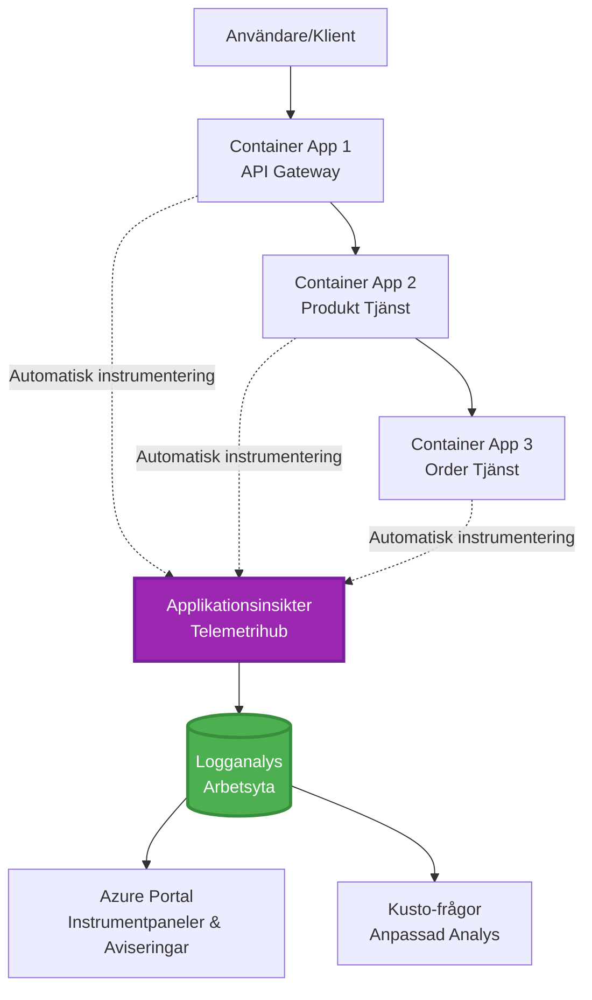
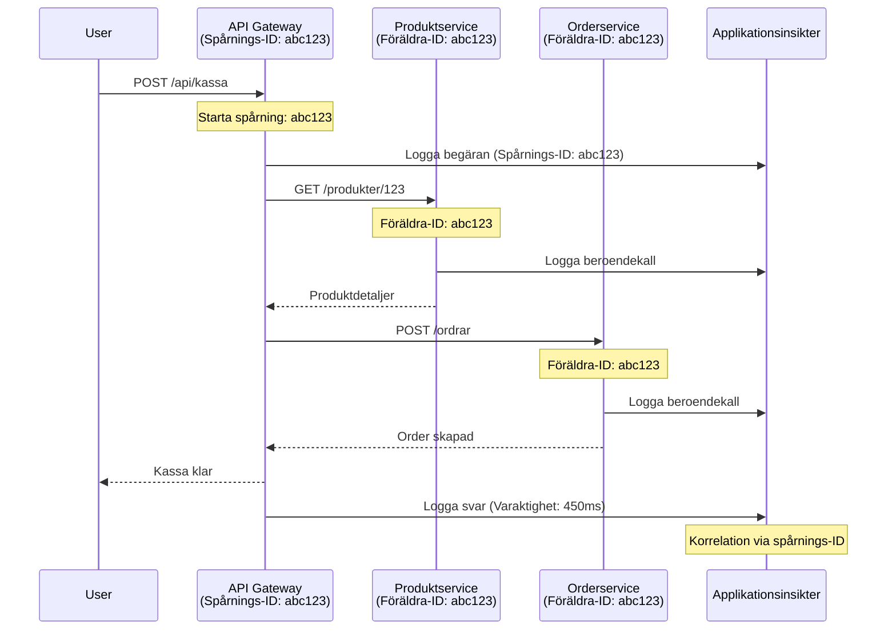

<!--
CO_OP_TRANSLATOR_METADATA:
{
  "original_hash": "e5aa37cdb6378c09099500ac31600b8c",
  "translation_date": "2025-11-21T11:01:34+00:00",
  "source_file": "docs/pre-deployment/application-insights.md",
  "language_code": "sv"
}
-->
# Application Insights-integration med AZD

⏱️ **Beräknad tid**: 40-50 minuter | 💰 **Kostnadseffekt**: ~5-15 USD/månad | ⭐ **Komplexitet**: Medel

**📚 Lärandespår:**
- ← Föregående: [Preflight Checks](preflight-checks.md) - Validering före distribution
- 🎯 **Du är här**: Application Insights-integration (Övervakning, telemetri, felsökning)
- → Nästa: [Deployment Guide](../deployment/deployment-guide.md) - Distribuera till Azure
- 🏠 [Kurshem](../../README.md)

---

## Vad du kommer att lära dig

Genom att slutföra denna lektion kommer du att:
- Integrera **Application Insights** i AZD-projekt automatiskt
- Konfigurera **distribuerad spårning** för mikrotjänster
- Implementera **anpassad telemetri** (metrik, händelser, beroenden)
- Ställa in **live-metrik** för övervakning i realtid
- Skapa **larm och instrumentpaneler** från AZD-distributioner
- Felsöka produktionsproblem med **telemetriförfrågningar**
- Optimera **kostnader och samplingsstrategier**
- Övervaka **AI/LLM-applikationer** (tokens, latens, kostnader)

## Varför Application Insights med AZD är viktigt

### Utmaningen: Produktionsobservabilitet

**Utan Application Insights:**
```
❌ No visibility into production behavior
❌ Manual log aggregation across services
❌ Reactive debugging (wait for customer complaints)
❌ No performance metrics
❌ Cannot trace requests across services
❌ Unknown failure rates and bottlenecks
```

**Med Application Insights + AZD:**
```
✅ Automatic telemetry collection
✅ Centralized logs from all services
✅ Proactive issue detection
✅ End-to-end request tracing
✅ Performance metrics and insights
✅ Real-time dashboards
✅ AZD provisions everything automatically
```

**Liknelse**: Application Insights är som att ha en "svart låda" flyginspelare + cockpit-instrumentpanel för din applikation. Du ser allt som händer i realtid och kan spela upp vilken incident som helst.

---

## Arkitekturoversikt

### Application Insights i AZD-arkitektur


### Vad som övervakas automatiskt

| Telemetrityp | Vad den fångar | Användningsfall |
|--------------|----------------|-----------------|
| **Förfrågningar** | HTTP-förfrågningar, statuskoder, varaktighet | API-prestandaövervakning |
| **Beroenden** | Externa anrop (DB, API:er, lagring) | Identifiera flaskhalsar |
| **Undantag** | Ohanterade fel med stackspår | Felsökningsfel |
| **Anpassade händelser** | Affärshändelser (registrering, köp) | Analys och flöden |
| **Metrik** | Prestandaräknare, anpassade metrik | Kapacitetsplanering |
| **Spår** | Loggmeddelanden med allvarlighetsgrad | Felsökning och revision |
| **Tillgänglighet** | Uptime- och svarstidstester | SLA-övervakning |

---

## Förutsättningar

### Nödvändiga verktyg

```bash
# Verifiera Azure Developer CLI
azd version
# ✅ Förväntat: azd version 1.0.0 eller högre

# Verifiera Azure CLI
az --version
# ✅ Förväntat: azure-cli 2.50.0 eller högre
```

### Azure-krav

- Aktivt Azure-abonnemang
- Behörigheter att skapa:
  - Application Insights-resurser
  - Log Analytics-arbetsytor
  - Container Apps
  - Resursgrupper

### Kunskapsförutsättningar

Du bör ha slutfört:
- [AZD Basics](../getting-started/azd-basics.md) - Grundläggande AZD-koncept
- [Configuration](../getting-started/configuration.md) - Miljöinställning
- [First Project](../getting-started/first-project.md) - Grundläggande distribution

---

## Lektion 1: Automatisk Application Insights med AZD

### Hur AZD tillhandahåller Application Insights

AZD skapar och konfigurerar automatiskt Application Insights när du distribuerar. Låt oss se hur det fungerar.

### Projektstruktur

```
monitored-app/
├── azure.yaml                     # AZD configuration
├── infra/
│   ├── main.bicep                # Main infrastructure
│   ├── core/
│   │   └── monitoring.bicep      # Application Insights + Log Analytics
│   └── app/
│       └── api.bicep             # Container App with monitoring
└── src/
    ├── app.py                    # Application with telemetry
    ├── requirements.txt
    └── Dockerfile
```

---

### Steg 1: Konfigurera AZD (azure.yaml)

**Fil: `azure.yaml`**

```yaml
name: monitored-app
metadata:
  template: monitored-app@1.0.0

services:
  api:
    project: ./src
    language: python
    host: containerapp

# AZD automatically provisions monitoring!
```

**Det är allt!** AZD skapar Application Insights som standard. Ingen extra konfiguration behövs för grundläggande övervakning.

---

### Steg 2: Övervakningsinfrastruktur (Bicep)

**Fil: `infra/core/monitoring.bicep`**

```bicep
param logAnalyticsName string
param applicationInsightsName string
param location string = resourceGroup().location
param tags object = {}

// Log Analytics Workspace (required for Application Insights)
resource logAnalytics 'Microsoft.OperationalInsights/workspaces@2022-10-01' = {
  name: logAnalyticsName
  location: location
  tags: tags
  properties: {
    sku: {
      name: 'PerGB2018'  // Pay-as-you-go pricing
    }
    retentionInDays: 30  // Keep logs for 30 days
    features: {
      enableLogAccessUsingOnlyResourcePermissions: true
    }
  }
}

// Application Insights
resource applicationInsights 'Microsoft.Insights/components@2020-02-02' = {
  name: applicationInsightsName
  location: location
  tags: tags
  kind: 'web'
  properties: {
    Application_Type: 'web'
    WorkspaceResourceId: logAnalytics.id
    IngestionMode: 'LogAnalytics'
    publicNetworkAccessForIngestion: 'Enabled'
    publicNetworkAccessForQuery: 'Enabled'
  }
}

// Outputs for Container Apps
output logAnalyticsWorkspaceId string = logAnalytics.id
output logAnalyticsWorkspaceName string = logAnalytics.name
output applicationInsightsConnectionString string = applicationInsights.properties.ConnectionString
output applicationInsightsInstrumentationKey string = applicationInsights.properties.InstrumentationKey
output applicationInsightsName string = applicationInsights.name
```

---

### Steg 3: Anslut Container App till Application Insights

**Fil: `infra/app/api.bicep`**

```bicep
param name string
param location string
param tags object = {}
param containerAppsEnvironmentName string
param applicationInsightsConnectionString string

resource containerApp 'Microsoft.App/containerApps@2023-05-01' = {
  name: name
  location: location
  tags: tags
  properties: {
    configuration: {
      ingress: {
        external: true
        targetPort: 8000
      }
      secrets: [
        {
          name: 'appinsights-connection-string'
          value: applicationInsightsConnectionString
        }
      ]
    }
    template: {
      containers: [
        {
          name: 'api'
          image: 'myregistry.azurecr.io/api:latest'
          resources: {
            cpu: json('0.5')
            memory: '1Gi'
          }
          env: [
            {
              name: 'APPLICATIONINSIGHTS_CONNECTION_STRING'
              secretRef: 'appinsights-connection-string'
            }
            {
              name: 'APPLICATIONINSIGHTS_ENABLED'
              value: 'true'
            }
          ]
        }
      ]
    }
  }
}

output uri string = 'https://${containerApp.properties.configuration.ingress.fqdn}'
```

---

### Steg 4: Applikationskod med telemetri

**Fil: `src/app.py`**

```python
from flask import Flask, request, jsonify
from opencensus.ext.azure.log_exporter import AzureLogHandler
from opencensus.ext.azure.trace_exporter import AzureExporter
from opencensus.ext.flask.flask_middleware import FlaskMiddleware
from opencensus.trace.samplers import ProbabilitySampler
import logging
import os

app = Flask(__name__)

# Hämta anslutningssträng för Application Insights
connection_string = os.environ.get('APPLICATIONINSIGHTS_CONNECTION_STRING')

if connection_string:
    # Konfigurera distribuerad spårning
    middleware = FlaskMiddleware(
        app,
        exporter=AzureExporter(connection_string=connection_string),
        sampler=ProbabilitySampler(rate=1.0)  # 100% provtagning för utveckling
    )
    
    # Konfigurera loggning
    logger = logging.getLogger(__name__)
    logger.addHandler(AzureLogHandler(connection_string=connection_string))
    logger.setLevel(logging.INFO)
    
    print("✅ Application Insights enabled")
else:
    logger = logging.getLogger(__name__)
    logger.setLevel(logging.INFO)
    print("⚠️ Application Insights not configured")

@app.route('/health')
def health():
    logger.info('Health check endpoint called')
    return jsonify({'status': 'healthy', 'monitoring': 'enabled'})

@app.route('/api/products')
def get_products():
    logger.info('Fetching products')
    
    # Simulera databas-anrop (spåras automatiskt som beroende)
    products = [
        {'id': 1, 'name': 'Laptop', 'price': 999.99},
        {'id': 2, 'name': 'Mouse', 'price': 29.99},
        {'id': 3, 'name': 'Keyboard', 'price': 79.99}
    ]
    
    logger.info(f'Returned {len(products)} products')
    return jsonify(products)

@app.route('/api/error-test')
def error_test():
    """Test error tracking"""
    logger.error('Testing error tracking')
    try:
        raise ValueError('This is a test exception')
    except Exception as e:
        logger.exception('Exception occurred in error-test endpoint')
        return jsonify({'error': str(e)}), 500

@app.route('/api/slow')
def slow_endpoint():
    """Test performance tracking"""
    import time
    logger.info('Slow endpoint called')
    time.sleep(3)  # Simulera långsam operation
    logger.warning('Endpoint took 3 seconds to respond')
    return jsonify({'message': 'Slow operation completed'})

if __name__ == '__main__':
    app.run(host='0.0.0.0', port=8000)
```

**Fil: `src/requirements.txt`**

```txt
Flask==3.0.0
opencensus-ext-azure==1.1.13
opencensus-ext-flask==0.8.1
gunicorn==21.2.0
```

---

### Steg 5: Distribuera och verifiera

```bash
# Initiera AZD
azd init

# Distribuera (tillhandahåller Application Insights automatiskt)
azd up

# Hämta app-URL
APP_URL=$(azd env get-values | grep API_URL | cut -d '=' -f2 | tr -d '"')

# Generera telemetri
curl $APP_URL/health
curl $APP_URL/api/products
curl $APP_URL/api/error-test
curl $APP_URL/api/slow
```

**✅ Förväntat resultat:**
```json
{
  "status": "healthy",
  "monitoring": "enabled"
}
```

---

### Steg 6: Visa telemetri i Azure Portal

```bash
# Hämta detaljer om Application Insights
azd env get-values | grep APPLICATIONINSIGHTS

# Öppna i Azure Portal
az monitor app-insights component show \
  --app $(azd env get-values | grep APPLICATIONINSIGHTS_NAME | cut -d '=' -f2 | tr -d '"') \
  --resource-group $(azd env get-values | grep AZURE_RESOURCE_GROUP | cut -d '=' -f2 | tr -d '"') \
  --query "appId" -o tsv
```

**Navigera till Azure Portal → Application Insights → Transaction Search**

Du bör se:
- ✅ HTTP-förfrågningar med statuskoder
- ✅ Förfrågningsvaraktighet (3+ sekunder för `/api/slow`)
- ✅ Undantagsdetaljer från `/api/error-test`
- ✅ Anpassade loggmeddelanden

---

## Lektion 2: Anpassad telemetri och händelser

### Spåra affärshändelser

Låt oss lägga till anpassad telemetri för affärskritiska händelser.

**Fil: `src/telemetry.py`**

```python
from opencensus.ext.azure import metrics_exporter
from opencensus.stats import aggregation as aggregation_module
from opencensus.stats import measure as measure_module
from opencensus.stats import stats as stats_module
from opencensus.stats import view as view_module
from opencensus.tags import tag_map as tag_map_module
from opencensus.ext.azure.log_exporter import AzureLogHandler
from opencensus.ext.azure.trace_exporter import AzureExporter
from opencensus.trace import tracer as tracer_module
import logging
import os

class TelemetryClient:
    """Custom telemetry client for Application Insights"""
    
    def __init__(self, connection_string=None):
        self.connection_string = connection_string or os.environ.get('APPLICATIONINSIGHTS_CONNECTION_STRING')
        
        if not self.connection_string:
            print("⚠️ Application Insights connection string not found")
            return
        
        # Ställ in logger
        self.logger = logging.getLogger(__name__)
        self.logger.addHandler(AzureLogHandler(connection_string=self.connection_string))
        self.logger.setLevel(logging.INFO)
        
        # Ställ in metrikexportör
        self.stats = stats_module.stats
        self.view_manager = self.stats.view_manager
        self.stats_recorder = self.stats.stats_recorder
        
        exporter = metrics_exporter.new_metrics_exporter(
            connection_string=self.connection_string
        )
        self.view_manager.register_exporter(exporter)
        
        # Ställ in spårare
        self.tracer = tracer_module.Tracer(
            exporter=AzureExporter(connection_string=self.connection_string)
        )
        
        print("✅ Custom telemetry client initialized")
    
    def track_event(self, event_name: str, properties: dict = None):
        """Track custom business event"""
        properties = properties or {}
        self.logger.info(
            f"CustomEvent: {event_name}",
            extra={
                'custom_dimensions': {
                    'event_name': event_name,
                    **properties
                }
            }
        )
    
    def track_metric(self, metric_name: str, value: float, properties: dict = None):
        """Track custom metric"""
        properties = properties or {}
        self.logger.info(
            f"CustomMetric: {metric_name} = {value}",
            extra={
                'custom_dimensions': {
                    'metric_name': metric_name,
                    'value': value,
                    **properties
                }
            }
        )
    
    def track_dependency(self, name: str, dependency_type: str, duration: float, success: bool):
        """Track external dependency call"""
        with self.tracer.span(name=name) as span:
            span.add_attribute('dependency.type', dependency_type)
            span.add_attribute('duration', duration)
            span.add_attribute('success', success)

# Global telemetriklient
telemetry = TelemetryClient()
```

### Uppdatera applikationen med anpassade händelser

**Fil: `src/app.py` (förbättrad)**

```python
from flask import Flask, request, jsonify
from telemetry import telemetry
import time
import random

app = Flask(__name__)

@app.route('/api/purchase', methods=['POST'])
def purchase():
    """Track purchase event with custom telemetry"""
    data = request.json
    product_id = data.get('product_id')
    quantity = data.get('quantity', 1)
    price = data.get('price', 0)
    
    # Spåra affärshändelse
    telemetry.track_event('Purchase', {
        'product_id': product_id,
        'quantity': quantity,
        'total_amount': price * quantity,
        'user_id': request.headers.get('X-User-Id', 'anonymous')
    })
    
    # Spåra intäktsmått
    telemetry.track_metric('Revenue', price * quantity, {
        'product_id': product_id,
        'currency': 'USD'
    })
    
    return jsonify({
        'order_id': f'ORD-{random.randint(1000, 9999)}',
        'status': 'confirmed',
        'total': price * quantity
    })

@app.route('/api/search')
def search():
    """Track search queries"""
    query = request.args.get('q', '')
    
    start_time = time.time()
    
    # Simulera sökning (skulle vara en riktig databasfråga)
    results = [{'id': 1, 'name': f'Result for {query}'}]
    
    duration = (time.time() - start_time) * 1000  # Konvertera till ms
    
    # Spåra sökhändelse
    telemetry.track_event('Search', {
        'query': query,
        'results_count': len(results),
        'duration_ms': duration
    })
    
    # Spåra sökprestandamått
    telemetry.track_metric('SearchDuration', duration, {
        'query_length': len(query)
    })
    
    return jsonify({'results': results, 'count': len(results)})

@app.route('/api/external-call')
def external_call():
    """Track external API dependency"""
    import requests
    
    start_time = time.time()
    success = True
    
    try:
        # Simulera extern API-anrop
        response = requests.get('https://api.example.com/data', timeout=5)
        result = response.json()
    except Exception as e:
        success = False
        result = {'error': str(e)}
    
    duration = (time.time() - start_time) * 1000
    
    # Spåra beroende
    telemetry.track_dependency(
        name='ExternalAPI',
        dependency_type='HTTP',
        duration=duration,
        success=success
    )
    
    return jsonify(result)

if __name__ == '__main__':
    app.run(host='0.0.0.0', port=8000)
```

### Testa anpassad telemetri

```bash
# Spåra köp händelse
curl -X POST $APP_URL/api/purchase \
  -H "Content-Type: application/json" \
  -H "X-User-Id: user123" \
  -d '{"product_id": 1, "quantity": 2, "price": 29.99}'

# Spåra sök händelse
curl "$APP_URL/api/search?q=laptop"

# Spåra extern beroende
curl $APP_URL/api/external-call
```

**Visa i Azure Portal:**

Navigera till Application Insights → Logs, kör sedan:

```kusto
// View purchase events
traces
| where customDimensions.event_name == "Purchase"
| project 
    timestamp,
    product_id = tostring(customDimensions.product_id),
    total_amount = todouble(customDimensions.total_amount),
    user_id = tostring(customDimensions.user_id)
| order by timestamp desc

// View revenue metrics
traces
| where customDimensions.metric_name == "Revenue"
| summarize TotalRevenue = sum(todouble(customDimensions.value)) by bin(timestamp, 1h)
| render timechart

// View search performance
traces
| where customDimensions.event_name == "Search"
| summarize 
    AvgDuration = avg(todouble(customDimensions.duration_ms)),
    SearchCount = count()
  by bin(timestamp, 5m)
| render timechart
```

---

## Lektion 3: Distribuerad spårning för mikrotjänster

### Aktivera spårning mellan tjänster

För mikrotjänster korrelerar Application Insights automatiskt förfrågningar mellan tjänster.

**Fil: `infra/main.bicep`**

```bicep
targetScope = 'subscription'

param environmentName string
param location string = 'eastus'

var tags = { 'azd-env-name': environmentName }

resource rg 'Microsoft.Resources/resourceGroups@2021-04-01' = {
  name: 'rg-${environmentName}'
  location: location
  tags: tags
}

// Monitoring (shared by all services)
module monitoring './core/monitoring.bicep' = {
  name: 'monitoring'
  scope: rg
  params: {
    logAnalyticsName: 'log-${environmentName}'
    applicationInsightsName: 'appi-${environmentName}'
    location: location
    tags: tags
  }
}

// API Gateway
module apiGateway './app/api-gateway.bicep' = {
  name: 'api-gateway'
  scope: rg
  params: {
    name: 'ca-gateway-${environmentName}'
    location: location
    tags: union(tags, { 'azd-service-name': 'gateway' })
    applicationInsightsConnectionString: monitoring.outputs.applicationInsightsConnectionString
  }
}

// Product Service
module productService './app/product-service.bicep' = {
  name: 'product-service'
  scope: rg
  params: {
    name: 'ca-products-${environmentName}'
    location: location
    tags: union(tags, { 'azd-service-name': 'products' })
    applicationInsightsConnectionString: monitoring.outputs.applicationInsightsConnectionString
  }
}

// Order Service
module orderService './app/order-service.bicep' = {
  name: 'order-service'
  scope: rg
  params: {
    name: 'ca-orders-${environmentName}'
    location: location
    tags: union(tags, { 'azd-service-name': 'orders' })
    applicationInsightsConnectionString: monitoring.outputs.applicationInsightsConnectionString
  }
}

output APPLICATIONINSIGHTS_CONNECTION_STRING string = monitoring.outputs.applicationInsightsConnectionString
output GATEWAY_URL string = apiGateway.outputs.uri
```

### Visa transaktion från början till slut


**Fråga spårning från början till slut:**

```kusto
// Find complete request flow
let traceId = "abc123...";  // Get from response header
dependencies
| union requests
| where operation_Id == traceId
| project 
    timestamp,
    type = itemType,
    name,
    duration,
    success,
    cloud_RoleName
| order by timestamp asc
```

---

## Lektion 4: Live-metrik och övervakning i realtid

### Aktivera Live Metrics Stream

Live Metrics ger telemetri i realtid med <1 sekunds latens.

**Åtkomst till Live Metrics:**

```bash
# Hämta Application Insights-resurs
APPI_NAME=$(azd env get-values | grep APPLICATIONINSIGHTS_NAME | cut -d '=' -f2 | tr -d '"')

# Hämta resursgrupp
RG_NAME=$(azd env get-values | grep AZURE_RESOURCE_GROUP | cut -d '=' -f2 | tr -d '"')

echo "Navigate to: Azure Portal → Resource Groups → $RG_NAME → $APPI_NAME → Live Metrics"
```

**Vad du ser i realtid:**
- ✅ Inkommande förfrågningsfrekvens (förfrågningar/sek)
- ✅ Utgående beroendeanrop
- ✅ Antal undantag
- ✅ CPU- och minnesanvändning
- ✅ Antal aktiva servrar
- ✅ Exempeltelemetri

### Generera belastning för testning

```bash
# Generera belastning för att se live-metriker
for i in {1..100}; do
  curl $APP_URL/api/products &
  curl $APP_URL/api/search?q=test$i &
done

# Titta på live-metriker i Azure Portal
# Du bör se en ökning i begärningsfrekvens
```

---

## Praktiska övningar

### Övning 1: Ställ in larm ⭐⭐ (Medel)

**Mål**: Skapa larm för höga felfrekvenser och långsamma svar.

**Steg:**

1. **Skapa larm för felfrekvens:**

```bash
# Hämta Application Insights-resurs-ID
APPI_ID=$(az monitor app-insights component show \
  --app $APPI_NAME \
  --resource-group $RG_NAME \
  --query "id" -o tsv)

# Skapa metrisk varning för misslyckade förfrågningar
az monitor metrics alert create \
  --name "High-Error-Rate" \
  --resource-group $RG_NAME \
  --scopes $APPI_ID \
  --condition "count requests/failed > 10" \
  --window-size 5m \
  --evaluation-frequency 1m \
  --description "Alert when error rate exceeds 10 per 5 minutes"
```

2. **Skapa larm för långsamma svar:**

```bash
az monitor metrics alert create \
  --name "Slow-Responses" \
  --resource-group $RG_NAME \
  --scopes $APPI_ID \
  --condition "avg requests/duration > 3000" \
  --window-size 5m \
  --evaluation-frequency 1m \
  --description "Alert when average response time exceeds 3 seconds"
```

3. **Skapa larm via Bicep (föredras för AZD):**

**Fil: `infra/core/alerts.bicep`**

```bicep
param applicationInsightsId string
param actionGroupId string = ''
param location string = resourceGroup().location

// High error rate alert
resource errorRateAlert 'Microsoft.Insights/metricAlerts@2018-03-01' = {
  name: 'high-error-rate'
  location: 'global'
  properties: {
    description: 'Alert when error rate exceeds threshold'
    severity: 2
    enabled: true
    scopes: [
      applicationInsightsId
    ]
    evaluationFrequency: 'PT1M'
    windowSize: 'PT5M'
    criteria: {
      'odata.type': 'Microsoft.Azure.Monitor.SingleResourceMultipleMetricCriteria'
      allOf: [
        {
          name: 'Error rate'
          metricName: 'requests/failed'
          operator: 'GreaterThan'
          threshold: 10
          timeAggregation: 'Count'
        }
      ]
    }
    actions: actionGroupId != '' ? [
      {
        actionGroupId: actionGroupId
      }
    ] : []
  }
}

// Slow response alert
resource slowResponseAlert 'Microsoft.Insights/metricAlerts@2018-03-01' = {
  name: 'slow-responses'
  location: 'global'
  properties: {
    description: 'Alert when response time is too high'
    severity: 3
    enabled: true
    scopes: [
      applicationInsightsId
    ]
    evaluationFrequency: 'PT1M'
    windowSize: 'PT5M'
    criteria: {
      'odata.type': 'Microsoft.Azure.Monitor.SingleResourceMultipleMetricCriteria'
      allOf: [
        {
          name: 'Response duration'
          metricName: 'requests/duration'
          operator: 'GreaterThan'
          threshold: 3000
          timeAggregation: 'Average'
        }
      ]
    }
  }
}

output errorAlertId string = errorRateAlert.id
output slowResponseAlertId string = slowResponseAlert.id
```

4. **Testa larm:**

```bash
# Generera fel
for i in {1..20}; do
  curl $APP_URL/api/error-test
done

# Generera långsamma svar
for i in {1..10}; do
  curl $APP_URL/api/slow
done

# Kontrollera larmstatus (vänta 5-10 minuter)
az monitor metrics alert list \
  --resource-group $RG_NAME \
  --query "[].{Name:name, Enabled:enabled, State:properties.enabled}" \
  --output table
```

**✅ Framgångskriterier:**
- ✅ Larm skapade framgångsrikt
- ✅ Larm utlöses när trösklar överskrids
- ✅ Kan visa larms historik i Azure Portal
- ✅ Integrerat med AZD-distribution

**Tid**: 20-25 minuter

---

### Övning 2: Skapa anpassad instrumentpanel ⭐⭐ (Medel)

**Mål**: Bygg en instrumentpanel som visar viktiga applikationsmetrik.

**Steg:**

1. **Skapa instrumentpanel via Azure Portal:**

Navigera till: Azure Portal → Dashboards → New Dashboard

2. **Lägg till paneler för viktiga metrik:**

- Antal förfrågningar (senaste 24 timmarna)
- Genomsnittlig svarstid
- Felfrekvens
- Topp 5 långsammaste operationer
- Geografisk fördelning av användare

3. **Skapa instrumentpanel via Bicep:**

**Fil: `infra/core/dashboard.bicep`**

```bicep
param dashboardName string
param applicationInsightsId string
param location string = resourceGroup().location

resource dashboard 'Microsoft.Portal/dashboards@2020-09-01-preview' = {
  name: dashboardName
  location: location
  properties: {
    lenses: [
      {
        order: 0
        parts: [
          // Request count
          {
            position: { x: 0, y: 0, rowSpan: 4, colSpan: 6 }
            metadata: {
              type: 'Extension/Microsoft_OperationsManagementSuite_Workspace/PartType/LogsDashboardPart'
              inputs: [
                {
                  name: 'resourceId'
                  value: applicationInsightsId
                }
                {
                  name: 'query'
                  value: '''
                    requests
                    | summarize RequestCount = count() by bin(timestamp, 1h)
                    | render timechart
                  '''
                }
              ]
            }
          }
          // Error rate
          {
            position: { x: 6, y: 0, rowSpan: 4, colSpan: 6 }
            metadata: {
              type: 'Extension/Microsoft_OperationsManagementSuite_Workspace/PartType/LogsDashboardPart'
              inputs: [
                {
                  name: 'resourceId'
                  value: applicationInsightsId
                }
                {
                  name: 'query'
                  value: '''
                    requests
                    | summarize 
                        Total = count(),
                        Failed = countif(success == false)
                    | extend ErrorRate = (Failed * 100.0) / Total
                    | project ErrorRate
                  '''
                }
              ]
            }
          }
        ]
      }
    ]
  }
}

output dashboardId string = dashboard.id
```

4. **Distribuera instrumentpanel:**

```bash
# Lägg till i main.bicep
module dashboard './core/dashboard.bicep' = {
  name: 'dashboard'
  scope: rg
  params: {
    dashboardName: 'dashboard-${environmentName}'
    applicationInsightsId: monitoring.outputs.applicationInsightsId
    location: location
  }
}

# Distribuera
azd up
```

**✅ Framgångskriterier:**
- ✅ Instrumentpanelen visar viktiga metrik
- ✅ Kan fästas på Azure Portal-hem
- ✅ Uppdateras i realtid
- ✅ Distribuerbar via AZD

**Tid**: 25-30 minuter

---

### Övning 3: Övervaka AI/LLM-applikation ⭐⭐⭐ (Avancerad)

**Mål**: Spåra Azure OpenAI-användning (tokens, kostnader, latens).

**Steg:**

1. **Skapa AI-övervakningswrapper:**

**Fil: `src/ai_telemetry.py`**

```python
from telemetry import telemetry
from openai import AzureOpenAI
import time

class MonitoredAzureOpenAI:
    """Azure OpenAI client with automatic telemetry"""
    
    def __init__(self, api_key, endpoint, api_version="2024-02-01"):
        self.client = AzureOpenAI(
            api_key=api_key,
            api_version=api_version,
            azure_endpoint=endpoint
        )
    
    def chat_completion(self, model: str, messages: list, **kwargs):
        """Track chat completion with telemetry"""
        start_time = time.time()
        
        try:
            # Anropa Azure OpenAI
            response = self.client.chat.completions.create(
                model=model,
                messages=messages,
                **kwargs
            )
            
            duration = (time.time() - start_time) * 1000  # ms
            
            # Extrahera användning
            usage = response.usage
            prompt_tokens = usage.prompt_tokens
            completion_tokens = usage.completion_tokens
            total_tokens = usage.total_tokens
            
            # Beräkna kostnad (GPT-4 prissättning)
            prompt_cost = (prompt_tokens / 1000) * 0.03  # $0.03 per 1K tokens
            completion_cost = (completion_tokens / 1000) * 0.06  # $0.06 per 1K tokens
            total_cost = prompt_cost + completion_cost
            
            # Spåra anpassad händelse
            telemetry.track_event('OpenAI_Request', {
                'model': model,
                'prompt_tokens': prompt_tokens,
                'completion_tokens': completion_tokens,
                'total_tokens': total_tokens,
                'duration_ms': duration,
                'cost_usd': total_cost,
                'success': True
            })
            
            # Spåra mätvärden
            telemetry.track_metric('OpenAI_Tokens', total_tokens, {
                'model': model,
                'type': 'total'
            })
            
            telemetry.track_metric('OpenAI_Cost', total_cost, {
                'model': model,
                'currency': 'USD'
            })
            
            telemetry.track_metric('OpenAI_Duration', duration, {
                'model': model
            })
            
            return response
            
        except Exception as e:
            duration = (time.time() - start_time) * 1000
            
            telemetry.track_event('OpenAI_Request', {
                'model': model,
                'duration_ms': duration,
                'success': False,
                'error': str(e)
            })
            
            raise
```

2. **Använd övervakad klient:**

```python
from flask import Flask, request, jsonify
from ai_telemetry import MonitoredAzureOpenAI
import os

app = Flask(__name__)

# Initiera övervakad OpenAI-klient
openai_client = MonitoredAzureOpenAI(
    api_key=os.environ['AZURE_OPENAI_API_KEY'],
    endpoint=os.environ['AZURE_OPENAI_ENDPOINT']
)

@app.route('/api/chat', methods=['POST'])
def chat():
    data = request.json
    user_message = data.get('message')
    
    # Anropa med automatisk övervakning
    response = openai_client.chat_completion(
        model='gpt-4',
        messages=[
            {'role': 'user', 'content': user_message}
        ]
    )
    
    return jsonify({
        'response': response.choices[0].message.content,
        'tokens': response.usage.total_tokens
    })
```

3. **Fråga AI-metrik:**

```kusto
// Total AI spend over time
traces
| where customDimensions.event_name == "OpenAI_Request"
| where customDimensions.success == "True"
| summarize TotalCost = sum(todouble(customDimensions.cost_usd)) by bin(timestamp, 1h)
| render timechart

// Token usage by model
traces
| where customDimensions.event_name == "OpenAI_Request"
| summarize 
    TotalTokens = sum(toint(customDimensions.total_tokens)),
    RequestCount = count()
  by Model = tostring(customDimensions.model)

// Average latency
traces
| where customDimensions.event_name == "OpenAI_Request"
| summarize AvgDuration = avg(todouble(customDimensions.duration_ms))
| project AvgDurationSeconds = AvgDuration / 1000

// Cost per request
traces
| where customDimensions.event_name == "OpenAI_Request"
| extend Cost = todouble(customDimensions.cost_usd)
| summarize 
    TotalCost = sum(Cost),
    RequestCount = count(),
    AvgCostPerRequest = avg(Cost)
```

**✅ Framgångskriterier:**
- ✅ Varje OpenAI-anrop spåras automatiskt
- ✅ Tokenanvändning och kostnader synliga
- ✅ Latens övervakas
- ✅ Kan ställa in budgetlarm

**Tid**: 35-45 minuter

---

## Kostnadsoptimering

### Samplingsstrategier

Kontrollera kostnader genom att sampla telemetri:

```python
from opencensus.trace.samplers import ProbabilitySampler

# Utveckling: 100% provtagning
sampler = ProbabilitySampler(rate=1.0)

# Produktion: 10% provtagning (minska kostnaderna med 90%)
sampler = ProbabilitySampler(rate=0.1)

# Adaptiv provtagning (justeras automatiskt)
from opencensus.trace.samplers import AdaptiveSampler
sampler = AdaptiveSampler()
```

**I Bicep:**

```bicep
resource applicationInsights 'Microsoft.Insights/components@2020-02-02' = {
  name: applicationInsightsName
  properties: {
    SamplingPercentage: 10  // 10% sampling
  }
}
```

### Dataretention

```bicep
resource logAnalytics 'Microsoft.OperationalInsights/workspaces@2022-10-01' = {
  name: logAnalyticsName
  properties: {
    retentionInDays: 30  // Minimum (cheapest)
    // Options: 30, 31, 60, 90, 120, 180, 270, 365, 550, 730
  }
}
```

### Månatliga kostnadsuppskattningar

| Datavolym | Retention | Månadskostnad |
|-----------|-----------|---------------|
| 1 GB/månad | 30 dagar | ~2-5 USD |
| 5 GB/månad | 30 dagar | ~10-15 USD |
| 10 GB/månad | 90 dagar | ~25-40 USD |
| 50 GB/månad | 90 dagar | ~100-150 USD |

**Gratisnivå**: 5 GB/månad ingår

---

## Kunskapskontroll

### 1. Grundläggande integration ✓

Testa din förståelse:

- [ ] **F1**: Hur tillhandahåller AZD Application Insights?
  - **S**: Automatiskt via Bicep-mallar i `infra/core/monitoring.bicep`

- [ ] **F2**: Vilken miljövariabel aktiverar Application Insights?
  - **S**: `APPLICATIONINSIGHTS_CONNECTION_STRING`

- [ ] **F3**: Vilka är de tre huvudsakliga telemetrityperna?
  - **S**: Förfrågningar (HTTP-anrop), Beroenden (externa anrop), Undantag (fel)

**Praktisk verifiering:**
```bash
# Kontrollera om Application Insights är konfigurerat
azd env get-values | grep APPLICATIONINSIGHTS

# Verifiera att telemetri flödar
az monitor app-insights metrics show \
  --app $APPI_NAME \
  --resource-group $RG_NAME \
  --metric "requests/count"
```

---

### 2. Anpassad telemetri ✓

Testa din förståelse:

- [ ] **F1**: Hur spårar du anpassade affärshändelser?
  - **S**: Använd logger med `custom_dimensions` eller `TelemetryClient.track_event()`

- [ ] **F2**: Vad är skillnaden mellan händelser och metrik?
  - **S**: Händelser är diskreta händelser, metrik är numeriska mätningar

- [ ] **F3**: Hur korrelerar du telemetri mellan tjänster?
  - **S**: Application Insights använder automatiskt `operation_Id` för korrelation

**Praktisk verifiering:**
```kusto
// Verify custom events
traces
| where customDimensions.event_name != ""
| summarize count() by tostring(customDimensions.event_name)
```

---

### 3. Produktionsövervakning ✓

Testa din förståelse:

- [ ] **F1**: Vad är sampling och varför använda det?
  - **S**: Sampling minskar datavolymen (och kostnaden) genom att endast fånga en procentandel av telemetrin

- [ ] **F2**: Hur ställer du in larm?
  - **S**: Använd metriklarm i Bicep eller Azure Portal baserat på Application Insights-metrik

- [ ] **F3**: Vad är skillnaden mellan Log Analytics och Application Insights?
  - **S**: Application Insights lagrar data i Log Analytics-arbetsyta; App Insights ger applikationsspecifika vyer

**Praktisk verifiering:**
```bash
# Kontrollera samplingskonfiguration
az monitor app-insights component show \
  --app $APPI_NAME \
  --resource-group $RG_NAME \
  --query "properties.SamplingPercentage"
```

---

## Bästa praxis

### ✅ GÖR:

1. **Använd korrelations-ID**
   ```python
   logger.info('Processing order', extra={
       'custom_dimensions': {
           'order_id': order_id,
           'user_id': user_id
       }
   })
   ```

2. **Ställ in larm för kritiska metrik**
   ```bicep
   // Error rate, slow responses, availability
   ```

3. **Använd strukturerad loggning**
   ```python
   # ✅ BRA: Strukturerad
   logger.info('User signup', extra={'custom_dimensions': {'user_id': 123}})
   
   # ❌ DÅLIGT: Ostrukturerad
   logger.info(f'User 123 signed up')
   ```

4. **Övervaka beroenden**
   ```python
   # Spåra automatiskt databasförfrågningar, HTTP-förfrågningar, etc.
   ```

5. **Använd Live Metrics under distributioner**

### ❌ GÖR INTE:

1. **Logga inte känslig data**
   ```python
   # ❌ DÅLIGT
   logger.info(f'Login: {username}:{password}')
   
   # ✅ BRA
   logger.info('Login attempt', extra={'custom_dimensions': {'username': username}})
   ```

2. **Använd inte 100 % sampling i produktion**
   ```python
   # ❌ Dyrt
   sampler = ProbabilitySampler(rate=1.0)
   
   # ✅ Kostnadseffektivt
   sampler = ProbabilitySampler(rate=0.1)
   ```

3. **Ignorera inte dead letter-köer**

4. **Glöm inte att ställa in datalagringsgränser**

---

## Felsökning

### Problem: Ingen telemetri visas

**Diagnos:**
```bash
# Kontrollera att anslutningssträngen är inställd
azd env get-values | grep APPLICATIONINSIGHTS

# Kontrollera applikationsloggar
azd logs api --tail 50
```

**Lösning:**
```bash
# Verifiera anslutningssträng i Container App
az containerapp show \
  --name $APP_NAME \
  --resource-group $RG_NAME \
  --query "properties.template.containers[0].env" \
  | grep -i applicationinsights
```

---

### Problem: Höga kostnader

**Diagnos:**
```bash
# Kontrollera dataintag
az monitor app-insights metrics show \
  --app $APPI_NAME \
  --resource-group $RG_NAME \
  --metric "availabilityResults/count"
```

**Lösning:**
- Minska samplingsfrekvensen
- Minska lagringsperioden
- Ta bort detaljerad loggning

---

## Läs mer

### Officiell dokumentation
- [Application Insights Overview](https://learn.microsoft.com/azure/azure-monitor/app/app-insights-overview)
- [Application Insights för Python](https://learn.microsoft.com/azure/azure-monitor/app/opencensus-python)
- [Kusto Query Language](https://learn.microsoft.com/azure/data-explorer/kusto/query/)
- [AZD Monitoring](https://learn.microsoft.com/azure/developer/azure-developer-cli/monitor-your-app)

### Nästa steg i denna kurs
- ← Föregående: [Preflight Checks](preflight-checks.md)
- → Nästa: [Deployment Guide](../deployment/deployment-guide.md)
- 🏠 [Kurshem](../../README.md)

### Relaterade exempel
- [Azure OpenAI Example](../../../../examples/azure-openai-chat) - AI-telemetri
- [Microservices Example](../../../../examples/microservices) - Distribuerad spårning

---

## Sammanfattning

**Du har lärt dig:**
- ✅ Automatisk Application Insights-tillhandahållande med AZD
- ✅ Anpassad telemetri (händelser, metrik, beroenden)
- ✅ Distribuerad spårning mellan mikrotjänster
- ✅ Live-metrik och övervakning i realtid
- ✅ Larm och instrumentpaneler
- ✅ Övervakning av AI/LLM-applikationer
- ✅ Strategier för kostnadsoptimering

**Viktiga insikter:**
1. **AZD tillhandahåller övervakning automatiskt** - Ingen manuell inställning krävs
2. **Använd strukturerad loggning** - Gör det enklare att göra sökningar
3. **Spåra affärshändelser** - Inte bara tekniska mätvärden
4. **Övervaka AI-kostnader** - Håll koll på tokens och utgifter
5. **Ställ in varningar** - Var proaktiv, inte reaktiv
6. **Optimera kostnader** - Använd sampling och begränsningar för lagring

**Nästa steg:**
1. Slutför de praktiska övningarna
2. Lägg till Application Insights i dina AZD-projekt
3. Skapa anpassade instrumentpaneler för ditt team
4. Lär dig [Deploymentsguide](../deployment/deployment-guide.md)

---

<!-- CO-OP TRANSLATOR DISCLAIMER START -->
**Ansvarsfriskrivning**:  
Detta dokument har översatts med hjälp av AI-översättningstjänsten [Co-op Translator](https://github.com/Azure/co-op-translator). Även om vi strävar efter noggrannhet, bör det noteras att automatiserade översättningar kan innehålla fel eller felaktigheter. Det ursprungliga dokumentet på dess originalspråk bör betraktas som den auktoritativa källan. För kritisk information rekommenderas professionell mänsklig översättning. Vi ansvarar inte för eventuella missförstånd eller feltolkningar som uppstår vid användning av denna översättning.
<!-- CO-OP TRANSLATOR DISCLAIMER END -->