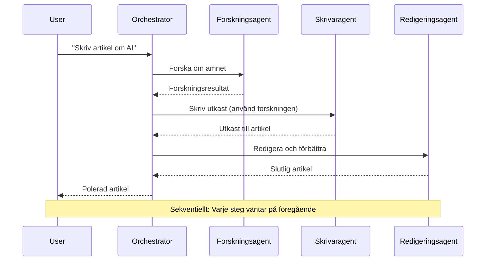
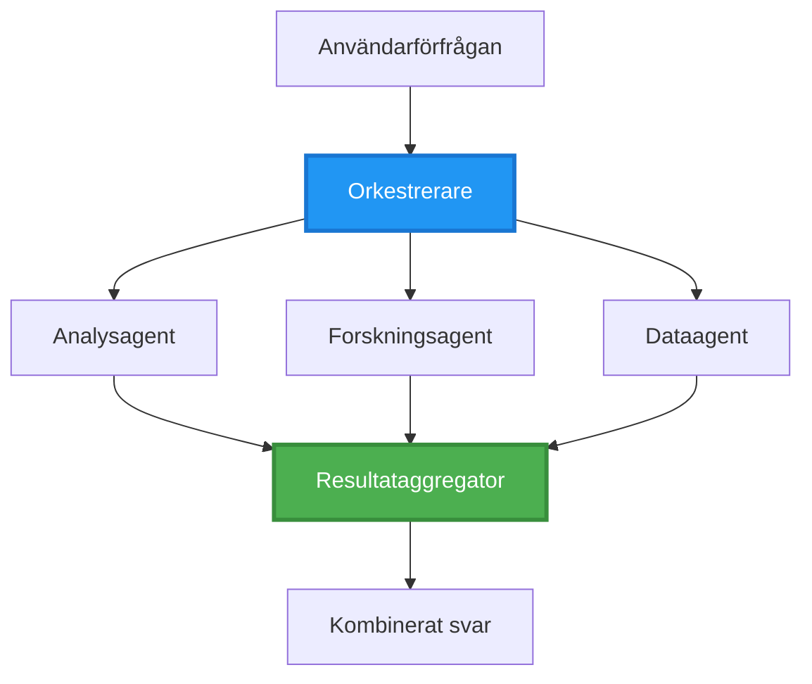
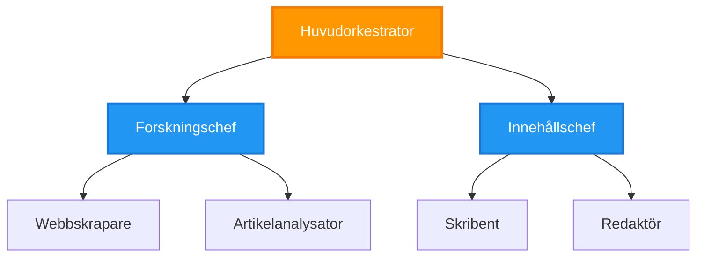
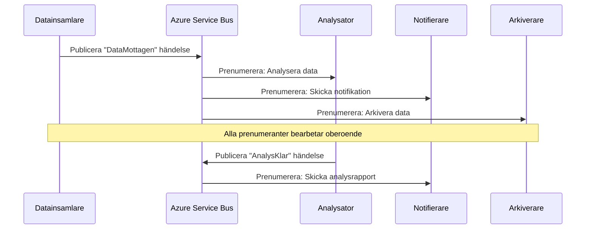
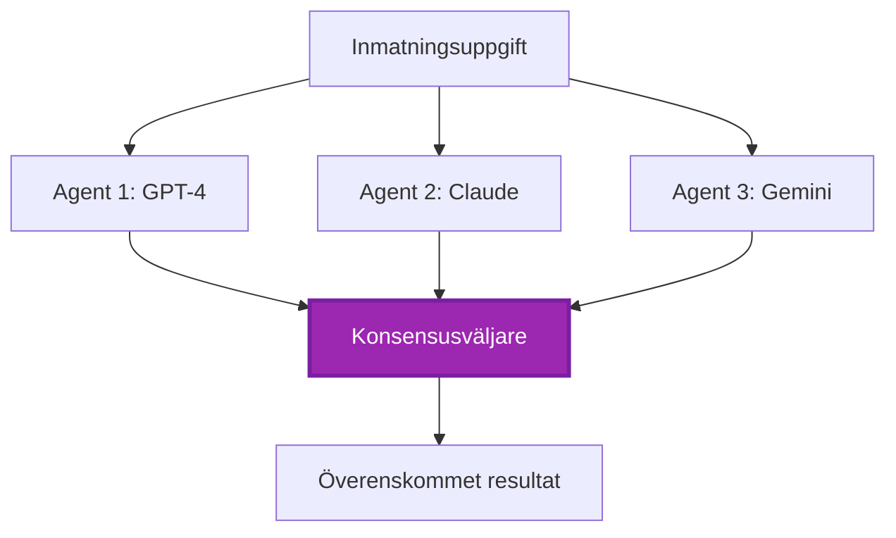
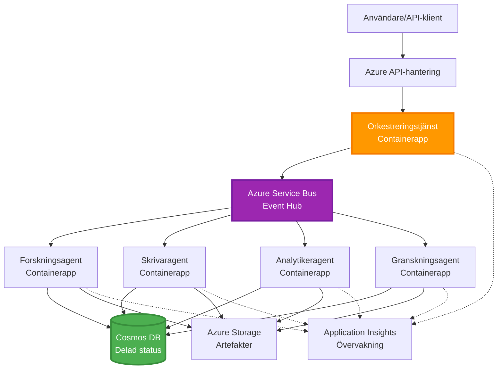

# Mönster för samordning av flera agenter

⏱️ **Beräknad tid**: 60-75 minuter | 💰 **Beräknad kostnad**: ~$100-300/månad | ⭐ **Komplexitet**: Avancerad

**📚 Inlärningsväg:**
- ← Föregående: [Kapacitetsplanering](capacity-planning.md) - Strategier för resursdimensionering och skalning
- 🎯 **Du är här**: Mönster för samordning av flera agenter (Orkestrering, kommunikation, tillståndshantering)
- → Nästa: [SKU-val](sku-selection.md) - Välja rätt Azure-tjänster
- 🏠 [Kursöversikt](../../README.md)

---

## Vad du kommer att lära dig

Genom att slutföra denna lektion kommer du att:
- Förstå **arkitekturmönster för flera agenter** och när de ska användas
- Implementera **orkestreringsmönster** (centraliserade, decentraliserade, hierarkiska)
- Designa **kommunikationsstrategier för agenter** (synkrona, asynkrona, händelsedrivna)
- Hantera **delat tillstånd** mellan distribuerade agenter
- Distribuera **system med flera agenter** på Azure med AZD
- Tillämpa **samordningsmönster** för verkliga AI-scenarier
- Övervaka och felsöka distribuerade agentsystem

## Varför samordning av flera agenter är viktigt

### Utvecklingen: Från enskild agent till flera agenter

**Enskild agent (Enkel):**
```
User → Agent → Response
```
- ✅ Lätt att förstå och implementera
- ✅ Snabb för enkla uppgifter
- ❌ Begränsad av en enda modells kapacitet
- ❌ Kan inte parallellisera komplexa uppgifter
- ❌ Ingen specialisering

**System med flera agenter (Avancerat):**
```
           ┌─────────────┐
           │ Orchestrator│
           └──────┬──────┘
        ┌─────────┼─────────┐
        │         │         │
    ┌───▼──┐  ┌──▼───┐  ┌──▼────┐
    │Agent1│  │Agent2│  │Agent3 │
    │(Plan)│  │(Code)│  │(Review)│
    └──────┘  └──────┘  └───────┘
```
- ✅ Specialiserade agenter för specifika uppgifter
- ✅ Parallell körning för snabbhet
- ✅ Modulärt och lätt att underhålla
- ✅ Bättre för komplexa arbetsflöden
- ⚠️ Kräver samordningslogik

**Liknelse**: En enskild agent är som en person som gör alla uppgifter. Ett system med flera agenter är som ett team där varje medlem har specialiserade färdigheter (forskare, programmerare, granskare, skribent) som arbetar tillsammans.

---

## Kärnmönster för samordning

### Mönster 1: Sekventiell samordning (Ansvarskedja)

**När ska det användas**: Uppgifter måste slutföras i en specifik ordning, varje agent bygger på föregående resultat.


**Fördelar:**
- ✅ Tydligt dataflöde
- ✅ Lätt att felsöka
- ✅ Förutsägbar körningsordning

**Begränsningar:**
- ❌ Långsammare (ingen parallellism)
- ❌ Ett fel blockerar hela kedjan
- ❌ Kan inte hantera ömsesidigt beroende uppgifter

**Exempel på användningsområden:**
- Innehållsskapande pipeline (forskning → skriva → redigera → publicera)
- Kodgenerering (planera → implementera → testa → distribuera)
- Rapportgenerering (datainsamling → analys → visualisering → sammanfattning)

---

### Mönster 2: Parallell samordning (Fan-Out/Fan-In)

**När ska det användas**: Oberoende uppgifter kan köras samtidigt, resultat kombineras i slutet.


**Fördelar:**
- ✅ Snabbt (parallell körning)
- ✅ Fel-tolerant (delresultat accepteras)
- ✅ Skalbart horisontellt

**Begränsningar:**
- ⚠️ Resultat kan anlända i oordning
- ⚠️ Kräver aggregeringslogik
- ⚠️ Komplex tillståndshantering

**Exempel på användningsområden:**
- Datainsamling från flera källor (API:er + databaser + webbsökning)
- Konkurrensanalys (flera modeller genererar lösningar, bästa väljs)
- Översättningstjänster (översätt till flera språk samtidigt)

---

### Mönster 3: Hierarkisk samordning (Chef-Arbetare)

**När ska det användas**: Komplexa arbetsflöden med deluppgifter, delegering behövs.


**Fördelar:**
- ✅ Hanterar komplexa arbetsflöden
- ✅ Modulärt och lätt att underhålla
- ✅ Tydliga ansvarsgränser

**Begränsningar:**
- ⚠️ Mer komplex arkitektur
- ⚠️ Högre latens (flera samordningslager)
- ⚠️ Kräver sofistikerad orkestrering

**Exempel på användningsområden:**
- Dokumenthantering i företag (klassificera → dirigera → bearbeta → arkivera)
- Flerstegsdataledningar (insamla → rensa → transformera → analysera → rapportera)
- Komplexa automatiseringsarbetsflöden (planering → resursallokering → utförande → övervakning)

---

### Mönster 4: Händelsedriven samordning (Publicera-Prenumerera)

**När ska det användas**: Agenter behöver reagera på händelser, lös koppling önskas.


**Fördelar:**
- ✅ Lös koppling mellan agenter
- ✅ Lätt att lägga till nya agenter (bara prenumerera)
- ✅ Asynkron bearbetning
- ✅ Resilient (meddelandepersistering)

**Begränsningar:**
- ⚠️ Eventuell konsistens
- ⚠️ Komplex felsökning
- ⚠️ Utmaningar med meddelandeordning

**Exempel på användningsområden:**
- Realtidsövervakningssystem (varningar, instrumentpaneler, loggar)
- Flerkanalsnotifikationer (e-post, SMS, push, Slack)
- Databearbetningsledningar (flera konsumenter av samma data)

---

### Mönster 5: Konsensusbaserad samordning (Röstning/Kvorum)

**När ska det användas**: Kräver överenskommelse från flera agenter innan man går vidare.


**Fördelar:**
- ✅ Högre noggrannhet (flera åsikter)
- ✅ Fel-tolerant (mindre fel accepteras)
- ✅ Inbyggd kvalitetskontroll

**Begränsningar:**
- ❌ Dyrt (flera modellanrop)
- ❌ Långsammare (väntar på alla agenter)
- ⚠️ Konfliktlösning behövs

**Exempel på användningsområden:**
- Innehållsmoderering (flera modeller granskar innehåll)
- Kodgranskning (flera linters/analyzers)
- Medicinsk diagnos (flera AI-modeller, expertvalidering)

---

## Arkitekturoversikt

### Komplett system med flera agenter på Azure


**Nyckelkomponenter:**

| Komponent | Syfte | Azure-tjänst |
|-----------|-------|--------------|
| **API Gateway** | Ingångspunkt, hastighetsbegränsning, autentisering | API Management |
| **Orkestrator** | Samordnar agentarbetsflöden | Container Apps |
| **Meddelandekö** | Asynkron kommunikation | Service Bus / Event Hubs |
| **Agenter** | Specialiserade AI-arbetare | Container Apps / Functions |
| **Tillståndslager** | Delat tillstånd, uppgiftsspårning | Cosmos DB |
| **Artefaktlagring** | Dokument, resultat, loggar | Blob Storage |
| **Övervakning** | Distribuerad spårning, loggar | Application Insights |

---

## Förutsättningar

### Nödvändiga verktyg

```bash
# Verifiera Azure Developer CLI
azd version
# ✅ Förväntat: azd version 1.0.0 eller högre

# Verifiera Azure CLI
az --version
# ✅ Förväntat: azure-cli 2.50.0 eller högre

# Verifiera Docker (för lokal testning)
docker --version
# ✅ Förväntat: Docker version 20.10 eller högre
```

### Azure-krav

- Aktivt Azure-abonnemang
- Behörigheter att skapa:
  - Container Apps
  - Service Bus-namnrymder
  - Cosmos DB-konton
  - Lagringskonton
  - Application Insights

### Kunskapsförutsättningar

Du bör ha slutfört:
- [Konfigurationshantering](../getting-started/configuration.md)
- [Autentisering och säkerhet](../getting-started/authsecurity.md)
- [Exempel på mikrotjänster](../../../../examples/microservices)

---

## Implementeringsguide

### Projektstruktur

```
multi-agent-system/
├── azure.yaml                    # AZD configuration
├── infra/
│   ├── main.bicep               # Main infrastructure
│   ├── core/
│   │   ├── servicebus.bicep     # Message queue
│   │   ├── cosmos.bicep         # State store
│   │   ├── storage.bicep        # Artifact storage
│   │   └── monitoring.bicep     # Application Insights
│   └── app/
│       ├── orchestrator.bicep   # Orchestrator service
│       └── agent.bicep          # Agent template
└── src/
    ├── orchestrator/            # Orchestration logic
    │   ├── app.py
    │   ├── workflows.py
    │   └── Dockerfile
    ├── agents/
    │   ├── research/            # Research agent
    │   ├── writer/              # Writer agent
    │   ├── analyst/             # Analyst agent
    │   └── reviewer/            # Reviewer agent
    └── shared/
        ├── state_manager.py     # Shared state logic
        └── message_handler.py   # Message handling
```

---

## Lektion 1: Sekventiellt samordningsmönster

### Implementering: Innehållsskapande pipeline

Låt oss bygga en sekventiell pipeline: Forskning → Skriva → Redigera → Publicera

### 1. AZD-konfiguration

**Fil: `azure.yaml`**

```yaml
name: content-pipeline
metadata:
  template: multi-agent-sequential@1.0.0

services:
  orchestrator:
    project: ./src/orchestrator
    language: python
    host: containerapp
  
  research-agent:
    project: ./src/agents/research
    language: python
    host: containerapp
  
  writer-agent:
    project: ./src/agents/writer
    language: python
    host: containerapp
  
  editor-agent:
    project: ./src/agents/editor
    language: python
    host: containerapp
```

### 2. Infrastruktur: Service Bus för samordning

**Fil: `infra/core/servicebus.bicep`**

```bicep
param name string
param location string
param tags object = {}

resource serviceBusNamespace 'Microsoft.ServiceBus/namespaces@2022-10-01-preview' = {
  name: name
  location: location
  tags: tags
  sku: {
    name: 'Standard'
    tier: 'Standard'
  }
  properties: {
    minimumTlsVersion: '1.2'
  }
}

// Queue for orchestrator → research agent
resource researchQueue 'Microsoft.ServiceBus/namespaces/queues@2022-10-01-preview' = {
  parent: serviceBusNamespace
  name: 'research-tasks'
  properties: {
    maxDeliveryCount: 3
    lockDuration: 'PT5M'
    deadLetteringOnMessageExpiration: true
  }
}

// Queue for research agent → writer agent
resource writerQueue 'Microsoft.ServiceBus/namespaces/queues@2022-10-01-preview' = {
  parent: serviceBusNamespace
  name: 'writer-tasks'
  properties: {
    maxDeliveryCount: 3
    lockDuration: 'PT5M'
  }
}

// Queue for writer agent → editor agent
resource editorQueue 'Microsoft.ServiceBus/namespaces/queues@2022-10-01-preview' = {
  parent: serviceBusNamespace
  name: 'editor-tasks'
  properties: {
    maxDeliveryCount: 3
    lockDuration: 'PT5M'
  }
}

output namespace string = serviceBusNamespace.name
output connectionString string = listKeys('${serviceBusNamespace.id}/AuthorizationRules/RootManageSharedAccessKey', serviceBusNamespace.apiVersion).primaryConnectionString
```

### 3. Delad tillståndshanterare

**Fil: `src/shared/state_manager.py`**

```python
from azure.cosmos import CosmosClient, PartitionKey
from datetime import datetime
import os

class StateManager:
    """Manages shared state across agents using Cosmos DB"""
    
    def __init__(self):
        endpoint = os.environ['COSMOS_ENDPOINT']
        key = os.environ['COSMOS_KEY']
        
        self.client = CosmosClient(endpoint, key)
        self.database = self.client.get_database_client('agent-state')
        self.container = self.database.get_container_client('tasks')
    
    def create_task(self, task_id: str, task_type: str, input_data: dict):
        """Create a new task"""
        task = {
            'id': task_id,
            'type': task_type,
            'status': 'pending',
            'input': input_data,
            'created_at': datetime.utcnow().isoformat(),
            'steps': []
        }
        self.container.create_item(task)
        return task
    
    def update_task_step(self, task_id: str, step_name: str, result: dict):
        """Update task with completed step"""
        task = self.container.read_item(task_id, partition_key=task_id)
        
        task['steps'].append({
            'name': step_name,
            'completed_at': datetime.utcnow().isoformat(),
            'result': result
        })
        
        self.container.replace_item(task_id, task)
        return task
    
    def complete_task(self, task_id: str, final_result: dict):
        """Mark task as complete"""
        task = self.container.read_item(task_id, partition_key=task_id)
        task['status'] = 'completed'
        task['result'] = final_result
        task['completed_at'] = datetime.utcnow().isoformat()
        self.container.replace_item(task_id, task)
        return task
    
    def get_task(self, task_id: str):
        """Retrieve task state"""
        return self.container.read_item(task_id, partition_key=task_id)
```

### 4. Orkestratorstjänst

**Fil: `src/orchestrator/app.py`**

```python
from flask import Flask, request, jsonify
from azure.servicebus import ServiceBusClient, ServiceBusMessage
import json
import uuid
import os
from shared.state_manager import StateManager

app = Flask(__name__)
state_manager = StateManager()

# Service Bus-anslutning
servicebus_connection_str = os.environ['SERVICEBUS_CONNECTION_STRING']
servicebus_client = ServiceBusClient.from_connection_string(servicebus_connection_str)

@app.route('/health', methods=['GET'])
def health():
    return jsonify({'status': 'healthy', 'service': 'orchestrator'})

@app.route('/create-content', methods=['POST'])
def create_content():
    """
    Sequential workflow: Research → Write → Edit → Publish
    """
    data = request.json
    topic = data.get('topic')
    
    if not topic:
        return jsonify({'error': 'Topic required'}), 400
    
    # Skapa uppgift i tillståndslagring
    task_id = str(uuid.uuid4())
    task = state_manager.create_task(
        task_id=task_id,
        task_type='content_creation',
        input_data={'topic': topic}
    )
    
    # Skicka meddelande till forskningsagenten (första steget)
    sender = servicebus_client.get_queue_sender('research-tasks')
    message = ServiceBusMessage(
        body=json.dumps({
            'task_id': task_id,
            'topic': topic,
            'next_queue': 'writer-tasks'  # Var resultaten ska skickas
        }),
        content_type='application/json'
    )
    
    with sender:
        sender.send_messages(message)
    
    return jsonify({
        'task_id': task_id,
        'status': 'started',
        'workflow': 'sequential',
        'steps': ['research', 'write', 'edit', 'publish'],
        'message': 'Content creation pipeline initiated'
    }), 202

@app.route('/task/<task_id>', methods=['GET'])
def get_task_status(task_id):
    """Check task status"""
    try:
        task = state_manager.get_task(task_id)
        return jsonify(task)
    except Exception as e:
        return jsonify({'error': str(e)}), 404

if __name__ == '__main__':
    app.run(host='0.0.0.0', port=8080)
```

### 5. Forskningsagent

**Fil: `src/agents/research/app.py`**

```python
from azure.servicebus import ServiceBusClient, ServiceBusMessage
from openai import AzureOpenAI
import json
import os
import time
from shared.state_manager import StateManager

# Initiera klienter
state_manager = StateManager()
servicebus_client = ServiceBusClient.from_connection_string(
    os.environ['SERVICEBUS_CONNECTION_STRING']
)

openai_client = AzureOpenAI(
    api_key=os.environ['AZURE_OPENAI_API_KEY'],
    api_version="2024-02-01",
    azure_endpoint=os.environ['AZURE_OPENAI_ENDPOINT']
)

def process_research_task(message_data):
    """Process research request and pass to writer"""
    task_id = message_data['task_id']
    topic = message_data['topic']
    next_queue = message_data['next_queue']
    
    print(f"🔬 Researching: {topic}")
    
    # Anropa Azure OpenAI för forskning
    response = openai_client.chat.completions.create(
        model="gpt-4",
        messages=[
            {"role": "system", "content": "You are a research assistant. Provide comprehensive research on the given topic."},
            {"role": "user", "content": f"Research this topic thoroughly: {topic}"}
        ],
        max_tokens=1500
    )
    
    research_results = response.choices[0].message.content
    
    # Uppdatera tillstånd
    state_manager.update_task_step(
        task_id=task_id,
        step_name='research',
        result={'research': research_results}
    )
    
    # Skicka till nästa agent (författare)
    sender = servicebus_client.get_queue_sender(next_queue)
    message = ServiceBusMessage(
        body=json.dumps({
            'task_id': task_id,
            'topic': topic,
            'research': research_results,
            'next_queue': 'editor-tasks'
        }),
        content_type='application/json'
    )
    
    with sender:
        sender.send_messages(message)
    
    print(f"✅ Research complete for task {task_id}")

def main():
    """Listen to research queue"""
    receiver = servicebus_client.get_queue_receiver('research-tasks')
    
    print("🔬 Research Agent started, listening for tasks...")
    
    with receiver:
        while True:
            messages = receiver.receive_messages(max_wait_time=5)
            for message in messages:
                try:
                    message_data = json.loads(str(message))
                    process_research_task(message_data)
                    receiver.complete_message(message)
                except Exception as e:
                    print(f"❌ Error processing message: {e}")
                    receiver.abandon_message(message)

if __name__ == '__main__':
    main()
```

### 6. Skrivaragent

**Fil: `src/agents/writer/app.py`**

```python
from azure.servicebus import ServiceBusClient, ServiceBusMessage
from openai import AzureOpenAI
import json
import os
from shared.state_manager import StateManager

state_manager = StateManager()
servicebus_client = ServiceBusClient.from_connection_string(
    os.environ['SERVICEBUS_CONNECTION_STRING']
)

openai_client = AzureOpenAI(
    api_key=os.environ['AZURE_OPENAI_API_KEY'],
    api_version="2024-02-01",
    azure_endpoint=os.environ['AZURE_OPENAI_ENDPOINT']
)

def process_writing_task(message_data):
    """Write article based on research"""
    task_id = message_data['task_id']
    topic = message_data['topic']
    research = message_data['research']
    next_queue = message_data['next_queue']
    
    print(f"✍️ Writing article: {topic}")
    
    # Anropa Azure OpenAI för att skriva artikel
    response = openai_client.chat.completions.create(
        model="gpt-4",
        messages=[
            {"role": "system", "content": "You are a professional writer. Write engaging, well-structured articles."},
            {"role": "user", "content": f"Based on this research:\n\n{research}\n\nWrite a comprehensive article about: {topic}"}
        ],
        max_tokens=2000
    )
    
    article_draft = response.choices[0].message.content
    
    # Uppdatera status
    state_manager.update_task_step(
        task_id=task_id,
        step_name='writing',
        result={'draft': article_draft}
    )
    
    # Skicka till redaktör
    sender = servicebus_client.get_queue_sender(next_queue)
    message = ServiceBusMessage(
        body=json.dumps({
            'task_id': task_id,
            'topic': topic,
            'draft': article_draft
        }),
        content_type='application/json'
    )
    
    with sender:
        sender.send_messages(message)
    
    print(f"✅ Article draft complete for task {task_id}")

def main():
    """Listen to writer queue"""
    receiver = servicebus_client.get_queue_receiver('writer-tasks')
    
    print("✍️ Writer Agent started, listening for tasks...")
    
    with receiver:
        while True:
            messages = receiver.receive_messages(max_wait_time=5)
            for message in messages:
                try:
                    message_data = json.loads(str(message))
                    process_writing_task(message_data)
                    receiver.complete_message(message)
                except Exception as e:
                    print(f"❌ Error: {e}")
                    receiver.abandon_message(message)

if __name__ == '__main__':
    main()
```

### 7. Redigeringsagent

**Fil: `src/agents/editor/app.py`**

```python
from azure.servicebus import ServiceBusClient
from openai import AzureOpenAI
import json
import os
from shared.state_manager import StateManager

state_manager = StateManager()
servicebus_client = ServiceBusClient.from_connection_string(
    os.environ['SERVICEBUS_CONNECTION_STRING']
)

openai_client = AzureOpenAI(
    api_key=os.environ['AZURE_OPENAI_API_KEY'],
    api_version="2024-02-01",
    azure_endpoint=os.environ['AZURE_OPENAI_ENDPOINT']
)

def process_editing_task(message_data):
    """Edit and finalize article"""
    task_id = message_data['task_id']
    topic = message_data['topic']
    draft = message_data['draft']
    
    print(f"📝 Editing article: {topic}")
    
    # Anropa Azure OpenAI för att redigera
    response = openai_client.chat.completions.create(
        model="gpt-4",
        messages=[
            {"role": "system", "content": "You are an expert editor. Improve grammar, clarity, and structure."},
            {"role": "user", "content": f"Edit and improve this article:\n\n{draft}"}
        ],
        max_tokens=2000
    )
    
    final_article = response.choices[0].message.content
    
    # Markera uppgiften som slutförd
    state_manager.complete_task(
        task_id=task_id,
        final_result={
            'topic': topic,
            'final_article': final_article,
            'word_count': len(final_article.split())
        }
    )
    
    print(f"✅ Article finalized for task {task_id}")

def main():
    """Listen to editor queue"""
    receiver = servicebus_client.get_queue_receiver('editor-tasks')
    
    print("📝 Editor Agent started, listening for tasks...")
    
    with receiver:
        while True:
            messages = receiver.receive_messages(max_wait_time=5)
            for message in messages:
                try:
                    message_data = json.loads(str(message))
                    process_editing_task(message_data)
                    receiver.complete_message(message)
                except Exception as e:
                    print(f"❌ Error: {e}")
                    receiver.abandon_message(message)

if __name__ == '__main__':
    main()
```

### 8. Distribuera och testa

```bash
# Initiera och distribuera
azd init
azd up

# Hämta orkestratorns URL
ORCHESTRATOR_URL=$(azd env get-values | grep ORCHESTRATOR_URL | cut -d '=' -f2 | tr -d '"')

# Skapa innehåll
curl -X POST $ORCHESTRATOR_URL/create-content \
  -H "Content-Type: application/json" \
  -d '{"topic": "The Future of AI in Healthcare"}'
```

**✅ Förväntat resultat:**
```json
{
  "task_id": "a1b2c3d4-e5f6-7890-abcd-ef1234567890",
  "status": "started",
  "workflow": "sequential",
  "steps": ["research", "write", "edit", "publish"],
  "message": "Content creation pipeline initiated"
}
```

**Kontrollera uppgiftsförlopp:**
```bash
TASK_ID="a1b2c3d4-e5f6-7890-abcd-ef1234567890"
curl $ORCHESTRATOR_URL/task/$TASK_ID
```

**✅ Förväntat resultat (slutfört):**
```json
{
  "id": "a1b2c3d4-e5f6-7890-abcd-ef1234567890",
  "type": "content_creation",
  "status": "completed",
  "steps": [
    {
      "name": "research",
      "completed_at": "2025-11-19T10:30:00Z",
      "result": {"research": "..."}
    },
    {
      "name": "writing",
      "completed_at": "2025-11-19T10:32:00Z",
      "result": {"draft": "..."}
    }
  ],
  "result": {
    "topic": "The Future of AI in Healthcare",
    "final_article": "...",
    "word_count": 1500
  }
}
```

---

## Lektion 2: Parallellt samordningsmönster

### Implementering: Multi-Source Research Aggregator

Låt oss bygga ett parallellt system som samlar information från flera källor samtidigt.

### Parallell orkestrator

**Fil: `src/orchestrator/parallel_workflow.py`**

```python
from flask import Flask, request, jsonify
from azure.servicebus import ServiceBusClient, ServiceBusMessage
import json
import uuid
import os
from shared.state_manager import StateManager

app = Flask(__name__)
state_manager = StateManager()

servicebus_client = ServiceBusClient.from_connection_string(
    os.environ['SERVICEBUS_CONNECTION_STRING']
)

@app.route('/research-parallel', methods=['POST'])
def research_parallel():
    """
    Parallel workflow: Multiple agents work simultaneously
    """
    data = request.json
    query = data.get('query')
    
    task_id = str(uuid.uuid4())
    task = state_manager.create_task(
        task_id=task_id,
        task_type='parallel_research',
        input_data={
            'query': query,
            'agents': ['web', 'academic', 'news', 'social']
        }
    )
    
    # Fan-out: Skicka till alla agenter samtidigt
    agents = [
        ('web-research-queue', 'web'),
        ('academic-research-queue', 'academic'),
        ('news-research-queue', 'news'),
        ('social-research-queue', 'social')
    ]
    
    for queue_name, agent_type in agents:
        sender = servicebus_client.get_queue_sender(queue_name)
        message = ServiceBusMessage(
            body=json.dumps({
                'task_id': task_id,
                'query': query,
                'agent_type': agent_type,
                'result_queue': 'aggregation-queue'
            }),
            content_type='application/json'
        )
        
        with sender:
            sender.send_messages(message)
    
    return jsonify({
        'task_id': task_id,
        'status': 'started',
        'workflow': 'parallel',
        'agents_dispatched': 4,
        'message': 'Parallel research initiated'
    }), 202

if __name__ == '__main__':
    app.run(host='0.0.0.0', port=8080)
```

### Aggregeringslogik

**Fil: `src/agents/aggregator/app.py`**

```python
from azure.servicebus import ServiceBusClient
import json
import os
from collections import defaultdict
from shared.state_manager import StateManager

state_manager = StateManager()
servicebus_client = ServiceBusClient.from_connection_string(
    os.environ['SERVICEBUS_CONNECTION_STRING']
)

# Spåra resultat per uppgift
task_results = defaultdict(list)
expected_agents = 4  # webb, akademisk, nyheter, social

def process_result(message_data):
    """Aggregate results from parallel agents"""
    task_id = message_data['task_id']
    agent_type = message_data['agent_type']
    result = message_data['result']
    
    # Spara resultat
    task_results[task_id].append({
        'agent': agent_type,
        'data': result
    })
    
    print(f"📊 Received result from {agent_type} agent ({len(task_results[task_id])}/{expected_agents})")
    
    # Kontrollera om alla agenter har slutfört (fan-in)
    if len(task_results[task_id]) == expected_agents:
        print(f"✅ All agents completed for task {task_id}. Aggregating...")
        
        # Kombinera resultat
        aggregated = {
            'query': message_data['query'],
            'sources': task_results[task_id],
            'summary': generate_summary(task_results[task_id])
        }
        
        # Markera som slutförd
        state_manager.complete_task(task_id, aggregated)
        
        # Rensa upp
        del task_results[task_id]
        
        print(f"✅ Aggregation complete for task {task_id}")

def generate_summary(results):
    """Generate summary from all sources"""
    summaries = [r['data'].get('summary', '') for r in results]
    return '\n\n'.join(summaries)

def main():
    """Listen to aggregation queue"""
    receiver = servicebus_client.get_queue_receiver('aggregation-queue')
    
    print("📊 Aggregator started, listening for results...")
    
    with receiver:
        while True:
            messages = receiver.receive_messages(max_wait_time=5)
            for message in messages:
                try:
                    message_data = json.loads(str(message))
                    process_result(message_data)
                    receiver.complete_message(message)
                except Exception as e:
                    print(f"❌ Error: {e}")
                    receiver.abandon_message(message)

if __name__ == '__main__':
    main()
```

**Fördelar med parallellt mönster:**
- ⚡ **4x snabbare** (agenter körs samtidigt)
- 🔄 **Fel-tolerant** (delresultat accepteras)
- 📈 **Skalbart** (lägg enkelt till fler agenter)

---

## Praktiska övningar

### Övning 1: Lägg till timeout-hantering ⭐⭐ (Medel)

**Mål**: Implementera timeout-logik så att aggregatorn inte väntar för evigt på långsamma agenter.

**Steg**:

1. **Lägg till timeout-spårning i aggregatorn:**

```python
from datetime import datetime, timedelta

task_timeouts = {}  # task_id -> utgångstid

def process_result(message_data):
    task_id = message_data['task_id']
    
    # Ställ in timeout på första resultatet
    if task_id not in task_timeouts:
        task_timeouts[task_id] = datetime.utcnow() + timedelta(seconds=30)
    
    task_results[task_id].append({
        'agent': message_data['agent_type'],
        'data': message_data['result']
    })
    
    # Kontrollera om slutfört ELLER timeout
    if len(task_results[task_id]) == expected_agents or \
       datetime.utcnow() > task_timeouts[task_id]:
        
        print(f"📊 Aggregating with {len(task_results[task_id])}/{expected_agents} results")
        
        aggregated = {
            'query': message_data['query'],
            'sources': task_results[task_id],
            'completed_agents': len(task_results[task_id]),
            'timed_out': len(task_results[task_id]) < expected_agents
        }
        
        state_manager.complete_task(task_id, aggregated)
        
        # Rensa upp
        del task_results[task_id]
        del task_timeouts[task_id]
```

2. **Testa med artificiella fördröjningar:**

```python
# I en agent, lägg till fördröjning för att simulera långsam bearbetning
import time
time.sleep(35)  # Överskrider 30-sekunders timeout
```

3. **Distribuera och verifiera:**

```bash
azd deploy aggregator

# Skicka uppgift
curl -X POST $ORCHESTRATOR_URL/research-parallel \
  -H "Content-Type: application/json" \
  -d '{"query": "AI safety research"}'

# Kontrollera resultat efter 30 sekunder
curl $ORCHESTRATOR_URL/task/$TASK_ID
```

**✅ Framgångskriterier:**
- ✅ Uppgiften slutförs efter 30 sekunder även om agenter inte är klara
- ✅ Svaret indikerar delresultat (`"timed_out": true`)
- ✅ Tillgängliga resultat returneras (3 av 4 agenter)

**Tid**: 20-25 minuter

---

### Övning 2: Implementera återförsökslogik ⭐⭐⭐ (Avancerad)

**Mål**: Försök automatiskt om misslyckade agentuppgifter innan de överges.

**Steg**:

1. **Lägg till återförsöksspårning i orkestratorn:**

```python
from dataclasses import dataclass
from typing import Dict

@dataclass
class RetryConfig:
    max_retries: int = 3
    backoff_seconds: int = 5

retry_counts: Dict[str, int] = {}  # meddelande_id -> antal_försök

def send_with_retry(queue_name: str, message_data: dict, retry_config: RetryConfig):
    """Send message with retry metadata"""
    message_id = message_data.get('message_id', str(uuid.uuid4()))
    message_data['message_id'] = message_id
    message_data['retry_count'] = retry_counts.get(message_id, 0)
    message_data['max_retries'] = retry_config.max_retries
    
    sender = servicebus_client.get_queue_sender(queue_name)
    message = ServiceBusMessage(
        body=json.dumps(message_data),
        content_type='application/json',
        message_id=message_id
    )
    
    with sender:
        sender.send_messages(message)
```

2. **Lägg till återförsökshanterare i agenter:**

```python
def process_with_retry(message, receiver, process_func):
    """Process message with automatic retry on failure"""
    try:
        message_data = json.loads(str(message))
        
        # Bearbeta meddelandet
        process_func(message_data)
        
        # Framgång - slutförd
        receiver.complete_message(message)
        
    except Exception as e:
        message_id = message.message_id
        retry_count = message_data.get('retry_count', 0)
        max_retries = message_data.get('max_retries', 3)
        
        if retry_count < max_retries:
            # Försök igen: överge och köa om med ökat antal
            print(f"⚠️ Retry {retry_count + 1}/{max_retries} for message {message_id}")
            
            message_data['retry_count'] = retry_count + 1
            
            # Skicka tillbaka till samma kö med fördröjning
            time.sleep(5 * (retry_count + 1))  # Exponentiell backoff
            send_with_retry(queue_name, message_data, RetryConfig())
            
            receiver.complete_message(message)  # Ta bort originalet
        else:
            # Max antal försök överskridet - flytta till dödbrevskö
            print(f"❌ Max retries exceeded for message {message_id}")
            receiver.dead_letter_message(
                message,
                reason="MaxRetriesExceeded",
                error_description=str(e)
            )
```

3. **Övervaka dead letter-kö:**

```python
def monitor_dead_letters():
    """Check dead letter queue for failed messages"""
    receiver = servicebus_client.get_queue_receiver(
        'research-queue',
        sub_queue='deadletter'
    )
    
    with receiver:
        messages = receiver.receive_messages(max_wait_time=5)
        for message in messages:
            print(f"☠️ Dead letter: {message.message_id}")
            print(f"Reason: {message.dead_letter_reason}")
            print(f"Description: {message.dead_letter_error_description}")
```

**✅ Framgångskriterier:**
- ✅ Misslyckade uppgifter försöker om automatiskt (upp till 3 gånger)
- ✅ Exponentiell backoff mellan försök (5s, 10s, 15s)
- ✅ Efter max försök går meddelanden till dead letter-kö
- ✅ Dead letter-kö kan övervakas och spelas om

**Tid**: 30-40 minuter

---

### Övning 3: Implementera Circuit Breaker ⭐⭐⭐ (Avancerad)

**Mål**: Förhindra kaskadfel genom att stoppa förfrågningar till felande agenter.

**Steg**:

1. **Skapa circuit breaker-klass:**

```python
from enum import Enum
from datetime import datetime, timedelta

class CircuitState(Enum):
    CLOSED = "closed"      # Normal drift
    OPEN = "open"          # Misslyckas, avvisa förfrågningar
    HALF_OPEN = "half_open"  # Testar om återhämtad

class CircuitBreaker:
    def __init__(self, failure_threshold=5, timeout_seconds=60):
        self.failure_threshold = failure_threshold
        self.timeout_seconds = timeout_seconds
        self.failure_count = 0
        self.last_failure_time = None
        self.state = CircuitState.CLOSED
    
    def call(self, func):
        """Execute function with circuit breaker protection"""
        if self.state == CircuitState.OPEN:
            # Kontrollera om timeout har gått ut
            if datetime.utcnow() - self.last_failure_time > timedelta(seconds=self.timeout_seconds):
                self.state = CircuitState.HALF_OPEN
                print("🔄 Circuit breaker: HALF_OPEN (testing)")
            else:
                raise Exception(f"Circuit breaker OPEN for agent. Try again in {self.timeout_seconds}s")
        
        try:
            result = func()
            
            # Framgång
            if self.state == CircuitState.HALF_OPEN:
                self.state = CircuitState.CLOSED
                self.failure_count = 0
                print("✅ Circuit breaker: CLOSED (recovered)")
            
            return result
            
        except Exception as e:
            self.failure_count += 1
            self.last_failure_time = datetime.utcnow()
            
            if self.failure_count >= self.failure_threshold:
                self.state = CircuitState.OPEN
                print(f"🔴 Circuit breaker: OPEN (too many failures)")
            
            raise e
```

2. **Tillämpa på agentanrop:**

```python
# I orkestratorn
agent_circuits = {
    'web': CircuitBreaker(failure_threshold=5, timeout_seconds=60),
    'academic': CircuitBreaker(failure_threshold=5, timeout_seconds=60),
    'news': CircuitBreaker(failure_threshold=5, timeout_seconds=60),
    'social': CircuitBreaker(failure_threshold=5, timeout_seconds=60)
}

def send_to_agent(agent_type, message_data):
    """Send with circuit breaker protection"""
    circuit = agent_circuits[agent_type]
    
    try:
        circuit.call(lambda: send_message(agent_type, message_data))
    except Exception as e:
        print(f"⚠️ Skipping {agent_type} agent: {e}")
        # Fortsätt med andra agenter
```

3. **Testa circuit breaker:**

```bash
# Simulera upprepade fel (stoppa en agent)
az containerapp stop --name web-research-agent --resource-group rg-agents

# Skicka flera förfrågningar
for i in {1..10}; do
  curl -X POST $ORCHESTRATOR_URL/research-parallel \
    -H "Content-Type: application/json" \
    -d '{"query": "test query '$i'"}'
  sleep 2
done

# Kontrollera loggar - bör se kretsen öppnas efter 5 fel
azd logs orchestrator --tail 50
```

**✅ Framgångskriterier:**
- ✅ Efter 5 fel öppnas kretsen (avvisar förfrågningar)
- ✅ Efter 60 sekunder går kretsen till halvöppen (testar återhämtning)
- ✅ Andra agenter fortsätter att fungera normalt
- ✅ Kretsen stängs automatiskt när agenten återhämtar sig

**Tid**: 40-50 minuter

---

## Övervakning och felsökning

### Distribuerad spårning med Application Insights

**Fil: `src/shared/tracing.py`**

```python
from opencensus.ext.azure.log_exporter import AzureLogHandler
from opencensus.ext.azure.trace_exporter import AzureExporter
from opencensus.trace import config_integration
from opencensus.trace.tracer import Tracer
from opencensus.trace.samplers import AlwaysOnSampler
import logging
import os

# Konfigurera spårning
config_integration.trace_integrations(['requests', 'logging'])

connection_string = os.environ.get('APPLICATIONINSIGHTS_CONNECTION_STRING')

# Skapa spårare
tracer = Tracer(
    exporter=AzureExporter(connection_string=connection_string),
    sampler=AlwaysOnSampler()
)

# Konfigurera loggning
logger = logging.getLogger(__name__)
logger.addHandler(AzureLogHandler(connection_string=connection_string))
logger.setLevel(logging.INFO)

def trace_agent_call(agent_name, task_id, operation):
    """Trace agent operations"""
    with tracer.span(name=f'{agent_name}.{operation}') as span:
        span.add_attribute('agent', agent_name)
        span.add_attribute('task_id', task_id)
        span.add_attribute('operation', operation)
        
        try:
            result = operation()
            span.add_attribute('status', 'success')
            return result
        except Exception as e:
            span.add_attribute('status', 'error')
            span.add_attribute('error', str(e))
            raise
```

### Application Insights-frågor

**Spåra arbetsflöden för flera agenter:**

```kusto
// Trace complete workflow for a task
traces
| where customDimensions.task_id == "a1b2c3d4-..."
| project timestamp, message, customDimensions.agent, customDimensions.operation
| order by timestamp asc
```

**Jämförelse av agentprestanda:**

```kusto
// Compare agent execution times
dependencies
| where name contains "agent"
| summarize 
    avg_duration = avg(duration),
    p95_duration = percentile(duration, 95),
    count = count()
  by agent = tostring(customDimensions.agent)
| order by avg_duration desc
```

**Felanalys:**

```kusto
// Find which agents fail most
exceptions
| where customDimensions.agent != ""
| summarize 
    failure_count = count(),
    unique_errors = dcount(outerMessage)
  by agent = tostring(customDimensions.agent)
| order by failure_count desc
```

---

## Kostnadsanalys

### Kostnader för system med flera agenter (månatliga uppskattningar)

| Komponent | Konfiguration | Kostnad |
|-----------|---------------|---------|
| **Orkestrator** | 1 Container App (1 vCPU, 2GB) | $30-50 |
| **4 Agenter** | 4 Container Apps (0.5 vCPU, 1GB vardera) | $60-120 |
| **Service Bus** | Standardnivå, 10M meddelanden | $10-20 |
| **Cosmos DB** | Serverlös, 5GB lagring, 1M RUs | $25-50 |
| **Blob Storage** | 10GB lagring, 100K operationer | $5-10 |
| **Application Insights** | 5GB ingestion | $10-15 |
| **Azure OpenAI** | GPT-4, 10M tokens | $100-300 |
| **Totalt** | | **$240-565/månad** |

### Strategier för kostnadsoptimering

1. **Använd serverlös där det är möjligt:**
   ```bicep
   // Cosmos DB serverless (no minimum cost)
   properties: {
     databaseAccountOfferType: 'Standard'
     capabilities: [{ name: 'EnableServerless' }]
   }
   ```

2. **Skala agenter till noll när de är inaktiva:**
   ```bicep
   scale: {
     minReplicas: 0  // Scale to zero when no messages
     maxReplicas: 10
   }
   ```

3. **Använd batchning för Service Bus:**
   ```python
   # Skicka meddelanden i omgångar (billigare)
   sender.send_messages([message1, message2, message3])
   ```

4. **Cacha ofta använda resultat:**
   ```python
   # Använd Azure Cache för Redis
   if cache.exists(query_hash):
       return cache.get(query_hash)
   ```

---

## Bästa praxis

### ✅ GÖR:

1. **Använd idempotenta operationer**
   ```python
   # Agenten kan säkert bearbeta samma meddelande flera gånger
   def process_task(task_id):
       if state_manager.task_exists(task_id):
           print(f"Task {task_id} already processed, skipping")
           return
       # Bearbeta uppgift...
   ```

2. **Implementera omfattande loggning**
   ```python
   logger.info(f"Agent: {agent_name}, Task: {task_id}, Action: {action}")
   ```

3. **Använd korrelations-ID:n**
   ```python
   # Skicka task_id genom hela arbetsflödet
   message_data = {
       'task_id': task_id,  # Korrelations-ID
       'timestamp': datetime.utcnow().isoformat()
   }
   ```

4. **Ställ in meddelande-TTL (time-to-live)**
   ```bicep
   properties: {
     defaultMessageTimeToLive: 'PT1H'  // 1 hour max
   }
   ```

5. **Övervaka dead letter-köer**
   ```python
   # Regelbunden övervakning av misslyckade meddelanden
   monitor_dead_letters()
   ```

### ❌ GÖR INTE:

1. **Skapa inte cirkulära beroenden**
   ```python
   # ❌ DÅLIGT: Agent A → Agent B → Agent A (oändlig loop)
   # ✅ BRA: Definiera tydlig riktad acyklisk graf (DAG)
   ```

2. **Blockera inte agenttrådar**
   ```python
   # ❌ DÅLIGT: Synkron väntan
   while not task_complete:
       time.sleep(1)
   
   # ✅ BRA: Använd meddelandekö-callbacks
   ```

3. **Ignorera inte delvisa fel**
   ```python
   # ❌ DÅLIGT: Misslyckas med hela arbetsflödet om en agent misslyckas
   # ✅ BRA: Returnera delresultat med felindikatorer
   ```

4. **Använd inte oändliga återförsök**
   ```python
   # ❌ DÅLIGT: försök för alltid
   # ✅ BRA: max_retries = 3, sedan död bokstav
   ```

---
## Felsökningsguide

### Problem: Meddelanden fastnar i kön

**Symptom:**
- Meddelanden samlas i kön
- Agenter bearbetar inte
- Uppgiftsstatus fastnar på "väntande"

**Diagnos:**
```bash
# Kontrollera ködjup
az servicebus queue show \
  --namespace-name mybus \
  --name research-tasks \
  --query "countDetails"

# Kontrollera agenthälsa
azd logs research-agent --tail 50
```

**Lösningar:**

1. **Öka antalet agentrepliker:**
   ```bash
   az containerapp update \
     --name research-agent \
     --min-replicas 3 \
     --max-replicas 10
   ```

2. **Kontrollera dead letter queue:**
   ```bash
   az servicebus queue show \
     --namespace-name mybus \
     --name research-tasks \
     --query "countDetails.deadLetterMessageCount"
   ```

---

### Problem: Uppgift timeout/slutförs aldrig

**Symptom:**
- Uppgiftsstatus förblir "in_progress"
- Vissa agenter slutför, andra inte
- Inga felmeddelanden

**Diagnos:**
```bash
# Kontrollera uppgiftsstatus
curl $ORCHESTRATOR_URL/task/$TASK_ID

# Kontrollera Application Insights
# Kör fråga: traces | where customDimensions.task_id == "..."
```

**Lösningar:**

1. **Implementera timeout i aggregatorn (Övning 1)**

2. **Kontrollera agentfel:**
   ```bash
   azd logs --follow | grep "ERROR\|FAIL"
   ```

3. **Verifiera att alla agenter körs:**
   ```bash
   az containerapp list \
     --resource-group rg-agents \
     --query "[].{name:name, status:properties.runningStatus}"
   ```

---

## Läs mer

### Officiell dokumentation
- [Azure Service Bus](https://learn.microsoft.com/azure/service-bus-messaging/service-bus-messaging-overview)
- [Cosmos DB](https://learn.microsoft.com/azure/cosmos-db/introduction)
- [Container Apps DAPR](https://learn.microsoft.com/azure/container-apps/dapr-overview)
- [Multi-Agent Design Patterns](https://learn.microsoft.com/azure/architecture/guide/ai/multi-agent-systems)

### Nästa steg i denna kurs
- ← Föregående: [Kapacitetsplanering](capacity-planning.md)
- → Nästa: [SKU-val](sku-selection.md)
- 🏠 [Kursöversikt](../../README.md)

### Relaterade exempel
- [Mikrotjänstexempel](../../../../examples/microservices) - Kommunikationsmönster för tjänster
- [Azure OpenAI-exempel](../../../../examples/azure-openai-chat) - AI-integration

---

## Sammanfattning

**Du har lärt dig:**
- ✅ Fem koordineringsmönster (sekventiellt, parallellt, hierarkiskt, händelsedrivet, konsensus)
- ✅ Multi-agent-arkitektur på Azure (Service Bus, Cosmos DB, Container Apps)
- ✅ Tillståndshantering över distribuerade agenter
- ✅ Timeout-hantering, omförsök och kretsbrytare
- ✅ Övervakning och felsökning av distribuerade system
- ✅ Strategier för kostnadsoptimering

**Viktiga insikter:**
1. **Välj rätt mönster** - Sekventiellt för ordnade arbetsflöden, parallellt för snabbhet, händelsedrivet för flexibilitet
2. **Hantera tillstånd noggrant** - Använd Cosmos DB eller liknande för delat tillstånd
3. **Hantera fel smidigt** - Timeouts, omförsök, kretsbrytare, dead letter queues
4. **Övervaka allt** - Distribuerad spårning är avgörande för felsökning
5. **Optimera kostnader** - Skala till noll, använd serverlöst, implementera caching

**Nästa steg:**
1. Slutför de praktiska övningarna
2. Bygg ett multi-agent-system för ditt användningsfall
3. Studera [SKU-val](sku-selection.md) för att optimera prestanda och kostnad

---

<!-- CO-OP TRANSLATOR DISCLAIMER START -->
**Ansvarsfriskrivning**:  
Detta dokument har översatts med hjälp av AI-översättningstjänsten [Co-op Translator](https://github.com/Azure/co-op-translator). Även om vi strävar efter noggrannhet, bör du vara medveten om att automatiserade översättningar kan innehålla fel eller felaktigheter. Det ursprungliga dokumentet på dess ursprungliga språk bör betraktas som den auktoritativa källan. För kritisk information rekommenderas professionell mänsklig översättning. Vi ansvarar inte för eventuella missförstånd eller feltolkningar som uppstår vid användning av denna översättning.
<!-- CO-OP TRANSLATOR DISCLAIMER END -->