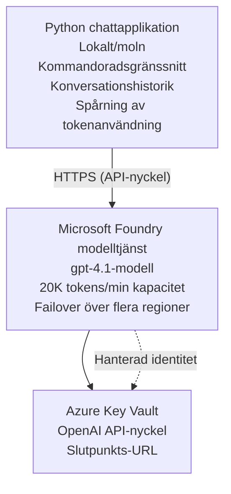

# Microsoft Foundry Models Chattapplikation

**Learning Path:** Intermediate ⭐⭐ | **Time:** 35-45 minutes | **Cost:** $50-200/månad

En komplett Microsoft Foundry Models chattapplikation distribuerad med Azure Developer CLI (azd). Detta exempel demonstrerar distribution av gpt-4.1, säker API-åtkomst och ett enkelt chattgränssnitt.

## 🎯 Vad du kommer att lära dig

- Distribuera Microsoft Foundry Models-tjänsten med modellen gpt-4.1
- Skydda OpenAI API-nycklar med Key Vault
- Bygga ett enkelt chattgränssnitt med Python
- Övervaka tokenanvändning och kostnader
- Implementera hastighetsbegränsning och felhantering

## 📦 Vad som ingår

✅ **Microsoft Foundry Models Service** - distribution av modellen gpt-4.1  
✅ **Python Chat App** - Enkel kommandoradschatt  
✅ **Key Vault Integration** - Säker lagring av API-nyckel  
✅ **ARM Templates** - Komplett infrastruktur som kod  
✅ **Cost Monitoring** - Spårning av tokenanvändning  
✅ **Rate Limiting** - Förhindra uttömning av kvoter  

## Arkitektur


## Förutsättningar

### Obligatoriskt

- **Azure Developer CLI (azd)** - [Install guide](https://learn.microsoft.com/azure/developer/azure-developer-cli/install-azd)
- **Azure subscription** with OpenAI access - [Request access](https://aka.ms/oai/access)
- **Python 3.9+** - [Install Python](https://www.python.org/downloads/)

### Verifiera förutsättningar

```bash
# Kontrollera azd-versionen (kräver 1.5.0 eller högre)
azd version

# Verifiera Azure-inloggning
azd auth login

# Kontrollera Python-versionen
python --version  # eller python3 --version

# Verifiera OpenAI-åtkomst (kontrollera i Azure-portalen)
az cognitiveservices account list-skus \
  --kind OpenAI \
  --location eastus
```

> **⚠️ Viktigt:** Microsoft Foundry Models kräver godkännande av ansökan. Om du inte har ansökt, besök [aka.ms/oai/access](https://aka.ms/oai/access). Godkännande tar vanligtvis 1-2 arbetsdagar.

## ⏱️ Distribueringsschema

| Phase | Duration | What Happens |
|-------|----------|--------------|
| Prerequisites check | 2-3 minutes | Verify OpenAI quota availability |
| Deploy infrastructure | 8-12 minutes | Create OpenAI, Key Vault, model deployment |
| Configure application | 2-3 minutes | Set up environment and dependencies |
| **Total** | **12-18 minutes** | Ready to chat with gpt-4.1 |

**Obs:** Första distributionen av OpenAI kan ta längre tid på grund av modellprovisionering.

## Snabbstart

```bash
# Gå till exemplet
cd examples/azure-openai-chat

# Initiera miljön
azd env new myopenai

# Distribuera allt (infrastruktur + konfiguration)
azd up
# Du blir ombedd att:
# 1. Välj en Azure-prenumeration
# 2. Välj en plats där OpenAI är tillgängligt (t.ex. eastus, eastus2, westus)
# 3. Vänta 12–18 minuter på distributionen

# Installera Python-beroenden
pip install -r requirements.txt

# Börja chatta!
python chat.py
```

**Förväntad utdata:**
```
🤖 Microsoft Foundry Models Chat Application
Connected to: gpt-4.1 (eastus)
Type your message (or 'quit' to exit)

You: Hello! Tell me about Microsoft Foundry Models.
Assistant: Microsoft Foundry Models Service provides REST API access to OpenAI's powerful language models including gpt-4.1, GPT-3.5-Turbo, and Embeddings...

[Tokens used: 145 | Estimated cost: $0.0044]
```

## ✅ Verifiera distribution

### Steg 1: Kontrollera Azure-resurser

```bash
# Visa distribuerade resurser
azd show

# Förväntad utdata visar:
# - OpenAI-tjänst: (resursnamn)
# - Nyckelvalv: (resursnamn)
# - Distribution: gpt-4.1
# - Plats: eastus (eller din valda region)
```

### Steg 2: Testa OpenAI-API

```bash
# Hämta OpenAI-slutpunkt och nyckel
OPENAI_ENDPOINT=$(azd env get-value AZURE_OPENAI_ENDPOINT)
OPENAI_KEY=$(azd env get-value AZURE_OPENAI_API_KEY)

# Testa API-anrop
curl "$OPENAI_ENDPOINT/openai/deployments/gpt-4.1/chat/completions?api-version=2024-08-01-preview" \
  -H "Content-Type: application/json" \
  -H "api-key: $OPENAI_KEY" \
  -d '{
    "messages": [{"role": "user", "content": "Say hello!"}],
    "max_tokens": 50
  }'
```

**Förväntat svar:**
```json
{
  "choices": [
    {
      "message": {
        "role": "assistant",
        "content": "Hello! How can I assist you today?"
      }
    }
  ],
  "usage": {
    "prompt_tokens": 8,
    "completion_tokens": 9,
    "total_tokens": 17
  }
}
```

### Steg 3: Verifiera åtkomst till Key Vault

```bash
# Lista hemligheter i Key Vault
KV_NAME=$(azd env get-value AZURE_KEY_VAULT_NAME)

az keyvault secret list \
  --vault-name $KV_NAME \
  --query "[].name" \
  --output table
```

**Förväntade hemligheter:**
- `openai-api-key`
- `openai-endpoint`

**Framgångskriterier:**
- ✅ OpenAI service deployed with gpt-4.1
- ✅ API-anrop returnerar giltigt svar
- ✅ Hemligheter lagrade i Key Vault
- ✅ Spårning av token-användning fungerar

## Projektstruktur

```
azure-openai-chat/
├── README.md                   ✅ This guide
├── azure.yaml                  ✅ AZD configuration
├── infra/                      ✅ Infrastructure as Code
│   ├── main.bicep             ✅ Main Bicep template
│   ├── main.parameters.json   ✅ Parameters
│   └── openai.bicep           ✅ OpenAI resource definition
├── src/                        ✅ Application code
│   ├── chat.py                ✅ Chat interface
│   ├── config.py              ✅ Configuration loader
│   └── requirements.txt       ✅ Python dependencies
└── .gitignore                  ✅ Git ignore rules
```

## Applikationens funktioner

### Chattgränssnitt (`chat.py`)

Chattapplikationen innehåller:

- **Conversation History** - Behåller kontext över meddelanden
- **Token Counting** - Spårar användning och uppskattar kostnader
- **Error Handling** - Hantering av hastighetsbegränsningar och API-fel på ett smidigt sätt
- **Cost Estimation** - Realtidsberäkning per meddelande
- **Streaming Support** - Valfria strömmade svar

### Kommandon

När du chattar kan du använda:
- `quit` or `exit` - Avsluta sessionen
- `clear` - Rensa konversationshistoriken
- `tokens` - Visa total tokenanvändning
- `cost` - Visa uppskattad total kostnad

### Konfiguration (`config.py`)

Laddar konfiguration från miljövariabler:
```python
AZURE_OPENAI_ENDPOINT  # Från Key Vault
AZURE_OPENAI_API_KEY   # Från Key Vault
AZURE_OPENAI_MODEL     # Standard: gpt-4.1
AZURE_OPENAI_MAX_TOKENS # Standard: 800
```

## Användningsexempel

### Grundläggande chatt

```bash
python chat.py
```

### Chatt med anpassad modell

```bash
export AZURE_OPENAI_MODEL=gpt-35-turbo
python chat.py
```

### Chatt med streaming

```bash
python chat.py --stream
```

### Exempelkonversation

```
You: Explain Microsoft Foundry Models Service in 3 sentences.
Assistant: Microsoft Foundry Models Service is Microsoft Azure's cloud platform offering 
that provides access to OpenAI's powerful language models. It enables developers 
to integrate capabilities like gpt-4.1 into their applications with enterprise-grade 
security and compliance. The service includes features for content filtering, 
abuse monitoring, and responsible AI practices.

[Tokens used: 89 | Estimated cost: $0.0027]

You: What models are available?
Assistant: Microsoft Foundry Models Service offers several model families including gpt-4.1 
(most capable), GPT-3.5-Turbo (faster and cost-effective), and Embeddings models 
for vector search. Each model has different capabilities, pricing, and token limits.

[Tokens used: 67 | Estimated cost: $0.0020]

Total session: 156 tokens | $0.0047
```

## Kostnadshantering

### Tokenpriser (gpt-4.1)

| Model | Input (per 1K tokens) | Output (per 1K tokens) |
|-------|----------------------|------------------------|
| gpt-4.1 | $0.03 | $0.06 |
| GPT-3.5-Turbo | $0.0015 | $0.002 |

### Uppskattade månadskostnader

Baserat på användningsmönster:

| Usage Level | Messages/Day | Tokens/Day | Monthly Cost |
|-------------|--------------|------------|--------------|
| **Light** | 20 messages | 3,000 tokens | $3-5 |
| **Moderate** | 100 messages | 15,000 tokens | $15-25 |
| **Heavy** | 500 messages | 75,000 tokens | $75-125 |

**Basinfrastrukturkostnad:** $1-2/månad (Key Vault + minimal beräkningsresurs)

### Tips för kostnadsoptimering

```bash
# 1. Använd GPT-3.5-Turbo för enklare uppgifter (20 gånger billigare)
export AZURE_OPENAI_MODEL=gpt-35-turbo

# 2. Minska maxantalet tokens för kortare svar
export AZURE_OPENAI_MAX_TOKENS=400

# 3. Övervaka tokenanvändning
python chat.py --show-tokens

# 4. Ställ in budgetvarningar
az consumption budget create \
  --budget-name "openai-budget" \
  --amount 50 \
  --time-grain Monthly
```

## Övervakning

### Visa tokenanvändning

```bash
# I Azure-portalen:
# OpenAI-resurs → Mätvärden → Välj "Token Transaction"

# Eller via Azure CLI:
az monitor metrics list \
  --resource $(azd env get-value AZURE_OPENAI_RESOURCE_ID) \
  --metric "TokenTransaction" \
  --start-time $(date -u -d '1 hour ago' '+%Y-%m-%dT%H:%M:%S') \
  --interval PT1M
```

### Visa API-loggar

```bash
# Strömma diagnostiska loggar
az monitor diagnostic-settings create \
  --resource $(azd env get-value AZURE_OPENAI_RESOURCE_ID) \
  --name openai-logs \
  --logs '[{"category": "Audit", "enabled": true}]' \
  --workspace $(azd env get-value LOG_ANALYTICS_WORKSPACE_ID)

# Förfrågningsloggar
az monitor log-analytics query \
  --workspace $(azd env get-value LOG_ANALYTICS_WORKSPACE_ID) \
  --analytics-query "AzureDiagnostics | where Category == 'Audit' | top 10 by TimeGenerated"
```

## Felsökning

### Issue: "Access Denied" Error

**Symptom:** 403 Forbidden när du anropar API

**Lösningar:**
```bash
# 1. Verifiera att OpenAI-åtkomst är godkänd
az cognitiveservices account show \
  --name $(azd env get-value AZURE_OPENAI_NAME) \
  --resource-group $(azd env get-value AZURE_RESOURCE_GROUP)

# 2. Kontrollera att API-nyckeln är korrekt
azd env get-value AZURE_OPENAI_API_KEY

# 3. Verifiera formatet för endpoint-URL
azd env get-value AZURE_OPENAI_ENDPOINT
# Bör vara: https://[name].openai.azure.com/
```

### Issue: "Rate Limit Exceeded"

**Symptom:** 429 Too Many Requests

**Lösningar:**
```bash
# 1. Kontrollera den aktuella kvoten
az cognitiveservices account deployment show \
  --name $(azd env get-value AZURE_OPENAI_NAME) \
  --resource-group $(azd env get-value AZURE_RESOURCE_GROUP) \
  --deployment-name gpt-4.1

# 2. Begär kvotökning (vid behov)
# Gå till Azure-portalen → OpenAI-resursen → Kvoter → Begär ökning

# 3. Implementera omförsökslogik (redan i chat.py)
# Applikationen gör automatiska omförsök med exponentiell backoff
```

### Issue: "Model Not Found"

**Symptom:** 404 error för distribution

**Lösningar:**
```bash
# 1. Lista tillgängliga distributioner
az cognitiveservices account deployment list \
  --name $(azd env get-value AZURE_OPENAI_NAME) \
  --resource-group $(azd env get-value AZURE_RESOURCE_GROUP)

# 2. Verifiera modellnamnet i miljön
echo $AZURE_OPENAI_MODEL

# 3. Uppdatera till korrekt distributionsnamn
export AZURE_OPENAI_MODEL=gpt-4.1  # eller gpt-35-turbo
```

### Issue: High Latency

**Symptom:** Långa svarstider (>5 sekunder)

**Lösningar:**
```bash
# 1. Kontrollera regional latens
# Distribuera till den region som ligger närmast användarna

# 2. Minska max_tokens för snabbare svar
export AZURE_OPENAI_MAX_TOKENS=400

# 3. Använd streaming för bättre användarupplevelse
python chat.py --stream
```

## Bästa säkerhetspraxis

### 1. Protect API Keys

```bash
# Lägg aldrig in nycklar i versionskontrollen
# Använd Key Vault (redan konfigurerat)

# Rotera nycklar regelbundet
az cognitiveservices account keys regenerate \
  --name $(azd env get-value AZURE_OPENAI_NAME) \
  --resource-group $(azd env get-value AZURE_RESOURCE_GROUP) \
  --key-name key1
```

### 2. Implement Content Filtering

```python
# Microsoft Foundry Models innehåller inbyggd innehållsfiltrering
# Konfigurera i Azure-portalen:
# OpenAI-resurs → Innehållsfilter → Skapa anpassat filter

# Kategorier: Hat, Sexuellt, Våld, Självskada
# Nivåer: Låg, Medel, Hög filtrering
```

### 3. Use Managed Identity (Production)

```bash
# För produktionsdriftsättningar, använd en hanterad identitet
# istället för API-nycklar (kräver att appen körs på Azure)

# Uppdatera infra/openai.bicep för att inkludera:
# identity: { type: 'SystemAssigned' }
```

## Utveckling

### Kör lokalt

```bash
# Installera beroenden
pip install -r src/requirements.txt

# Ställ in miljövariabler
export AZURE_OPENAI_ENDPOINT="https://[name].openai.azure.com/"
export AZURE_OPENAI_API_KEY="your-api-key"
export AZURE_OPENAI_MODEL="gpt-4.1"

# Kör applikationen
python src/chat.py
```

### Kör tester

```bash
# Installera testberoenden
pip install pytest pytest-cov

# Kör tester
pytest tests/ -v

# Med kodtäckning
pytest tests/ --cov=src --cov-report=html
```

### Uppdatera modelldistribution

```bash
# Distribuera en annan modellversion
az cognitiveservices account deployment create \
  --name $(azd env get-value AZURE_OPENAI_NAME) \
  --resource-group $(azd env get-value AZURE_RESOURCE_GROUP) \
  --deployment-name gpt-35-turbo \
  --model-name gpt-35-turbo \
  --model-version "0613" \
  --model-format OpenAI \
  --sku-capacity 20 \
  --sku-name "Standard"
```

## Rensa upp

```bash
# Ta bort alla Azure-resurser
azd down --force --purge

# Detta tar bort:
# - OpenAI-tjänst
# - Key Vault (med 90 dagars mjuk borttagning)
# - Resursgrupp
# - Alla distributioner och konfigurationer
```

## Nästa steg

### Utöka detta exempel

1. **Add Web Interface** - Build React/Vue frontend
   ```bash
   # Lägg till frontendtjänst i azure.yaml
   # Distribuera till Azure Static Web Apps
   ```

2. **Implement RAG** - Add document search with Azure AI Search
   ```python
   # Integrera Azure Cognitive Search
   # Ladda upp dokument och skapa ett vektorindex
   ```

3. **Add Function Calling** - Enable tool use
   ```python
   # Definiera funktioner i chat.py
   # Låt gpt-4.1 anropa externa API:er
   ```

4. **Multi-Model Support** - Deploy multiple models
   ```bash
   # Lägg till gpt-35-turbo och inbäddningsmodeller
   # Implementera modellroutningslogik
   ```

### Relaterade exempel

- **[Retail Multi-Agent](../retail-scenario.md)** - Advanced multi-agent architecture
- **[Database App](../../../../examples/database-app)** - Add persistent storage
- **[Container Apps](../../../../examples/container-app)** - Deploy as containerized service

### Lärresurser

- 📚 [AZD For Beginners Course](../../README.md) - Huvudsida för kursen
- 📚 [Microsoft Foundry Models Documentation](https://learn.microsoft.com/azure/ai-services/openai/) - Officiell dokumentation
- 📚 [OpenAI API Reference](https://platform.openai.com/docs/api-reference) - API-detaljer
- 📚 [Responsible AI](https://www.microsoft.com/ai/responsible-ai) - Bästa praxis

## Ytterligare resurser

### Dokumentation
- **[Microsoft Foundry Models Service](https://learn.microsoft.com/azure/ai-services/openai/)** - Komplett guide
- **[gpt-4.1 Models](https://learn.microsoft.com/azure/ai-services/openai/concepts/models)** - Modellkapabiliteter
- **[Content Filtering](https://learn.microsoft.com/azure/ai-services/openai/concepts/content-filter)** - Säkerhetsfunktioner
- **[Azure Developer CLI](https://learn.microsoft.com/azure/developer/azure-developer-cli/)** - azd-referens

### Guider
- **[OpenAI Quickstart](https://learn.microsoft.com/azure/ai-services/openai/quickstart)** - Första distributionen
- **[Chat Completions](https://learn.microsoft.com/azure/ai-services/openai/how-to/chatgpt)** - Bygga chattappar
- **[Function Calling](https://learn.microsoft.com/azure/ai-services/openai/how-to/function-calling)** - Avancerade funktioner

### Verktyg
- **[Microsoft Foundry Models Studio](https://oai.azure.com/)** - Webbaserad playground
- **[Prompt Engineering Guide](https://platform.openai.com/docs/guides/prompt-engineering)** - Skriva bättre prompts
- **[Token Calculator](https://platform.openai.com/tokenizer)** - Uppskatta tokenanvändning

### Community
- **[Azure AI Discord](https://discord.gg/azure)** - Få hjälp från communityn
- **[GitHub Discussions](https://github.com/Azure-Samples/openai/discussions)** - Frågor och svar
- **[Azure Blog](https://azure.microsoft.com/blog/tag/azure-openai-service/)** - Senaste uppdateringarna

---

**🎉 Success!** Du har distribuerat Microsoft Foundry Models och byggt en fungerande chattapplikation. Börja utforska gpt-4.1:s kapabiliteter och experimentera med olika prompts och användningsfall.

**Frågor?** [Open an issue](https://github.com/microsoft/AZD-for-beginners/issues) eller kolla [FAQ](../../resources/faq.md)

**Kostnadsvarning:** Kom ihåg att köra `azd down` när du är klar med testningen för att undvika löpande avgifter (~$50-100/månad för aktiv användning).

---

<!-- CO-OP TRANSLATOR DISCLAIMER START -->
Ansvarsfriskrivning:
Detta dokument har översatts med hjälp av AI-översättningstjänsten [Co-op Translator](https://github.com/Azure/co-op-translator). Vi strävar efter korrekthet, men var medveten om att automatiska översättningar kan innehålla fel eller felaktigheter. Det ursprungliga dokumentet på dess originalspråk bör betraktas som den auktoritativa källan. För kritisk information rekommenderas professionell mänsklig översättning. Vi ansvarar inte för några missförstånd eller feltolkningar som uppstår till följd av användningen av denna översättning.
<!-- CO-OP TRANSLATOR DISCLAIMER END -->