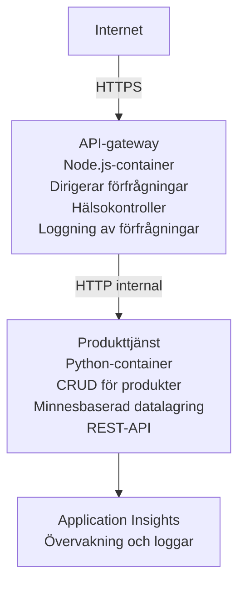

# Microservicesarkitektur - Container App-exempel

⏱️ **Uppskattad tid**: 25-35 minuter | 💰 **Uppskattad kostnad**: ~$50-100/month | ⭐ **Komplexitet**: Avancerad

En **förenklad men fungerande** microservices-arkitektur distribuerad till Azure Container Apps med AZD CLI. Detta exempel demonstrerar tjänst-till-tjänst-kommunikation, containerorkestrering och övervakning med en praktisk lösning med 2 tjänster.

> **📚 Inlärningsmetod**: Detta exempel börjar med en minimal 2-tjänsters arkitektur (API Gateway + Backend-tjänst) som du faktiskt kan distribuera och lära dig av. Efter att ha bemästrat denna grund ger vi vägledning för att expandera till ett komplett mikrotjänst-ekosystem.

## Vad du kommer att lära dig

Genom att slutföra detta exempel kommer du att:
- Distribuera flera containers till Azure Container Apps
- Implementera tjänst-till-tjänst-kommunikation med intern nätverkstrafik
- Konfigurera miljöbaserad skalning och hälsokontroller
- Övervaka distribuerade applikationer med Application Insights
- Förstå distributionsmönster och bästa praxis för mikrotjänster
- Lära dig progressiv utbyggnad från enkel till komplex arkitektur

## Arkitektur

### Fas 1: Vad vi bygger (Inkluderat i detta exempel)


**Varför börja enkelt?**
- ✅ Distribuera och förstå snabbt (25-35 minuter)
- ✅ Lära dig kärnmönster för mikrotjänster utan komplexitet
- ✅ Körbar kod som du kan modifiera och experimentera med
- ✅ Lägre kostnad för lärande (~$50-100/month vs $300-1400/month)
- ✅ Bygg upp självförtroende innan du lägger till databaser och meddelandeköer

**Analogi**: Tänk på detta som att lära sig köra bil. Du börjar på en tom parkeringsplats (2 tjänster), bemästrar grunderna och går sedan vidare till stadstrafik (5+ tjänster med databaser).

### Fas 2: Framtida utbyggnad (Referensarkitektur)

När du bemästrar 2-tjänstersarkitekturen kan du expandera till:

```
Full Architecture (Not Included - For Reference)
├── API Gateway (✅ Included)
├── Product Service (✅ Included)
├── Order Service (🔜 Add next)
├── User Service (🔜 Add next)
├── Notification Service (🔜 Add last)
├── Azure Service Bus (🔜 For async communication)
├── Cosmos DB (🔜 For product persistence)
├── Azure SQL (🔜 For order management)
└── Azure Storage (🔜 For file storage)
```

Se avsnittet "Expansion Guide" längst ner för steg-för-steg-instruktioner.

## Funktioner som ingår

✅ **Service Discovery**: Automatisk DNS-baserad upptäckt mellan containers  
✅ **Lastbalansering**: Inbyggd lastbalansering över repliker  
✅ **Autoskalning**: Oberoende skalning per tjänst baserat på HTTP-förfrågningar  
✅ **Hälsomonitorering**: Liveness- och readiness-prober för båda tjänsterna  
✅ **Distribuerad loggning**: Centraliserad loggning med Application Insights  
✅ **Internt nätverk**: Säker tjänst-till-tjänst-kommunikation  
✅ **Containerorkestrering**: Automatisk distribution och skalning  
✅ **Uppdateringar utan driftstopp**: Rolling updates med revisionhantering  

## Förutsättningar

### Nödvändiga verktyg

Innan du börjar, verifiera att du har dessa verktyg installerade:

1. **[Azure Developer CLI (azd)](https://learn.microsoft.com/azure/developer/azure-developer-cli/install-azd)** (version 1.0.0 eller högre)
   ```bash
   azd version
   # Förväntad utdata: azd version 1.0.0 eller högre
   ```

2. **[Azure CLI](https://learn.microsoft.com/cli/azure/install-azure-cli)** (version 2.50.0 eller högre)
   ```bash
   az --version
   # Förväntad utdata: azure-cli 2.50.0 eller högre
   ```

3. **[Docker](https://www.docker.com/get-started)** (för lokal utveckling/testning - valfritt)
   ```bash
   docker --version
   # Förväntad utdata: Docker version 20.10 eller högre
   ```

### Azure-krav

- Ett aktivt **Azure subscription** ([create a free account](https://azure.microsoft.com/free/))
- Behörighet att skapa resurser i din prenumeration
- Rollen **Contributor** på prenumerationen eller resursgruppen

### Kunskapsförutsättningar

Detta är ett **avancerat** exempel. Du bör ha:
- Slutfört [Simple Flask API example](../../../../../examples/container-app/simple-flask-api) 
- Grundläggande förståelse för mikrotjänstarkitektur
- Bekantskap med REST API:er och HTTP
- Förståelse för containerkoncept

**Ny på Container Apps?** Starta med [Simple Flask API example](../../../../../examples/container-app/simple-flask-api) först för att lära dig grunderna.

## Snabbstart (Steg för steg)

### Steg 1: Klona och navigera

```bash
git clone https://github.com/microsoft/AZD-for-beginners.git
cd AZD-for-beginners/examples/container-app/microservices
```

**✓ Kontroll**: Bekräfta att du ser `azure.yaml`:
```bash
ls
# Förväntat: README.md, azure.yaml, infra/, src/
```

### Steg 2: Autentisera med Azure

```bash
azd auth login
```

Detta öppnar din webbläsare för Azure-autentisering. Logga in med dina Azure-uppgifter.

**✓ Kontroll**: Du bör se:
```
Logged in to Azure.
```

### Steg 3: Initiera miljön

```bash
azd init
```

**Frågor du kommer att få**:
- **Miljönamn**: Ange ett kort namn (t.ex. `microservices-dev`)
- **Azure-prenumeration**: Välj din prenumeration
- **Azure-plats**: Välj en region (t.ex. `eastus`, `westeurope`)

**✓ Kontroll**: Du bör se:
```
SUCCESS: New project initialized!
```

### Steg 4: Distribuera infrastruktur och tjänster

```bash
azd up
```

**Vad som händer** (tar 8-12 minuter):
1. Skapar Container Apps-environment
2. Skapar Application Insights för övervakning
3. Bygger API Gateway-container (Node.js)
4. Bygger Product Service-container (Python)
5. Distribuerar båda containrarna till Azure
6. Konfigurerar nätverk och hälsokontroller
7. Sätter upp övervakning och loggning

**✓ Kontroll**: Du bör se:
```
SUCCESS: Your application was deployed to Azure in X minutes Y seconds.
Endpoint: https://api-gateway-<unique-id>.azurecontainerapps.io
```

**⏱️ Tid**: 8-12 minuter

### Steg 5: Testa distributionen

```bash
# Hämta gateway-slutpunkten
GATEWAY_URL=$(azd env get-values | grep API_GATEWAY_URL | cut -d '=' -f2 | tr -d '"')

# Testa API-gatewayens hälsa
curl $GATEWAY_URL/health

# Förväntat resultat:
# {"status":"hälsosam","service":"api-gateway","timestamp":"2025-11-19T10:30:00Z"}
```

**Testa produkttjänsten genom API-gateway**:
```bash
# Lista produkter
curl $GATEWAY_URL/api/products

# Förväntat resultat:
# [
#   {"id":1,"name":"Bärbar dator","price":999.99,"stock":50},
#   {"id":2,"name":"Mus","price":29.99,"stock":200},
#   {"id":3,"name":"Tangentbord","price":79.99,"stock":150}
# ]
```

**✓ Kontroll**: Båda endpunkterna returnerar JSON-data utan fel.

---

**🎉 Grattis!** Du har distribuerat en mikrotjänstarkitektur till Azure!

## Projektstruktur

Alla implementationsfiler ingår—detta är ett komplett, fungerande exempel:

```
microservices/
│
├── README.md                         # This file
├── azure.yaml                        # AZD configuration
├── .gitignore                        # Git ignore patterns
│
├── infra/                           # Infrastructure as Code (Bicep)
│   ├── main.bicep                   # Main orchestration
│   ├── abbreviations.json           # Naming conventions
│   ├── core/                        # Shared infrastructure
│   │   ├── container-apps-environment.bicep  # Container environment + registry
│   │   └── monitor.bicep            # Application Insights + Log Analytics
│   └── app/                         # Service definitions
│       ├── api-gateway.bicep        # API Gateway container app
│       └── product-service.bicep    # Product Service container app
│
└── src/                             # Application source code
    ├── api-gateway/                 # Node.js API Gateway
    │   ├── app.js                   # Express server with routing
    │   ├── package.json             # Node dependencies
    │   └── Dockerfile               # Container definition
    └── product-service/             # Python Product Service
        ├── main.py                  # Flask API with product data
        ├── requirements.txt         # Python dependencies
        └── Dockerfile               # Container definition
```

**Vad varje komponent gör:**

**Infrastruktur (infra/)**:
- `main.bicep`: Orkestrerar alla Azure-resurser och deras beroenden
- `core/container-apps-environment.bicep`: Skapar Container Apps-environment och Azure Container Registry
- `core/monitor.bicep`: Sätter upp Application Insights för distribuerad loggning
- `app/*.bicep`: Individuella container app-definitioner med skalning och hälsokontroller

**API Gateway (src/api-gateway/)**:
- Publik tjänst som routar förfrågningar till backend-tjänster
- Implementerar loggning, felhantering och request-forwarding
- Demonstrerar tjänst-till-tjänst HTTP-kommunikation

**Product Service (src/product-service/)**:
- Intern tjänst med produktkatalog (i minnet för enkelhet)
- REST API med hälsokontroller
- Exempel på backend-mikrotjänstmönster

## Tjänsters översikt

### API-gateway (Node.js/Express)

**Port**: 8080  
**Åtkomst**: Publik (extern ingress)  
**Syfte**: Router inkommande förfrågningar till lämpliga backend-tjänster  

**Endpunkter**:
- `GET /` - Tjänstinformation
- `GET /health` - Hälsokontroll
- `GET /api/products` - Vidarebefordra till produkttjänsten (lista alla)
- `GET /api/products/:id` - Vidarebefordra till produkttjänsten (hämta efter ID)

**Huvudfunktioner**:
- Request-routing med axios
- Centraliserad loggning
- Felhantering och timeout-hantering
- Service discovery via miljövariabler
- Integrering med Application Insights

**Kodexempel** (`src/api-gateway/app.js`):
```javascript
// Intern kommunikation mellan tjänster
app.get('/api/products', async (req, res) => {
  const response = await axios.get(`${PRODUCT_SERVICE_URL}/products`);
  res.json(response.data);
});
```

### Produkttjänst (Python/Flask)

**Port**: 8000  
**Åtkomst**: Endast intern (ingen extern ingress)  
**Syfte**: Hanterar produktkatalog med data i minnet  

**Endpunkter**:
- `GET /` - Tjänstinformation
- `GET /health` - Hälsokontroll
- `GET /products` - Lista alla produkter
- `GET /products/<id>` - Hämta produkt efter ID

**Huvudfunktioner**:
- RESTful API med Flask
- Produktlager i minnet (enkelt, ingen databas behövs)
- Hälsomonitorering med prober
- Strukturerad loggning
- Integrering med Application Insights

**Datamodell**:
```python
{
  "id": 1,
  "name": "Laptop",
  "description": "High-performance laptop",
  "price": 999.99,
  "stock": 50
}
```

**Varför endast internt?**
Produkttjänsten exponeras inte publikt. Alla förfrågningar måste gå genom API-gatewayen, som erbjuder:
- Säkerhet: Kontrollerad åtkomstpunkt
- Flexibilitet: Kan byta backend utan att påverka klienter
- Övervakning: Centraliserad förfrågningsloggning

## Förstå tjänstekommunikation

### Hur tjänster kommunicerar med varandra

I detta exempel kommunicerar API-gatewayen med produkttjänsten via **interna HTTP-anrop**:

```javascript
// API-gateway (src/api-gateway/app.js)
const PRODUCT_SERVICE_URL = process.env.PRODUCT_SERVICE_URL;

// Gör intern HTTP-begäran
const response = await axios.get(`${PRODUCT_SERVICE_URL}/products`);
```

**Viktiga punkter**:

1. **DNS-baserad upptäckt**: Container Apps tillhandahåller automatiskt DNS för interna tjänster
   - Product Service FQDN: `product-service.internal.<environment>.azurecontainerapps.io`
   - Förenklat som: `http://product-service` (Container Apps löser detta)

2. **Ingen publik exponering**: Product Service har `external: false` i Bicep
   - Endast åtkomlig inom Container Apps-environmentet
   - Kan inte nås från internet

3. **Miljövariabler**: Tjänst-URL:er injiceras vid distribution
   - Bicep skickar den interna FQDN till gatewayen
   - Inga hårdkodade URL:er i applikationskoden

**Analogi**: Tänk på detta som kontorsrum. API-gatewayen är receptionen (publik), och produkttjänsten är ett kontorsrum (endast internt). Besökare måste gå via receptionen för att nå något kontor.

## Distributionsalternativ

### Fullständig distribution (rekommenderas)

```bash
# Distribuera infrastrukturen och båda tjänsterna
azd up
```

Detta distribuerar:
1. Container Apps-environment
2. Application Insights
3. Container Registry
4. API Gateway-container
5. Product Service-container

**Tid**: 8-12 minuter

### Distribuera enskild tjänst

```bash
# Distribuera endast en tjänst (efter första azd up)
azd deploy api-gateway

# Eller distribuera produkttjänsten
azd deploy product-service
```

**Användningsfall**: När du uppdaterat koden i en tjänst och vill distribuera endast den tjänsten.

### Uppdatera konfiguration

```bash
# Ändra skalningsparametrar
azd env set GATEWAY_MAX_REPLICAS 30

# Distribuera om med ny konfiguration
azd up
```

## Konfiguration

### Skalningskonfiguration

Båda tjänsterna är konfigurerade med HTTP-baserad autoskalning i sina Bicep-filer:

**API Gateway**:
- Minsta repliker: 2 (alltid minst 2 för tillgänglighet)
- Max repliker: 20
- Skalnings-trigger: 50 samtidiga förfrågningar per replika

**Product Service**:
- Minsta repliker: 1 (kan skalas till noll om det behövs)
- Max repliker: 10
- Skalnings-trigger: 100 samtidiga förfrågningar per replika

**Anpassa skalning** (i `infra/app/*.bicep`):
```bicep
scale: {
  minReplicas: 1
  maxReplicas: 10
  rules: [
    {
      name: 'http-scale-rule'
      http: {
        metadata: {
          concurrentRequests: '100'  // Adjust this
        }
      }
    }
  ]
}
```

### Resursallokering

**API Gateway**:
- CPU: 1.0 vCPU
- Minne: 2 GiB
- Orsak: Hanterar all extern trafik

**Product Service**:
- CPU: 0.5 vCPU
- Minne: 1 GiB
- Orsak: Lättviktiga operationer i minnet

### Hälsokontroller

Båda tjänsterna inkluderar liveness- och readiness-prober:

```bicep
probes: [
  {
    type: 'Liveness'
    httpGet: {
      path: '/health'
      port: 8080
    }
    initialDelaySeconds: 10
    periodSeconds: 30
  }
  {
    type: 'Readiness'
    httpGet: {
      path: '/health'
      port: 8080
    }
    initialDelaySeconds: 5
    periodSeconds: 10
  }
]
```

**Vad detta innebär**:
- **Liveness**: Om hälsokontrollen misslyckas startar Container Apps om containern
- **Readiness**: Om den inte är redo slutar Container Apps routa trafik till den replikan


## Övervakning och observerbarhet

### Visa tjänstloggar

```bash
# Visa loggar med azd monitor
azd monitor --logs

# Eller använd Azure CLI för specifika Container Apps:
# Strömma loggar från API-gateway
az containerapp logs show --name api-gateway --resource-group $RG_NAME --follow

# Visa senaste loggarna för produkttjänsten
az containerapp logs show --name product-service --resource-group $RG_NAME --tail 100
```

**Förväntad utdata**:
```
[api-gateway] API Gateway listening on port 8080
[api-gateway] Product Service URL: http://product-service
[api-gateway] GET /api/products 200 - 45ms
[product-service] Retrieved 5 products
```

### Application Insights-frågor

Öppna Application Insights i Azure-portalen, och kör sedan dessa frågor:

**Hitta långsamma förfrågningar**:
```kusto
requests
| where timestamp > ago(1h)
| where duration > 1000  // Requests taking >1 second
| summarize count() by name, cloud_RoleName
| order by count_ desc
```

**Spåra tjänst-till-tjänst-anrop**:
```kusto
dependencies
| where timestamp > ago(1h)
| where type == "Http"
| project timestamp, name, target, duration, success
| order by timestamp desc
```

**Felfrekvens per tjänst**:
```kusto
exceptions
| where timestamp > ago(24h)
| summarize errorCount = count() by cloud_RoleName, type
| order by errorCount desc
```

**Förfrågningsvolym över tid**:
```kusto
requests
| where timestamp > ago(1h)
| summarize requestCount = count() by bin(timestamp, 5m), cloud_RoleName
| render timechart
```

### Öppna övervakningspanel

```bash
# Hämta Application Insights-detaljer
azd env get-values | grep APPLICATIONINSIGHTS

# Öppna övervakning i Azure-portalen
az monitor app-insights component show \
  --app $(azd env get-values | grep APPLICATIONINSIGHTS_CONNECTION_STRING | cut -d '=' -f2) \
  --resource-group $(azd env get-values | grep AZURE_RESOURCE_GROUP | cut -d '=' -f2) \
  --query "appId" -o tsv
```

### Metrik i realtid

1. Navigera till Application Insights i Azure-portalen
2. Klicka på "Live Metrics"
3. Se realtidsförfrågningar, fel och prestanda
4. Testa genom att köra: `curl $(azd env get-values | grep API_GATEWAY_URL | cut -d '=' -f2 | tr -d '"')/api/products`

## Praktiska övningar

[Obs: Se de fullständiga övningarna ovan i avsnittet "Praktiska övningar" för detaljerade steg-för-steg-övningar inklusive distributionsverifiering, datamodifiering, autoskalningstester, felhantering och att lägga till en tredje tjänst.]

## Kostnadsanalys

### Uppskattade månadskostnader (för detta exempel med 2 tjänster)

| Resurs | Konfiguration | Uppskattad kostnad |
|----------|--------------|----------------|
| API Gateway | 2-20 replicas, 1 vCPU, 2GB RAM | $30-150 |
| Product Service | 1-10 replicas, 0.5 vCPU, 1GB RAM | $15-75 |
| Container Registry | Basic tier | $5 |
| Application Insights | 1-2 GB/month | $5-10 |
| Log Analytics | 1 GB/month | $3 |
| **Totalt** | | **$58-243/month** |

**Kostnadsfördelning efter användning**:
- **Låg trafik** (test/lärande): ~$60/month
- **Måttlig trafik** (liten produktion): ~$120/month
- **Hög trafik** (perioder med hög belastning): ~$240/month

### Tips för kostnadsoptimering

1. **Skala till noll för utveckling**:
   ```bicep
   scale: {
     minReplicas: 0  // Save $30-40/month when not in use
     maxReplicas: 10
   }
   ```

2. **Använd Consumption Plan för Cosmos DB** (när du lägger till det):
   - Betala bara för det du använder
   - Ingen minimiavgift

3. **Ställ in sampling i Application Insights**:
   ```javascript
   appInsights.defaultClient.config.samplingPercentage = 50; // Välj 50 % av förfrågningarna
   ```

4. **Rensa upp när det inte behövs**:
   ```bash
   azd down
   ```

### Gratisalternativ

För lärande/testning, överväg:
- Använd Azure gratis krediter (första 30 dagarna)
- Håll antalet repliker till minimum
- Radera efter testning (inga löpande kostnader)

---

## Rensning

För att undvika löpande kostnader, ta bort alla resurser:

```bash
azd down --force --purge
```

**Bekräftelseprompt**:
```
? Total resources to delete: 6, are you sure you want to continue? (y/N)
```

Skriv `y` för att bekräfta.

**Vad som tas bort**:
- Container Apps-miljö
- Båda Container Apps (gateway och produkttjänst)
- Container Registry
- Application Insights
- Log Analytics-arbetsyta
- Resursgrupp

**✓ Verifiera rensning**:
```bash
az group list --query "[?starts_with(name,'rg-microservices')]" --output table
```

Bör returnera tomt.

---

## Utbyggnadsguide: Från 2 till 5+ tjänster

När du bemästrat denna tvåtjänsters arkitektur, här är hur du kan utöka:

### Fas 1: Lägg till databaspersistens (nästa steg)

**Lägg till Cosmos DB för Produkttjänsten**:

1. Skapa `infra/core/cosmos.bicep`:
   ```bicep
   resource cosmosAccount 'Microsoft.DocumentDB/databaseAccounts@2023-04-15' = {
     name: name
     location: location
     kind: 'GlobalDocumentDB'
     properties: {
       databaseAccountOfferType: 'Standard'
       locations: [{ locationName: location, failoverPriority: 0 }]
     }
   }
   ```

2. Uppdatera produkttjänsten att använda Cosmos DB istället för minnesbaserad data

3. Beräknad extra kostnad: ~$25/month (serverless)

### Fas 2: Lägg till tredje tjänst (orderhantering)

**Skapa Orderservice**:

1. Ny mapp: `src/order-service/` (Python/Node.js/C#)
2. Ny Bicep: `infra/app/order-service.bicep`
3. Uppdatera API Gateway för att routa `/api/orders`
4. Lägg till Azure SQL Database för orderpersistens

**Arkitektur blir**:
```
API Gateway → Product Service (Cosmos DB)
           → Order Service (Azure SQL)
```

### Fas 3: Lägg till asynkron kommunikation (Service Bus)

**Implementera händelsestyrd arkitektur**:

1. Lägg till Azure Service Bus: `infra/core/servicebus.bicep`
2. Produkttjänsten publicerar "ProductCreated"-händelser
3. Orderservicen prenumererar på produkthändelser
4. Lägg till Notificationsservice för att hantera händelser

**Mönster**: Request/Response (HTTP) + Händelsestyrt (Service Bus)

### Fas 4: Lägg till användarautentisering

**Implementera användartjänst**:

1. Skapa `src/user-service/` (Go/Node.js)
2. Lägg till Azure AD B2C eller anpassad JWT-autentisering
3. API Gateway validerar tokens
4. Tjänster kontrollerar användarbehörigheter

### Fas 5: Produktionsberedskap

**Lägg till dessa komponenter**:
- Azure Front Door (global lastbalansering)
- Azure Key Vault (hemlighetshantering)
- Azure Monitor Workbooks (anpassade dashboards)
- CI/CD-pipeline (GitHub Actions)
- Blue-green-distributioner
- Managed Identity för alla tjänster

**Fullständig produktionsarkitektur kostnad**: ~$300-1,400/month

---

## Läs mer

### Relaterad dokumentation
- [Azure Container Apps Documentation](https://learn.microsoft.com/azure/container-apps/)
- [Microservices Architecture Guide](https://learn.microsoft.com/azure/architecture/guide/architecture-styles/microservices)
- [Application Insights for Distributed Tracing](https://learn.microsoft.com/azure/azure-monitor/app/distributed-tracing)
- [Azure Developer CLI Documentation](https://learn.microsoft.com/azure/developer/azure-developer-cli/)

### Nästa steg i den här kursen
- ← Föregående: [Simple Flask API](../../../../../examples/container-app/simple-flask-api) - Nybörjare: exempel med en enda container
- → Nästa: [AI Integration Guide](../../../../../examples/docs/ai-foundry) - Lägg till AI-funktioner
- 🏠 [Course Home](../../README.md)

### Jämförelse: När ska man använda vad

**Enkel Container-app** (Exempel: Simple Flask API):
- ✅ Enkla applikationer
- ✅ Monolitisk arkitektur
- ✅ Snabb att distribuera
- ❌ Begränsad skalbarhet
- **Kostnad**: ~$15-50/month

**Mikrotjänster** (Detta exempel):
- ✅ Komplexa applikationer
- ✅ Oberoende skalning per tjänst
- ✅ Teamautonomi (olika tjänster, olika team)
- ❌ Mer komplext att hantera
- **Kostnad**: ~$60-250/month

**Kubernetes (AKS)**:
- ✅ Maximalt kontroll och flexibilitet
- ✅ Portabilitet över flera moln
- ✅ Avancerad nätverkshantering
- ❌ Kräver Kubernetes-expertis
- **Kostnad**: ~$150-500/month minimum

**Rekommendation**: Börja med Container Apps (detta exempel), gå över till AKS endast om du behöver Kubernetes-specifika funktioner.

---

## Vanliga frågor

**F: Varför bara 2 tjänster istället för 5+?**  
Svar: Pedagogisk progression. Bemästra grunderna (tjänstkommunikation, övervakning, skalning) med ett enkelt exempel innan du lägger till komplexitet. Mönstren du lär dig här gäller även för arkitekturer med 100 tjänster.

**F: Kan jag lägga till fler tjänster själv?**  
Svar: Absolut! Följ utbyggnadsguiden ovan. Varje ny tjänst följer samma mönster: skapa src-mapp, skapa Bicep-fil, uppdatera azure.yaml, distribuera.

**F: Är detta produktionsklart?**  
Svar: Det är en stabil grund. För produktion, lägg till: managed identity, Key Vault, persistenta databaser, CI/CD-pipeline, övervakningslarm och backupstrategi.

**F: Varför inte använda Dapr eller annan service mesh?**  
Svar: Håll det enkelt för lärande. När du väl förstår inbyggd Container Apps-nätverkshantering kan du lägga till Dapr för avancerade scenarier.

**F: Hur felsöker jag lokalt?**  
Svar: Kör tjänster lokalt med Docker:
```bash
cd src/api-gateway
docker build -t local-gateway .
docker run -p 8080:8080 -e PRODUCT_SERVICE_URL=http://localhost:8000 local-gateway
```

**F: Kan jag använda olika programmeringsspråk?**  
Svar: Ja! Detta exempel visar Node.js (gateway) + Python (produktstjänst). Du kan blanda vilka språk som helst som körs i containrar.

**F: Vad gör jag om jag inte har Azure-krediter?**  
Svar: Använd Azures kostnadsfria nivå (första 30 dagarna för nya konton) eller distribuera för korta testperioder och radera omedelbart.

---

> **🎓 Sammanfattning av inlärningsvägen**: Du har lärt dig att distribuera en fler-tjänsters arkitektur med automatisk skalning, intern nätverkshantering, centraliserad övervakning och produktionsklara mönster. Denna grund förbereder dig för komplexa distribuerade system och företagsmikrotjänstarkitekturer.

**📚 Kursnavigering:**
- ← Föregående: [Simple Flask API](../../../../../examples/container-app/simple-flask-api)
- → Nästa: [Database Integration Example](../../../../../examples/database-app)
- 🏠 [Course Home](../../../README.md)
- 📖 [Container Apps Best Practices](../../../docs/chapter-04-infrastructure/deployment-guide.md)

---

<!-- CO-OP TRANSLATOR DISCLAIMER START -->
**Ansvarsfriskrivning**:
Detta dokument har översatts med hjälp av AI-översättningstjänsten [Co-op Translator](https://github.com/Azure/co-op-translator). Även om vi strävar efter noggrannhet, observera att automatiska översättningar kan innehålla fel eller brister. Det ursprungliga dokumentet på dess originalspråk bör betraktas som den auktoritativa källan. För kritisk information rekommenderas professionell mänsklig översättning. Vi ansvarar inte för några missförstånd eller feltolkningar som uppstår till följd av användningen av denna översättning.
<!-- CO-OP TRANSLATOR DISCLAIMER END -->