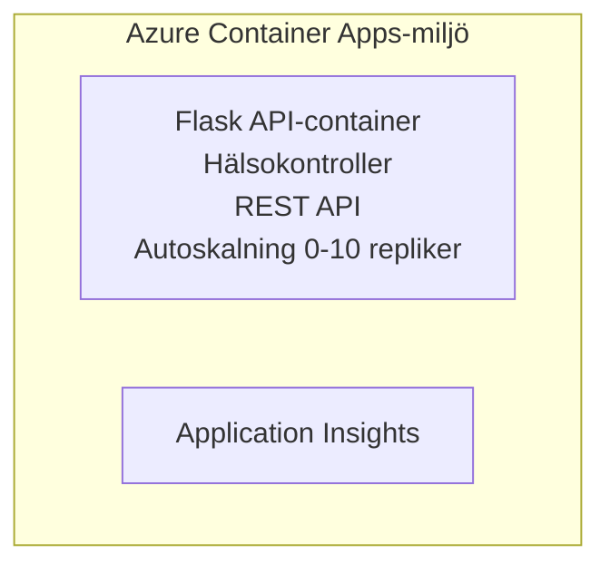

# Simple Flask API - Container App Example

**Learning Path:** Beginner ⭐ | **Time:** 25-35 minutes | **Cost:** $0-15/month

En komplett, fungerande Python Flask REST API distribuerad till Azure Container Apps med Azure Developer CLI (azd). Detta exempel visar distribution av container, autoskalning och grundläggande övervakning.

## 🎯 What You'll Learn

- Distribuera en containeriserad Python-applikation till Azure
- Konfigurera autoskalning med scale-to-zero
- Implementera health probes och readiness checks
- Övervaka applikationsloggar och metrik
- Använd Azure Developer CLI för snabb distribution

## 📦 What's Included

✅ **Flask Application** - Komplett REST API med CRUD-operationer (`src/app.py`)  
✅ **Dockerfile** - Produktionsklar containerkonfiguration  
✅ **Bicep Infrastructure** - Container Apps-miljö och API-distribution  
✅ **AZD Configuration** - Enkommands distributionssetup  
✅ **Health Probes** - Liveness och readiness checks konfigurerade  
✅ **Auto-scaling** - 0-10 repliker baserat på HTTP-belastning  

## Architecture


## Prerequisites

### Required
- **Azure Developer CLI (azd)** - [Install guide](https://learn.microsoft.com/azure/developer/azure-developer-cli/install-azd)
- **Azure subscription** - [Free account](https://azure.microsoft.com/free/)
- **Docker Desktop** - [Install Docker](https://www.docker.com/products/docker-desktop/) (för lokal testning)

### Verify Prerequisites

```bash
# Kontrollera azd-version (kräver 1.5.0 eller högre)
azd version

# Verifiera Azure-inloggning
azd auth login

# Kontrollera Docker (valfritt, för lokal testning)
docker --version
```

## ⏱️ Deployment Timeline

| Phase | Duration | What Happens |
|-------|----------|--------------||
| Environment setup | 30 seconds | Create azd environment |
| Build container | 2-3 minutes | Docker build Flask app |
| Provision infrastructure | 3-5 minutes | Create Container Apps, registry, monitoring |
| Deploy application | 2-3 minutes | Push image and deploy to Container Apps |
| **Total** | **8-12 minutes** | Complete deployment ready |

## Quick Start

```bash
# Navigera till exemplet
cd examples/container-app/simple-flask-api

# Initiera miljön (välj ett unikt namn)
azd env new myflaskapi

# Distribuera allt (infrastruktur + applikation)
azd up
# Du kommer att uppmanas att:
# 1. Välj Azure-prenumeration
# 2. Välj plats (t.ex. eastus2)
# 3. Vänta 8-12 minuter för distributionen

# Hämta din API-slutpunkt
azd env get-values

# Testa API:t
curl $(azd env get-value API_ENDPOINT)/health
```

**Expected Output:**
```json
{
  "status": "healthy",
  "timestamp": "2025-11-19T10:30:00Z",
  "service": "simple-flask-api",
  "version": "1.0.0"
}
```

## ✅ Verify Deployment

### Step 1: Check Deployment Status

```bash
# Visa utplacerade tjänster
azd show

# Förväntat utdata visar:
# - Tjänst: api
# - Slutpunkt: https://ca-api-[env].xxx.azurecontainerapps.io
# - Status: Körs
```

### Step 2: Test API Endpoints

```bash
# Hämta API-slutpunkt
API_URL=$(azd env get-value API_ENDPOINT)

# Testa hälsan
curl $API_URL/health

# Testa rotändpunkt
curl $API_URL/

# Skapa ett objekt
curl -X POST $API_URL/api/items \
  -H "Content-Type: application/json" \
  -d '{"name": "Test Item", "description": "My first item"}'

# Hämta alla objekt
curl $API_URL/api/items
```

**Success Criteria:**
- ✅ Health endpoint returns HTTP 200
- ✅ Root endpoint shows API information
- ✅ POST creates item and returns HTTP 201
- ✅ GET returns created items

### Step 3: View Logs

```bash
# Strömma live-loggar med azd monitor
azd monitor --logs

# Eller använd Azure CLI:
az containerapp logs show --name api --resource-group $RG_NAME --follow

# Du bör se:
# - Gunicorn-uppstartsmeddelanden
# - HTTP-förfrågningsloggar
# - Loggar med applikationsinformation
```

## Project Structure

```
simple-flask-api/
├── azure.yaml              # AZD configuration
├── infra/
│   ├── main.bicep         # Main infrastructure
│   ├── main.parameters.json
│   └── app/
│       ├── container-env.bicep
│       └── api.bicep
└── src/
    ├── app.py             # Flask application
    ├── requirements.txt
    └── Dockerfile
```

## API Endpoints

| Endpoint | Method | Description |
|----------|--------|-------------|
| `/health` | GET | Health check |
| `/api/items` | GET | Lista alla objekt |
| `/api/items` | POST | Skapa nytt objekt |
| `/api/items/{id}` | GET | Hämta specifikt objekt |
| `/api/items/{id}` | PUT | Uppdatera objekt |
| `/api/items/{id}` | DELETE | Ta bort objekt |

## Configuration

### Environment Variables

```bash
# Ställ in anpassad konfiguration
azd env set PORT 8000
azd env set LOG_LEVEL info
azd env set MAX_REPLICAS 20
```

### Scaling Configuration

API:et skalar automatiskt baserat på HTTP-trafik:
- **Min Replicas**: 0 (skalar till noll när inaktiv)
- **Max Replicas**: 10
- **Concurrent Requests per Replica**: 50

## Development

### Run Locally

```bash
# Installera beroenden
cd src
pip install -r requirements.txt

# Kör appen
python app.py

# Testa lokalt
curl http://localhost:8000/health
```

### Build and Test Container

```bash
# Bygg Docker-avbildning
docker build -t flask-api:local ./src

# Kör container lokalt
docker run -p 8000:8000 flask-api:local

# Testa container
curl http://localhost:8000/health
```

## Deployment

### Full Deployment

```bash
# Distribuera infrastruktur och applikation
azd up
```

### Code-Only Deployment

```bash
# Distribuera endast applikationskod (infrastrukturen oförändrad)
azd deploy api
```

### Update Configuration

```bash
# Uppdatera miljövariabler
azd env set API_KEY "new-api-key"

# Distribuera om med ny konfiguration
azd deploy api
```

## Monitoring

### View Logs

```bash
# Strömma loggar i realtid med azd monitor
azd monitor --logs

# Eller använd Azure CLI för Container Apps:
az containerapp logs show --name api --resource-group $RG_NAME --follow

# Visa de senaste 100 raderna
az containerapp logs show --name api --resource-group $RG_NAME --tail 100
```

### Monitor Metrics

```bash
# Öppna Azure Monitor-instrumentpanelen
azd monitor --overview

# Visa specifika mätvärden
az monitor metrics list \
  --resource $(azd show --output json | jq -r '.services.api.resourceId') \
  --metric "Requests,ResponseTime"
```

## Testing

### Health Check

```bash
curl $(azd show --output json | jq -r '.services.api.endpoint')/health
```

Expected response:
```json
{
  "status": "healthy",
  "timestamp": "2025-11-19T10:30:00Z"
}
```

### Create Item

```bash
curl -X POST $(azd show --output json | jq -r '.services.api.endpoint')/api/items \
  -H "Content-Type: application/json" \
  -d '{"name": "Test Item", "description": "A test item"}'
```

### Get All Items

```bash
curl $(azd show --output json | jq -r '.services.api.endpoint')/api/items
```

## Cost Optimization

Denna distribution använder scale-to-zero, så du betalar endast när API:et hanterar förfrågningar:

- **Idle cost**: ~$0/month (skalat till noll)
- **Active cost**: ~$0.000024/second per replica
- **Expected monthly cost** (lätt användning): $5-15

### Reduce Costs Further

```bash
# Skala ner max antal repliker för dev
azd env set MAX_REPLICAS 3

# Använd kortare timeout för inaktivitet
azd env set SCALE_TO_ZERO_TIMEOUT 300  # 5 minuter
```

## Troubleshooting

### Container Won't Start

```bash
# Kontrollera containerloggar med Azure CLI
az containerapp logs show --name api --resource-group $RG_NAME --tail 100

# Verifiera att Dockerbilden byggs lokalt
docker build -t test ./src
```

### API Not Accessible

```bash
# Verifiera att ingress är extern
az containerapp show --name api --resource-group rg-simple-flask-api \
  --query properties.configuration.ingress.external
```

### High Response Times

```bash
# Kontrollera CPU- och minnesanvändning
az monitor metrics list \
  --resource $(azd show --output json | jq -r '.services.api.resourceId') \
  --metric "CPUPercentage,MemoryPercentage"

# Skala upp resurser vid behov
az containerapp update --name api --resource-group rg-simple-flask-api \
  --cpu 1.0 --memory 2Gi
```

## Clean Up

```bash
# Ta bort alla resurser
azd down --force --purge
```

## Next Steps

### Expand This Example

1. **Add Database** - Integrera Azure Cosmos DB eller SQL Database
   ```bash
   # Lägg till Cosmos DB-modul i infra/main.bicep
   # Uppdatera app.py med databasanslutning
   ```

2. **Add Authentication** - Implementera Azure AD eller API-nycklar
   ```python
   # Lägg till autentiseringsmiddleware i app.py
   from functools import wraps
   ```

3. **Set Up CI/CD** - GitHub Actions workflow
   ```yaml
   # Create .github/workflows/deploy.yml
   name: Deploy to Azure
   on: [push]
   ```

4. **Add Managed Identity** - Säkra åtkomst till Azure-tjänster
   ```bicep
   # Update infra/app/api.bicep
   identity: { type: 'SystemAssigned' }
   ```

### Related Examples

- **[Database App](../../../../../examples/database-app)** - Komplett exempel med SQL Database
- **[Microservices](../../../../../examples/container-app/microservices)** - Flerjänstarkitektur
- **[Container Apps Master Guide](../README.md)** - Alla containermönster

### Learning Resources

- 📚 [AZD For Beginners Course](../../../README.md) - Huvudkursens startsida
- 📚 [Container Apps Patterns](../README.md) - Fler distributionsmönster
- 📚 [AZD Templates Gallery](https://azure.github.io/awesome-azd/) - Community-mallar

## Additional Resources

### Documentation
- **[Flask Documentation](https://flask.palletsprojects.com/)** - Guide för Flask-ramverket
- **[Azure Container Apps](https://learn.microsoft.com/azure/container-apps/)** - Officiell Azure-dokumentation
- **[Azure Developer CLI](https://learn.microsoft.com/azure/developer/azure-developer-cli/)** - azd kommandoreferens

### Tutorials
- **[Container Apps Quickstart](https://learn.microsoft.com/azure/container-apps/quickstart-portal)** - Distribuera din första app
- **[Python on Azure](https://learn.microsoft.com/azure/developer/python/)** - Guide för Python-utveckling
- **[Bicep Language](https://learn.microsoft.com/azure/azure-resource-manager/bicep/)** - Infrastruktur som kod

### Tools
- **[Azure Portal](https://portal.azure.com)** - Hantera resurser visuellt
- **[VS Code Azure Extension](https://marketplace.visualstudio.com/items?itemName=ms-azuretools.vscode-azurecontainerapps)** - IDE-integration

---

**🎉 Congratulations!** Du har distribuerat ett produktionsklart Flask API till Azure Container Apps med autoskalning och övervakning.

**Questions?** [Open an issue](https://github.com/microsoft/AZD-for-beginners/issues) or check the [FAQ](../../../resources/faq.md)

---

<!-- CO-OP TRANSLATOR DISCLAIMER START -->
Ansvarsfriskrivning:
Detta dokument har översatts med AI-översättningstjänsten [Co-op Translator](https://github.com/Azure/co-op-translator). Även om vi strävar efter noggrannhet bör du vara medveten om att automatiska översättningar kan innehålla fel eller felaktigheter. Originaldokumentet på dess ursprungliga språk ska betraktas som den auktoritativa källan. För kritisk information rekommenderas professionell mänsklig översättning. Vi ansvarar inte för några missförstånd eller feltolkningar som uppstår till följd av användningen av denna översättning.
<!-- CO-OP TRANSLATOR DISCLAIMER END -->