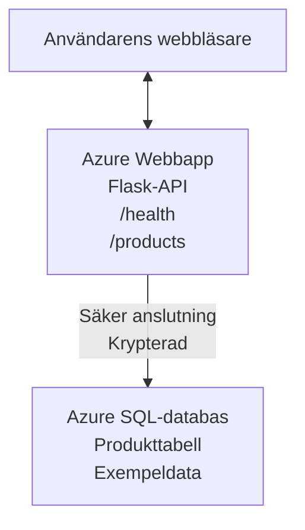

# Distribuera en Microsoft SQL-databas och webbapp med AZD

⏱️ **Beräknad tid**: 20-30 minuter | 💰 **Beräknad kostnad**: ~$15-25/month | ⭐ **Komplexitet**: Medel

Detta **kompletta, fungerande exempel** visar hur du använder [Azure Developer CLI (azd)](https://learn.microsoft.com/azure/developer/azure-developer-cli/) för att distribuera en Python Flask-webbapplikation med en Microsoft SQL-databas till Azure. All kod ingår och är testad—inga externa beroenden krävs.

## Vad du lär dig

Genom att genomföra detta exempel kommer du att:
- Distribuera en flerskiktad applikation (webbapp + databas) med infrastruktur-som-kod
- Konfigurera säkra databasanslutningar utan att hårdkoda hemligheter
- Övervaka applikationens hälsa med Application Insights
- Hantera Azure-resurser effektivt med AZD CLI
- Följa Azures bästa praxis för säkerhet, kostnadsoptimering och observerbarhet

## Översikt av scenariot
- **Web App**: Python Flask REST-API med databasanslutning
- **Database**: Azure SQL Database med exempeldata
- **Infrastructure**: Provisioneras med Bicep (modulära, återanvändbara mallar)
- **Deployment**: Fullt automatiserad med `azd`-kommandon
- **Monitoring**: Application Insights för loggar och telemetri

## Förutsättningar

### Nödvändiga verktyg

Innan du börjar, kontrollera att du har följande verktyg installerade:

1. **[Azure CLI](https://learn.microsoft.com/cli/azure/install-azure-cli)** (version 2.50.0 eller högre)
   ```sh
   az --version
   # Förväntad utdata: azure-cli 2.50.0 eller högre
   ```

2. **[Azure Developer CLI (azd)](https://learn.microsoft.com/azure/developer/azure-developer-cli/install-azd)** (version 1.0.0 eller högre)
   ```sh
   azd version
   # Förväntad utdata: azd version 1.0.0 eller högre
   ```

3. **[Python 3.8+](https://www.python.org/downloads/)** (för lokal utveckling)
   ```sh
   python --version
   # Förväntad utdata: Python 3.8 eller högre
   ```

4. **[Docker](https://www.docker.com/get-started)** (valfritt, för lokal containeriserad utveckling)
   ```sh
   docker --version
   # Förväntat utdata: Docker version 20.10 eller högre
   ```

### Azure-krav

- Ett aktivt **Azure-prenumeration** ([create a free account](https://azure.microsoft.com/free/))
- Behörighet att skapa resurser i din prenumeration
- Roll: **Owner** eller **Contributor** på prenumerationen eller resursgruppen

### Kunskapsförutsättningar

Detta är ett exempel på **mellannivå**. Du bör vara bekant med:
- Grundläggande kommandoradsoperationer
- Grundläggande molnkoncept (resurser, resursgrupper)
- Grundläggande förståelse för webbapplikationer och databaser

**Ny på AZD?** Börja med [Kom igång-guiden](../../docs/chapter-01-foundation/azd-basics.md) först.

## Arkitektur

Detta exempel distribuerar en tvålagsarkitektur med en webbapplikation och en SQL-databas:


**Distribuering av resurser:**
- **Resursgrupp**: Behållare för alla resurser
- **App Service Plan**: Linux-baserad hosting (B1-nivå för kostnadseffektivitet)
- **Web App**: Python 3.11-runtime med Flask-applikation
- **SQL Server**: Hanterad databasserver med minst TLS 1.2
- **SQL Database**: Basic-nivå (2GB, lämplig för utveckling/test)
- **Application Insights**: Övervakning och loggning
- **Log Analytics Workspace**: Centraliserad logglagring

**Analogi**: Tänk på detta som en restaurang (webbapp) med ett kylrum (databas). Kunder beställer från menyn (API-endpoints), och köket (Flask-appen) hämtar ingredienser (data) från frysen. Restaurangchefen (Application Insights) följer allting som händer.

## Mappstruktur

Alla filer ingår i detta exempel—inga externa beroenden krävs:

```
examples/database-app/
│
├── README.md                    # This file
├── azure.yaml                   # AZD configuration file
├── .env.sample                  # Sample environment variables
├── .gitignore                   # Git ignore patterns
│
├── infra/                       # Infrastructure as Code (Bicep)
│   ├── main.bicep              # Main orchestration template
│   ├── abbreviations.json      # Azure naming conventions
│   └── resources/              # Modular resource templates
│       ├── sql-server.bicep    # SQL Server configuration
│       ├── sql-database.bicep  # Database configuration
│       ├── app-service-plan.bicep  # Hosting plan
│       ├── app-insights.bicep  # Monitoring setup
│       └── web-app.bicep       # Web application
│
└── src/
    └── web/                    # Application source code
        ├── app.py              # Flask REST API
        ├── requirements.txt    # Python dependencies
        └── Dockerfile          # Container definition
```

**Vad varje fil gör:**
- **azure.yaml**: Talar om för AZD vad som ska distribueras och var
- **infra/main.bicep**: Orkestrerar alla Azure-resurser
- **infra/resources/*.bicep**: Individuella resursdefinitioner (modulära för återanvändning)
- **src/web/app.py**: Flask-applikation med databaslogik
- **requirements.txt**: Python-paketberoenden
- **Dockerfile**: Containeriseringsinstruktioner för distribution

## Snabbstart (Steg-för-steg)

### Steg 1: Klona och navigera

```sh
git clone https://github.com/microsoft/AZD-for-beginners.git
cd AZD-for-beginners/examples/database-app
```

**✓ Kontroll**: Verifiera att du ser `azure.yaml` och mappen `infra/`:
```sh
ls
# Förväntat: README.md, azure.yaml, infra/, src/
```

### Steg 2: Autentisera mot Azure

```sh
azd auth login
```

Detta öppnar din webbläsare för Azure-autentisering. Logga in med dina Azure-uppgifter.

**✓ Kontroll**: Du bör se:
```
Logged in to Azure.
```

### Steg 3: Initiera miljön

```sh
azd init
```

**Vad som händer**: AZD skapar en lokal konfiguration för din distribution.

**Frågor du får**:
- **Miljönamn**: Ange ett kort namn (t.ex. `dev`, `myapp`)
- **Azure-prenumeration**: Välj din prenumeration från listan
- **Azure-region**: Välj en region (t.ex. `eastus`, `westeurope`)

**✓ Kontroll**: Du bör se:
```
SUCCESS: New project initialized!
```

### Steg 4: Provisionera Azure-resurser

```sh
azd provision
```

**Vad som händer**: AZD distribuerar all infrastruktur (tar 5–8 minuter):
1. Skapar resursgrupp
2. Skapar SQL Server och databas
3. Skapar App Service Plan
4. Skapar Web App
5. Skapar Application Insights
6. Konfigurerar nätverk och säkerhet

**Du kommer bli ombedd att ange**:
- **SQL-adminanvändarnamn**: Ange ett användarnamn (t.ex. `sqladmin`)
- **SQL-adminlösenord**: Ange ett starkt lösenord (spara detta!)

**✓ Kontroll**: Du bör se:
```
SUCCESS: Your application was provisioned in Azure in X minutes Y seconds.
You can view the resources created under the resource group rg-<env-name> in Azure Portal:
https://portal.azure.com/#@/resource/subscriptions/.../resourceGroups/rg-<env-name>
```

**⏱️ Tid**: 5–8 minuter

### Steg 5: Distribuera applikationen

```sh
azd deploy
```

**Vad som händer**: AZD bygger och distribuerar din Flask-applikation:
1. Paketerar Python-applikationen
2. Bygger Docker-containern
3. Pushar till Azure Web App
4. Initierar databasen med exempeldata
5. Startar applikationen

**✓ Kontroll**: Du bör se:
```
SUCCESS: Your application was deployed to Azure in X minutes Y seconds.
You can view the resources created under the resource group rg-<env-name> in Azure Portal:
https://portal.azure.com/#@/resource/subscriptions/.../resourceGroups/rg-<env-name>
```

**⏱️ Tid**: 3–5 minuter

### Steg 6: Öppna applikationen i webbläsaren

```sh
azd browse
```

Detta öppnar din distribuerade webbapp i webbläsaren på `https://app-<unique-id>.azurewebsites.net`

**✓ Kontroll**: Du bör se JSON-utdata:
```json
{
  "message": "Welcome to the Database App API",
  "endpoints": {
    "/": "This help message",
    "/health": "Health check endpoint",
    "/products": "List all products",
    "/products/<id>": "Get product by ID"
  }
}
```

### Steg 7: Testa API-slutpunkterna

**Hälsokontroll** (verifiera databasanslutning):
```sh
curl https://app-<your-id>.azurewebsites.net/health
```

**Förväntat svar**:
```json
{
  "status": "healthy",
  "database": "connected"
}
```

**Lista produkter** (exempeldata):
```sh
curl https://app-<your-id>.azurewebsites.net/products
```

**Förväntat svar**:
```json
[
  {
    "id": 1,
    "name": "Laptop",
    "description": "High-performance laptop",
    "price": 1299.99,
    "created_at": "2025-11-19T10:30:00"
  },
  ...
]
```

**Hämta enstaka produkt**:
```sh
curl https://app-<your-id>.azurewebsites.net/products/1
```

**✓ Kontroll**: Alla slutpunkter returnerar JSON-data utan fel.

---

**🎉 Grattis!** Du har framgångsrikt distribuerat en webbapplikation med en databas till Azure med hjälp av AZD.

## Fördjupad konfiguration

### Miljövariabler

Hemligheter hanteras säkert via Azure App Service-konfiguration—**aldrig hårdkodade i källkoden**.

**Konfigureras automatiskt av AZD**:
- `SQL_CONNECTION_STRING`: Databasanslutning med krypterade uppgifter
- `APPLICATIONINSIGHTS_CONNECTION_STRING`: Telemetri-ändpunkt för övervakning
- `SCM_DO_BUILD_DURING_DEPLOYMENT`: Aktiverar automatisk installation av beroenden

**Var hemligheter lagras**:
1. Under `azd provision` anger du SQL-uppgifter via säkra promptar
2. AZD lagrar dessa i din lokala `.azure/<env-name>/.env`-fil (som ignoreras av git)
3. AZD injicerar dem i Azure App Service-konfigurationen (krypterat i vila)
4. Applikationen läser dem via `os.getenv()` vid körning

### Lokal utveckling

För lokal testning, skapa en `.env`-fil från mallen:

```sh
cp .env.sample .env
# Redigera .env med din lokala databasanslutning
```

**Arbetsflöde för lokal utveckling**:
```sh
# Installera beroenden
cd src/web
pip install -r requirements.txt

# Ställ in miljövariabler
export SQL_CONNECTION_STRING="your-local-connection-string"

# Kör applikationen
python app.py
```

**Testa lokalt**:
```sh
curl http://localhost:8000/health
# Förväntat: {"status": "healthy", "database": "connected"}
```

### Infrastruktur som kod

Alla Azure-resurser definieras i **Bicep-mallar** (`infra/`-mappen):

- **Modulär design**: Varje resurstyp har sin egen fil för återanvändbarhet
- **Parametriserad**: Anpassa SKUs, regioner, namngivningskonventioner
- **Bästa praxis**: Följer Azures namngivningsstandarder och säkerhetsinställningar
- **Versionshanterad**: Infrastrukturförändringar spåras i Git

**Exempel på anpassning**:
För att ändra databasnivån, redigera `infra/resources/sql-database.bicep`:
```bicep
sku: {
  name: 'Standard'  // Changed from 'Basic'
  tier: 'Standard'
  capacity: 10
}
```

## Säkerhetsriktlinjer

Detta exempel följer Azures säkerhetsriktlinjer:

### 1. **Inga hemligheter i källkod**
- ✅ Uppgifter lagras i Azure App Service-konfiguration (krypterat)
- ✅ `.env`-filer exkluderas från Git via `.gitignore`
- ✅ Hemligheter skickas via säkra parametrar under provisionering

### 2. **Krypterade anslutningar**
- ✅ TLS 1.2 som minimum för SQL Server
- ✅ Endast HTTPS tillåtet för Web App
- ✅ Databasanslutningar använder krypterade kanaler

### 3. **Nätverkssäkerhet**
- ✅ SQL Server-brandvägg konfigurerad för att tillåta endast Azure-tjänster
- ✅ Offentlig nätverksåtkomst begränsad (kan ytterligare låsas med privata slutpunkter)
- ✅ FTPS inaktiverat på Web App

### 4. **Autentisering och auktorisering**
- ⚠️ **Nuvarande**: SQL-autentisering (användarnamn/lösenord)
- ✅ **Rekommendation för produktion**: Använd Azure Managed Identity för lösenordslös autentisering

För att uppgradera till Managed Identity (för produktion):
1. Aktivera managed identity på Web App
2. Ge identiteten SQL-behörigheter
3. Uppdatera anslutningssträngen för att använda managed identity
4. Ta bort lösenordsbaserad autentisering

### 5. **Revision och efterlevnad**
- ✅ Application Insights loggar alla förfrågningar och fel
- ✅ SQL Database-revision aktiverad (kan konfigureras för efterlevnad)
- ✅ Alla resurser taggade för styrning

**Säkerhetschecklista före produktion**:
- [ ] Aktivera Azure Defender för SQL
- [ ] Konfigurera privata slutpunkter för SQL Database
- [ ] Aktivera Web Application Firewall (WAF)
- [ ] Implementera Azure Key Vault för automatisk byte av hemligheter
- [ ] Konfigurera Azure AD-autentisering
- [ ] Aktivera diagnostisk loggning för alla resurser

## Kostnadsoptimering

**Uppskattade månadskostnader** (per november 2025):

| Resurs | SKU/Nivå | Uppskattad kostnad |
|----------|----------|----------------|
| App Service Plan | B1 (Basic) | ~$13/month |
| SQL Database | Basic (2GB) | ~$5/month |
| Application Insights | Pay-as-you-go | ~$2/month (low traffic) |
| **Totalt** | | **~$20/month** |

**💡 Tips för kostnadsbesparing**:

1. **Använd gratisnivå för lärande**:
   - App Service: F1-nivå (gratis, begränsade timmar)
   - SQL Database: Använd Azure SQL Database serverlös
   - Application Insights: 5GB/månad fri ingestion

2. **Stoppa resurser när de inte används**:
   ```sh
   # Stoppa webbappen (databasen debiteras fortfarande)
   az webapp stop --name <app-name> --resource-group <rg-name>
   
   # Starta om vid behov
   az webapp start --name <app-name> --resource-group <rg-name>
   ```

3. **Radera allt efter testning**:
   ```sh
   azd down
   ```
   Detta tar bort ALLA resurser och stoppar kostnaderna.

4. **Utveckling vs. produktions-SKU**:
   - **Utveckling**: Basic-nivå (använd i detta exempel)
   - **Produktion**: Standard/Premium-nivå med redundans

**Kostnadsövervakning**:
- Visa kostnader i [Azure Cost Management](https://portal.azure.com/#view/Microsoft_Azure_CostManagement)
- Ställ in kostnadsaviseringar för att undvika överraskningar
- Tagga alla resurser med `azd-env-name` för spårning

**Alternativ med gratisnivå**:
För inlärningsändamål kan du ändra `infra/resources/app-service-plan.bicep`:
```bicep
sku: {
  name: 'F1'  // Free tier
  tier: 'Free'
}
```
**Obs**: Gratisnivån har begränsningar (60 min/dag CPU, ingen always-on).

## Övervakning och observabilitet

### Integration med Application Insights

Detta exempel inkluderar **Application Insights** för omfattande övervakning:

**Vad som övervakas**:
- ✅ HTTP-förfrågningar (latens, statuskoder, endpoints)
- ✅ Applikationsfel och undantag
- ✅ Anpassad loggning från Flask-appen
- ✅ Databasanslutningens hälsa
- ✅ Prestandamått (CPU, minne)

**Åtkomst till Application Insights**:
1. Öppna [Azure Portal](https://portal.azure.com)
2. Navigera till din resursgrupp (`rg-<env-name>`)
3. Klicka på Application Insights-resursen (`appi-<unique-id>`)

**Användbara frågor** (Application Insights → Loggar):

**Visa alla förfrågningar**:
```kusto
requests
| where timestamp > ago(1h)
| order by timestamp desc
| project timestamp, name, url, resultCode, duration
```

**Hitta fel**:
```kusto
exceptions
| where timestamp > ago(24h)
| order by timestamp desc
| project timestamp, type, outerMessage, operation_Name
```

**Kontrollera hälsoendpunkt**:
```kusto
requests
| where name contains "health"
| summarize count() by resultCode, bin(timestamp, 1h)
```

### SQL-databasrevision

**Revision för SQL-databasen är aktiverad** för att spåra:
- Databasåtkomstmönster
- Misslyckade inloggningsförsök
- Schemaändringar
- Dataåtkomst (för efterlevnad)

**Åtkomst till revisionsloggar**:
1. Azure Portal → SQL Database → Auditing
2. Visa loggar i Log Analytics-workspacen

### Realtidsövervakning

**Visa live-metrik**:
1. Application Insights → Live Metrics
2. Se förfrågningar, fel och prestanda i realtid

**Ställ in aviseringar**:
Skapa aviseringar för kritiska händelser:
- HTTP 500-fel > 5 på 5 minuter
- Databasanslutningsfel
- Höga svarstider (>2 sekunder)

**Exempel på skapande av avisering**:
```sh
az monitor metrics alert create \
  --name "High-Response-Time" \
  --resource-group <rg-name> \
  --scopes <app-insights-resource-id> \
  --condition "avg requests/duration > 2000" \
  --description "Alert when response time exceeds 2 seconds"
```

## Felsökning
### Vanliga problem och lösningar

#### 1. `azd provision` misslyckas med "Location not available"

**Symptom**:
```
Error: The subscription is not registered for the resource type 'components' in the location 'centralus'.
```

**Lösning**:
Välj en annan Azure-region eller registrera resursleverantören:
```sh
az provider register --namespace Microsoft.Insights
```

#### 2. SQL-anslutning misslyckas under distribution

**Symptom**:
```
pyodbc.OperationalError: ('08001', '[08001] [Microsoft][ODBC Driver 18 for SQL Server]TCP Provider...')
```

**Lösning**:
- Verifiera att SQL Server-brandväggen tillåter Azure-tjänster (konfigureras automatiskt)
- Kontrollera att SQL-adminlösenordet angavs korrekt under `azd provision`
- Se till att SQL Server är helt provisionerad (kan ta 2-3 minuter)

**Verifiera anslutning**:
```sh
# Från Azure-portalen, gå till SQL-databasen → frågeredigeraren
# Försök att ansluta med dina inloggningsuppgifter
```

#### 3. Webbappen visar "Application Error"

**Symptom**:
Webbläsaren visar en generisk felsida.

**Lösning**:
Kontrollera applikationsloggar:
```sh
# Visa de senaste loggarna
az webapp log tail --name <app-name> --resource-group <rg-name>
```

**Vanliga orsaker**:
- Saknade miljövariabler (kontrollera App Service → Configuration)
- Installation av Python-paket misslyckades (kontrollera distributionsloggar)
- Fel vid databasinitiering (kontrollera SQL-anslutning)

#### 4. `azd deploy` misslyckas med "Build Error"

**Symptom**:
```
Error: Failed to build project
```

**Lösning**:
- Se till att `requirements.txt` inte innehåller syntaxfel
- Kontrollera att Python 3.11 anges i `infra/resources/web-app.bicep`
- Verifiera att Dockerfile har rätt basimage

**Felsök lokalt**:
```sh
cd src/web
docker build -t test-app .
docker run -p 8000:8000 test-app
```

#### 5. "Unauthorized" när du kör AZD-kommandon

**Symptom**:
```
ERROR: (Unauthorized) The client '<id>' with object id '<id>' does not have authorization
```

**Lösning**:
Autentisera om mot Azure:
```sh
# Krävs för AZD-arbetsflöden
azd auth login

# Valfritt om du också använder Azure CLI-kommandon direkt
az login
```

Verifiera att du har korrekta behörigheter (Contributor-roll) på prenumerationen.

#### 6. Höga databaskostnader

**Symptom**:
Ov väntad Azure-faktura.

**Lösning**:
- Kontrollera om du glömde köra `azd down` efter testning
- Verifiera att SQL Database använder Basic-tier (inte Premium)
- Granska kostnader i Azure Cost Management
- Ställ in kostnadsvarningar

### Få hjälp

**Visa alla AZD-miljövariabler**:
```sh
azd env get-values
```

**Kontrollera distributionsstatus**:
```sh
az webapp show --name <app-name> --resource-group <rg-name> --query state
```

**Åtkomst till applikationsloggar**:
```sh
az webapp log download --name <app-name> --resource-group <rg-name> --log-file app-logs.zip
```

**Behöver du mer hjälp?**
- [AZD-felsökningsguide](../../docs/chapter-07-troubleshooting/common-issues.md)
- [Felsökning för Azure App Service](https://learn.microsoft.com/azure/app-service/troubleshoot-diagnostic-logs)
- [Felsökning för Azure SQL](https://learn.microsoft.com/azure/azure-sql/database/troubleshoot-common-errors-issues)

## Praktiska övningar

### Övning 1: Verifiera din distribution (Nybörjare)

**Mål**: Bekräfta att alla resurser är distribuerade och att applikationen fungerar.

**Steg**:
1. Lista alla resurser i din resursgrupp:
   ```sh
   az resource list --resource-group rg-<env-name> --output table
   ```
   **Förväntat**: 6-7 resurser (Web App, SQL Server, SQL Database, App Service Plan, Application Insights, Log Analytics)

2. Testa alla API-endpoints:
   ```sh
   curl https://app-<your-id>.azurewebsites.net/
   curl https://app-<your-id>.azurewebsites.net/health
   curl https://app-<your-id>.azurewebsites.net/products
   curl https://app-<your-id>.azurewebsites.net/products/1
   ```
   **Förväntat**: Alla returnerar giltig JSON utan fel

3. Kontrollera Application Insights:
   - Navigera till Application Insights i Azure-portalen
   - Gå till "Live Metrics"
   - Ladda om sidan för webbappen i din webbläsare
   **Förväntat**: Se förfrågningar som dyker upp i realtid

**Framgångskriterier**: Alla 6-7 resurser finns, alla endpoints returnerar data, Live Metrics visar aktivitet.

---

### Övning 2: Lägg till en ny API-endpoint (Medelnivå)

**Mål**: Utöka Flask-applikationen med en ny endpoint.

**Startkod**: Nuvarande endpoints i `src/web/app.py`

**Steg**:
1. Redigera `src/web/app.py` och lägg till en ny endpoint efter funktionen `get_product()`:
   ```python
   @app.route('/products/search/<keyword>')
   def search_products(keyword):
       """Search products by name or description."""
       try:
           conn = get_db_connection()
           cursor = conn.cursor()
           cursor.execute(
               "SELECT id, name, description, price, created_at FROM products WHERE name LIKE ? OR description LIKE ?",
               (f'%{keyword}%', f'%{keyword}%')
           )
           
           products = []
           for row in cursor.fetchall():
               products.append({
                   'id': row[0],
                   'name': row[1],
                   'description': row[2],
                   'price': float(row[3]) if row[3] else None,
                   'created_at': row[4].isoformat() if row[4] else None
               })
           
           cursor.close()
           conn.close()
           
           logger.info(f"Search for '{keyword}' returned {len(products)} results")
           return jsonify(products), 200
           
       except Exception as e:
           logger.error(f"Error searching products: {str(e)}")
           return jsonify({'error': str(e)}), 500
   ```

2. Distribuera den uppdaterade applikationen:
   ```sh
   azd deploy
   ```

3. Testa den nya endpointen:
   ```sh
   curl https://app-<your-id>.azurewebsites.net/products/search/laptop
   ```
   **Förväntat**: Returnerar produkter som matchar "laptop"

**Framgångskriterier**: Den nya endpointen fungerar, returnerar filtrerade resultat och syns i Application Insights-loggarna.

---

### Övning 3: Lägg till övervakning och aviseringar (Avancerat)

**Mål**: Ställ in proaktiv övervakning med aviseringar.

**Steg**:
1. Skapa en avisering för HTTP 500-fel:
   ```sh
   # Hämta Application Insights resurs-ID
   AI_ID=$(az monitor app-insights component show \
     --app appi-<your-id> \
     --resource-group rg-<env-name> \
     --query id -o tsv)
   
   # Skapa larm
   az monitor metrics alert create \
     --name "High-Error-Rate" \
     --resource-group rg-<env-name> \
     --scopes $AI_ID \
     --condition "count requests/failed > 5" \
     --window-size 5m \
     --evaluation-frequency 1m \
     --description "Alert when >5 failed requests in 5 minutes"
   ```

2. Utlös aviseringen genom att orsaka fel:
   ```sh
   # Begär en icke-existerande produkt
   for i in {1..10}; do curl https://app-<your-id>.azurewebsites.net/products/999; done
   ```

3. Kontrollera om aviseringen utlöste:
   - Azure-portalen → Aviseringar → Aviseringsregler
   - Kontrollera din e-post (om konfigurerat)

**Framgångskriterier**: Aviseringsregel är skapad, utlöses vid fel, och aviseringar tas emot.

---

### Övning 4: Ändringar i databasschema (Avancerat)

**Mål**: Lägg till en ny tabell och ändra applikationen för att använda den.

**Steg**:
1. Anslut till SQL-databasen via Query Editor i Azure-portalen

2. Skapa en ny `categories`-tabell:
   ```sql
   CREATE TABLE categories (
       id INT PRIMARY KEY IDENTITY(1,1),
       name NVARCHAR(50) NOT NULL,
       description NVARCHAR(200)
   );
   
   INSERT INTO categories (name, description) VALUES
   ('Electronics', 'Electronic devices and accessories'),
   ('Office Supplies', 'Office equipment and supplies');
   
   -- Add category to products table
   ALTER TABLE products ADD category_id INT;
   UPDATE products SET category_id = 1; -- Set all to Electronics
   ```

3. Uppdatera `src/web/app.py` för att inkludera kategoriinformation i svaren

4. Distribuera och testa

**Framgångskriterier**: Ny tabell finns, produkter visar kategoriinformation, applikationen fungerar fortfarande.

---

### Övning 5: Implementera caching (Expert)

**Mål**: Lägg till Azure Redis Cache för att förbättra prestanda.

**Steg**:
1. Lägg till Redis Cache i `infra/main.bicep`
2. Uppdatera `src/web/app.py` för att cachelagra produktförfrågningar
3. Mät prestandaförbättring med Application Insights
4. Jämför svarstider före/efter caching

**Framgångskriterier**: Redis är distribuerat, caching fungerar, svarstider förbättras med >50%.

**Tips**: Börja med [Azure Cache for Redis-dokumentation](https://learn.microsoft.com/azure/azure-cache-for-redis/).

---

## Rensa upp

För att undvika fortlöpande kostnader, radera alla resurser när du är klar:

```sh
azd down
```

**Bekräftelseprompt**:
```
? Total resources to delete: 7, are you sure you want to continue? (y/N)
```

Skriv `y` för att bekräfta.

**✓ Kontroll av framgång**: 
- Alla resurser är raderade från Azure-portalen
- Inga fortlöpande kostnader
- Lokal `.azure/<env-name>`-mapp kan raderas

**Alternativ** (behåll infrastrukturen, radera data):
```sh
# Ta bara bort resursgruppen (behåll AZD-konfigurationen)
az group delete --name rg-<env-name> --yes
```
## Lär dig mer

### Relaterad dokumentation
- [Azure Developer CLI-dokumentation](https://learn.microsoft.com/azure/developer/azure-developer-cli/)
- [Azure SQL Database Documentation](https://learn.microsoft.com/azure/azure-sql/database/)
- [Azure App Service Documentation](https://learn.microsoft.com/azure/app-service/)
- [Application Insights Documentation](https://learn.microsoft.com/azure/azure-monitor/app/app-insights-overview)
- [Bicep Language Reference](https://learn.microsoft.com/azure/azure-resource-manager/bicep/)

### Nästa steg i den här kursen
- **[Container Apps-exempel](../../../../examples/container-app)**: Distribuera mikrotjänster med Azure Container Apps
- **[AI-integrationsguide](../../../../docs/ai-foundry)**: Lägg till AI-funktionalitet i din app
- **[Bästa praxis för distribution](../../docs/chapter-04-infrastructure/deployment-guide.md)**: Produktionsdistributionsmönster

### Avancerade ämnen
- **Managed Identity**: Ta bort lösenord och använd Azure AD-autentisering
- **Private Endpoints**: Säkra databasanslutningar inom ett virtuellt nätverk
- **CI/CD Integration**: Automatisera distributioner med GitHub Actions eller Azure DevOps
- **Flera miljöer**: Ställ in dev, staging och produktionsmiljöer
- **Databasmigreringar**: Använd Alembic eller Entity Framework för versionshantering av schema

### Jämförelse med andra metoder

**AZD vs. ARM Templates**:
- ✅ AZD: Högre nivå-abstraktion, enklare kommandon
- ⚠️ ARM: Mer utförlig, detaljerad kontroll

**AZD vs. Terraform**:
- ✅ AZD: Azure-native, integrerat med Azure-tjänster
- ⚠️ Terraform: Multi-cloud-stöd, större ekosystem

**AZD vs. Azure Portal**:
- ✅ AZD: Reproducerbart, versionskontrollerat, automationsbart
- ⚠️ Portal: Manuella klick, svårt att reproducera

**Tänk på AZD som**: Docker Compose för Azure—förenklad konfiguration för komplexa distributioner.

---

## Vanliga frågor

**Q: Kan jag använda ett annat programspråk?**  
A: Ja! Byt ut `src/web/` mot Node.js, C#, Go eller vilket språk som helst. Uppdatera `azure.yaml` och Bicep därefter.

**Q: Hur lägger jag till fler databaser?**  
A: Lägg till en annan SQL Database-modul i `infra/main.bicep` eller använd PostgreSQL/MySQL från Azure Database-tjänsterna.

**Q: Kan jag använda detta i produktion?**  
A: Det här är en utgångspunkt. För produktion, lägg till: managed identity, private endpoints, redundans, backupstrategi, WAF och utökad övervakning.

**Q: Vad händer om jag vill använda containrar istället för koddistribution?**  
A: Kolla in [Container Apps-exempel](../../../../examples/container-app) som använder Docker-containrar genomgående.

**Q: Hur ansluter jag till databasen från min lokala dator?**  
A: Lägg till din IP i SQL Server-brandväggen:
```sh
az sql server firewall-rule create \
  --resource-group rg-<env-name> \
  --server sql-<unique-id> \
  --name AllowMyIP \
  --start-ip-address <your-ip> \
  --end-ip-address <your-ip>
```

**Q: Kan jag använda en befintlig databas istället för att skapa en ny?**  
A: Ja, ändra `infra/main.bicep` för att referera till en befintlig SQL Server och uppdatera anslutningssträngens parametrar.

---

> **Not:** Detta exempel visar bästa praxis för att distribuera en webbapp med en databas med hjälp av AZD. Det innehåller fungerande kod, omfattande dokumentation och praktiska övningar för att förstärka lärandet. För produktionsdistributioner, granska säkerhet, skalning, efterlevnad och kostnadskrav som är specifika för din organisation.

**📚 Kursnavigering:**
- ← Föregående: [Container Apps-exempel](../../../../examples/container-app)
- → Nästa: [AI-integrationsguide](../../../../docs/ai-foundry)
- 🏠 [Kursens startsida](../../README.md)

---

<!-- CO-OP TRANSLATOR DISCLAIMER START -->
**Disclaimer**:
Detta dokument har översatts med hjälp av AI-översättningstjänsten [Co-op Translator](https://github.com/Azure/co-op-translator). Även om vi strävar efter noggrannhet, var vänlig observera att automatiska översättningar kan innehålla fel eller felaktigheter. Det ursprungliga dokumentet på dess ursprungliga språk bör betraktas som den auktoritativa källan. För kritisk information rekommenderas professionell mänsklig översättning. Vi ansvarar inte för några missförstånd eller feltolkningar som uppstår till följd av användningen av denna översättning.
<!-- CO-OP TRANSLATOR DISCLAIMER END -->