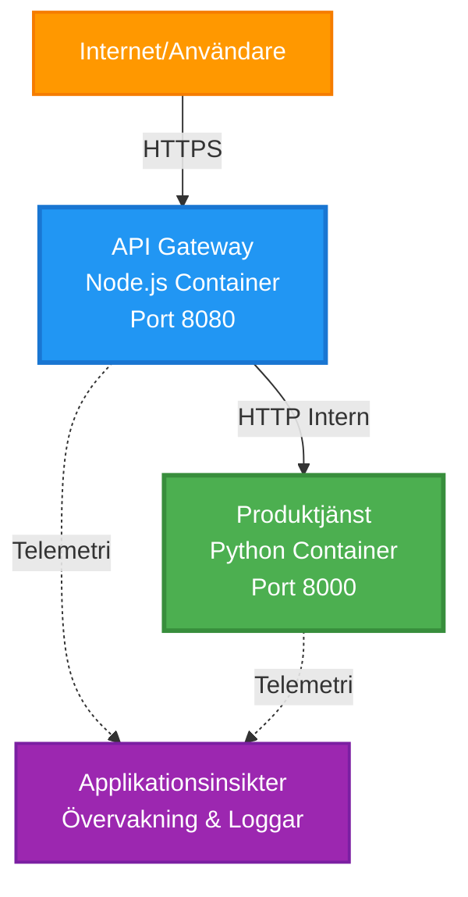
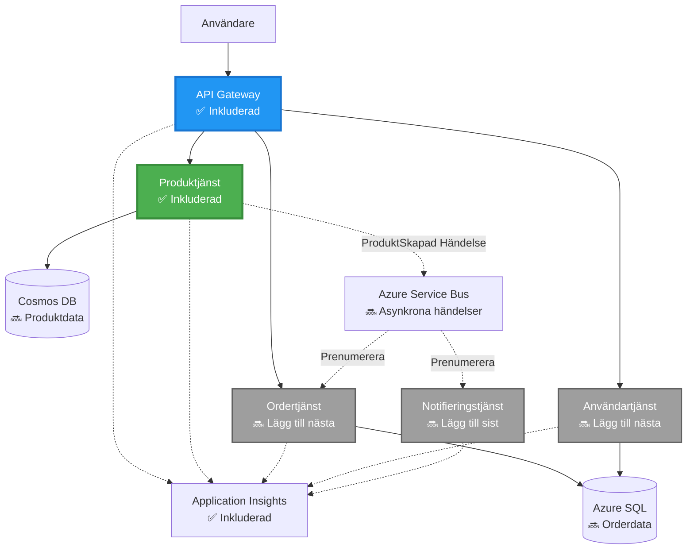
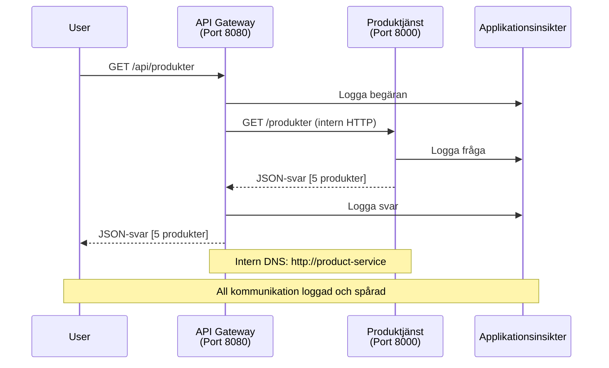

<!--
CO_OP_TRANSLATOR_METADATA:
{
  "original_hash": "eb3a4803a1e80a7f2e64f6bf63738c0f",
  "translation_date": "2025-11-21T10:23:57+00:00",
  "source_file": "examples/microservices/README.md",
  "language_code": "sv"
}
-->
# Mikrotjänstarkitektur - Exempel på Container App

⏱️ **Beräknad tid**: 25-35 minuter | 💰 **Beräknad kostnad**: ~$50-100/månad | ⭐ **Komplexitet**: Avancerad

**📚 Lärandebana:**
- ← Föregående: [Enkel Flask API](../../../../examples/container-app/simple-flask-api) - Grunderna för en enskild container
- 🎯 **Du är här**: Mikrotjänstarkitektur (grund med 2 tjänster)
- → Nästa: [AI Integration](../../../../docs/ai-foundry) - Lägg till intelligens i dina tjänster
- 🏠 [Kursens startsida](../../README.md)

---

En **förenklad men funktionell** mikrotjänstarkitektur distribuerad till Azure Container Apps med hjälp av AZD CLI. Detta exempel demonstrerar kommunikation mellan tjänster, containerorkestrering och övervakning med en praktisk uppsättning av två tjänster.

> **📚 Lärandeansats**: Detta exempel börjar med en minimal arkitektur med två tjänster (API Gateway + Backend Service) som du faktiskt kan distribuera och lära dig av. Efter att ha bemästrat denna grund ger vi vägledning för att expandera till ett komplett mikrotjänstekosystem.

## Vad du kommer att lära dig

Genom att slutföra detta exempel kommer du att:
- Distribuera flera containrar till Azure Container Apps
- Implementera kommunikation mellan tjänster med intern nätverkshantering
- Konfigurera miljöbaserad skalning och hälsokontroller
- Övervaka distribuerade applikationer med Application Insights
- Förstå distributionsmönster och bästa praxis för mikrotjänster
- Lära dig progressiv expansion från enkla till komplexa arkitekturer

## Arkitektur

### Fas 1: Vad vi bygger (ingår i detta exempel)


**Komponentdetaljer:**

| Komponent | Syfte | Åtkomst | Resurser |
|-----------|-------|---------|----------|
| **API Gateway** | Dirigerar externa förfrågningar till backend-tjänster | Publik (HTTPS) | 1 vCPU, 2GB RAM, 2-20 repliker |
| **Produktservice** | Hanterar produktkatalog med data i minnet | Endast internt | 0.5 vCPU, 1GB RAM, 1-10 repliker |
| **Application Insights** | Centraliserad loggning och distribuerad spårning | Azure Portal | 1-2 GB/månad dataintag |

**Varför börja enkelt?**
- ✅ Distribuera och förstå snabbt (25-35 minuter)
- ✅ Lär dig grundläggande mönster för mikrotjänster utan komplexitet
- ✅ Fungerande kod som du kan modifiera och experimentera med
- ✅ Lägre kostnad för lärande (~$50-100/månad jämfört med $300-1400/månad)
- ✅ Bygg självförtroende innan du lägger till databaser och meddelandeköer

**Liknelse**: Tänk på detta som att lära sig köra bil. Du börjar på en tom parkeringsplats (2 tjänster), bemästrar grunderna och går sedan vidare till stadstrafik (5+ tjänster med databaser).

### Fas 2: Framtida expansion (referensarkitektur)

När du bemästrar arkitekturen med två tjänster kan du expandera till:


Se avsnittet "Expansionsguide" i slutet för steg-för-steg-instruktioner.

## Inkluderade funktioner

✅ **Tjänstupptäckt**: Automatisk DNS-baserad upptäckt mellan containrar  
✅ **Lastbalansering**: Inbyggd lastbalansering över repliker  
✅ **Autoskalning**: Oberoende skalning per tjänst baserat på HTTP-förfrågningar  
✅ **Hälsokontroll**: Liveness- och readiness-prober för båda tjänsterna  
✅ **Distribuerad loggning**: Centraliserad loggning med Application Insights  
✅ **Intern nätverkshantering**: Säker kommunikation mellan tjänster  
✅ **Containerorkestrering**: Automatisk distribution och skalning  
✅ **Uppdateringar utan driftstopp**: Rullande uppdateringar med revisionshantering  

## Förutsättningar

### Nödvändiga verktyg

Innan du börjar, verifiera att du har dessa verktyg installerade:

1. **[Azure Developer CLI (azd)](https://learn.microsoft.com/azure/developer/azure-developer-cli/install-azd)** (version 1.0.0 eller högre)
   ```bash
   azd version
   # Förväntad output: azd version 1.0.0 eller högre
   ```

2. **[Azure CLI](https://learn.microsoft.com/cli/azure/install-azure-cli)** (version 2.50.0 eller högre)
   ```bash
   az --version
   # Förväntad output: azure-cli 2.50.0 eller högre
   ```

3. **[Docker](https://www.docker.com/get-started)** (för lokal utveckling/testning - valfritt)
   ```bash
   docker --version
   # Förväntad output: Docker version 20.10 eller högre
   ```

### Verifiera din installation

Kör dessa kommandon för att bekräfta att du är redo:

```bash
# Kontrollera Azure Developer CLI
azd version
# ✅ Förväntat: azd version 1.0.0 eller högre

# Kontrollera Azure CLI
az --version
# ✅ Förväntat: azure-cli 2.50.0 eller högre

# Kontrollera Docker (valfritt)
docker --version
# ✅ Förväntat: Docker version 20.10 eller högre
```

**Kriterier för framgång**: Alla kommandon returnerar versionsnummer som matchar eller överstiger minimikraven.

### Azure-krav

- Ett aktivt **Azure-abonnemang** ([skapa ett gratis konto](https://azure.microsoft.com/free/))
- Behörigheter att skapa resurser i ditt abonnemang
- **Contributor**-roll på abonnemanget eller resursgruppen

### Kunskapsförutsättningar

Detta är ett exempel på **avancerad nivå**. Du bör ha:
- Slutfört [exemplet Enkel Flask API](../../../../examples/container-app/simple-flask-api) 
- Grundläggande förståelse för mikrotjänstarkitektur
- Bekantskap med REST API:er och HTTP
- Förståelse för containerkoncept

**Ny på Container Apps?** Börja med [exemplet Enkel Flask API](../../../../examples/container-app/simple-flask-api) först för att lära dig grunderna.

## Snabbstart (steg-för-steg)

### Steg 1: Klona och navigera

```bash
git clone https://github.com/microsoft/AZD-for-beginners.git
cd AZD-for-beginners/examples/microservices
```

**✓ Kontrollera framgång**: Verifiera att du ser `azure.yaml`:
```bash
ls
# Förväntat: README.md, azure.yaml, infra/, src/
```

### Steg 2: Autentisera med Azure

```bash
azd auth login
```

Detta öppnar din webbläsare för Azure-autentisering. Logga in med dina Azure-uppgifter.

**✓ Kontrollera framgång**: Du bör se:
```
Logged in to Azure.
```

### Steg 3: Initiera miljön

```bash
azd init
```

**Frågor du kommer att se**:
- **Miljönamn**: Ange ett kort namn (t.ex. `microservices-dev`)
- **Azure-abonnemang**: Välj ditt abonnemang
- **Azure-plats**: Välj en region (t.ex. `eastus`, `westeurope`)

**✓ Kontrollera framgång**: Du bör se:
```
SUCCESS: New project initialized!
```

### Steg 4: Distribuera infrastruktur och tjänster

```bash
azd up
```

**Vad som händer** (tar 8-12 minuter):

```mermaid
graph LR
    A[azd up] --> B[Skapa Resursgrupp]
    B --> C[Distribuera Containerregister]
    C --> D[Distribuera Logganalys]
    D --> E[Distribuera App Insights]
    E --> F[Skapa Container-miljö]
    F --> G[Bygg API Gateway-bild]
    F --> H[Bygg Produktservice-bild]
    G --> I[Skjut till Register]
    H --> I
    I --> J[Distribuera API Gateway]
    I --> K[Distribuera Produktservice]
    J --> L[Konfigurera Ingress & Hälsokontroller]
    K --> L
    L --> M[Distribuering Klar ✓]
    
    style A fill:#2196F3,stroke:#1976D2,stroke-width:3px,color:#fff
    style M fill:#4CAF50,stroke:#388E3C,stroke-width:3px,color:#fff
```


**✓ Kontrollera framgång**: Du bör se:
```
SUCCESS: Your application was deployed to Azure in X minutes Y seconds.
Endpoint: https://api-gateway-<unique-id>.azurecontainerapps.io
```

**⏱️ Tid**: 8-12 minuter

### Steg 5: Testa distributionen

```bash
# Hämta gateway-slutpunkten
GATEWAY_URL=$(azd env get-values | grep API_GATEWAY_URL | cut -d '=' -f2 | tr -d '"')

# Testa API Gateway-hälsa
curl $GATEWAY_URL/health
```

**✅ Förväntad utdata:**
```json
{
  "status": "healthy",
  "service": "api-gateway",
  "timestamp": "2025-11-19T10:30:00Z"
}
```

**Testa produktservice via gateway**:
```bash
# Lista produkter
curl $GATEWAY_URL/api/products
```

**✅ Förväntad utdata:**
```json
[
  {"id":1,"name":"Laptop","price":999.99,"stock":50},
  {"id":2,"name":"Mouse","price":29.99,"stock":200},
  {"id":3,"name":"Keyboard","price":79.99,"stock":150}
]
```

**✓ Kontrollera framgång**: Båda endpoints returnerar JSON-data utan fel.

---

**🎉 Grattis!** Du har distribuerat en mikrotjänstarkitektur till Azure!

## Projektstruktur

Alla implementeringsfiler ingår—detta är ett komplett, fungerande exempel:

```
microservices/
│
├── README.md                         # This file
├── azure.yaml                        # AZD configuration
├── .gitignore                        # Git ignore patterns
│
├── infra/                           # Infrastructure as Code (Bicep)
│   ├── main.bicep                   # Main orchestration
│   ├── abbreviations.json           # Naming conventions
│   ├── core/                        # Shared infrastructure
│   │   ├── container-apps-environment.bicep  # Container environment + registry
│   │   └── monitor.bicep            # Application Insights + Log Analytics
│   └── app/                         # Service definitions
│       ├── api-gateway.bicep        # API Gateway container app
│       └── product-service.bicep    # Product Service container app
│
└── src/                             # Application source code
    ├── api-gateway/                 # Node.js API Gateway
    │   ├── app.js                   # Express server with routing
    │   ├── package.json             # Node dependencies
    │   └── Dockerfile               # Container definition
    └── product-service/             # Python Product Service
        ├── main.py                  # Flask API with product data
        ├── requirements.txt         # Python dependencies
        └── Dockerfile               # Container definition
```

**Vad varje komponent gör:**

**Infrastruktur (infra/)**:
- `main.bicep`: Orkestrerar alla Azure-resurser och deras beroenden
- `core/container-apps-environment.bicep`: Skapar Container Apps-miljön och Azure Container Registry
- `core/monitor.bicep`: Ställer in Application Insights för distribuerad loggning
- `app/*.bicep`: Individuella containerapp-definitioner med skalning och hälsokontroller

**API Gateway (src/api-gateway/)**:
- Publik tjänst som dirigerar förfrågningar till backend-tjänster
- Implementerar loggning, felhantering och vidarebefordran av förfrågningar
- Demonstrerar HTTP-kommunikation mellan tjänster

**Produktservice (src/product-service/)**:
- Intern tjänst med produktkatalog (i minnet för enkelhet)
- REST API med hälsokontroller
- Exempel på backend-mikrotjänstmönster

## Tjänsteöversikt

### API Gateway (Node.js/Express)

**Port**: 8080  
**Åtkomst**: Publik (extern ingress)  
**Syfte**: Dirigerar inkommande förfrågningar till lämpliga backend-tjänster  

**Endpoints**:
- `GET /` - Tjänsteinformation
- `GET /health` - Hälsokontroll-endpoint
- `GET /api/products` - Vidarebefordra till produktservice (lista alla)
- `GET /api/products/:id` - Vidarebefordra till produktservice (hämta efter ID)

**Nyckelfunktioner**:
- Förfrågningsdirigering med axios
- Centraliserad loggning
- Felhantering och timeout-hantering
- Tjänstupptäckt via miljövariabler
- Integration med Application Insights

**Kodhöjdpunkt** (`src/api-gateway/app.js`):
```javascript
// Intern tjänstekommunikation
app.get('/api/products', async (req, res) => {
  const response = await axios.get(`${PRODUCT_SERVICE_URL}/products`, {
    timeout: 5000
  });
  res.json(response.data);
});
```

### Produktservice (Python/Flask)

**Port**: 8000  
**Åtkomst**: Endast internt (ingen extern ingress)  
**Syfte**: Hanterar produktkatalog med data i minnet  

**Endpoints**:
- `GET /` - Tjänsteinformation
- `GET /health` - Hälsokontroll-endpoint
- `GET /products` - Lista alla produkter
- `GET /products/<id>` - Hämta produkt efter ID

**Nyckelfunktioner**:
- RESTful API med Flask
- Produktlagring i minnet (enkelt, ingen databas behövs)
- Hälsokontroll med prober
- Strukturerad loggning
- Integration med Application Insights

**Datamodell**:
```python
{
  "id": 1,
  "name": "Laptop",
  "description": "High-performance laptop",
  "price": 999.99,
  "stock": 50
}
```

**Varför endast internt?**
Produktservicen exponeras inte publikt. Alla förfrågningar måste gå via API Gateway, vilket ger:
- Säkerhet: Kontrollerad åtkomstpunkt
- Flexibilitet: Kan ändra backend utan att påverka klienter
- Övervakning: Centraliserad loggning av förfrågningar

## Förstå tjänstekommunikation

### Hur tjänster pratar med varandra


I detta exempel kommunicerar API Gateway med Produktservice via **interna HTTP-anrop**:

```javascript
// API Gateway (src/api-gateway/app.js)
const PRODUCT_SERVICE_URL = process.env.PRODUCT_SERVICE_URL;

// Gör intern HTTP-begäran
const response = await axios.get(`${PRODUCT_SERVICE_URL}/products`);
```

**Nyckelpunkter**:

1. **DNS-baserad upptäckt**: Container Apps tillhandahåller automatiskt DNS för interna tjänster
   - Produktservice FQDN: `product-service.internal.<environment>.azurecontainerapps.io`
   - Förenklat som: `http://product-service` (Container Apps löser detta)

2. **Ingen publik exponering**: Produktservice har `external: false` i Bicep
   - Endast åtkomlig inom Container Apps-miljön
   - Kan inte nås från internet

3. **Miljövariabler**: Tjänst-URL:er injiceras vid distribution
   - Bicep skickar den interna FQDN till gatewayen
   - Inga hårdkodade URL:er i applikationskoden

**Liknelse**: Tänk på detta som kontorsrum. API Gateway är receptionen (publik), och Produktservice är ett kontorsrum (endast internt). Besökare måste gå via receptionen för att nå något kontor.

## Distributionsalternativ

### Full distribution (rekommenderas)

```bash
# Distribuera infrastruktur och båda tjänsterna
azd up
```

Detta distribuerar:
1. Container Apps-miljö
2. Application Insights
3. Container Registry
4. API Gateway-container
5. Produktservice-container

**Tid**: 8-12 minuter

### Distribuera enskild tjänst

```bash
# Distribuera endast en tjänst (efter initial azd up)
azd deploy api-gateway

# Eller distribuera produkttjänsten
azd deploy product-service
```

**Användningsfall**: När du har uppdaterat kod i en tjänst och vill distribuera endast den tjänsten.

### Uppdatera konfiguration

```bash
# Ändra skalningsparametrar
azd env set GATEWAY_MAX_REPLICAS 30

# Återdistribuera med ny konfiguration
azd up
```

## Konfiguration

### Skalningskonfiguration

Båda tjänsterna är konfigurerade med HTTP-baserad autoskalning i sina Bicep-filer:

**API Gateway**:
- Minsta repliker: 2 (alltid minst 2 för tillgänglighet)
- Max repliker: 20
- Skalningsutlösare: 50 samtidiga förfrågningar per replik

**Produktservice**:
- Minsta repliker: 1 (kan skalas till noll vid behov)
- Max repliker: 10
- Skalningsutlösare: 100 samtidiga förfrågningar per replik

**Anpassa skalning** (i `infra/app/*.bicep`):
```bicep
scale: {
  minReplicas: 1
  maxReplicas: 10
  rules: [
    {
      name: 'http-scale-rule'
      http: {
        metadata: {
          concurrentRequests: '100'  // Adjust this
        }
      }
    }
  ]
}
```

### Resursallokering

**API Gateway**:
- CPU: 1.0 vCPU
- Minne: 2 GiB
- Anledning: Hanterar all extern trafik

**Produktservice**:
- CPU: 0.5 vCPU
- Minne: 1 GiB
- Anledning: Lättviktiga operationer i minnet

### Hälsokontroller

Båda tjänsterna inkluderar liveness- och readiness-prober:

```bicep
probes: [
  {
    type: 'Liveness'
    httpGet: {
      path: '/health'
      port: 8080
    }
    initialDelaySeconds: 10
    periodSeconds: 30
  }
  {
    type: 'Readiness'
    httpGet: {
      path: '/health'
      port: 8080
    }
    initialDelaySeconds: 5
    periodSeconds: 10
  }
]
```

**Vad detta innebär**:
- **Liveness**: Om hälsokontrollen misslyckas startar Container Apps om containern
- **Readiness**: Om inte redo slutar Container Apps att dirigera trafik till den repliken

## Övervakning och insyn

### Visa tjänsteloggar

```bash
# Strömma loggar från API Gateway
azd logs api-gateway --follow

# Visa senaste produktserviceloggar
azd logs product-service --tail 100

# Visa alla loggar från båda tjänsterna
azd logs --follow
```

**Förväntad utdata**:
```
[api-gateway] API Gateway listening on port 8080
[api-gateway] Product Service URL: http://product-service
[api-gateway] GET /api/products 200 - 45ms
[product-service] Retrieved 5 products
```

### Application Insights-frågor

Öppna Application Insights i Azure Portal och kör dessa frågor:

**Hitta långsamma förfrågningar**:
```kusto
requests
| where timestamp > ago(1h)
| where duration > 1000  // Requests taking >1 second
| summarize count() by name, cloud_RoleName
| order by count_ desc
```

**Spåra tjänst-till-tjänst-anrop**:
```kusto
dependencies
| where timestamp > ago(1h)
| where type == "Http"
| project timestamp, name, target, duration, success
| order by timestamp desc
```

**Felfrekvens per tjänst**:
```kusto
exceptions
| where timestamp > ago(24h)
| summarize errorCount = count() by cloud_RoleName, type
| order by errorCount desc
```

**Förfrågningsvolym över tid**:
```kusto
requests
| where timestamp > ago(1h)
| summarize requestCount = count() by bin(timestamp, 5m), cloud_RoleName
| render timechart
```

### Åtkomst till övervakningsdashboard

```bash
# Hämta detaljer om Application Insights
azd env get-values | grep APPLICATIONINSIGHTS

# Öppna Azure Portal-övervakning
az monitor app-insights component show \
  --app $(azd env get-values | grep APPLICATIONINSIGHTS_CONNECTION_STRING | cut -d '=' -f2) \
  --resource-group $(azd env get-values | grep AZURE_RESOURCE_GROUP | cut -d '=' -f2) \
  --query "appId" -o tsv
```

### Live Metrics

1. Navigera till Application Insights i Azure Portal
2. Klicka på "Live Metrics"
3. Se realtidsförfrågningar, fel och prestanda
4. Testa genom att köra: `curl $(azd env get-values | grep API_GATEWAY_URL | cut -d '=' -f2 | tr -d '"')/api/products`

## Praktiska övningar

### Övning 1: Lägg till en ny produktendpoint ⭐ (Lätt)

**Mål**: Lägg till en POST-endpoint för att skapa nya produkter

**Startpunkt**: `src/product-service/main.py`

**Steg**:

1. Lägg till denna endpoint efter funktionen `get_product` i `main.py`:

```python
@app.route('/products', methods=['POST'])
def create_product():
    """Create a new product"""
    data = request.get_json()
    
    # Validera obligatoriska fält
    if not data or 'name' not in data or 'price' not in data:
        return jsonify({'error': 'Missing required fields: name, price'}), 400
    
    new_id = max(p['id'] for p in products) + 1
    new_product = {
        'id': new_id,
        'name': data['name'],
        'description': data.get('description', ''),
        'price': float(data['price']),
        'stock': int(data.get('stock', 0))
    }
    products.append(new_product)
    logger.info(f"Created product {new_id}")
    return jsonify(new_product), 201
```

2. Lägg till POST-rutt till API Gateway (`src/api-gateway/app.js`):

```javascript
// Lägg till detta efter GET /api/products-rutten
app.post('/api/products', async (req, res) => {
  try {
    console.log(`Forwarding POST request to ${PRODUCT_SERVICE_URL}/products`);
    const response = await axios.post(`${PRODUCT_SERVICE_URL}/products`, req.body, {
      timeout: 5000
    });
    res.status(201).json(response.data);
  } catch (error) {
    console.error('Error calling product service:', error.message);
    res.status(503).json({
      error: 'Product service unavailable',
      message: error.message
    });
  }
});
```

3. Ominstallera båda tjänsterna:

```bash
azd deploy product-service
azd deploy api-gateway
```

4. Testa den nya slutpunkten:

```bash
GATEWAY_URL=$(azd env get-values | grep API_GATEWAY_URL | cut -d '=' -f2 | tr -d '"')

# Skapa en ny produkt
curl -X POST $GATEWAY_URL/api/products \
  -H "Content-Type: application/json" \
  -d '{"name":"USB Cable","price":9.99,"stock":500}'
```

**✅ Förväntat resultat:**
```json
{"id":6,"name":"USB Cable","description":"","price":9.99,"stock":500}
```

5. Verifiera att den visas i listan:

```bash
curl $GATEWAY_URL/api/products
# Bör nu visa 6 produkter inklusive den nya USB-kabeln
```

**Framgångskriterier**:
- ✅ POST-förfrågan returnerar HTTP 201
- ✅ Ny produkt visas i GET /api/products-listan
- ✅ Produkten har ett autoinkrementerat ID

**Tid**: 10-15 minuter

---

### Övning 2: Ändra Autoskalningsregler ⭐⭐ (Medel)

**Mål**: Ändra Product Service för att skala mer aggressivt

**Startpunkt**: `infra/app/product-service.bicep`

**Steg**:

1. Öppna `infra/app/product-service.bicep` och hitta blocket `scale` (runt rad 95)

2. Ändra från:
```bicep
scale: {
  minReplicas: 1
  maxReplicas: 10
  rules: [
    {
      name: 'http-scale-rule'
      http: {
        metadata: {
          concurrentRequests: '100'  // OLD
        }
      }
    }
  ]
}
```

Till:
```bicep
scale: {
  minReplicas: 2  // Always have 2 running
  maxReplicas: 20  // Allow more scaling
  rules: [
    {
      name: 'http-scale-rule'
      http: {
        metadata: {
          concurrentRequests: '20'  // Scale at lower threshold
        }
      }
    }
  ]
}
```

3. Ominstallera infrastrukturen:

```bash
azd up
```

4. Verifiera den nya skalningskonfigurationen:

```bash
az containerapp show \
  --name $(azd env get-values | grep PRODUCT_SERVICE | head -1 | cut -d '/' -f5) \
  --resource-group $(azd env get-values | grep AZURE_RESOURCE_GROUP | cut -d '=' -f2 | tr -d '"') \
  --query "properties.template.scale" -o json
```

**✅ Förväntat resultat:**
```json
{
  "minReplicas": 2,
  "maxReplicas": 20,
  "rules": [...]
}
```

5. Testa autoskalning med belastning:

```bash
# Generera samtidiga förfrågningar
for i in {1..500}; do curl $GATEWAY_URL/api/products & done

# Se skalning ske
azd logs product-service --follow
# Leta efter: Skalningshändelser för Container Apps
```

**Framgångskriterier**:
- ✅ Product Service körs alltid med minst 2 repliker
- ✅ Under belastning skalas det till mer än 2 repliker
- ✅ Azure Portal visar de nya skalningsreglerna

**Tid**: 15-20 minuter

---

### Övning 3: Lägg till en Anpassad Övervakningsfråga ⭐⭐ (Medel)

**Mål**: Skapa en anpassad Application Insights-fråga för att spåra prestanda för produkt-API

**Steg**:

1. Navigera till Application Insights i Azure Portal:
   - Gå till Azure Portal
   - Hitta din resursgrupp (rg-microservices-*)
   - Klicka på Application Insights-resursen

2. Klicka på "Logs" i vänstermenyn

3. Skapa denna fråga:

```kusto
requests
| where timestamp > ago(1h)
| where name contains "products"
| summarize 
    RequestCount = count(),
    AvgDuration = avg(duration),
    P95Duration = percentile(duration, 95),
    SuccessRate = 100.0 * countif(success == true) / count()
  by bin(timestamp, 5m)
| render timechart
```

4. Klicka på "Run" för att köra frågan

5. Spara frågan:
   - Klicka på "Save"
   - Namn: "Product API Performance"
   - Kategori: "Performance"

6. Generera testtrafik:

```bash
for i in {1..100}; do curl $GATEWAY_URL/api/products; sleep 1; done
```

7. Uppdatera frågan för att se data

**✅ Förväntat resultat:**
- Diagram som visar antalet förfrågningar över tid
- Genomsnittlig varaktighet < 500ms
- Framgångsgrad = 100%
- Tidsintervall på 5 minuter

**Framgångskriterier**:
- ✅ Frågan visar 100+ förfrågningar
- ✅ Framgångsgraden är 100%
- ✅ Genomsnittlig varaktighet < 500ms
- ✅ Diagrammet visar 5-minutersintervall

**Lärandemål**: Förstå hur man övervakar tjänsteprestanda med anpassade frågor

**Tid**: 10-15 minuter

---

### Övning 4: Implementera Återförsökslogik ⭐⭐⭐ (Avancerad)

**Mål**: Lägg till återförsökslogik i API Gateway när Product Service tillfälligt är otillgänglig

**Startpunkt**: `src/api-gateway/app.js`

**Steg**:

1. Installera återförsöksbibliotek:

```bash
cd src/api-gateway
npm install axios-retry --save
cd ../..
```

2. Uppdatera `src/api-gateway/app.js` (lägg till efter axios-importen):

```javascript
const axiosRetry = require('axios-retry');

// Konfigurera återförsökslogik
axiosRetry(axios, {
  retries: 3,
  retryDelay: (retryCount) => {
    return retryCount * 1000; // 1s, 2s, 3s
  },
  retryCondition: (error) => {
    // Försök igen vid nätverksfel eller 5xx-svar
    return axiosRetry.isNetworkOrIdempotentRequestError(error) ||
           (error.response && error.response.status >= 500);
  }
});

console.log('Retry logic configured: 3 retries with exponential backoff');
```

3. Ominstallera API Gateway:

```bash
azd deploy api-gateway
```

4. Testa återförsöksbeteendet genom att simulera tjänstefel:

```bash
# Skala produkttjänsten till 0 (simulera fel)
az containerapp update \
  --name $(azd env get-values | grep PRODUCT_SERVICE | head -1 | cut -d '/' -f5) \
  --resource-group $(azd env get-values | grep AZURE_RESOURCE_GROUP | cut -d '=' -f2 | tr -d '"') \
  --min-replicas 0 \
  --max-replicas 0

# Försök att komma åt produkter (kommer att försöka igen 3 gånger)
time curl -v $GATEWAY_URL/api/products
# Observera: Svaret tar ~6 sekunder (1s + 2s + 3s försök igen)

# Återställ produkttjänsten
az containerapp update \
  --name $(azd env get-values | grep PRODUCT_SERVICE | head -1 | cut -d '/' -f5) \
  --resource-group $(azd env get-values | grep AZURE_RESOURCE_GROUP | cut -d '=' -f2 | tr -d '"') \
  --min-replicas 1 \
  --max-replicas 10
```

5. Visa återförsöksloggar:

```bash
azd logs api-gateway --tail 50
# Leta efter: Försöksmeddelanden för omförsök
```

**✅ Förväntat beteende:**
- Förfrågningar försöker igen 3 gånger innan de misslyckas
- Varje återförsök väntar längre (1s, 2s, 3s)
- Lyckade förfrågningar efter att tjänsten startar om
- Loggar visar återförsöksförsök

**Framgångskriterier**:
- ✅ Förfrågningar försöker igen 3 gånger innan de misslyckas
- ✅ Varje återförsök väntar längre (exponentiell backoff)
- ✅ Lyckade förfrågningar efter att tjänsten startar om
- ✅ Loggar visar återförsöksförsök

**Lärandemål**: Förstå motståndsmönster i mikrotjänster (kretsbrytare, återförsök, tidsgränser)

**Tid**: 20-25 minuter

---

## Kunskapskontroll

Efter att ha slutfört detta exempel, verifiera din förståelse:

### 1. Tjänstekommunikation ✓

Testa din kunskap:
- [ ] Kan du förklara hur API Gateway hittar Product Service? (DNS-baserad tjänstupptäckt)
- [ ] Vad händer om Product Service är nere? (Gateway returnerar 503-fel)
- [ ] Hur skulle du lägga till en tredje tjänst? (Skapa ny Bicep-fil, lägg till i main.bicep, skapa src-mapp)

**Praktisk Verifiering:**
```bash
# Simulera tjänstfel
az containerapp update --name <product-service-name> --min-replicas 0 --max-replicas 0
curl $GATEWAY_URL/api/products
# ✅ Förväntat: 503 Tjänsten är inte tillgänglig

# Återställ tjänsten
az containerapp update --name <product-service-name> --min-replicas 1 --max-replicas 10
```

### 2. Övervakning och Observabilitet ✓

Testa din kunskap:
- [ ] Var ser du distribuerade loggar? (Application Insights i Azure Portal)
- [ ] Hur spårar du långsamma förfrågningar? (Kusto-fråga: `requests | where duration > 1000`)
- [ ] Kan du identifiera vilken tjänst som orsakade ett fel? (Kontrollera `cloud_RoleName`-fältet i loggar)

**Praktisk Verifiering:**
```bash
# Generera en simulering av långsamma förfrågningar
curl "$GATEWAY_URL/api/products?delay=2000"

# Fråga Application Insights efter långsamma förfrågningar
# Navigera till Azure Portal → Application Insights → Loggar
# Kör: requests | where duration > 1000 | project timestamp, name, duration, cloud_RoleName
```

### 3. Skalning och Prestanda ✓

Testa din kunskap:
- [ ] Vad triggar autoskalning? (Regler för samtidiga HTTP-förfrågningar: 50 för gateway, 100 för produkt)
- [ ] Hur många repliker körs nu? (Kontrollera med `az containerapp revision list`)
- [ ] Hur skulle du skala Product Service till 5 repliker? (Uppdatera minReplicas i Bicep)

**Praktisk Verifiering:**
```bash
# Generera belastning för att testa autoskalning
for i in {1..1000}; do curl $GATEWAY_URL/api/products & done

# Titta på repliker öka
azd logs api-gateway --follow
# ✅ Förväntat: Se skalningshändelser i loggar
```

**Framgångskriterier**: Du kan svara på alla frågor och verifiera med praktiska kommandon.

---

## Kostnadsanalys

### Beräknade Månadskostnader (För Detta 2-Tjänstexempel)

| Resurs | Konfiguration | Beräknad Kostnad |
|--------|---------------|------------------|
| API Gateway | 2-20 repliker, 1 vCPU, 2GB RAM | $30-150 |
| Product Service | 1-10 repliker, 0.5 vCPU, 1GB RAM | $15-75 |
| Container Registry | Grundläggande nivå | $5 |
| Application Insights | 1-2 GB/månad | $5-10 |
| Log Analytics | 1 GB/månad | $3 |
| **Totalt** | | **$58-243/månad** |

### Kostnadsuppdelning efter Användning

**Låg trafik** (testning/inlärning): ~$60/månad
- API Gateway: 2 repliker × 24/7 = $30
- Product Service: 1 replik × 24/7 = $15
- Övervakning + Register = $13

**Måttlig trafik** (liten produktion): ~$120/månad
- API Gateway: 5 genomsnittliga repliker = $75
- Product Service: 3 genomsnittliga repliker = $45
- Övervakning + Register = $13

**Hög trafik** (intensiva perioder): ~$240/månad
- API Gateway: 15 genomsnittliga repliker = $225
- Product Service: 8 genomsnittliga repliker = $120
- Övervakning + Register = $13

### Tips för Kostnadsoptimering

1. **Skala till Noll för Utveckling**:
   ```bicep
   scale: {
     minReplicas: 0  // Save $30-40/month when not in use
     maxReplicas: 10
   }
   ```

2. **Använd Konsumtionsplan för Cosmos DB** (när du lägger till det):
   - Betala endast för det du använder
   - Ingen minimikostnad

3. **Ställ in Application Insights Sampling**:
   ```javascript
   appInsights.defaultClient.config.samplingPercentage = 50; // Prova 50% av förfrågningarna
   ```

4. **Rensa När Det Inte Behövs**:
   ```bash
   azd down --force --purge
   ```

### Alternativ för Gratisnivå

För inlärning/testning, överväg:
- ✅ Använd Azure gratis krediter ($200 för de första 30 dagarna med nya konton)
- ✅ Håll till minimirepliker (sparar ~50% kostnader)
- ✅ Ta bort efter testning (inga löpande avgifter)
- ✅ Skala till noll mellan inlärningssessioner

**Exempel**: Köra detta exempel i 2 timmar/dag × 30 dagar = ~$5/månad istället för $60/månad

---

## Felsökningssnabbguide

### Problem: `azd up` misslyckas med "Prenumeration hittades inte"

**Lösning**:
```bash
# Logga in igen med explicit prenumeration
az account set --subscription <your-subscription-id>
azd env set AZURE_SUBSCRIPTION_ID <your-subscription-id>
azd up
```

### Problem: API Gateway returnerar 503 "Product service unavailable"

**Diagnos**:
```bash
# Kontrollera produktserviceloggar
azd logs product-service --tail 50

# Kontrollera produktservicehälsa
az containerapp show \
  --name $(azd env get-values | grep PRODUCT_SERVICE | head -1 | cut -d '/' -f5) \
  --resource-group $(azd env get-values | grep AZURE_RESOURCE_GROUP | cut -d '=' -f2 | tr -d '"') \
  --query "properties.runningStatus"
```

**Vanliga Orsaker**:
1. Product service startade inte (kontrollera loggar för Python-fel)
2. Hälsokontroll misslyckas (verifiera att `/health`-slutpunkten fungerar)
3. Containerbilden misslyckades att byggas (kontrollera register för bild)

### Problem: Autoskalning fungerar inte

**Diagnos**:
```bash
# Kontrollera aktuellt antal repliker
az containerapp revision list \
  --name $(azd env get-values | grep API_GATEWAY | head -1 | cut -d '/' -f5) \
  --resource-group $(azd env get-values | grep AZURE_RESOURCE_GROUP | cut -d '=' -f2 | tr -d '"') \
  --query "[].properties.replicas"

# Generera belastning för test
for i in {1..1000}; do curl $GATEWAY_URL/api/products & done

# Övervaka skalningshändelser
azd logs api-gateway --follow | grep -i scale
```

**Vanliga Orsaker**:
1. Belastningen är inte tillräckligt hög för att trigga skalningsregeln (behöver >50 samtidiga förfrågningar)
2. Max antal repliker har redan nåtts (kontrollera Bicep-konfigurationen)
3. Skalningsregeln är felkonfigurerad i Bicep (verifiera värdet för concurrentRequests)

### Problem: Application Insights visar inte loggar

**Diagnos**:
```bash
# Verifiera att anslutningssträngen är inställd
azd env get-values | grep APPLICATIONINSIGHTS

# Kontrollera om tjänster skickar telemetri
az monitor app-insights component show \
  --app $(azd env get-values | grep APPLICATIONINSIGHTS_NAME | cut -d '=' -f2 | tr -d '"') \
  --resource-group $(azd env get-values | grep AZURE_RESOURCE_GROUP | cut -d '=' -f2 | tr -d '"') \
  --query "properties.InstrumentationKey"
```

**Vanliga Orsaker**:
1. Anslutningssträngen skickas inte till containern (kontrollera miljövariabler)
2. Application Insights SDK är inte konfigurerad (verifiera imports i koden)
3. Brandvägg blockerar telemetri (sällsynt, kontrollera nätverksregler)

### Problem: Docker-bygget misslyckas lokalt

**Diagnos**:
```bash
# Testa API Gateway-bygg
cd src/api-gateway
docker build -t test-gateway .

# Testa Product Service-bygg
cd ../product-service
docker build -t test-product .
```

**Vanliga Orsaker**:
1. Saknade beroenden i package.json/requirements.txt
2. Syntaxfel i Dockerfile
3. Nätverksproblem vid nedladdning av beroenden

**Fortfarande Problem?** Se [Vanliga Problem Guide](../../docs/troubleshooting/common-issues.md) eller [Azure Container Apps Felsökning](https://learn.microsoft.com/azure/container-apps/troubleshooting)

---

## Rensning

För att undvika löpande kostnader, ta bort alla resurser:

```bash
azd down --force --purge
```

**Bekräftelseprompt**:
```
? Total resources to delete: 6, are you sure you want to continue? (y/N)
```

Skriv `y` för att bekräfta.

**Vad Tas Bort**:
- Container Apps-miljö
- Båda Container Apps (gateway & product service)
- Container Registry
- Application Insights
- Log Analytics Workspace
- Resursgrupp

**✓ Verifiera Rensning**:
```bash
az group list --query "[?starts_with(name,'rg-microservices')]" --output table
```

Borde returnera tomt.

---

## Expansionsguide: Från 2 till 5+ Tjänster

När du har bemästrat denna 2-tjänstarkitektur, så här expanderar du:

### Fas 1: Lägg till Databaslagring (Nästa Steg)

**Lägg till Cosmos DB för Product Service**:

1. Skapa `infra/core/cosmos.bicep`:
   ```bicep
   resource cosmosAccount 'Microsoft.DocumentDB/databaseAccounts@2023-04-15' = {
     name: name
     location: location
     kind: 'GlobalDocumentDB'
     properties: {
       databaseAccountOfferType: 'Standard'
       consistencyPolicy: { defaultConsistencyLevel: 'Session' }
       locations: [{ locationName: location, failoverPriority: 0 }]
     }
   }
   ```

2. Uppdatera Product Service för att använda Azure Cosmos DB Python SDK istället för in-memory data

3. Beräknad extra kostnad: ~$25/månad (serverlös)

### Fas 2: Lägg till en Tredje Tjänst (Orderhantering)

**Skapa Order Service**:

1. Ny mapp: `src/order-service/` (Python/Node.js/C#)
2. Ny Bicep: `infra/app/order-service.bicep`
3. Uppdatera API Gateway för att dirigera `/api/orders`
4. Lägg till Azure SQL Database för orderlagring

**Arkitekturen blir**:
```
API Gateway → Product Service (Cosmos DB)
           → Order Service (Azure SQL)
```

### Fas 3: Lägg till Asynkron Kommunikation (Service Bus)

**Implementera Händelsedriven Arkitektur**:

1. Lägg till Azure Service Bus: `infra/core/servicebus.bicep`
2. Product Service publicerar "ProductCreated"-händelser
3. Order Service prenumererar på produkthändelser
4. Lägg till Notification Service för att bearbeta händelser

**Mönster**: Begäran/Svar (HTTP) + Händelsedriven (Service Bus)

### Fas 4: Lägg till Användarautentisering

**Implementera User Service**:

1. Skapa `src/user-service/` (Go/Node.js)
2. Lägg till Azure AD B2C eller anpassad JWT-autentisering
3. API Gateway validerar tokens innan dirigering
4. Tjänster kontrollerar användarbehörigheter

### Fas 5: Produktionsberedskap

**Lägg till Dessa Komponenter**:
- ✅ Azure Front Door (global lastbalansering)
- ✅ Azure Key Vault (hemlighetshantering)
- ✅ Azure Monitor Workbooks (anpassade instrumentpaneler)
- ✅ CI/CD Pipeline (GitHub Actions)
- ✅ Blå-Grön Distribution
- ✅ Hanterad Identitet för alla tjänster

**Full Produktionsarkitektur Kostnad**: ~$300-1,400/månad

---

## Läs Mer

### Relaterad Dokumentation
- [Azure Container Apps Dokumentation](https://learn.microsoft.com/azure/container-apps/)
- [Mikrotjänstarkitektur Guide](https://learn.microsoft.com/azure/architecture/guide/architecture-styles/microservices)
- [Application Insights för Distribuerad Spårning](https://learn.microsoft.com/azure/azure-monitor/app/distributed-tracing)
- [Azure Developer CLI Dokumentation](https://learn.microsoft.com/azure/developer/azure-developer-cli/)

### Nästa Steg i Denna Kurs
- ← Föregående: [Enkel Flask API](../../../../examples/container-app/simple-flask-api) - Nybörjarexempel med en enda container
- → Nästa: [AI Integrationsguide](../../../../docs/ai-foundry) - Lägg till AI-funktioner
- 🏠 [Kursens Startsida](../../README.md)

### Jämförelse: När Ska Man Använda Vad

| Funktion | Enkel Container | Mikrotjänster (Detta) | Kubernetes (AKS) |
|----------|-----------------|-----------------------|------------------|
| **Användningsfall** | Enkla appar | Komplexa appar | Företagsappar |
| **Skalbarhet** | En tjänst | Skalning per tjänst | Maximal flexibilitet |
| **Komplexitet** | Låg | Medel | Hög |
| **Teamstorlek** | 1-3 utvecklare | 3-10 utvecklare | 10+ utvecklare |
| **Kostnad** | ~$15-50/månad | ~$60-250/månad | ~$150-500/månad |
| **Distributionstid** | 5-10 minuter | 8-12 minuter | 15-30 minuter |
| **Bäst för** | MVP:er, prototyper | Produktionsappar | Multi-cloud, avancerad nätverkshantering |

**Rekommendation**: Börja med Container Apps (detta exempel), gå över till AKS endast om du behöver Kubernetes-specifika funktioner.

---

## Vanliga frågor

**F: Varför bara 2 tjänster istället för 5+?**  
S: För utbildningssyfte. Behärska grunderna (tjänstkommunikation, övervakning, skalning) med ett enkelt exempel innan du lägger till komplexitet. Mönstren du lär dig här gäller även för arkitekturer med 100 tjänster.

**F: Kan jag lägga till fler tjänster själv?**  
S: Absolut! Följ expansionsguiden ovan. Varje ny tjänst följer samma mönster: skapa src-mapp, skapa Bicep-fil, uppdatera azure.yaml, distribuera.

**F: Är detta redo för produktion?**  
S: Det är en solid grund. För produktion, lägg till: hanterad identitet, Key Vault, persistenta databaser, CI/CD-pipeline, övervakningsvarningar och backupstrategi.

**F: Varför inte använda Dapr eller andra service mesh?**  
S: Håll det enkelt för inlärning. När du förstår nätverkshantering i Container Apps kan du lägga till Dapr för avancerade scenarier (tillståndshantering, pub/sub, bindningar).

**F: Hur felsöker jag lokalt?**  
S: Kör tjänster lokalt med Docker:  
```bash
cd src/api-gateway
docker build -t local-gateway .
docker run -p 8080:8080 -e PRODUCT_SERVICE_URL=http://localhost:8000 local-gateway
```


**F: Kan jag använda olika programmeringsspråk?**  
S: Ja! Detta exempel visar Node.js (gateway) + Python (produktservice). Du kan blanda vilka språk som helst som körs i containrar: C#, Go, Java, Ruby, PHP, etc.

**F: Vad händer om jag inte har Azure-krediter?**  
S: Använd Azure gratisnivå (första 30 dagarna med nya konton får $200 krediter) eller distribuera för korta testperioder och ta bort direkt. Detta exempel kostar ~2 USD/dag.

**F: Hur skiljer sig detta från Azure Kubernetes Service (AKS)?**  
S: Container Apps är enklare (ingen Kubernetes-kunskap behövs) men mindre flexibelt. AKS ger dig full kontroll över Kubernetes men kräver mer expertis. Börja med Container Apps, gå vidare till AKS om det behövs.

**F: Kan jag använda detta med befintliga Azure-tjänster?**  
S: Ja! Du kan ansluta till befintliga databaser, lagringskonton, Service Bus, etc. Uppdatera Bicep-filer för att referera till befintliga resurser istället för att skapa nya.

---

> **🎓 Sammanfattning av inlärningsvägen**: Du har lärt dig att distribuera en arkitektur med flera tjänster med automatisk skalning, intern nätverkshantering, centraliserad övervakning och produktionsklara mönster. Denna grund förbereder dig för komplexa distribuerade system och företagsmikrotjänstarkitekturer.

**📚 Kursnavigering:**
- ← Föregående: [Enkel Flask-API](../../../../examples/container-app/simple-flask-api)
- → Nästa: [Exempel på databasintegration](../../../../database-app)
- 🏠 [Kursens startsida](../../README.md)
- 📖 [Container Apps bästa praxis](../../docs/deployment/deployment-guide.md)

---

**✨ Grattis!** Du har slutfört mikrotjänstexemplet. Du förstår nu hur man bygger, distribuerar och övervakar distribuerade applikationer på Azure Container Apps. Redo att lägga till AI-funktioner? Kolla in [AI-integrationsguiden](../../../../docs/ai-foundry)!

---

<!-- CO-OP TRANSLATOR DISCLAIMER START -->
**Ansvarsfriskrivning**:  
Detta dokument har översatts med hjälp av AI-översättningstjänsten [Co-op Translator](https://github.com/Azure/co-op-translator). Även om vi strävar efter noggrannhet, bör det noteras att automatiserade översättningar kan innehålla fel eller felaktigheter. Det ursprungliga dokumentet på dess ursprungliga språk bör betraktas som den auktoritativa källan. För kritisk information rekommenderas professionell mänsklig översättning. Vi ansvarar inte för eventuella missförstånd eller feltolkningar som uppstår vid användning av denna översättning.
<!-- CO-OP TRANSLATOR DISCLAIMER END -->