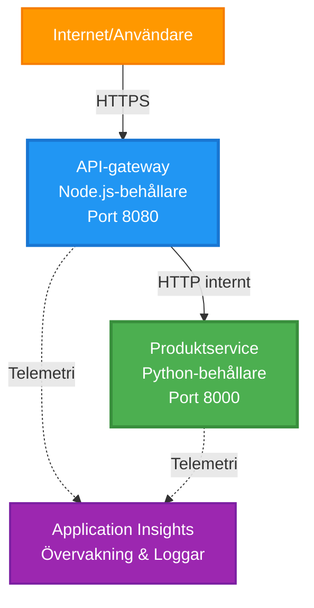
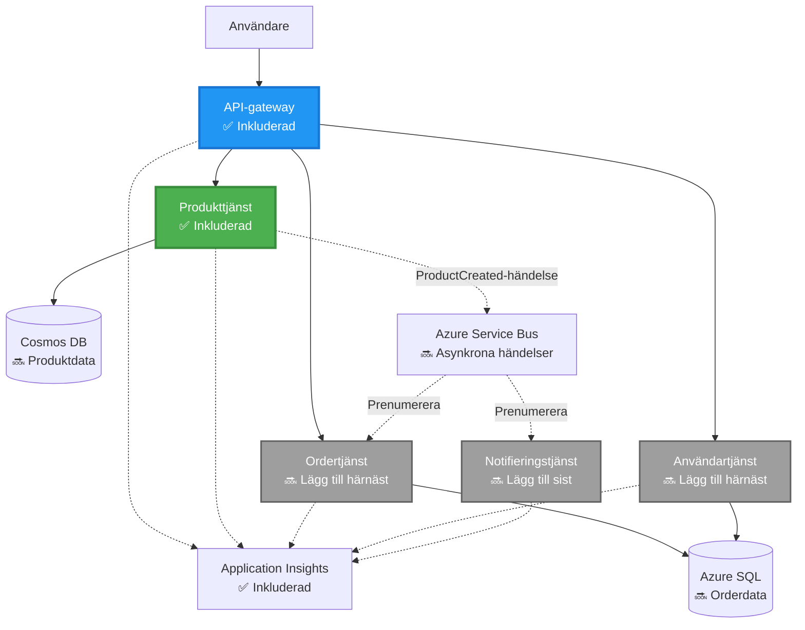
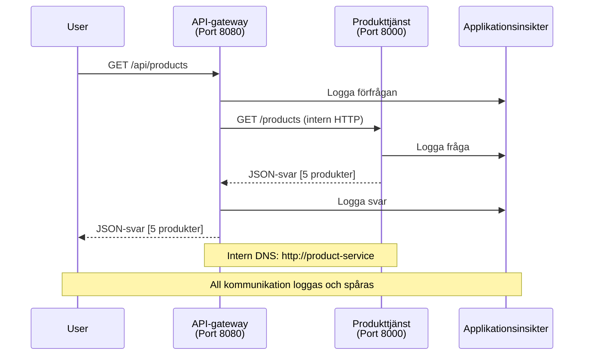

# Mikrotjänstarkitektur - Container App-exempel

⏱️ **Beräknad tid**: 25-35 minuter | 💰 **Beräknad kostnad**: ~$50-100/månad | ⭐ **Komplexitet**: Avancerad

**📚 Lärandeväg:**
- ← Föregående: [Simple Flask API](../../../../examples/container-app/simple-flask-api) - Grundläggande om en enda container
- 🎯 **Du är här**: Mikrotjänstarkitektur (grund med 2 tjänster)
- → Nästa: [AI Integration](../../../../docs/ai-foundry) - Lägg till intelligens i dina tjänster
- 🏠 [Kursöversikt](../../README.md)

---

En **förenklad men fungerande** mikrotjänstarkitektur distribuerad till Azure Container Apps med AZD CLI. Detta exempel visar tjänst-till-tjänst-kommunikation, containerorkestrering och övervakning med en praktisk uppsättning på 2 tjänster.

> **📚 Lärandemetod**: Detta exempel börjar med en minimal 2-tjänstersarkitektur (API-gateway + Backend-tjänst) som du faktiskt kan distribuera och lära dig av. Efter att ha behärskat denna grund ger vi vägledning för att utöka till ett komplett mikrotjänst-ekosystem.

## Vad du kommer att lära dig

Genom att slutföra detta exempel kommer du att:
- Distribuera flera containrar till Azure Container Apps
- Implementera tjänst-till-tjänst-kommunikation med internt nätverk
- Konfigurera miljöbaserad skalning och hälsokontroller
- Övervaka distribuerade applikationer med Application Insights
- Förstå distributionsmönster och bästa praxis för mikrotjänster
- Lära dig hur du stegvis utökar från enkla till komplexa arkitekturer

## Arkitektur

### Fas 1: Vad vi bygger (Ingår i detta exempel)


```mermaid
graph TB
    Internet[Internet/Användare]
    Gateway[API-gateway<br/>Node.js-behållare<br/>Port 8080]
    Product[Produktservice<br/>Python-behållare<br/>Port 8000]
    AppInsights[Application Insights<br/>Övervakning & Loggar]
    
    Internet -->|HTTPS| Gateway
    Gateway -->|HTTP internt| Product
    Gateway -.->|Telemetri| AppInsights
    Product -.->|Telemetri| AppInsights
    
    style Gateway fill:#2196F3,stroke:#1976D2,stroke-width:3px,color:#fff
    style Product fill:#4CAF50,stroke:#388E3C,stroke-width:3px,color:#fff
    style Internet fill:#FF9800,stroke:#F57C00,stroke-width:2px,color:#fff
    style AppInsights fill:#9C27B0,stroke:#7B1FA2,stroke-width:2px,color:#fff
```
**Komponentdetaljer:**

| Komponent | Syfte | Åtkomst | Resurser |
|-----------|---------|--------|-----------|
| **API Gateway** | Leder externa förfrågningar till backend-tjänster | Publik (HTTPS) | 1 vCPU, 2GB RAM, 2-20 repliker |
| **Product Service** | Hanterar produktkatalog med data i minnet | Endast internt | 0.5 vCPU, 1GB RAM, 1-10 repliker |
| **Application Insights** | Centraliserad loggning och distribuerad spårning | Azure Portal | 1-2 GB/månad dataingestion |

**Varför börja enkelt?**
- ✅ Distribuera och förstå snabbt (25-35 minuter)
- ✅ Lär dig kärnmönster för mikrotjänster utan komplexitet
- ✅ Fungerande kod som du kan ändra och experimentera med
- ✅ Lägre kostnad för inlärning (~$50-100/månad vs $300-1400/månad)
- ✅ Bygg upp förtroende innan du lägger till databaser och meddelandeköer

**Analogi**: Tänk på det som att lära sig köra bil. Du börjar med en tom parkeringsplats (2 tjänster), bemästrar grunderna, och går sedan vidare till stadstrafik (5+ tjänster med databaser).

### Fas 2: Framtida utvidgning (Referensarkitektur)

När du behärskar 2-tjänstersarkitekturen kan du utöka till:


```mermaid
graph TB
    User[Användare]
    Gateway[API-gateway<br/>✅ Inkluderad]
    Product[Produkttjänst<br/>✅ Inkluderad]
    Order[Ordertjänst<br/>🔜 Lägg till härnäst]
    UserSvc[Användartjänst<br/>🔜 Lägg till härnäst]
    Notify[Notifieringstjänst<br/>🔜 Lägg till sist]
    
    CosmosDB[(Cosmos DB<br/>🔜 Produktdata)]
    AzureSQL[(Azure SQL<br/>🔜 Orderdata)]
    ServiceBus[Azure Service Bus<br/>🔜 Asynkrona händelser]
    AppInsights[Application Insights<br/>✅ Inkluderad]
    
    User --> Gateway
    Gateway --> Product
    Gateway --> Order
    Gateway --> UserSvc
    
    Product --> CosmosDB
    Order --> AzureSQL
    UserSvc --> AzureSQL
    
    Product -.->|ProductCreated-händelse| ServiceBus
    ServiceBus -.->|Prenumerera| Notify
    ServiceBus -.->|Prenumerera| Order
    
    Gateway -.-> AppInsights
    Product -.-> AppInsights
    Order -.-> AppInsights
    UserSvc -.-> AppInsights
    Notify -.-> AppInsights
    
    style Product fill:#4CAF50,stroke:#388E3C,stroke-width:3px,color:#fff
    style Gateway fill:#2196F3,stroke:#1976D2,stroke-width:3px,color:#fff
    style Order fill:#9E9E9E,stroke:#616161,stroke-width:2px,color:#fff
    style UserSvc fill:#9E9E9E,stroke:#616161,stroke-width:2px,color:#fff
    style Notify fill:#9E9E9E,stroke:#616161,stroke-width:2px,color:#fff
```
Se avsnittet "Expansion Guide" i slutet för stegvisa instruktioner.

## Ingående funktioner

✅ **Tjänstupptäckt**: Automatisk DNS-baserad upptäckt mellan containrar  
✅ **Lastbalansering**: Inbyggd lastbalansering över repliker  
✅ **Autoskalning**: Oberoende skalning per tjänst baserat på HTTP-förfrågningar  
✅ **Hälsokontroll**: Liveness- och readiness-prober för båda tjänsterna  
✅ **Distribuerad loggning**: Centraliserad loggning med Application Insights  
✅ **Internt nätverk**: Säker tjänst-till-tjänst-kommunikation  
✅ **Containerorkestrering**: Automatisk distribution och skalning  
✅ **Uppdateringar utan driftstopp**: Rullande uppdateringar med revisionshantering  

## Förutsättningar

### Nödvändiga verktyg

Innan du börjar, verifiera att du har dessa verktyg installerade:

1. **[Azure Developer CLI (azd)](https://learn.microsoft.com/azure/developer/azure-developer-cli/install-azd)** (version 1.0.0 eller högre)
   ```bash
   azd version
   # Förväntat utdata: azd version 1.0.0 eller högre
   ```

2. **[Azure CLI](https://learn.microsoft.com/cli/azure/install-azure-cli)** (version 2.50.0 eller högre)
   ```bash
   az --version
   # Förväntat utdata: azure-cli 2.50.0 eller högre
   ```

3. **[Docker](https://www.docker.com/get-started)** (för lokal utveckling/testning - valfritt)
   ```bash
   docker --version
   # Förväntad utdata: Docker version 20.10 eller högre
   ```

### Verifiera din installation

Kör dessa kommandon för att bekräfta att du är redo:

```bash
# Kontrollera Azure Developer CLI
azd version
# ✅ Förväntat: azd version 1.0.0 eller högre

# Kontrollera Azure CLI
az --version
# ✅ Förväntat: azure-cli 2.50.0 eller högre

# Kontrollera Docker (valfritt)
docker --version
# ✅ Förväntat: Docker version 20.10 eller högre
```

**Framgångskriterier**: Alla kommandon returnerar versionsnummer som matchar eller överstiger minimikraven.

### Azure-krav

- Ett aktivt **Azure-prenumeration** ([skapa ett gratis konto](https://azure.microsoft.com/free/))
- Behörighet att skapa resurser i din prenumeration
- **Contributor**-rollen på prenumerationen eller resursgruppen

### Förkunskaper

Detta är ett **avancerat** exempel. Du bör ha:
- Avklarat [Simple Flask API-exemplet](../../../../examples/container-app/simple-flask-api) 
- Grundläggande förståelse för mikrotjänstarkitektur
- Bekantskap med REST-API:er och HTTP
- Förståelse för containerkoncept

**Ny till Container Apps?** Börja med [Simple Flask API-exemplet](../../../../examples/container-app/simple-flask-api) först för att lära dig grunderna.

## Kom igång snabbt (Steg-för-steg)

### Steg 1: Klona och navigera

```bash
git clone https://github.com/microsoft/AZD-for-beginners.git
cd AZD-for-beginners/examples/microservices
```

**✓ Framgångskontroll**: Verifiera att du ser `azure.yaml`:
```bash
ls
# Förväntat: README.md, azure.yaml, infra/, src/
```

### Steg 2: Autentisera med Azure

```bash
azd auth login
```

Detta öppnar din webbläsare för Azure-autentisering. Logga in med dina Azure-uppgifter.

**✓ Framgångskontroll**: Du bör se:
```
Logged in to Azure.
```

### Steg 3: Initiera miljön

```bash
azd init
```

**Frågor du kommer att se**:
- **Miljönamn**: Ange ett kort namn (t.ex., `microservices-dev`)
- **Azure-prenumeration**: Välj din prenumeration
- **Azure-plats**: Välj en region (t.ex., `eastus`, `westeurope`)

**✓ Framgångskontroll**: Du bör se:
```
SUCCESS: New project initialized!
```

### Steg 4: Distribuera infrastruktur och tjänster

```bash
azd up
```

**Vad händer** (tar 8-12 minuter):


```mermaid
graph LR
    A[azd upp] --> B[Skapa resursgrupp]
    B --> C[Distribuera containerregister]
    C --> D[Distribuera Log Analytics]
    D --> E[Distribuera App Insights]
    E --> F[Skapa containermiljö]
    F --> G[Bygg API-gatewaybild]
    F --> H[Bygg produkttjänstbild]
    G --> I[Pusha till register]
    H --> I
    I --> J[Distribuera API-gateway]
    I --> K[Distribuera produkttjänst]
    J --> L[Konfigurera ingress och hälsokontroller]
    K --> L
    L --> M[Distribution slutförd ✓]
    
    style A fill:#2196F3,stroke:#1976D2,stroke-width:3px,color:#fff
    style M fill:#4CAF50,stroke:#388E3C,stroke-width:3px,color:#fff
```
**✓ Framgångskontroll**: Du bör se:
```
SUCCESS: Your application was deployed to Azure in X minutes Y seconds.
Endpoint: https://api-gateway-<unique-id>.azurecontainerapps.io
```

**⏱️ Tid**: 8-12 minuter

### Steg 5: Testa distributionen

```bash
# Hämta gatewayns slutpunkt
GATEWAY_URL=$(azd env get-values | grep API_GATEWAY_URL | cut -d '=' -f2 | tr -d '"')

# Testa API-gatewayens hälsa
curl $GATEWAY_URL/health
```

**✅ Förväntad utdata:**
```json
{
  "status": "healthy",
  "service": "api-gateway",
  "timestamp": "2025-11-19T10:30:00Z"
}
```

**Testa produkttjänsten via gatewayen**:
```bash
# Lista produkter
curl $GATEWAY_URL/api/products
```

**✅ Förväntad utdata:**
```json
[
  {"id":1,"name":"Laptop","price":999.99,"stock":50},
  {"id":2,"name":"Mouse","price":29.99,"stock":200},
  {"id":3,"name":"Keyboard","price":79.99,"stock":150}
]
```

**✓ Framgångskontroll**: Båda ändpunkterna returnerar JSON-data utan fel.

---

**🎉 Grattis!** Du har distribuerat en mikrotjänstarkitektur till Azure!

## Projektstruktur

Alla implementationsfiler ingår—detta är ett komplett, fungerande exempel:

```
microservices/
│
├── README.md                         # This file
├── azure.yaml                        # AZD configuration
├── .gitignore                        # Git ignore patterns
│
├── infra/                           # Infrastructure as Code (Bicep)
│   ├── main.bicep                   # Main orchestration
│   ├── abbreviations.json           # Naming conventions
│   ├── core/                        # Shared infrastructure
│   │   ├── container-apps-environment.bicep  # Container environment + registry
│   │   └── monitor.bicep            # Application Insights + Log Analytics
│   └── app/                         # Service definitions
│       ├── api-gateway.bicep        # API Gateway container app
│       └── product-service.bicep    # Product Service container app
│
└── src/                             # Application source code
    ├── api-gateway/                 # Node.js API Gateway
    │   ├── app.js                   # Express server with routing
    │   ├── package.json             # Node dependencies
    │   └── Dockerfile               # Container definition
    └── product-service/             # Python Product Service
        ├── main.py                  # Flask API with product data
        ├── requirements.txt         # Python dependencies
        └── Dockerfile               # Container definition
```

**Vad varje komponent gör:**

**Infrastruktur (infra/)**:
- `main.bicep`: Orkestrerar alla Azure-resurser och deras beroenden
- `core/container-apps-environment.bicep`: Skapar Container Apps-miljön och Azure Container Registry
- `core/monitor.bicep`: Ställer in Application Insights för distribuerad loggning
- `app/*.bicep`: Individuella containerapp-definitioner med skalning och hälsokontroller

**API-gateway (src/api-gateway/)**:
- Publik tjänst som dirigerar förfrågningar till backend-tjänster
- Implementerar loggning, felhantering och vidarebefordran av förfrågningar
- Demonstrerar HTTP-kommunikation mellan tjänster

**Produkttjänst (src/product-service/)**:
- Intern tjänst med produktkatalog (i minnet för enkelhet)
- REST-API med hälsokontroller
- Exempel på backend-mikrotjänstmönster

## Tjänsteöversikt

### API-gateway (Node.js/Express)

**Port**: 8080  
**Åtkomst**: Publik (extern ingress)  
**Syfte**: Dirigerar inkommande förfrågningar till lämpliga backend-tjänster  

**Ändpunkter**:
- `GET /` - Tjänsteinformation
- `GET /health` - Hälsokontrollsändpunkt
- `GET /api/products` - Vidarebefordra till produkttjänsten (lista alla)
- `GET /api/products/:id` - Vidarebefordra till produkttjänsten (hämta efter ID)

**Nyckelfunktioner**:
- Routing av förfrågningar med axios
- Centraliserad loggning
- Felhantering och timeout-hantering
- Tjänstupptäckt via miljövariabler
- Integration med Application Insights

**Kodexempel** (`src/api-gateway/app.js`):
```javascript
// Intern kommunikation mellan tjänster
app.get('/api/products', async (req, res) => {
  const response = await axios.get(`${PRODUCT_SERVICE_URL}/products`, {
    timeout: 5000
  });
  res.json(response.data);
});
```

### Produkttjänst (Python/Flask)

**Port**: 8000  
**Åtkomst**: Endast internt (ingen extern ingress)  
**Syfte**: Hanterar produktkatalog med data i minnet  

**Ändpunkter**:
- `GET /` - Tjänsteinformation
- `GET /health` - Hälsokontrollsändpunkt
- `GET /products` - Lista alla produkter
- `GET /products/<id>` - Hämta produkt med ID

**Nyckelfunktioner**:
- RESTful-API med Flask
- Produktlager i minnet (enkelt, ingen databas behövs)
- Hälsomonitorering med prober
- Strukturerad loggning
- Integration med Application Insights

**Datamodell**:
```python
{
  "id": 1,
  "name": "Laptop",
  "description": "High-performance laptop",
  "price": 999.99,
  "stock": 50
}
```

**Varför endast internt?**
Produkttjänsten exponeras inte publikt. Alla förfrågningar måste gå via API-gatewayen, som erbjuder:
- Säkerhet: Kontrollerad åtkomstpunkt
- Flexibilitet: Kan ändra backend utan att påverka klienter
- Övervakning: Centraliserad förfrågningsloggning

## Förstå tjänstkommunikation

### Hur tjänster kommunicerar med varandra


```mermaid
sequenceDiagram
    participant User
    participant Gateway as API-gateway<br/>(Port 8080)
    participant Product as Produkttjänst<br/>(Port 8000)
    participant AI as Applikationsinsikter
    
    User->>Gateway: GET /api/products
    Gateway->>AI: Logga förfrågan
    Gateway->>Product: GET /products (intern HTTP)
    Product->>AI: Logga fråga
    Product-->>Gateway: JSON-svar [5 produkter]
    Gateway->>AI: Logga svar
    Gateway-->>User: JSON-svar [5 produkter]
    
    Note over Gateway,Product: Intern DNS: http://product-service
    Note over User,AI: All kommunikation loggas och spåras
```
I detta exempel kommunicerar API-gatewayen med produkttjänsten med **interna HTTP-anrop**:

```javascript
// API-gateway (src/api-gateway/app.js)
const PRODUCT_SERVICE_URL = process.env.PRODUCT_SERVICE_URL;

// Gör internt HTTP-anrop
const response = await axios.get(`${PRODUCT_SERVICE_URL}/products`);
```

**Viktiga punkter**:

1. **DNS-baserad upptäckt**: Container Apps tillhandahåller automatiskt DNS för interna tjänster
   - Produkttjänstens FQDN: `product-service.internal.<environment>.azurecontainerapps.io`
   - Förenklat som: `http://product-service` (Container Apps löser det)

2. **Ingen publik exponering**: Produkttjänsten har `external: false` i Bicep
   - Endast åtkomlig inom Container Apps-miljön
   - Kan inte nås från internet

3. **Miljövariabler**: Tjänst-URL:er injiceras vid distributionstid
   - Bicep skickar den interna FQDN till gatewayen
   - Inga hårdkodade URL:er i applikationskoden

**Analogi**: Tänk på detta som kontorsrum. API-gatewayen är receptionen (publik), och produkttjänsten är ett kontorsrum (endast internt). Besökare måste gå via receptionen för att nå något kontor.

## Distributionsalternativ

### Fullständig distribution (Rekommenderas)

```bash
# Distribuera infrastrukturen och båda tjänsterna
azd up
```

Detta distribuerar:
1. Container Apps-miljö
2. Application Insights
3. Container Registry
4. API-gateway-container
5. Produkttjänst-container

**Tid**: 8-12 minuter

### Distribuera enskild tjänst

```bash
# Distribuera endast en tjänst (efter inledande azd up)
azd deploy api-gateway

# Eller distribuera produkttjänsten
azd deploy product-service
```

**Användningsfall**: När du har uppdaterat kod i en tjänst och vill distribuera om endast den tjänsten.

### Uppdatera konfiguration

```bash
# Ändra skalningsparametrar
azd env set GATEWAY_MAX_REPLICAS 30

# Distribuera om med ny konfiguration
azd up
```

## Konfiguration

### Skalningskonfiguration

Båda tjänsterna är konfigurerade med HTTP-baserad autoskalning i sina Bicep-filer:

**API-gateway**:
- Minsta repliker: 2 (minst 2 för tillgänglighet)
- Max repliker: 20
- Skalningstrigger: 50 samtidiga förfrågningar per replik

**Produkttjänst**:
- Minsta repliker: 1 (kan skalas till noll vid behov)
- Max repliker: 10
- Skalningstrigger: 100 samtidiga förfrågningar per replik

**Anpassa skalning** (i `infra/app/*.bicep`):
```bicep
scale: {
  minReplicas: 1
  maxReplicas: 10
  rules: [
    {
      name: 'http-scale-rule'
      http: {
        metadata: {
          concurrentRequests: '100'  // Adjust this
        }
      }
    }
  ]
}
```

### Resursallokering

**API-gateway**:
- CPU: 1.0 vCPU
- Minne: 2 GiB
- Anledning: Hanterar all extern trafik

**Produkttjänst**:
- CPU: 0.5 vCPU
- Minne: 1 GiB
- Anledning: Lättviktiga in-memory-operationer

### Hälsokontroller

Båda tjänsterna inkluderar liveness- och readiness-prober:

```bicep
probes: [
  {
    type: 'Liveness'
    httpGet: {
      path: '/health'
      port: 8080
    }
    initialDelaySeconds: 10
    periodSeconds: 30
  }
  {
    type: 'Readiness'
    httpGet: {
      path: '/health'
      port: 8080
    }
    initialDelaySeconds: 5
    periodSeconds: 10
  }
]
```

**Vad detta innebär**:
- **Liveness**: Om hälsokontrollen misslyckas startar Container Apps om containern
- **Readiness**: Om den inte är redo stoppar Container Apps routning av trafik till den repliken

## Övervakning och observerbarhet

### Visa tjänsteloggar

```bash
# Visa loggar med azd monitor
azd monitor --logs

# Eller använd Azure CLI för specifika Container Apps:
# Strömma loggar från API-gateway
az containerapp logs show --name api-gateway --resource-group $RG_NAME --follow

# Visa senaste loggarna för produkttjänsten
az containerapp logs show --name product-service --resource-group $RG_NAME --tail 100
```

**Förväntad utdata**:
```
[api-gateway] API Gateway listening on port 8080
[api-gateway] Product Service URL: http://product-service
[api-gateway] GET /api/products 200 - 45ms
[product-service] Retrieved 5 products
```

### Application Insights-frågor

Gå till Application Insights i Azure-portalen och kör sedan dessa frågor:

**Hitta långsamma förfrågningar**:
```kusto
requests
| where timestamp > ago(1h)
| where duration > 1000  // Requests taking >1 second
| summarize count() by name, cloud_RoleName
| order by count_ desc
```

**Spåra tjänst-till-tjänst-anrop**:
```kusto
dependencies
| where timestamp > ago(1h)
| where type == "Http"
| project timestamp, name, target, duration, success
| order by timestamp desc
```

**Felprocent per tjänst**:
```kusto
exceptions
| where timestamp > ago(24h)
| summarize errorCount = count() by cloud_RoleName, type
| order by errorCount desc
```

**Förfrågningsvolym över tid**:
```kusto
requests
| where timestamp > ago(1h)
| summarize requestCount = count() by bin(timestamp, 5m), cloud_RoleName
| render timechart
```

### Åtkomst till övervakningsinstrumentpanelen

```bash
# Hämta Application Insights-detaljer
azd env get-values | grep APPLICATIONINSIGHTS

# Öppna övervakningen i Azure-portalen
az monitor app-insights component show \
  --app $(azd env get-values | grep APPLICATIONINSIGHTS_CONNECTION_STRING | cut -d '=' -f2) \
  --resource-group $(azd env get-values | grep AZURE_RESOURCE_GROUP | cut -d '=' -f2) \
  --query "appId" -o tsv
```

### Live-metrik

1. Navigera till Application Insights i Azure-portalen
2. Klicka på "Live Metrics"
3. Se realtidsförfrågningar, fel och prestanda
4. Testa genom att köra: `curl $(azd env get-values | grep API_GATEWAY_URL | cut -d '=' -f2 | tr -d '"')/api/products`

## Praktiska övningar

### Övning 1: Lägg till en ny produktändpunkt ⭐ (Lätt)

**Mål**: Lägg till en POST-ändpunkt för att skapa nya produkter

**Utgångspunkt**: `src/product-service/main.py`

**Steg**:

1. Lägg till denna ändpunkt efter funktionen `get_product` i `main.py`:

```python
@app.route('/products', methods=['POST'])
def create_product():
    """Create a new product"""
    data = request.get_json()
    
    # Validera obligatoriska fält
    if not data or 'name' not in data or 'price' not in data:
        return jsonify({'error': 'Missing required fields: name, price'}), 400
    
    new_id = max(p['id'] for p in products) + 1
    new_product = {
        'id': new_id,
        'name': data['name'],
        'description': data.get('description', ''),
        'price': float(data['price']),
        'stock': int(data.get('stock', 0))
    }
    products.append(new_product)
    logger.info(f"Created product {new_id}")
    return jsonify(new_product), 201
```

2. Lägg till POST-rutt i API-gatewayen (`src/api-gateway/app.js`):

```javascript
// Lägg till detta efter GET /api/products-routen
app.post('/api/products', async (req, res) => {
  try {
    console.log(`Forwarding POST request to ${PRODUCT_SERVICE_URL}/products`);
    const response = await axios.post(`${PRODUCT_SERVICE_URL}/products`, req.body, {
      timeout: 5000
    });
    res.status(201).json(response.data);
  } catch (error) {
    console.error('Error calling product service:', error.message);
    res.status(503).json({
      error: 'Product service unavailable',
      message: error.message
    });
  }
});
```

3. Distribuera om båda tjänsterna:

```bash
azd deploy product-service
azd deploy api-gateway
```

4. Testa den nya slutpunkten:

```bash
GATEWAY_URL=$(azd env get-values | grep API_GATEWAY_URL | cut -d '=' -f2 | tr -d '"')

# Skapa en ny produkt
curl -X POST $GATEWAY_URL/api/products \
  -H "Content-Type: application/json" \
  -d '{"name":"USB Cable","price":9.99,"stock":500}'
```

**✅ Förväntat resultat:**
```json
{"id":6,"name":"USB Cable","description":"","price":9.99,"stock":500}
```

5. Bekräfta att den visas i listan:

```bash
curl $GATEWAY_URL/api/products
# Borde nu visa 6 produkter inklusive den nya USB-kabeln
```

**Framgångskriterier**:
- ✅ POST-begäran returnerar HTTP 201
- ✅ Ny produkt visas i GET /api/products-listan
- ✅ Produkten har ett autoinkrementerat ID

**Tid**: 10–15 minuter

---

### Övning 2: Ändra autoskalningsregler ⭐⭐ (Medel)

**Mål**: Ändra Product Service så att den skalar mer aggressivt

**Utgångspunkt**: `infra/app/product-service.bicep`

**Steg**:

1. Öppna `infra/app/product-service.bicep` och hitta `scale`-blocket (kring rad 95)

2. Ändra från:
```bicep
scale: {
  minReplicas: 1
  maxReplicas: 10
  rules: [
    {
      name: 'http-scale-rule'
      http: {
        metadata: {
          concurrentRequests: '100'  // OLD
        }
      }
    }
  ]
}
```

Till:
```bicep
scale: {
  minReplicas: 2  // Always have 2 running
  maxReplicas: 20  // Allow more scaling
  rules: [
    {
      name: 'http-scale-rule'
      http: {
        metadata: {
          concurrentRequests: '20'  // Scale at lower threshold
        }
      }
    }
  ]
}
```

3. Distribuera om infrastrukturen:

```bash
azd up
```

4. Verifiera den nya skalningskonfigurationen:

```bash
az containerapp show \
  --name $(azd env get-values | grep PRODUCT_SERVICE | head -1 | cut -d '/' -f5) \
  --resource-group $(azd env get-values | grep AZURE_RESOURCE_GROUP | cut -d '=' -f2 | tr -d '"') \
  --query "properties.template.scale" -o json
```

**✅ Förväntat resultat:**
```json
{
  "minReplicas": 2,
  "maxReplicas": 20,
  "rules": [...]
}
```

5. Testa autoskalning med belastning:

```bash
# Generera samtidiga förfrågningar
for i in {1..500}; do curl $GATEWAY_URL/api/products & done

# Övervaka skalning med Azure CLI
az containerapp logs show --name product-service --resource-group $RG_NAME --follow
# Sök efter: Container Apps skalningshändelser
```

**Framgångskriterier**:
- ✅ Product Service körs alltid med minst 2 repliker
- ✅ Vid belastning skalar den till fler än 2 repliker
- ✅ Azure Portal visar de nya skalningsreglerna

**Tid**: 15–20 minuter

---

### Övning 3: Lägg till anpassad övervakningsfråga ⭐⭐ (Medel)

**Mål**: Skapa en anpassad Application Insights-fråga för att spåra produkt-API:ets prestanda

**Steg**:

1. Gå till Application Insights i Azure Portal:
   - Gå till Azure Portal
   - Hitta din resursgrupp (rg-microservices-*)
   - Klicka på Application Insights-resursen

2. Klicka på "Logs" i vänstermenyn

3. Skapa denna fråga:

```kusto
requests
| where timestamp > ago(1h)
| where name contains "products"
| summarize 
    RequestCount = count(),
    AvgDuration = avg(duration),
    P95Duration = percentile(duration, 95),
    SuccessRate = 100.0 * countif(success == true) / count()
  by bin(timestamp, 5m)
| render timechart
```

4. Klicka på "Run" för att köra frågan

5. Spara frågan:
   - Klicka på "Save"
   - Namn: "Product API Performance"
   - Kategori: "Performance"

6. Generera testtrafik:

```bash
for i in {1..100}; do curl $GATEWAY_URL/api/products; sleep 1; done
```

7. Uppdatera frågan för att se data

**✅ Förväntat resultat:**
- Diagram som visar antal förfrågningar över tid
- Genomsnittlig varaktighet < 500 ms
- Framgångsgrad = 100%
- Tidsintervall på 5 minuter

**Framgångskriterier**:
- ✅ Frågan visar 100+ förfrågningar
- ✅ Framgångsgraden är 100%
- ✅ Genomsnittlig varaktighet < 500 ms
- ✅ Diagrammet visar 5-minuters tidsintervall

**Lärandemål**: Förstå hur man övervakar tjänstens prestanda med anpassade frågor

**Tid**: 10–15 minuter

---

### Övning 4: Implementera återförsökslogik ⭐⭐⭐ (Avancerad)

**Mål**: Lägg till återförsökslogik i API Gateway när Product Service är temporärt otillgänglig

**Utgångspunkt**: `src/api-gateway/app.js`

**Steg**:

1. Installera retry-biblioteket:

```bash
cd src/api-gateway
npm install axios-retry --save
cd ../..
```

2. Uppdatera `src/api-gateway/app.js` (lägg till efter axios-importen):

```javascript
const axiosRetry = require('axios-retry');

// Konfigurera omförsökslogik
axiosRetry(axios, {
  retries: 3,
  retryDelay: (retryCount) => {
    return retryCount * 1000; // 1s, 2s, 3s
  },
  retryCondition: (error) => {
    // Försök igen vid nätverksfel eller 5xx-svar
    return axiosRetry.isNetworkOrIdempotentRequestError(error) ||
           (error.response && error.response.status >= 500);
  }
});

console.log('Retry logic configured: 3 retries with exponential backoff');
```

3. Distribuera om API Gateway:

```bash
azd deploy api-gateway
```

4. Testa återförsöksbeteendet genom att simulera tjänstefel:

```bash
# Skala produkttjänsten till 0 (simulera fel)
az containerapp update \
  --name $(azd env get-values | grep PRODUCT_SERVICE | head -1 | cut -d '/' -f5) \
  --resource-group $(azd env get-values | grep AZURE_RESOURCE_GROUP | cut -d '=' -f2 | tr -d '"') \
  --min-replicas 0 \
  --max-replicas 0

# Försök komma åt produkter (kommer att försöka igen 3 gånger)
time curl -v $GATEWAY_URL/api/products
# Observera: Svaret tar ~6 sekunder (1s + 2s + 3s återförsök)

# Återställ produkttjänsten
az containerapp update \
  --name $(azd env get-values | grep PRODUCT_SERVICE | head -1 | cut -d '/' -f5) \
  --resource-group $(azd env get-values | grep AZURE_RESOURCE_GROUP | cut -d '=' -f2 | tr -d '"') \
  --min-replicas 1 \
  --max-replicas 10
```

5. Visa återförsöksloggar:

```bash
az containerapp logs show --name api-gateway --resource-group $RG_NAME --tail 50
# Sök efter: meddelanden om omförsök
```

**✅ Förväntat beteende:**
- Förfrågningar försöker igen 3 gånger innan de misslyckas
- Varje återförsök väntar längre (1s, 2s, 3s)
- Lyckade förfrågningar efter att tjänsten startats om
- Loggar visar återförsöksförsök

**Framgångskriterier**:
- ✅ Förfrågningar försöker igen 3 gånger innan de misslyckas
- ✅ Varje återförsök väntar längre (exponentiell backoff)
- ✅ Lyckade förfrågningar efter att tjänsten startats om
- ✅ Loggar visar återförsöksförsök

**Lärandemål**: Förstå resiliensmönster i mikrotjänster (kretsbrytare, återförsök, timeouter)

**Tid**: 20–25 minuter

---

## Kunskapskontroll

Efter att ha slutfört detta exempel, verifiera din förståelse:

### 1. Tjänstkommunikation ✓

Testa din kunskap:
- [ ] Kan du förklara hur API Gateway hittar Product Service? (DNS-baserad tjänstupptäckt)
- [ ] Vad händer om Product Service är nere? (Gateway returnerar 503-fel)
- [ ] Hur skulle du lägga till en tredje tjänst? (Skapa ny Bicep-fil, lägg till i main.bicep, skapa src-mapp)

**Praktisk verifiering:**
```bash
# Simulera tjänstefel
az containerapp update --name <product-service-name> --min-replicas 0 --max-replicas 0
curl $GATEWAY_URL/api/products
# ✅ Förväntat: 503 Tjänsten är otillgänglig

# Återställ tjänsten
az containerapp update --name <product-service-name> --min-replicas 1 --max-replicas 10
```

### 2. Övervakning och observerbarhet ✓

Testa din kunskap:
- [ ] Var ser du distribuerade loggar? (Application Insights i Azure Portal)
- [ ] Hur spårar du långsamma förfrågningar? (Kusto-fråga: `requests | where duration > 1000`)
- [ ] Kan du identifiera vilken tjänst som orsakade ett fel? (Kontrollera fältet `cloud_RoleName` i loggarna)

**Praktisk verifiering:**
```bash
# Generera en simulering av en långsam förfrågan
curl "$GATEWAY_URL/api/products?delay=2000"

# Fråga Application Insights om långsamma förfrågningar
# Navigera till Azure-portalen → Application Insights → Loggar
# Kör: requests | where duration > 1000 | project timestamp, name, duration, cloud_RoleName
```

### 3. Skalning och prestanda ✓

Testa din kunskap:
- [ ] Vad triggar autoskalning? (HTTP samtidiga förfrågningsregler: 50 för gateway, 100 för product)
- [ ] Hur många repliker körs nu? (Kontrollera med `az containerapp revision list`)
- [ ] Hur skulle du skala Product Service till 5 repliker? (Uppdatera minReplicas i Bicep)

**Praktisk verifiering:**
```bash
# Generera belastning för att testa autoskalning
for i in {1..1000}; do curl $GATEWAY_URL/api/products & done

# Se att repliker ökar med Azure CLI
az containerapp logs show --name api-gateway --resource-group $RG_NAME --follow
# ✅ Förväntat: Se skalningshändelser i loggarna
```

**Framgångskriterier**: Du kan svara på alla frågor och verifiera med praktiska kommandon.

---

## Kostnadsanalys

### Beräknade månadskostnader (för detta 2-tjänsters exempel)

| Resurs | Konfiguration | Beräknad kostnad |
|--------|---------------|------------------|
| API Gateway | 2–20 repliker, 1 vCPU, 2GB RAM | $30-150 |
| Product Service | 1–10 repliker, 0.5 vCPU, 1GB RAM | $15-75 |
| Container Registry | Basic-nivå | $5 |
| Application Insights | 1–2 GB/månad | $5-10 |
| Log Analytics | 1 GB/månad | $3 |
| **Totalt** | | **$58-243/månad** |

### Kostnadsuppdelning efter användning

**Lätt trafik** (test/lärande): ~ $60/månad
- API Gateway: 2 repliker × 24/7 = $30
- Product Service: 1 replika × 24/7 = $15
- Övervakning + Registry = $13

**Måttlig trafik** (liten produktion): ~ $120/månad
- API Gateway: i genomsnitt 5 repliker = $75
- Product Service: i genomsnitt 3 repliker = $45
- Övervakning + Registry = $13

**Hög trafik** (perioder med hög belastning): ~ $240/månad
- API Gateway: i genomsnitt 15 repliker = $225
- Product Service: i genomsnitt 8 repliker = $120
- Övervakning + Registry = $13

### Tips för kostnadsoptimering

1. **Skala till noll för utveckling**:
   ```bicep
   scale: {
     minReplicas: 0  // Save $30-40/month when not in use
     maxReplicas: 10
   }
   ```

2. **Använd Consumption Plan för Cosmos DB** (när du lägger till det):
   - Betala endast för det du använder
   - Ingen minimikostnad

3. **Ställ in sampling i Application Insights**:
   ```javascript
   appInsights.defaultClient.config.samplingPercentage = 50; // Sampla 50 % av förfrågningarna
   ```

4. **Rensa upp när det inte behövs**:
   ```bash
   azd down --force --purge
   ```

### Gratisalternativ

För lärande/test, överväg:
- ✅ Använd Azure fria krediter ($200 de första 30 dagarna för nya konton)
- ✅ Håll nere antal repliker (sparar ~50% kostnader)
- ✅ Ta bort efter test (inga löpande kostnader)
- ✅ Skala till noll mellan lärsessioner

**Exempel**: Att köra detta exempel 2 timmar/dag × 30 dagar = ~ $5/månad istället för $60/månad

---

## Felsökning - Snabbreferens

### Problem: `azd up` misslyckas med "Subscription not found"

**Lösning**:
```bash
# Logga in igen med angiven prenumeration
az account set --subscription <your-subscription-id>
azd env set AZURE_SUBSCRIPTION_ID <your-subscription-id>
azd up
```

### Problem: API Gateway returnerar 503 "Product service unavailable"

**Diagnos**:
```bash
# Kontrollera loggar för produkttjänsten med Azure CLI
az containerapp logs show --name product-service --resource-group $RG_NAME --tail 50

# Kontrollera produkttjänstens hälsa
az containerapp show \
  --name $(azd env get-values | grep PRODUCT_SERVICE | head -1 | cut -d '/' -f5) \
  --resource-group $(azd env get-values | grep AZURE_RESOURCE_GROUP | cut -d '=' -f2 | tr -d '"') \
  --query "properties.runningStatus"
```

**Vanliga orsaker**:
1. Product service startade inte (kontrollera loggar för Python-fel)
2. Hälsokontroll misslyckas (verifiera att `/health`-endpointen fungerar)
3. Bygg av containerbild misslyckades (kontrollera registry för bilden)

### Problem: Autoskalning fungerar inte

**Diagnos**:
```bash
# Kontrollera aktuellt antal repliker
az containerapp revision list \
  --name $(azd env get-values | grep API_GATEWAY | head -1 | cut -d '/' -f5) \
  --resource-group $(azd env get-values | grep AZURE_RESOURCE_GROUP | cut -d '=' -f2 | tr -d '"') \
  --query "[].properties.replicas"

# Generera belastning för test
for i in {1..1000}; do curl $GATEWAY_URL/api/products & done

# Övervaka skalningshändelser med Azure CLI
az containerapp logs show --name api-gateway --resource-group $RG_NAME --follow | grep -i scale
```

**Vanliga orsaker**:
1. Belastningen är inte tillräckligt hög för att trigga skalningsregel (behöver >50 samtidiga förfrågningar)
2. Maxantal repliker är redan nått (kontrollera Bicep-konfigurationen)
3. Skalningsregel felkonfigurerad i Bicep (verifiera concurrentRequests-värdet)

### Problem: Application Insights visar inga loggar

**Diagnos**:
```bash
# Verifiera att anslutningssträngen är inställd
azd env get-values | grep APPLICATIONINSIGHTS

# Kontrollera om tjänsterna skickar telemetri
az monitor app-insights component show \
  --app $(azd env get-values | grep APPLICATIONINSIGHTS_NAME | cut -d '=' -f2 | tr -d '"') \
  --resource-group $(azd env get-values | grep AZURE_RESOURCE_GROUP | cut -d '=' -f2 | tr -d '"') \
  --query "properties.InstrumentationKey"
```

**Vanliga orsaker**:
1. Connection string skickades inte till containern (kontrollera miljövariabler)
2. Application Insights SDK är inte konfigurerad (verifiera imports i koden)
3. Brandvägg blockerar telemetri (sällsynt, kontrollera nätverksregler)

### Problem: Docker-build misslyckas lokalt

**Diagnos**:
```bash
# Testa API Gateway-build
cd src/api-gateway
docker build -t test-gateway .

# Testa Product Service-build
cd ../product-service
docker build -t test-product .
```

**Vanliga orsaker**:
1. Saknade beroenden i package.json/requirements.txt
2. Syntaxfel i Dockerfile
3. Nätverksproblem vid nedladdning av beroenden

**Fortfarande fast?** Se [Common Issues Guide](../../docs/chapter-07-troubleshooting/common-issues.md) eller [Azure Container Apps Troubleshooting](https://learn.microsoft.com/azure/container-apps/troubleshooting)

---

## Rensa upp

För att undvika löpande kostnader, ta bort alla resurser:

```bash
azd down --force --purge
```

**Bekräftelseprompt**:
```
? Total resources to delete: 6, are you sure you want to continue? (y/N)
```

Skriv `y` för att bekräfta.

**Vad som tas bort**:
- Container Apps-miljö
- Båda Container Apps (gateway & product service)
- Container Registry
- Application Insights
- Log Analytics Workspace
- Resursgrupp

**✓ Verifiera rensning**:
```bash
az group list --query "[?starts_with(name,'rg-microservices')]" --output table
```

Ska returnera tomt.

---

## Utökning: Från 2 till 5+ tjänster

När du bemästrat denna 2-tjänsters arkitektur, så här kan du utöka:

### Fas 1: Lägg till databaspersistens (nästa steg)

**Lägg till Cosmos DB för Product Service**:

1. Skapa `infra/core/cosmos.bicep`:
   ```bicep
   resource cosmosAccount 'Microsoft.DocumentDB/databaseAccounts@2023-04-15' = {
     name: name
     location: location
     kind: 'GlobalDocumentDB'
     properties: {
       databaseAccountOfferType: 'Standard'
       consistencyPolicy: { defaultConsistencyLevel: 'Session' }
       locations: [{ locationName: location, failoverPriority: 0 }]
     }
   }
   ```

2. Uppdatera product service för att använda Azure Cosmos DB Python SDK istället för minneslagrad data

3. Beräknad extra kostnad: ~ $25/månad (serverless)

### Fas 2: Lägg till tredje tjänst (Orderhantering)

**Skapa Order Service**:

1. Ny mapp: `src/order-service/` (Python/Node.js/C#)
2. Ny Bicep: `infra/app/order-service.bicep`
3. Uppdatera API Gateway för att routa `/api/orders`
4. Lägg till Azure SQL Database för orderpersistens

**Arkitekturen blir**:
```
API Gateway → Product Service (Cosmos DB)
           → Order Service (Azure SQL)
```

### Fas 3: Lägg till asynkron kommunikation (Service Bus)

**Implementera event-driven arkitektur**:

1. Lägg till Azure Service Bus: `infra/core/servicebus.bicep`
2. Product Service publicerar "ProductCreated"-händelser
3. Order Service prenumererar på produktevenemang
4. Lägg till Notification Service för att bearbeta händelser

**Mönster**: Request/Response (HTTP) + Event-Driven (Service Bus)

### Fas 4: Lägg till användarautentisering

**Implementera User Service**:

1. Skapa `src/user-service/` (Go/Node.js)
2. Lägg till Azure AD B2C eller anpassad JWT-autentisering
3. API Gateway validerar token innan routning
4. Tjänsterna kontrollerar användarbehörigheter

### Fas 5: Produktionsberedskap

**Lägg till dessa komponenter**:
- ✅ Azure Front Door (global lastbalansering)
- ✅ Azure Key Vault (hantering av hemligheter)
- ✅ Azure Monitor Workbooks (anpassade dashboards)
- ✅ CI/CD-pipeline (GitHub Actions)
- ✅ Blue-Green-distributioner
- ✅ Managed Identity för alla tjänster

**Full produktionsarkitektur kostnad**: ~ $300-1,400/månad

---

## Läs mer

### Relaterad dokumentation
- [Azure Container Apps-dokumentation](https://learn.microsoft.com/azure/container-apps/)
- [Guide för mikrotjänstars arkitektur](https://learn.microsoft.com/azure/architecture/guide/architecture-styles/microservices)
- [Application Insights för distribuerad spårning](https://learn.microsoft.com/azure/azure-monitor/app/distributed-tracing)
- [Azure Developer CLI-dokumentation](https://learn.microsoft.com/azure/developer/azure-developer-cli/)

### Nästa steg i den här kursen
- ← Föregående: [Simple Flask API](../../../../examples/container-app/simple-flask-api) - Nybörjare, exempel med en enda container
- → Nästa: [AI Integration Guide](../../../../docs/ai-foundry) - Lägg till AI-funktioner
- 🏠 [Kursens startsida](../../README.md)

### Jämförelse: När ska man använda vad

| Funktion | Enstaka container | Mikrotjänster (detta) | Kubernetes (AKS) |
|---------|-------------------|-----------------------|------------------|
| **Användningsfall** | Enkla appar | Komplexa appar | Företagsappar |
| **Skalbarhet** | En tjänst | Skalning per tjänst | Maximal flexibilitet |
| **Komplexitet** | Låg | Medel | Hög |
| **Teamstorlek** | 1–3 utvecklare | 3–10 utvecklare | 10+ utvecklare |
| **Kostnad** | ~ $15-50/månad | ~ $60-250/månad | ~ $150-500/månad |
| **Distribueringstid** | 5–10 minuter | 8–12 minuter | 15–30 minuter |
| **Bäst för** | MVP:er, prototyper | Produktionsappar | Flera moln, avancerad nätverk |

**Rekommendation**: Börja med Container Apps (detta exempel), gå över till AKS endast om du behöver Kubernetes-specifika funktioner.

---

## Vanliga frågor

**Q: Varför bara 2 tjänster istället för 5+?**  
A: Pedagogisk progression. Behärska grunderna (tjänstkommunikation, övervakning, skalning) med ett enkelt exempel innan du lägger till komplexitet. De mönster du lär dig här gäller för 100-tjänsters arkitekturer.

**Q: Kan jag lägga till fler tjänster själv?**  
A: Absolut! Följ expansionsguiden ovan. Varje ny tjänst följer samma mönster: skapa src-mapp, skapa Bicep-fil, uppdatera azure.yaml, distribuera.

**Q: Är detta produktionsklart?**  
A: Det är en stabil grund. För produktion, lägg till: hanterad identitet, Key Vault, persistenta databaser, CI/CD-pipeline, övervakningslarm och backupstrategi.

**Q: Varför inte använda Dapr eller annat service mesh?**  
A: Håll det enkelt för att lära. När du förstår Container Apps inbyggda nätverk kan du lägga till Dapr för avancerade scenarier (state management, pub/sub, bindings).

**Q: Hur felsöker jag lokalt?**  
A: Kör tjänster lokalt med Docker:
```bash
cd src/api-gateway
docker build -t local-gateway .
docker run -p 8080:8080 -e PRODUCT_SERVICE_URL=http://localhost:8000 local-gateway
```

**Q: Kan jag använda olika programmeringsspråk?**  
A: Ja! Detta exempel visar Node.js (gateway) + Python (produkttjänst). Du kan blanda valfria språk som körs i containrar: C#, Go, Java, Ruby, PHP, etc.

**Q: Vad händer om jag inte har Azure-krediter?**  
A: Använd Azures gratisnivå (de första 30 dagarna får nya konton $200 i kredit) eller distribuera för korta testperioder och radera omedelbart. Detta exempel kostar ~$2/day.

**Q: Hur skiljer sig detta från Azure Kubernetes Service (AKS)?**  
A: Container Apps är enklare (ingen Kubernetes-kunskap krävs) men mindre flexibel. AKS ger dig full Kubernetes-kontroll men kräver mer expertis. Börja med Container Apps, gå vidare till AKS om det behövs.

**Q: Kan jag använda detta med befintliga Azure-tjänster?**  
A: Ja! Du kan ansluta till befintliga databaser, lagringskonton, Service Bus, osv. Uppdatera Bicep-filer för att referera till befintliga resurser istället för att skapa nya.

---

> **🎓 Sammanfattning av lärvägen**: Du har lärt dig att distribuera en flertjänstarkitektur med automatisk skalning, intern nätverkshantering, centraliserad övervakning och produktionsfärdiga mönster. Denna grund förbereder dig för komplexa distribuerade system och företagsmikrotjänstarkitekturer.

**📚 Kursnavigering:**
- ← Föregående: [Enkel Flask-API](../../../../examples/container-app/simple-flask-api)
- → Nästa: [Exempel på databasintegration](../../../../database-app)
- 🏠 [Kursens startsida](../../README.md)
- 📖 [Bästa praxis för Container Apps](../../docs/chapter-04-infrastructure/deployment-guide.md)

---

**✨ Grattis!** Du har slutfört mikroserviceexemplet. Du förstår nu hur man bygger, distribuerar och övervakar distribuerade applikationer på Azure Container Apps. Redo att lägga till AI-funktioner? Kolla in [AI-integrationsguide](../../../../docs/ai-foundry)!

---

<!-- CO-OP TRANSLATOR DISCLAIMER START -->
Ansvarsfriskrivning:
Detta dokument har översatts med hjälp av AI-översättningstjänsten Co-op Translator (https://github.com/Azure/co-op-translator). Observera att automatiska översättningar kan innehålla fel eller brister, även om vi strävar efter noggrannhet. Originaldokumentet på dess ursprungliga språk ska betraktas som den auktoritativa källan. För kritisk information rekommenderas en professionell mänsklig översättning. Vi ansvarar inte för några missförstånd eller feltolkningar som uppstår genom användningen av denna översättning.
<!-- CO-OP TRANSLATOR DISCLAIMER END -->