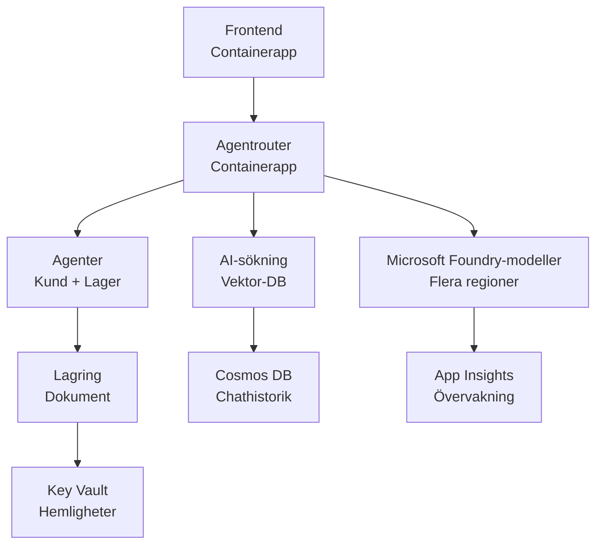

# Detaljhandels multi-agentlösning - Infrastrukturmall

**Kapitel 5: Produktionsdistributionspaket**
- **📚 Kursöversikt**: [AZD för nybörjare](../../README.md)
- **📖 Relaterat kapitel**: [Kapitel 5: Multi-Agent AI-lösningar](../../README.md#-chapter-5-multi-agent-ai-solutions-advanced)
- **📝 Scenarioguide**: [Komplett arkitektur](../retail-scenario.md)
- **🎯 Snabb distribution**: [Distribution med ett klick](../../../../examples/retail-multiagent-arm-template)

> **⚠️ ENDAST INFRASTRUKTURMALL**  
> Denna ARM-mall distribuerar **Azure-resurser** för ett multi-agent-system.  
>  
> **Vad som distribueras (15-25 minuter):**
> - ✅ Microsoft Foundry-modeller (gpt-4.1, gpt-4.1-mini, embeddings över 3 regioner)
> - ✅ AI Search-tjänst (tom, redo för indexskapande)
> - ✅ Container Apps (platshållarbilder, redo för din kod)
> - ✅ Storage, Cosmos DB, Key Vault, Application Insights
>  
> **Vad som INTE ingår (kräver utveckling):**
> - ❌ Agentimplementeringskod (Customer Agent, Inventory Agent)
> - ❌ Routinglogik och API-endpoints
> - ❌ Frontend chat-gränssnitt
> - ❌ Sökindexscheman och datapipelines
> - ❌ **Uppskattad utvecklingsinsats: 80-120 timmar**
>  
> **Använd denna mall om:**
> - ✅ Du vill provisionera Azure-infrastruktur för ett multi-agent-projekt
> - ✅ Du planerar att utveckla agentimplementation separat
> - ✅ Du behöver en produktionsredo infrastrukturbaslinje
>  
> **Använd inte om:**
> - ❌ Du förväntar dig en fungerande multi-agent-demo omedelbart
> - ❌ Du letar efter komplett exempel på applikationskod

## Översikt

Denna katalog innehåller en omfattande Azure Resource Manager (ARM)-mall för att distribuera **infrastrukturbasen** för ett multi-agent kundsupportsystem. Mallen provisionerar alla nödvändiga Azure-tjänster, korrekt konfigurerade och sammankopplade, redo för din applikationsutveckling.

**Efter distributionen kommer du att ha:** Produktionsklar Azure-infrastruktur  
**För att slutföra systemet behöver du:** Agentkod, frontendgränssnitt och datakonfiguration (se [Arkitekturguide](../retail-scenario.md))

## 🎯 Vad som distribueras

### Kärninfrastruktur (Status efter distribution)

✅ **Microsoft Foundry-modelltjänster** (Redo för API-anrop)
  - Primär region: gpt-4.1-distribution (20K TPM kapacitet)
  - Sekundär region: gpt-4.1-mini-distribution (10K TPM kapacitet)
  - Tertiär region: Text embeddings-modell (30K TPM kapacitet)
  - Utvärderingsregion: gpt-4.1 grader model (15K TPM kapacitet)
  - **Status:** Fullt funktionell - kan göra API-anrop omedelbart

✅ **Azure AI Search** (Tom - redo för konfiguration)
  - Vektor-sökfunktioner aktiverade
  - Standardnivå med 1 partition, 1 replika
  - **Status:** Tjänst körs, men kräver skapande av index
  - **Åtgärd som krävs:** Skapa sökindex med ditt schema

✅ **Azure Storage-konto** (Tomt - redo för uppladdningar)
  - Blob-containrar: `documents`, `uploads`
  - Säker konfiguration (endast HTTPS, ingen offentlig åtkomst)
  - **Status:** Redo att ta emot filer
  - **Åtgärd som krävs:** Ladda upp din produktdata och dokument

⚠️ **Container Apps-miljö** (Platshållarbilder distribuerade)
  - Agent router-app (nginx standardbild)
  - Frontend-app (nginx standardbild)
  - Autoskalning konfigurerad (0-10 instanser)
  - **Status:** Kör platshållarkontainrar
  - **Åtgärd som krävs:** Bygg och distribuera dina agentapplikationer

✅ **Azure Cosmos DB** (Tomt - redo för data)
  - Databas och container förkonfigurerade
  - Optimerad för låg latens
  - TTL aktiverat för automatisk rensning
  - **Status:** Redo att lagra chathistorik

✅ **Azure Key Vault** (Valfritt - redo för hemligheter)
  - Mjuk borttagning aktiverad
  - RBAC konfigurerat för hanterade identiteter
  - **Status:** Redo att lagra API-nycklar och anslutningssträngar

✅ **Application Insights** (Valfritt - övervakning aktiv)
  - Ansluten till Log Analytics-arbetsyta
  - Anpassade mått och aviseringar konfigurerade
  - **Status:** Redo att ta emot telemetri från dina appar

✅ **Document Intelligence** (Redo för API-anrop)
  - S0-nivå för produktionsarbetsbelastningar
  - **Status:** Redo att bearbeta uppladdade dokument

✅ **Bing Search API** (Redo för API-anrop)
  - S1-nivå för realtidssökningar
  - **Status:** Redo för webbsökfrågor

### Distribueringslägen

| Läget | OpenAI-kapacitet | Containerinstanser | Söknivå | Lagringsredundans | Bäst för |
|------|-----------------|---------------------|-------------|-------------------|----------|
| **Minimalt** | 10K-20K TPM | 0-2 repliker | Grundläggande | LRS (lokal) | Dev/test, lärande, proof-of-concept |
| **Standard** | 30K-60K TPM | 2-5 repliker | Standard | ZRS (Zon) | Produktion, måttlig trafik (<10K användare) |
| **Premium** | 80K-150K TPM | 5-10 repliker, zonredundant | Premium | GRS (Geo) | Företag, hög trafik (>10K användare), 99.99% SLA |

**Kostnadspåverkan:**
- **Minimalt → Standard:** ~4x kostnadsökning ($100-370/mo → $420-1,450/mo)
- **Standard → Premium:** ~3x kostnadsökning ($420-1,450/mo → $1,150-3,500/mo)
- **Välj baserat på:** Förväntad belastning, SLA-krav, budgetbegränsningar

**Kapacitetsplanering:**
- **TPM (Tokens Per Minute):** Totalt över alla modelldistributioner
- **Containerinstanser:** Autoskalningsintervall (min-max repliker)
- **Söknivå:** Påverkar frågeprestanda och indexstorleksgränser

## 📋 Förutsättningar

### Nödvändiga verktyg
1. **Azure CLI** (version 2.50.0 eller högre)
   ```bash
   az --version  # Kontrollera version
   az login      # Autentisera
   ```

2. **Aktiv Azure-prenumeration** med åtkomst som Owner eller Contributor
   ```bash
   az account show  # Verifiera prenumeration
   ```

### Nödvändiga Azure-kvoter

Innan distribution, verifiera att tillräckliga kvoter finns i dina målregioner:

```bash
# Kontrollera tillgängligheten för Microsoft Foundry-modeller i din region
az cognitiveservices account list-skus \
  --kind OpenAI \
  --location eastus2

# Verifiera OpenAI-kvot (exempel för gpt-4.1)
az cognitiveservices usage list \
  --location eastus2 \
  --query "[?name.value=='OpenAI.Standard.gpt-4.1']"

# Kontrollera Container Apps-kvot
az provider show \
  --namespace Microsoft.App \
  --query "resourceTypes[?resourceType=='managedEnvironments'].locations"
```

**Minimala krav på kvoter:**
- **Microsoft Foundry Models:** 3-4 modelldistributioner över regioner
  - gpt-4.1: 20K TPM (Tokens Per Minute)
  - gpt-4.1-mini: 10K TPM
  - text-embedding-ada-002: 30K TPM
  - **Obs:** gpt-4.1 kan ha väntelista i vissa regioner - kolla [modelltillgänglighet](https://learn.microsoft.com/azure/ai-services/openai/concepts/models)
- **Container Apps:** Hanterad miljö + 2-10 containerinstanser
- **AI Search:** Standardnivå (Basic otillräcklig för vektorsökning)
- **Cosmos DB:** Standardprovisionerad genomströmning

**Om kvoten är otillräcklig:**
1. Gå till Azure Portal → Quotas → Begär ökning
2. Eller använd Azure CLI:
   ```bash
   az support tickets create \
     --ticket-name "OpenAI-Quota-Increase" \
     --severity "minimal" \
     --description "Request quota increase for Microsoft Foundry Models gpt-4.1 in eastus2"
   ```
3. Överväg alternativa regioner med tillgänglighet

## 🚀 Snabb distribution

### Alternativ 1: Använda Azure CLI

```bash
# Klona eller ladda ner mallfilerna
git clone <repository-url>
cd examples/retail-multiagent-arm-template

# Gör distributionsskriptet körbart
chmod +x deploy.sh

# Distribuera med standardinställningar
./deploy.sh -g myResourceGroup

# Distribuera för produktion med premiumfunktioner
./deploy.sh -g myProdRG -e prod -m premium -l eastus2
```

### Alternativ 2: Använda Azure-portalen

[](https://portal.azure.com/#create/Microsoft.Template/uri/https%3A%2F%2Fraw.githubusercontent.com%2Fmicrosoft%2Fazd-for-beginners%2Fmain%2Fexamples%2Fretail-multiagent-arm-template%2Fazuredeploy.json)

### Alternativ 3: Använd Azure CLI direkt

```bash
# Skapa en resursgrupp
az group create --name myResourceGroup --location eastus2

# Distribuera en mall
az deployment group create \
  --resource-group myResourceGroup \
  --template-file azuredeploy.json \
  --parameters azuredeploy.parameters.json
```

## ⏱️ Distributionstidslinje

### Vad du kan förvänta dig

| Fas | Varaktighet | Vad händer |
|-------|----------|--------------||
| **Mallvalidering** | 30-60 sekunder | Azure validerar ARM-malls syntax och parametrar |
| **Resursgruppsinställning** | 10-20 sekunder | Skapar resursgrupp (om nödvändigt) |
| **OpenAI-provisionering** | 5-8 minuter | Skapar 3-4 OpenAI-konton och distribuerar modeller |
| **Container Apps** | 3-5 minuter | Skapar miljö och distribuerar platshållarkontainrar |
| **Search & Storage** | 2-4 minuter | Provisionerar AI Search-tjänst och storagekonton |
| **Cosmos DB** | 2-3 minuter | Skapar databas och konfigurerar containrar |
| **Övervakningsinställning** | 2-3 minuter | Ställer in Application Insights och Log Analytics |
| **RBAC-konfiguration** | 1-2 minuter | Konfigurerar hanterade identiteter och behörigheter |
| **Total distribution** | **15-25 minuter** | Komplett infrastruktur redo |

**Efter distribution:**
- ✅ **Infrastruktur redo:** Alla Azure-tjänster provisionerade och igång
- ⏱️ **Applikationsutveckling:** 80-120 timmar (ditt ansvar)
- ⏱️ **Indexkonfiguration:** 15-30 minuter (kräver ditt schema)
- ⏱️ **Datauppladdning:** Varierar beroende på datasetstorlek
- ⏱️ **Testning & validering:** 2-4 timmar

---

## ✅ Verifiera distributionsframgång

### Steg 1: Kontrollera resursprovisionering (2 minuter)

```bash
# Verifiera att alla resurser har distribuerats framgångsrikt
az resource list \
  --resource-group myResourceGroup \
  --query "[?provisioningState!='Succeeded'].{Name:name, Status:provisioningState, Type:type}" \
  --output table
```

**Förväntat:** Tom tabell (alla resurser visar "Succeeded" status)

### Steg 2: Verifiera Microsoft Foundry Models-distributioner (3 minuter)

```bash
# Lista alla OpenAI-konton
az cognitiveservices account list \
  --resource-group myResourceGroup \
  --query "[?kind=='OpenAI'].{Name:name, Location:location, Status:properties.provisioningState}" \
  --output table

# Kontrollera modellutplaceringar för den primära regionen
OPENAI_NAME=$(az cognitiveservices account list \
  --resource-group myResourceGroup \
  --query "[?kind=='OpenAI'] | [0].name" -o tsv)

az cognitiveservices account deployment list \
  --name $OPENAI_NAME \
  --resource-group myResourceGroup \
  --output table
```

**Förväntat:** 
- 3-4 OpenAI-konton (primär, sekundär, tertiär, utvärderingsregioner)
- 1-2 modelldistributioner per konto (gpt-4.1, gpt-4.1-mini, text-embedding-ada-002)

### Steg 3: Testa infrastrukturendpoints (5 minuter)

```bash
# Hämta Container App-URL:er
az containerapp list \
  --resource-group myResourceGroup \
  --query "[].{Name:name, URL:properties.configuration.ingress.fqdn, Status:properties.runningStatus}" \
  --output table

# Testa router-ändpunkt (platshållarbild kommer att svara)
ROUTER_URL=$(az containerapp show \
  --name retail-router \
  --resource-group myResourceGroup \
  --query "properties.configuration.ingress.fqdn" -o tsv)

echo "Testing: https://$ROUTER_URL"
curl -I https://$ROUTER_URL || echo "Container running (placeholder image - expected)"
```

**Förväntat:** 
- Container Apps visar "Running"-status
- Platshållar-nginx svarar med HTTP 200 eller 404 (ingen applikationskod ännu)

### Steg 4: Verifiera Microsoft Foundry Models API-åtkomst (3 minuter)

```bash
# Hämta OpenAI-slutpunkt och nyckel
OPENAI_ENDPOINT=$(az cognitiveservices account show \
  --name $OPENAI_NAME \
  --resource-group myResourceGroup \
  --query "properties.endpoint" -o tsv)

OPENAI_KEY=$(az cognitiveservices account keys list \
  --name $OPENAI_NAME \
  --resource-group myResourceGroup \
  --query "key1" -o tsv)

# Testa driftsättningen av gpt-4.1
curl "${OPENAI_ENDPOINT}openai/deployments/gpt-4.1/chat/completions?api-version=2024-08-01-preview" \
  -H "Content-Type: application/json" \
  -H "api-key: $OPENAI_KEY" \
  -d '{
    "messages": [{"role": "user", "content": "Say hello"}],
    "max_tokens": 10
  }'
```

**Förväntat:** JSON-svar med chatkomplettering (bekräftar att OpenAI fungerar)

### Vad som fungerar vs. vad som inte fungerar

**✅ Fungerar efter distribution:**
- Microsoft Foundry-modeller distribuerade och accepterar API-anrop
- AI Search-tjänst körs (tom, inga index än)
- Container Apps körs (platshållar nginx-bilder)
- Storagekonton åtkomliga och redo för uppladdningar
- Cosmos DB redo för dataoperationer
- Application Insights samlar in infrastrukturtelemetri
- Key Vault redo för sekretesslagring

**❌ Fungerar inte än (kräver utveckling):**
- Agent-endpoints (ingen applikationskod distribuerad)
- Chattfunktionalitet (kräver frontend + backend-implementation)
- Sökfrågor (inget sökindex skapat ännu)
- Dokumentbearbetningspipeline (inga data uppladdade)
- Anpassad telemetri (kräver applikationsinstrumentering)

**Nästa steg:** Se [Efter-distributionskonfiguration](../../../../examples/retail-multiagent-arm-template) för att utveckla och distribuera din applikation

---

## ⚙️ Konfigurationsalternativ

### Mallparametrar

| Parameter | Typ | Standard | Beskrivning |
|-----------|------|---------|-------------|
| `projectName` | string | "retail" | Prefix för alla resursnamn |
| `location` | string | Resource group location | Plats för resursgruppen |
| `secondaryLocation` | string | "westus2" | Sekundär region för multi-regiondistribution |
| `tertiaryLocation` | string | "francecentral" | Region för embeddings-modell |
| `environmentName` | string | "dev" | Miljöbeteckning (dev/staging/prod) |
| `deploymentMode` | string | "standard" | Distributionskonfiguration (minimal/standard/premium) |
| `enableMultiRegion` | bool | true | Aktivera multi-regiondistribution |
| `enableMonitoring` | bool | true | Aktivera Application Insights och loggning |
| `enableSecurity` | bool | true | Aktivera Key Vault och förbättrad säkerhet |

### Anpassa parametrar

Redigera `azuredeploy.parameters.json`:

```json
{
  "$schema": "https://schema.management.azure.com/schemas/2019-04-01/deploymentParameters.json#",
  "contentVersion": "1.0.0.0",
  "parameters": {
    "projectName": {
      "value": "mycompany"
    },
    "environmentName": {
      "value": "prod"
    },
    "deploymentMode": {
      "value": "premium"
    },
    "location": {
      "value": "eastus2"
    }
  }
}
```

## 🏗️ Arkitekturöversikt


## 📖 Användning av distributionsskriptet

Skriptet `deploy.sh` ger en interaktiv distributionsupplevelse:

```bash
# Visa hjälp
./deploy.sh --help

# Grundläggande distribution
./deploy.sh -g myResourceGroup

# Avancerad distribution med anpassade inställningar
./deploy.sh \
  -g myProductionRG \
  -p companyname \
  -e prod \
  -m premium \
  -l eastus2

# Utvecklingsdistribution utan flera regioner
./deploy.sh \
  -g myDevRG \
  -e dev \
  -m minimal \
  --no-multi-region \
  --no-security
```

### Skriptfunktioner

- ✅ **Validering av förutsättningar** (Azure CLI, inloggningsstatus, mallfiler)
- ✅ **Hantering av resursgrupp** (skapar om den inte finns)
- ✅ **Mallvalidering** före distribution
- ✅ **Statusövervakning** med färgvisning
- ✅ **Distributionsutdata** visas
- ✅ **Vägledning efter distribution**

## 📊 Övervaka distributionen

### Kontrollera distributionsstatus

```bash
# Lista utplaceringar
az deployment group list --resource-group myResourceGroup --output table

# Hämta utplaceringsdetaljer
az deployment group show \
  --resource-group myResourceGroup \
  --name retail-deployment-YYYYMMDD-HHMMSS

# Följ utplaceringens framsteg
az deployment group create \
  --resource-group myResourceGroup \
  --template-file azuredeploy.json \
  --parameters azuredeploy.parameters.json \
  --verbose
```

### Distributionsutdata

Efter lyckad distribution är följande utdata tillgängliga:

- **Frontend-URL**: Offentlig slutpunkt för webbgränssnittet
- **Router-URL**: API-slutpunkt för agentrouter
- **OpenAI-slutpunkter**: Primära och sekundära OpenAI-tjänstslutpunkter
- **Search-tjänst**: Azure AI Search-tjänstens slutpunkt
- **Storagekonto**: Namn på storagekontot för dokument
- **Key Vault**: Namn på Key Vault (om aktiverat)
- **Application Insights**: Namn på övervakningstjänsten (om aktiverat)

## 🔧 Efter distribution: Nästa steg
> **📝 Viktigt:** Infrastruktur har distribuerats, men du måste utveckla och distribuera applikationskod.

### Fas 1: Utveckla agentapplikationer (ditt ansvar)

ARM-mallen skapar **tomma Container Apps** med platshållarbilden nginx. Du måste:

**Krävd utveckling:**
1. **Agentimplementering** (30-40 timmar)
   - Kundtjänstagent med gpt-4.1-integration
   - Lageragent med gpt-4.1-mini-integration
   - Agentdirigeringslogik

2. **Frontendutveckling** (20-30 timmar)
   - Chattgränssnitt (React/Vue/Angular)
   - Funktion för filuppladdning
   - Svarsrendering och formatering

3. **Backendtjänster** (12-16 timmar)
   - FastAPI- eller Express-router
   - Mellanprogram för autentisering
   - Telemetriintegrering

**Se:** [Arkitekturguide](../retail-scenario.md) för detaljerade implementeringsmönster och kodexempel

### Fas 2: Konfigurera AI-sökindex (15-30 minuter)

Skapa en sökindex som matchar din datamodell:

```bash
# Hämta söktjänstens detaljer
SEARCH_NAME=$(az search service list \
  --resource-group myResourceGroup \
  --query "[0].name" -o tsv)

SEARCH_KEY=$(az search admin-key show \
  --service-name $SEARCH_NAME \
  --resource-group myResourceGroup \
  --query "primaryKey" -o tsv)

# Skapa index med ditt schema (exempel)
curl -X POST "https://${SEARCH_NAME}.search.windows.net/indexes?api-version=2023-11-01" \
  -H "Content-Type: application/json" \
  -H "api-key: ${SEARCH_KEY}" \
  -d '{
    "name": "products",
    "fields": [
      {"name": "id", "type": "Edm.String", "key": true},
      {"name": "title", "type": "Edm.String", "searchable": true},
      {"name": "content", "type": "Edm.String", "searchable": true},
      {"name": "category", "type": "Edm.String", "filterable": true},
      {"name": "content_vector", "type": "Collection(Edm.Single)", 
       "searchable": true, "dimensions": 1536, "vectorSearchProfile": "default"}
    ],
    "vectorSearch": {
      "algorithms": [{"name": "default", "kind": "hnsw"}],
      "profiles": [{"name": "default", "algorithm": "default"}]
    }
  }'
```

**Resurser:**
- [Design av AI-sökindexschema](https://learn.microsoft.com/azure/search/search-what-is-an-index)
- [Konfiguration för vektorsökning](https://learn.microsoft.com/azure/search/vector-search-how-to-create-index)

### Fas 3: Ladda upp dina data (Tidsåtgång varierar)

När du har produktdata och dokument:

```bash
# Hämta lagringskontots uppgifter
STORAGE_NAME=$(az storage account list \
  --resource-group myResourceGroup \
  --query "[0].name" -o tsv)

STORAGE_KEY=$(az storage account keys list \
  --account-name $STORAGE_NAME \
  --resource-group myResourceGroup \
  --query "[0].value" -o tsv)

# Ladda upp dina dokument
az storage blob upload-batch \
  --destination documents \
  --source /path/to/your/product/docs \
  --account-name $STORAGE_NAME \
  --account-key $STORAGE_KEY

# Exempel: Ladda upp en enskild fil
az storage blob upload \
  --container-name documents \
  --name "product-manual.pdf" \
  --file /path/to/product-manual.pdf \
  --account-name $STORAGE_NAME \
  --account-key $STORAGE_KEY
```

### Fas 4: Bygg och distribuera dina applikationer (8-12 timmar)

När du har utvecklat din agentkod:

```bash
# 1. Skapa Azure Container Registry (om det behövs)
az acr create \
  --name myregistry \
  --resource-group myResourceGroup \
  --sku Basic

# 2. Bygg och pusha agentrouter-avbildning
docker build -t myregistry.azurecr.io/agent-router:v1 /path/to/your/router/code
az acr login --name myregistry
docker push myregistry.azurecr.io/agent-router:v1

# 3. Bygg och pusha frontend-avbildning
docker build -t myregistry.azurecr.io/frontend:v1 /path/to/your/frontend/code
docker push myregistry.azurecr.io/frontend:v1

# 4. Uppdatera Container Apps med dina avbildningar
az containerapp update \
  --name retail-router \
  --resource-group myResourceGroup \
  --image myregistry.azurecr.io/agent-router:v1

az containerapp update \
  --name retail-frontend \
  --resource-group myResourceGroup \
  --image myregistry.azurecr.io/frontend:v1

# 5. Konfigurera miljövariabler
az containerapp update \
  --name retail-router \
  --resource-group myResourceGroup \
  --set-env-vars \
    OPENAI_ENDPOINT=secretref:openai-endpoint \
    OPENAI_KEY=secretref:openai-key \
    SEARCH_ENDPOINT=secretref:search-endpoint \
    SEARCH_KEY=secretref:search-key
```

### Fas 5: Testa din applikation (2-4 timmar)

```bash
# Hämta din applikations-URL
ROUTER_URL=$(az containerapp show \
  --name retail-router \
  --resource-group myResourceGroup \
  --query "properties.configuration.ingress.fqdn" -o tsv)

# Testa agentens slutpunkt (när din kod har distribuerats)
curl -X POST "https://${ROUTER_URL}/chat" \
  -H "Content-Type: application/json" \
  -d '{
    "message": "Hello, I need help with my order",
    "agent": "customer"
  }'

# Kontrollera applikationens loggar
az containerapp logs show \
  --name retail-router \
  --resource-group myResourceGroup \
  --follow
```

### Implementeringsresurser

**Arkitektur och design:**
- 📖 [Komplett arkitekturguide](../retail-scenario.md) - Detaljerade implementeringsmönster
- 📖 [Designmönster för multi-agent-system](https://learn.microsoft.com/azure/architecture/ai-ml/guide/multi-agent-systems)

**Kodexempel:**
- 🔗 [Microsoft Foundry Models Chat-exempel](https://github.com/Azure-Samples/azure-search-openai-demo) - RAG-mönster
- 🔗 [Semantic Kernel](https://github.com/microsoft/semantic-kernel) - Agentramverk (C#)
- 🔗 [LangChain Azure](https://github.com/langchain-ai/langchain) - Agentorkestrering (Python)
- 🔗 [AutoGen](https://github.com/microsoft/autogen) - Fleragentssamtal

**Beräknad total arbetsinsats:**
- Distribution av infrastruktur: 15-25 minuter (✅ Slutförd)
- Applikationsutveckling: 80-120 timmar (🔨 Ditt arbete)
- Testning och optimering: 15-25 timmar (🔨 Ditt arbete)

## 🛠️ Felsökning

### Vanliga problem

#### 1. Microsoft Foundry Models kvot överskriden

```bash
# Kontrollera aktuell kvotanvändning
az cognitiveservices usage list --location eastus2

# Begär kvotökning
az support tickets create \
  --ticket-name "OpenAI-Quota-Increase" \
  --severity "minimal" \
  --description "Request quota increase for Microsoft Foundry Models in region X"
```

#### 2. Distribution av Container Apps misslyckades

```bash
# Kontrollera containerappens loggar
az containerapp logs show \
  --name retail-router \
  --resource-group myResourceGroup \
  --follow

# Starta om containerappen
az containerapp revision restart \
  --name retail-router \
  --resource-group myResourceGroup
```

#### 3. Initiering av söktjänst

```bash
# Verifiera söktjänstens status
az search service show \
  --name <search-service-name> \
  --resource-group myResourceGroup

# Testa söktjänstens anslutning
curl -X GET "https://<search-service-name>.search.windows.net/indexes?api-version=2023-11-01" \
  -H "api-key: <search-admin-key>"
```

### Validering av distribution

```bash
# Validera att alla resurser är skapade
az resource list \
  --resource-group myResourceGroup \
  --output table

# Kontrollera resursernas hälsa
az resource list \
  --resource-group myResourceGroup \
  --query "[?provisioningState!='Succeeded'].{Name:name, Status:provisioningState, Type:type}" \
  --output table
```

## 🔐 Säkerhetsöverväganden

### Nyckelhantering
- Alla hemligheter lagras i Azure Key Vault (när det är aktiverat)
- Container Apps använder hanterad identitet för autentisering
- Lagringskonton har säkra standardinställningar (endast HTTPS, ingen offentlig blobåtkomst)

### Nätverkssäkerhet
- Container Apps använder internt nätverk där det är möjligt
- Söktjänsten konfigurerad med alternativet privata slutpunkter
- Cosmos DB konfigurerat med minsta nödvändiga behörigheter

### RBAC-konfiguration
```bash
# Tilldela nödvändiga roller för den hanterade identiteten
az role assignment create \
  --assignee <container-app-managed-identity> \
  --role "Cognitive Services OpenAI User" \
  --scope <openai-resource-id>
```

## 💰 Kostnadsoptimering

### Kostnadsestimat (månatligt, USD)

| Läge | OpenAI | Container Apps | Sök | Lagring | Total uppskattning |
|------|--------|----------------|--------|---------|------------|
| Minimal | $50-200 | $20-50 | $25-100 | $5-20 | $100-370 |
| Standard | $200-800 | $100-300 | $100-300 | $20-50 | $420-1450 |
| Premium | $500-2000 | $300-800 | $300-600 | $50-100 | $1150-3500 |

### Kostnadsövervakning

```bash
# Ställ in budgetvarningar
az consumption budget create \
  --account-name <subscription-id> \
  --budget-name "retail-budget" \
  --amount 500 \
  --time-grain Monthly \
  --start-date 2024-01-01 \
  --end-date 2024-12-31
```

## 🔄 Uppdateringar och underhåll

### Malluppdateringar
- Versionshantera ARM-mallfilerna
- Testa ändringar i utvecklingsmiljön först
- Använd inkrementellt distributionsläge för uppdateringar

### Resursuppdateringar
```bash
# Uppdatera med nya parametrar
az deployment group create \
  --resource-group myResourceGroup \
  --template-file azuredeploy.json \
  --parameters azuredeploy.parameters.json \
  --mode Incremental
```

### Säkerhetskopiering och återställning
- Automatisk säkerhetskopiering för Cosmos DB aktiverad
- Key Vault soft delete aktiverat
- Revisioner av Container Apps bevaras för återställning

## 📞 Support

- **Mallproblem**: [GitHub Issues](https://github.com/microsoft/azd-for-beginners/issues)
- **Azure-support**: [Azure Support Portal](https://portal.azure.com/#blade/Microsoft_Azure_Support/HelpAndSupportBlade)
- **Community**: [Azure AI Discord](https://discord.gg/microsoft-azure)

---

**⚡ Redo att distribuera din multi-agentlösning?**

Börja med: `./deploy.sh -g myResourceGroup`

---

<!-- CO-OP TRANSLATOR DISCLAIMER START -->
Ansvarsfriskrivning:
Detta dokument har översatts med hjälp av AI-översättningstjänsten [Co-op Translator](https://github.com/Azure/co-op-translator). Även om vi strävar efter noggrannhet bör du vara medveten om att automatiska översättningar kan innehålla fel eller brister. Den ursprungliga versionen av dokumentet på dess originalspråk ska anses vara den auktoritativa källan. För kritisk information rekommenderas en professionell mänsklig översättning. Vi ansvarar inte för eventuella missförstånd eller feltolkningar som uppstår till följd av användningen av denna översättning.
<!-- CO-OP TRANSLATOR DISCLAIMER END -->