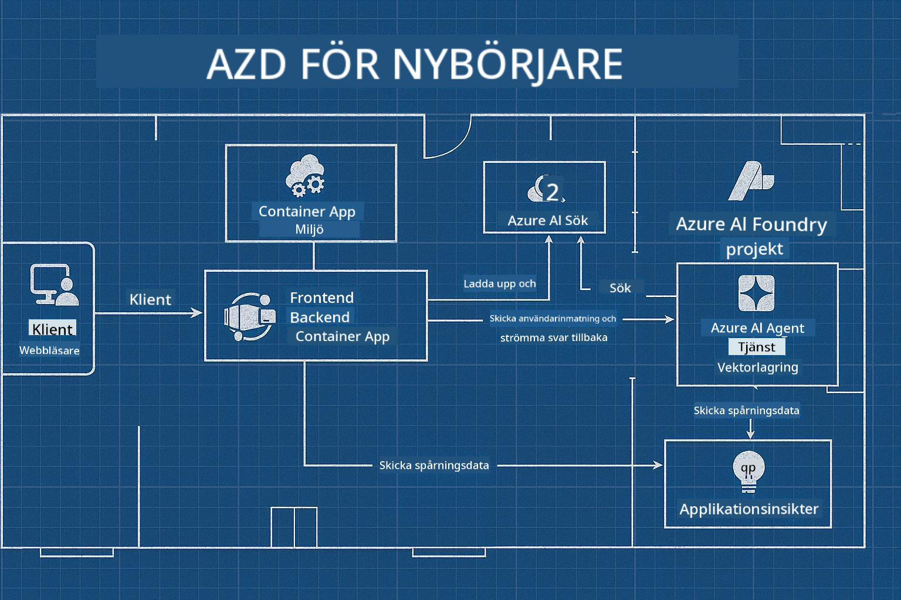

<!--
CO_OP_TRANSLATOR_METADATA:
{
  "original_hash": "245d24997bbcf2bae93bb2a503845d37",
  "translation_date": "2025-09-23T11:56:24+00:00",
  "source_file": "workshop/README.md",
  "language_code": "sv"
}
-->
# AZD för AI-utvecklare Workshop

## AZD Mallar

Att bygga en AI-applikation av företagsklass för ditt specifika scenario är mycket som att bygga ditt eget hem. Du kan designa det själv, bygga det sten för sten och ta ansvar för att säkerställa att det uppfyller alla styrnings- och utvecklingsriktlinjer.

**ELLER ....** 

Du kan arbeta med en arkitekt som kan ge dig en _ritning_ för ett starthem och sedan arbeta med dig för att _anpassa_ det efter dina behov. Detta gör att du kan fokusera på vad som gör **ditt hem** speciellt, medan den underliggande elen, VVS och andra beroenden tas om hand av experterna.

**Detta är tillvägagångssättet bakom [AI App Templates](https://ai.azure.com/templates)** - en serie ritningar för att bygga olika typer av AI-applikations-"hem" beroende på dina kärnbehov och beroenden.

## Anpassning av mallar

Mallar är designade för att fungera med [Azure AI Foundry](https://ai.azure.com). Tänk på denna plattform som din "byggentreprenör" med tillgång till alla resurser, verktyg och expertis du behöver för att få jobbet gjort!

Allt du behöver göra är att välja [dina startmallar](https://learn.microsoft.com/en-us/azure/ai-foundry/how-to/develop/ai-template-get-started). Till exempel kommer vi att fokusera på _Get Started with AI Agents_-mallen för att bygga ett "Agentiskt AI-hem" som är utrustat med funktioner som AI-sökning, Red Teaming, utvärderingar, spårning, övervakning och mer!



Allt du behöver är att boka tid med arkitekten för att guida dig genom anpassningsprocessen. [GitHub Copilot för Azure](https://learn.microsoft.com/en-us/azure/developer/github-copilot-azure/get-started) kan vara den guiden. Bara "chatta med det" för att:

- Lära dig om Azure-funktionerna i din mall
- Distribuera Azure-resurser
- Få information om din distribution
- Diagnostisera och felsöka problem!

I denna workshop lär vi oss att _dekonstruera_ den befintliga mallen (för att förstå vad den erbjuder) och sedan _anpassa_ den (för att uppfylla våra krav) - steg för steg.

AI-mallar **får det att fungera** - genom att slutföra workshopen kommer du att lära dig att **göra det till ditt eget**

----

**Workshopnavigering**
- **📚 Kursens startsida**: [AZD För Nybörjare](../README.md)
- **📖 Relaterade kapitel**: Täcker [Kapitel 1](../README.md#-chapter-1-foundation--quick-start), [Kapitel 2](../README.md#-chapter-2-ai-first-development-recommended-for-ai-developers), och [Kapitel 5](../README.md#-chapter-5-multi-agent-ai-solutions-advanced)
- **🛠️ Praktisk labb**: [AI Workshop Lab](../docs/ai-foundry/ai-workshop-lab.md)
- **🚀 Nästa steg**: [Workshop Lab-moduler](../../../workshop)

Välkommen till den praktiska workshopen för att lära dig Azure Developer CLI (AZD) med fokus på AI-applikationsdistribution. Denna workshop är utformad för att ta dig från AZD-grunderna till att distribuera produktionsklara AI-lösningar.

## Workshopöversikt

**Varaktighet:** 2-3 timmar  
**Nivå:** Nybörjare till Medel  
**Förkunskaper:** Grundläggande kunskaper om Azure, kommandoradsverktyg och AI-koncept

### Vad du kommer att lära dig

- **AZD-grunder**: Förstå Infrastruktur som Kod med AZD
- 🤖 **AI-tjänsteintegration**: Distribuera Azure OpenAI, AI-sökning och andra AI-tjänster
- **Containerdistribution**: Använda Azure Container Apps för AI-applikationer
- **Säkerhetsbästa praxis**: Implementera Managed Identity och säkra konfigurationer
- **Övervakning och insyn**: Ställa in Application Insights för AI-arbetsbelastningar
- **Produktionsmönster**: Strategier för företagsklara distributioner

## Workshopstruktur

### Modul 1: AZD-grunder (30 minuter)
- Installera och konfigurera AZD
- Förstå AZD-projektstruktur
- Din första AZD-distribution
- **Lab**: Distribuera en enkel webbapplikation

### Modul 2: Azure OpenAI-integration (45 minuter)
- Ställa in Azure OpenAI-resurser
- Strategier för modelldistribution
- Konfigurera API-åtkomst och autentisering
- **Lab**: Distribuera en chattapplikation med GPT-4

### Modul 3: RAG-applikationer (45 minuter)
- Azure AI-sökningsintegration
- Dokumentbearbetning med Azure Document Intelligence
- Vektorrepresentationer och semantisk sökning
- **Lab**: Bygg ett dokument Q&A-system

### Modul 4: Produktionsdistribution (30 minuter)
- Konfiguration av Container Apps
- Skalning och prestandaoptimering
- Övervakning och loggning
- **Lab**: Distribuera till produktion med insyn

### Modul 5: Avancerade mönster (15 minuter)
- Distributioner för flera miljöer
- CI/CD-integration
- Kostnadsoptimeringsstrategier
- **Sammanfattning**: Checklista för produktionsberedskap

## Förkunskaper

### Nödvändiga verktyg

Installera dessa verktyg innan workshopen:

```bash
# Azure Developer CLI
curl -fsSL https://aka.ms/install-azd.sh | bash

# Azure CLI
curl -sL https://aka.ms/InstallAzureCLIDeb | sudo bash

# Git
sudo apt-get install git

# Docker
curl -fsSL https://get.docker.com -o get-docker.sh
sudo sh get-docker.sh

# Python 3.10+
sudo apt-get install python3.10 python3.10-venv python3-pip
```

### Azure-kontoinställning

1. **Azure-prenumeration**: [Registrera dig gratis](https://azure.microsoft.com/free/)
2. **Azure OpenAI-åtkomst**: [Begär åtkomst](https://aka.ms/oai/access)
3. **Nödvändiga behörigheter**:
   - Contributor-roll på prenumeration eller resursgrupp
   - User Access Administrator (för RBAC-uppdrag)

### Verifiera förkunskaper

Kör detta skript för att verifiera din inställning:

```bash
#!/bin/bash
echo "Verifying workshop prerequisites..."

# Check AZD installation
if command -v azd &> /dev/null; then
    echo "✅ Azure Developer CLI: $(azd --version)"
else
    echo "❌ Azure Developer CLI not found"
fi

# Check Azure CLI
if command -v az &> /dev/null; then
    echo "✅ Azure CLI: $(az --version | head -n1)"
else
    echo "❌ Azure CLI not found"
fi

# Check Docker
if command -v docker &> /dev/null; then
    echo "✅ Docker: $(docker --version)"
else
    echo "❌ Docker not found"
fi

# Check Python
if command -v python3 &> /dev/null; then
    echo "✅ Python: $(python3 --version)"
else
    echo "❌ Python 3 not found"
fi

# Check Azure login
if az account show &> /dev/null; then
    echo "✅ Azure: Logged in as $(az account show --query user.name -o tsv)"
else
    echo "❌ Azure: Not logged in (run 'az login')"
fi

echo "Setup verification complete!"
```

## Workshopmaterial

### Labövningar

Varje modul innehåller praktiska labbar med startkod och steg-för-steg-instruktioner:

- **[lab-1-azd-basics/](../../../workshop/lab-1-azd-basics)** - Din första AZD-distribution
- **[lab-2-openai-chat/](../../../workshop/lab-2-openai-chat)** - Chattapplikation med Azure OpenAI
- **[lab-3-rag-search/](../../../workshop/lab-3-rag-search)** - RAG-applikation med AI-sökning
- **[lab-4-production/](../../../workshop/lab-4-production)** - Produktionsdistributionsmönster
- **[lab-5-advanced/](../../../workshop/lab-5-advanced)** - Avancerade distributionsscenarier

### Referensmaterial

- **[AI Foundry Integration Guide](../docs/ai-foundry/azure-ai-foundry-integration.md)** - Omfattande integrationsmönster
- **[AI Model Deployment Guide](../docs/ai-foundry/ai-model-deployment.md)** - Bästa praxis för modelldistribution
- **[Production AI Practices](../docs/ai-foundry/production-ai-practices.md)** - Företagsdistributionsmönster
- **[AI Troubleshooting Guide](../docs/troubleshooting/ai-troubleshooting.md)** - Vanliga problem och lösningar

### Exempelmallar

Snabbstartmallar för vanliga AI-scenarier:

```
workshop/templates/
├── minimal-chat/          # Basic OpenAI chat app
├── rag-application/       # RAG with AI Search
├── multi-model/          # Multiple AI services
└── production-ready/     # Enterprise template
```

## Kom igång

### Alternativ 1: GitHub Codespaces (Rekommenderas)

Det snabbaste sättet att starta workshopen:

[](https://github.com/codespaces/new?hide_repo_select=true&ref=main&repo=YOUR_REPO_ID)

### Alternativ 2: Lokal utveckling

1. **Klona workshopens repository:**
```bash
git clone https://github.com/YOUR_ORG/AZD-for-beginners.git
cd AZD-for-beginners/workshop
```

2. **Logga in på Azure:**
```bash
az login
azd auth login
```

3. **Börja med Lab 1:**
```bash
cd lab-1-azd-basics
cat README.md  # Follow the instructions
```

### Alternativ 3: Instruktörsledd workshop

Om du deltar i en instruktörsledd session:

- 🎥 **Workshopinspelning**: [Tillgänglig på begäran](https://aka.ms/azd-ai-workshop)
- 💬 **Discord-community**: [Gå med för live-support](https://aka.ms/foundry/discord)
- **Workshopfeedback**: [Dela din upplevelse](https://aka.ms/azd-workshop-feedback)

## Workshopens tidslinje

### Självstudier (3 timmar)

```
⏰ 00:00 - 00:30  Module 1: AZD Foundations
⏰ 00:30 - 01:15  Module 2: Azure OpenAI Integration
⏰ 01:15 - 02:00  Module 3: RAG Applications
⏰ 02:00 - 02:30  Module 4: Production Deployment
⏰ 02:30 - 02:45  Module 5: Advanced Patterns
⏰ 02:45 - 03:00  Q&A and Next Steps
```

### Instruktörsledd session (2,5 timmar)

```
⏰ 00:00 - 00:15  Welcome & Prerequisites Check
⏰ 00:15 - 00:40  Module 1: Live Demo + Lab
⏰ 00:40 - 01:20  Module 2: OpenAI Integration
⏰ 01:20 - 01:30  Break
⏰ 01:30 - 02:10  Module 3: RAG Applications
⏰ 02:10 - 02:30  Module 4: Production Patterns
⏰ 02:30 - 02:45  Module 5: Advanced Topics
⏰ 02:45 - 03:00  Q&A and Resources
```

## Framgångskriterier

I slutet av denna workshop kommer du att kunna:

✅ **Distribuera AI-applikationer** med AZD-mallar  
✅ **Konfigurera Azure OpenAI**-tjänster med korrekt säkerhet  
✅ **Bygga RAG-applikationer** med Azure AI-sökningsintegration  
✅ **Implementera produktionsmönster** för företagsklara AI-arbetsbelastningar  
✅ **Övervaka och felsöka** AI-applikationsdistributioner  
✅ **Tillämpa kostnadsoptimering** för AI-arbetsbelastningar  

## Community & Support

### Under workshopen

- 🙋 **Frågor**: Använd workshopchatten eller räck upp handen
- 🐛 **Problem**: Kolla [felsökningsguiden](../docs/troubleshooting/ai-troubleshooting.md)
- **Tips**: Dela upptäckter med andra deltagare

### Efter workshopen

- 💬 **Discord**: [Azure AI Foundry Community](https://aka.ms/foundry/discord)
- **GitHub Issues**: [Rapportera mallproblem](https://github.com/YOUR_ORG/AZD-for-beginners/issues)
- 📧 **Feedback**: [Workshopens utvärderingsformulär](https://aka.ms/azd-workshop-feedback)

## Nästa steg

### Fortsätt lära dig

1. **Avancerade scenarier**: Utforska [distributioner för flera regioner](../docs/ai-foundry/production-ai-practices.md#multi-region-deployment)
2. **CI/CD-integration**: Ställ in [GitHub Actions-arbetsflöden](../docs/deployment/github-actions.md)
3. **Anpassade mallar**: Skapa dina egna [AZD-mallar](../docs/getting-started/custom-templates.md)

### Tillämpa i dina projekt

1. **Bedömning**: Använd vår [beredskapschecklista](./production-readiness-checklist.md)
2. **Mallar**: Börja med våra [AI-specifika mallar](../../../workshop/templates)
3. **Support**: Gå med i [Azure AI Foundry Discord](https://aka.ms/foundry/discord)

### Dela din framgång

- ⭐ **Stjärnmärk repositoryt** om denna workshop hjälpte dig
- 🐦 **Dela på sociala medier** med #AzureDeveloperCLI #AzureAI
- 📝 **Skriv ett blogginlägg** om din AI-distributionsresa

---

## Workshopfeedback

Din feedback hjälper oss att förbättra workshopupplevelsen:

| Aspekt | Betyg (1-5) | Kommentarer |
|--------|--------------|----------|
| Innehållskvalitet | ⭐⭐⭐⭐⭐ | |
| Praktiska labbar | ⭐⭐⭐⭐⭐ | |
| Dokumentation | ⭐⭐⭐⭐⭐ | |
| Svårighetsnivå | ⭐⭐⭐⭐⭐ | |
| Övergripande upplevelse | ⭐⭐⭐⭐⭐ | |

**Skicka feedback**: [Workshopens utvärderingsformulär](https://aka.ms/azd-workshop-feedback)

---

**Föregående:** [AI Troubleshooting Guide](../docs/troubleshooting/ai-troubleshooting.md) | **Nästa:** Börja med [Lab 1: AZD Basics](../../../workshop/lab-1-azd-basics)

**Redo att börja bygga AI-applikationer med AZD?**

[Börja Lab 1: AZD Foundations →](./lab-1-azd-basics/README.md)

---

